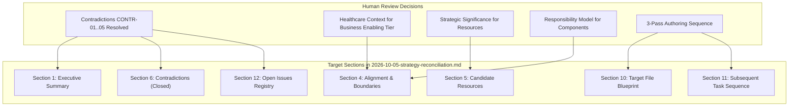

# Requirements

### Overview & Goals
The objective of this task is to close out the Strategy reconciliation activity by updating `.junie/reports/2026-10-05-strategy-reconciliation.md` to reflect formal architectural review decisions. Updating the reconciliation report to serve as a definitive, unambiguous baseline before authoring canonical markdown in `docs/markdown/02-strategy/` maximizes net utilitarian value: it eliminates architectural ambiguity, prevents the propagation of superseded technical mechanisms into foundational documentation, avoids costly downstream engineering rework, and ensures high fidelity between strategic intent and clinical safety across regional health networks.

This is an analytical update confined strictly to the reconciliation report. No canonical Strategy files, LaTeX sources, or production code will be modified or authored during this close-out step.

### Scope
- **In Scope**:
  - Updating `.junie/reports/2026-10-05-strategy-reconciliation.md` to record the resolution of candidate contradictions CONTR-01 through CONTR-05.
  - Recording the precise architectural definitions for Mneme (runtime access/governance of information, relationships, context, and state) and Mnemosyne (durable preservation and recovery of information and state), decoupling them from simplistic "ephemeral vs. durable" labels or caching mechanisms.
  - Formulating the patient identity scope decision: Harmonia 1.x/2.x does not provide authoritative master-patient identity reconciliation (EMPI), focusing instead on correlation, association, resolution, provenance, and federation, while leaving full EMPI capabilities as an open candidate for Harmonia 3.x.
  - Correcting the Business Enabling Capability Tier interpretation in Section 4.2 to represent true healthcare operational contexts (e.g., Clinic/Ward/Theatre Operations, Inpatient/Outpatient Delivery) rather than low-level integration platform mechanics.
  - Refining Enterprise Capabilities (EC-01..EC-13) to represent reusable architectural functionality independent of implementation mechanisms (threads, queues, brokers).
  - Updating candidate ArchiMate Strategy Resources from "recommended inclusion" to "candidates requiring classification" based on the strategic significance principle.
  - Clarifying that component boundary diagrams represent a strategic responsibility model rather than an approved runtime call topology.
  - Replacing the proposed `multi-tier-capability-map.md` with `capability-tier-model.md` to explain tiers and derivation without attempting an exhaustive NxM mapping.
  - Reclassifying the 5-stage clinical flow as historical runtime processing evidence rather than the canonical strategic Clinical Value Stream.
  - Replacing the 7-task downstream sequence with the approved 3-pass authoring structure (Pass A: Foundation & Capabilities; Pass B: Resources, Courses of Action & Responsibility Views; Pass C: Clinical Value Stream & Traceability).
  - Updating Section 12 (Open Issues) to remove resolved contradictions and retain only genuine unresolved architectural items.
- **Out of Scope**:
  - Authoring or modifying any files under `docs/markdown/02-strategy/` (Authoring Pass A will be undertaken in subsequent bounded tasks).
  - Modifying LaTeX publications (`docs/latex/`) or generating ODT/PDF documents.
  - Creating exhaustive NxM capability mapping matrices.
  - Designing Harmonia 3.x EMPI algorithms or capabilities.

### User Stories
- **As an Enterprise Architect**, I want the reconciliation report to capture settled architectural decisions and boundaries with precision so that subsequent authoring proceeds from an authoritative consensus without re-litigating resolved questions.
- **As a Healthcare Integration Engineer**, I want clear demarcations between high-level operational capabilities and runtime plumbing so that platform interfaces remain clean, evolvable, and resilient across diverse hospital systems.
- **As a Governance Steward**, I want the strategic resource and clinical value stream models to accurately reflect deliberate architectural choices, maximizing documentation clarity and patient data integrity.

### Functional Requirements
- **FR-1: Resolution of Contradictions CONTR-01 through CONTR-05**:
  - CONTR-01: Mark RESOLVED. Supersede immediate-ACK; mandate durable acceptance before positive acknowledgement; preserve distinctions between transport receipt, technical processing ACK, durable acceptance, and business ACK.
  - CONTR-02: Mark RESOLVED. Retire write-behind cache persistence; formally define Mneme as governing and providing runtime access to managed information, relationships, context, and state, and Mnemosyne as durably preserving and recovering managed information and state.
  - CONTR-03: Mark RESOLVED AS ROADMAP/SCOPE DECISION. Record that Harmonia 1.x/2.x does not provide authoritative master-patient identity reconciliation; define 1.x/2.x identity capabilities (correlation, association, resolution, provenance, federation, governed correction) and position full EMPI reconciliation as an uncommitted Harmonia 3.x candidate.
  - CONTR-04: Mark RESOLVED. Reaffirm that strategic capabilities describe reusable behaviour/responsibility rather than component names.
  - CONTR-05: Mark RESOLVED. Confirm Mnemosyne durably preserves/recovers state while Ponos executes and progresses operational activity.
- **FR-2: Correction of Business Enabling Capability Interpretation**: Reframe Section 4.2 so that the five contextual views (Entity Management, Service Administration, Service Delivery, Health Service Operations, Intrinsic/Shared Enablement) reflect actual healthcare operating contexts rather than integration platform mechanics.
- **FR-3: Architectural Formulation of Enterprise Capabilities**: Ensure EC-01 through EC-13 in Section 4.3 are defined as reusable architectural functionality, removing references to concrete concurrency or middleware mechanisms.
- **FR-4: Application of Strategic Resource Governance Principle**: Update Section 5 to apply the principle that assets must have strategic significance in enabling capabilities or courses of action to qualify as Strategy Resources; change candidate resource statuses to candidates requiring classification.
- **FR-5: Responsibility-Only Component Boundary Framing**: Reframe Section 4.5 text and diagrams to clarify that component seams represent architectural responsibility boundaries, not approved runtime interaction paths.
- **FR-6: Capability Tier Model Document Replacement**: Update Section 10 to replace `multi-tier-capability-map.md` with `capability-tier-model.md` to explain tiers, meanings, derivation, and representative examples without exhaustive NxM mapping.
- **FR-7: Clinical Value Stream Status Reclassification**: Reclassify the historical 5-stage processing flow in Section 3 and Section 9 as historical runtime processing evidence, explicitly noting that the strategic Clinical Value Stream remains an open design activity.
- **FR-8: Authoring Pass Sequencing**: Replace the 7-task downstream sequence in Section 11 with Authoring Passes A, B, and C.
- **FR-9: Open Issues Registry Pruning**: Remove resolved contradictions from Section 12, retaining only genuine open issues (candidate resource classification and Clinical Value Stream formulation).

### Non-Functional Requirements
- **Zero-Modification Constraint Outside Report**: The only file modified by this close-out activity is `.junie/reports/2026-10-05-strategy-reconciliation.md`. Zero production code, canonical Strategy documentation, or LaTeX files will be touched.
- **Conceptual Hygiene & Precision**: Adhere strictly to the agreed multi-tier capability progression, eliminating implementation leaks and preserving conceptual integrity.
- **Traceability & Transparency**: Provide clear reporting of all modifications made to the reconciliation baseline.

# Technical Design

### Current Implementation
The reconciliation report `.junie/reports/2026-10-05-strategy-reconciliation.md` currently catalogs repository findings across 13 sections. While comprehensive, human review identified several areas requiring correction before canonical authoring begins:
- Five candidate contradictions (CONTR-01 through CONTR-05) remain flagged as open review items in Section 6 and Section 12.
- Section 4.2 mistakenly reinterprets Business Enabling views through internal integration software mechanisms (queuing, deduplication, protocol mediation) rather than healthcare enterprise contexts.
- Section 4.3 occasionally references concrete concurrency and middleware concepts when defining Enterprise Capabilities.
- Section 5 treats candidate informational assets as "recommended for inclusion" in Strategy Resources rather than evaluating them against strategic significance.
- Section 4.5 includes interaction arrows in the component diagram that risk being misinterpreted as a mandatory runtime call topology.
- Section 10 proposes an exhaustive `multi-tier-capability-map.md`.
- Section 3 and Section 10 canonicalize a 5-stage runtime message flow as the strategic Clinical Value Stream.
- Section 11 outlines a 7-step task sequence rather than the agreed 3-pass authoring structure.

### Key Decisions
- **Decision 1: Explicit Closure of Contradictions**: Fully record review determinations for CONTR-01 through CONTR-05. Closing these prevents ambiguous interpretations from propagating into Domain 02 authoring, maximizing clarity and minimizing wasteful backtracking.
- **Decision 2: Rigorous Boundary Definitions for Mneme and Mnemosyne**:
  - *Mneme*: Governs and provides runtime access to Harmonia-managed information, relationships, context, and state.
  - *Mnemosyne*: Durably preserves and recovers Harmonia-managed information and state.
  - Reject simplistic "ephemeral vs. durable" dichotomies; runtime access is not trivialized as mere caching, and durable persistence does not own operational workflow progression.
- **Decision 3: Scope-Bounded Identity Posture (1.x/2.x vs. 3.x)**:
  - Formally record that Harmonia 1.x/2.x does not provide authoritative master-patient identity reconciliation.
  - Scope 1.x/2.x to identity correlation, association, resolution, provenance, federation, source identity preservation, and governed association correction.
  - Position full EMPI capabilities (matching, reconciliation, adjudication, merge/unmerge, master identity establishment) as uncommitted Harmonia 3.x candidates, avoiding premature over-engineering while leaving future architectural pathways open.
- **Decision 4: Pure Healthcare Context for Business Enabling Capabilities**: Restore the five views of the Business Enabling tier to genuine healthcare operational domains (e.g., Ward Operations, Bed Management, Acute Care Delivery) as defined in the capability analysis, decoupling them from software plumbing.
- **Decision 5: Reusable Functional Abstraction for Enterprise Capabilities**: Anchor EC-01 through EC-13 strictly in reusable platform capability contracts, relegating concurrency, threads, and message brokers to subsequent technology realisations or ICT Foundation lenses.
- **Decision 6: Strategic Significance Test for Strategy Resources**: Adopt the principle that assets must strategically enable capabilities or courses of action to qualify as Strategy Resources; information merely managed by Harmonia belongs primarily in Domain 04 (Information Architecture). Reclassify candidates as requiring evaluation during authoring.
- **Decision 7: Component Seams as a Pure Responsibility Model**: Emphasize that the strategic component boundary model defines architectural responsibilities, not runtime execution paths or call graphs.
- **Decision 8: Structured 3-Pass Authoring Strategy**: Structure subsequent canonical authoring into three cohesive passes (Pass A: Foundations & Capabilities; Pass B: Resources, Courses of Action & Responsibilities; Pass C: Value Stream, Traceability & Validation) to streamline execution and optimize feedback loops.

### Section-by-Section Report Modification Plan

1. **Section 1 (Executive Summary)**:
   - Update summary points to reflect that contradictions CONTR-01..05 are resolved.
   - Update Mneme/Mnemosyne formulations to the approved responsibility definitions.
   - Reframe candidate resources as requiring classification during authoring.
2. **Section 3 (Existing LaTeX / Alternate Source Material)**:
   - Clarify that the 5-stage clinical event flow in LaTeX is historical runtime processing evidence, not yet the canonical strategic Clinical Value Stream.
3. **Section 4 (Alignment with Agreed Strategy Model)**:
   - *Section 4.2*: Rewrite the 5 Business Enabling views to represent genuine healthcare operational contexts (Ward, Theatre, Bed Management, Acute, Primary Care, etc.), explicitly repudiating integration machinery interpretations.
   - *Section 4.3*: Strip implementation mechanics (threads, queues) from Enterprise Capability definitions (EC-09, EC-10).
   - *Section 4.5*: Reframe the component diagram and accompanying text as a pure responsibility model, removing any implication of mandatory runtime call topologies.
4. **Section 5 (Candidate ArchiMate Strategy Resources)**:
   - Articulate the strategic significance principle.
   - Update the status of candidate assets (Provider Graph, Longitudinal Record, Pragma, audit trails, Paradeigma) from "recommended inclusion" to "candidates requiring classification during Strategy authoring".
5. **Section 6 (Contradictions / Decisions Required)**:
   - Mark CONTR-01 as RESOLVED (superseding immediate ACK, mandating durable acceptance, distinguishing receipt/processing/durable/business ACKs).
   - Mark CONTR-02 as RESOLVED (retiring write-behind caching, establishing approved Mneme/Mnemosyne responsibility boundaries).
   - Mark CONTR-03 as RESOLVED AS ROADMAP/SCOPE DECISION (Harmonia 1.x/2.x does not provide authoritative master identity reconciliation; EMPI positioned as Harmonia 3.x candidate).
   - Mark CONTR-04 as RESOLVED (capabilities describe reusable behaviour/responsibility, not component names).
   - Mark CONTR-05 as RESOLVED (Mnemosyne preserves/recovers; Ponos progresses operational activity).
6. **Section 10 (Proposed Target File Structure)**:
   - Replace `multi-tier-capability-map.md` with `capability-tier-model.md`.
   - Update file descriptions to reflect candidate resource evaluation and the status of the Clinical Value Stream.
7. **Section 11 (Proposed Subsequent Task Sequence)**:
   - Replace the 7-task list with Authoring Pass A, Authoring Pass B, and Authoring Pass C.
8. **Section 12 (Open Issues)**:
   - Remove resolved items. Retain only genuine open issues: candidate resource classification and strategic Clinical Value Stream formulation.

### Risks & Mitigations
- **Risk**: Prematurely initiating canonical Strategy documentation authoring in `docs/markdown/02-strategy/`.
  - *Mitigation*: Confine all edits exclusively to `.junie/reports/2026-10-05-strategy-reconciliation.md`. No files in `docs/` will be created or modified.
- **Risk**: Diluting the distinction between 1.x/2.x identity capabilities and 3.x EMPI aspirations.
  - *Mitigation*: Explicitly document the roadmap boundary in the reconciliation report, detailing 1.x/2.x supported capabilities versus 3.x candidates.

# Delivery Steps

### ✓ Step 1: Update Executive Summary and Background Material (Sections 1 and 3)
Update Section 1 (Executive Summary) to reflect resolved contradictions, Mneme/Mnemosyne responsibility boundaries, and resource classification; update Section 3 to reclassify the 5-stage clinical flow as historical runtime evidence.

### ✓ Step 2: Reframe Capability Tiers, Enterprise Functions, and Component Responsibility Seams (Section 4)
Rewrite Section 4.2 to ground the 5 Business Enabling views in healthcare operational contexts; purge implementation mechanisms from EC-01..EC-13 in Section 4.3; reframe Section 4.5 text and diagrams as a pure responsibility model.

### ✓ Step 3: Reclassify Candidate ArchiMate Strategy Resources under Governance Principle (Section 5)
Update Section 5 to articulate the strategic significance principle and reclassify candidate assets from recommended inclusion to candidates requiring classification.

### ✓ Step 4: Record Formal Resolution of Contradictions CONTR-01 through CONTR-05 (Section 6)
Mark CONTR-01 through CONTR-05 as RESOLVED (or RESOLVED AS ROADMAP/SCOPE DECISION for CONTR-03) with approved architectural rationales and boundaries.

### ✓ Step 5: Update Target File Blueprint, Authoring Passes, and Open Issues Registry (Sections 10, 11, and 12)
Replace multi-tier-capability-map.md with capability-tier-model.md in Section 10; replace the 7-task sequence with 3 Authoring Passes in Section 11; prune resolved items in Section 12 leaving only genuine open issues.

### ✓ Step 6: Verify Report Completeness and Repository Invariance
Verify all functional requirements FR-1 through FR-9 are met in .junie/reports/2026-10-05-strategy-reconciliation.md and verify zero other repository files were modified.