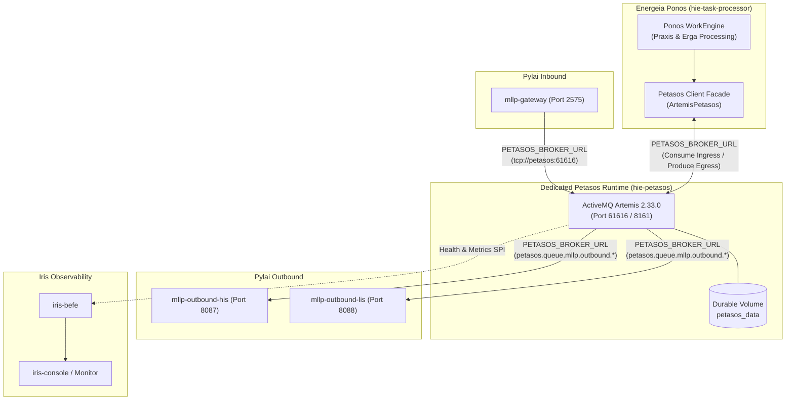

# Requirements

### Overview & Goals
The objective of this initiative is to separate the messaging runtime (Apache ActiveMQ Artemis) from the Ponos workflow execution engine in the Harmonia Health Integration Environment (HIE). Currently, Ponos (`energeia-ponos`) hosts an embedded ActiveMQ Artemis broker instance, binds to host port `61616`, and exposes local `vm://0` and TCP listeners. 

Under the target architecture:
- **Petasos owns messaging**: It runs as an independent, dedicated service (`hie-petasos`) in Docker Compose using Apache ActiveMQ Artemis 2.33.0 with durable persistence and role-based authentication enabled.
- **Ponos consumes Petasos messaging services**: Ponos connects over the standardized Petasos client boundary (`PETASOS_BROKER_URL`) and retains zero broker lifecycle management, server dependencies, or port 61616 ownership.

### Scope

#### In Scope
- **Standalone Petasos Runtime**: Creation of `hie-petasos` in root `docker-compose.yml` (single-broker development topology) using existing Artemis 2.33.0 deployment strategies, dedicated volume, healthchecks, and authentication.
- **Configuration Standardization**: Unification of broker configuration on `PETASOS_BROKER_URL` across Ponos, Pylai (`pylai-mllp-in`, `pylai-mllp-out`), Agora (`agora-service`), and Petasos API/Core (`PetasosConfig`, `PetasosPropertyResolver`).
- **Ponos Runtime Decoupling**: Migration of Ponos from `vm://0` and embedded `ArtemisBrokerManager` to external TCP connections via the `Petasos` client facade.
- **Server Dependency Elimination**: Pruning of `artemis-server` and embedded broker classes from `energeia-ponos`.
- **Durable Persistence & Security**: Verification of message journals, bindings, paging, and credential-managed role authentication (`admin`, `harmonia`).
- **Observability Alignment**: Integration of broker health, queue depth, producer/consumer counts, and DLQ telemetry with existing Petasos monitoring abstractions and Iris BEFE operational endpoints.
- **Kubernetes Manifest Alignment**: Verification and alignment of `energeia/ponos.yaml`, `pylai/pylai-mllp-in.yaml`, and `pylai/pylai-mllp-out.yaml` to use `PETASOS_BROKER_URL`.

#### Out of Scope
- Modifying Iris SPAs (`iris-clinical`, `iris-console`, `iris-administration`) or altering the Iris presentation tier.
- Deploying the 4-node HA Artemis topology into root Docker Compose (development topology remains single broker).
- Altering the 4-node HA Kubernetes manifests beyond parameterizing connection URLs.
- Redesigning the Iris Monitor UI or changing the backend operations REST contract.

### User Stories
- **As an Integration Developer**, I want Petasos to run as a standalone messaging container so that restarting or refactoring Ponos workflow code does not tear down queues, active subscriptions, or in-flight messages.
- **As a DevOps Engineer**, I want a consistent `PETASOS_BROKER_URL` environment variable across all gateways and services so that switching between single-broker development compose and multi-node clustered Kubernetes does not require code or configuration rework.
- **As a System Administrator**, I want message queues to be durably backed by a dedicated Docker volume and protected by role-based authentication so that messages survive broker restarts and unauthenticated access is prevented.

### Functional Requirements
1. **Standalone Broker Service (`hie-petasos`)**:
   - Must run `apache/activemq-artemis:2.33.0`.
   - Must expose messaging on port `61616` and web console on port `8161`.
   - Must persist data (journal, bindings, paging, large messages) into a dedicated volume `petasos_data`.
   - Must provide an automated Docker healthcheck on port `61616`.
2. **Unified Configuration (`PETASOS_BROKER_URL`)**:
   - `PetasosConfig.fromEnvironment()` and `PetasosPropertyResolver` must prioritize `PETASOS_BROKER_URL`.
   - `pylai-mllp-in`, `pylai-mllp-out` (both `HIS` and `LIS`), `agora-service`, and `task-processor` must use `PETASOS_BROKER_URL` (defaulting to `tcp://petasos:61616` in root Compose).
3. **Ponos Decoupling**:
   - Ponos must no longer instantiate `EmbeddedActiveMQ` or manage Artemis broker lifecycle.
   - Ponos must connect via TCP to `hie-petasos`.
   - Ponos must not expose port `61616` on host or container.
4. **End-to-End Message Flow Verification (Checkpoint 1)**:
   - Inbound HL7 ADT messages arriving on MLLP port `2575` must be published to Petasos, consumed by Ponos for Praxis/Erga workflow execution, and dispatched through Petasos to MLLP outbound instances (`mllp-outbound-his` on 8087, `mllp-outbound-lis` on 8088).
5. **Security & Authentication**:
   - Broker authentication must be enabled.
   - Credentials must be supplied via environment variables (`ARTEMIS_USER`, `ARTEMIS_PASSWORD`, `PETASOS_BROKER_USER`, `PETASOS_BROKER_PASSWORD`) with no hardcoded credentials.
   - Role separation: `admin` (management, queue deletion, DLQ) and `harmonia` (send, consume, browse, create durable/non-durable queues).
6. **Observability**:
   - Petasos health status, queue metrics, and topology must be exposed to Iris BEFE via existing `PetasosHealth` and Infinispan `messagequeue-cache` SPIs.

### Non-Functional Requirements
- **Architectural Guardrails**: Must adhere strictly to all `AGENTS.md` invariants:
  - *Invariant 1*: Zero production dependencies or imports of Paradeigma.
  - *Invariant 2*: `petasos-api` remains completely free of JMS and ActiveMQ Artemis imports.
  - *Invariant 3*: Iris presentation decoupling maintained; no direct database or JPA access.
  - *Invariant 4*: Dual-write safety (REC-001) in `pylai-mllp-in` guaranteed before ACK emission.
  - *Invariant 5*: Granular destination fan-out tracking (REC-002) maintained.
  - *Invariant 6*: Default-deny security governance via Themis enforced.
  - *Invariant 7*: Zero-PHI diagnostic logging.
- **Resilience**: Client applications (Ponos, Pylai, Agora) must automatically reconnect with exponential backoff if `hie-petasos` restarts.
- **Backward Compatibility**: Existing Kubernetes manifests remain operational and compatible with `PETASOS_BROKER_URL`.

# Technical Design

### Current Implementation
In the current Harmonia implementation:
- `energeia-ponos` bundles Apache ActiveMQ Artemis server dependencies (`artemis-server`, `artemis-jms-server`) in its `pom.xml`.
- `ArtemisBrokerManager.java` starts an `EmbeddedActiveMQ` server inside the Ponos JVM upon deployment, opening an embedded `vm://0` connector and binding TCP port `61616` to all interfaces (`0.0.0.0`).
- The root `docker-compose.yml` maps `61616:61616` directly to `task-processor` (Ponos).
- `mllp-gateway` and `mllp-outbound-his`/`mllp-outbound-lis` connect to `tcp://task-processor:61616`.
- If Ponos restarts or crashes, the entire messaging infrastructure is torn down, causing message loss, queue destruction, and disconnection of all gateway clients.

### Key Decisions
1. **Standalone Petasos Container (`hie-petasos`)**:
   - *Decision*: Introduce a dedicated service `hie-petasos` using image `apache/activemq-artemis:2.33.0` in root `docker-compose.yml`.
   - *Rationale*: Matches the established Artemis 2.33.0 deployment assets in `petasos/deployment/` while cleanly separating broker lifecycle from application workflow execution.
2. **Single-Broker Development Topology**:
   - *Decision*: Deploy a single Artemis broker for root Docker Compose with a dedicated configuration at `petasos/deployment/artemis/standalone/broker.xml`.
   - *Rationale*: Avoids the resource footprint and cluster discovery complexity of a 4-node HA cluster on local development workstations, while maintaining full configuration parity with production nodes.
3. **Ponos Client Integration via Petasos Client Facade**:
   - *Decision*: Ponos will consume Petasos messaging services using the native `Petasos` / `ArtemisPetasos` client facade over TCP CORE protocol (`tcp://petasos:61616`).
   - *Rationale*: Strictly enforces the target dependency rule `Ponos -> Petasos API / client adapter -> Petasos runtime -> ActiveMQ Artemis` and shields Ponos from protocol-level JMS/Artemis mechanics.
4. **Configuration Parameter Standard (`PETASOS_BROKER_URL`)**:
   - *Decision*: Consolidate all broker address references to `PETASOS_BROKER_URL` across Ponos, Pylai, Agora, and Petasos Core/API.
   - *Rationale*: Eliminates fragmented environment variables (`TASK_BROKER_HOST`, `TASK_BROKER_PORT`, `TASK_PROCESSOR_BROKER_URL`, `ARTEMIS_BROKER_URL`) and ensures identical environment variable boundaries in Docker Compose and Kubernetes.
5. **Complete Server Dependency Pruning in Ponos**:
   - *Decision*: Remove `artemis-server`, `artemis-jms-server`, and `ArtemisBrokerManager.java` from `energeia-ponos`, backed by an ArchUnit test.
   - *Rationale*: Guarantees that Ponos cannot accidentally instantiate an Artemis broker at runtime.
6. **Persistence & Security**:
   - *Decision*: Store Artemis journal, bindings, paging, and large messages on a dedicated named Docker volume `petasos_data`, and enable role-based security (`admin`, `harmonia`).
   - *Rationale*: Prevents message loss across container lifecycle events and replaces development unauthenticated mode with production-ready credential controls.

### Proposed Changes

#### 1. Petasos Subproject (`petasos/`)
- **`petasos/deployment/artemis/standalone/broker.xml`**: Create dedicated single-broker Artemis configuration derived from `primary-a/broker.xml`, removing cluster connections and HA replication blocks while retaining durable persistence (NIO), address settings, DLQ/Expiry configurations, and security settings.
- **`petasos/petasos-api/.../PetasosConfig.java`**: Update `fromEnvironment()` to parse `PETASOS_BROKER_URL` as the primary URL configuration before falling back to `PETASOS_BROKER_URLS` or `ARTEMIS_BROKER_URL`.
- **`petasos/petasos-core/.../PetasosPropertyResolver.java`**: Add resolution support for `PETASOS_BROKER_URL` and property `petasos.broker.url`.

#### 2. Root Docker Compose (`docker-compose.yml`)
- Add service `hie-petasos`:
  - Image: `apache/activemq-artemis:2.33.0`.
  - Container name: `hie-petasos`.
  - Environment: `ARTEMIS_USER`, `ARTEMIS_PASSWORD`, `EXTRA_ARGS`.
  - Ports: `61616:61616` (CORE) and `8161:8161` (Console).
  - Volumes: `./petasos/deployment/artemis/standalone/broker.xml:/var/lib/artemis-instance/etc-override/broker.xml:ro` and `petasos_data:/var/lib/artemis-instance/data`.
  - Healthcheck: `nc -z localhost 61616`.
  - Network: `hie-network`.
- Update `task-processor`:
  - Remove port `61616:61616`.
  - Remove `TASK_BROKER_HOST` and `TASK_BROKER_PORT`.
  - Add `PETASOS_BROKER_URL: "tcp://petasos:61616"`.
  - Add dependency on `petasos` with `condition: service_healthy`.
- Update `mllp-gateway`:
  - Remove `TASK_BROKER_HOST` and `TASK_BROKER_PORT`.
  - Add `PETASOS_BROKER_URL: "tcp://petasos:61616"`.
  - Update `depends_on` to include `petasos`.
- Update `mllp-outbound-his` and `mllp-outbound-lis`:
  - Replace `TASK_PROCESSOR_BROKER_URL` with `PETASOS_BROKER_URL: "tcp://petasos:61616"`.
  - Update `depends_on` to include `petasos`.
- Define volume: `petasos_data:`.

#### 3. Energeia Ponos (`energeia/ponos/`)
- **`pom.xml`**: Remove `org.apache.activemq:artemis-server` and `artemis-jms-server`. Retain client dependencies and `petasos-artemis`.
- **`ArtemisBrokerManager.java`**: Remove class entirely after Phase 4 verification.
- **`PonosTaskProcessorApplication.java` / CDI initialization**: Remove broker initialization hooks.
- **Client Producer/Consumer**: Configure client connections to use `PETASOS_BROKER_URL`.

#### 4. Pylai Gateways (`pylai/`)
- Update `pylai-mllp-in` configuration properties to resolve `PETASOS_BROKER_URL`.
- Update `pylai-mllp-out` configuration properties to resolve `PETASOS_BROKER_URL`.

#### 5. Agora Subsystem (`agora/`)
- Update `agora-service` configuration to use `PETASOS_BROKER_URL` for Matrix room event publishing.

#### 6. Kubernetes Workloads (`deployment/kubernetes/`)
- Update `deployment/kubernetes/base/energeia/ponos.yaml` to remove port 61616 and inject `PETASOS_BROKER_URL`.
- Update `deployment/kubernetes/base/pylai/pylai-mllp-in.yaml` and `pylai-mllp-out.yaml` to standardize on `PETASOS_BROKER_URL`.

### Architecture Diagram

### Components

| Component | Nature of Change | Impacted Files |
| :--- | :--- | :--- |
| **`hie-petasos`** | New standalone messaging container in root compose | `docker-compose.yml`, `petasos/deployment/artemis/standalone/broker.xml` |
| **`petasos-api` / `petasos-core`** | Configuration resolution update | `PetasosConfig.java`, `PetasosPropertyResolver.java` |
| **`energeia-ponos`** | Decouple from embedded broker; remove server POM dependencies; bind via Petasos client | `energeia/ponos/pom.xml`, `ArtemisBrokerManager.java`, `PonosTaskProcessorApplication.java`, `docker-compose.yml` |
| **`pylai-mllp-in`** | Standardize broker endpoint to `PETASOS_BROKER_URL` | `pylai/pylai-mllp-in/src/main/resources/application.properties`, `Dockerfile`, `docker-compose.yml` |
| **`pylai-mllp-out`** | Standardize broker endpoint to `PETASOS_BROKER_URL` | `pylai/pylai-mllp-out/src/main/resources/application.properties`, `Dockerfile`, `docker-compose.yml` |
| **`agora-service`** | Standardize broker endpoint to `PETASOS_BROKER_URL` | `agora/agora-service/src/main/resources/application.properties` |
| **Kubernetes Base** | Align Ponos and Pylai manifests with `PETASOS_BROKER_URL` | `deployment/kubernetes/base/energeia/ponos.yaml`, `pylai/*.yaml` |
| **Architecture Tests** | Add ArchUnit rule asserting Ponos does not import Artemis server | `paradeigma/paradeigma-test/.../PackageLayeringArchitectureTest.java` |

### File Structure
- Added:
  - `petasos/deployment/artemis/standalone/broker.xml`
- Modified:
  - `docker-compose.yml`
  - `petasos/petasos-api/src/main/java/net/fhirfactory/harmonia/petasos/api/config/PetasosConfig.java`
  - `petasos/petasos-core/src/main/java/net/fhirfactory/harmonia/petasos/core/config/PetasosPropertyResolver.java`
  - `energeia/ponos/pom.xml`
  - `energeia/ponos/src/main/resources/application.properties`
  - `pylai/pylai-mllp-in/src/main/resources/application.properties`
  - `pylai/pylai-mllp-out/src/main/resources/application.properties`
  - `deployment/kubernetes/base/energeia/ponos.yaml`
  - `deployment/kubernetes/base/pylai/pylai-mllp-in.yaml`
  - `deployment/kubernetes/base/pylai/pylai-mllp-out.yaml`
  - `paradeigma/paradeigma-test/src/test/java/net/fhirfactory/harmonia/paradeigma/test/arch/PackageLayeringArchitectureTest.java`
- Deleted / Retired:
  - `energeia/ponos/src/main/java/net/fhirfactory/harmonia/ponos/broker/ArtemisBrokerManager.java`

### Risks & Mitigations
- **Risk**: Connection race condition where Ponos or Pylai starts before standalone Petasos is ready to accept connections.
  - *Mitigation*: Configure Docker Compose `depends_on` with `condition: service_healthy` for `hie-petasos`, and ensure client connection managers in `petasos-artemis` use automatic retry with exponential backoff.
- **Risk**: Regression in Checkpoint 1 clinical message flow during Ponos client transition.
  - *Mitigation*: Phased migration: disable embedded broker in Ponos and test external connection first before deleting server code or POM dependencies.
- **Risk**: Premature removal of Artemis client classes causing classloader linkage errors.
  - *Mitigation*: Explicitly retain client dependencies (`artemis-core-client`, `artemis-jms-client`) and only remove `artemis-server` and `artemis-jms-server`. Validate with compiler and ArchUnit tests.

# Testing

### Validation Approach
Verification proceeds through a combination of unit tests, ArchUnit architectural rule evaluations, subsystem integration tests, and live Docker Compose multi-container verification.

### Key Scenarios

#### Scenario 1: Standalone Broker Startup & Health Verification
- Start `hie-petasos` via Docker Compose.
- Verify healthcheck evaluates to healthy within 10 seconds.
- Connect to port 61616 (CORE protocol) and verify port 8161 responds to management HTTP requests.
- Verify persistent directories (`bindings`, `journal`, `paging`, `large-messages`) are initialized on `petasos_data`.

#### Scenario 2: Checkpoint 1 End-to-End Clinical Message Processing
- With `hie-petasos`, `task-processor`, `mllp-gateway`, and outbound instances active:
- Submit an HL7 v2.4 ADT^A01 message to `mllp-gateway` on port 2575.
- Verify `mllp-gateway` publishes to Petasos ingress queue and returns an `AA` acknowledgment.
- Verify Ponos consumes the ingress event, executes `AdtDistributionErgon` and `Praxis` task sequence, and routes destination messages to Petasos egress queues.
- Verify `mllp-outbound-his` (port 8087) and `mllp-outbound-lis` (port 8088) consume from Petasos and deliver the transformed message.

#### Scenario 3: Broker Lifecycle Independence & Client Reconnection
- While clinical messages are actively processing or queued, stop `hie-petasos`.
- Verify Ponos and Pylai log connection retry attempts without crashing or exiting.
- Restart `hie-petasos`.
- Verify clients reconnect automatically and resume message consumption.
- Restart `task-processor` (Ponos).
- Verify `hie-petasos` remains unaffected and port 61616 stays open.

#### Scenario 4: Message Durability Across Broker Container Restart
- Send a batch of persistent messages to Petasos.
- Restart the `hie-petasos` container.
- Verify queue depths and unconsumed messages remain intact upon restart, confirming data persistence on `petasos_data`.

#### Scenario 5: Broker Authentication & Authorization
- Attempt connection to `hie-petasos` without credentials or with invalid credentials; verify connection rejection.
- Connect with valid credentials (`admin` / `harmonia`); verify successful authentication and queue authorization.

### Edge Cases
- **Broker unavailable at client startup**: Ensure clients retry connection until the broker is ready without throwing unhandled exceptions or crashing the JVM.
- **Port 61616 conflict verification**: Verify Ponos cannot bind port 61616 by asserting that port 61616 is strictly owned by `hie-petasos`.
- **Poison message / DLQ**: Verify failed message delivery routes messages to `DLQ` after 3 redelivery attempts without blocking subsequent queue processing.

### Test Changes
- **Architecture Tests**:
  - Run `mvn test -pl paradeigma/paradeigma-test -am -Dtest="*ArchitectureTest"`.
  - Add ArchUnit rule to verify `net.fhirfactory.harmonia.ponos..` does not depend on `org.apache.activemq.artemis.core.server..`.
- **Subsystem Tests**:
  - Run `mvn test -pl petasos/petasos-artemis,petasos/petasos-core`.
  - Run `mvn test -pl energeia/ponos`.
  - Run `mvn test -pl pylai/pylai-mllp-in,pylai/pylai-mllp-out`.
- **Docker Compose Integration**:
  - Execute full stack smoke tests ensuring all 18 services achieve healthy status.

# Delivery Steps

### ✓ Step 1: Establish Verified Baseline and Standalone Petasos Runtime
A verifiable baseline is captured and the standalone `hie-petasos` Artemis broker service is defined with dedicated configuration and persistent volume in root Docker Compose.

- Record container health across the running 17-service baseline (`docker-compose ps`) and current test execution status as a verified rollback point.
- Create a dedicated single-broker Artemis configuration at `petasos/deployment/artemis/standalone/broker.xml` based on the existing Artemis 2.33.0 strategy, configuring CORE/JMS on port 61616, web management on port 8161, NIO journal persistence, and security settings without HA replication overhead.
- Define the `hie-petasos` service in the root `docker-compose.yml` using `apache/activemq-artemis:2.33.0`, mounting the standalone `broker.xml` to `/var/lib/artemis-instance/etc-override/broker.xml`, mounting dedicated volume `petasos_data` to `/var/lib/artemis-instance/data`, exposing ports `61616:61616` and `8161:8161`, and configuring a healthcheck probe (`nc -z localhost 61616`).
- Define the named Docker volume `petasos_data` in root `docker-compose.yml` to guarantee durable persistence.

### ✓ Step 2: Standardize Petasos Broker Configuration Across Platform Subsystems
The `PETASOS_BROKER_URL` environment variable standard is established and implemented across Petasos, Ponos, Pylai, and Agora.

- Update `PetasosConfig.java` in `petasos-api` and `PetasosPropertyResolver.java` in `petasos-core` to recognize `PETASOS_BROKER_URL` as the primary configuration variable alongside legacy aliases.
- Update `pylai-mllp-in` (`pylai/pylai-mllp-in/src/main/resources/application.properties`, `Dockerfile`, and `docker-compose.yml`) to consume `PETASOS_BROKER_URL=tcp://petasos:61616` and replace legacy `TASK_BROKER_HOST` / `TASK_BROKER_PORT` variables.
- Update `pylai-mllp-out` (`pylai/pylai-mllp-out/src/main/resources/application.properties`, `Dockerfile`, and `docker-compose.yml` for `mllp-outbound-his` and `mllp-outbound-lis`) to replace `TASK_PROCESSOR_BROKER_URL` with `PETASOS_BROKER_URL=tcp://petasos:61616`.
- Update `agora-service` (`agora/agora-service/src/main/resources/application.properties` and deployment manifests) to standardize on `PETASOS_BROKER_URL` for Matrix collaboration event publishing.

### ✓ Step 3: Decouple Ponos Runtime and Verify Checkpoint 1 Ingress/Egress Flow
Ponos connects to standalone Petasos via client boundary without embedded broker lifecycle management, and end-to-end clinical message flow is verified.

- Update Ponos configuration in `energeia/ponos/src/main/resources/application.properties` and `docker-compose.yml` to ingest `PETASOS_BROKER_URL=tcp://petasos:61616`.
- Temporarily disable embedded broker startup in `ArtemisBrokerManager.java` in `energeia-ponos`, redirecting connection factories from `vm://0` to the configured `PETASOS_BROKER_URL`.
- Refactor Ponos producer and consumer components (`ArtemisPonosProducer`, `ArtemisPonosConsumer`) to bind through the `Petasos` client facade (`ArtemisPetasos`) rather than directly embedding server configuration.
- Execute Checkpoint 1 verification: validate end-to-end message flow `Pylai inbound (2575) -> Petasos -> Ponos TaskProcessor -> Petasos -> Pylai outbound (HIS:8087, LIS:8088)`.
- Test failure recovery: verify that stopping and restarting `hie-petasos` results in automatic client reconnection with zero message loss for durable queues, and restarting `task-processor` has zero effect on the broker lifecycle.

### ✓ Step 4: Prune Embedded Artemis Server Artifacts and Decouple Ponos Packaging
Ponos is stripped of embedded Artemis server dependencies, lifecycle management code, and port 61616 bindings.

- Delete `ArtemisBrokerManager.java` and remove embedded server initialization hooks from the Ponos startup sequence in `energeia/ponos`.
- Remove embedded server dependencies (`artemis-server`, `artemis-jms-server`, `artemis-server-osgi`) from `energeia/ponos/pom.xml`, leaving only required client dependencies (`artemis-core-client`, `artemis-jms-client`, `petasos-artemis`).
- Remove port `61616:61616` binding and embedded broker environment variables (`TASK_BROKER_HOST`, `TASK_BROKER_PORT`) from `task-processor` in root `docker-compose.yml`.
- Add ArchUnit rule to `paradeigma/paradeigma-test/src/test/java/net/fhirfactory/harmonia/paradeigma/test/arch/PackageLayeringArchitectureTest.java` enforcing that `net.fhirfactory.harmonia.ponos..` classes must not depend on `org.apache.activemq.artemis.core.server..`.

### ✓ Step 5: Implement Broker Authentication, Storage Persistence, and Iris Observability
Petasos runs with role-based authentication, durable storage verification, and operational health telemetry integrated with Iris Monitor.

- Configure Artemis security in `petasos/deployment/artemis/standalone/broker.xml` enabling authentication with distinct roles (`admin` for broker management and DLQ manipulation, `harmonia` for queue producers/consumers), mapped to environment credentials (`ARTEMIS_USER`, `ARTEMIS_PASSWORD`, `PETASOS_BROKER_USER`, `PETASOS_BROKER_PASSWORD`) without hardcoded secrets.
- Verify persistence directories (`journal`, `bindings`, `paging`, `large-messages`) on the `petasos_data` volume by writing messages, restarting `hie-petasos`, and verifying message persistence across container lifecycles.
- Verify that `ArtemisPetasos.health()` and `PetasosHealthProvider` in `iris-befe` accurately report broker status, connection state, queue metrics, and topology to the Iris BEFE operations endpoints (`/api/operations/health`, `/api/operations/queues`) via `modulestatus-cache` and Hot Rod without modifying Iris presentation code.

### ✓ Step 6: Align Kubernetes Workload Manifests and Execute End-to-End Test Suite
Kubernetes manifests for Ponos, Pylai, and Petasos are aligned to the standalone architecture and the complete test suite passes.

- Update `deployment/kubernetes/base/energeia/ponos.yaml` to remove port 61616 from the Service and Deployment, remove embedded broker variables, and add `PETASOS_BROKER_URL` referencing `tcp://petasos-artemis-discovery:61616` or primary endpoints.
- Update `deployment/kubernetes/base/pylai/pylai-mllp-in.yaml` and `pylai-mllp-out.yaml` to standardize on `PETASOS_BROKER_URL`.
- Verify the existing 4-node HA Kubernetes manifests (`artemis-primary-a.yaml`, `artemis-backup-a.yaml`, `artemis-primary-b.yaml`, `artemis-backup-b.yaml`) align with the client configuration pattern without altering their HA topology.
- Run the full test suite (`mvn test`) and architecture tests (`mvn test -pl paradeigma/paradeigma-test -am -Dtest="*ArchitectureTest"`).
- Bring up the full 18-container Docker Compose environment and verify zero container startup errors, successful healthchecks, and end-to-end MLLP message processing.