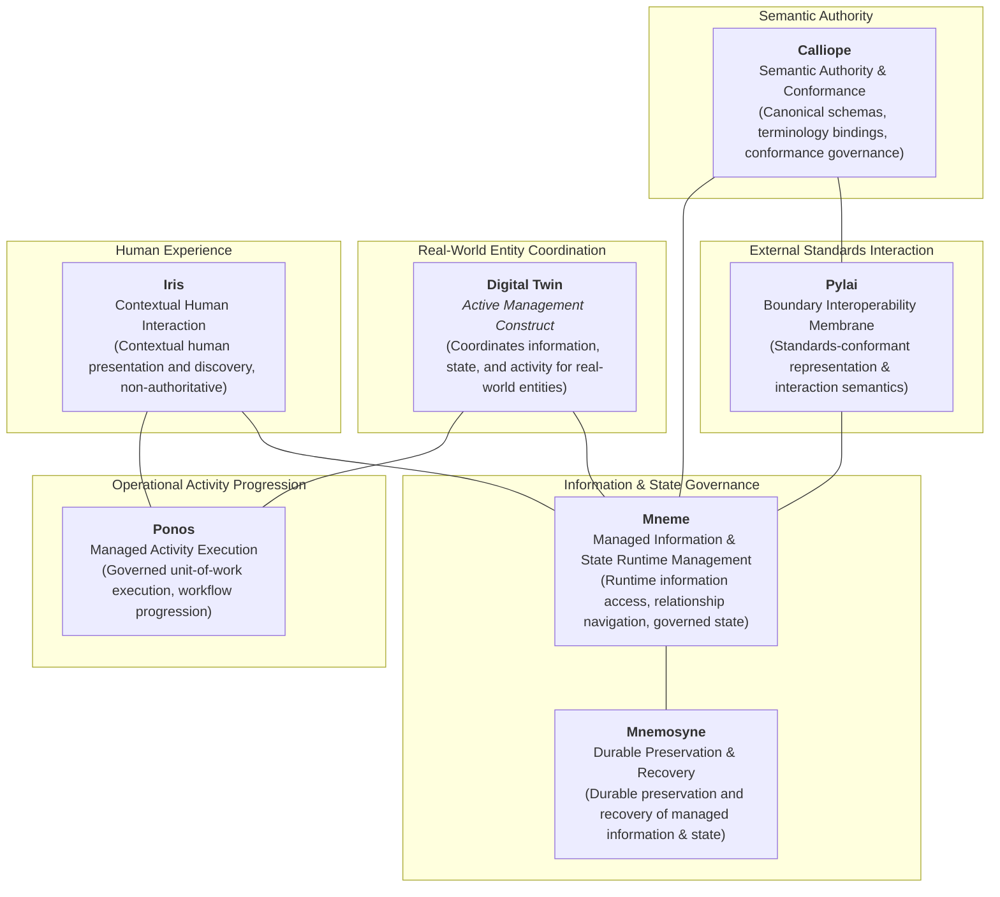

# Requirements

### Overview & Goals

The objective of **Domain 02 Strategy Authoring Pass B** is to advance Harmonia's Strategy Architecture beyond the capability baseline established in Pass A / A.1 by authoring:
1. **Strategic Resources**: The minimal, enduring strategic assets upon which Harmonia depends to realize its capabilities and courses of action.
2. **Courses of Action**: The technology-neutral strategic approaches through which Harmonia moves from foundational Motivation toward required capabilities.
3. **Strategic Logical Component Responsibilities**: The responsibility boundaries (Mneme, Mnemosyne, Ponos, Pylai, Calliope, Iris, and Digital Twin) that emerge from the composition of Business Enabling Features and reusable Enterprise Capabilities (EC-01 through EC-13).

This is strictly a **Strategy authoring activity**. It does not constitute Application Architecture (Domain 05), Integration Architecture (Domain 06), Technology Architecture (Domain 07), or detailed runtime design. It explains **WHY** major Harmonia logical responsibilities exist without allowing existing code or technology choices to dictate capability boundaries.

---

### Scope & Boundaries

#### In Scope
- Formally adjudicating candidate Strategy Resources using the Strategic Significance Test.
- Deriving a coherent, compact set of strategic Courses of Action grounded in Domain 01 Motivation and Domain 02 Capabilities.
- Subjecting the 7 candidate logical component boundaries to the 6-point Component Boundary Test.
- Formally validating the 6 critical cross-component responsibility seams.
- Articulating the architectural role and lifecycle of the Digital Twin as an active management construct.
- Enforcing the Four Strategic Boundary Guardrails (G1, G2, G3, G4).
- Constructing the canonical Strategic Responsibility View (conceptual responsibility diagram).
- Authoring canonical Markdown files in `docs/markdown/02-strategy/` (`resources/`, `courses-of-action/`, `strategic-views/`, and updating indices).

#### Out of Scope
- **Do Not Reopen Pass A**: The 16 Business Capabilities, 5 Business Enabling contextual views, 137 atomic Features, EC-01..EC-13 Enterprise Capabilities, 18 ICT Foundation lenses, and 1.x/2.x sufficiency boundaries are established and frozen.
- **Clinical Value Stream**: The Clinical Value Stream remains strictly deferred to **Pass C**. The historical 5-stage runtime flow (`Ingest Trigger` $\to$ `Transport` $\to$ `Erga` $\to$ `Update State` $\to$ `Egress`) is treated as runtime source material only, not the strategic value stream.
- **Implementation & Runtime Topologies**: No package names, port numbers, thread pools, queues, DDL, or container deployment specifications.
- **Downstream Realisation Artifacts**: Wire protocols (MLLP/FHIR REST endpoints), physical schemas, and software component internals belong in Domains 03–13.

---

### Canonical Inputs

The source of authority for Pass B comprises:
1. **Domain 01 Motivation (`docs/markdown/01-motivation/`)**:
   - Enduring Architectural Axioms: `AX-01` (Health-Information Centric), `AX-02` (Boundary Membrane), `AX-03` (Native Standards), `AX-04` (Own Semantics / Use Machinery), `AX-05` (Active vs Durable State), `AX-06` (Explicit Authority), `AX-07` (Intrinsic Security), `AX-08` (Meaning over Machinery), `AX-09` (Ephemeral Operational State), `AX-10` (Distribution & Normal Failure), `AX-11` (High Availability & Responsiveness), `AX-13` (Explicit Management Boundary), `AX-14` (Preserve Distinctions), `AX-15` (Preserve Uncertainty), `AX-16` (Activity & State Progress Together).
   - Strategic Drivers, Assessments, Goals, Business Outcomes, Foundational Requirements, and External Constraints.
2. **Domain 02 Strategy Baseline (`docs/markdown/02-strategy/`)**:
   - Canonical Business Capabilities (`capabilities/business-capabilities.md`).
   - Business Enabling Capabilities and atomic Features (`capabilities/business-enabling-capabilities.md`).
   - Enterprise Capabilities EC-01 through EC-13 (`capabilities/enterprise-capabilities.md`).
   - ICT Foundation Lenses (`capabilities/ict-foundation-lenses.md`).
   - Multi-Tier Progression Model (`capability-maps/capability-tier-model.md`).
3. **Historical Reconciliation Reports** (EVIDENTIARY ONLY; not canonical authority):
   - `.junie/reports/2026-10-05-strategy-reconciliation.md`
   - `.junie/reports/2026-10-05-strategy-authoring-pass-a.md`
   - `.junie/reports/2026-10-05-strategy-authoring-pass-a1-reconciliation.md`

---

### Four Strategic Boundary Guardrails

Pass B authoring will continuously enforce the four mandatory architectural guardrails:
- **Guardrail G1 (Reusable Capability $\neq$ Centralised Service)**: Enterprise Capabilities describe reusable functionality. Intrinsically cross-cutting capabilities (Context Management `EC-02`, Policy & Control `EC-06`, Provenance & Traceability `EC-07`, Operational Assurance `EC-12`) are collaborative across components, not centralized bottlenecks. Pylai's affinity with standards-facing aspects of `EC-08` does not imply Pylai owns all transport or exchange machinery.
- **Guardrail G2 (Component Boundaries Follow Architectural Responsibility)**: Subsystems encapsulate architectural responsibilities, not software libraries, frameworks, packaging, or storage products.
- **Guardrail G3 (Managed Information/State and Managed Activity Remain Distinct)**: Mneme governs what is known and its managed state; Ponos governs what is happening and operational activity progression; Digital Twins coordinate the two for real-world entities without collapsing them.
- **Guardrail G4 (Execution, Standards Interaction and Transport Remain Distinct Responsibilities)**: Execution determines that an external interaction is required (Ponos); standards-facing capability determines the required external representation and interaction semantics (Pylai); transport and connectivity capabilities determine how that interaction is physically conveyed (downstream integration/transport). Responsibilities are not collapsed merely because an implementation packages them together.

---

### Explicit Pass C Deferrals & Deferred Register Alignment

The following items are explicitly held for **Pass C** and will not be pre-empted in Pass B:
1. **Strategic Clinical Value Stream**: Formulation of the end-to-end clinical value stream.
2. **Motivation Traceability & Downstream Handoffs**: Formal matrices linking Strategy back to Domain 01 and forward to Domains 03–13.
3. **Active Deferred Register Items (`docs/deferred-document-register.md`)**:
   - Removal of residual implementation wording (`cryptographic`, `tamper-proof`, `immutable`) from Business Enabling Features.
   - Refinement of "authoritative historical clinical record" phrasing in Business Enabling Capabilities.
   - Refinement of Business Capability "Harmonia Enabling Role" statements.
   These items will remain recorded as `Deferred` in `docs/deferred-document-register.md` without silent closure.

# Technical Design

### Strategic Resource Adjudication

#### ArchiMate 3.2 Semantics & Harmonia Qualification
In ArchiMate 3.2, a **Resource** is an asset owned or controlled by an organization used to achieve goals and execute capabilities. In Harmonia, this concept is strictly qualified: a Resource belongs in Strategy only when the asset itself has **enduring strategic significance** in enabling Harmonia's capabilities or courses of action. Information merely managed by Harmonia belongs primarily in Information Architecture (Domain 04); implementation envelopes belong in Application Architecture (Domain 05); and verification testbeds belong in Testing/Verification (Domain 10).

#### The Strategic Significance Test
> *"If this asset disappeared or became unavailable, would Harmonia's strategic ability to realise its intended capabilities or Courses of Action materially change?"*

#### Candidate Resource Adjudication Assessment

| Candidate Asset | Strategic Significance Assessment | Adjudication Determination | Target Architecture Home |
| :--- | :--- | :---: | :--- |
| **Healthcare Interoperability Standards and Specifications (e.g. HL7 FHIR Release 5)** | Foundational external normative specifications defining healthcare exchange semantics, resource definitions, and conformance rules. If unavailable, interoperability cannot be achieved. | **ADMIT as Strategic Resource** | Domain 02 Strategy Resources |
| **Australian National Healthcare Directory & Identifier Specifications** | External jurisdictional normative specifications defining directory federation, endpoint discovery, and the Healthcare Identifier (HI) ecosystem (HPI-I, HPI-O). Enduring strategic dependency. | **ADMIT as Strategic Resource** | Domain 02 Strategy Resources |
| **National Clinical Terminology Assets (SNOMED CT-AU / AMT)** | External normative clinical vocabularies and ontologies required for semantic governance, concept bindings, and meaning-preserving transformations. | **ADMIT as Strategic Resource** | Domain 02 Strategy Resources |
| **Healthcare Regulatory & Privacy Compliance Frameworks** | Governing legal/regulatory frameworks (Australian Privacy Act, My Health Record Act). Primarily represent external constraints governing all aspects of system design. Admitting as a Resource does not add distinct architectural meaning beyond the Motivation constraint model. | **CLASSIFY as External Constraint** | Domain 01 Motivation (`CON-01..CON-11`) |
| **Authoritative Healthcare Provider Graph** | Consolidated graph of practitioners, organizations, and endpoints. Represents information managed by Harmonia rather than an enabling strategic asset. | **RELEGATE to Information Architecture** | Domain 04 Information Architecture (`EC-01`, `EC-04`) |
| **Vendor-Neutral Longitudinal Clinical Record** | Aggregated patient clinical history. Represents core managed health information, not an external or strategic platform resource. | **RELEGATE to Information Architecture** | Domain 04 Information Architecture (`EC-04`) |
| **Canonical Pragma Task Envelope & Schema Library** | Internal distributed coordination and execution envelope. Represents an internal application architecture construct. | **RELEGATE to Application Architecture** | Domain 05 Application Architecture / Calliope |
| **Kleio Immutable Audit & Provenance Evidence Trail** | Durable records of security and operational events. Represents operational compliance data generated by platform execution. | **RELEGATE to Security & Information Architecture** | Domain 04 / Domain 08 Security Architecture |
| **Paradeigma Synthetic Persona & Simulation Testbeds** | Synthetic clinical personas and test harnesses. Valued verification asset, but an offline verification capability rather than a production strategic resource. | **RELEGATE to Verification & Testing Architecture** | Domain 10 Testing Architecture |

---

### Courses of Action Framework

#### Derivation Methodology
Courses of Action are derived top-down by synthesising foundational Drivers, Strategic Goals, Business Outcomes, and Architectural Axioms from Domain 01 with the reusable Enterprise Capabilities from Domain 02. They define **how Harmonia organizes its approach** to realize its capabilities without dictating implementation technologies.

#### Quality Criteria (5-Point Test)
1. **Motivational Traceability**: Explicitly addresses one or more strategic Drivers, Goals, Requirements, or Axioms.
2. **Capability Influence**: Materially shapes how Enterprise Capabilities are configured and delivered.
3. **Technology Invariance**: Remains valid and meaningful even if underlying software frameworks or databases are replaced.
4. **Architectural Breadth**: Broader than a single component implementation decision.
5. **Downstream Direction**: Provides actionable architectural constraints for Domains 03–13.

*Negative Filter*: Immediately reject technology mechanism candidates (e.g., "Use PostgreSQL", "Deploy Infinispan", "Use virtual threads").

#### Core Strategic Courses of Action
1. **COA-01: Boundary Membrane Sovereignty**
   - *Strategic Approach*: Preserve strict separation between external standards-compliant exchange representations and internal Harmonia-governed operational semantics (grounded in `AX-02`, `AX-13`, `AX-14`, and `EC-08`).
2. **COA-02: Distinct Management and Durable Preservation of Information and State**
   - *Strategic Approach*: Maintain a clear separation between the governed management of Harmonia information and state and its durable preservation and recovery, allowing runtime management and persistence concerns to evolve independently without compromising information integrity (`AX-05`, `AX-09`, `AX-11`, `EC-03`, `EC-04`).
3. **COA-03: Meaning-Centric Provenance and Traceability**
   - *Strategic Approach*: Preserve provenance, authority, attribution and traceability for information-significant and business-significant actions and state changes, while avoiding unnecessary elevation of transient operational mechanics into enduring business evidence (`AX-07`, `AX-08`, `AX-14`, `EC-06`, `EC-07`).
4. **COA-04: Governed Asynchronous Activity Progression**
   - *Strategic Approach*: Progress multi-stage operational activities through explicit, observable unit-of-work transitions coordinated with entity state, separating execution from boundary exchange (`AX-10`, `AX-15`, `AX-16`, `EC-03`, `EC-10`).
5. **COA-05: Entity-Centred Operational Coordination**
   - *Strategic Approach*: Coordinate governed information, state and operational activity around real-world healthcare entities where those entities are operationally significant in their own right and require active management, without requiring every managed entity to maintain a permanently active execution construct (`AX-11`, `AX-16`, `EC-01`, `EC-02`, `EC-10`).
6. **COA-06: Collaborative Cross-Cutting Capability Realisation**
   - *Strategic Approach*: Realize cross-cutting platform capabilities (context, policy, provenance, assurance) collaboratively across participating components rather than through centralized, bottlenecked runtime services (`AX-04`, `AX-07`, `EC-02`, `EC-06`, `EC-12`).

---

### Strategic Logical Component Responsibility Model

#### 6-Point Component Boundary Test
Each candidate component is evaluated against:
1. **Responsibility**: Does it have one coherent architectural purpose?
2. **Cohesion**: Do its internal responsibilities naturally belong and change together?
3. **Authority**: Is its authoritative domain clearly bounded and unambiguous?
4. **Dependency**: Can it consume Enterprise Capabilities without duplicating ownership?
5. **Exclusion**: Are its anti-responsibilities (what it does NOT own) explicitly defined?
6. **Substitutability**: Would the boundary survive the complete replacement of its implementation technology?

#### Candidate Component Responsibilities & Boundary Evaluations

| Logical Component | Strategic Architectural Responsibility | Anti-Responsibilities (What it does NOT own) | Boundary Test Result |
| :--- | :--- | :--- | :---: |
| **Mneme** | Governs and provides runtime management of Harmonia-managed information, relationships, context, and state. | Does not provide durable preservation/recovery; does not own operational activity progression; does not govern external standards representation. | **PASS** |
| **Mnemosyne** | Provides durable preservation and recovery of Harmonia-managed information and state. | Does not govern application-facing runtime management; does not own operational activity progression; does not govern external standards representation. | **PASS** |
| **Ponos** | Executes and progresses Harmonia-managed operational activity within governed context. | Does not own external transport/connectivity machinery; does not govern durable preservation; does not own semantic definitions. | **PASS** |
| **Pylai** | Governs the standards-conformant representation and interaction semantics through which external participants access and exchange information with Harmonia. | Does not progress internal operational activities; does not alter internal managed state destructively; does not own transport/connectivity machinery (TCP/TLS/HTTP connections/pools/retries). | **PASS** |
| **Calliope** | Governs semantic definitions, canonical data models, terminology bindings, and conformance rules. | Does not synchronously mediate runtime transactions; does not own durable clinical persistence; does not execute operational tasks. | **PASS** |
| **Iris** | Provides contextual human interaction with Harmonia-managed information and activity while remaining non-authoritative for both. | Does not own clinical identity or authority; does not access databases directly; does not execute autonomous workflows. | **PASS** |
| **Digital Twin** | Active management construct associated with a real-world entity and responsible for coordinating information, state, and operational activity associated with that entity. | Is NOT an independent deployable platform component; is not a persistent database record; is not a general workflow engine; is not a single FHIR resource. | **PASS (Architectural Construct)**<br/>**FAIL (Independent Component)** |

---

### Critical Responsibility Seams

1. **Mneme ↔ Mnemosyne**: Mneme governs and provides runtime management of Harmonia-managed information, relationships, context, and state; Mnemosyne provides durable preservation and recovery of that information and state. (Architectural responsibility distinction, not "ephemeral vs durable data").
2. **Mneme ↔ Ponos**: Mneme governs what is known and its managed state; Ponos executes and progresses operational activity within governed context.
3. **Ponos ↔ Digital Twin**: Ponos provides generic activity execution and progression; the Digital Twin coordinates entity-centred information, state, and activity across the Mneme/Ponos seam for a specific real-world entity. (Ponos executes; Digital Twin coordinates for an entity).
4. **Pylai ↔ Mneme**: Pylai governs standards-conformant external representation and interaction semantics; Mneme governs Harmonia-managed information, relationships, context, and state. (Transition between external standards meaning and Harmonia-governed meaning/state; not physical wire protocol transmission).
5. **Calliope ↔ Runtime Components**: Calliope is the semantic design authority, distributing schemas and conformance rules; runtime components consume these semantics without requiring synchronous call mediation.
6. **Iris ↔ Mneme / Ponos**: Iris delivers contextual human interaction with managed information and activity while remaining strictly non-authoritative for both.

---

### Digital Twin Formulation

- **Architectural Archetype**: The Digital Twin is an active management construct associated with a real-world entity and responsible for coordinating the information and operational activity associated with that entity.
- **Evaluation Finding**: **PASS as an architectural construct; FAIL as an independent platform component**.
- **Composite Context**: A Digital Twin is not a representation of an individual FHIR resource. A Twin is associated with a real-world healthcare entity whose governed context may be established through a composite of multiple related information resources (e.g., identity, role, organisation, healthcare service, location, endpoint, relationships, relevant governed state). The composition is determined by operational meaning, not a fixed FHIR cardinality.
- **Twin Type $\neq$ FHIR Resource Type**: Twin type is determined by the operational identity of the real-world entity, not the information representation (e.g., Ward Twin $\neq$ Location; Practitioner Twin $\neq$ Practitioner; Patient Twin $\neq$ Patient; Bed Twin $\neq$ Location/Bed; Service Provider Organisation Twin $\neq$ Organisation; Care Team Twin $\neq$ CareTeam).
- **Candidate-Twin Test**: A Harmonia-managed entity is a candidate for Digital Twin coordination where the entity is operationally significant in its own right and Harmonia must coordinate evolving governed state and operational activity associated with that entity. Representation alone does not justify a Digital Twin.
- **Recognised Archetypes (Historical Evidentiary Reference)**: Service Provider Organisation Twin, Care Team Twin, Practitioner Twin, Patient Twin, Bed Twin, Ward Twin (fulfilling facility-level operational role), and Wardsperson Twin (specialisation of Practitioner Twin).
- **Negative Constraints**: A Digital Twin must NEVER be modeled or implemented as:
  - a FHIR resource;
  - an unmanaged persistent actor or permanent background thread;
  - an independent secondary workflow engine;
  - a dedicated database record or table;
  - a permanent in-memory resident object.

---

### Enterprise Capability Composition

The logical component responsibilities emerge naturally from the composition of Enterprise Capabilities (EC-01..13):

```text
[EC-01 Managed Entity & Relationship] + [EC-02 Context] + [EC-03 State & Lifecycle]
+ [EC-04 Information Management] + [EC-05 Search & Discovery] + [EC-06 Policy & Control]
    └──► MNEME (Managed Information & State Runtime Management)

[EC-03 State & Lifecycle] + [EC-04 Information Management] + [EC-07 Provenance & Traceability]
    └──► MNEMOSYNE (Durable Preservation & Recovery)

[EC-02 Context] + [EC-03 State & Lifecycle] + [EC-09 Event & Subscription]
+ [EC-10 Activity & Execution] + [EC-12 Operational Assurance]
    └──► PONOS (Managed Activity Execution)

[EC-06 Policy & Control] + [EC-07 Provenance & Traceability] + [EC-08 Interoperability & Exchange (standards-facing)]
+ [EC-13 Semantic Governance & Conformance]
    └──► PYLAI (Boundary Interoperability Membrane)

[EC-01 Managed Entity & Relationship] + [EC-04 Information Management]
+ [EC-13 Semantic Governance & Conformance]
    └──► CALLIOPE (Semantic Authority & Conformance)

[EC-02 Context Management] + [EC-11 Interaction & Experience]
    └──► IRIS (Contextual Human Interaction)

[EC-01 Entity] + [EC-02 Context] + [EC-03 State] + [EC-10 Activity]
    └──► DIGITAL TWIN (Entity-Centred Coordination Archetype across Mneme/Ponos Seam)
```

---

### Strategic Responsibility View



---

### Exact Canonical Files Proposed

#### New Files to Create
1. `docs/markdown/02-strategy/resources/index.md`
   - Introduction to Strategic Resources, ArchiMate 3.2 alignment, Harmonia qualification, and the Strategic Significance Test.
2. `docs/markdown/02-strategy/resources/strategic-resources.md`
   - Detailed catalogue of adjudicated Strategic Resources (FHIR R5, Australian Directory/LDS specs, Terminology Assets, Privacy/Regulatory frameworks) and formal disposition records for relegated candidates.
3. `docs/markdown/02-strategy/courses-of-action/index.md`
   - Methodology for deriving Courses of Action from Motivation and Capabilities, 5-point quality test, and navigation index.
4. `docs/markdown/02-strategy/courses-of-action/strategic-courses-of-action.md`
   - Authoritative catalogue of the 6 core Courses of Action (COA-01 through COA-06) with traceability to Axioms, Goals, and Capabilities.
5. `docs/markdown/02-strategy/strategic-views/index.md`
   - Overview of strategic views and navigation paths.
6. `docs/markdown/02-strategy/strategic-views/logical-component-responsibilities.md`
   - Comprehensive Logical Component Responsibility Model: detailed profiles of the 7 candidate responsibilities, 6-point boundary test evaluations, 6 cross-component seam analyses, Digital Twin formulation, capability compositions, and the Strategic Responsibility View.

#### Existing Files to Modify
1. `docs/markdown/02-strategy/README.md`
   - Update sections 4, 6, and 7 to reference Pass B deliverables (resources, courses-of-action, strategic-views) and update reading paths.
2. `docs/markdown/02-strategy/capabilities/index.md`
   - Update forward navigation links to connect Enterprise Capabilities to the Strategic Logical Component responsibility model.
3. `docs/markdown/02-strategy/capability-maps/index.md`
   - Add reference to the Strategic Responsibility View and capability composition derivations.

# Testing & Validation

### Validation Approach

Authoring Pass B will be verified against a strict four-level validation gate:

1. **Metamodel & Structural Conformance**:
   - Verify that all newly authored documents adhere to ArchiMate 3.2 concepts as extended by Harmonia.
   - Confirm that Strategic Resources, Courses of Action, and Logical Components are documented with consistent heading levels, cross-links, and rationale.
2. **Architectural Axiom & Guardrail Conformance**:
   - Verify alignment with `AX-01` through `AX-16` across all authored documentation.
   - Assert zero violation of Guardrails G1, G2, G3, and G4.
   - Assert that no component names or software products leak into capability tier documents or resource titles.
3. **Link & Navigation Integrity**:
   - Check that all relative Markdown links across `docs/markdown/02-strategy/` resolve correctly.
   - Verify that links between `README.md`, `resources/`, `courses-of-action/`, `capabilities/`, and `strategic-views/` form a cohesive, navigable graph.
4. **Repository Invariance**:
   - Verify via `git status` that zero files outside `docs/markdown/02-strategy/` and `.junie/reports/` are modified.
   - Ensure production Java code, POM files, and LaTeX sources remain completely untouched.

---

### Completion-Report Structure

Upon completion of Pass B authoring, Junie will produce a comprehensive completion report in:
`.junie/reports/2026-10-06-strategy-authoring-pass-b.md`

The completion report will follow this standardized structure:
1. **Executive Summary**: Overview of Pass B deliverables, milestones closed, and strategic progression established.
2. **Files Created & Modified**: Detailed file manifest with paths, line counts, and architectural purposes.
3. **Strategic Resources Catalogue & Adjudication**: Summary of admitted Strategic Resources and formal disposition of relegated candidate assets.
4. **Courses of Action Authored**: Presentation of the 6 core strategic Courses of Action and their Motivational traceability.
5. **Strategic Logical Component Responsibility Model**: Summary of the 7 validated logical boundaries, 6-point boundary test outcomes, and seam analyses.
6. **Digital Twin Architectural Construct**: Summary of the Digital Twin evaluation and transient lifecycle rules.
7. **Capability Composition & Guardrail Compliance**: Verification of Guardrails G1–G4 and representative EC compositions.
8. **Deferred Register & Pass C Boundary**: Explicit confirmation that Clinical Value Stream and deferred backlog items remain held for Pass C.
9. **Validation Results**: Summary of automated and manual validation checks.
10. **Conclusion & Handover**: Formal closure of Pass B.

---

### Risks & Issues Requiring Human Review

The following decisions are embedded in this plan and submitted for human review and confirmation prior to canonical authoring:

1. **Strategic Resource Adjudication Decisions**:
   - *Recommendation*: Classify external normative specifications (FHIR R5, Australian National Directory, Terminology Assets, Regulatory frameworks) as Strategy Resources. Relegate internally managed entities (Provider Graph, Longitudinal Record) to Domain 04 Information Architecture; relegate Pragma envelopes to Domain 05/Calliope; relegate Kleio audit logs to Domain 08/04; relegate Paradeigma testbeds to Domain 10.
   - *Confirmation Requested*: Confirm acceptance of this adjudication boundary.
2. **Digital Twin Modeling as an Architectural Construct**:
   - *Recommendation*: Confirm the determination that the Digital Twin is an active management construct / coordination archetype bridging active state (Mneme) and operational execution (Ponos), rather than an independent software subsystem or deployable runtime component.
   - *Confirmation Requested*: Confirm that Digital Twin is not to be modeled as an independent platform component.
3. **Courses of Action Scope**:
   - *Recommendation*: Establish the 6 technology-neutral strategic approaches (Boundary Membrane Sovereignty, Two-Tier State Separation, Meaning-Centric Evidence, Governed Asynchronous Activity Progression, Dynamic Real-World Entity Coordination, Collaborative Cross-Cutting Capabilities).
   - *Confirmation Requested*: Confirm that these 6 Courses of Action represent the appropriate strategic breadth.

# Delivery Steps

### ✓ Step 1: Author Strategic Resources Catalogue and Candidate Adjudication
The Strategic Resources catalogue is established under `docs/markdown/02-strategy/resources/` with explicit adjudication against the strategic significance test.

- Author `docs/markdown/02-strategy/resources/index.md` articulating ArchiMate 3.2 resource semantics, Harmonia qualifications, and the strategic significance test.
- Author `docs/markdown/02-strategy/resources/strategic-resources.md` documenting adjudicated Strategic Resources (external normative standards, national directory and identifier specifications, and clinical terminology assets).
- Document formal adjudication dispositions for relegated candidate assets (Provider Graph to Domain 04, Longitudinal Record to Domain 04, Pragma envelopes to Domain 05/Calliope, Kleio audit evidence to Domain 08, Paradeigma testbeds to Domain 10, and regulatory/privacy frameworks to Domain 01 Motivation external constraints).

### ✓ Step 2: Author Strategic Courses of Action Framework
The strategic Courses of Action are authored under `docs/markdown/02-strategy/courses-of-action/`, deriving strategic approaches from Motivation and Capabilities.

- Author `docs/markdown/02-strategy/courses-of-action/index.md` articulating the derivation methodology, 5-point quality criteria, and navigation structure.
- Author `docs/markdown/02-strategy/courses-of-action/strategic-courses-of-action.md` establishing core Courses of Action (Boundary Membrane Sovereignty, Distinct Management and Durable Preservation of Information and State, Meaning-Centric Provenance and Traceability, Governed Asynchronous Activity Progression, Entity-Centred Operational Coordination, and Collaborative Cross-Cutting Capability Realisation).
- Map each Course of Action to corresponding Drivers, Strategic Goals, Business Outcomes, and Architectural Axioms (AX-01..AX-16) without introducing implementation mechanisms.

### ✓ Step 3: Author Strategic Logical Component Responsibility Model and Seam Validations
The Strategic Logical Component Responsibility Model is authored under `docs/markdown/02-strategy/strategic-views/` with formal boundary, seam, and composition analyses.

- Author `docs/markdown/02-strategy/strategic-views/index.md` providing an overview of strategic views and navigation.
- Author `docs/markdown/02-strategy/strategic-views/logical-component-responsibilities.md` establishing the 7 candidate logical responsibilities (Mneme, Mnemosyne, Ponos, Pylai, Calliope, Iris, and Digital Twin).
- Execute and record the 6-point boundary validation tests (Responsibility, Cohesion, Authority, Dependency, Exclusion, Substitutability) for each component.
- Document and validate the 6 critical responsibility seams (Mneme ↔ Mnemosyne, Mneme ↔ Ponos, Ponos ↔ Digital Twin, Pylai ↔ Mneme, Calliope ↔ Runtime Components, Iris ↔ Mneme / Ponos).
- Codify the Digital Twin architectural construct (PASS as architectural construct, FAIL as independent platform component).
- Formulate representative Enterprise Capability compositions (EC-01..13) and embed the canonical ASCII and Mermaid Strategic Responsibility View.

### ✓ Step 4: Harmonise Strategy Navigation, Capability Maps, and Produce Completion Report
Domain 02 Strategy indices and capability maps are updated to incorporate Pass B assets, and the formal completion report is produced.

- Update `docs/markdown/02-strategy/README.md` to reference the newly authored resources, courses of action, and strategic views.
- Update `docs/markdown/02-strategy/capabilities/index.md` and `docs/markdown/02-strategy/capability-maps/index.md` to link directly into the logical component responsibility model.
- Verify intra-domain and cross-domain Markdown link integrity and validate zero leakage of implementation mechanisms or component names into capability tiers.
- Author the formal Pass B completion report in `.junie/reports/2026-10-06-strategy-authoring-pass-b.md` and verify that all Pass C deferrals remain safely recorded in `docs/deferred-document-register.md`.