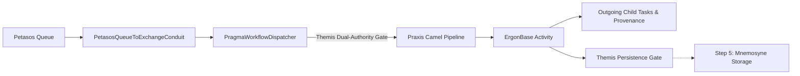

# Requirements

### Overview & Goals
Task 04 Step 4 establishes end-to-end propagation of authenticated identity, security context, and execution provenance through Harmonia workflow processing (Ponos, Praxis, and Erga activities) following ingress from the asynchronous Petasos/Artemis messaging boundary.

The core security invariant is strict preservation of the semantic distinction between:
1. **Originating / Requesting Principal**: Who originally caused the business operation to exist (e.g., `HUMAN:DrSmith` or `SERVICE:pylai`).
2. **Executing Principal**: Which Harmonia component or process is executing this stage of work (e.g., `PROCESS:ponos-engine`).

### Scope
- **In Scope**:
  - Canonicalization of `ID_PONOS_PROCESS = "process:ponos-engine"` and `PRINCIPAL_PONOS_PROCESS` in `HarmoniaServiceIdentities`.
  - Transition of executing identity to `PROCESS:ponos-engine` at `PragmaWorkflowDispatcher.dispatchPragma(...)` upon passing dual Themis gates (originating authorization + Ponos execution authorization).
  - Causation preservation at dispatch: ensuring `causationId` is NOT modified during executor transition alone.
  - Inheritance of originating principal, authority snapshot, security domain, correlation ID, and requestedAt in child work created by `ErgonBase`.
  - Proper causal lineage on child work: assigning `causationId` referencing the immediate parent work/task ID.
  - Consistent bi-directional projection between `Pragma` and FHIR `Task` in `PragmaFhirConverter` and `ErgonBase.createOutgoingTasks(...)`.
  - Hardening of `ErgonBase` blank-Pragma fallback against unauthenticated security context manufacture while preserving non-security legacy execution paths.
- **Out of Scope**:
  - Durable persistence / recovery context in Mneme / Mnemosyne / JPA (Task 04 Step 5).
  - Replacing `process:provider-registry-change-processor` in `AbstractProviderRegistryChangeErgon` (deferred to Step 5 persistence boundary).
  - CORS and PHI logging sanitization (Task 05).
  - FHIR `AuditEvent` generation (Task 06).
  - Manual / administrative replay redesign.

### User Stories
- **As a Security Auditor**, I want all workflow execution activities and child tasks to immutably retain the identity of the original requesting human or system and their originating authority snapshot, so that non-repudiation and clinical audit trails cannot be erased or obscured by background worker processes.
- **As a Workflow Engine Developer**, I want clear separation between originating permissions and process execution authority, so that background worker processes can never amplify or expand an unauthorized human request.

# Technical Design

### Current Implementation
- `PetasosQueueToExchangeConduit` deserializes incoming `PetasosMessage` payloads into canonical `Pragma` instances.
- `PragmaWorkflowDispatcher` evaluates dual-authority checks against Themis (`ThemisAction.SUBMIT_UPDATE` on originating principal and `ThemisAction.PROCESS` on `process:ponos-engine`).
- The executing principal (`process:ponos-engine`) was created ad-hoc and not persisted back into `Pragma.executingPrincipal` or `ThemisSecurityContext`.
- `ErgonBase.createOutgoingTasks` creates child `Task` resources with clinical references (`for`, `focus`, `partOf`), but omits security extensions and causation identifiers.
- `ErgonBase.processIngress` creates a blank `Pragma` with random UUID when unresolved; this must be hardened to ensure fallback tasks cannot be treated as authenticated/authorized security-bearing work.

### Key Decisions
1. **Canonical Ponos Process Identity**: Define `HarmoniaServiceIdentities.ID_PONOS_PROCESS = "process:ponos-engine"` and `PRINCIPAL_PONOS_PROCESS` as a `PrincipalType.PROCESS` identity in `HarmoniaServiceIdentities`.
2. **Execution Boundary at Dispatcher**: `PragmaWorkflowDispatcher.dispatchPragma()` derives the execution security context using `ThemisSecurityContext.withExecutingPrincipal(HarmoniaServiceIdentities.PRINCIPAL_PONOS_PROCESS)` and updates `Pragma.setExecutingPrincipal(...)` without modifying `causationId` (since changing executor is not a new causal event).
3. **Ergon Activity Scope**: Ergon activities execute as part of the Ponos workflow execution boundary under `PROCESS:ponos-engine`. Individual activities declare required capabilities via `ErgonSecurityDefinition` without introducing per-activity process identities or unioning executor authorities with originating authorities.
4. **Child Work Lineage**: Child work generated by `ErgonBase.createOutgoingTasks` inherits originating principal, originating authority snapshot, security domain, correlation ID, requestedAt, and policyVersion, while receiving a new child task ID, active executing principal (`PROCESS:ponos-engine`), and `causationId = parentTaskId`.
5. **FHIR Task Security Projection**: `PragmaFhirConverter` and `ErgonBase` ensure bi-directional consistency across all security extensions (`EXTENSION_SECURITY_PRINCIPAL_ID`, `TYPE`, `DOMAIN`, `AUTHORITIES`, `POLICY_VERSION`, `EXECUTING_PRINCIPAL_ID`, `EXECUTING_PRINCIPAL_TYPE`) and identifiers (`correlation-id`, `causation-id`).
6. **Hardened Ingress Fallback**: `ErgonBase` fallback creation does not manufacture originating identity or authorities; security-bearing pipelines without trusted context fail closed at authorization gates.

### Architecture Diagram

### File Structure & Components Affected
- `themis/themis-core/.../HarmoniaServiceIdentities.java`: Define `ID_PONOS_PROCESS` and `PRINCIPAL_PONOS_PROCESS`.
- `energeia/ponos/.../conduit/PragmaWorkflowDispatcher.java`: Update executing principal on `Pragma` and `ThemisSecurityContext` upon passing dual authorization gates while preserving `causationId`.
- `energeia/erga/.../base/ErgonBase.java`: Propagate security extensions, correlation ID, causation ID in `createOutgoingTasks`; harden ingress fallback.
- `calliope/.../model/pragma/PragmaFhirConverter.java`: Ensure full bi-directional mapping of `causation-id` and executing principal extensions.

# Testing

### Validation Approach
Verification will be automated through comprehensive unit, integration, and ArchUnit architecture tests covering dual-principal authorization, lineage propagation, fallback security, and zero-PHI invariants.

### Key Scenarios
1. **Ponos Execution Transition**: A Pragma dispatched through Ponos retains `originatingPrincipal`, `originatingAuthorities`, `correlationId`, and `causationId` unchanged, while `executingPrincipal` becomes `PROCESS:ponos-engine`.
2. **Dual-Principal Denial**: An unauthorized originating requester with an authorized Ponos executor results in `ThemisDecision.DENY`.
3. **Child Work Lineage**: Child tasks produced by `ErgonBase.createOutgoingTasks` inherit originating provenance, correlation ID, and active executor, while receiving a new child ID and `causationId` matching the parent task.
4. **FHIR Task Round-Trip**: Security extensions and lineage identifiers round-trip losslessly between `Pragma` and FHIR `Task`.
5. **Missing Context Rejection**: Security-bearing workflows lacking trusted originating context fail closed (`DENY`).
6. **Blank-Pragma Fallback Guard**: Ingress fallback cannot manufacture trusted security state or bypass authorization.
7. **System/Service Work**: Non-human originated workflows (e.g. `service:pylai`) execute successfully without requiring a human principal.
8. **Architectural Guardrails**: `ParadeigmaIsolationArchitectureTest` and `SecurityEnforcementArchitectureTest` pass with zero violations.

# Delivery Steps

### ✓ Step 1: Canonicalize Ponos Executing Process Identity & Dispatcher Propagation
The canonical Ponos executing process identity is registered in HarmoniaServiceIdentities and PragmaWorkflowDispatcher updates executingPrincipal on dispatched Pragmas and security contexts while preserving causationId upon passing dual Themis gates.

- Define `ID_PONOS_PROCESS = "process:ponos-engine"` and `PRINCIPAL_PONOS_PROCESS = ThemisPrincipal.of(ID_PONOS_PROCESS, PrincipalType.PROCESS, "ponos")` in `themis/themis-core/src/main/java/net/fhirfactory/harmonia/themis/core/identities/HarmoniaServiceIdentities.java`.
- Update `PragmaWorkflowDispatcher.java` to set `pragma.setExecutingPrincipal(HarmoniaServiceIdentities.PRINCIPAL_PONOS_PROCESS)` and update `ThemisSecurityContext` via `withExecutingPrincipal(HarmoniaServiceIdentities.PRINCIPAL_PONOS_PROCESS)` when Check 1 (originating requester) and Check 2 (Ponos execution engine) pass.
- Ensure `causationId` is preserved unchanged during Ponos dispatch (no premature re-assignment of causation on executor transition).
- Update `PragmaWorkflowDispatcherSecurityTest.java` to verify that dispatched `Pragma` and its security context retain the active executing principal, preserved causation ID, and fail-closed dual-principal denial behavior.

### ✓ Step 2: Child Task & Lineage Context Propagation in ErgonBase
ErgonBase properly propagates parent security context, originating identity, correlation ID, and sets causation ID on all generated child tasks and sub-work.

- Update `ErgonBase.createOutgoingTasks(Task processedTask)` in `energeia/erga/src/main/java/net/fhirfactory/harmonia/erga/base/ErgonBase.java` to copy `EXTENSION_SECURITY_*` extensions and `correlation-id` identifier to each child `Task`.
- Add `causation-id` identifier (`http://fhirfactory.net/harmonia/task/causation-id`) referencing the parent task ID on outgoing child `Task` resources.
- Harden `ErgonBase.processIngress` so that unauthenticated synthetic task fallback cannot manufacture trusted security state or bypass Themis default-deny governance for security-bearing workflows.
- Update `PragmaFhirConverter.java` to ensure complete bi-directional mapping of executing principal and causation ID extensions/identifiers between `Pragma` and FHIR `Task`.

### ✓ Step 3: End-to-End Workflow Security Validation & Architecture Tests
Comprehensive unit, integration, and architecture tests verify workflow security context propagation, dual-principal validation, and zero-PHI compliance.

- Add unit and integration test assertions in `PragmaWorkflowDispatcherSecurityTest`, `ErgonBaseTest`, and `ErgonPraxisEndToEndIntegrationTest`.
- Validate that originating requester identity is preserved unchanged across all Ergon activity stages while executing process reflects `process:ponos-engine`.
- Verify that child work inherits originating permissions and correlation ID with new causation ID pointing to immediate parent.
- Verify that system/service-originated work functions cleanly without synthetic human identities.
- Run `SecurityEnforcementArchitectureTest` and `ParadeigmaIsolationArchitectureTest` to assert repository-wide architectural invariants.