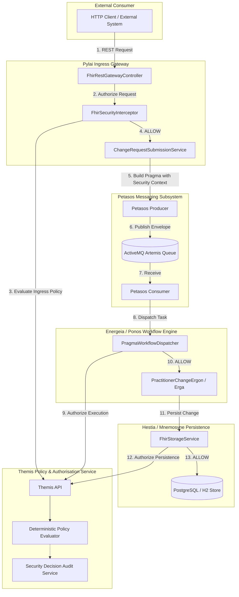

# Requirements

### Overview & Goals
The objective of this initiative is to design and implement **Themis**, the Harmonia Policy and Authorisation Service, delivering an enterprise-grade **defence-in-depth security architecture** across the platform.

In complex distributed healthcare integration architectures, single-perimeter security at the API gateway is insufficient to mitigate systemic risk. Compromises, rogue internal modules, or configuration defects can lead to catastrophic data leaks or unauthorized data modification. Themis establishes ubiquitous security governance across all internal boundaries:
1. **Pylai API Gateways** (inbound REST/FHIR request evaluation).
2. **Petasos Messaging Subsystem** (tamper-resistant security context propagation).
3. **Ponos & Praxis Workflow Engines** (governed task dispatch and Ergon execution authorization).
4. **Erga Activity Tasks** (originating context and execution authority validation).
5. **Mnemosyne / FHIR Storage Service** (independent persistence boundary authorization).

### Core Security Principle
The foundational rule across Harmonia is:
```
DEFAULT DENY
```
In the absence of an explicit policy granting permission, every request, asynchronous task, or internal persistence operation is denied. Internal components and processes are treated as untrusted actors requiring explicit cryptographic or context-backed identities and authorities.

### Scope
#### In Scope
- **Themis Subsystem**: Standalone Maven module (`themis`) containing `themis-api`, `themis-core`, and `themis-audit`.
- **Decoupled Domain Types**: Core security abstractions (`ThemisPrincipal`, `ThemisRole`, `ThemisAuthority`, `ThemisAction`, `ThemisResource`, `ThemisSecurityLabel`, `ThemisSecurityContext`, `ThemisDecision`, `ThemisDecisionReason`).
- **Policy Engine**: Deterministic policy evaluation pipeline (`Explicit Deny` $\rightarrow$ `Policy Rules` $\rightarrow$ `Default Deny`) supporting RBAC and future ABAC extension points.
- **Security Vocabularies & FHIR Mapping**: Centralized security code systems in Calliope, with bi-directional mapping between Harmonia labels and FHIR `meta.security`.
- **Durable Pragma Context**: Propagation of immutable originating requester context within `Pragma` and execution declarations on `Ergon` activities.
- **Defence-in-Depth Boundary Enforcement**: Independent policy checkpoints in Pylai, Ponos, Erga, and Mnemosyne.
- **Decision Audit & Correlation**: Structured, non-sensitive audit logging linked with `correlationId`, `causationId`, and `pragmaId`.
- **Paradeigma Security Scenarios & Test Suite**: Exemplars (Scenarios A–D), negative penetration/tampering test suites, and comprehensive documentation in `docs/security/`.

#### Out of Scope
- Building end-user identity providers, password stores, or OAuth2 authorization server engines (Themis evaluates authorization decisions; authentication is handled upstream).
- Building an administrative GUI for policy management in this phase (policies are bootstrap/configuration driven).
- Implementing full public-key infrastructure (PKI) for all internal message signatures in the first iteration.

### User Stories
- **As a Security Architect**, I want every platform boundary to independently evaluate authorization against a centralized policy engine so that compromise of an edge gateway cannot result in unauthorized database modifications.
- **As a Healthcare Integration Engineer**, I want asynchronous change tasks (`Pragma`) to securely carry originating caller credentials and execute under strictly governed Ergon execution roles so that requester privileges are never amplified.
- **As a System Auditor**, I want all authorization decisions (both ALLOW and DENY) to be deterministically logged with correlation identifiers without exposing sensitive patient health information (PHI).

### Functional Requirements
- **FR-1 (Default Deny Evaluator)**: Themis must reject any operation where principal, authorities, action, or target do not match an active policy rule.
- **FR-2 (Domain Decoupling)**: Themis core APIs must remain completely independent of Spring Security, HTTP servlet models, Artemis JMS headers, and FHIR resource classes.
- **FR-3 (Role-to-Authority Mapping)**: Define mnemonic roles (`PRV_RDR`, `PRV_SUB`, `PRV_PROC`, `PRV_APR`, `PRV_ADM`, `AUD_RDR`, `SYS_INT`, `SYS_ADM`) mapped to granular authorities (`provider.read`, `provider.search`, `provider.change.submit`, `provider.change.process`, `provider.resource.create`, `provider.resource.update`, `audit.read`, etc.).
- **FR-4 (Security Labeling)**: Define data security labels (`PROVIDER_REGISTRY`, `INTERNAL`, `AUDIT`, `RESTRICTED`) and map them to FHIR `meta.security`.
- **FR-5 (No Privilege Amplification)**: Asynchronous work executed via Ponos/Erga must satisfy both originating caller authority and Ergon execution authority before mutating state.
- **FR-6 (Audit Trail)**: Structured security decisions must record `decisionId`, `principalId`, `principalType`, `action`, `target`, `labels`, `policyId`, `decision`, `reasonCode`, and `correlationId`.

### Non-Functional Requirements
- **Latency & Performance**: Policy evaluation overhead must not exceed sub-millisecond benchmarks; resolved roles and compiled policies should leverage Mneme (Infinispan) caching with reliable invalidation.
- **Fail-Safe Operation**: Security engine exceptions, malformed contexts, or unavailable policies must immediately fail closed to `DENY`.
- **Audit Privacy**: Auditing must never write bearer tokens, passwords, raw clinical payloads, or complete FHIR resources to logs.

# Technical Design

### Current Implementation
- **Gateways (`pylai-fhir-registry`)**: `FhirSecurityInterceptor` currently performs localized header inspection (`X-User-Roles`, `X-Security-Scopes`) against hard-coded string patterns.
- **Work Engine (`energeia-ponos` / `energeia-erga`)**: `Pragma` encapsulates task payloads, checkpoints, and status, but lacks a dedicated immutable security context tracking originating requester authority. `AbstractProviderRegistryChangeErgon` directly persists to `FhirStorageService` without checking execution claims.
- **Persistence (`hestia/mnemosyne-clinical`)**: `FhirStorageService` saves and updates resources in Postgres/H2 without performing authorization checks at the storage boundary.

### Key Decisions
1. **Dedicated Themis Subsystem (`themis-api`, `themis-core`, `themis-audit`)**:
   - *Rationale*: Isolates security contracts from transport, presentation, and persistence dependencies, maximizing utility, reusability, and clean dependency management across all Harmonia modules.
2. **Deterministic Predicate Pipeline Evaluation**:
   - *Rationale*: Guarantees predictable behavior by evaluating explicit denials first, matching policy rules next, and falling back to default deny. Eliminates ambiguity and ensures high execution speed.
3. **Dual-Authority Asynchronous Evaluation (Originating + Execution)**:
   - *Rationale*: Prevents privilege escalation where low-privileged callers inject work into high-privileged background processors.
4. **Independent Persistence Gate**:
   - *Rationale*: `FhirStorageService` and `AbstractProviderRegistryChangeErgon` independently enforce Themis authorization, ensuring that direct internal module calls cannot bypass security.

### Architecture Diagram


### Module Structure & Dependencies
```
themis/
├── pom.xml
├── themis-api/       # Core contracts, domain models, enums (no external dependencies)
├── themis-core/      # Policy evaluator, RBAC/ABAC engine, default policies
└── themis-audit/     # Auditing service, correlation logger, structured event publisher
```

### Core Domain Interfaces & Models
```java
// Principal definition
public record ThemisPrincipal(
    String principalId,
    PrincipalType principalType, // HUMAN, SYSTEM, SERVICE, PROCESS
    String sourceDomain,
    Map<String, String> attributes
) {}

// Granular Authority & Role
public record ThemisAuthority(String authorityCode) {}
public record ThemisRole(String roleCode, Set<ThemisAuthority> authorities) {}

// Actions & Security Labels
public enum ThemisAction {
    READ, SEARCH, SUBMIT_CREATE, SUBMIT_UPDATE, PROCESS, APPROVE, REJECT, CREATE, UPDATE, DELETE, EXECUTE, REPLAY, ADMINISTER
}
public record ThemisSecurityLabel(String system, String code) {}

// Authorization Request & Decision
public record ThemisAuthorizationRequest(
    ThemisPrincipal principal,
    Set<ThemisAuthority> authorities,
    ThemisAction action,
    ThemisResource target,
    ThemisSecurityContext context
) {}

public record ThemisAuthorizationDecision(
    String decisionId,
    ThemisDecision decision, // ALLOW, DENY
    ThemisDecisionReason reason,
    String policyId,
    Instant evaluatedAt,
    String correlationId
) {}
```

### Boundary Enforcement Points
1. **Pylai Ingress**: `FhirSecurityInterceptor` verifies `provider.read` / `provider.search` for GET requests and `provider.change.submit` for POST/PUT requests.
2. **Pragma Creation**: `ChangeRequestSubmissionService` embeds authenticated caller identity and authorities into `Pragma.getSecurityContext()`.
3. **Petasos Messaging**: `PetasosMessage` retains metadata claims without logging or mutating security payloads.
4. **Ponos Execution**: `PragmaWorkflowDispatcher` verifies that the `ErgonSecurityDefinition` of the target Ergon activity satisfies the task's domain and required execution authorities (`provider.change.process`).
5. **Mnemosyne Storage**: `FhirStorageService` verifies `provider.resource.create` or `provider.resource.update` before writing to the database.

# Testing

### Validation Approach
Verification follows a strict utilitarian testing strategy to prove defence in depth: every boundary must be independently testable, and removing authority at any single checkpoint must prevent state mutation.

### Key Scenarios
1. **Scenario A — Governed Read & Search**:
   - Principal with `PRV_RDR` issues GET and SEARCH requests.
   - Pylai evaluates `Themis.authorize(..., READ)` $\rightarrow$ `ALLOW`.
   - Data retrieved and returned successfully.
2. **Scenario B — Unauthorized Write Rejection**:
   - Principal with `PRV_RDR` attempts PUT/POST request.
   - Pylai evaluates `Themis.authorize(..., SUBMIT_UPDATE)` $\rightarrow$ `DENY` (`AUTHORITY_MISSING`).
   - Request is immediately rejected with HTTP 403; no `Pragma` is created.
3. **Scenario C — Governed End-to-End Write**:
   - Principal with `PRV_SUB` submits PUT request $\rightarrow$ Pylai `ALLOW` $\rightarrow$ `Pragma` created with caller context.
   - Ponos evaluates `Themis.authorize(..., PROCESS)` $\rightarrow$ `ALLOW`.
   - `PractitionerChangeErgon` executes $\rightarrow$ `FhirStorageService` evaluates `Themis.authorize(..., UPDATE)` $\rightarrow$ `ALLOW` $\rightarrow$ Data committed.
4. **Scenario D — Execution Privilege Failure (Defence in Depth)**:
   - Valid Pragma submitted by authorized `PRV_SUB` caller.
   - Ponos processor execution authority (`PRV_PROC`) is stripped or simulated as revoked.
   - Ponos halts execution with `DENY` (`EXECUTION_AUTHORITY_MISSING`); database remains unmodified.
5. **Scenario E — Persistence Privilege Failure (Defence in Depth)**:
   - Pylai and Ponos execution succeed, but persistence authority (`provider.resource.update`) is revoked at `FhirStorageService`.
   - Persistence layer halts with `DENY`; database remains untouched; audit log records rejection.

### Edge Cases & Security Attacks
- **Security-Context Tampering**: Simulating untrusted mutation of `Pragma` principal/authorities payload in transit. Evaluator detects signature/integrity discrepancy and fails closed.
- **Privilege Escalation Bypass**: Direct invocation of repository or Ergon classes without security context results in default `DENY`.
- **System Restart & Recovery**: In-flight tasks reloaded after server restart re-evaluate security against current policy state without granting unearned elevated permissions.
- **Fail-Closed Verification**: Null principals, missing targets, unmapped security tags, or corrupted contexts deterministically return `DENY` (`SECURITY_SERVICE_ERROR` / `CONTEXT_MALFORMED`).

# Threat Model & Gap Analysis

### Threat Model & Mitigations
| Threat Vector | Description | Themis Mitigation |
| :--- | :--- | :--- |
| **Gateway Compromise** | Rogue client or compromised API gateway attempts direct write. | Defence in depth: Ponos and Mnemosyne independently verify execution and persistence authority. |
| **Privilege Amplification** | Low-privilege submitter triggers background task that runs with elevated permissions. | Asynchronous processing requires both originating authority (`SUBMIT`) and Ergon execution authority (`PROCESS`). |
| **Pragma Context Tampering** | Manipulating serialized security headers in transit across Petasos. | Security context is immutable and derived only from authenticated gateway context; untrusted headers are ignored. |
| **Direct Persistence Bypass** | Unauthenticated internal service invokes `FhirStorageService` directly. | Default-deny is enforced within `FhirStorageService` and repository service boundaries. |
| **Stale Privilege Retention** | User or service authority is revoked while async task is queued. | Policies re-evaluate active authorities at execution boundary before persistence. |
| **Audit Log PHI Leakage** | Security decision logs inadvertently capture clinical resources or tokens. | Explicit sanitization: only metadata (`principalId`, `action`, `reasonCode`, `correlationId`) is logged; payload bodies are excluded. |

### Architectural Gap Analysis Tracking (`docs/security/security-gaps.md`)
- **GAP-01 (Legacy Interceptor Coupling)**: `FhirSecurityInterceptor` currently inspects raw headers without domain policy abstraction. *Mitigation: Replace with `ThemisService` integration.*
- **GAP-02 (Missing Persistence Gate)**: `FhirStorageService` previously lacked authorization hooks. *Mitigation: Embed Themis persistence authorization.*
- **GAP-03 (Service-to-Service Trust Assumption)**: Internal components lacked explicit security identities. *Mitigation: Assign and enforce distinct service principals (`service:pylai`, `service:ponos`, etc.).*

# Delivery Steps

### ✓ Step 1: Implement Themis Core Module, Domain Model & Policy Engine
A standalone `themis` Maven parent module with `themis-api`, `themis-core`, and `themis-audit` is created, compiling clean domain types and an evaluative engine enforcing default-deny.

- Create root module `themis` and child modules `themis-api`, `themis-core`, and `themis-audit` in `pom.xml`.
- Implement Artemis/Pylai/FHIR-independent domain types in `themis-api`: `ThemisPrincipal`, `ThemisRole`, `ThemisAuthority`, `ThemisAction`, `ThemisResource`, `ThemisSecurityLabel`, `ThemisSecurityContext`, `ThemisDecision`, and `ThemisDecisionReason`.
- Implement `ThemisService` and `ThemisAuthorizer` core contracts returning immutable `ThemisAuthorizationDecision` instances containing decision status, policy IDs, reason codes, timestamps, and correlation IDs.
- Implement `DeterministicPolicyEvaluator` in `themis-core` executing ordered evaluation: explicit deny check $\rightarrow$ applicable policy rule matching $\rightarrow$ default deny fallback.
- Define and implement initial Provider Registry, Audit, and System policies (`ProviderRegistryReadPolicy`, `ProviderRegistrySubmitPolicy`, `ProviderRegistryProcessPolicy`, `ProviderRegistryPersistPolicy`, `SystemAdminPolicy`).
- Add unit tests verifying policy matching, default-deny safety, and reason-code assignment.

### ✓ Step 2: Authoritative Security Vocabulary, Pragma Context & Ergon Envelopes
Calliope defines authoritative security code systems and FHIR mappings, while Pragma and Ergon models encapsulate immutable security context and execution claims.

- Add security code systems, authority definitions, and role-to-authority mappings in `calliope/src/main/java/net/fhirfactory/harmonia/model/security/`.
- Enhance `FhirSecurityTagManager` to map Harmonia security labels (`PROVIDER_REGISTRY`, `INTERNAL`, `AUDIT`, etc.) to and from FHIR R5 `Resource.meta.security` Codings.
- Extend `Pragma` in `calliope` with immutable originating context fields (`originatingPrincipal`, `originatingAuthorities`, `originatingSecurityContext`, `policyVersion`) and update `PragmaFhirConverter` to serialize/deserialize security claims to FHIR `Task` extensions.
- Create `ErgonSecurityDefinition` and annotate/configure Ergon activities (e.g., `AbstractProviderRegistryChangeErgon`, `PractitionerChangeErgon`, `PatientIdentityUpdateErgon`) with required execution authorities, permitted actions, and target security domains.
- Add unit tests for Pragma security serialization, context immutability, and Ergon security metadata inspection.

### ✓ Step 3: Boundary Enforcement in Pylai, Petasos Transport & Ponos Engine
Pylai enforces ingress authorization for HTTP REST requests, Petasos propagates authenticated security claims across message queues, and Ponos validates Ergon execution envelopes prior to dispatch.

- Refactor `FhirSecurityInterceptor` in `pylai/pylai-fhir-registry` to translate incoming credentials/headers into `ThemisPrincipal`, `ThemisSecurityContext`, and `ThemisAction` (`READ`, `SEARCH`, `SUBMIT_CREATE`, `SUBMIT_UPDATE`), delegating authorization strictly to `ThemisService`.
- Update `ChangeRequestSubmissionService` to attach caller security context to generated `Pragma` instances and prevent untrusted client overrides of internal principal or authority fields.
- Update `PetasosMessage` headers and serializer in `petasos-core`/`petasos-artemis` to propagate durable security context and correlation identifiers securely across Artemis queues.
- Integrate `ThemisService` into Ponos (`PragmaWorkflowDispatcher` and `TaskMessageProcessor`) to evaluate originating requester authority and Ergon execution authority against target resource domains before Camel route invocation, terminating unauthorized tasks with auditable failure checkpoints.
- Add integration tests verifying gateway authorization rejections, Petasos context integrity, and Ponos execution gates.

### ✓ Step 4: Persistence Defence-in-Depth, Security Audit & Service Identities
Provider Registry persistence logic independently authorizes changes prior to storage, security decisions generate structured audit records, and internal services operate under least-privilege identities.

- Integrate `ThemisService` checks into `AbstractProviderRegistryChangeErgon` and `FhirStorageService` in `hestia/mnemosyne-clinical` to independently verify `provider.resource.create` and `provider.resource.update` persistence authorities.
- Implement `ThemisAuditService` in `themis-audit` to record structured security decision events with correlation tracking, masking sensitive payloads/credentials and classifying records under the `AUDIT` security label.
- Define controlled service identities (`service:pylai`, `service:petasos`, `service:ponos`, `service:provider-registry`, `service:themis`) with granular authorities.
- Implement Mneme cache integration for compiled policy evaluation with explicit invalidation mechanics to prevent stale privilege retention.
- Add unit and integration tests verifying persistence rejection on simulated Ergon privilege revocation and audit trail creation.

### ✓ Step 5: Paradeigma Exemplars, Resilience Testing & Security Documentation
All positive, negative, tampering, privilege-escalation, and restart scenarios pass in Paradeigma, and complete architectural documentation and gap analyses are published.

- Implement Paradeigma security test suite covering Scenarios A (Read), B (Invalid Write), C (Governed Write), and D (Internal Privilege Failure).
- Author negative test suites verifying tampering rejection, privilege escalation prevention, direct persistence bypass denial, and restart resilience.
- Produce comprehensive security documentation in `docs/security/`: `architecture.md`, `themis.md`, `principals.md`, `roles-authorities.md`, `security-labels.md`, `policy-model.md`, `pragma-security.md`, `ergon-security.md`, `pylai-security.md`, `ponos-security.md`, `provider-registry-security.md`, `service-identities.md`, `audit.md`, `failure-behaviour.md`, `threat-model.md`, and `testing.md`.
- Maintain `docs/security/security-gaps.md` detailing any architectural gaps, mitigations, and priority tracking.
- Update root architectural documentation to embed Themis sequence and component diagrams.