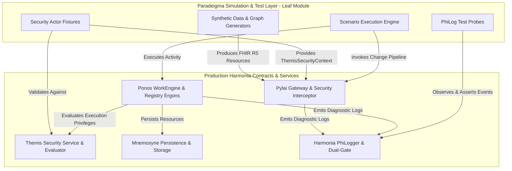

# Requirements

### Overview & Goals
The objective is to extend the existing **Harmonia Paradeigma** simulation, synthetic data, and scenario framework so that it can generate, execute, and validate realistic scenarios involving:
1. **Provider Registry** (FHIR R5 Practitioner, PractitionerRole, Organization, Location, HealthcareService, Endpoint, Group, referential validation, and change pipeline lifecycle).
2. **Harmonia PHI-Aware Logging** (Dual-gate diagnostic logging policy, `org.harmonia.phi` namespace, `PHI` SLF4J Marker, operational log sanitization, and secret non-leakage).
3. **Harmonia Security** (`Themis` RBAC/ABAC authorization, dual-authority async governance, security principals, roles, authorities, and defense-in-depth enforcement).

Paradeigma acts strictly as a **simulation and test-support leaf module**. It exercises and observes public Harmonia production contracts without implementing production business logic or polluting production artifacts.

### Scope
- **In Scope**:
  - Deterministic synthetic data generators for FHIR R5 Provider Registry resources with Australian Healthcare Identifiers (HPI-I, HPI-O).
  - Graph builders for interconnected provider topologies and deliberately invalid/broken reference graphs.
  - Reusable security actors and context factories for Provider Stewards, Clinicians, System Admins, Integration Services, and Unauthorized Users using Themis contracts.
  - Test probes and assertion utilities for validating PHI dual-gate logging, marker routing, operational isolation, and credential leak prevention.
  - Automated architectural enforcement (ArchUnit and Maven dependency checks) guaranteeing leaf-module isolation.
  - Comprehensive functional, security, failure, and cross-capability end-to-end scenario suites.
  - Comprehensive documentation covering architecture, scenarios, and worked examples.
- **Out of Scope**:
  - Modifying production Provider Registry business rules, persistence schemas, or workflow engines.
  - Modifying the production `PhiLogger` implementation or Themis policy evaluator core engines.
  - Adding Paradeigma runtime code to production artifacts, WARs, or container images.

### User Stories
- **As a Harmonia Integration Engineer**, I want to generate deterministic, referentially valid FHIR R5 Provider Registry graphs so that I can validate multi-resource synchronization and gateway ingestion.
- **As a Security & Compliance Officer**, I want Paradeigma to simulate authorized and unauthorized transactions across all roles so that I can continuously verify that access controls and defense-in-depth gates are enforced.
- **As a Privacy Auditor**, I want Paradeigma to verify that Patient Health Information (PHI) and authentication secrets never leak into operational log destinations under any log level.
- **As a Release Engineer**, I want automated build-time architectural checks to fail immediately if any production module attempts to depend on or import Paradeigma.

### Functional Requirements
1. **Provider Registry Synthetic Generation**:
   - Deterministic resource generation (`Practitioner`, `PractitionerRole`, `Organization`, `Location`, `HealthcareService`, `Endpoint`, `Group`) based on configurable seed.
   - Support for valid graphs, incomplete payloads, invalid references, duplicate identifiers, inactive states, and version updates.
2. **Security Simulation**:
   - Reusable actor definitions matching `HarmoniaRoleEnum` and `HarmoniaAuthorityEnum`.
   - Simulation of Pylai ingress security checks, Ponos execution authorization, and Ergon persistence privileges.
   - Simulation of security failure modes: missing authorities, unauthenticated requests, revoked roles, expired contexts.
3. **PHI Logging Simulation & Assertions**:
   - Support for testing all 5 logging matrix scenarios (INFO + PHI disabled, DEBUG + PHI disabled, TRACE + PHI disabled, DEBUG + PHI enabled, TRACE + PHI enabled).
   - Assertion probe verifying `org.harmonia.phi` logger namespace and `PHI` marker attachment.
   - Verification that synthetic secrets (JWTs, API keys, passwords) are never logged in any stream.
4. **Lifecycle & Negative Testing**:
   - Execution of governed change request lifecycle (`RECEIVED` -> `VALIDATING` -> `APPROVED` -> `COMMITTING` -> `COMPLETED`).
   - Assertion of FHIR `OperationOutcome` on validation rejections.
   - Simulation of infrastructure/persistence failures via explicit test seams (e.g. `FailingProviderRepository`).
5. **Correlation & Non-PHI Observability**:
   - Propagation and validation of `correlationId`, `causationId`, and `pragmaId` across all scenario steps.
   - Scenario telemetry reporting without PHI in metric tags or log parameters.

### Non-Functional Requirements
- **Deterministic Reproducibility**: Given the same seed (e.g. `12345`), identical synthetic datasets and scenario sequences must be produced.
- **Performance & Isolation**: Architecture tests and scenario suites must execute within standard Maven test lifecycle without hanging or resource leaks.
- **Production Cleanliness**: Zero simulation branches (`if (isSimulation)`) or Paradeigma classes in production code and packaging.

# Technical Design

### Current Implementation
- **Paradeigma** currently comprises `paradeigma-common` (MLLP client/server, HL7 v2 parsers/builders, patient generators), `paradeigma-pas`, `paradeigma-emr`, `paradeigma-lms`, `paradeigma-rispac`, `paradeigma-scenarios` (patient journey engine), and `paradeigma-test`.
- **Provider Registry** is governed by `pylai-fhir-registry` (REST ingress controller, `FhirSecurityInterceptor`, `ChangeRequestSubmissionService`), `energeia/erga` (`AbstractProviderRegistryChangeErgon`, specific resource Change Ergons), and `hestia/mneme-persistence` (`FhirStorageService`).
- **Security** is implemented in `themis-api`, `themis-core` (`DeterministicPolicyEvaluator`), and `calliope` (`HarmoniaRoleEnum`, `HarmoniaAuthorityEnum`, `ThemisSecurityContext`).
- **Logging** is implemented in `calliope` (`PhiLogger`, `DefaultPhiLogger`, `PhiLoggerFactory`, `PhiLoggingConfig`).

### Key Architectural Decisions
1. **Strict Leaf-Module Topology**:
   - Paradeigma submodules may depend on `calliope`, `themis-api`, `pylai-fhir-registry`, `erga`, `praxis`, and `mnemosyne-clinical`.
   - Production modules NEVER depend on `paradeigma-*`.
   - Automated enforcement is implemented using ArchUnit architecture tests and Maven Enforcer rules.
2. **Reuse of Production Contracts**:
   - No duplicate domain models. Synthetic generators instantiate official HAPI FHIR R5 models and Calliope/Themis security/pragma structures.
3. **Seam-Based Failure Injection**:
   - Failure injection relies on test mocks, fake repositories implementing `FhirResourceRepository`/`FhirStorageService`, or invalid input data — never runtime `if (simulationMode)` flags in production code.
4. **Isolated Test Probes for Logging**:
   - A dedicated `PhiLogTestProbe` attaches temporary appenders to SLF4J/Logback during test runs to inspect event streams without modifying production logger internals.

### Component Architecture Diagram



### Proposed Changes & File Structure

```
harmonia/
├── pom.xml                                      # Add ArchUnit dependency & Enforcer plugin rules
├── paradeigma/
│   ├── paradeigma-common/
│   │   └── src/main/java/net/fhirfactory/harmonia/paradeigma/common/
│   │       ├── generator/
│   │       │   ├── SeedRandom.java              # Existing seed-based PRNG
│   │       │   ├── SyntheticProviderRegistryGenerator.java # Enhanced graph & scenario generator
│   │       │   ├── PractitionerGenerator.java   # Dedicated Practitioner builder
│   │       │   ├── PractitionerRoleGenerator.java # PractitionerRole builder
│   │       │   ├── OrganizationGenerator.java   # Organization builder
│   │       │   ├── LocationGenerator.java       # Location builder
│   │       │   ├── HealthcareServiceGenerator.java # HealthcareService builder
│   │       │   ├── EndpointGenerator.java       # Endpoint builder
│   │       │   └── GroupGenerator.java          # Group builder
│   │       ├── security/
│   │       │   ├── ParadeigmaSecurityActors.java # Predefined Themis principals/contexts
│   │       │   └── SecurityScenarioContext.java # Context wrapper for test actions
│   │       └── logging/
│   │           ├── PhiLogTestProbe.java         # In-memory Logback test probe for assertions
│   │           └── SecretLeakageAssertion.java  # Sentinels & assertion helpers for secrets
│   ├── paradeigma-scenarios/
│   │   └── src/main/java/net/fhirfactory/harmonia/paradeigma/scenarios/
│   │       ├── model/
│   │       │   ├── ProviderRegistryScenarioResult.java # Detailed execution report
│   │       │   └── ScenarioExpectation.java    # Expected outcomes, decisions, and log assertions
│   │       └── registry/
│   │           ├── ProviderRegistryScenarioEngine.java # Orchestrator for registry scenarios
│   │           └── ProviderRegistryJourneyScenario.java # Reusable scenario workflows
│   └── paradeigma-test/
│       └── src/test/java/net/fhirfactory/harmonia/paradeigma/test/
│           ├── arch/
│           │   └── ParadeigmaIsolationArchitectureTest.java # ArchUnit tests enforcing leaf isolation
│           ├── registry/
│           │   ├── ProviderRegistryLifecycleScenarioTest.java # Comprehensive lifecycle tests
│           │   ├── ProviderRegistrySecurityScenarioTest.java  # Themis RBAC/ABAC scenario tests
│           │   ├── ProviderRegistryLoggingScenarioTest.java   # Dual-gate PHI logging tests
│           │   ├── ProviderRegistryFailureSeamTest.java       # Test-seam failure injection tests
│           │   └── ProviderRegistryCrossCapabilityE2ETest.java # End-to-end multi-concern scenario
│           └── generator/
│               └── ProviderRegistryGeneratorDeterminismTest.java # 100% determinism validation
└── docs/
    └── paradeigma/
        ├── architecture.md                      # Updated architecture & isolation principles
        ├── provider-registry-simulation.md      # Guide for generating registry topologies
        ├── security-simulation.md               # Guide for simulating Themis actors & rules
        └── logging-simulation.md                # Guide for validating dual-gate PHI logging
```

### Data Models / Contracts

#### Scenario Model
```java
public record ScenarioDefinition(
    String scenarioId,
    String name,
    String description,
    long seed,
    ThemisSecurityContext actorContext,
    List<IBaseResource> resources,
    ScenarioExpectation expectation
) {}

public record ScenarioExpectation(
    PragmaStatus expectedPragmaStatus,
    ThemisDecision expectedSecurityDecision,
    boolean expectOperationOutcome,
    String expectedIssueCode,
    boolean expectPhiLogged,
    boolean expectSecretsBlocked
) {}
```

#### Logging Assertion Probe Contract
```java
public class PhiLogTestProbe implements AutoCloseable {
    public static PhiLogTestProbe startCapture();
    public List<ILoggingEvent> getOperationalEvents();
    public List<ILoggingEvent> getPhiDiagnosticEvents();
    public void assertNoPhiInOperationalLogs();
    public void assertPhiPresentInDiagnosticLogs();
    public void assertNoSecretsInAnyLog(List<String> secretSentinels);
}
```

# Testing

### Validation Approach
Verification is structured into four distinct layers:
1. **Architectural Enforcement**: Automated ArchUnit and Maven validation tests verifying zero upstream dependencies on Paradeigma and zero production imports.
2. **Generator Determinism**: Unit tests validating that synthetic resource generators and graph builders produce bit-for-bit identical outputs given identical seeds.
3. **Security & Logging Policy Verification**: Parameterized matrix tests validating Themis decision outcomes and PHI dual-gate logging behaviors.
4. **End-to-End Lifecycle & Failure Verification**: Integration tests executing full change workflows against Pylai, Ponos Ergons, Themis, and Mnemosyne storage seams.

### Key Scenarios & Test Matrix

| # | Test Scenario | Description | Expected Outcome |
|---|---------------|-------------|------------------|
| 1 | Deterministic Resource Gen | Seeded generation of Practitioner, Role, Org, Location, Svc, Endpoint, Group | Identical resource graphs for identical seed |
| 2 | Referentially Valid Graph | Connected Org -> Location/Endpoint -> Svc -> Practitioner -> Role | Clean validation pass, 202 Accepted |
| 3 | Deliberately Broken Graph | PractitionerRole pointing to non-existent Location / Org | Validation rejection (`REJECTED`), FHIR `OperationOutcome` |
| 4 | Governed Write Lifecycle | POST Practitioner -> Pylai -> Ponos Ergon -> Mnemosyne | Checkpoint progression `RECEIVED` -> `VALIDATING` -> `APPROVED` -> `COMMITTING` -> `COMPLETED` |
| 5 | Governed Update & ETag | PUT Practitioner with matching `If-Match: W/"1"` | Version incremented to `2`, `lastUpdated` timestamp updated |
| 6 | Stale ETag Conflict | PUT Practitioner with mismatched `If-Match: W/"99"` | Precondition Failed (HTTP 412 / `FAILED` Pragma) |
| 7 | Duplicate Identifier Detection | Create Practitioner with already registered HPI-I | Conflict / Validation error with OperationOutcome issue code |
| 8 | Authorized Provider Read | Clinician requests `GET /Practitioner/{id}` | HTTP 200 OK with FHIR resource |
| 9 | Unauthorized Provider Read | Unauthenticated / Unauthorized user requests `GET` | HTTP 401 / 403 Forbidden |
| 10 | Authorized Change Request | Provider Steward submits `POST /Practitioner` | Themis ALLOW -> HTTP 202 Accepted -> Pragma created |
| 11 | Unauthorized Change Request | Read-Only user submits `POST /Practitioner` | Themis DENY -> HTTP 403 Forbidden -> Database untouched |
| 12 | Defense in Depth (Ergon Revoke)| Pylai ALLOWs, but Ergon execution authority is missing | Ponos halts -> Pragma `FAILED` -> Storage untouched |
| 13 | Defense in Depth (Storage Revoke)| Ergon executes, but persistence authority missing | Pragma `FAILED` at `COMMIT_DENIED_BY_THEMIS` |
| 14 | Logging: INFO + PHI Disabled | Normal operations at INFO level | Operational logs populated; PHI absent |
| 15 | Logging: DEBUG + PHI Disabled | Detailed diagnostics at DEBUG level | Operational DEBUG logs populated; PHI absent |
| 16 | Logging: TRACE + PHI Disabled | Deep trace diagnostics with PHI disabled | Operational TRACE logs populated; PHI absent |
| 17 | Logging: DEBUG + PHI Enabled | `harmonia.logging.phi-enabled=true` + DEBUG | PHI appears in `org.harmonia.phi` with Marker `PHI` |
| 18 | Logging: TRACE + PHI Enabled | `harmonia.logging.phi-enabled=true` + TRACE | Full PHI payload diagnostics emitted with Marker `PHI` |
| 19 | Secret Leakage Prevention | Submit change containing synthetic OAuth token / password | Token / secret is never present in operational or PHI logs |
| 20 | Correlation Preservation | Track transaction across Pylai, Ponos, and Ergon | `X-Correlation-Id` preserved in all Pragma checkpoints and responses |
| 21 | Persistence Failure Seam | Simulate DB error using `FailingProviderRepository` | Pragma transitions to `FAILED`, transaction rolled back |
| 22 | Leaf Module Architecture Rule | ArchUnit scan across all production classes | Zero dependencies / imports on `net.fhirfactory.harmonia.paradeigma.*` |

# Architecture Enforcement

### Mandatory Architectural Invariants
1. **Direction of Dependency**:
   - `paradeigma` $\rightarrow$ `production Harmonia` : **ALLOWED**
   - `production Harmonia` $\rightarrow$ `paradeigma` : **FORBIDDEN**
2. **Zero Production Contamination**:
   - No production `.java` file may import `net.fhirfactory.harmonia.paradeigma.*`.
   - No production `pom.xml` may declare a dependency on `paradeigma` or any of its submodules.
   - Production business logic must not inspect simulation state (no `if (isSimulation)` branches).
3. **Artifact & Packaging Isolation**:
   - Production container images and WAR/JAR distributions must not package Paradeigma artifacts.

### Automated ArchUnit Rules
The following ArchUnit rule is integrated into `ParadeigmaIsolationArchitectureTest`:

```java
@ArchTest
public static final ArchRule no_production_classes_should_depend_on_paradeigma =
    noClasses()
        .that().resideOutsideOfPackage("net.fhirfactory.harmonia.paradeigma..")
        .should().dependOnClassesThat()
        .resideInAPackage("net.fhirfactory.harmonia.paradeigma..");
```

### Maven Build-Time Enforcement
Maven Enforcer rule in platform parent POM:
- `bannedDependencies` rule configured to reject any dependency on `net.fhirfactory.harmonia:paradeigma*` in non-paradeigma modules.
- CI pipeline executes `mvn clean verify` which runs the architecture test suite on every commit. A rule violation immediately terminates the build with failure.

# Documentation

### Documentation Updates
1. **`paradeigma/README.md`**:
   - Update overview to highlight Provider Registry, Security, and PHI Logging simulation capabilities.
   - Clarify the leaf-module dependency rule and testing role.
2. **`paradeigma/docs/architecture.md`**:
   - Document the architectural isolation model, Maven dependency boundaries, and ArchUnit verification.
   - Add sequence diagrams illustrating the governed Provider Registry change request lifecycle.
3. **`paradeigma/docs/provider-registry-simulation.md` (New)**:
   - Provide detailed guidance on using `SyntheticProviderRegistryGenerator` to create FHIR R5 topologies (Organizations, Locations, HealthcareServices, Endpoints, Practitioners, Roles, Groups).
   - Document how to test both valid and deliberately invalid reference graphs.
4. **`paradeigma/docs/security-simulation.md` (New)**:
   - Detail the `ParadeigmaSecurityActors` catalog (Provider Steward, Clinician, System Admin, etc.).
   - Explain how to configure `ThemisSecurityContext` for authorized and unauthorized scenario testing.
5. **`paradeigma/docs/logging-simulation.md` (New)**:
   - Detail the Harmonia dual-gate PHI logging policy (`harmonia.logging.phi-enabled=true` + DEBUG/TRACE).
   - Explain how to use `PhiLogTestProbe` and `SecretLeakageAssertion` in scenario tests.

### Worked Exemplar Guide
Include an end-to-end worked example in the documentation demonstrating:
1. Initializing seeded generators (`SeedRandom(42)`).
2. Generating a complete provider graph.
3. Creating a Provider Steward security context.
4. Submitting a change request via Pylai REST Gateway.
5. Processing through Ponos Ergon pipeline.
6. Enabling dual-gate PHI logging and asserting logs via `PhiLogTestProbe`.
7. Asserting no secrets leaked into any log destination.

# Delivery Steps

### ✓ Step 1: Phase 1: Architecture Enforcement & Production Isolation Checks
Architectural rules and build-time checks are active to prevent production modules from depending on or importing Paradeigma.

- Add an ArchUnit test suite (`ParadeigmaIsolationArchitectureTest.java` in `harmonia-architecture-tests` or `paradeigma-test`) verifying that no production class in `net.fhirfactory.harmonia.*` outside `paradeigma` references `net.fhirfactory.harmonia.paradeigma.*`.
- Add a Maven POM dependency validation test / rule ensuring no production artifact POM declares a dependency on `paradeigma` or its submodules.
- Add static checks verifying production code contains no simulation flags (e.g. `paradeigmaMode`, `simulationMode`, `syntheticRequest`).
- Verify production JAR/WAR packaging configurations exclude Paradeigma components.

### ✓ Step 2: Phase 2: Provider Registry Synthetic Data & Graph Generators
Paradeigma has dedicated deterministic synthetic generators for all supported FHIR R5 Provider Registry resource types and graph topologies.

- Implement modular synthetic generators (`PractitionerGenerator`, `PractitionerRoleGenerator`, `OrganizationGenerator`, `LocationGenerator`, `HealthcareServiceGenerator`, `EndpointGenerator`, `GroupGenerator`) seeded via `SeedRandom`.
- Support generating valid resources, incomplete resources, deliberately invalid resources, duplicate Australian identifiers (HPI-I, HPI-O), and inactive resources.
- Implement graph builders in `SyntheticProviderRegistryGenerator` to create interconnected topologies (Solo Practitioner, Multi-role Specialist, Network Organization with Locations and Endpoints) as well as broken reference graphs.
- Add unit tests verifying 100% deterministic reproducibility given the same seed across all generators.

### ✓ Step 3: Phase 3: Security Actor Fixtures & Authentication/Authorization Contexts
Paradeigma provides standardized security actor fixtures and context factories representing all key Harmonia roles and permissions.

- Implement `ParadeigmaSecurityActors` providing pre-configured `ThemisPrincipal` and `ThemisSecurityContext` instances for Provider Steward, Clinician, System Administrator, Integration Service, Read-Only User, Unauthenticated Principal, and Unauthorized Principal.
- Map actor permissions to canonical `HarmoniaRoleEnum` and `HarmoniaAuthorityEnum` contracts from `calliope` and `themis-api`.
- Create simulation test seam fixtures for simulating authentication failures, expired security contexts, missing roles, and revoked authorities.
- Add unit tests validating security actor permissions against `DeterministicPolicyEvaluator` and `ThemisService`.

### ✓ Step 4: Phase 4: PHI-Aware Logging Test Probes & Secret Leakage Assertions
Paradeigma includes dedicated logging probes and assertions to validate the Harmonia dual-gate PHI logging policy and secret protection.

- Implement `PhiLogTestProbe` capturing SLF4J log events across operational namespaces and the dedicated `org.harmonia.phi` namespace.
- Implement assertions verifying: dual-gate activation (`harmonia.logging.phi-enabled` + DEBUG/TRACE level), `PHI` marker attachment, non-exposure in INFO/WARN/ERROR, and operational vs PHI log segregation.
- Implement `SecretLeakageAssertion` testing with synthetic sentinels (passwords, JWTs, OAuth tokens, API keys, database credentials) to verify secrets never appear in any log stream.
- Add unit tests validating logging probes under all combination states of PHI configuration and log levels.

### ✓ Step 5: Phase 5: Lifecycle Scenario Framework & Cross-Capability Integration Tests
Common scenario abstractions are defined and implemented to execute and validate full lifecycle Provider Registry change workflows with security and logging governance.

- Define core scenario abstractions (`ParadeigmaScenario`, `ScenarioContext`, `ScenarioStep`, `ScenarioExpectation`, `ScenarioExecutionReport`).
- Implement end-to-end positive write lifecycle scenario (POST/PUT -> Pylai RBAC -> Petasos Queue -> Ponos Workflow -> Ergon validation -> Mnemosyne commit -> synchronous search verification).
- Implement negative lifecycle scenarios: validation rejection returning FHIR `OperationOutcome`, unauthorized access denial (HTTP 403 / Themis DENY), ETag optimistic locking conflict, and simulated persistence failure using test repository seams.
- Implement cross-capability scenarios combining Provider Registry change, Security governance, and dual-gate PHI logging verification.

### ✓ Step 6: Phase 6: Documentation & Worked Exemplar Suite
Paradeigma documentation is updated with complete architecture principles, worked examples, and simulation guidelines.

- Update `paradeigma/README.md` and `paradeigma/docs/architecture.md` with the leaf-module dependency architecture, production isolation rules, and scenario model.
- Author dedicated documentation guides: `provider-registry-simulation.md`, `security-simulation.md`, and `logging-simulation.md`.
- Include a complete worked example illustrating synthetic scenario generation, security context setup, lifecycle execution, and multi-channel logging assertion.