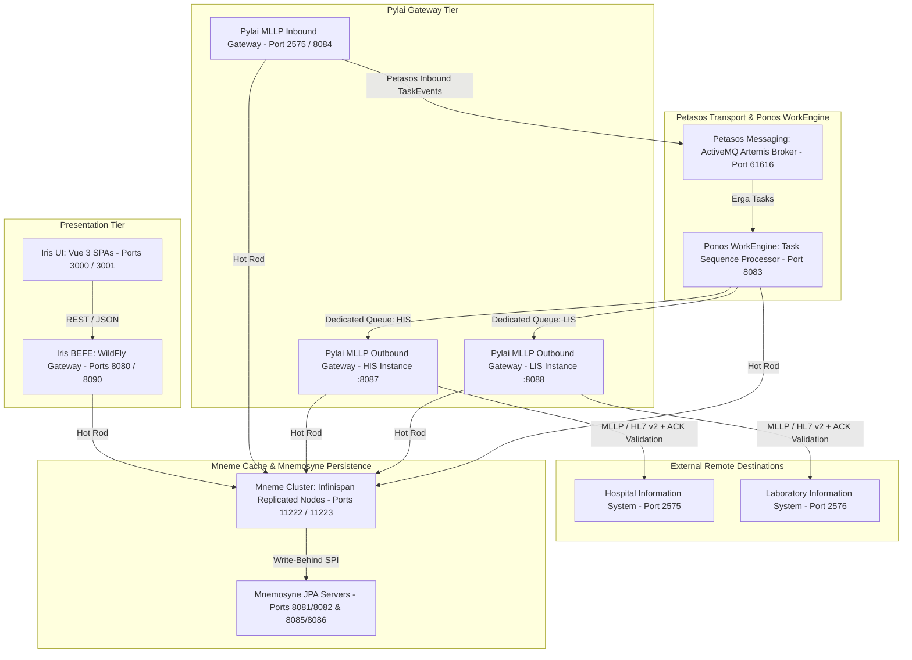

# Requirements

### Overview & Goals
The Harmonia platform has expanded its gateway capabilities within the **Pylai Gateway Tier** to include a dedicated, resilient, multi-instance **MLLP Outbound Gateway Subsystem** (`pylai-mllp-out`). The primary objective of this task is to update the platform documentation across both the root `README.md` and the publication-grade ArchiMate 3.2 LaTeX specification (`docs/latex/`) so that the documentation accurately and comprehensively reflects the complete solution, architecture, container topology, port mappings, and data flow.

### Scope
#### In Scope
- **Root `README.md` Updates**:
  - Update architectural naming matrix for `Pylai` to include both ingress and egress capabilities.
  - Update 5-tier Mermaid architecture diagram to include outbound MLLP gateways.
  - Update submodule catalog to document `pylai-mllp-out` (WildFly Jakarta EE 10, Apache Camel MLLP client, ACK/NACK validation, independent queues, REST APIs).
  - Update Docker Compose service inventory, running container list, and port allocation table (including `mllp-outbound-his` on `8087` and `mllp-outbound-lis` on `8088`).
  - Add local execution guidance for `pylai-mllp-out`.
- **LaTeX / ArchiMate 3.2 Documentation Updates (`docs/latex/`)**:
  - `00-frontmatter.tex`: Update Executive Summary and Classical Nomenclature matrix.
  - `01-motivation-strategy.tex`: Update strategic capabilities and end-to-end value stream flow.
  - `02-business-layer.tex`: Add clinical outbound dispatch service and business process workflow.
  - `03-application-layer.tex`: Fully specify `pylai-mllp-out`, multi-instance egress, independent Petasos queues per destination, Camel MLLP routes, ACK processing, and Mneme cache state updates.
  - `04-data-architecture.tex`: Document canonical outbound models (`OutboundMllpRequest`, `OutboundMllpResponse`, `MllpDestinationConfig`) and FHIR resource audit mappings.
  - `05-technology-layer.tex`: Update system software runtimes and master port allocation matrix (`8087`, `8088`).
  - `06-deployment-ha.tex`: Update multi-container deployment topology and failure isolation guarantees.
  - TikZ diagrams (`fig-app-overview-5tier.tex`, `fig-technology-nodes.tex`): Update diagrams to include outbound gateway components and nodes.

#### Out of Scope
- Modifying Java source code or test classes in `pylai-mllp-out` (unless documentation adjustments in comments/READMEs are needed).
- Changing runtime Docker configurations in `docker-compose.yml`.

### User Stories
- **As a Solutions Architect**, I want the root `README.md` and ArchiMate 3.2 LaTeX documentation to accurately describe the complete 5-tier architecture and outbound MLLP gateway subsystem so that technical stakeholders have an authoritative reference.
- **As a DevOps / Infrastructure Engineer**, I want the service lists, container inventories, and port allocation matrices to accurately list all running services (including outbound gateway instances on ports 8087 and 8088) so that deployment and network planning are seamless.
- **As an Integration Engineer**, I want the documentation to detail the multi-instance egress architecture, independent Petasos queue model, Camel MLLP client routes, and REST endpoints so that external hospital system integrations are straightforward to configure and test.

### Functional Requirements
- **FR-DOC-1 (Root README Accuracy)**: The root `README.md` must describe all 6 top-level subsystems (`Calliope`, `Petasos`, `Energeia`, `Hestia`, `Iris`, `Pylai`), all submodules (including `pylai-mllp-out`), updated service counts in Docker Compose, and complete port mapping tables.
- **FR-DOC-2 (LaTeX ArchiMate 3.2 Completeness)**: All relevant LaTeX chapters (`00` through `06`) must incorporate the outbound MLLP gateway subsystem with formal ArchiMate layer definitions, tables, and narrative descriptions.
- **FR-DOC-3 (Vector Diagram Consistency)**: TikZ diagrams (`fig-app-overview-5tier.tex`, `fig-technology-nodes.tex`) must visually reflect the outbound gateway components and communication paths while adhering to ArchiMate 3.2 styling (`harmonia-archimate.sty`).
- **FR-DOC-4 (Build Cleanliness)**: LaTeX documentation must compile cleanly via `latexmk` / `pdflatex` / `make` without unresolved references or syntax errors.

# Technical Design

### Current Implementation
The repository contains the implementation of the `pylai-mllp-out` module and associated configuration:
- `pylai/pylai-mllp-out`: Jakarta EE 10 / WildFly WAR containing Camel MLLP producer routes (`OutboundMllpRouteBuilder`), `OutboundMllpProcessor`, `Hl7AckProcessor`, `OutboundTaskQueueConsumer`, `MllpOutboundConfig`, and `OutboundMllpResource`.
- `pylai/pylai-mllp-base`: Outbound domain models (`OutboundMllpRequest`, `OutboundMllpResponse`), `MllpDestinationConfig`, and `MllpDestinationRegistry`.
- `docker-compose.yml`: Deploys 16+ services including two outbound gateway instances (`mllp-outbound-his` on port `8087`, `mllp-outbound-lis` on port `8088`) consuming from dedicated Petasos queues (`petasos.queue.mllp.outbound.his`, `petasos.queue.mllp.outbound.lis`).
- Existing `README.md` and `docs/latex/` specifications partially document the inbound gateway but lack complete details on the outbound MLLP gateway, multi-instance egress, updated Docker Compose service list, and port allocations.

### Key Decisions
1. **Unified Dual Ingress & Egress Documentation for Pylai**:
   - *Decision*: Frame `Pylai` consistently across all documentation as the bidirectional boundary interface tier handling both high-throughput clinical ingress (`pylai-mllp-in`) and multi-instance reliable egress (`pylai-mllp-out`).
   - *Rationale*: Preserves the architectural symmetry of the 5-tier architecture.
2. **Detailed Multi-Instance Egress & Independent Petasos Queues Pattern**:
   - *Decision*: Explicitly document the architectural rationale for independent Petasos queues per outbound endpoint/instance (`petasos.queue.mllp.outbound.<endpoint-id>`).
   - *Rationale*: This is a core architectural discriminator preventing head-of-line blocking and isolating failure domains across remote clinical endpoints.
3. **ArchiMate 3.2 and TikZ Precision**:
   - *Decision*: Maintain strict adherence to ArchiMate 3.2 standards and color schemes (`harmonia-archimate.sty`) in all TikZ diagram updates.
   - *Rationale*: Ensures consistency with existing publication-ready vector figures.

### Architecture Diagram

### Components & Affected Files
- **`README.md`**:
  - Submodules, System Nomenclature, Architecture Diagram, Service Table, Port Mapping, Local Run commands.
- **`docs/latex/chapters/00-frontmatter.tex`**:
  - Executive summary and classical nomenclature matrix.
- **`docs/latex/chapters/01-motivation-strategy.tex`**:
  - Strategic capabilities and value stream flow.
- **`docs/latex/chapters/02-business-layer.tex`**:
  - Outbound business services and dispatch process lifecycle.
- **`docs/latex/chapters/03-application-layer.tex`**:
  - Detailed `pylai-mllp-out` architecture, Camel routes, queue consumption, and REST endpoints.
- **`docs/latex/chapters/04-data-architecture.tex`**:
  - Outbound data contracts and FHIR resource audit mapping.
- **`docs/latex/chapters/05-technology-layer.tex`**:
  - System software runtimes and master port allocation table (`8087`, `8088`).
- **`docs/latex/chapters/06-deployment-ha.tex`**:
  - Docker Compose topology and fault isolation mechanics.
- **`docs/latex/diagrams/fig-app-overview-5tier.tex`**:
  - TikZ vector graphic update for 5-tier landscape.
- **`docs/latex/diagrams/fig-technology-nodes.tex`**:
  - TikZ vector graphic update for technology nodes and ports.

### Risks & Mitigations
- **Risk**: TikZ node overlapping or layout distortion when adding outbound gateway nodes to existing diagrams.
  - *Mitigation*: Adjust coordinate positioning and node distance carefully while testing TikZ rendering via LaTeX compilation.
- **Risk**: Discrepancies between Docker Compose environment variables and documentation port numbers.
  - *Mitigation*: Cross-reference all port allocations with `docker-compose.yml`, `MllpOutboundConfig.java`, and `MllpConfig.java`.

# Testing

### Validation Approach
Verification will ensure all documentation is syntactically valid, consistent across Markdown and LaTeX formats, and accurately reflects all components and port numbers in the codebase.

### Key Scenarios
1. **Root README Completeness & Formatting**:
   - Verify all sections in `README.md` (Nomenclature, Submodules, Architecture, Docker Compose, Local Running, Port Mappings) are complete and accurate.
   - Verify all Mermaid diagrams render valid syntax.
2. **LaTeX Documentation Build Verification**:
   - Run `latexmk -pdf main.tex` or `pdflatex main.tex` within `docs/latex/` to verify zero LaTeX compilation errors or undefined references.
   - Verify that all TikZ diagrams compile cleanly without syntax errors or boundary clipping.
3. **Port & Configuration Consistency Check**:
   - Cross-verify ports (`2575`, `3000`, `3001`, `5432-5435`, `61616-61619`, `8080-8086`, `8087`, `8088`, `8090`, `11222-11223`) across `README.md`, `docker-compose.yml`, `05-technology-layer.tex`, and `fig-technology-nodes.tex`.

# Delivery Steps

### ✓ Step 1: Update Root README.md with Full Solution and MLLP Outbound Architecture
Update the root `README.md` to accurately document the 5-tier architecture including the outbound MLLP gateway subsystem and updated container topology.

- Update the **Architectural Naming Conventions & System Meanings** table to reflect `Pylai`'s dual ingress/egress mandate (inbound MLLP gateway `pylai-mllp-in`, outbound MLLP gateway `pylai-mllp-out`, base integration library `pylai-mllp-base`, and synthetic CLI `pylai-mllp-cli`).
- Update the Mermaid **Architecture Overview** diagram to show both inbound and outbound MLLP gateway instances and their data flow with Petasos and Mneme.
- Add `pylai-mllp-out` to the **Submodules** section under `Pylai`, describing its WildFly Jakarta EE 10 runtime, Apache Camel MLLP client routes, HL7 v2 ACK/NACK validation, independent Petasos queues per endpoint, dynamic destination registry, and Mneme state tracking.
- Update the **Docker Compose** section: update the service count to reflect all running services (including `hie-mllp-outbound-his` and `hie-mllp-outbound-lis`).
- Add outbound gateway REST endpoints and port mappings (`8087`, `8088`) to the **Service Endpoints and Port Mappings** table.
- Add local development instructions for running `pylai-mllp-out`.

### ✓ Step 2: Update LaTeX Frontmatter, Motivation, and Business Architecture Chapters
Update executive summary, strategic capabilities, and clinical business process chapters in `docs/latex/chapters/`.

- Update `docs/latex/chapters/00-frontmatter.tex`:
  - Revise Executive Summary to define `Pylai` as high-throughput bidirectional MLLP and REST ingress/egress gateways.
  - Update Table `tab:system_nomenclature` to reflect `Pylai`'s egress capabilities and `pylai-mllp-out`.
- Update `docs/latex/chapters/01-motivation-strategy.tex`:
  - Update Table `tab:strategic_capabilities` to include outbound MLLP egress and external destination dispatch under `Pylai`.
  - Update the Strategic Value Stream formula and description to include outbound dispatch.
- Update `docs/latex/chapters/02-business-layer.tex`:
  - Add Clinical Outbound Notification & Egress Service to the Clinical Business Services section.
  - Add business process workflow describing the end-to-end outbound MLLP dispatch and ACK validation lifecycle.

### ✓ Step 3: Update LaTeX Application and Data Architecture Chapters
Update application and data architecture chapters in `docs/latex/chapters/` to comprehensively document `pylai-mllp-out` and outbound data structures.

- Update `docs/latex/chapters/03-application-layer.tex`:
  - Enhance Section "Interface & Gateway Tier: `Pylai` Subsystem" with a dedicated detailed subsection for `pylai-mllp-out`.
  - Document multi-instance egress architecture, independent Petasos queues per destination (e.g., `petasos.queue.mllp.outbound.<endpoint-id>`), Camel MLLP producer routes (`direct:mllp-outbound-send`), `OutboundMllpProcessor`, `Hl7AckProcessor`, and REST dispatch endpoints (`/api/mllp/outbound/send`, `/api/mllp/outbound/adt/send`, `/api/mllp/outbound/mfn/send`).
  - Document the dynamic `MllpDestinationRegistry` and destination matching via `Topic` metadata.
  - Document Mneme cache state tracking generating FHIR `Communication`, `Task` (`Pragma`), and `Provenance` resources.
- Update `docs/latex/chapters/04-data-architecture.tex`:
  - Document the canonical outbound models (`OutboundMllpRequest`, `OutboundMllpResponse`, `MllpDestinationConfig`).
  - Update Table `tab:fhir_resources` to explain how `Communication`, `Task`, and `Provenance` track outbound transmissions and ACK/NACK responses.

### ✓ Step 4: Update LaTeX Infrastructure Chapters and TikZ Diagrams
Update infrastructure, deployment, and TikZ vector diagrams to reflect the outbound gateway nodes, ports, and data flow.

- Update `docs/latex/chapters/05-technology-layer.tex`:
  - Update System Software Runtimes to include `pylai-mllp-out` under WildFly Jakarta EE 10 / Java 21 runtimes.
  - Update Table `tab:port_allocation` to include ports `8087` (`pylai-mllp-out-his`) and `8088` (`pylai-mllp-out-lis`).
- Update `docs/latex/chapters/06-deployment-ha.tex`:
  - Update the Docker Compose Multi-Container Deployment section to include the outbound MLLP gateway instances (`mllp-outbound-his`, `mllp-outbound-lis`).
  - Document fault domain isolation provided by independent Petasos queues per egress destination.
- Update TikZ Vector Diagrams in `docs/latex/diagrams/`:
  - `docs/latex/diagrams/fig-app-overview-5tier.tex`: Add Pylai Outbound Gateway component with flow from Petasos/Ponos and connection to Mneme cache.
  - `docs/latex/diagrams/fig-technology-nodes.tex`: Add Pylai Outbound Gateway node with ports `8087`/`8088` and communication paths.

### * Step 5: Verify LaTeX Documentation Build and Documentation Consistency
Validate the compilation of LaTeX documentation and verify Markdown rendering consistency across documentation files.

- Verify LaTeX documentation builds cleanly via `docs/latex/Makefile` or direct compilation (`pdflatex` / `latexmk`).
- Verify that all cross-references, tables, labels, and TikZ diagrams render properly without LaTeX errors or missing references.
- Verify Markdown formatting and links in `README.md` and `docs/latex/README.md`.