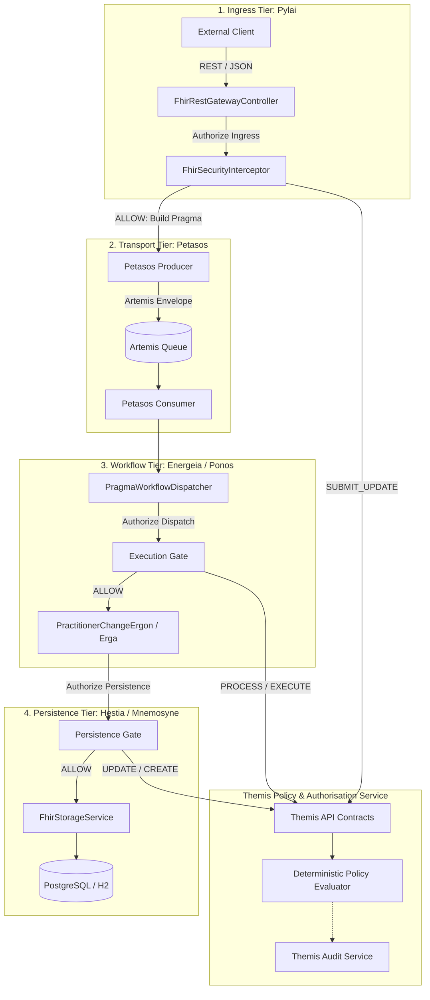

# Requirements

### Overview & Goals
The objective of this initiative is to provide comprehensive, detailed, and authoritative documentation for the **Harmonia Security Framework (Themis)** across all project documentation assets (Markdown documentation in `docs/security/`, subsystem guides in `docs/provider-registry/`, platform overview in `docs/architecture.md` and `README.md`, and formal LaTeX architectural documentation in `docs/latex/`).

The updated documentation will provide clear technical specifications for the platform's **defence-in-depth** architecture, **default-deny** policy model, role-to-authority mappings, data security labeling, immutable caller context propagation, multi-tier boundary enforcement, audit logging, and failure recovery.

### Scope
#### In Scope
- **Themis Subsystem Documentation (`docs/security/`)**:
  - Subsystem architecture, deterministic pipeline evaluation, and domain model specifications (`themis.md`, `architecture.md`, `policy-model.md`).
  - Identity model, principal types, mnemonic roles, granular authorities, and service identities (`principals.md`, `roles-authorities.md`, `service-identities.md`).
  - Multi-tier boundary enforcement and context propagation (`pylai-security.md`, `pragma-security.md`, `ponos-security.md`, `ergon-security.md`, `provider-registry-security.md`).
  - Security labels and FHIR `meta.security` mapping (`security-labels.md`).
  - Structured non-PHI auditing, failure modes, threat modeling, and gap tracking (`audit.md`, `failure-behaviour.md`, `threat-model.md`, `security-gaps.md`, `testing.md`).
- **Subsystem & Platform Cross-Reference Updates**:
  - Update `docs/provider-registry/security.md` to align with Themis architecture and deprecate obsolete pre-Themis role descriptions.
  - Update `docs/architecture.md` and `README.md` with security indices, component descriptions, and architectural diagrams.
- **Formal LaTeX Architectural Chapters (`docs/latex/`)**:
  - Update LaTeX architectural chapters (`03-application-layer.tex`, `05-technology-layer.tex`) and diagrams to document Themis, defence-in-depth boundaries, and security context propagation.

#### Out of Scope
- Modifying executable Java source code or altering application security runtime logic (this task is strictly documentation-focused).
- Introducing external identity provider infrastructure (OAuth2/OIDC IDPs) outside of Themis authorization contracts.

### User Stories
- **As a Security Architect & Auditor**, I want an exhaustive, mathematically precise documentation suite detailing Themis policy evaluation, fail-closed mechanics, and decision auditing so that I can verify compliance with healthcare data protection standards.
- **As a Software Engineer**, I want concrete code contracts, sequence diagrams, and configuration guides for implementing security envelopes on new Ergon activities and gateway endpoints so that I can develop secure integrations without bypassing platform policies.
- **As a System Administrator**, I want clear documentation on service identities, least-privilege authority mappings, and threat mitigations so that I can safely configure and operate Harmonia in production environments.

### Functional Requirements
- **FR-1 (Deterministic Policy Specification)**: Clearly document the 3-stage deterministic evaluation pipeline (`Explicit Deny` $\rightarrow$ `Policy Rules` $\rightarrow$ `Default Deny`), order precedence, and policy rule definitions.
- **FR-2 (Identity & Authority Matrix)**: Provide complete reference tables mapping mnemonic roles (`HarmoniaRoleEnum`) to granular authorities (`HarmoniaAuthorityEnum`), and internal service identities (`HarmoniaServiceIdentities`).
- **FR-3 (Multi-Tier Boundary Flow)**: Document every security checkpoint in sequence (Pylai Ingress $\rightarrow$ Pragma Task Context $\rightarrow$ Petasos Message Transport $\rightarrow$ Ponos Dispatch Gate $\rightarrow$ Erga Activity Execution $\rightarrow$ Mnemosyne Persistence Gate) with Mermaid diagrams and sequence interactions.
- **FR-4 (Security Labeling & FHIR Mapping)**: Document data classification labels (`HarmoniaSecurityLabelEnum`) and their bi-directional serialization to FHIR R5 `Resource.meta.security`.
- **FR-5 (Audit & Lineage Specification)**: Document `ThemisAuditEvent` schema, sanitization constraints (no PHI, no bearer tokens), and correlation tracking (`correlationId`, `causationId`, `pragmaId`).
- **FR-6 (Failure & Threat Model)**: Document all `ThemisDecisionReason` codes, fail-closed handling rules, threat vectors, and the status of architectural security gaps (GAP-01 to GAP-07).

### Non-Functional Requirements
- **Clarity & Consistency**: Terminology, acronyms, and model names must remain 100% consistent across markdown docs, LaTeX sources, and codebase artifacts.
- **Diagram Readability**: All architectural flows must include clear Mermaid or TikZ diagrams illustrating boundary enforcement and data flow.
- **Publication Readiness**: LaTeX documentation must compile cleanly into `main.pdf` without broken cross-references or formatting regressions.

# Technical Design

### Current Implementation
- **Themis Subsystem (`themis`)**: Implemented in Java across `themis-api`, `themis-core`, and `themis-audit` with deterministic policy evaluation, role mappings, and audit logging.
- **Documentation State**:
  - `docs/security/`: Contains initial topic-specific markdown files (`themis.md`, `architecture.md`, `audit.md`, etc.), which require expansion, complete tables, unified terminology, and comprehensive flow diagrams.
  - `docs/provider-registry/security.md`: Contains older legacy permission strings (e.g. `Practitioner.read`, `ROLE_ADMIN`) that do not reflect the implemented Themis role/authority model and persistence gates.
  - `docs/architecture.md` & `README.md`: Contain high-level architecture overviews but need comprehensive cross-references to the security framework documentation suite.
  - `docs/latex/`: Contains the formal platform specification book; mentions basic security aspects in Application Layer (chapter 3) and Data Architecture (chapter 4), but needs detailed treatment of Themis policy evaluation and defence-in-depth boundaries.

### Key Decisions
1. **Centralized & Modular Security Documentation**:
   - *Rationale*: Maintain `docs/security/` as the single source of truth for all security specifications, while updating other domain docs (`docs/provider-registry/`, `docs/architecture.md`) to cross-reference and align with this standard.
2. **Unified Role and Authority Nomenclature**:
   - *Rationale*: Consistently use `HarmoniaRoleEnum` (`PRV_RDR`, `PRV_SUB`, `PRV_PROC`, `PRV_APR`, `PRV_ADM`, `AUD_RDR`, `SYS_INT`, `SYS_ADM`) and `HarmoniaAuthorityEnum` (`provider.read`, `provider.change.submit`, `provider.resource.update`, etc.) across all documents.
3. **Dual Markdown and LaTeX Synchronisation**:
   - *Rationale*: Markdown provides immediate in-repo developer accessibility, while LaTeX generates the formal publication-ready platform architecture manual.

### Architecture Diagram

### Affected Files & Documentation Map
1. **`docs/security/` Module**:
   - `architecture.md`: Executive overview, defence-in-depth principles, boundary checkpoint matrix, and non-amplification invariants.
   - `themis.md`: Themis subsystem contracts (`ThemisService`, `ThemisAuthorizer`), models, and deterministic evaluation pipeline.
   - `policy-model.md`: Policy interface (`ThemisPolicy`), precedence rules, and built-in policy specifications (`ProviderRegistryReadPolicy`, `SubmitPolicy`, `ProcessPolicy`, `PersistPolicy`, `SystemAdminPolicy`).
   - `roles-authorities.md`: Decoupling philosophy, complete `HarmoniaRoleEnum` table, and `HarmoniaAuthorityEnum` vocabulary.
   - `principals.md`: Identity models (`ThemisPrincipal`), `PrincipalType` categories, naming conventions, and credential hygiene.
   - `service-identities.md`: Internal service identity catalogue (`HarmoniaServiceIdentities`) and administrative separation.
   - `security-labels.md`: Data classification codes (`HarmoniaSecurityLabelEnum`) and bi-directional FHIR `meta.security` mapping.
   - `pylai-security.md`: Ingress security interceptor, request mapping, and asynchronous task submission sequence.
   - `pragma-security.md`: Immutable originating context, context serialization, and FHIR R5 Task extensions.
   - `ponos-security.md`: Asynchronous task dispatch gate, dual-authority checks, and failure handling.
   - `ergon-security.md`: `ErgonSecurityDefinition`, activity execution envelopes, and persistence checkpoints.
   - `provider-registry-security.md`: Domain-specific security rules, resource classifications, and storage gate enforcement.
   - `audit.md`: `ThemisAuditEvent` schema, sanitization constraints, correlation tracking, and audit access controls.
   - `failure-behaviour.md`: Fail-closed security policy, comprehensive `ThemisDecisionReason` catalogue, and exception handling.
   - `threat-model.md`: Threat vectors, architectural mitigations, and residual risk analysis.
   - `security-gaps.md`: Architectural gap matrix (GAP-01 to GAP-07) tracking status, mitigations, and priorities.
   - `testing.md`: Utilitarian testing philosophy, acceptance scenarios A through E, and negative/tampering test suites.
2. **Platform & Subsystem Docs**:
   - `docs/provider-registry/security.md`: Updated to reference Themis roles, authorities, and defence-in-depth validation.
   - `docs/architecture.md`: Updated with security overview, boundary enforcement index, and links to `docs/security/`.
   - `README.md`: Updated with Themis subsystem details, role catalogue summary, and documentation index.
3. **LaTeX Documentation (`docs/latex/`)**:
   - `chapters/03-application-layer.tex`: Enhanced with Themis subsystem section, security boundary sequence, and policy engine architecture.
   - `chapters/05-technology-layer.tex`: Updated with security governance, identity management, and audit trail specifications.

### Risks & Mitigations
- **Risk**: Outdated or inconsistent role/authority names between markdown documents and LaTeX chapters.
  - *Mitigation*: Derive all documentation tables directly from canonical Java enums (`HarmoniaRoleEnum`, `HarmoniaAuthorityEnum`, `HarmoniaSecurityLabelEnum`, `HarmoniaServiceIdentities`).
- **Risk**: Over-complicating technical documentation with implementation boilerplate.
  - *Mitigation*: Focus on clear architectural contracts, exact data models, sequence diagrams, and decision matrices.

# Testing

### Validation Approach
Documentation changes will be validated through thorough structural reviews, cross-reference consistency checks, markdown link verification, and LaTeX compilation builds.

### Key Scenarios
- **Scenario 1: End-to-End Boundary Traceability**
  - Verify that every boundary checkpoint described in `docs/security/architecture.md` (Pylai $\rightarrow$ Pragma $\rightarrow$ Petasos $\rightarrow$ Ponos $\rightarrow$ Ergon $\rightarrow$ Mnemosyne) has a dedicated detailed specification file with matching component names, actions, and authorities.
- **Scenario 2: Vocabulary & Enum Consistency**
  - Verify that all role codes (`PRV_RDR`, `PRV_SUB`, `PRV_PROC`, `PRV_APR`, `PRV_ADM`, `AUD_RDR`, `SYS_INT`, `SYS_ADM`), authorities (`provider.read`, `provider.change.submit`, etc.), and labels (`PROVIDER_REGISTRY`, `INTERNAL`, `AUDIT`, etc.) match exactly across `docs/security/`, `docs/provider-registry/`, `README.md`, and `docs/latex/`.
- **Scenario 3: Provider Registry Alignment**
  - Ensure `docs/provider-registry/security.md` no longer contains legacy permission strings (`Practitioner.read`, `ROLE_ADMIN`) and correctly references Themis policies and persistence gates.
- **Scenario 4: LaTeX Build Verification**
  - Execute LaTeX compilation in `docs/latex/` to confirm that `main.pdf` compiles cleanly with zero broken references, missing citations, or formatting errors.

### Edge Cases & Integrity Verification
- **Link Integrity**: Check all internal relative links between `docs/security/*.md`, `docs/architecture.md`, `docs/provider-registry/*.md`, and `README.md`.
- **Diagram Syntax**: Verify that all Mermaid diagrams render valid syntax for sequence diagrams, state flows, and graph topologies.
- **Sanitization Review**: Confirm that no documentation examples contain sensitive PHI or mock secrets that violate security best practices.

# Delivery Steps

### ✓ Step 1: Update and expand core Themis security specifications in docs/security
The complete suite of markdown documentation files in `docs/security/` provides exhaustive, production-grade technical references for Themis and defence-in-depth security.

- Expand `docs/security/themis.md` and `docs/security/architecture.md` with complete subsystem topologies, deterministic pipeline mechanics (`Explicit Deny` -> `Policy Rules` -> `Default Deny`), and component contracts.
- Update `docs/security/roles-authorities.md`, `docs/security/principals.md`, and `docs/security/service-identities.md` with full specification tables for `HarmoniaRoleEnum`, `HarmoniaAuthorityEnum`, `PrincipalType`, and internal service identities.
- Detail multi-tier boundary enforcement across `docs/security/pylai-security.md` (ingress evaluation), `docs/security/pragma-security.md` (immutable originating context & FHIR Task extensions), `docs/security/ponos-security.md` (execution/dispatch gate & dual-authority checks), `docs/security/ergon-security.md` (activity security envelopes), and `docs/security/provider-registry-security.md` (persistence authorization gate).
- Enhance `docs/security/audit.md`, `docs/security/failure-behaviour.md`, `docs/security/threat-model.md`, `docs/security/security-gaps.md`, and `docs/security/testing.md` with detailed event models, decision reason codes, fail-closed handling, threat mitigations, and verification scenarios.

### ✓ Step 2: Align Provider Registry, platform architecture, and README documentation
All platform-level and subsystem documentation files accurately incorporate and link to the Themis security framework.

- Refactor `docs/provider-registry/security.md` to replace legacy scope descriptions with Themis default-deny governance, role-to-authority mapping, and multi-tier persistence verification.
- Update `docs/architecture.md` to incorporate the Themis security framework index, boundary topologies, and defence-in-depth principles alongside messaging and persistence architectures.
- Update `README.md` to highlight Themis capabilities, security labels, service identities, and link to the exhaustive `docs/security/` documentation index.

### ✓ Step 3: Update LaTeX architectural documentation and compile verification
The formal LaTeX architectural publication includes a dedicated, comprehensive security chapter and updated application diagrams.

- Update `docs/latex/chapters/03-application-layer.tex` and `05-technology-layer.tex` to detail Themis security architecture, policy evaluation flow, and boundary enforcement.
- Add or update LaTeX diagrams illustrating the defence-in-depth authorization flow and security context propagation.
- Validate the LaTeX documentation structure and ensure clean compilation of `main.pdf` via Makefile/latexmk.