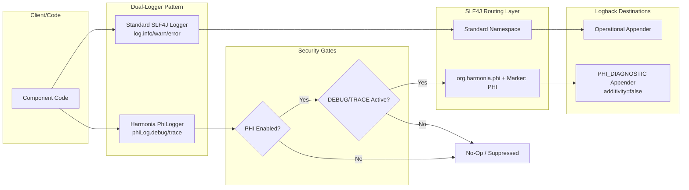

# Requirements

### Overview & Goals
The Harmonia platform incorporates a centralized, architectural control mechanism for logging Patient Health Information (PHI) across its distributed healthcare workflows. To maximize operational utility, maintain developer productivity, and ensure rigorous regulatory compliance (HIPAA, GDPR, Australian Privacy Principles), this documentation update integrates the complete PHI-aware logging architecture and an actionable developer guide into the official ArchiMate 3.2 LaTeX technical specification (`docs/latex`).

The goal is to provide software engineers, platform architects, and compliance officers with an authoritative reference and practical guide within the master architecture document, detailing:
- The dual-logger pattern (`Logger` for operational non-PHI logs vs `PhiLogger` for conditionally permitted diagnostic PHI).
- The dual-gate security evaluation mechanism (`harmonia.logging.phi-enabled=true` AND active `DEBUG`/`TRACE` levels).
- Concrete code examples, supplier-based lazy evaluation for zero overhead, and Logback appender isolation rules.

### Scope
- **In Scope**:
  - Authoring a dedicated LaTeX appendix chapter (`docs/latex/chapters/appendix-phi-logging.tex`) containing the architecture specification, policy matrix, configuration reference, and end-to-end developer guide.
  - Creating a high-precision TikZ vector diagram (`docs/latex/diagrams/fig-phi-logging-architecture.tex`) depicting the dual-gate enforcement, SLF4J namespace routing (`org.harmonia.phi`), marker attachment (`PHI`), and Logback appender isolation.
  - Updating `docs/latex/main.tex` to include the new appendix.
  - Updating `docs/latex/chapters/00-frontmatter.tex` (Executive Summary) to catalog the new appendix.
  - Updating `docs/latex/chapters/01-motivation-strategy.tex` (Core Architectural Principles) to accurately describe the governed PHI logging principle.
  - Updating `docs/latex/chapters/05-technology-layer.tex` (Security Governance & System Software) to detail the logging framework runtime characteristics.
  - Validating complete LaTeX compilation using `pdflatex` / `latexmk` to ensure zero compilation errors, unbroken cross-references, and clean visual typesetting.

- **Out of Scope**:
  - Modifying Java application code or Logback runtime configurations in submodules (already implemented in `calliope` and related tiers).
  - Modifying standalone Markdown documents outside of syncing necessary references.

### User Stories
- **As an Integration Software Developer**, I want an unambiguous, code-rich guide in the LaTeX architecture documentation so that I can implement the dual-logger pattern correctly, utilize lazy supplier evaluation to prevent runtime overhead, and prevent accidental PHI leaks.
- **As a Solutions Architect / Lead**, I want the ArchiMate and TikZ specifications to accurately reflect the dual-gate security controls, dedicated namespace routing, and Logback appender separation across all platform tiers.
- **As a Compliance & Security Auditor**, I want the official system specification to clearly document the logging policy matrix, environment switches, and fail-safe non-additivity guarantees.

### Functional Requirements
1. **Dedicated Appendix Chapter**:
   - Create `docs/latex/chapters/appendix-phi-logging.tex` with label `\label{app:phi_logging}`.
   - Detail the Logging Policy Matrix across `TRACE`, `DEBUG`, `INFO`, `WARN`, `ERROR`.
   - Explain the dual-gate security evaluation model and fail-safe mechanics.
   - Detail configuration parameters (`harmonia.logging.phi-enabled`, `HARMONIA_LOGGING_PHI_ENABLED`) and startup notification banner.
   - Provide a comprehensive Developer Guide:
     - Dual-logger instantiation (`PhiLoggerFactory.getLogger(...)`).
     - Standard message formatting and parameterized arguments.
     - Lazy evaluation using `Supplier<?>` / lambdas for expensive serializations.
     - Specific rules for what constitutes PHI (names, MRNs, DOBs, raw HL7/FHIR payloads) vs non-PHI metadata (task IDs, correlation IDs, status enums).
     - Strict prohibition on authentication tokens, API keys, and passwords.
     - Integration patterns across `pylai`, `energeia`, `hestia`, and `iris`.
     - Logback configuration examples (`logback.xml`) enforcing `additivity="false"` on `PHI_DIAGNOSTIC` appenders.
     - Unit and integration testing guidance using `PhiLoggingConfig`.
2. **TikZ Architecture Diagram**:
   - Create `docs/latex/diagrams/fig-phi-logging-architecture.tex` using the project's ArchiMate styling (`styles/harmonia-archimate.sty` and `styles/harmonia-doc.sty`).
3. **Master Document & Chapter Synchronization**:
   - Add `\input{chapters/appendix-phi-logging.tex}` to `docs/latex/main.tex`.
   - Add an entry in `docs/latex/chapters/00-frontmatter.tex` Executive Summary.
   - Align the architectural principle in `docs/latex/chapters/01-motivation-strategy.tex`.
   - Reference the logging architecture in `docs/latex/chapters/05-technology-layer.tex`.

### Non-Functional Requirements
- **Typesetting Integrity**: Clean compilation under `pdflatex` with zero missing packages, broken labels, or unresolved citations.
- **Style Consistency**: Strict adherence to existing `harmonia-doc.sty` conventions (`\lstlisting`, `tcolorbox`, `tabularx`, and standard color palettes).

# Technical Design

### Current Implementation
The LaTeX documentation suite in `docs/latex` provides an in-depth, ArchiMate 3.2-compliant architecture specification compiled via `pdflatex`/`latexmk`. It currently contains chapters 00 through 06 and appendices A through E (`appendix-paradeigma.tex`, `appendix-mllp-services.tex`, `appendix-ergon-module.tex`, `appendix-praxis-workflow.tex`, `appendix-provider-registry.tex`).

The Java codebase in `calliope` implements the foundational PHI-aware logging framework (`PhiLogger`, `DefaultPhiLogger`, `PhiLoggerFactory`, and `PhiLoggingConfig`). The existing documentation in Markdown (`docs/security/logging.md`) provides raw technical notes, but the master LaTeX specification lacks the dedicated appendix, formal ArchiMate/TikZ diagram, and developer guide necessary for engineering teams.

### Key Decisions
1. **Dedicated Appendix vs Chapter Placement**:
   - *Decision*: Introduce Appendix F (`docs/latex/chapters/appendix-phi-logging.tex`) while adding summary coverage in Chapter 5 (Technology Layer) and Chapter 1 (Principles).
   - *Rationale*: Detailed developer guides, code listings, and XML configurations are best placed in an appendix to preserve the high-level flow of the main ArchiMate layers while offering maximum utilitarian reference value for developers.
2. **TikZ Vector Graphics for Architectural Diagram**:
   - *Decision*: Implement `docs/latex/diagrams/fig-phi-logging-architecture.tex` directly using TikZ rather than rasterized images.
   - *Rationale*: Preserves crisp vector typography, matches existing diagrams in `docs/latex/diagrams/`, and guarantees seamless PDF rendering at any zoom level.
3. **Comprehensive Code Listing Blocks**:
   - *Decision*: Use `listings` environment with Java, XML, and plain text syntax formatting aligned with `harmonia-doc.sty`.
   - *Rationale*: Provides copy-pasteable, error-free code templates directly usable by engineers implementing new services.

### Proposed Structure of `appendix-phi-logging.tex`
- **Section 1: Overview & Regulatory Objectives**:
  - Healthcare data protection drivers (HIPAA §164.312(b), GDPR Article 32, APP 11).
  - Logging Policy Matrix table (`TRACE`, `DEBUG`, `INFO`, `WARN`, `ERROR`).
- **Section 2: Architectural Model & Security Gates**:
  - Dual-gate evaluation flow.
  - SLF4J namespace routing (`org.harmonia.phi`) and marker tagging (`PHI`).
  - TikZ diagram inclusion (`fig-phi-logging-architecture.tex`).
- **Section 3: Configuration & Environment Variables**:
  - Table of configuration keys (`harmonia.logging.phi-enabled`, `HARMONIA_LOGGING_PHI_ENABLED`).
  - Startup warning banner specification.
- **Section 4: Developer Guide & API Usage Blueprint**:
  - Dual-logger instantiation pattern (`Logger` + `PhiLogger`).
  - Complete `PhiLogger` method signatures and overload matrix.
  - Lazy evaluation mechanics using Java `Supplier<?>` to ensure zero runtime penalty when disabled.
  - Concrete categorization guide: PHI vs non-PHI metadata.
  - Absolute secrets prohibition.
- **Section 5: Subsystem Integration Patterns**:
  - Gateway tier (`pylai`), Workflow tier (`energeia/erga`), Data tier (`hestia`/`mnemosyne`).
- **Section 6: Logback Configuration & Appender Isolation**:
  - Production `logback.xml` snippets demonstrating `PHI_DIAGNOSTIC` appenders and `additivity="false"`.
- **Section 7: Testing & Verification Strategies**:
  - Unit testing techniques with programmatic configuration overriding.

### File Structure & Changes
```
docs/latex/
├── main.tex                                     # Modified: Include appendix-phi-logging.tex
├── chapters/
│   ├── 00-frontmatter.tex                       # Modified: Add executive summary catalog entry
│   ├── 01-motivation-strategy.tex               # Modified: Refine PHI logging principle box
│   ├── 05-technology-layer.tex                  # Modified: Reference logging subsystem & appendix
│   └── appendix-phi-logging.tex                 # Added: Full architectural & developer guide
└── diagrams/
    └── fig-phi-logging-architecture.tex         # Added: TikZ architecture & data flow diagram
```

### Architecture Diagram


### Risks & Mitigations
- **Risk**: Overly long code listings in LaTeX leading to page overflow or clipping.
  - *Mitigation*: Utilize `listings` breakable environments configured in `harmonia-doc.sty` and verify line lengths.
- **Risk**: Undefined cross-references or broken label links.
  - *Mitigation*: Run a multi-pass `pdflatex` compilation to guarantee all `\ref` and `\pageref` links resolve cleanly.

# Testing

### Validation Approach
Verification focuses on ensuring that the documentation compiles flawlessly, matches the existing visual and structural quality of the document, and provides clear, unambiguous, copy-pasteable instructions for developers.

### Key Scenarios
1. **Clean LaTeX Compilation**:
   - Execute `pdflatex -interaction=nonstopmode main.tex` twice to resolve all cross-references, table of contents, and list of figures/tables.
   - Ensure the process terminates with exit code 0 and no fatal errors.
2. **Structural and Cross-Reference Integrity**:
   - Verify that Appendix F is present in the Table of Contents.
   - Verify that Figure and Table counters increment correctly and are listed in the List of Figures and List of Tables.
   - Verify that all internal `\ref{app:phi_logging}` and `\ref{fig:phi_logging_architecture}` resolve without `LaTeX Warning: Reference '...' on page ... undefined`.
3. **Developer Guide Completeness**:
   - Verify that all code examples in Java, XML, and text format compile cleanly within `listings` blocks and do not overflow horizontal margins.
   - Confirm that both the dual-logger pattern and supplier-based lazy evaluation patterns are clearly illustrated.
4. **Visual Typesetting Quality**:
   - Ensure the TikZ vector graphic renders cleanly without overlapping text or clipped boundaries.

# Delivery Steps

### ✓ Step 1: Author the PHI-Aware Logging Architecture and Developer Guide LaTeX Appendix
Create a comprehensive LaTeX appendix chapter providing the complete architectural specification, policy matrix, configuration parameters, and developer guide for PHI-aware logging.

- Create `docs/latex/chapters/appendix-phi-logging.tex` (`\chapter{PHI-Aware Logging Architecture \& Developer Guide}`).
- Author Section 1 on regulatory background (HIPAA, GDPR, Australian Privacy Principles), core objectives, and the logging policy matrix across `TRACE`, `DEBUG`, `INFO`, `WARN`, `ERROR` levels.
- Author Section 2 on architectural mechanics: dual-gate evaluation (`harmonia.logging.phi-enabled` and logger level), namespace routing (`org.harmonia.phi`), and marker attachment (`PHI`).
- Create TikZ vector diagram `docs/latex/diagrams/fig-phi-logging-architecture.tex` illustrating application code separation, the dual-gate enforcement, SLF4J routing, and Logback isolated appenders.
- Author Section 3 detailing configuration properties (`harmonia.logging.phi-enabled`, `HARMONIA_LOGGING_PHI_ENABLED`) and the startup notification banner.
- Author Section 4 with a comprehensive Developer Guide:
  - Dual-logger instantiation pattern (`Logger` vs `PhiLogger`).
  - `PhiLogger` API contract, parameter overloading, and exception logging.
  - Performance optimization via `Supplier<?>` functional lazy evaluation.
  - Concrete categorization of PHI (identifiers, demographics, raw HL7/FHIR payloads) vs non-PHI operational metadata (task IDs, correlation IDs, status codes).
  - Strict prohibition rules for credentials and secrets.
- Author Section 5 demonstrating subsystem integration patterns across `pylai`, `energeia`, `hestia`, and `iris`.
- Author Section 6 covering Logback XML configuration, dedicated `PHI_DIAGNOSTIC` appenders, and `additivity="false"` enforcement.
- Author Section 7 on testing and verification strategies in unit and integration test harnesses.

### ✓ Step 2: Update Master Document and Core Chapters
Integrate the newly authored logging documentation and architectural principles into the core narrative chapters and master root document.

- Update `docs/latex/chapters/00-frontmatter.tex` to include the PHI-Aware Logging Architecture & Developer Guide in the Executive Summary document overview.
- Update `docs/latex/chapters/01-motivation-strategy.tex` architectural principle box on PHI privacy and diagnostic logging to align with the dual-gate `PhiLogger` model.
- Update `docs/latex/chapters/05-technology-layer.tex` to incorporate the logging subsystem specifications within the security and runtime software section, referencing the new appendix.
- Update `docs/latex/main.tex` to include `\input{chapters/appendix-phi-logging.tex}` in the master appendix sequence.

### ✓ Step 3: Compile and Verify LaTeX Build and Output
Validate the LaTeX compilation pipeline and verify document formatting, visual styling, and cross-reference integrity.

- Execute LaTeX compilation using `pdflatex` / `latexmk` within `docs/latex`.
- Inspect compilation logs to ensure zero undefined references, zero missing packages, and clean typesetting.
- Verify generated Table of Contents, List of Figures, List of Tables, and hyperref links in `main.pdf`.