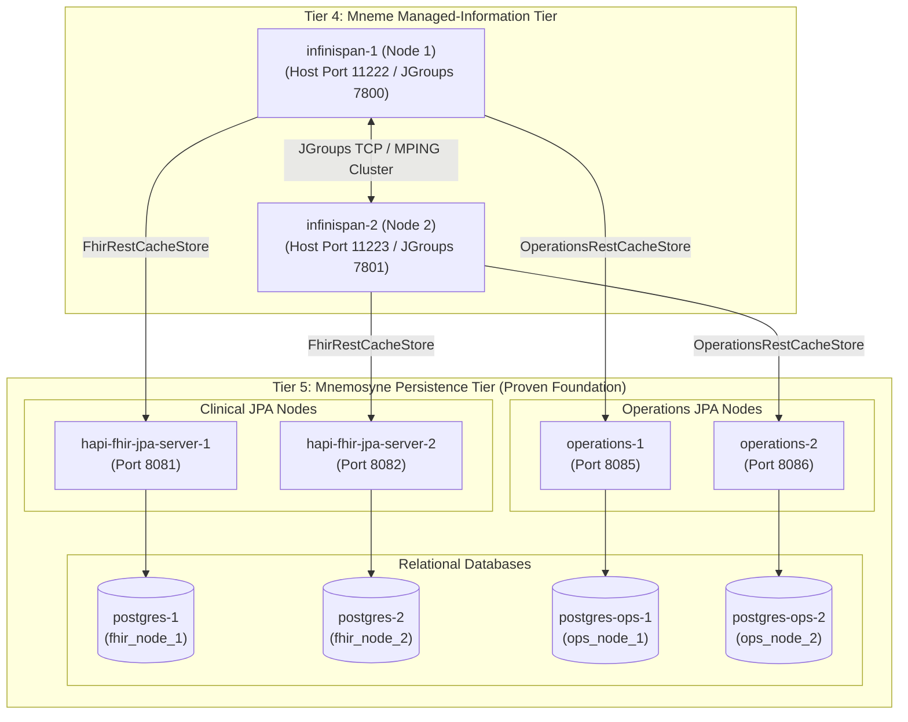

# Requirements

### Overview & Goals
The objective of this task is to establish, initialize, and rigorously validate Tier 4 (Mneme Managed-Information Tier) of the Harmonia Health Integration Environment (HIE) over the independently verified Tier 5 (Mnemosyne Persistence Tier) within the Docker Compose runtime environment.

Mneme serves as Harmonia's distributed in-memory data grid and application-facing managed-information access layer, utilizing Infinispan 15 clustered nodes with custom synchronous persistence stores (`FhirRestCacheStore` and `OperationsRestCacheStore`) delegating durable state authority directly to Mnemosyne services.

### Scope
- **In Scope**:
  - Validating prerequisites: confirming the 8 Tier 5 Mnemosyne persistence containers (`postgres-1`, `postgres-2`, `postgres-ops-1`, `postgres-ops-2`, `hapi-fhir-jpa-server-1`, `hapi-fhir-jpa-server-2`, `operations-1`, `operations-2`) are running and healthy.
  - Starting and verifying `infinispan-1` (harmonia-infinispan-node1) and `infinispan-2` (harmonia-infinispan-node2) using the Docker Compose topology.
  - Verifying JGroups cluster discovery and formation between `node1` and `node2` into the `hie-fhir-cluster`.
  - Verifying discovery and availability of all 18 configured Harmonia caches (14 FHIR caches, 3 Operations caches, and 1 non-persistent Active Coordination cache).
  - Validating Mneme's configured persistence store initialization against the corresponding Mnemosyne endpoints (`hapi-fhir-jpa-server-1/2` and `operations-1/2`).
  - Verifying diagnostic logs for absence of cluster discovery, transport, serialization, cache configuration, or persistence store failures.
  - Verifying restart resiliency of Mneme nodes without resetting or mutating the underlying Mnemosyne database foundation.
  - Producing a comprehensive execution report with exact reproduction commands and verification output.

- **Out of Scope**:
  - Starting Tier 1 (Iris presentation SPAs), Tier 2 (Pylai gateways, BEFE), or Tier 3 (Petasos Artemis messaging, Ponos task processor).
  - Modifying application domain logic, FHIR schemas, cache definitions, or persistence store semantics.
  - Modifying architectural boundaries defined in `../../AGENTS-old2.md` and `docs/architectural-axioms.md`.
  - Introducing direct application-to-Mnemosyne access or making Mneme an independent durable authority.

### User Stories
- As a **Harmonia System Operator**, I want to start the Mneme Infinispan cluster over the proven Mnemosyne persistence foundation so that active managed-information caching and cluster coordination are established cleanly.
- As a **Harmonia Architecture Guardian**, I want to ensure that Mneme operates strictly as a reconstructable in-memory data grid delegating durable truth to Mnemosyne, maintaining strict AX-05 / Invariant 8 architectural compliance.

### Functional Requirements & Acceptance Criteria
1. **Container Startup & Readiness**:
   - `infinispan-1` and `infinispan-2` start cleanly via Docker Compose and transition into stable running states.
   - Compose service dependencies (`depends_on: ... condition: service_healthy`) on `hapi-fhir-jpa-server-1/2` and `operations-1/2` are respected.
2. **Cluster Formation**:
   - `infinispan-1` and `infinispan-2` establish JGroups communication and form a unified 2-node cluster (`hie-fhir-cluster`).
   - Cluster view confirms members `node1` and `node2`.
3. **Cache Discovery & Topology**:
   - All 18 configured caches are instantiated and report available status:
     - 14 Replicated FHIR Caches: `person-cache`, `relatedperson-cache`, `practitioner-cache`, `practitionerrole-cache`, `organization-cache`, `location-cache`, `healthcareservice-cache`, `group-cache`, `provenance-cache`, `auditevent-cache`, `consent-cache`, `task-cache`, `communication-cache`, `documentreference-cache`.
     - 3 Replicated Operations Caches: `tasksequence-cache`, `messagequeue-cache`, `modulestatus-cache`.
     - 1 Replicated Active Coordination Cache: `active-coordination-cache` (non-persistent).
4. **Persistence Store Initialization**:
   - `FhirRestCacheStore` successfully binds to `http://hapi-fhir-jpa-server-1:8080/fhir` on node 1 and `http://hapi-fhir-jpa-server-2:8080/fhir` on node 2.
   - `OperationsRestCacheStore` successfully binds to `http://operations-1:8080/api/operations` on node 1 and `http://operations-2:8080/api/operations` on node 2.
5. **Log Integrity & Zero-PHI Compliance**:
   - Startup logs contain no JGroups transport errors, cluster partition warnings, store initialization failures, or unhandled exceptions.
   - Diagnostic logging emits zero PHI (Invariant 7).
6. **Restart Resiliency**:
   - Restarting an Infinispan container demonstrates clean departure and re-convergence without corrupting or requiring recreation of the backing Mnemosyne PostgreSQL databases.

### Non-Functional Requirements & Architectural Constraints
- **AX-05 / Invariant 8 Compliance**: Mneme state is active, distributed, and reconstructable; Mnemosyne alone establishes authoritative durable state.
- **System Isolation**: Maintain non-persistence and non-cache services in a stopped state to optimize systemic resource allocation and eliminate cross-tier interference.

# Technical Design

### Current Implementation
The Harmonia architecture establishes the Mneme in-memory data grid in `hestia/mneme-cluster` and persistence store SPI integration in `hestia/mneme-persistence`:
- **Infinispan Image & Runtime**: Built from `quay.io/infinispan/server:15.0.3.Final`, loading custom SPI JARs (`mneme-persistence`, `calliope`) into `/opt/infinispan/server/lib/` and using `src/main/resources/infinispan.xml`.
- **Docker Compose Definitions**:
  - `infinispan-1`: Container `harmonia-infinispan-node1`, host ports `11222:11222` (HotRod/REST) and `7800:7800` (JGroups TCP), node name `node1`, pointing to `hapi-fhir-jpa-server-1` and `operations-1`.
  - `infinispan-2`: Container `harmonia-infinispan-node2`, host ports `11223:11222` (HotRod/REST) and `7801:7800` (JGroups TCP), node name `node2`, pointing to `hapi-fhir-jpa-server-2` and `operations-2`.

### Target Services & Topology Matrix

| Service Name | Container Name | Host Ports | Container Ports | Node Name | Backing Mnemosyne Endpoints |
| :--- | :--- | :--- | :--- | :--- | :--- |
| `infinispan-1` | `harmonia-infinispan-node1` | `11222`, `7800` | `11222` (REST/HotRod), `7800` (JGroups) | `node1` | FHIR: `http://hapi-fhir-jpa-server-1:8080/fhir`<br/>Ops: `http://operations-1:8080/api/operations` |
| `infinispan-2` | `harmonia-infinispan-node2` | `11223`, `7801` | `11222` (REST/HotRod), `7800` (JGroups) | `node2` | FHIR: `http://hapi-fhir-jpa-server-2:8080/fhir`<br/>Ops: `http://operations-2:8080/api/operations` |

### Key Decisions
1. **Targeted Container Management**: Start only `infinispan-1` and `infinispan-2` via targeted Compose commands, ensuring downstream tiers (Tiers 1–3) remain offline to avoid unnecessary systemic overhead.
2. **REST API Cluster & Cache Inspection**: Utilize Infinispan v2 REST APIs (`/rest/v2/cluster`, `/rest/v2/caches`, `/rest/v2/cache-managers/hie-cluster-container/health`) authenticated with `admin:admin` to objectively evaluate topology and cache availability.
3. **Synchronous Persistence Validation**: Verify that cache stores connect to the proven node-specific Mnemosyne instances without mutating durable records during read-only verification.
4. **Boundary Preservation**: Uphold strict separation between Mneme (active cache) and Mnemosyne (durable authority) per Architectural Axiom AX-05.

### Cache & Persistence Store Mapping

```
+-----------------------------------------------------------------------------------------+
|                                  Mneme Cluster (Tier 4)                                 |
+-----------------------------------------------------------------------------------------+
| 14 Replicated FHIR Caches (SYNC)      -> Net.fhirfactory...FhirRestCacheStore           |
| (person, relatedperson, practitioner,    -> Targets: http://hapi-fhir-jpa-server-N:8080 |
|  practitionerrole, organization,                                                        |
|  location, healthcareservice, group,                                                    |
|  provenance, auditevent, consent,                                                       |
|  task, communication, documentreference)                                               |
+-----------------------------------------------------------------------------------------+
| 3 Replicated Operations Caches (SYNC) -> Net.fhirfactory...OperationsRestCacheStore     |
| (tasksequence, messagequeue,             -> Targets: http://operations-N:8080/api/...   |
|  modulestatus)                                                                          |
+-----------------------------------------------------------------------------------------+
| 1 Replicated Active Coordination (SYNC) -> In-Memory Non-Persistent                     |
| (active-coordination-cache)                                                             |
+-----------------------------------------------------------------------------------------+
```

### Architecture Diagram



# Testing

### Validation Approach
Verification of the Mneme managed-information tier consists of four structured validation gates:
1. **Prerequisite & Health Gate**: Confirming all 8 underlying Tier 5 Mnemosyne containers are healthy and responsive prior to Mneme activation.
2. **Container Launch & JGroups Cluster Gate**: Starting `infinispan-1` and `infinispan-2` and verifying cluster membership (`node1` + `node2`) via REST management endpoints.
3. **Cache Discovery & Store Validation Gate**: Confirming all 18 caches exist, verifying cache health status, and validating cache store communication to Mnemosyne endpoints.
4. **Resiliency & Non-Destructive Smoke Gate**: Testing single-node restart recovery to ensure cluster re-convergence without impacting or resetting the underlying Mnemosyne persistence layer.

### Key Scenarios

#### Scenario 1: Tier 5 Prerequisite Verification
- **Action**: Check status of `postgres-1`, `postgres-2`, `postgres-ops-1`, `postgres-ops-2`, `hapi-fhir-jpa-server-1`, `hapi-fhir-jpa-server-2`, `operations-1`, and `operations-2`.
- **Expected Outcome**: All 8 containers report `healthy` status and respond with HTTP 200 to actuator/metadata probes.

#### Scenario 2: Mneme Containers Launch & Cluster Formation
- **Action**: Launch `infinispan-1` and `infinispan-2` via `docker compose up -d infinispan-1 infinispan-2`.
- **Expected Outcome**:
  - `docker compose ps` shows `harmonia-infinispan-node1` and `harmonia-infinispan-node2` running.
  - Query `GET http://localhost:11222/rest/v2/cluster?action=distribution` confirms view containing both `node1` and `node2`.
  - JGroups logs indicate clean view installation without network split or discovery timeouts.

#### Scenario 3: Cache Discovery and Store Verification
- **Action**: Query `GET http://localhost:11222/rest/v2/caches` and inspect each cache configuration.
- **Expected Outcome**:
  - All 18 caches are listed: 14 FHIR caches, 3 Operations caches, and `active-coordination-cache`.
  - Container logs confirm `FhirRestCacheStore` and `OperationsRestCacheStore` initialization without connection errors.

#### Scenario 4: Node Restart Resiliency
- **Action**: Restart `infinispan-2` using `docker compose restart infinispan-2`.
- **Expected Outcome**:
  - `node1` detects membership change and adjusts cluster view.
  - `node2` restarts, re-joins `hie-fhir-cluster`, and re-establishes cluster view of 2 members.
  - Mnemosyne services (`postgres-*`, `hapi-fhir-*`, `operations-*`) remain fully healthy and uncorrupted.

### Diagnostic & Logging Integrity
- Inspect container logs (`docker compose logs infinispan-1 infinispan-2`) for any `WARN` or `ERROR` messages.
- Confirm zero serialization/marshalling faults (`NotSerializableException`, `MarshallingException`).
- Confirm zero PHI leaked into logs.

# Delivery Steps

### ✓ Step 1: Launch Mneme Infinispan cluster nodes over Mnemosyne persistence tier
`infinispan-1` and `infinispan-2` containers are launched via Docker Compose, respecting dependencies on healthy Mnemosyne Clinical and Operations services, and achieve clean running states without startup errors.

- Verify that Tier 5 Mnemosyne services (`postgres-1`, `postgres-2`, `postgres-ops-1`, `postgres-ops-2`, `hapi-fhir-jpa-server-1`, `hapi-fhir-jpa-server-2`, `operations-1`, `operations-2`) are running and healthy.
- Ensure all downstream tiers (Tiers 1–3: `befe`, `iris-clinical`, `iris-console`, `petasos`, `task-processor`, `mllp-*`) remain stopped to preserve systemic isolation and eliminate resource contention.
- Build and launch `infinispan-1` (port 11222 HotRod/REST, 7800 JGroups) targeting `hapi-fhir-jpa-server-1` and `operations-1` endpoints.
- Launch `infinispan-2` (port 11223 HotRod/REST, 7801 JGroups) targeting `hapi-fhir-jpa-server-2` and `operations-2` endpoints.
- Inspect initial container lifecycle events and ensure process execution proceeds cleanly without immediate exits or container crash loops.

### ✓ Step 2: Validate cluster topology, cache definitions, and Mnemosyne cache-store connectivity
Infinispan cluster membership is confirmed across both nodes, all 18 Harmonia caches are verified active, and persistence store bindings to Mnemosyne REST endpoints are validated.

- Query the Infinispan cluster management API (`GET http://localhost:11222/rest/v2/cluster?action=distribution` or container health API) using credentials `admin:admin` to confirm cluster view size is 2 (`node1`, `node2`).
- Query the Infinispan caches endpoint (`GET http://localhost:11222/rest/v2/caches` and `GET http://localhost:11223/rest/v2/caches`) to confirm discovery and availability of all 18 defined caches (14 FHIR stores, 3 Operations stores, 1 Active Coordination cache).
- Validate the configured synchronous persistence store bindings (`FhirRestCacheStore` and `OperationsRestCacheStore`) against their respective Mnemosyne nodes.
- Inspect container logs on both `infinispan-1` and `infinispan-2` to confirm zero persistence store failures, zero JGroups discovery errors, zero serialization/marshalling faults, and zero unhandled exceptions.

### ✓ Step 3: Validate container restart resiliency and compile execution report
Mneme container restart and rejoin cycles operate deterministically without requiring a reset of the underlying Mnemosyne persistence layer, and a comprehensive validation report is generated.

- Execute a restart test of `infinispan-2` (and optionally `infinispan-1`) to verify dynamic cluster departure, re-convergence, and state restoration without altering or resetting the persistent PostgreSQL databases.
- Re-verify Actuator health and readiness across the underlying Mnemosyne services (`hapi-fhir-jpa-server-1/2`, `operations-1/2`) to confirm zero degradation of the durable persistence tier.
- Execute non-destructive cache read/write operational checks on active coordination and persistent caches to verify proper cache behavior.
- Compile and document the final execution report containing container/cluster states, discovered caches, persistence store connectivity status, log diagnostics, and exact reproduction commands.