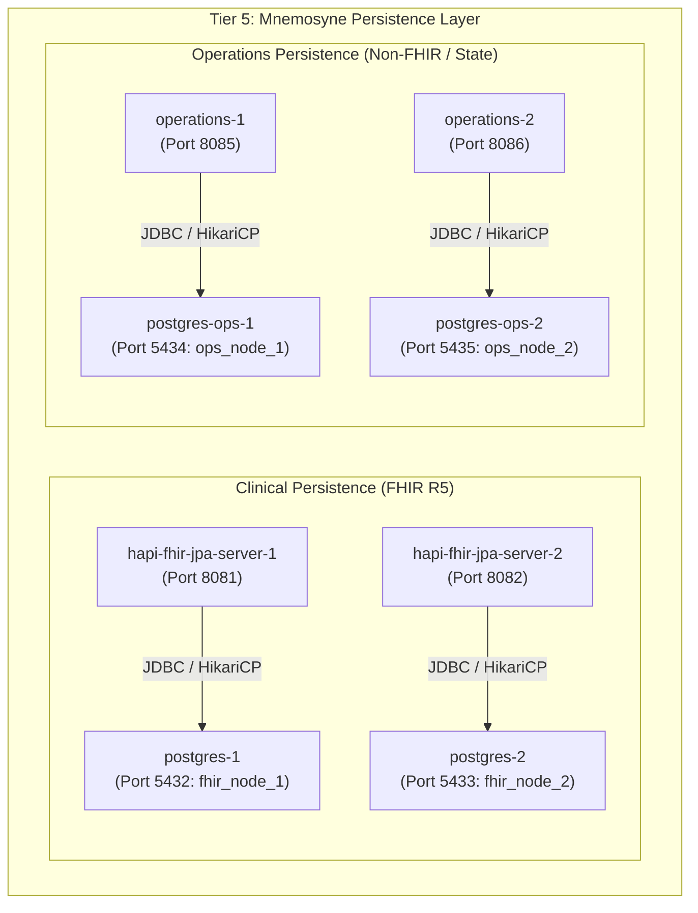

# Requirements

### Overview & Goals
The objective of this task is to establish, initialize, and rigorously validate Tier 5 (Persistence Services - Hestia Mnemosyne) of the Harmonia Health Integration Environment (HIE) within the Docker Compose runtime environment.

The Mnemosyne persistence tier comprises:
1. Replicated PostgreSQL 16 relational database engines:
   - `postgres-1` (Clinical Node 1, database `fhir_node_1`)
   - `postgres-2` (Clinical Node 2, database `fhir_node_2`)
   - `postgres-ops-1` (Operations Node 1, database `ops_node_1`)
   - `postgres-ops-2` (Operations Node 2, database `ops_node_2`)
2. Replicated Spring Boot Mnemosyne persistence applications:
   - `hapi-fhir-jpa-server-1` & `hapi-fhir-jpa-server-2` (HAPI FHIR R5 JPA persistence nodes)
   - `operations-1` & `operations-2` (Operations JPA persistence nodes for non-FHIR and TaskSequence state)

### Scope
- **In Scope**:
  - Bringing up `postgres-1`, `postgres-2`, `postgres-ops-1`, and `postgres-ops-2` via Docker Compose.
  - Verifying PostgreSQL health checks (`pg_isready`) and container readiness.
  - Starting `hapi-fhir-jpa-server-1`, `hapi-fhir-jpa-server-2`, `operations-1`, and `operations-2` while respecting Compose dependencies (`depends_on: ... condition: service_healthy`).
  - Verifying Spring Boot Actuator health endpoints (`/actuator/health`).
  - Performing non-destructive HTTP smoke tests (e.g., FHIR CapabilityStatement `GET /fhir/metadata` and Operations endpoint `GET /api/operations`).
  - Inspecting container logs for schema initialization, connection pool state, and warnings/errors.
  - Resolving any Docker Compose configuration, port mapping, environment, or healthcheck issues if encountered.
  - Producing a detailed execution report with reproduction commands.

- **Out of Scope**:
  - Starting Tier 1 (Iris presentation), Tier 2 (Pylai gateways, BEFE), Tier 3 (Petasos Artemis, Ponos task processor), or Tier 4 (Mneme Infinispan cluster).
  - Modifying application business logic, domain models, FHIR structures, or persistence semantics.
  - Modifying architectural boundaries defined in `../../AGENTS-old2.md` and `docs/architectural-axioms.md`.
  - Modifying unrelated application unit tests.

### Functional Requirements & Acceptance Criteria
1. **PostgreSQL Health & Readiness**:
   - `postgres-1`, `postgres-2`, `postgres-ops-1`, and `postgres-ops-2` start cleanly and report status `healthy`.
   - Databases and users are created with proper privileges.
2. **Mnemosyne Application Startup & Health**:
   - `hapi-fhir-jpa-server-1` connects to `postgres-1` and reaches `healthy` status via `/actuator/health`.
   - `hapi-fhir-jpa-server-2` connects to `postgres-2` and reaches `healthy` status via `/actuator/health`.
   - `operations-1` connects to `postgres-ops-1` and reaches `healthy` status via `/actuator/health`.
   - `operations-2` connects to `postgres-ops-2` and reaches `healthy` status via `/actuator/health`.
3. **Non-Destructive Endpoint Verification**:
   - HAPI FHIR endpoints return valid HTTP 200 responses for FHIR metadata (`/fhir/metadata`).
   - Operations endpoints return valid HTTP 200 responses for resource listings (`/api/operations`).
4. **Diagnostic & Logging Integrity**:
   - Logs are clean of fatal database connectivity failures, unhandled exceptions, or schema migration crashes.
   - Zero PHI is leaked into logs during initialization.

### Non-Functional Requirements & Architectural Constraints
- **Architectural Axioms Compliance**: Must strictly uphold Mneme / Mnemosyne separation (AX-05 / Invariant 8) — Mnemosyne establishes authoritative durable state.
- **Fail-Safe Startup**: Respect Docker Compose healthcheck dependencies without bypassing container dependency graph.
- **Reproducibility**: Provide deterministic, repeatable commands to bring up and verify the persistence tier from scratch.

# Technical Design

### Current Implementation
The Harmonia repository defines the Docker Compose runtime in `docker-compose.yml`:
- **Clinical Databases**:
  - `postgres-1`: `postgres:16-alpine`, exposed on host port 5432, database `fhir_node_1`, user `fhir_user`.
  - `postgres-2`: `postgres:16-alpine`, exposed on host port 5433, database `fhir_node_2`, user `fhir_user`.
- **Operations Databases**:
  - `postgres-ops-1`: `postgres:16-alpine`, exposed on host port 5434, database `ops_node_1`, user `ops_user`.
  - `postgres-ops-2`: `postgres:16-alpine`, exposed on host port 5435, database `ops_node_2`, user `ops_user`.
- **Mnemosyne Clinical JPA Servers**:
  - `hapi-fhir-jpa-server-1`: Spring Boot 3 / HAPI FHIR R5 application built from `./hestia/mnemosyne-clinical`, exposed on host port 8081 (container 8080).
  - `hapi-fhir-jpa-server-2`: Spring Boot 3 / HAPI FHIR R5 application built from `./hestia/mnemosyne-clinical`, exposed on host port 8082 (container 8080).
  - Configured with profile `postgres`, pointing to respective postgres host.
- **Mnemosyne Operations JPA Servers**:
  - `operations-1`: Spring Boot 3 application built from `./hestia/mnemosyne-operations`, exposed on host port 8085 (container 8080).
  - `operations-2`: Spring Boot 3 application built from `./hestia/mnemosyne-operations`, exposed on host port 8086 (container 8080).
  - Configured with profile `postgres`, pointing to respective postgres-ops host.

### Target Services & Port Matrix

| Service Name | Container Name | Image / Context | Host Port | Target Container Port | Healthcheck Target |
| :--- | :--- | :--- | :--- | :--- | :--- |
| `postgres-1` | `harmonia-postgres-1` | `postgres:16-alpine` | `5432` | `5432` | `pg_isready -U fhir_user -d fhir_node_1` |
| `postgres-2` | `harmonia-postgres-2` | `postgres:16-alpine` | `5433` | `5432` | `pg_isready -U fhir_user -d fhir_node_2` |
| `postgres-ops-1` | `harmonia-postgres-ops-1` | `postgres:16-alpine` | `5434` | `5432` | `pg_isready -U ops_user -d ops_node_1` |
| `postgres-ops-2` | `harmonia-postgres-ops-2` | `postgres:16-alpine` | `5435` | `5432` | `pg_isready -U ops_user -d ops_node_2` |
| `hapi-fhir-jpa-server-1` | `harmonia-hapi-fhir-1` | `hestia/mnemosyne-clinical` | `8081` | `8080` | `http://localhost:8080/actuator/health` |
| `hapi-fhir-jpa-server-2` | `harmonia-hapi-fhir-2` | `hestia/mnemosyne-clinical` | `8082` | `8080` | `http://localhost:8080/actuator/health` |
| `operations-1` | `harmonia-operations-1` | `hestia/mnemosyne-operations` | `8085` | `8080` | `http://localhost:8080/actuator/health` |
| `operations-2` | `harmonia-operations-2` | `hestia/mnemosyne-operations` | `8086` | `8080` | `http://localhost:8080/actuator/health` |

### Architecture Diagram

### Key Decisions
1. **Isolated Service Orchestration**: Start only the 8 specified services via explicit Compose service arguments (`docker compose up -d postgres-1 postgres-2 postgres-ops-1 postgres-ops-2 hapi-fhir-jpa-server-1 hapi-fhir-jpa-server-2 operations-1 operations-2`) rather than a whole-stack start.
2. **Strict Healthcheck Dependency**: Leverage Compose `service_healthy` conditions to ensure Spring Boot applications only start when their backing PostgreSQL instances are ready.
3. **Non-Destructive Validation**: Verify API endpoints using read-only requests (`GET /actuator/health`, `GET /fhir/metadata`, `GET /api/operations`) so no persistent state is mutated.

# Testing

### Validation Approach
Verification of the Mnemosyne persistence tier will occur in three phases:
1. Database Container Health & Initial Log Inspection
2. Spring Boot Actuator Health & Connection Pool Verification
3. Non-Destructive Application Endpoint Smoke Tests

### Key Scenarios

#### Scenario 1: Database Startup & Healthcheck
- **Action**: Bring up `postgres-1`, `postgres-2`, `postgres-ops-1`, and `postgres-ops-2`.
- **Expected Outcome**:
  - `docker compose ps` shows status `Up ... (healthy)` for all 4 containers.
  - `pg_isready` commands succeed for all 4 databases.
  - PostgreSQL log indicates `database system is ready to accept connections`.

#### Scenario 2: Mnemosyne Services Startup & Actuator Health
- **Action**: Bring up `hapi-fhir-jpa-server-1`, `hapi-fhir-jpa-server-2`, `operations-1`, and `operations-2`.
- **Expected Outcome**:
  - Containers start only after their respective PostgreSQL instance is healthy.
  - HTTP `GET http://localhost:8081/actuator/health` returns `{"status":"UP", ...}`.
  - HTTP `GET http://localhost:8082/actuator/health` returns `{"status":"UP", ...}`.
  - HTTP `GET http://localhost:8085/actuator/health` returns `{"status":"UP", ...}`.
  - HTTP `GET http://localhost:8086/actuator/health` returns `{"status":"UP", ...}`.

#### Scenario 3: Non-Destructive Functional Endpoints
- **Action**: Execute read-only requests to FHIR and Operations REST endpoints.
- **Expected Outcome**:
  - `GET http://localhost:8081/fhir/metadata` returns HTTP 200 with FHIR R5 `CapabilityStatement` JSON/XML.
  - `GET http://localhost:8082/fhir/metadata` returns HTTP 200 with FHIR R5 `CapabilityStatement` JSON/XML.
  - `GET http://localhost:8085/api/operations` returns HTTP 200 with an empty or existing JSON array `[]`.
  - `GET http://localhost:8086/api/operations` returns HTTP 200 with an empty or existing JSON array `[]`.

#### Scenario 4: Error and Warning Diagnostics
- **Action**: Inspect `docker compose logs` for all 8 services.
- **Expected Outcome**: No unhandled stack traces, database connectivity timeouts, or initialization exceptions.

# Delivery Steps

### ✓ Step 1: Launch and verify PostgreSQL database instances
All 4 PostgreSQL database instances (postgres-1, postgres-2, postgres-ops-1, postgres-ops-2) are running, healthy, and ready for connections.

- Stop any unrelated non-persistence containers if currently running to maintain strict tier isolation.
- Start `postgres-1` (port 5432, database `fhir_node_1`), `postgres-2` (port 5433, database `fhir_node_2`), `postgres-ops-1` (port 5434, database `ops_node_1`), and `postgres-ops-2` (port 5435, database `ops_node_2`) using `docker compose up -d`.
- Verify the internal healthcheck execution (`pg_isready`) for each PostgreSQL instance.
- Inspect PostgreSQL container logs to ensure clean initialization, proper authentication configuration, and correct data directory mounting without errors.

### ✓ Step 2: Start and verify Mnemosyne Clinical and Operations services
All 4 Mnemosyne services (2 Clinical HAPI FHIR JPA nodes and 2 Operations JPA nodes) are running and reporting healthy on their Spring Boot Actuator endpoints.

- Start `hapi-fhir-jpa-server-1` and `hapi-fhir-jpa-server-2` ensuring proper dependency resolution on `postgres-1` and `postgres-2`.
- Start `operations-1` and `operations-2` ensuring proper dependency resolution on `postgres-ops-1` and `postgres-ops-2`.
- Monitor Spring Boot startup logs for datasource initialization, Hibernate/JPA schema generation, and HikariCP connection pool establishment.
- Verify container health status as each service responds with HTTP 200 `UP` to `/actuator/health`.
- Address any container configuration, network binding, or environment variable issues if detected during startup without altering persistence or domain semantics.

### ✓ Step 3: Execute non-destructive smoke tests and compile verification report
All 8 persistence tier containers are validated via non-destructive HTTP and database verification, and a comprehensive summary report is compiled.

- Query the HAPI FHIR R5 CapabilityStatement endpoint (`GET /fhir/metadata`) on `hapi-fhir-jpa-server-1` (port 8081) and `hapi-fhir-jpa-server-2` (port 8082) to confirm FHIR engine readiness.
- Query the Mnemosyne Operations REST API (`GET /api/operations` / `GET /actuator/health`) on `operations-1` (port 8085) and `operations-2` (port 8086) to confirm operational storage readiness.
- Verify PostgreSQL database tables and connections are properly bound and active for all 4 instances.
- Compile and output the final report covering container states, tested endpoints, connectivity confirmations, log observations, and exact reproduction commands.