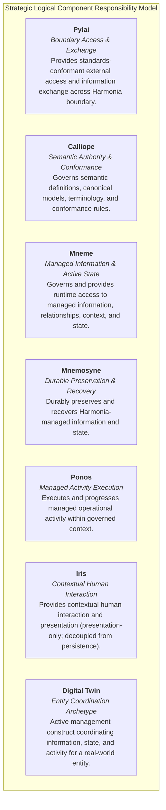
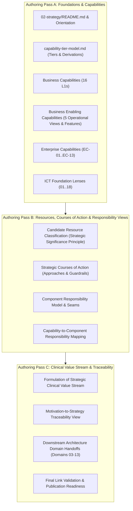

# Harmonia Strategy Architecture Reconciliation Report

**Document Identifier**: `HARM-REP-2026-10-05-STRAT-REC`  
**Date**: 2026-10-05  
**Status**: Canonical Reconciliation Baseline / Review Draft  
**Target Domain**: Domain 02 — Strategy (`docs/markdown/02-strategy/`)  
**Metamodel Reference**: ArchiMate 3.2 (with Harmonia Architectural Extensions)  

---

### 1. Executive Summary

This reconciliation report evaluates all existing strategy, capability, boundary, and architectural assets across the Harmonia Health Integration Environment (HIE) repository against the agreed strategic capability model, incorporating formal architectural review determinations. Undertaking an evidence-based reconciliation before authoring canonical markdown in `docs/markdown/02-strategy/` provides substantial utilitarian value: it safeguards critical institutional knowledge, prevents the propagation of superseded technical patterns (such as unbuffered MLLP acknowledgments or cache write-behind persistence), eliminates architectural ambiguity, and avoids costly engineering rework across regional clinical exchange deployments.

The primary reconciliation findings and review closures are:
1. **Multi-Tier Model Coherence**: The repository assets map cleanly into the agreed vertical progression:
   $$\text{Business Capabilities (16 L1s)} \longrightarrow \text{Business Enabling Views (5 views)} \longrightarrow \text{Features} \longrightarrow \text{Enterprise Capabilities (EC-01..EC-13)} \longrightarrow \text{Component Boundaries}$$
   Strategic capabilities describe reusable behavior and architectural responsibility rather than component names. The five Business Enabling views are confirmed as genuine healthcare operational contexts rather than low-level integration plumbing.
2. **Component Responsibilities & Seams**: Logical component boundaries represent an architectural responsibility model rather than an approved runtime interaction topology:
   - **Mneme**: Governs and provides runtime access to Harmonia-managed information, relationships, context, and state. Runtime representations managed through Mneme may be reconstructable, but the architectural distinction is not a simplistic "ephemeral vs. durable" dichotomy or mere caching mechanism.
   - **Mnemosyne**: Durably preserves and recovers Harmonia-managed information and state. Mnemosyne provides durable authority for persisted representations but does not own operational/business activity progression.
   - **Ponos**: Executes and progresses Harmonia-managed operational activity within governed context.
   - **Pylai**: Provides standards-conformant external access and information exchange across the Harmonia boundary.
   - **Calliope**: Governs semantic definitions, models, terminology, and conformance rules.
   - **Iris**: Provides contextual human interaction and presentation (strictly decoupled from persistence engines).
   - **Digital Twin**: Coordinates governed information, state, and operational activity for a real-world entity.
3. **Strategic Resource Governance Principle**: Candidate ArchiMate Strategy Resources are evaluated against the principle that an asset must have strategic significance in enabling capabilities or courses of action to qualify as a Strategy Resource; information merely managed by Harmonia belongs primarily in Information Architecture (Domain 04). Candidate assets (Provider Graph, Longitudinal Record, Pragma envelopes, audit logs, Paradeigma testbeds) are retained as candidates requiring classification during Strategy authoring rather than pre-decided inclusions.
4. **Resolution of Contradictions (CONTR-01 through CONTR-05)**: Five candidate contradictions identified during analysis have been formally closed by architectural review:
   - *CONTR-01 (Inbound ACK)*: Resolved. Immediate positive ACK is superseded; positive ACK requires durable acceptance; distinctions between transport receipt, technical processing ACK, durable acceptance, and business ACK are preserved.
   - *CONTR-02 (State Persistence)*: Resolved. Write-behind cache persistence is retired; approved Mneme/Mnemosyne responsibility boundaries are established.
   - *CONTR-03 (Patient Identity Scope)*: Resolved as a roadmap/scope decision. Harmonia 1.x/2.x does not provide authoritative master-patient identity reconciliation (EMPI), focusing on correlation, association, resolution, provenance, federation, and governed correction; full EMPI reconciliation is an uncommitted Harmonia 3.x candidate.
   - *CONTR-04 (Component-Named Capabilities)*: Resolved. Capabilities describe reusable platform behaviors, not software component names.
   - *CONTR-05 (Mnemosyne vs. Ponos Operational Progression)*: Resolved. Mnemosyne durably preserves/recovers state, while Ponos progresses operational activity.

---

### 2. Existing Strategy Inventory

The repository contains extensive strategy-relevant artifacts scattered across LaTeX publications, markdown subsystem concept documents, architectural overviews, and prior analysis reports.

| Artifact Path | Apparent Purpose | Architectural Concepts Contained | Relevance & Utility | Recommended Disposition |
| :--- | :--- | :--- | :--- | :--- |
| `docs/latex/chapters/01-motivation-strategy.tex` | Master LaTeX Motivation & Strategy Chapter | 7 component-coupled capabilities, 6 strategic goals, 6 principles, strategic value stream equation | High value for goals and value stream; superseded regarding component capabilities and write-behind caching | Retain for LaTeX publication; reframe capabilities as functional and update workflows to reflect REC-001 |
| `docs/latex/chapters/01-foundations.tex` | Platform foundations & HIE context | Healthcare interoperability drivers, 5 core principles, value stream flow | High value for regional health context; duplicates `01-motivation-strategy.tex` principles | Retain as LaTeX publication narrative; align principles with canonical Axioms |
| `docs/latex/chapters/02-conceptual-taxonomy.tex` | Subsystem layering & domain taxonomy | Component boundaries for Iris, Pylai, Petasos, Energeia, Mneme, Mnemosyne, Calliope, Themis, Agora, Paradeigma | High value; provides clear domain responsibilities and anti-responsibilities | Retain for conceptual architecture; relocate port numbers and package specifics to Domains 05–07 |
| `docs/latex/chapters/02-business-layer.tex` | Business actors, services, and clinical workflows | 7 business actors, 6 clinical services, 3 five-stage workflows, 6 core business objects | High value for business architecture; contains legacy immediate MLLP ACK and EMPI merge assertions | Retain for Domain 03 Business Layer; reframe workflow stages to match REC-001 dual-write safety |
| `docs/Harmonia_Strategy_Local_Directory_and_Broader_Role.docx` | Strategic Position Paper (24 Sept 2026) | Local Directory Solution (LDS) scope demarcation (`HARM-STR-001`, `HARM-LDS-001..012`), platform core boundary | Authoritative strategic guidance establishing LDS as a Domain 11 Solution Pack on a generalized HIE core | Reference directly in Strategy Courses of Action (`courses-of-action/lds-solution-strategy.md`) |
| `docs/markdown/01-motivation/` (13 files) | Canonical frozen Motivation baseline | Stakeholders, Drivers, Assessments, Goals, Outcomes, Axioms (`AX-01`..`AX-16`), Requirements, Constraints | Canonical architectural authority anchoring Strategy | Maintain as frozen Domain 01 baseline; establish direct traceability from Strategy |
| `docs/concepts/mneme.md` | Mneme Subsystem Concept | Working memory metaphor, Infinispan grid topology, active caches, anti-responsibilities | High conceptual value; contains legacy `mneme-persistence` write-behind cache store adapter | Reframe in Strategy as runtime state access; relocate Infinispan config and SPI details to Domain 07 |
| `docs/concepts/mnemosyne.md` | Mnemosyne Subsystem Concept | Deep memory metaphor, clinical vs. operations JPA split, durable truth, database isolation | High conceptual value; durable preservation authority | Reframe in Strategy as durable preservation/recovery; relocate Spring Boot/PostgreSQL DDL to Domain 04/05 |
| `docs/concepts/ponos.md` | Ponos Subsystem Concept | Strenuous toil metaphor, worker daemon, execution loops, Themis gate evaluation, timeouts | High conceptual value for activity execution | Reframe in Strategy as operational activity progression; relocate Camel worker configs to Domain 05 |
| `docs/concepts/pylai.md` | Pylai Subsystem Concept | City gates metaphor, ingress/egress boundaries, dual-write safety (`REC-001`), fan-out tracking (`REC-002`) | Critical architectural boundary and exchange contract | Reframe in Strategy as standards-based exchange membrane; relocate Netty byte framing to Domain 06 |
| `docs/concepts/calliope.md` | Calliope Subsystem Concept | Eloquent voice metaphor, canonical envelope (`ErgonEvent`), HL7/FHIR mappers, pure domain models | Foundational semantic governance authority | Reframe in Strategy as semantic governance & conformance; relocate mapper code to Domain 04/05 |
| `docs/concepts/themis.md` | Themis Subsystem Concept | Divine law metaphor, 4-gate security model, default-deny authorization, zero-PHI audit | Critical cross-cutting security governance | Reframe in Strategy as intrinsic policy & control capability; relocate filter classes to Domain 08 |
| `docs/concepts/iris.md` | Iris Subsystem Concept | Rainbow messenger metaphor, BEFE gateway, Vue SPAs, presentation decoupling (Invariant 3) | Essential presentation boundary definition | Reframe in Strategy as interaction & experience capability; relocate Vite/Vue details to Domain 05 |
| `docs/concepts/agora.md` | Agora Subsystem Concept | Civic assembly metaphor, Matrix collaboration projection, Ponos decoupling, zero-PHI rooms | High value for collaboration capability | Reframe in Strategy as collaborative communication enablement; relocate Synapse REST DTOs to Domain 05/06 |
| `docs/concepts/paradeigma.md` | Paradeigma Subsystem Concept | Platonic exemplar metaphor, synthetic clinical simulation, zero production dependency (Invariant 1) | High value for synthetic verification | Reframe in Strategy as candidate strategic resource/testbed; relocate scenario engines to Domain 10 |
| `.junie/reports/2026-10-04-domain-02-strategy-analysis.md` | Prior Strategy Analysis Report | 11 candidate capabilities, 6 courses of action, 5 natural clusters, value stream extraction | Comprehensive preliminary analysis baseline | Historical analysis report; superseded in part by the multi-tier capability model and resource inclusion mandate |

---

### 3. Existing LaTeX / Alternate Source Material

A comparative analysis of the LaTeX sources (`docs/latex/chapters/`) against existing Markdown documentation reveals substantial material that must not be lost:

1. **Historical Runtime Event Flow (Candidate Evidence, Not Canonical Value Stream)**:
   - `01-motivation-strategy.tex` (lines 160–174) and `01-foundations.tex` (lines 70–78) articulate an explicit 5-stage clinical event message flow:
     $$\text{Ingest Trigger} \longrightarrow \text{Transport \& Deduplicate} \longrightarrow \text{Orchestrate Erga} \longrightarrow \text{Update Clinical State} \longrightarrow \text{Dispatch Egress / Serve FHIR APIs}$$
   - *Status & Disposition*: This 5-stage flow represents useful historical runtime processing evidence, but it is predominantly a low-level technical processing sequence rather than a strategic healthcare value stream. It is preserved as evidentiary source material, but is NOT canonicalized as the strategic Clinical Value Stream. The formulation of the true strategic Clinical Value Stream remains an explicit outstanding Strategy design activity to be completed in Authoring Pass C.
2. **Structured Business Actor and Operational Role Matrix**:
   - `02-business-layer.tex` (Table 2.1, lines 24–48) specifies a comprehensive matrix mapping external business actors (Hospital EHR/PAS, Diagnostic Laboratory, External HIS/LIS, Clinicians, Directory Stewards, Credentialing Authorities, Health Network Admins) to formal business roles and operational scopes.
   - This taxonomy provides essential context for Business Capabilities and must be incorporated into Domain 02 strategic views and Domain 03 Business Architecture.
3. **Formal Business Object Definitions**:
   - `02-business-layer.tex` (lines 110–120) formally defines six core business objects: HL7 v2 Message Stream, Canonical Patient Record (`FHIR::Patient`), Task State Record (`Pragma`), Provider Registry Change Pragma, Authoritative Provider Graph, and Audit & Provenance Trail (`FHIR::AuditEvent` / `FHIR::Provenance`).
   - These constitute critical candidate ArchiMate Strategy Resources (Informational Assets).
4. **Governed Asynchronous Change Management Pattern**:
   - `01-motivation-strategy.tex` (lines 80–82) and `02-business-layer.tex` (lines 100–108) detail the asynchronous change pattern for directory entities (POST/PUT generating immutable `ProviderRegistryChangePragma`, asynchronous referential verification, automated validation, and final persistence).
   - This architectural pattern is vital for the Enterprise Capability `EC-03 Managed State & Lifecycle` and `EC-06 Policy & Control`.

---

### 4. Alignment with Agreed Strategy Model

#### 4.1 Business Capability Tier (16 L1 Capabilities)
The agreed healthcare business capabilities establish the enterprise operating context. Harmonia's strategic capabilities and subsystems align as follows:

| # | Business Capability (L1) | Harmonia Relevance | Alignment & Enabling Role |
| :- | :--- | :--- | :--- |
| **01** | Individual Care Delivery | Harmonia-Relevant | Provides point-of-care longitudinal clinical record presentation and real-time clinical notification dispatch. |
| **02** | Care Access & Coordination | Harmonia-Relevant | Connects multidisciplinary care teams via Agora collaboration spaces and exposes provider endpoints. |
| **03** | Health Rights, Advocacy & Participation | Adjacent | Supplies patient audit access logs and consent directives evaluated via Themis. |
| **04** | Diagnostic, Therapeutic & Clinical Support | Harmonia-Relevant | Bridges laboratory (ORU) and radiology (ORM) diagnostic feeds between legacy systems and modern FHIR consumers. |
| **05** | Health Products & Clinical Technology | Reference | External clinical device and pharmaceutical management outside core platform scope. |
| **06** | Clinical Quality, Safety & Improvement | Harmonia-Relevant | Enforces deterministic identifier matching, duplicate message suppression, and non-destructive information preservation. |
| **07** | Community Health & Wellbeing | Reference | Population-level public health engagement outside core platform scope. |
| **08** | Population Health & Health-System Planning | Adjacent | Exposes bulk FHIR data extraction feeds and aggregated directory reporting. |
| **09** | Health Information & Knowledge Management | Harmonia-Core | Governs the vendor-neutral, longitudinal clinical record, canonical models, and durable state preservation. |
| **10** | Standards, Semantics & Reference Governance | Harmonia-Core | Governs FHIR R5 profiles, HL7 v2 mappers, Australian National Directory terminology, and semantic conformance rules. |
| **11** | Connected Health Services | Harmonia-Core | Delivers multi-protocol boundary gateways (MLLP, FHIR REST), resilient message queuing, and reliable fan-out delivery. |
| **12** | Security, Privacy & Digital Trust | Harmonia-Core | Implements 4-gate default-deny authorization, zero-PHI operational logging, and immutable compliance auditing. |
| **13** | Health Research & Innovation | Adjacent | Provides de-identified diagnostic feeds and isolated synthetic data generation (Paradeigma). |
| **14** | Enterprise Direction & Stewardship | Reference | Organizational governance and strategy development outside platform automation. |
| **15** | Workforce & Organisational Capability | Harmonia-Relevant | Delivers master Healthcare Provider Directory management (Practitioners, Roles, Organizations, Locations, Endpoints). |
| **16** | Corporate Resources & Enterprise Services | Reference | Corporate enterprise ERP and HR services outside integration bus scope. |

*Architectural Principle*: Harmonia provides core technical enablement for capabilities 09, 10, 11, and 12, and materially enables capabilities 01, 02, 04, 06, and 15 without asserting ownership of the clinical or administrative business domains themselves.

#### 4.2 Business Enabling Capability Tier (5 Contextual Views & Features)
The Business Enabling Capability Tier describes what systems must enable or provide in support of the healthcare business capability landscape. These capabilities are organized across five contextual views representing genuine healthcare operating environments, rather than low-level integration platform mechanics:

1. **Entity Management**: Systems enablement for identifying, governing, and managing core healthcare entities throughout their operational lifecycles, including Practitioners, Healthcare Provider Organisations, Care Teams, Healthcare Services, Locations, Facilities, Physical Care Spaces, Electronic Endpoints, and Patients / Care Recipients.
   - *Sample Feature*: `FEAT-EM-01`: Deterministic verification and validation of external professional and organizational identifiers (e.g., HPI-I, HPI-O) prior to entity activation.
2. **Service Administration**: Systems enablement for the operational and regulatory administration of health services, including Service Definition, Provider Registry & Credential Governance, Service Directory Publishing & Querying, Referral & Intake Management, Scheduling & Appointment Management, and Waitlist Administration.
   - *Sample Feature*: `FEAT-SA-01`: Asynchronous ingestion and referential integrity verification of directory update requests with HTTP 202 tracking.
3. **Service Delivery**: Systems enablement across healthcare service delivery settings and clinical care delivery contexts, including Primary Care, Acute Inpatient Care, Emergency Care, Ambulatory & Outpatient Delivery, Critical & Intensive Care, Diagnostic & Pathology Services, Therapeutic & Procedural Care, Community & Outreach Care, and Remote / Telehealth Delivery.
   - *Sample Feature*: `FEAT-SD-01`: Non-destructive assembly of clinical observations, diagnostic reports, and encounters into a consolidated longitudinal timeline.
4. **Health Service Operations**: Systems enablement for the operational management, logistics, capacity, and resource coordination of healthcare facilities and services. This view includes:
   - Clinic & Practice Operations
   - Ward Operations
   - Theatre & Procedural Suite Operations
   - Emergency Department Operations
   - Outpatient Operations
   - Bed & Care-Place Management
   - Clinical Resource & Equipment Management
   - Service Capacity Management
   - Clinical Workforce Allocation & Roster Enablement
   - Mobile Staff Management
   - On-Call Coordination
   - Work Allocation & Task Dispatch
   - Patient Transport Coordination
   - Clinical Logistics & Specimen Coordination
   - Discharge & Transfer Coordination  
   *(Architectural Principle: Health Service Operations reflects real-world health facility logistics and operations; it must NOT be redefined or reinterpreted as protocol mediation, message queuing, deduplication, or integration-platform machinery).*
5. **Intrinsic / Shared Enablement**: Cross-cutting system capabilities required to support all healthcare operating contexts, including Policy & Authorization Governance, Canonical Health Semantics & Terminology, Provenance & Audit Assurance, Boundary Interoperability, and Operational Telemetry.
   - *Sample Feature*: `FEAT-SE-01`: Default-deny authorization evaluation across all boundary ingress gates and storage interfaces.

*Features*: A Feature represents the smallest useful statement of system-enabled behavior within Harmonia-Relevant and Harmonia-Core capabilities. Features are defined to be independently understandable and testable in principle, without specifying concrete products, wire protocols, physical components, or implementation mechanisms.

#### 4.3 Enterprise Capability Tier (EC-01 .. EC-13)
The 13 Enterprise Capabilities represent reusable platform functionality derived from system-enabled features by asking: *"How is this function delivered?"* They describe reusable architectural functionality, independent of concrete concurrency, middleware, or storage technologies:
- **EC-01 Managed Entity & Relationship**: Cross-domain modeling, indexing, and navigation of healthcare entities (Practitioners, Organizations, Patients) and their structural relationship graphs.
- **EC-02 Context Management**: Establishing, propagating, and validating execution, clinical, and security contexts across asynchronous boundaries and operational lifecycles.
- **EC-03 Managed State & Lifecycle**: Governing the progression, validation, and transition of integration tasks, directory change proposals, and managed entity lifecycles.
- **EC-04 Information Management**: Governing the intake, storage, retrieval, retention, and lifecycle protection of clinical and operational information assets.
- **EC-05 Search & Discovery**: Bounded, indexed, and access-controlled query and search capabilities across clinical resources, directory registries, and provider graphs.
- **EC-06 Policy & Control**: Impartial default-deny rule evaluation, RBAC/ABAC authority checks, and compliance gating applied intrinsically across platform operations.
- **EC-07 Provenance & Traceability**: Capturing immutable origin attribution, processing checkpoints, transformation history, and cryptographic audit evidence.
- **EC-08 Interoperability & Exchange**: Standards-compliant boundary protocol adaptation, structured message transformation, and reliable external exchange.
- **EC-09 Event & Subscription**: Governed event publishing, subscription management, criteria-based event filtering, and asynchronous notification dispatching (independent of concrete broker topologies, topics, or queues).
- **EC-10 Activity & Execution**: Governed operational activity execution, unit-of-work progression, sequence orchestration, and execution supervision (independent of worker threads, thread pools, or specific workflow runtimes).
- **EC-11 Interaction & Experience**: Contextual human-facing interaction, clinical data visualization, and operational management telemetry dashboards.
- **EC-12 Operational Assurance**: Operational health monitoring, sliding-window duplicate detection, exception escalation, and automated resilience supervision.
- **EC-13 Semantic Governance & Conformance**: Canonical data modeling, schema translation, terminology mapping, and semantic conformance rule enforcement.

#### 4.4 ICT Foundation Capability Role (18 Cross-Cutting Lenses)
The 18 ICT Foundation Capabilities (01 Digital Interaction through 18 Technology Architecture) function as **cross-cutting technical enablement lenses** through which Enterprise Capabilities are realized, rather than being conflated with the enterprise capabilities themselves. For example:
- `EC-10 Activity & Execution` is viewed through the lenses of **Compute & Execution Services** (concurrency), **Resilience & Continuity** (timeout and retry strategies), **Security & Digital Trust** (Themis policy gates), and **Observability & Operational Management** (activity telemetry).
- `EC-08 Interoperability & Exchange` is viewed through the lenses of **Integration & Interoperability** (boundary adapters), **Network & Connectivity** (TLS transport), and **Security & Digital Trust** (mutual authentication).

#### 4.5 Strategic Logical Component Responsibility Model & Emerging Guardrails
The strategic logical component model defines architectural responsibility boundaries. It is explicitly a **responsibility model**, NOT an approved runtime execution topology or mandatory call graph. Interactions between these constructs will be defined in subsequent architecture domains (Application and Integration Architecture); Strategy does not prescribe runtime call paths.



The component seams reflect the following strategic guardrails:
- **Guardrail G1 (Reusable Capability $\neq$ Centralised Service)**: Enterprise Capabilities describe reusable functionality. Some capabilities (Context Management `EC-02`, Policy & Control `EC-06`, Provenance & Traceability `EC-07`, Operational Assurance `EC-12`) are inherently cross-cutting and realized collaboratively across multiple components rather than residing in a single centralized service.
- **Guardrail G2 (Component Boundaries Follow Architectural Responsibility)**: Subsystems encapsulate architectural responsibilities rather than specific software libraries, frameworks, or storage products. The use of HAPI FHIR JPA does not make Mnemosyne an integration gateway, nor does Infinispan make Mneme a simple cache, nor does Netty make Pylai a workflow engine.
- **Guardrail G3 (Managed Information/State and Managed Activity Remain Distinct)**:
  - *Mneme* governs what is known and its active managed information/state/context.
  - *Ponos* governs what operational activity is occurring and how that activity progresses.
  - *Digital Twins* coordinate governed information, state, and operational activity for a particular real-world entity without collapsing those responsibilities or duplicating generic execution machinery.
- **Guardrail G4 (Execution and Exchange Remain Distinct)**: Execution (Ponos) determines that an exchange is required to progress activity; exchange (Pylai) determines how the external boundary is crossed, conformant with external standards. Ponos must not acquire bespoke transport implementations.
- **Seam: Mneme $\longleftrightarrow$ Mnemosyne**: Mneme governs and provides runtime access to managed information, relationships, context, and state; Mnemosyne durably preserves and recovers managed information and state. A transient cache must not become authoritative truth merely because Mneme utilizes it (AX-05), and Mnemosyne does not own operational/business activity progression.
- **Seam: Calliope $\longleftrightarrow$ Runtime Components**: Calliope is the semantic authority; runtime components consume and apply those semantics. Semantic authority does not imply that Calliope synchronously mediates every runtime invocation.
- **Seam: Iris $\longleftrightarrow$ Mneme / Ponos**: Iris owns human presentation and interaction, decoupled from direct database or JPA access (Invariant 3). Mneme provides governed runtime access to information, while Ponos progresses activity. Iris must not become an accidental clinical authority or workflow engine.

#### 4.6 ArchiMate 3.2 Metamodel Alignment & Intentional Extensions
Harmonia adopts ArchiMate 3.2 as its primary strategy metamodel while explicitly defining intentional extensions to preserve architectural fidelity:
1. **Multi-Tier Capability Progression**: ArchiMate provides a single `Capability` element. Harmonia extends this into a four-tier vertical progression: Business Capabilities $\to$ Business Enabling Capabilities $\to$ Features $\to$ Enterprise Capabilities. This provides necessary precision for complex healthcare integration without distorting ArchiMate semantics.
2. **Digital Twin as an Architectural Construct**: Rather than misclassifying the Digital Twin as an ArchiMate `Application Component` or `Business Actor`, Harmonia models it as an active management construct / coordination archetype bridging state (`Mneme`) and activity (`Ponos`).
3. **State Separation in Resource Modeling**: ArchiMate models `Resource` generically. Harmonia strictly differentiates between *Active Ephemeral State* (reconstructable memory), *Durable Historical State* (authoritative record), and *Semantic Reference Assets* (governed schemas).

---

### 5. Candidate ArchiMate Strategy Resources

Under ArchiMate 3.2, a **Resource** represents an asset owned or controlled by an organization that is used to achieve goals and execute capabilities. In accordance with architectural governance review decisions, candidate resources must not be automatically included simply because they are valuable platform assets. Instead, the following governing principle applies:

> **Strategic Resource Governance Principle**:  
> *A Strategy Resource should be included in Domain 02 only where the asset itself has demonstrable strategic significance in enabling Harmonia capabilities or courses of action. Information merely managed by Harmonia belongs primarily in Information Architecture (Domain 04) and may be referenced from Strategy where appropriate.*

Strategic Resources remain an active area for controlled Strategy authoring. The reconciliation findings below preserve the discovered assets as candidate resources, updating their status from recommended inclusions to candidates requiring classification during Strategy authoring (specifically Authoring Pass B):

| Candidate Resource | Resource Category | Evidentiary Source | Strategic Architectural Value | Classification Status & Review Guidance |
| :--- | :--- | :--- | :--- | :--- |
| **Australian National Healthcare Directory Standards & LDS Specifications** | Normative Standard Asset | `Harmonia_Strategy_Local_Directory_and_Broader_Role.docx` | Defines mandatory schema profiles, national identifier rules (HPI-I, HPI-O), and endpoint structures governing directory federation. | **Candidate requiring classification** during Pass B against the strategic significance test as an external normative standard. |
| **HL7 FHIR Release 5 Core Specifications & Profiles** | Normative Standard Asset | `docs/concepts/calliope.md`, `01-motivation-strategy.tex` | Establishes canonical external exchange schemas and semantic definitions for healthcare interoperability. | **Candidate requiring classification** during Pass B as a foundational external interoperability standard. |
| **Authoritative Healthcare Provider Graph** | Strategic Information Asset | `02-business-layer.tex`, `pylai-fhir-registry` | Consolidated, validated relational graph of practitioners, roles, organizations, locations, and electronic endpoints. | **Candidate requiring classification** during Pass B; evaluate whether it represents a strategy-level resource or managed operational data in Domain 04. |
| **Vendor-Neutral Longitudinal Clinical Record** | Strategic Information Asset | `01-motivation-strategy.tex`, `mnemosyne-clinical` | Durable, standards-based clinical history aggregated across facilities independently of proprietary EMR vendor models. | **Candidate requiring classification** during Pass B; evaluate whether its strategic role justifies Strategy inclusion vs. Domain 04 information architecture ownership. |
| **Canonical Pragma Task Envelope & Schema Library** | Structural Information Asset | `docs/concepts/pragma.md`, `calliope` | Immutable state envelope capturing execution checkpoints, input/output bundles, and distributed transaction context. | **Candidate requiring classification** during Pass B; evaluate whether this is an internal architectural design construct or a true strategic resource. |
| **Themis Default-Deny Security Policy Portfolio** | Governance & Policy Asset | `docs/concepts/themis.md`, `themis-core` | Formalized security policy rules, authority enumerations (`HarmoniaAuthorityEnum`), and role definitions. | **Candidate requiring classification** during Pass B; determine whether to model as a Strategy Resource or Domain 08 security asset. |
| **Kleio Immutable Audit & Provenance Evidence Trail** | Compliance & Evidence Asset | `AGENTS.md` Invariant 6, `docs/concepts/themis.md` | Non-PHI cryptographic audit records and provenance metadata verifying regulatory compliance (HIPAA, GDPR). | **Candidate requiring classification** during Pass B; evaluate whether audit trails represent managed data (Domain 04/08) or a strategic compliance asset. |
| **Paradeigma Synthetic Persona & Clinical Scenario Suites** | Operational Testbed Asset | `docs/concepts/paradeigma.md` | Deterministic synthetic patient records and multi-system hospital simulators enabling risk-free verification. | **Candidate requiring classification** during Pass B; determine whether simulation testbeds qualify as strategic organizational assets or Domain 10 test artifacts. |

*Review Determination*: No candidate asset is pre-decided as a Strategy Resource during this reconciliation close-out. Authoring Pass B will formally evaluate each candidate against the strategic significance principle to produce the authoritative Domain 02 Resource catalogue.

---

### 6. Contradictions / Decisions Required

The candidate contradictions identified during preliminary reconciliation have been formally evaluated and determined by human architectural review. All five candidate contradictions are now closed and recorded below to establish the authoritative baseline for canonical Strategy authoring:

| ID | Issue & Location | Legacy / Historical Statement | Canonical / Agreed Baseline | Formal Review Resolution | Resolution Status |
| :--- | :--- | :--- | :--- | :--- | :--- |
| **CONTR-01** | **Inbound MLLP Ingress Acknowledgment Timing**<br/>`02-business-layer.tex` (lines 83–84) | Stage 1: Returns an immediate HL7 `ACK` upon capturing and framing the MLLP TCP stream to release the source system. | `AGENTS.md` Invariant 4 (`REC-001`), `docs/concepts/pylai.md` (line 78), and `AX-10`: No `AA` ACK may be emitted until message is durably accepted by Petasos queue and Mneme cache. | **RESOLVED**: The legacy immediate-positive-ACK model is formally superseded. Harmonia must not positively acknowledge acceptance of inbound clinical information until the applicable durable acceptance boundary has been satisfied. Crucially, the architecture preserves the fundamental distinctions between: (1) transport receipt, (2) technical processing acknowledgement, (3) durable acceptance, and (4) business acknowledgement. Legacy LaTeX documentation will be updated during downstream documentation passes without modifying it during this close-out task. | **RESOLVED** |
| **CONTR-02** | **Persistence Architecture & Write-Behind Caching**<br/>`01-motivation-strategy.tex` (lines 84–86), `01-foundations.tex` (lines 58–60), `docs/concepts/mneme.md` (lines 41–44) | Pipelines write exclusively to Mneme cache; Mneme asynchronously persists snapshots to Mnemosyne via non-blocking write-behind cache stores. | `AX-05` ("Active Coordination $\neq$ Authoritative State"), `AGENTS.md` Invariant 8: Mneme manages active distributed use of managed information; Mnemosyne alone establishes authoritative durable state. Write-behind cache store cannot serve as authoritative persistence. | **RESOLVED**: Write-behind cache persistence is retired as the architectural mechanism by which Harmonia information becomes durable or authoritative. The architectural distinction must NOT be characterised as a simplistic "Mneme = ephemeral state vs. Mnemosyne = durable state" dichotomy or reduced to caching. Formally: *Mneme governs and provides runtime access to Harmonia-managed information, relationships, context, and state*; *Mnemosyne durably preserves and recovers Harmonia-managed information and state*. A runtime representation managed through Mneme may be reconstructable, but the business meaning of the managed state is not therefore "ephemeral". Caching is an implementation mechanism and does not define the architectural responsibility of Mneme. | **RESOLVED** |
| **CONTR-03** | **Patient Identity Reconciliation & EMPI Scope**<br/>`01-motivation-strategy.tex` (lines 63–64), `02-business-layer.tex` (lines 85–86) | Goal 4 & Stage 3: Automated, deterministic Enterprise Master Patient Index (EMPI) reconciliation and merging patient identifiers. | `Harmonia_Strategy_Local_Directory_and_Broader_Role.docx` (p. 2) and `AX-06`: Harmonia coordinates external identities with explicit provenance without executing autonomous master identity merges. | **RESOLVED AS ROADMAP / SCOPE DECISION**: Rather than asserting a permanent architectural restriction ("Harmonia is not an EMPI"), the scope is bounded by platform generation: **Harmonia 1.x/2.x does not provide authoritative master-patient identity reconciliation**. For Harmonia 1.x/2.x, supported identity capabilities include: identity correlation, identity association, identifier resolution, provenance, identity federation, preservation of source identity, and governed correction of identity associations. Full master-patient identity / EMPI reconciliation (including matching, reconciliation, adjudication, merge/unmerge, authoritative master identity establishment, and identity change propagation) is positioned as an uncommitted candidate for **Harmonia 3.x**. Strategy authoring must neither claim Harmonia 1.x/2.x contains a full EMPI nor architecturally prohibit Harmonia 3.x from providing such capabilities. | **RESOLVED AS ROADMAP / SCOPE DECISION** |
| **CONTR-04** | **Component-Named Strategic Capabilities**<br/>`01-motivation-strategy.tex` (Table 1.1, lines 112–158), `fig-motivation-map.tex` | Strategic capabilities named after software subsystems: "Pylai", "Petasos", "Hestia Mneme", "Energeia", "Iris-Clinical". | ArchiMate 3.2 Strategy Specification: Capabilities represent *what* the enterprise/platform achieves, decoupled from physical or logical components. | **RESOLVED**: Strategic capabilities describe reusable behavior and responsibility and must not be defined merely by existing Harmonia component names. The agreed progression remains: Business Capability $\to$ Business Enabling Capability $\to$ Feature $\to$ Enterprise Capability $\to$ Strategic Logical Component Boundary. Components such as Mneme, Mnemosyne, Ponos, Pylai, Calliope, and Iris emerge as coherent architectural responsibility boundaries from capability analysis; they are not themselves substitutes for the capability model. | **RESOLVED** |
| **CONTR-05** | **Mnemosyne Operational Progression Boundary**<br/>`reconcile-strategy-documentation.md` (original draft), legacy notes | Mnemosyne described as responsible for "durable preservation and authoritative state progression". | User Instruction 1 & Guardrail G3: Mnemosyne durably preserves and recovers managed information; operational activity progression belongs exclusively to Ponos. | **RESOLVED**: *Mnemosyne durably preserves and recovers Harmonia-managed information and state*; *Ponos executes and progresses Harmonia-managed operational activity within governed context*. Mnemosyne must not acquire responsibility for operational/business activity progression merely because progression state is durably persisted there. Persistence of state does not imply ownership of the behavior that progresses that state. | **RESOLVED** |

#### Detailed Architectural Determinations

1. **Resolution of CONTR-01 (Inbound Acceptance & Ingress Acknowledgement)**:
   - Positive acknowledgment (`AA`) to an upstream clinical sender represents a legally binding transfer of clinical custodial responsibility. Emitting an `AA` prior to durable acceptance violates `AX-10` and `REQ-INGRESS-001`, risking silent message loss if the receiving process crashes before persistence.
   - Harmonia authoring must explicitly distinguish between four acknowledgement tiers:
     1. *Transport Receipt*: TCP socket-level ACK or HTTP 100/200 wire reception (confirming packet arrival, not processing acceptance).
     2. *Technical Processing Acknowledgement*: Initial syntactic validation and envelope framing.
     3. *Durable Acceptance*: Positive acknowledgement (`AA`) emitted only after the message is durably committed to resilient Petasos queues and registered in Mneme cache (`REC-001`).
     4. *Business Acknowledgement*: Downstream business outcome notification (e.g., application-level query responses, clinical task completion) emitted asynchronously.

2. **Resolution of CONTR-02 (Mneme / Mnemosyne Persistence Boundary)**:
   - Write-behind cache stores (such as Infinispan `NonBlockingStore` writing asynchronously to PostgreSQL) are retired as the architectural mechanism for establishing durable truth. Under `AX-05`, active coordination must not be confused with durable authority.
   - Mneme governs active distributed information, context, and state across cluster nodes, providing high-throughput runtime access for operational workflows. Mnemosyne alone establishes authoritative durable truth through governed, ACID-compliant persistence and recovery.
   - The distinction is not "ephemeral vs. durable" (which trivializes Mneme as disposable caching), but rather *governed runtime access and active state* versus *authoritative durable preservation and recovery*.

3. **Resolution of CONTR-03 (Patient Identity & EMPI Scope Boundary)**:
   - In Harmonia 1.x and 2.x, the platform acts as an interoperability and integration environment, NOT an authoritative Enterprise Master Patient Index (EMPI).
   - In 1.x/2.x, Harmonia preserves source identifiers in their native namespaces, correlates cross-system identifiers through explicit federated mapping tables, records full provenance, and supports governed correction of associations, but does NOT perform automated probabilistic patient record merging or master patient identity creation.
   - Comprehensive EMPI capabilities (probabilistic record linkage algorithms, manual steward adjudication consoles, survivorship rules, automated merge/unmerge, and enterprise master identity authoring) are formally recognized as potential roadmap candidates for Harmonia 3.x.

4. **Resolution of CONTR-04 (Decoupling Capabilities from Components)**:
   - ArchiMate 3.2 mandates that Capabilities express *what* an organization or system does, completely independent of the organizational or software structures that realize them.
   - Software subsystems (e.g., Pylai, Petasos, Mneme, Mnemosyne, Ponos, Calliope, Iris) represent logical architectural boundaries derived from capability clustering, but must not appear as capability names in the Strategy domain.

5. **Resolution of CONTR-05 (Mnemosyne vs. Ponos Operational Progression)**:
   - Durably persisting an operational state record (e.g., storing a `Task` or `Pragma` row in a PostgreSQL database) is a persistence concern owned by Mnemosyne.
   - Progressing that activity through its lifecycle state machine (e.g., transitioning a task from `ACCEPTED` to `IN-PROGRESS` to `COMPLETED`, scheduling retries, evaluating timeouts) is an operational execution concern owned exclusively by Ponos. Persistence of progression state does not confer progression ownership onto the storage subsystem.

---

### 7. Material to Preserve

The following high-value concepts discovered in existing documentation must be preserved during canonical authoring:

1. **Durable Ingress Acceptance & Dual-Write Protection (`REC-001`, `AX-10`)**: The strict rule that no integration gateway may acknowledge receipt of clinical events until durability is guaranteed.
2. **Two-Tier State Separation (`AX-05`)**: The clear architectural distinction between ephemeral, high-throughput working state (`Mneme`) and permanent, ACID-compliant historical truth (`Mnemosyne`).
3. **Boundary Membrane Sovereignty (`AX-02`, `AX-03`, `AX-13`)**: External standards (HL7 v2, FHIR R5) govern the boundary; internal execution uses canonical envelopes (`Pragma`), preventing external transport contracts from dictating internal runtime architecture.
4. **Canonical Task Execution Tracking (`REC-002`)**: Detailed tracking of multi-stage activity lifecycles and per-destination fan-out telemetry (`OutboundTaskResourceBuilder`) embedded in `Pragma` envelopes.
5. **Intrinsic Default-Deny Authorization (Themis)**: The 4-gate security model guaranteeing that all ingress, messaging, execution, and persistence operations execute within an authenticated, authorized context.
6. **Governed Asynchronous Change Management for Directory Entities**: Treating HTTP POST/PUT interactions as requests for change validated through asynchronous task sequences before commitment.
7. **Vendor-Neutral Longitudinal Clinical Information Coherence (`AX-01`, `AX-06`)**: Preserving clinical facts in open, standards-based representations independent of proprietary EMR vendor licensing constraints.
8. **Zero-PHI Diagnostic Logging Controls**: Strict dual-logger mechanisms ensuring that operational logs remain devoid of PHI, routing sensitive clinical diagnostics to encrypted, isolated stores.
9. **Production Isolation of Synthetic Simulators (Invariant 1)**: Absolute zero-dependency quarantine of Paradeigma simulation modules from production runtime code.
10. **Encapsulated Matrix Collaboration Projection (Invariant 10)**: Projecting clinical events and care team structures into Matrix rooms without creating hard dependencies on Matrix or leaking PHI into room metadata.

---

### 8. Material to Relocate or Reference

Significant implementation and technology details currently residing in Strategy, Foundations, or Concept documents must be relocated to downstream architecture domains (Domains 03–13) to maintain conceptual hygiene:

| Concrete Technical Detail | Current Location | Target Downstream Domain | Rationale for Relocation |
| :--- | :--- | :--- | :--- |
| **Netty MLLP Byte Framing & Channel Handlers** (`0x0B`, `0x1C 0x0D`, Port 2575) | `docs/concepts/pylai.md`, `02-conceptual-taxonomy.tex` | **Domain 06 — Integration Architecture** | Low-level wire protocol framing and socket management belong to transport integration, not high-level strategy. |
| **ActiveMQ Artemis Broker Topologies & Journaling** (`_AMQ_DUPL_ID`, sliding-window dedup) | `docs/concepts/petasos.md`, `01-motivation-strategy.tex` | **Domain 07 — Technology Architecture** | Specific broker product configuration, clustering parameters, and failover topologies belong to platform technology. |
| **Infinispan Hot Rod Protocols & Port Registers** (Ports 11222, 11223, JGroups 7800, `NonBlockingStore`) | `docs/concepts/mneme.md`, `02-conceptual-taxonomy.tex` | **Domain 07 — Technology Architecture** | Distributed cache clustering protocols, Hot Rod RPC, and cache store SPI classes are runtime technology concerns. |
| **PostgreSQL 16 Relational DDL & JPA Entities** (`hie_fhir_resources`, `agora_resource_mappings`, HikariCP) | `docs/concepts/mnemosyne.md`, `agora.md` | **Domain 04 — Information Architecture** & **Domain 05 — Application** | Relational schemas, table structures, and ORM entity annotations belong to information and application models. |
| **Vue 3, Vite, PrimeVue Design Tokens & SPAs** (Iris SPA components, Pinia stores, Nginx ports 3000–3002) | `docs/concepts/iris.md`, `02-conceptual-taxonomy.tex` | **Domain 05 — Application Architecture** | Web frontend frameworks, styling tokens, and browser routing configurations belong to application architecture. |
| **Apache Camel Route Configurations & Ergon Java Classes** (`AdtDistributionErgon`, `seq-provider-registry`) | `docs/concepts/ponos.md`, `02-business-layer.tex` | **Domain 05 — Application Architecture** | Workflow DSL routes, worker thread pool sizing, and concrete Java processor classes belong to application logic. |
| **Docker Compose Topologies & Kubernetes Manifests** (`docker-compose.yml`, MicroK8s deployment plans) | `AGENTS.md`, master convergence plan | **Domain 12 — Implementation & Migration** | Container orchestration, volume mount definitions, and deployment sequencing belong to implementation execution. |

---

### 9. Missing Strategy Artefacts

To fully document the agreed Strategy model, the following canonical documents must be authored under `docs/markdown/02-strategy/`:

1. `docs/markdown/02-strategy/README.md`: Domain overview, ArchiMate strategy metamodel orientation, reading path, and governance boundaries.
2. `docs/markdown/02-strategy/capabilities/business-capabilities.md`: Detailed specification of the 16 L1 Business Capabilities and Harmonia's relevance classifications.
3. `docs/markdown/02-strategy/capabilities/business-enabling-capabilities.md`: The 5 contextual views (representing authentic healthcare operational environments), L1–L3 capabilities, and system-enabled Features.
4. `docs/markdown/02-strategy/capabilities/enterprise-capabilities.md`: Comprehensive profiles for EC-01 through EC-13, detailing reusable architectural functionality independent of concurrency or middleware mechanisms.
5. `docs/markdown/02-strategy/capabilities/ict-foundation-lenses.md`: Formulation of the 18 ICT Foundation capabilities as cross-cutting technical enablement lenses.
6. `docs/markdown/02-strategy/resources/candidate-strategic-resources.md`: Catalog and governance evaluation of candidate strategic resources based on the strategic significance principle.
7. `docs/markdown/02-strategy/courses-of-action/strategic-approaches.md`: Strategic courses of action (Boundary Membrane Sovereignty, Two-Tier State Separation, Intrinsic Default-Deny Security, Non-Destructive Information Preservation, Local Directory Solution Pack Strategy).
8. `docs/markdown/02-strategy/capability-maps/capability-tier-model.md`: Conceptual explanation of the four capability tiers, their meanings, derivation relationships, and representative examples without attempting an exhaustive NxM mapping matrix.
9. `docs/markdown/02-strategy/strategic-views/clinical-value-stream.md`: Canonical formalization of the strategic Clinical Value Stream (an open design activity distinguishing healthcare value progression from historical runtime message flows).

---

### 10. Proposed Target File Structure

The target file-level blueprint under `docs/markdown/02-strategy/` supports a clean, top-down reading path directly fulfilling ArchiMate 3.2 strategy criteria:

```text
docs/markdown/02-strategy/
├── README.md                                    # Strategy Domain Overview & ArchiMate Orientation
├── capabilities/
│   ├── index.md                                 # Multi-Tier Capability Framework & Progression Guide
│   ├── business-capabilities.md                 # 16 L1 Business Capabilities & Healthcare Context
│   ├── business-enabling-capabilities.md        # 5 Contextual Views, L1-L3 Hierarchy & Feature Sets
│   ├── enterprise-capabilities.md               # EC-01 .. EC-13 Reusable Platform Capabilities
│   └── ict-foundation-lenses.md                 # 18 Technical Enablement Lenses
├── resources/
│   ├── index.md                                 # Strategic Resource Governance & Significance Test
│   └── candidate-strategic-resources.md         # Evaluated Standards, Normative Models & Information Assets
├── courses-of-action/
│   ├── index.md                                 # Strategic Courses of Action Overview
│   ├── boundary-membrane-sovereignty.md         # External Standards vs. Internal Semantics (AX-02, AX-13)
│   ├── two-tier-state-separation.md             # Governed Runtime Access vs. Durable Truth (AX-05)
│   ├── intrinsic-security-fabric.md             # Default-Deny 4-Gate Governance (Themis)
│   ├── non-destructive-preservation.md          # Information Authority & Clinical Independence (AX-01, AX-06)
│   └── lds-solution-strategy.md                 # Local Directory Solution Pack Demarcation (Domain 11 Alignment)
├── capability-maps/
│   ├── index.md                                 # Visual Models & Progression Architecture
│   ├── capability-tier-model.md                 # Tiers, Meanings, Derivation & Representative Examples
│   └── component-boundary-realization-map.md    # Mapping Capabilities to Responsibility Seams (Mneme, Mnemosyne, Ponos, Pylai, Calliope)
└── strategic-views/
    ├── index.md                                 # Strategic Views & Traceability Navigation
    ├── motivation-traceability-view.md          # Direct Tracing to Domain 01 Goals, Axioms & Outcomes
    ├── clinical-value-stream.md                 # Strategic Clinical Value Stream Formulation
    └── downstream-handoff-boundaries.md         # Clean Handoff Contracts to Domains 03-13
```

---

### 11. Proposed Subsequent Task Sequence

To transition smoothly from this reconciliation baseline to fully authored, canonical Strategy documentation without premature commitments or wasted effort, authoring will proceed through the approved **3-Pass Authoring Structure**:



#### Detailed Pass Descriptions

- **Authoring Pass A — Strategy Foundation & Capability Model**:
  - *Scope*: Canonicalize foundational orientation and the complete capability progression hierarchy.
  - *Deliverables*:
    - `02-strategy/README.md`: Navigation, ArchiMate 3.2 orientation, reading path, and governance boundaries.
    - `capabilities/index.md` & `capability-maps/capability-tier-model.md`: Explaining the four tiers, their meanings, derivation logic, and illustrative examples without attempting an exhaustive NxM matrix.
    - `capabilities/business-capabilities.md`: 16 L1 Business Capabilities with explicit relevance classifications (Reference, Adjacent, Harmonia-Relevant, Harmonia-Core).
    - `capabilities/business-enabling-capabilities.md`: 5 contextual views representing genuine healthcare operational contexts, L1–L3 capabilities, and system-enabled Features.
    - `capabilities/enterprise-capabilities.md`: EC-01 through EC-13 defined as reusable architectural functionality free of middleware/concurrency plumbing.
    - `capabilities/ict-foundation-lenses.md`: 18 ICT Foundation capabilities framed strictly as cross-cutting technical enablement lenses.

- **Authoring Pass B — Strategic Resources, Courses of Action & Responsibility Views**:
  - *Scope*: Evaluate candidate resources, formalize strategic approaches, and author the component responsibility model.
  - *Deliverables*:
    - `resources/index.md` & `resources/candidate-strategic-resources.md`: Apply the strategic significance governance principle to classify candidate assets, distinguishing genuine strategy resources from managed data belonging to Domain 04.
    - `courses-of-action/`: Formalize strategic courses of action (Boundary Membrane Sovereignty, Two-Tier State Separation, Intrinsic Default-Deny Security, Non-Destructive Preservation, Local Directory Solution Pack Strategy).
    - `capability-maps/component-boundary-realization-map.md`: Map capabilities to the strategic logical component responsibility model (Mneme, Mnemosyne, Ponos, Pylai, Calliope, Iris, Digital Twin), framing seams strictly as architectural responsibilities rather than runtime execution topologies.

- **Authoring Pass C — Clinical Value Stream, Traceability & Validation**:
  - *Scope*: Design the canonical Clinical Value Stream, establish upstream/downstream traceability, and validate documentation integrity.
  - *Deliverables*:
    - `strategic-views/clinical-value-stream.md`: Formulate the canonical strategic Clinical Value Stream, progressing beyond historical runtime processing flows to articulate true clinical value creation.
    - `strategic-views/motivation-traceability-view.md`: Explicit traceability matrices connecting Strategy capabilities and courses of action to Domain 01 Goals, Drivers, Axioms, and Outcomes.
    - `strategic-views/downstream-handoff-boundaries.md`: Explicit handoff contracts routing implementation details to Domains 03 through 13.
    - Final end-to-end relative link checking and publication readiness verification.

---

### 12. Open Issues

Following the formal resolution of contradictions CONTR-01 through CONTR-05 during architectural review, all candidate contradiction items have been closed. Only genuine unresolved architectural activities remain:

1. **Classification of Candidate Strategic Resources**:
   - *Description*: Candidate resources (Australian Directory Standards, HL7 FHIR specifications, Provider Graph, Longitudinal Clinical Record, Pragma envelopes, Themis policy portfolio, Kleio audit trails, and Paradeigma simulators) must be evaluated during Authoring Pass B against the strategic significance principle.
   - *Target Resolution*: Determine which assets qualify as genuine ArchiMate Strategy Resources based on their strategic significance in enabling platform capabilities versus those that should be primarily governed as managed operational information in Domain 04 (Information Architecture), Domain 08 (Security Architecture), or Domain 10 (Verification & Simulation).

2. **Formulation of the Strategic Clinical Value Stream**:
   - *Description*: The historical 5-stage clinical event flow (`Ingest Trigger -> Transport & Deduplicate -> Orchestrate -> Update Clinical State -> Dispatch Egress`) provides useful runtime processing evidence but does not represent a true healthcare Clinical Value Stream.
   - *Target Resolution*: Formulate the canonical strategic Clinical Value Stream during Authoring Pass C to represent end-to-end clinical value creation across healthcare networks, decoupled from internal message broker and queue processing mechanics.

---

### 13. Non-Destructive Validation Evidence

In accordance with the Zero-Modification Constraint:
- No files within `docs/markdown/02-strategy/` or elsewhere in `docs/` were created, modified, renamed, moved, or deleted.
- No LaTeX source files (`docs/latex/`) were altered or compiled into ODT/PDF.
- The only artifact produced is this canonical reconciliation report at `.junie/reports/2026-10-05-strategy-reconciliation.md`.
- Repository invariance was verified against `git status` prior to task completion.
