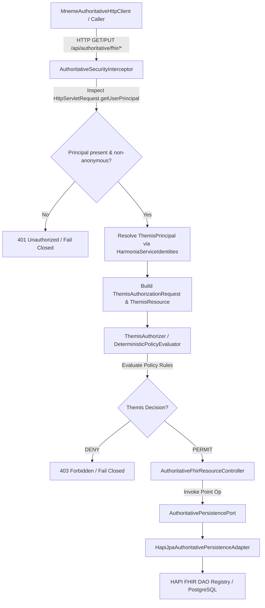

**Requirements**

**Overview & Goals**

Milestones **M1 (Stable Docker Runtime Baseline)** and **M2.1 (Mneme Authoritative HTTP Client)** are complete and accepted baselines. Repository history and source code analysis have established that the server-side authoritative HTTP adapter was never implemented in `hestia/mnemosyne-clinical`. Consequently, milestone **M2.2 (Distributed Authoritative Docker Path)** is blocked.

In accordance with the repository authority hierarchy (`docs/architectural-axioms.md`, `AGENTS.md`, ADR-021, ADR-022) and the master convergence roadmap (`docs/implementation/harmonia-convergence-runtime-integration-plan.md`), the current and only authorized step is **Step 3.3 — Mnemosyne Authoritative HTTP Server Adapter**.

The goal of Step 3.3 is to implement the missing internal synchronous HTTP server boundary in `hestia/mnemosyne-clinical` that exposes the existing `AuthoritativePersistencePort<IBaseResource>` (`HapiJpaAuthoritativePersistenceAdapter`) to the M2.1 `MnemeAuthoritativeHttpClient` at `/api/authoritative/fhir/{resourceType}/{id}`, protected by a fail-closed Themis default-deny security boundary, while removing the stale duplicate `AuthoritativePersistencePort` in `mnemosyne-clinical`.

**Scope**

- **In Scope (Step 3.3)**:
    - **Canonical Contract Cleanup**: Removal of the stale duplicate `hestia/mnemosyne-clinical/.../AuthoritativePersistencePort.java` and verification that all `mnemosyne-clinical` components resolve against canonical `hestia/mnemosyne-api`.
    - **Dedicated Authoritative Controller**: Implementation of the internal authoritative Spring `@RestController` in `hestia/mnemosyne-clinical` mapping `/api/authoritative/fhir/{resourceType}/{id}`.
    - **Deterministic M2.1 Client Wire Contract**: Exact implementation of `GET` (Point READ), `PUT` with `If-None-Match: *` (Point CREATE-if-absent), and `PUT` with `If-Match: W/"{expectedVersion}"` (Point UPDATE-if-expected-predecessor) with 100% deterministic, unambiguous HTTP status codes.
    - **Normative Version Transport Mapping**: Definition of `X-Harmonia-Authoritative-Version` as the normative representation of Mnemosyne `AuthoritativeVersion`, alongside standard `ETag: W/"{version}"` for HTTP preconditions, preserving strict separation across the 4 version domains.
    - **Request Identity & Precondition Validation**: Validation of path vs payload resource identity, malformed JSON bodies, and deterministic precondition handling (`428 Precondition Required`, `400 Bad Request`, `422 Unprocessable Entity`).
    - **Fail-Closed Security Boundary**: Implementation of `AuthoritativeSecurityInterceptor` consuming trusted `HttpServletRequest.getUserPrincipal()` to construct `ThemisSecurityContext` and evaluate `ThemisAuthorizer`, returning `401 Unauthorized` for missing/unauthenticated callers and `403 Forbidden` for policy-denied callers.
    - **Comprehensive Verification**: Unit/MockMvc wire contract tests, security fail-closed tests, Spring/HAPI JPA integration tests, and ArchUnit architecture/dependency conformance.

- **Out of Scope (Explicit Exclusions)**:
    - **M2.2**: Docker Compose topology changes, container image builds, or Docker network testing.
    - **M2.3**: Implementation of deployment-level transport authentication mechanisms (mTLS, service tokens) for `service:mneme`.
    - **M2.4**: Distributed multi-container end-to-end semantic verification across Docker bridge networks.
    - Public FHIR REST API changes (`/fhir/*` / `JpaRestfulServer`).
    - Physical DELETE operations (strictly forbidden by ADR-020).
    - Authoritative search / GraphQL / bulk operations (M5).
    - Modifying or removing legacy cache stores (`FhirRestCacheStore`).
    - Redesign of M2.1 client semantics (`MnemeAuthoritativeHttpClient`) or Mnemosyne persistence (`HapiJpaAuthoritativePersistenceAdapter`).

**User Stories**

- **As a Distributed Persistence Engine**, I want `mnemosyne-clinical` to expose a dedicated internal authoritative REST endpoint at `/api/authoritative/fhir/{resourceType}/{id}` so that `MnemeAuthoritativeHttpClient` can execute synchronous point `READ`, `CREATE`, and `UPDATE` operations across process and network boundaries.
- **As a Clinical Security & Governance Officer**, I want every invocation of the authoritative endpoint to be gated by Themis default-deny policy evaluation so that unauthenticated or unauthorized callers are rejected fail-closed without relying on network-level trust assumptions.
- **As an Architectural Guardian**, I want pure point preconditions (`If-None-Match`, `If-Match`) and conflict outcomes to map deterministically to HTTP headers and status codes with zero version leakage from `meta.versionId` so that authoritative state progression remains atomic and unambiguous.

**Functional Requirements**

- **FR-1 Dedicated Internal Route**: Server must expose `GET` and `PUT` on `/api/authoritative/fhir/{resourceType}/{id}`. Public `/fhir/*` servlet must remain completely distinct.
- **FR-2 Deterministic Point READ Handling**:
    - `GET /api/authoritative/fhir/{resourceType}/{id}` invokes `AuthoritativePersistencePort.read(ResourceKey)`.
    - On `Committed(resource, version)`: returns `200 OK` with serialized FHIR R5 JSON body, `ETag: W/"{version}"`, `X-Harmonia-Authoritative-Version: {version}`, and `Content-Type: application/fhir+json; charset=UTF-8`.
    - On `NotCommitted` (resource absent): returns `404 Not Found`.
    - On unauthenticated invocation: returns `401 Unauthorized`.
    - On unauthorized invocation (Themis DENY): returns `403 Forbidden`.
    - On malformed URI parameters: returns `400 Bad Request`.
    - On internal storage failure / unexpected exception: returns `500 Internal Server Error`.
- **FR-3 Deterministic Point CREATE-if-absent Handling**:
    - `PUT /api/authoritative/fhir/{resourceType}/{id}` with `If-None-Match: *` invokes `AuthoritativePersistencePort.create(ResourceKey, IBaseResource)`.
    - On `Committed(resource, version)`: returns `201 Created` with persisted FHIR JSON body, `ETag: W/"{version}"`, and `X-Harmonia-Authoritative-Version: {version}`.
    - On `Conflict(RESOURCE_ALREADY_EXISTS)`: returns `412 Precondition Failed` (with current version in `ETag` and `X-Harmonia-Authoritative-Version`).
    - On URI `{resourceType}` or `{id}` mismatch against JSON payload, or malformed JSON syntax: returns `400 Bad Request`.
    - On unparseable/invalid resource schema: returns `422 Unprocessable Entity`.
    - On unauthenticated invocation: returns `401 Unauthorized`.
    - On unauthorized invocation: returns `403 Forbidden`.
    - On internal storage failure: returns `500 Internal Server Error`.
- **FR-4 Deterministic Point UPDATE-if-expected-predecessor Handling**:
    - `PUT /api/authoritative/fhir/{resourceType}/{id}` with `If-Match: W/"{expectedVersion}"` invokes `AuthoritativePersistencePort.update(ResourceKey, IBaseResource, ExpectedAuthoritativeVersion)`.
    - On `Committed(resource, version)`: returns `200 OK` with updated FHIR JSON body, `ETag: W/"{version}"`, and `X-Harmonia-Authoritative-Version: {version}`.
    - On `Conflict(EXPECTED_VERSION_MISMATCH)` (version mismatch / stale version): returns `412 Precondition Failed` (with actual current version in `ETag` and `X-Harmonia-Authoritative-Version`).
    - On target resource absent for UPDATE: returns `404 Not Found`.
    - On URI `{resourceType}` or `{id}` mismatch against JSON payload, or malformed JSON syntax: returns `400 Bad Request`.
    - On unparseable/invalid resource schema: returns `422 Unprocessable Entity`.
    - On unauthenticated invocation: returns `401 Unauthorized`.
    - On unauthorized invocation: returns `403 Forbidden`.
    - On internal storage failure: returns `500 Internal Server Error`.
- **FR-5 Deterministic Precondition Discrimination & Header Validation**:
    - `PUT` request without `If-None-Match` or `If-Match`: returns `428 Precondition Required`.
    - `PUT` request specifying both `If-None-Match` and `If-Match`: returns `400 Bad Request`.
    - `PUT` request with invalid/empty `If-Match` format: returns `400 Bad Request`.
- **FR-6 Fail-Closed Security Governance**:
    - Invocations lacking trusted container/transport authentication (`HttpServletRequest.getUserPrincipal() == null`): returns `401 Unauthorized`.
    - Invocations evaluated by Themis returning `ThemisDecision.DENY`: returns `403 Forbidden`.
    - Caller-controlled identity headers, bypass tokens, synthetic credentials, or unauthenticated modes are strictly forbidden.
- **FR-7 Canonical Contract Cleanup**:
    - Delete `hestia/mnemosyne-clinical/.../AuthoritativePersistencePort.java`.
    - Verify all `mnemosyne-clinical` source files bind exclusively to `net.fhirfactory.harmonia.hapifhir.persistence.AuthoritativePersistencePort` in `mnemosyne-api`.

**Non-Functional Requirements**

- **Modularity & Layering**: Production code in `mnemosyne-clinical` must not import or depend on `mneme-persistence` or Paradeigma simulation modules (asserted by ArchUnit).
- **Idempotency & Safety**: Mutating operations must not perform transparent retries and must execute within atomic HAPI JPA database transactions.
- **Fail-Closed Diagnostics**: Security failures must emit sanitized diagnostic messages without PHI or sensitive token credentials.

**Technical Design**

**Repository Baseline & Existing Assets**

1. **Existing Persistence Baseline (`hestia/mnemosyne-clinical`, `hestia/mnemosyne-api`)**:
    - Canonical `AuthoritativePersistencePort<IBaseResource>` exists in `hestia/mnemosyne-api`.
    - Stale duplicate `AuthoritativePersistencePort.java` exists in `hestia/mnemosyne-clinical` and must be deleted.
    - `HapiJpaAuthoritativePersistenceAdapter` in `mnemosyne-clinical` implements `AuthoritativePersistencePort<IBaseResource>` via HAPI FHIR `DaoRegistry` and transactional JPA persistence.
    - `FhirServerConfig` registers public `JpaRestfulServer` servlet on `/fhir/*`.
2. **Existing Client Contract Baseline (`hestia/mneme-persistence`)**:
    - `MnemeAuthoritativeHttpClient` implements `AuthoritativePersistencePort<IBaseResource>` connecting to `/api/authoritative/fhir/{resourceType}/{id}`.
    - Fully tested against 28 WireMock test cases in `MnemeAuthoritativeHttpClientTest`.
3. **Existing Themis Security Engine Baseline (`themis/themis-api`, `themis/themis-core`)**:
    - `DeterministicPolicyEvaluator` implements `ThemisAuthorizer` and `ThemisService`, evaluating `ThemisAuthorizationRequest` against priority-ordered `ThemisPolicy` rules with default-deny fallback.
    - `HarmoniaServiceIdentities` defines canonical service principals (`ID_MNEME = "service:mneme"`, `PRINCIPAL_MNEME`) and default least-privilege authorities (`clinical.read`, `clinical.create`, `clinical.update`).
    - `ThemisClinicalAuthorizationFilter` in `iris/iris-befe` provides an established reference pattern for extracting container-authenticated `getUserPrincipal()`, mapping to `ThemisPrincipal`, and enforcing Themis authorization.
4. **Unstaged Working Tree Modification (`hestia/mnemosyne-api/pom.xml`)**:
    - Unstaged modification adds explicit `<packaging>jar</packaging>` to `hestia/mnemosyne-api/pom.xml`.
    - Relevance to Step 3.3: Declares standard JAR packaging for the shared contract module; fully compatible and does not impact Step 3.3.

**Key Decisions**

- **Decision 1: Implement Dedicated Spring `@RestController` for `/api/authoritative/fhir/*`**:
    - *Approach*: Add `AuthoritativeFhirResourceController` in `hestia/mnemosyne-clinical` injecting `AuthoritativePersistencePort<IBaseResource>`.
    - *Rationale*: Isolates the internal authoritative contract from HAPI's public `/fhir/*` servlet (`JpaRestfulServer`), providing clean path routing, standard header extraction, and unified exception mapping.
- **Decision 2: Explicit Normative Version Transport Mapping**:
    - *Approach*: Define `X-Harmonia-Authoritative-Version` as the normative HTTP representation of Mnemosyne `AuthoritativeVersion`. `ETag: W/"{version}"` is generated for standard HTTP conditional caching/preconditions (`If-Match`, `If-None-Match`).
    - *Rationale*: Strictly preserves separation between the four version domains: (1) FHIR `meta.versionId`, (2) HTTP `ETag`, (3) Mneme active-state token, and (4) Mnemosyne `AuthoritativeVersion`. Zero fallback to `meta.versionId` is permitted.
- **Decision 3: Grounded Fail-Closed Security Adapter (`AuthoritativeSecurityInterceptor`)**:
    - *Approach*: Implement a Spring MVC `HandlerInterceptor` that consumes trusted `HttpServletRequest.getUserPrincipal()`, maps to `ThemisPrincipal` via `HarmoniaServiceIdentities`, constructs `ThemisSecurityContext` and `ThemisAuthorizationRequest`, and evaluates `ThemisAuthorizer.authorize(...)`.
    - *Rationale*: Step 3.3 consumes trusted container/transport identity and delegates to Themis without inventing caller-controlled headers, temporary credentials, or network-level trust assumptions. Transport authentication for `service:mneme` over the network is deferred to M2.3.

**Normative HTTP Wire Contract & Version Domains**

**1. Version Domain Separation**

| Domain | Representation / Scope | Usage in Step 3.3 |
| :--- | :--- | :--- |
| **Mnemosyne `AuthoritativeVersion`** | Numerical string / opaque token (`AuthoritativeVersion`) | Core domain model representing durable persistence version in PostgreSQL (`HFJ_RES_VER`). |
| **Normative HTTP Version Header** | `X-Harmonia-Authoritative-Version: {version}` | Normative wire representation of Mnemosyne `AuthoritativeVersion`. |
| **HTTP ETag Header** | `ETag: W/"{version}"` | Generated HTTP weak ETag used exclusively for HTTP conditional headers (`If-Match`, `If-None-Match`). |
| **FHIR `meta.versionId`** | Resource meta element | Independent FHIR resource metadata; never used as authoritative version source or fallback. |
| **Mneme Active-State Token** | Distributed cache token (Infinispan) | Ephemeral active-state coordination token; never treated as authoritative durable state. |

**2. Normative Wire Contract Matrix**

| Operation | HTTP Method | Precondition Headers | Server Adapter Invocation | Normative Success Response | Normative Conflict / Precondition Response | Normative Error Response |
| :--- | :--- | :--- | :--- | :--- | :--- | :--- |
| **Point READ** | `GET /api/authoritative/fhir/{type}/{id}` | (None) | `persistencePort.read(key)` | `200 OK`<br/>`ETag: W/"{v}"`<br/>`X-Harmonia-Authoritative-Version: {v}`<br/>Payload body | `404 Not Found` (resource absent) | `401 Unauthorized` (unauthenticated)<br/>`403 Forbidden` (unauthorized)<br/>`400 Bad Request` (bad URI)<br/>`500 Internal Server Error` |
| **Point CREATE** | `PUT /api/authoritative/fhir/{type}/{id}` | `If-None-Match: *` | `persistencePort.create(key, resource)` | `201 Created`<br/>`ETag: W/"{v}"`<br/>`X-Harmonia-Authoritative-Version: {v}`<br/>Payload body | `412 Precondition Failed`<br/>`ETag: W/"{curVer}"`<br/>`X-Harmonia-Authoritative-Version: {curVer}` (exists) | `400 Bad Request` (URI/body mismatch)<br/>`422 Unprocessable Entity` (invalid schema)<br/>`401 Unauthorized`<br/>`403 Forbidden`<br/>`500 Internal Server Error` |
| **Point UPDATE** | `PUT /api/authoritative/fhir/{type}/{id}` | `If-Match: W/"{expVer}"` | `persistencePort.update(key, resource, expVer)` | `200 OK`<br/>`ETag: W/"{v}"`<br/>`X-Harmonia-Authoritative-Version: {v}`<br/>Payload body | `412 Precondition Failed`<br/>`ETag: W/"{curVer}"`<br/>`X-Harmonia-Authoritative-Version: {curVer}` (stale/mismatch)<br/>`404 Not Found` (absent) | `400 Bad Request` (URI/body mismatch)<br/>`422 Unprocessable Entity` (invalid schema)<br/>`401 Unauthorized`<br/>`403 Forbidden`<br/>`500 Internal Server Error` |

**3. Normative Precondition & Request Validation Rules**

- **Missing Preconditions**: `PUT` request with neither `If-None-Match` nor `If-Match` -> `428 Precondition Required`.
- **Conflicting Preconditions**: `PUT` request specifying both `If-None-Match` and `If-Match` -> `400 Bad Request`.
- **Malformed ETag in `If-Match`**: `PUT` request with unparseable or blank `If-Match` header -> `400 Bad Request`.
- **Identity Mismatch**: `PUT` where JSON payload `resourceType` does not match path `{type}`, or where payload `id` is present and does not match path `{id}` -> `400 Bad Request`.
- **Malformed JSON**: Request body contains invalid JSON syntax -> `400 Bad Request`.

**Security Adapter & Themis Integration Flow**



**Grounded Security Implementation Details:**

1. **Principal Extraction**: The interceptor calls `request.getUserPrincipal()`. If null, empty, or `"anonymous"`, it aborts with HTTP `401 Unauthorized`.
2. **ThemisPrincipal Resolution**: Resolves the principal using `HarmoniaServiceIdentities` (e.g., `"service:mneme"` maps to `HarmoniaServiceIdentities.PRINCIPAL_MNEME` with authorities `clinical.read`, `clinical.create`, `clinical.update`).
3. **ThemisContext & Request Construction**:
    - Constructs `ThemisResource` with `resourceType`, `resourceId`, security domain `HarmoniaSecurityLabelEnum.CLINICAL.getCode()`.
    - Constructs `ThemisSecurityContext` with requesting principal and executing principal (`HarmoniaServiceIdentities.PRINCIPAL_MNEMOSYNE`).
    - Maps HTTP method to `ThemisAction` (`GET` -> `ThemisAction.READ`, `PUT` with `If-None-Match` -> `ThemisAction.EXECUTE` / `CREATE`, `PUT` with `If-Match` -> `ThemisAction.UPDATE`).
4. **Policy Evaluation**: Injected `ThemisAuthorizer` evaluates the request. If decision is not `PERMIT`, returns `403 Forbidden`.

**Files to Add, Modify, and Remove**

**1. Files to Remove**

- `hestia/mnemosyne-clinical/src/main/java/net/fhirfactory/harmonia/hapifhir/persistence/AuthoritativePersistencePort.java` (stale duplicate).

**2. Files to Add**

- `hestia/mnemosyne-clinical/src/main/java/net/fhirfactory/harmonia/hapifhir/controller/AuthoritativeFhirResourceController.java`: Spring `@RestController` implementing GET/PUT endpoints, header extraction, and result mapping.
- `hestia/mnemosyne-clinical/src/main/java/net/fhirfactory/harmonia/hapifhir/controller/security/AuthoritativeSecurityInterceptor.java`: Spring `HandlerInterceptor` executing Themis security evaluation.
- `hestia/mnemosyne-clinical/src/main/java/net/fhirfactory/harmonia/hapifhir/controller/dto/AuthoritativeVersionHelper.java`: Utility class for header parsing and `AuthoritativeVersion` formatting.
- `hestia/mnemosyne-clinical/src/main/java/net/fhirfactory/harmonia/hapifhir/config/AuthoritativeWebMvcConfig.java`: Spring `@Configuration` registering the interceptor for `/api/authoritative/fhir/**`.
- `hestia/mnemosyne-clinical/src/test/java/net/fhirfactory/harmonia/hapifhir/controller/AuthoritativeFhirResourceControllerTest.java`: MockMvc unit tests for status codes, headers, and precondition discrimination.
- `hestia/mnemosyne-clinical/src/test/java/net/fhirfactory/harmonia/hapifhir/controller/AuthoritativeFhirResourceControllerSecurityTest.java`: MockMvc tests validating fail-closed behavior for unauthenticated and unauthorized requests.
- `hestia/mnemosyne-clinical/src/test/java/net/fhirfactory/harmonia/hapifhir/controller/AuthoritativeFhirResourceIntegrationTest.java`: Spring Boot integration test with real `HapiJpaAuthoritativePersistenceAdapter` and database persistence.

**3. Files to Modify**

- `docs/implementation/harmonia-convergence-runtime-integration-plan.md`: Update Step 3.3 status and current position upon completion.

**Verification & Testing**

**Test Scenarios & Suites**

**1. Controller Wire Contract Tests (`AuthoritativeFhirResourceControllerTest`)**

- **GET (Point READ)**:
    - `GET /api/authoritative/fhir/Patient/pat-1` -> `200 OK`, `ETag: W/"1"`, `X-Harmonia-Authoritative-Version: 1`, `Content-Type: application/fhir+json; charset=UTF-8`, valid Patient JSON payload.
    - `GET /api/authoritative/fhir/Patient/unknown` -> `404 Not Found`.
- **PUT CREATE (If-None-Match: *)**:
    - `PUT /api/authoritative/fhir/Patient/pat-1` with `If-None-Match: *` and new Patient -> `201 Created`, `ETag: W/"1"`, `X-Harmonia-Authoritative-Version: 1`, persisted payload.
    - `PUT /api/authoritative/fhir/Patient/pat-1` with `If-None-Match: *` when resource already exists -> `412 Precondition Failed` with current version in `ETag` and `X-Harmonia-Authoritative-Version`.
- **PUT UPDATE (If-Match: W/"{version}")**:
    - `PUT /api/authoritative/fhir/Patient/pat-1` with `If-Match: W/"1"` and updated Patient -> `200 OK`, `ETag: W/"2"`, `X-Harmonia-Authoritative-Version: 2`.
    - `PUT /api/authoritative/fhir/Patient/pat-1` with `If-Match: W/"999"` (stale version) -> `412 Precondition Failed` with actual version headers.
    - `PUT /api/authoritative/fhir/Patient/nonexistent` with `If-Match: W/"1"` -> `404 Not Found`.
- **Precondition & Request Validation**:
    - `PUT` without `If-None-Match` or `If-Match` -> `428 Precondition Required`.
    - `PUT` with both `If-None-Match` and `If-Match` -> `400 Bad Request`.
    - `PUT` with invalid/empty `If-Match` -> `400 Bad Request`.
    - `PUT` where payload `resourceType` is `Practitioner` but path is `Patient` -> `400 Bad Request`.
    - `PUT` where payload `id` is `pat-2` but path is `pat-1` -> `400 Bad Request`.
    - `PUT` with malformed JSON body syntax -> `400 Bad Request`.
    - `PUT` with unparseable FHIR schema -> `422 Unprocessable Entity`.

**2. Security Fail-Closed Tests (`AuthoritativeFhirResourceControllerSecurityTest`)**

- **Unauthenticated Invocations**:
    - Request with `request.getUserPrincipal() == null` -> `401 Unauthorized`.
    - Request with anonymous principal -> `401 Unauthorized`.
    - Request with caller-controlled header (e.g. `X-Service-Name: mneme`) without verified transport context -> `401 Unauthorized`.
- **Unauthorized Invocations**:
    - Request with authenticated principal lacking required clinical authority -> `403 Forbidden`.
    - Request evaluated by Themis policy returning `ThemisDecision.DENY` -> `403 Forbidden`.
- **Authorized Invocations**:
    - Request with trusted `service:mneme` principal and valid authorities -> proceeds to persistence adapter returning `200`/`201`.

**3. Spring Boot JPA Integration Tests (`AuthoritativeFhirResourceIntegrationTest`)**

- Executes full Spring Boot web slice / HTTP request dispatching through `AuthoritativeFhirResourceController` down to `HapiJpaAuthoritativePersistenceAdapter` and HAPI DAO tables.
- Validates that CREATE commits to `HFJ_RESOURCE` / `HFJ_RES_VER`, READ loads from JPA, and UPDATE increments database version.

**4. Architecture & Dependency Conformance**

- Run repository ArchUnit test suite:
  `mvn test -pl paradeigma/paradeigma-test -am -Dtest="*ArchitectureTest" -Dsurefire.failIfNoSpecifiedTests=false`
- Verify:
    - Invariant 1: Zero Paradeigma leakage.
    - Invariant 6: Default-deny Themis security enforcement.
    - Invariant 8: `mneme-persistence` depends only on `mnemosyne-api`, never on `mnemosyne-clinical`.
    - All `mnemosyne-clinical` source files compile cleanly against canonical `mnemosyne-api`.

**Implementation Sequence & Stop Conditions**

**Implementation Sequence**

*** Step 1: Canonical Contract Cleanup and Maven Resolution**

- Delete stale duplicate `hestia/mnemosyne-clinical/src/main/java/net/fhirfactory/harmonia/hapifhir/persistence/AuthoritativePersistencePort.java`.
- Ensure all usages in `mnemosyne-clinical` bind to canonical `mnemosyne-api`. Verify with `mvn clean compile -pl hestia/mnemosyne-clinical -am`.

**Step 2: Implement Mnemosyne Authoritative REST Controller & Helpers**

- Implement `AuthoritativeVersionHelper` for version header extraction and formatting.
- Implement `AuthoritativeFhirResourceController` mapping `/api/authoritative/fhir/{resourceType}/{id}` for GET and PUT.
- Implement deterministic status code mappings, ETag and `X-Harmonia-Authoritative-Version` response headers, and request validations (`400`, `404`, `412`, `422`, `428`, `500`).

**Step 3: Implement Fail-Closed Themis Security Interceptor**

- Implement `AuthoritativeSecurityInterceptor` extracting `HttpServletRequest.getUserPrincipal()`, mapping to `ThemisPrincipal`, and evaluating `ThemisAuthorizer`.
- Register interceptor in `AuthoritativeWebMvcConfig` for path `/api/authoritative/fhir/**`.

**Step 4: Author Test Suite & Execute Conformance Verification**

- Author `AuthoritativeFhirResourceControllerTest`, `AuthoritativeFhirResourceControllerSecurityTest`, and `AuthoritativeFhirResourceIntegrationTest`.
- Execute module test suite `mvn test -pl hestia/mnemosyne-clinical` and full ArchUnit suite `mvn test -pl paradeigma/paradeigma-test -am -Dtest="*ArchitectureTest"`.

**Step 5: Update Master Convergence Plan**

- Update `docs/implementation/harmonia-convergence-runtime-integration-plan.md` to record Step 3.3 completion.

**Boundary Rules & Stop Conditions**

- **No Deployment Scope Expansion**: Step 3.3 must NOT implement Docker Compose topology changes, container builds, or M2.2 network verifications.
- **No Synthetic Security Bypass**: Step 3.3 must NOT invent temporary credentials or bypass Themis. Unauthenticated requests must fail closed.
- **Milestone Discipline**: Step 3.3 terminates upon completing and verifying the server adapter in `mnemosyne-clinical`. M2.2 will be planned and executed only after Step 3.3 is complete and approved.

```
STEP 3.3 PLAN COMPLETE — NO IMPLEMENTATION COMMENCED
```


**Requirements**

**Overview & Goals**

Milestones **M1 (Stable Docker Runtime Baseline)** and **M2.1 (Mneme Authoritative HTTP Client)** are complete and accepted baselines. Repository history and source code analysis have established that the server-side authoritative HTTP adapter was never implemented in `hestia/mnemosyne-clinical`. Consequently, milestone **M2.2 (Distributed Authoritative Docker Path)** is blocked.

In accordance with the repository authority hierarchy (`docs/architectural-axioms.md`, `AGENTS.md`, ADR-021, ADR-022) and the master convergence roadmap (`docs/implementation/harmonia-convergence-runtime-integration-plan.md`), the current and only authorized step is **Step 3.3 — Mnemosyne Authoritative HTTP Server Adapter**.

The goal of Step 3.3 is to implement the missing internal synchronous HTTP server boundary in `hestia/mnemosyne-clinical` that exposes the existing `AuthoritativePersistencePort<IBaseResource>` (`HapiJpaAuthoritativePersistenceAdapter`) to the M2.1 `MnemeAuthoritativeHttpClient` at `/api/authoritative/fhir/{resourceType}/{id}`, protected by a fail-closed Themis default-deny security boundary, while removing the stale duplicate `AuthoritativePersistencePort` in `mnemosyne-clinical`.

**Scope**

- **In Scope (Step 3.3)**:
    - **Canonical Contract Cleanup**: Removal of the stale duplicate `hestia/mnemosyne-clinical/.../AuthoritativePersistencePort.java` and verification that all `mnemosyne-clinical` components resolve against canonical `hestia/mnemosyne-api`.
    - **Dedicated Authoritative Controller**: Implementation of the internal authoritative Spring `@RestController` in `hestia/mnemosyne-clinical` mapping `/api/authoritative/fhir/{resourceType}/{id}`.
    - **Deterministic M2.1 Client Wire Contract**: Exact implementation of `GET` (Point READ), `PUT` with `If-None-Match: *` (Point CREATE-if-absent), and `PUT` with `If-Match: W/"{expectedVersion}"` (Point UPDATE-if-expected-predecessor) with 100% deterministic, unambiguous HTTP status codes.
    - **Normative Version Transport Mapping**: Definition of `X-Harmonia-Authoritative-Version` as the normative representation of Mnemosyne `AuthoritativeVersion`, alongside standard `ETag: W/"{version}"` for HTTP preconditions, preserving strict separation across the 4 version domains.
    - **Request Identity & Precondition Validation**: Validation of path vs payload resource identity, malformed JSON bodies, and deterministic precondition handling (`428 Precondition Required`, `400 Bad Request`, `422 Unprocessable Entity`).
    - **Fail-Closed Security Boundary**: Implementation of `AuthoritativeSecurityInterceptor` consuming trusted `HttpServletRequest.getUserPrincipal()` to construct `ThemisSecurityContext` and evaluate `ThemisAuthorizer`, returning `401 Unauthorized` for missing/unauthenticated callers and `403 Forbidden` for policy-denied callers.
    - **Comprehensive Verification**: Unit/MockMvc wire contract tests, security fail-closed tests, Spring/HAPI JPA integration tests, and ArchUnit architecture/dependency conformance.

- **Out of Scope (Explicit Exclusions)**:
    - **M2.2**: Docker Compose topology changes, container image builds, or Docker network testing.
    - **M2.3**: Implementation of deployment-level transport authentication mechanisms (mTLS, service tokens) for `service:mneme`.
    - **M2.4**: Distributed multi-container end-to-end semantic verification across Docker bridge networks.
    - Public FHIR REST API changes (`/fhir/*` / `JpaRestfulServer`).
    - Physical DELETE operations (strictly forbidden by ADR-020).
    - Authoritative search / GraphQL / bulk operations (M5).
    - Modifying or removing legacy cache stores (`FhirRestCacheStore`).
    - Redesign of M2.1 client semantics (`MnemeAuthoritativeHttpClient`) or Mnemosyne persistence (`HapiJpaAuthoritativePersistenceAdapter`).

**User Stories**

- **As a Distributed Persistence Engine**, I want `mnemosyne-clinical` to expose a dedicated internal authoritative REST endpoint at `/api/authoritative/fhir/{resourceType}/{id}` so that `MnemeAuthoritativeHttpClient` can execute synchronous point `READ`, `CREATE`, and `UPDATE` operations across process and network boundaries.
- **As a Clinical Security & Governance Officer**, I want every invocation of the authoritative endpoint to be gated by Themis default-deny policy evaluation so that unauthenticated or unauthorized callers are rejected fail-closed without relying on network-level trust assumptions.
- **As an Architectural Guardian**, I want pure point preconditions (`If-None-Match`, `If-Match`) and conflict outcomes to map deterministically to HTTP headers and status codes with zero version leakage from `meta.versionId` so that authoritative state progression remains atomic and unambiguous.

**Functional Requirements**

- **FR-1 Dedicated Internal Route**: Server must expose `GET` and `PUT` on `/api/authoritative/fhir/{resourceType}/{id}`. Public `/fhir/*` servlet must remain completely distinct.
- **FR-2 Deterministic Point READ Handling**:
    - `GET /api/authoritative/fhir/{resourceType}/{id}` invokes `AuthoritativePersistencePort.read(ResourceKey)`.
    - On `Committed(resource, version)`: returns `200 OK` with serialized FHIR R5 JSON body, `ETag: W/"{version}"`, `X-Harmonia-Authoritative-Version: {version}`, and `Content-Type: application/fhir+json; charset=UTF-8`.
    - On `NotCommitted` (resource absent): returns `404 Not Found`.
    - On unauthenticated invocation: returns `401 Unauthorized`.
    - On unauthorized invocation (Themis DENY): returns `403 Forbidden`.
    - On malformed URI parameters: returns `400 Bad Request`.
    - On internal storage failure / unexpected exception: returns `500 Internal Server Error`.
- **FR-3 Deterministic Point CREATE-if-absent Handling**:
    - `PUT /api/authoritative/fhir/{resourceType}/{id}` with `If-None-Match: *` invokes `AuthoritativePersistencePort.create(ResourceKey, IBaseResource)`.
    - On `Committed(resource, version)`: returns `201 Created` with persisted FHIR JSON body, `ETag: W/"{version}"`, and `X-Harmonia-Authoritative-Version: {version}`.
    - On `Conflict(RESOURCE_ALREADY_EXISTS)`: returns `412 Precondition Failed` (with current version in `ETag` and `X-Harmonia-Authoritative-Version`).
    - On URI `{resourceType}` or `{id}` mismatch against JSON payload, or malformed JSON syntax: returns `400 Bad Request`.
    - On unparseable/invalid resource schema: returns `422 Unprocessable Entity`.
    - On unauthenticated invocation: returns `401 Unauthorized`.
    - On unauthorized invocation: returns `403 Forbidden`.
    - On internal storage failure: returns `500 Internal Server Error`.
- **FR-4 Deterministic Point UPDATE-if-expected-predecessor Handling**:
    - `PUT /api/authoritative/fhir/{resourceType}/{id}` with `If-Match: W/"{expectedVersion}"` invokes `AuthoritativePersistencePort.update(ResourceKey, IBaseResource, ExpectedAuthoritativeVersion)`.
    - On `Committed(resource, version)`: returns `200 OK` with updated FHIR JSON body, `ETag: W/"{version}"`, and `X-Harmonia-Authoritative-Version: {version}`.
    - On `Conflict(EXPECTED_VERSION_MISMATCH)` (version mismatch / stale version): returns `412 Precondition Failed` (with actual current version in `ETag` and `X-Harmonia-Authoritative-Version`).
    - On target resource absent for UPDATE: returns `404 Not Found`.
    - On URI `{resourceType}` or `{id}` mismatch against JSON payload, or malformed JSON syntax: returns `400 Bad Request`.
    - On unparseable/invalid resource schema: returns `422 Unprocessable Entity`.
    - On unauthenticated invocation: returns `401 Unauthorized`.
    - On unauthorized invocation: returns `403 Forbidden`.
    - On internal storage failure: returns `500 Internal Server Error`.
- **FR-5 Deterministic Precondition Discrimination & Header Validation**:
    - `PUT` request without `If-None-Match` or `If-Match`: returns `428 Precondition Required`.
    - `PUT` request specifying both `If-None-Match` and `If-Match`: returns `400 Bad Request`.
    - `PUT` request with invalid/empty `If-Match` format: returns `400 Bad Request`.
- **FR-6 Fail-Closed Security Governance**:
    - Invocations lacking trusted container/transport authentication (`HttpServletRequest.getUserPrincipal() == null`): returns `401 Unauthorized`.
    - Invocations evaluated by Themis returning `ThemisDecision.DENY`: returns `403 Forbidden`.
    - Caller-controlled identity headers, bypass tokens, synthetic credentials, or unauthenticated modes are strictly forbidden.
- **FR-7 Canonical Contract Cleanup**:
    - Delete `hestia/mnemosyne-clinical/.../AuthoritativePersistencePort.java`.
    - Verify all `mnemosyne-clinical` source files bind exclusively to `net.fhirfactory.harmonia.hapifhir.persistence.AuthoritativePersistencePort` in `mnemosyne-api`.

**Non-Functional Requirements**

- **Modularity & Layering**: Production code in `mnemosyne-clinical` must not import or depend on `mneme-persistence` or Paradeigma simulation modules (asserted by ArchUnit).
- **Idempotency & Safety**: Mutating operations must not perform transparent retries and must execute within atomic HAPI JPA database transactions.
- **Fail-Closed Diagnostics**: Security failures must emit sanitized diagnostic messages without PHI or sensitive token credentials.

**Technical Design**

**Repository Baseline & Existing Assets**

1. **Existing Persistence Baseline (`hestia/mnemosyne-clinical`, `hestia/mnemosyne-api`)**:
    - Canonical `AuthoritativePersistencePort<IBaseResource>` exists in `hestia/mnemosyne-api`.
    - Stale duplicate `AuthoritativePersistencePort.java` exists in `hestia/mnemosyne-clinical` and must be deleted.
    - `HapiJpaAuthoritativePersistenceAdapter` in `mnemosyne-clinical` implements `AuthoritativePersistencePort<IBaseResource>` via HAPI FHIR `DaoRegistry` and transactional JPA persistence.
    - `FhirServerConfig` registers public `JpaRestfulServer` servlet on `/fhir/*`.
2. **Existing Client Contract Baseline (`hestia/mneme-persistence`)**:
    - `MnemeAuthoritativeHttpClient` implements `AuthoritativePersistencePort<IBaseResource>` connecting to `/api/authoritative/fhir/{resourceType}/{id}`.
    - Fully tested against 28 WireMock test cases in `MnemeAuthoritativeHttpClientTest`.
3. **Existing Themis Security Engine Baseline (`themis/themis-api`, `themis/themis-core`)**:
    - `DeterministicPolicyEvaluator` implements `ThemisAuthorizer` and `ThemisService`, evaluating `ThemisAuthorizationRequest` against priority-ordered `ThemisPolicy` rules with default-deny fallback.
    - `HarmoniaServiceIdentities` defines canonical service principals (`ID_MNEME = "service:mneme"`, `PRINCIPAL_MNEME`) and default least-privilege authorities (`clinical.read`, `clinical.create`, `clinical.update`).
    - `ThemisClinicalAuthorizationFilter` in `iris/iris-befe` provides an established reference pattern for extracting container-authenticated `getUserPrincipal()`, mapping to `ThemisPrincipal`, and enforcing Themis authorization.
4. **Unstaged Working Tree Modification (`hestia/mnemosyne-api/pom.xml`)**:
    - Unstaged modification adds explicit `<packaging>jar</packaging>` to `hestia/mnemosyne-api/pom.xml`.
    - Relevance to Step 3.3: Declares standard JAR packaging for the shared contract module; fully compatible and does not impact Step 3.3.

**Key Decisions**

- **Decision 1: Implement Dedicated Spring `@RestController` for `/api/authoritative/fhir/*`**:
    - *Approach*: Add `AuthoritativeFhirResourceController` in `hestia/mnemosyne-clinical` injecting `AuthoritativePersistencePort<IBaseResource>`.
    - *Rationale*: Isolates the internal authoritative contract from HAPI's public `/fhir/*` servlet (`JpaRestfulServer`), providing clean path routing, standard header extraction, and unified exception mapping.
- **Decision 2: Explicit Normative Version Transport Mapping**:
    - *Approach*: Define `X-Harmonia-Authoritative-Version` as the normative HTTP representation of Mnemosyne `AuthoritativeVersion`. `ETag: W/"{version}"` is generated for standard HTTP conditional caching/preconditions (`If-Match`, `If-None-Match`).
    - *Rationale*: Strictly preserves separation between the four version domains: (1) FHIR `meta.versionId`, (2) HTTP `ETag`, (3) Mneme active-state token, and (4) Mnemosyne `AuthoritativeVersion`. Zero fallback to `meta.versionId` is permitted.
- **Decision 3: Grounded Fail-Closed Security Adapter (`AuthoritativeSecurityInterceptor`)**:
    - *Approach*: Implement a Spring MVC `HandlerInterceptor` that consumes trusted `HttpServletRequest.getUserPrincipal()`, maps to `ThemisPrincipal` via `HarmoniaServiceIdentities`, constructs `ThemisSecurityContext` and `ThemisAuthorizationRequest`, and evaluates `ThemisAuthorizer.authorize(...)`.
    - *Rationale*: Step 3.3 consumes trusted container/transport identity and delegates to Themis without inventing caller-controlled headers, temporary credentials, or network-level trust assumptions. Transport authentication for `service:mneme` over the network is deferred to M2.3.

**Normative HTTP Wire Contract & Version Domains**

**1. Version Domain Separation**

| Domain | Representation / Scope | Usage in Step 3.3 |
| :--- | :--- | :--- |
| **Mnemosyne `AuthoritativeVersion`** | Numerical string / opaque token (`AuthoritativeVersion`) | Core domain model representing durable persistence version in PostgreSQL (`HFJ_RES_VER`). |
| **Normative HTTP Version Header** | `X-Harmonia-Authoritative-Version: {version}` | Normative wire representation of Mnemosyne `AuthoritativeVersion`. |
| **HTTP ETag Header** | `ETag: W/"{version}"` | Generated HTTP weak ETag used exclusively for HTTP conditional headers (`If-Match`, `If-None-Match`). |
| **FHIR `meta.versionId`** | Resource meta element | Independent FHIR resource metadata; never used as authoritative version source or fallback. |
| **Mneme Active-State Token** | Distributed cache token (Infinispan) | Ephemeral active-state coordination token; never treated as authoritative durable state. |

**2. Normative Wire Contract Matrix**

| Operation | HTTP Method | Precondition Headers | Server Adapter Invocation | Normative Success Response | Normative Conflict / Precondition Response | Normative Error Response |
| :--- | :--- | :--- | :--- | :--- | :--- | :--- |
| **Point READ** | `GET /api/authoritative/fhir/{type}/{id}` | (None) | `persistencePort.read(key)` | `200 OK`<br/>`ETag: W/"{v}"`<br/>`X-Harmonia-Authoritative-Version: {v}`<br/>Payload body | `404 Not Found` (resource absent) | `401 Unauthorized` (unauthenticated)<br/>`403 Forbidden` (unauthorized)<br/>`400 Bad Request` (bad URI)<br/>`500 Internal Server Error` |
| **Point CREATE** | `PUT /api/authoritative/fhir/{type}/{id}` | `If-None-Match: *` | `persistencePort.create(key, resource)` | `201 Created`<br/>`ETag: W/"{v}"`<br/>`X-Harmonia-Authoritative-Version: {v}`<br/>Payload body | `412 Precondition Failed`<br/>`ETag: W/"{curVer}"`<br/>`X-Harmonia-Authoritative-Version: {curVer}` (exists) | `400 Bad Request` (URI/body mismatch)<br/>`422 Unprocessable Entity` (invalid schema)<br/>`401 Unauthorized`<br/>`403 Forbidden`<br/>`500 Internal Server Error` |
| **Point UPDATE** | `PUT /api/authoritative/fhir/{type}/{id}` | `If-Match: W/"{expVer}"` | `persistencePort.update(key, resource, expVer)` | `200 OK`<br/>`ETag: W/"{v}"`<br/>`X-Harmonia-Authoritative-Version: {v}`<br/>Payload body | `412 Precondition Failed`<br/>`ETag: W/"{curVer}"`<br/>`X-Harmonia-Authoritative-Version: {curVer}` (stale/mismatch)<br/>`404 Not Found` (absent) | `400 Bad Request` (URI/body mismatch)<br/>`422 Unprocessable Entity` (invalid schema)<br/>`401 Unauthorized`<br/>`403 Forbidden`<br/>`500 Internal Server Error` |

**3. Normative Precondition & Request Validation Rules**

- **Missing Preconditions**: `PUT` request with neither `If-None-Match` nor `If-Match` -> `428 Precondition Required`.
- **Conflicting Preconditions**: `PUT` request specifying both `If-None-Match` and `If-Match` -> `400 Bad Request`.
- **Malformed ETag in `If-Match`**: `PUT` request with unparseable or blank `If-Match` header -> `400 Bad Request`.
- **Identity Mismatch**: `PUT` where JSON payload `resourceType` does not match path `{type}`, or where payload `id` is present and does not match path `{id}` -> `400 Bad Request`.
- **Malformed JSON**: Request body contains invalid JSON syntax -> `400 Bad Request`.

**Security Adapter & Themis Integration Flow**


**Grounded Security Implementation Details:**

1. **Principal Extraction**: The interceptor calls `request.getUserPrincipal()`. If null, empty, or `"anonymous"`, it aborts with HTTP `401 Unauthorized`.
2. **ThemisPrincipal Resolution**: Resolves the principal using `HarmoniaServiceIdentities` (e.g., `"service:mneme"` maps to `HarmoniaServiceIdentities.PRINCIPAL_MNEME` with authorities `clinical.read`, `clinical.create`, `clinical.update`).
3. **ThemisContext & Request Construction**:
    - Constructs `ThemisResource` with `resourceType`, `resourceId`, security domain `HarmoniaSecurityLabelEnum.CLINICAL.getCode()`.
    - Constructs `ThemisSecurityContext` with requesting principal and executing principal (`HarmoniaServiceIdentities.PRINCIPAL_MNEMOSYNE`).
    - Maps HTTP method to `ThemisAction` (`GET` -> `ThemisAction.READ`, `PUT` with `If-None-Match` -> `ThemisAction.EXECUTE` / `CREATE`, `PUT` with `If-Match` -> `ThemisAction.UPDATE`).
4. **Policy Evaluation**: Injected `ThemisAuthorizer` evaluates the request. If decision is not `PERMIT`, returns `403 Forbidden`.

**Files to Add, Modify, and Remove**

**1. Files to Remove**

- `hestia/mnemosyne-clinical/src/main/java/net/fhirfactory/harmonia/hapifhir/persistence/AuthoritativePersistencePort.java` (stale duplicate).

**2. Files to Add**

- `hestia/mnemosyne-clinical/src/main/java/net/fhirfactory/harmonia/hapifhir/controller/AuthoritativeFhirResourceController.java`: Spring `@RestController` implementing GET/PUT endpoints, header extraction, and result mapping.
- `hestia/mnemosyne-clinical/src/main/java/net/fhirfactory/harmonia/hapifhir/controller/security/AuthoritativeSecurityInterceptor.java`: Spring `HandlerInterceptor` executing Themis security evaluation.
- `hestia/mnemosyne-clinical/src/main/java/net/fhirfactory/harmonia/hapifhir/controller/dto/AuthoritativeVersionHelper.java`: Utility class for header parsing and `AuthoritativeVersion` formatting.
- `hestia/mnemosyne-clinical/src/main/java/net/fhirfactory/harmonia/hapifhir/config/AuthoritativeWebMvcConfig.java`: Spring `@Configuration` registering the interceptor for `/api/authoritative/fhir/**`.
- `hestia/mnemosyne-clinical/src/test/java/net/fhirfactory/harmonia/hapifhir/controller/AuthoritativeFhirResourceControllerTest.java`: MockMvc unit tests for status codes, headers, and precondition discrimination.
- `hestia/mnemosyne-clinical/src/test/java/net/fhirfactory/harmonia/hapifhir/controller/AuthoritativeFhirResourceControllerSecurityTest.java`: MockMvc tests validating fail-closed behavior for unauthenticated and unauthorized requests.
- `hestia/mnemosyne-clinical/src/test/java/net/fhirfactory/harmonia/hapifhir/controller/AuthoritativeFhirResourceIntegrationTest.java`: Spring Boot integration test with real `HapiJpaAuthoritativePersistenceAdapter` and database persistence.

**3. Files to Modify**

- `docs/implementation/harmonia-convergence-runtime-integration-plan.md`: Update Step 3.3 status and current position upon completion.

**Verification & Testing**

**Test Scenarios & Suites**

**1. Controller Wire Contract Tests (`AuthoritativeFhirResourceControllerTest`)**

- **GET (Point READ)**:
    - `GET /api/authoritative/fhir/Patient/pat-1` -> `200 OK`, `ETag: W/"1"`, `X-Harmonia-Authoritative-Version: 1`, `Content-Type: application/fhir+json; charset=UTF-8`, valid Patient JSON payload.
    - `GET /api/authoritative/fhir/Patient/unknown` -> `404 Not Found`.
- **PUT CREATE (If-None-Match: *)**:
    - `PUT /api/authoritative/fhir/Patient/pat-1` with `If-None-Match: *` and new Patient -> `201 Created`, `ETag: W/"1"`, `X-Harmonia-Authoritative-Version: 1`, persisted payload.
    - `PUT /api/authoritative/fhir/Patient/pat-1` with `If-None-Match: *` when resource already exists -> `412 Precondition Failed` with current version in `ETag` and `X-Harmonia-Authoritative-Version`.
- **PUT UPDATE (If-Match: W/"{version}")**:
    - `PUT /api/authoritative/fhir/Patient/pat-1` with `If-Match: W/"1"` and updated Patient -> `200 OK`, `ETag: W/"2"`, `X-Harmonia-Authoritative-Version: 2`.
    - `PUT /api/authoritative/fhir/Patient/pat-1` with `If-Match: W/"999"` (stale version) -> `412 Precondition Failed` with actual version headers.
    - `PUT /api/authoritative/fhir/Patient/nonexistent` with `If-Match: W/"1"` -> `404 Not Found`.
- **Precondition & Request Validation**:
    - `PUT` without `If-None-Match` or `If-Match` -> `428 Precondition Required`.
    - `PUT` with both `If-None-Match` and `If-Match` -> `400 Bad Request`.
    - `PUT` with invalid/empty `If-Match` -> `400 Bad Request`.
    - `PUT` where payload `resourceType` is `Practitioner` but path is `Patient` -> `400 Bad Request`.
    - `PUT` where payload `id` is `pat-2` but path is `pat-1` -> `400 Bad Request`.
    - `PUT` with malformed JSON body syntax -> `400 Bad Request`.
    - `PUT` with unparseable FHIR schema -> `422 Unprocessable Entity`.

**2. Security Fail-Closed Tests (`AuthoritativeFhirResourceControllerSecurityTest`)**

- **Unauthenticated Invocations**:
    - Request with `request.getUserPrincipal() == null` -> `401 Unauthorized`.
    - Request with anonymous principal -> `401 Unauthorized`.
    - Request with caller-controlled header (e.g. `X-Service-Name: mneme`) without verified transport context -> `401 Unauthorized`.
- **Unauthorized Invocations**:
    - Request with authenticated principal lacking required clinical authority -> `403 Forbidden`.
    - Request evaluated by Themis policy returning `ThemisDecision.DENY` -> `403 Forbidden`.
- **Authorized Invocations**:
    - Request with trusted `service:mneme` principal and valid authorities -> proceeds to persistence adapter returning `200`/`201`.

**3. Spring Boot JPA Integration Tests (`AuthoritativeFhirResourceIntegrationTest`)**

- Executes full Spring Boot web slice / HTTP request dispatching through `AuthoritativeFhirResourceController` down to `HapiJpaAuthoritativePersistenceAdapter` and HAPI DAO tables.
- Validates that CREATE commits to `HFJ_RESOURCE` / `HFJ_RES_VER`, READ loads from JPA, and UPDATE increments database version.

**4. Architecture & Dependency Conformance**

- Run repository ArchUnit test suite:
  `mvn test -pl paradeigma/paradeigma-test -am -Dtest="*ArchitectureTest" -Dsurefire.failIfNoSpecifiedTests=false`
- Verify:
    - Invariant 1: Zero Paradeigma leakage.
    - Invariant 6: Default-deny Themis security enforcement.
    - Invariant 8: `mneme-persistence` depends only on `mnemosyne-api`, never on `mnemosyne-clinical`.
    - All `mnemosyne-clinical` source files compile cleanly against canonical `mnemosyne-api`.

**Implementation Sequence & Stop Conditions**

**Implementation Sequence**

**✓ Step 1: Canonical Contract Cleanup and Maven Resolution**

- Delete stale duplicate `hestia/mnemosyne-clinical/src/main/java/net/fhirfactory/harmonia/hapifhir/persistence/AuthoritativePersistencePort.java`.
- Ensure all usages in `mnemosyne-clinical` bind to canonical `mnemosyne-api`. Verify with `mvn clean compile -pl hestia/mnemosyne-clinical -am`.

*** Step 2: Implement Mnemosyne Authoritative REST Controller & Helpers**

- Implement `AuthoritativeVersionHelper` for version header extraction and formatting.
- Implement `AuthoritativeFhirResourceController` mapping `/api/authoritative/fhir/{resourceType}/{id}` for GET and PUT.
- Implement deterministic status code mappings, ETag and `X-Harmonia-Authoritative-Version` response headers, and request validations (`400`, `404`, `412`, `422`, `428`, `500`).

**Step 3: Implement Fail-Closed Themis Security Interceptor**

- Implement `AuthoritativeSecurityInterceptor` extracting `HttpServletRequest.getUserPrincipal()`, mapping to `ThemisPrincipal`, and evaluating `ThemisAuthorizer`.
- Register interceptor in `AuthoritativeWebMvcConfig` for path `/api/authoritative/fhir/**`.

**Step 4: Author Test Suite & Execute Conformance Verification**

- Author `AuthoritativeFhirResourceControllerTest`, `AuthoritativeFhirResourceControllerSecurityTest`, and `AuthoritativeFhirResourceIntegrationTest`.
- Execute module test suite `mvn test -pl hestia/mnemosyne-clinical` and full ArchUnit suite `mvn test -pl paradeigma/paradeigma-test -am -Dtest="*ArchitectureTest"`.

**Step 5: Update Master Convergence Plan**

- Update `docs/implementation/harmonia-convergence-runtime-integration-plan.md` to record Step 3.3 completion.

**Boundary Rules & Stop Conditions**

- **No Deployment Scope Expansion**: Step 3.3 must NOT implement Docker Compose topology changes, container builds, or M2.2 network verifications.
- **No Synthetic Security Bypass**: Step 3.3 must NOT invent temporary credentials or bypass Themis. Unauthenticated requests must fail closed.
- **Milestone Discipline**: Step 3.3 terminates upon completing and verifying the server adapter in `mnemosyne-clinical`. M2.2 will be planned and executed only after Step 3.3 is complete and approved.

```
STEP 3.3 PLAN COMPLETE — NO IMPLEMENTATION COMMENCED
```


**Requirements**

**Overview & Goals**

Milestones **M1 (Stable Docker Runtime Baseline)** and **M2.1 (Mneme Authoritative HTTP Client)** are complete and accepted baselines. Repository history and source code analysis have established that the server-side authoritative HTTP adapter was never implemented in `hestia/mnemosyne-clinical`. Consequently, milestone **M2.2 (Distributed Authoritative Docker Path)** is blocked.

In accordance with the repository authority hierarchy (`docs/architectural-axioms.md`, `AGENTS.md`, ADR-021, ADR-022) and the master convergence roadmap (`docs/implementation/harmonia-convergence-runtime-integration-plan.md`), the current and only authorized step is **Step 3.3 — Mnemosyne Authoritative HTTP Server Adapter**.

The goal of Step 3.3 is to implement the missing internal synchronous HTTP server boundary in `hestia/mnemosyne-clinical` that exposes the existing `AuthoritativePersistencePort<IBaseResource>` (`HapiJpaAuthoritativePersistenceAdapter`) to the M2.1 `MnemeAuthoritativeHttpClient` at `/api/authoritative/fhir/{resourceType}/{id}`, protected by a fail-closed Themis default-deny security boundary, while removing the stale duplicate `AuthoritativePersistencePort` in `mnemosyne-clinical`.

**Scope**

- **In Scope (Step 3.3)**:
    - **Canonical Contract Cleanup**: Removal of the stale duplicate `hestia/mnemosyne-clinical/.../AuthoritativePersistencePort.java` and verification that all `mnemosyne-clinical` components resolve against canonical `hestia/mnemosyne-api`.
    - **Dedicated Authoritative Controller**: Implementation of the internal authoritative Spring `@RestController` in `hestia/mnemosyne-clinical` mapping `/api/authoritative/fhir/{resourceType}/{id}`.
    - **Deterministic M2.1 Client Wire Contract**: Exact implementation of `GET` (Point READ), `PUT` with `If-None-Match: *` (Point CREATE-if-absent), and `PUT` with `If-Match: W/"{expectedVersion}"` (Point UPDATE-if-expected-predecessor) with 100% deterministic, unambiguous HTTP status codes.
    - **Normative Version Transport Mapping**: Definition of `X-Harmonia-Authoritative-Version` as the normative representation of Mnemosyne `AuthoritativeVersion`, alongside standard `ETag: W/"{version}"` for HTTP preconditions, preserving strict separation across the 4 version domains.
    - **Request Identity & Precondition Validation**: Validation of path vs payload resource identity, malformed JSON bodies, and deterministic precondition handling (`428 Precondition Required`, `400 Bad Request`, `422 Unprocessable Entity`).
    - **Fail-Closed Security Boundary**: Implementation of `AuthoritativeSecurityInterceptor` consuming trusted `HttpServletRequest.getUserPrincipal()` to construct `ThemisSecurityContext` and evaluate `ThemisAuthorizer`, returning `401 Unauthorized` for missing/unauthenticated callers and `403 Forbidden` for policy-denied callers.
    - **Comprehensive Verification**: Unit/MockMvc wire contract tests, security fail-closed tests, Spring/HAPI JPA integration tests, and ArchUnit architecture/dependency conformance.

- **Out of Scope (Explicit Exclusions)**:
    - **M2.2**: Docker Compose topology changes, container image builds, or Docker network testing.
    - **M2.3**: Implementation of deployment-level transport authentication mechanisms (mTLS, service tokens) for `service:mneme`.
    - **M2.4**: Distributed multi-container end-to-end semantic verification across Docker bridge networks.
    - Public FHIR REST API changes (`/fhir/*` / `JpaRestfulServer`).
    - Physical DELETE operations (strictly forbidden by ADR-020).
    - Authoritative search / GraphQL / bulk operations (M5).
    - Modifying or removing legacy cache stores (`FhirRestCacheStore`).
    - Redesign of M2.1 client semantics (`MnemeAuthoritativeHttpClient`) or Mnemosyne persistence (`HapiJpaAuthoritativePersistenceAdapter`).

**User Stories**

- **As a Distributed Persistence Engine**, I want `mnemosyne-clinical` to expose a dedicated internal authoritative REST endpoint at `/api/authoritative/fhir/{resourceType}/{id}` so that `MnemeAuthoritativeHttpClient` can execute synchronous point `READ`, `CREATE`, and `UPDATE` operations across process and network boundaries.
- **As a Clinical Security & Governance Officer**, I want every invocation of the authoritative endpoint to be gated by Themis default-deny policy evaluation so that unauthenticated or unauthorized callers are rejected fail-closed without relying on network-level trust assumptions.
- **As an Architectural Guardian**, I want pure point preconditions (`If-None-Match`, `If-Match`) and conflict outcomes to map deterministically to HTTP headers and status codes with zero version leakage from `meta.versionId` so that authoritative state progression remains atomic and unambiguous.

**Functional Requirements**

- **FR-1 Dedicated Internal Route**: Server must expose `GET` and `PUT` on `/api/authoritative/fhir/{resourceType}/{id}`. Public `/fhir/*` servlet must remain completely distinct.
- **FR-2 Deterministic Point READ Handling**:
    - `GET /api/authoritative/fhir/{resourceType}/{id}` invokes `AuthoritativePersistencePort.read(ResourceKey)`.
    - On `Committed(resource, version)`: returns `200 OK` with serialized FHIR R5 JSON body, `ETag: W/"{version}"`, `X-Harmonia-Authoritative-Version: {version}`, and `Content-Type: application/fhir+json; charset=UTF-8`.
    - On `NotCommitted` (resource absent): returns `404 Not Found`.
    - On unauthenticated invocation: returns `401 Unauthorized`.
    - On unauthorized invocation (Themis DENY): returns `403 Forbidden`.
    - On malformed URI parameters: returns `400 Bad Request`.
    - On internal storage failure / unexpected exception: returns `500 Internal Server Error`.
- **FR-3 Deterministic Point CREATE-if-absent Handling**:
    - `PUT /api/authoritative/fhir/{resourceType}/{id}` with `If-None-Match: *` invokes `AuthoritativePersistencePort.create(ResourceKey, IBaseResource)`.
    - On `Committed(resource, version)`: returns `201 Created` with persisted FHIR JSON body, `ETag: W/"{version}"`, and `X-Harmonia-Authoritative-Version: {version}`.
    - On `Conflict(RESOURCE_ALREADY_EXISTS)`: returns `412 Precondition Failed` (with current version in `ETag` and `X-Harmonia-Authoritative-Version`).
    - On URI `{resourceType}` or `{id}` mismatch against JSON payload, or malformed JSON syntax: returns `400 Bad Request`.
    - On unparseable/invalid resource schema: returns `422 Unprocessable Entity`.
    - On unauthenticated invocation: returns `401 Unauthorized`.
    - On unauthorized invocation: returns `403 Forbidden`.
    - On internal storage failure: returns `500 Internal Server Error`.
- **FR-4 Deterministic Point UPDATE-if-expected-predecessor Handling**:
    - `PUT /api/authoritative/fhir/{resourceType}/{id}` with `If-Match: W/"{expectedVersion}"` invokes `AuthoritativePersistencePort.update(ResourceKey, IBaseResource, ExpectedAuthoritativeVersion)`.
    - On `Committed(resource, version)`: returns `200 OK` with updated FHIR JSON body, `ETag: W/"{version}"`, and `X-Harmonia-Authoritative-Version: {version}`.
    - On `Conflict(EXPECTED_VERSION_MISMATCH)` (version mismatch / stale version): returns `412 Precondition Failed` (with actual current version in `ETag` and `X-Harmonia-Authoritative-Version`).
    - On target resource absent for UPDATE: returns `404 Not Found`.
    - On URI `{resourceType}` or `{id}` mismatch against JSON payload, or malformed JSON syntax: returns `400 Bad Request`.
    - On unparseable/invalid resource schema: returns `422 Unprocessable Entity`.
    - On unauthenticated invocation: returns `401 Unauthorized`.
    - On unauthorized invocation: returns `403 Forbidden`.
    - On internal storage failure: returns `500 Internal Server Error`.
- **FR-5 Deterministic Precondition Discrimination & Header Validation**:
    - `PUT` request without `If-None-Match` or `If-Match`: returns `428 Precondition Required`.
    - `PUT` request specifying both `If-None-Match` and `If-Match`: returns `400 Bad Request`.
    - `PUT` request with invalid/empty `If-Match` format: returns `400 Bad Request`.
- **FR-6 Fail-Closed Security Governance**:
    - Invocations lacking trusted container/transport authentication (`HttpServletRequest.getUserPrincipal() == null`): returns `401 Unauthorized`.
    - Invocations evaluated by Themis returning `ThemisDecision.DENY`: returns `403 Forbidden`.
    - Caller-controlled identity headers, bypass tokens, synthetic credentials, or unauthenticated modes are strictly forbidden.
- **FR-7 Canonical Contract Cleanup**:
    - Delete `hestia/mnemosyne-clinical/.../AuthoritativePersistencePort.java`.
    - Verify all `mnemosyne-clinical` source files bind exclusively to `net.fhirfactory.harmonia.hapifhir.persistence.AuthoritativePersistencePort` in `mnemosyne-api`.

**Non-Functional Requirements**

- **Modularity & Layering**: Production code in `mnemosyne-clinical` must not import or depend on `mneme-persistence` or Paradeigma simulation modules (asserted by ArchUnit).
- **Idempotency & Safety**: Mutating operations must not perform transparent retries and must execute within atomic HAPI JPA database transactions.
- **Fail-Closed Diagnostics**: Security failures must emit sanitized diagnostic messages without PHI or sensitive token credentials.

**Technical Design**

**Repository Baseline & Existing Assets**

1. **Existing Persistence Baseline (`hestia/mnemosyne-clinical`, `hestia/mnemosyne-api`)**:
    - Canonical `AuthoritativePersistencePort<IBaseResource>` exists in `hestia/mnemosyne-api`.
    - Stale duplicate `AuthoritativePersistencePort.java` exists in `hestia/mnemosyne-clinical` and must be deleted.
    - `HapiJpaAuthoritativePersistenceAdapter` in `mnemosyne-clinical` implements `AuthoritativePersistencePort<IBaseResource>` via HAPI FHIR `DaoRegistry` and transactional JPA persistence.
    - `FhirServerConfig` registers public `JpaRestfulServer` servlet on `/fhir/*`.
2. **Existing Client Contract Baseline (`hestia/mneme-persistence`)**:
    - `MnemeAuthoritativeHttpClient` implements `AuthoritativePersistencePort<IBaseResource>` connecting to `/api/authoritative/fhir/{resourceType}/{id}`.
    - Fully tested against 28 WireMock test cases in `MnemeAuthoritativeHttpClientTest`.
3. **Existing Themis Security Engine Baseline (`themis/themis-api`, `themis/themis-core`)**:
    - `DeterministicPolicyEvaluator` implements `ThemisAuthorizer` and `ThemisService`, evaluating `ThemisAuthorizationRequest` against priority-ordered `ThemisPolicy` rules with default-deny fallback.
    - `HarmoniaServiceIdentities` defines canonical service principals (`ID_MNEME = "service:mneme"`, `PRINCIPAL_MNEME`) and default least-privilege authorities (`clinical.read`, `clinical.create`, `clinical.update`).
    - `ThemisClinicalAuthorizationFilter` in `iris/iris-befe` provides an established reference pattern for extracting container-authenticated `getUserPrincipal()`, mapping to `ThemisPrincipal`, and enforcing Themis authorization.
4. **Unstaged Working Tree Modification (`hestia/mnemosyne-api/pom.xml`)**:
    - Unstaged modification adds explicit `<packaging>jar</packaging>` to `hestia/mnemosyne-api/pom.xml`.
    - Relevance to Step 3.3: Declares standard JAR packaging for the shared contract module; fully compatible and does not impact Step 3.3.

**Key Decisions**

- **Decision 1: Implement Dedicated Spring `@RestController` for `/api/authoritative/fhir/*`**:
    - *Approach*: Add `AuthoritativeFhirResourceController` in `hestia/mnemosyne-clinical` injecting `AuthoritativePersistencePort<IBaseResource>`.
    - *Rationale*: Isolates the internal authoritative contract from HAPI's public `/fhir/*` servlet (`JpaRestfulServer`), providing clean path routing, standard header extraction, and unified exception mapping.
- **Decision 2: Explicit Normative Version Transport Mapping**:
    - *Approach*: Define `X-Harmonia-Authoritative-Version` as the normative HTTP representation of Mnemosyne `AuthoritativeVersion`. `ETag: W/"{version}"` is generated for standard HTTP conditional caching/preconditions (`If-Match`, `If-None-Match`).
    - *Rationale*: Strictly preserves separation between the four version domains: (1) FHIR `meta.versionId`, (2) HTTP `ETag`, (3) Mneme active-state token, and (4) Mnemosyne `AuthoritativeVersion`. Zero fallback to `meta.versionId` is permitted.
- **Decision 3: Grounded Fail-Closed Security Adapter (`AuthoritativeSecurityInterceptor`)**:
    - *Approach*: Implement a Spring MVC `HandlerInterceptor` that consumes trusted `HttpServletRequest.getUserPrincipal()`, maps to `ThemisPrincipal` via `HarmoniaServiceIdentities`, constructs `ThemisSecurityContext` and `ThemisAuthorizationRequest`, and evaluates `ThemisAuthorizer.authorize(...)`.
    - *Rationale*: Step 3.3 consumes trusted container/transport identity and delegates to Themis without inventing caller-controlled headers, temporary credentials, or network-level trust assumptions. Transport authentication for `service:mneme` over the network is deferred to M2.3.

**Normative HTTP Wire Contract & Version Domains**

**1. Version Domain Separation**

| Domain | Representation / Scope | Usage in Step 3.3 |
| :--- | :--- | :--- |
| **Mnemosyne `AuthoritativeVersion`** | Numerical string / opaque token (`AuthoritativeVersion`) | Core domain model representing durable persistence version in PostgreSQL (`HFJ_RES_VER`). |
| **Normative HTTP Version Header** | `X-Harmonia-Authoritative-Version: {version}` | Normative wire representation of Mnemosyne `AuthoritativeVersion`. |
| **HTTP ETag Header** | `ETag: W/"{version}"` | Generated HTTP weak ETag used exclusively for HTTP conditional headers (`If-Match`, `If-None-Match`). |
| **FHIR `meta.versionId`** | Resource meta element | Independent FHIR resource metadata; never used as authoritative version source or fallback. |
| **Mneme Active-State Token** | Distributed cache token (Infinispan) | Ephemeral active-state coordination token; never treated as authoritative durable state. |

**2. Normative Wire Contract Matrix**

| Operation | HTTP Method | Precondition Headers | Server Adapter Invocation | Normative Success Response | Normative Conflict / Precondition Response | Normative Error Response |
| :--- | :--- | :--- | :--- | :--- | :--- | :--- |
| **Point READ** | `GET /api/authoritative/fhir/{type}/{id}` | (None) | `persistencePort.read(key)` | `200 OK`<br/>`ETag: W/"{v}"`<br/>`X-Harmonia-Authoritative-Version: {v}`<br/>Payload body | `404 Not Found` (resource absent) | `401 Unauthorized` (unauthenticated)<br/>`403 Forbidden` (unauthorized)<br/>`400 Bad Request` (bad URI)<br/>`500 Internal Server Error` |
| **Point CREATE** | `PUT /api/authoritative/fhir/{type}/{id}` | `If-None-Match: *` | `persistencePort.create(key, resource)` | `201 Created`<br/>`ETag: W/"{v}"`<br/>`X-Harmonia-Authoritative-Version: {v}`<br/>Payload body | `412 Precondition Failed`<br/>`ETag: W/"{curVer}"`<br/>`X-Harmonia-Authoritative-Version: {curVer}` (exists) | `400 Bad Request` (URI/body mismatch)<br/>`422 Unprocessable Entity` (invalid schema)<br/>`401 Unauthorized`<br/>`403 Forbidden`<br/>`500 Internal Server Error` |
| **Point UPDATE** | `PUT /api/authoritative/fhir/{type}/{id}` | `If-Match: W/"{expVer}"` | `persistencePort.update(key, resource, expVer)` | `200 OK`<br/>`ETag: W/"{v}"`<br/>`X-Harmonia-Authoritative-Version: {v}`<br/>Payload body | `412 Precondition Failed`<br/>`ETag: W/"{curVer}"`<br/>`X-Harmonia-Authoritative-Version: {curVer}` (stale/mismatch)<br/>`404 Not Found` (absent) | `400 Bad Request` (URI/body mismatch)<br/>`422 Unprocessable Entity` (invalid schema)<br/>`401 Unauthorized`<br/>`403 Forbidden`<br/>`500 Internal Server Error` |

**3. Normative Precondition & Request Validation Rules**

- **Missing Preconditions**: `PUT` request with neither `If-None-Match` nor `If-Match` -> `428 Precondition Required`.
- **Conflicting Preconditions**: `PUT` request specifying both `If-None-Match` and `If-Match` -> `400 Bad Request`.
- **Malformed ETag in `If-Match`**: `PUT` request with unparseable or blank `If-Match` header -> `400 Bad Request`.
- **Identity Mismatch**: `PUT` where JSON payload `resourceType` does not match path `{type}`, or where payload `id` is present and does not match path `{id}` -> `400 Bad Request`.
- **Malformed JSON**: Request body contains invalid JSON syntax -> `400 Bad Request`.

**Security Adapter & Themis Integration Flow**


**Grounded Security Implementation Details:**

1. **Principal Extraction**: The interceptor calls `request.getUserPrincipal()`. If null, empty, or `"anonymous"`, it aborts with HTTP `401 Unauthorized`.
2. **ThemisPrincipal Resolution**: Resolves the principal using `HarmoniaServiceIdentities` (e.g., `"service:mneme"` maps to `HarmoniaServiceIdentities.PRINCIPAL_MNEME` with authorities `clinical.read`, `clinical.create`, `clinical.update`).
3. **ThemisContext & Request Construction**:
    - Constructs `ThemisResource` with `resourceType`, `resourceId`, security domain `HarmoniaSecurityLabelEnum.CLINICAL.getCode()`.
    - Constructs `ThemisSecurityContext` with requesting principal and executing principal (`HarmoniaServiceIdentities.PRINCIPAL_MNEMOSYNE`).
    - Maps HTTP method to `ThemisAction` (`GET` -> `ThemisAction.READ`, `PUT` with `If-None-Match` -> `ThemisAction.EXECUTE` / `CREATE`, `PUT` with `If-Match` -> `ThemisAction.UPDATE`).
4. **Policy Evaluation**: Injected `ThemisAuthorizer` evaluates the request. If decision is not `PERMIT`, returns `403 Forbidden`.

**Files to Add, Modify, and Remove**

**1. Files to Remove**

- `hestia/mnemosyne-clinical/src/main/java/net/fhirfactory/harmonia/hapifhir/persistence/AuthoritativePersistencePort.java` (stale duplicate).

**2. Files to Add**

- `hestia/mnemosyne-clinical/src/main/java/net/fhirfactory/harmonia/hapifhir/controller/AuthoritativeFhirResourceController.java`: Spring `@RestController` implementing GET/PUT endpoints, header extraction, and result mapping.
- `hestia/mnemosyne-clinical/src/main/java/net/fhirfactory/harmonia/hapifhir/controller/security/AuthoritativeSecurityInterceptor.java`: Spring `HandlerInterceptor` executing Themis security evaluation.
- `hestia/mnemosyne-clinical/src/main/java/net/fhirfactory/harmonia/hapifhir/controller/dto/AuthoritativeVersionHelper.java`: Utility class for header parsing and `AuthoritativeVersion` formatting.
- `hestia/mnemosyne-clinical/src/main/java/net/fhirfactory/harmonia/hapifhir/config/AuthoritativeWebMvcConfig.java`: Spring `@Configuration` registering the interceptor for `/api/authoritative/fhir/**`.
- `hestia/mnemosyne-clinical/src/test/java/net/fhirfactory/harmonia/hapifhir/controller/AuthoritativeFhirResourceControllerTest.java`: MockMvc unit tests for status codes, headers, and precondition discrimination.
- `hestia/mnemosyne-clinical/src/test/java/net/fhirfactory/harmonia/hapifhir/controller/AuthoritativeFhirResourceControllerSecurityTest.java`: MockMvc tests validating fail-closed behavior for unauthenticated and unauthorized requests.
- `hestia/mnemosyne-clinical/src/test/java/net/fhirfactory/harmonia/hapifhir/controller/AuthoritativeFhirResourceIntegrationTest.java`: Spring Boot integration test with real `HapiJpaAuthoritativePersistenceAdapter` and database persistence.

**3. Files to Modify**

- `docs/implementation/harmonia-convergence-runtime-integration-plan.md`: Update Step 3.3 status and current position upon completion.

**Verification & Testing**

**Test Scenarios & Suites**

**1. Controller Wire Contract Tests (`AuthoritativeFhirResourceControllerTest`)**

- **GET (Point READ)**:
    - `GET /api/authoritative/fhir/Patient/pat-1` -> `200 OK`, `ETag: W/"1"`, `X-Harmonia-Authoritative-Version: 1`, `Content-Type: application/fhir+json; charset=UTF-8`, valid Patient JSON payload.
    - `GET /api/authoritative/fhir/Patient/unknown` -> `404 Not Found`.
- **PUT CREATE (If-None-Match: *)**:
    - `PUT /api/authoritative/fhir/Patient/pat-1` with `If-None-Match: *` and new Patient -> `201 Created`, `ETag: W/"1"`, `X-Harmonia-Authoritative-Version: 1`, persisted payload.
    - `PUT /api/authoritative/fhir/Patient/pat-1` with `If-None-Match: *` when resource already exists -> `412 Precondition Failed` with current version in `ETag` and `X-Harmonia-Authoritative-Version`.
- **PUT UPDATE (If-Match: W/"{version}")**:
    - `PUT /api/authoritative/fhir/Patient/pat-1` with `If-Match: W/"1"` and updated Patient -> `200 OK`, `ETag: W/"2"`, `X-Harmonia-Authoritative-Version: 2`.
    - `PUT /api/authoritative/fhir/Patient/pat-1` with `If-Match: W/"999"` (stale version) -> `412 Precondition Failed` with actual version headers.
    - `PUT /api/authoritative/fhir/Patient/nonexistent` with `If-Match: W/"1"` -> `404 Not Found`.
- **Precondition & Request Validation**:
    - `PUT` without `If-None-Match` or `If-Match` -> `428 Precondition Required`.
    - `PUT` with both `If-None-Match` and `If-Match` -> `400 Bad Request`.
    - `PUT` with invalid/empty `If-Match` -> `400 Bad Request`.
    - `PUT` where payload `resourceType` is `Practitioner` but path is `Patient` -> `400 Bad Request`.
    - `PUT` where payload `id` is `pat-2` but path is `pat-1` -> `400 Bad Request`.
    - `PUT` with malformed JSON body syntax -> `400 Bad Request`.
    - `PUT` with unparseable FHIR schema -> `422 Unprocessable Entity`.

**2. Security Fail-Closed Tests (`AuthoritativeFhirResourceControllerSecurityTest`)**

- **Unauthenticated Invocations**:
    - Request with `request.getUserPrincipal() == null` -> `401 Unauthorized`.
    - Request with anonymous principal -> `401 Unauthorized`.
    - Request with caller-controlled header (e.g. `X-Service-Name: mneme`) without verified transport context -> `401 Unauthorized`.
- **Unauthorized Invocations**:
    - Request with authenticated principal lacking required clinical authority -> `403 Forbidden`.
    - Request evaluated by Themis policy returning `ThemisDecision.DENY` -> `403 Forbidden`.
- **Authorized Invocations**:
    - Request with trusted `service:mneme` principal and valid authorities -> proceeds to persistence adapter returning `200`/`201`.

**3. Spring Boot JPA Integration Tests (`AuthoritativeFhirResourceIntegrationTest`)**

- Executes full Spring Boot web slice / HTTP request dispatching through `AuthoritativeFhirResourceController` down to `HapiJpaAuthoritativePersistenceAdapter` and HAPI DAO tables.
- Validates that CREATE commits to `HFJ_RESOURCE` / `HFJ_RES_VER`, READ loads from JPA, and UPDATE increments database version.

**4. Architecture & Dependency Conformance**

- Run repository ArchUnit test suite:
  `mvn test -pl paradeigma/paradeigma-test -am -Dtest="*ArchitectureTest" -Dsurefire.failIfNoSpecifiedTests=false`
- Verify:
    - Invariant 1: Zero Paradeigma leakage.
    - Invariant 6: Default-deny Themis security enforcement.
    - Invariant 8: `mneme-persistence` depends only on `mnemosyne-api`, never on `mnemosyne-clinical`.
    - All `mnemosyne-clinical` source files compile cleanly against canonical `mnemosyne-api`.

**Implementation Sequence & Stop Conditions**

**Implementation Sequence**

**✓ Step 1: Canonical Contract Cleanup and Maven Resolution**

- Delete stale duplicate `hestia/mnemosyne-clinical/src/main/java/net/fhirfactory/harmonia/hapifhir/persistence/AuthoritativePersistencePort.java`.
- Ensure all usages in `mnemosyne-clinical` bind to canonical `mnemosyne-api`. Verify with `mvn clean compile -pl hestia/mnemosyne-clinical -am`.

**✓ Step 2: Implement Mnemosyne Authoritative REST Controller & Helpers**

- Implement `AuthoritativeVersionHelper` for version header extraction and formatting.
- Implement `AuthoritativeFhirResourceController` mapping `/api/authoritative/fhir/{resourceType}/{id}` for GET and PUT.
- Implement deterministic status code mappings, ETag and `X-Harmonia-Authoritative-Version` response headers, and request validations (`400`, `404`, `412`, `422`, `428`, `500`).

*** Step 3: Implement Fail-Closed Themis Security Interceptor**

- Implement `AuthoritativeSecurityInterceptor` extracting `HttpServletRequest.getUserPrincipal()`, mapping to `ThemisPrincipal`, and evaluating `ThemisAuthorizer`.
- Register interceptor in `AuthoritativeWebMvcConfig` for path `/api/authoritative/fhir/**`.

**Step 4: Author Test Suite & Execute Conformance Verification**

- Author `AuthoritativeFhirResourceControllerTest`, `AuthoritativeFhirResourceControllerSecurityTest`, and `AuthoritativeFhirResourceIntegrationTest`.
- Execute module test suite `mvn test -pl hestia/mnemosyne-clinical` and full ArchUnit suite `mvn test -pl paradeigma/paradeigma-test -am -Dtest="*ArchitectureTest"`.

**Step 5: Update Master Convergence Plan**

- Update `docs/implementation/harmonia-convergence-runtime-integration-plan.md` to record Step 3.3 completion.

**Boundary Rules & Stop Conditions**

- **No Deployment Scope Expansion**: Step 3.3 must NOT implement Docker Compose topology changes, container builds, or M2.2 network verifications.
- **No Synthetic Security Bypass**: Step 3.3 must NOT invent temporary credentials or bypass Themis. Unauthenticated requests must fail closed.
- **Milestone Discipline**: Step 3.3 terminates upon completing and verifying the server adapter in `mnemosyne-clinical`. M2.2 will be planned and executed only after Step 3.3 is complete and approved.

```
STEP 3.3 PLAN COMPLETE — NO IMPLEMENTATION COMMENCED
```


**Requirements**

**Overview & Goals**

Milestones **M1 (Stable Docker Runtime Baseline)** and **M2.1 (Mneme Authoritative HTTP Client)** are complete and accepted baselines. Repository history and source code analysis have established that the server-side authoritative HTTP adapter was never implemented in `hestia/mnemosyne-clinical`. Consequently, milestone **M2.2 (Distributed Authoritative Docker Path)** is blocked.

In accordance with the repository authority hierarchy (`docs/architectural-axioms.md`, `AGENTS.md`, ADR-021, ADR-022) and the master convergence roadmap (`docs/implementation/harmonia-convergence-runtime-integration-plan.md`), the current and only authorized step is **Step 3.3 — Mnemosyne Authoritative HTTP Server Adapter**.

The goal of Step 3.3 is to implement the missing internal synchronous HTTP server boundary in `hestia/mnemosyne-clinical` that exposes the existing `AuthoritativePersistencePort<IBaseResource>` (`HapiJpaAuthoritativePersistenceAdapter`) to the M2.1 `MnemeAuthoritativeHttpClient` at `/api/authoritative/fhir/{resourceType}/{id}`, protected by a fail-closed Themis default-deny security boundary, while removing the stale duplicate `AuthoritativePersistencePort` in `mnemosyne-clinical`.

**Scope**

- **In Scope (Step 3.3)**:
    - **Canonical Contract Cleanup**: Removal of the stale duplicate `hestia/mnemosyne-clinical/.../AuthoritativePersistencePort.java` and verification that all `mnemosyne-clinical` components resolve against canonical `hestia/mnemosyne-api`.
    - **Dedicated Authoritative Controller**: Implementation of the internal authoritative Spring `@RestController` in `hestia/mnemosyne-clinical` mapping `/api/authoritative/fhir/{resourceType}/{id}`.
    - **Deterministic M2.1 Client Wire Contract**: Exact implementation of `GET` (Point READ), `PUT` with `If-None-Match: *` (Point CREATE-if-absent), and `PUT` with `If-Match: W/"{expectedVersion}"` (Point UPDATE-if-expected-predecessor) with 100% deterministic, unambiguous HTTP status codes.
    - **Normative Version Transport Mapping**: Definition of `X-Harmonia-Authoritative-Version` as the normative representation of Mnemosyne `AuthoritativeVersion`, alongside standard `ETag: W/"{version}"` for HTTP preconditions, preserving strict separation across the 4 version domains.
    - **Request Identity & Precondition Validation**: Validation of path vs payload resource identity, malformed JSON bodies, and deterministic precondition handling (`428 Precondition Required`, `400 Bad Request`, `422 Unprocessable Entity`).
    - **Fail-Closed Security Boundary**: Implementation of `AuthoritativeSecurityInterceptor` consuming trusted `HttpServletRequest.getUserPrincipal()` to construct `ThemisSecurityContext` and evaluate `ThemisAuthorizer`, returning `401 Unauthorized` for missing/unauthenticated callers and `403 Forbidden` for policy-denied callers.
    - **Comprehensive Verification**: Unit/MockMvc wire contract tests, security fail-closed tests, Spring/HAPI JPA integration tests, and ArchUnit architecture/dependency conformance.

- **Out of Scope (Explicit Exclusions)**:
    - **M2.2**: Docker Compose topology changes, container image builds, or Docker network testing.
    - **M2.3**: Implementation of deployment-level transport authentication mechanisms (mTLS, service tokens) for `service:mneme`.
    - **M2.4**: Distributed multi-container end-to-end semantic verification across Docker bridge networks.
    - Public FHIR REST API changes (`/fhir/*` / `JpaRestfulServer`).
    - Physical DELETE operations (strictly forbidden by ADR-020).
    - Authoritative search / GraphQL / bulk operations (M5).
    - Modifying or removing legacy cache stores (`FhirRestCacheStore`).
    - Redesign of M2.1 client semantics (`MnemeAuthoritativeHttpClient`) or Mnemosyne persistence (`HapiJpaAuthoritativePersistenceAdapter`).

**User Stories**

- **As a Distributed Persistence Engine**, I want `mnemosyne-clinical` to expose a dedicated internal authoritative REST endpoint at `/api/authoritative/fhir/{resourceType}/{id}` so that `MnemeAuthoritativeHttpClient` can execute synchronous point `READ`, `CREATE`, and `UPDATE` operations across process and network boundaries.
- **As a Clinical Security & Governance Officer**, I want every invocation of the authoritative endpoint to be gated by Themis default-deny policy evaluation so that unauthenticated or unauthorized callers are rejected fail-closed without relying on network-level trust assumptions.
- **As an Architectural Guardian**, I want pure point preconditions (`If-None-Match`, `If-Match`) and conflict outcomes to map deterministically to HTTP headers and status codes with zero version leakage from `meta.versionId` so that authoritative state progression remains atomic and unambiguous.

**Functional Requirements**

- **FR-1 Dedicated Internal Route**: Server must expose `GET` and `PUT` on `/api/authoritative/fhir/{resourceType}/{id}`. Public `/fhir/*` servlet must remain completely distinct.
- **FR-2 Deterministic Point READ Handling**:
    - `GET /api/authoritative/fhir/{resourceType}/{id}` invokes `AuthoritativePersistencePort.read(ResourceKey)`.
    - On `Committed(resource, version)`: returns `200 OK` with serialized FHIR R5 JSON body, `ETag: W/"{version}"`, `X-Harmonia-Authoritative-Version: {version}`, and `Content-Type: application/fhir+json; charset=UTF-8`.
    - On `NotCommitted` (resource absent): returns `404 Not Found`.
    - On unauthenticated invocation: returns `401 Unauthorized`.
    - On unauthorized invocation (Themis DENY): returns `403 Forbidden`.
    - On malformed URI parameters: returns `400 Bad Request`.
    - On internal storage failure / unexpected exception: returns `500 Internal Server Error`.
- **FR-3 Deterministic Point CREATE-if-absent Handling**:
    - `PUT /api/authoritative/fhir/{resourceType}/{id}` with `If-None-Match: *` invokes `AuthoritativePersistencePort.create(ResourceKey, IBaseResource)`.
    - On `Committed(resource, version)`: returns `201 Created` with persisted FHIR JSON body, `ETag: W/"{version}"`, and `X-Harmonia-Authoritative-Version: {version}`.
    - On `Conflict(RESOURCE_ALREADY_EXISTS)`: returns `412 Precondition Failed` (with current version in `ETag` and `X-Harmonia-Authoritative-Version`).
    - On URI `{resourceType}` or `{id}` mismatch against JSON payload, or malformed JSON syntax: returns `400 Bad Request`.
    - On unparseable/invalid resource schema: returns `422 Unprocessable Entity`.
    - On unauthenticated invocation: returns `401 Unauthorized`.
    - On unauthorized invocation: returns `403 Forbidden`.
    - On internal storage failure: returns `500 Internal Server Error`.
- **FR-4 Deterministic Point UPDATE-if-expected-predecessor Handling**:
    - `PUT /api/authoritative/fhir/{resourceType}/{id}` with `If-Match: W/"{expectedVersion}"` invokes `AuthoritativePersistencePort.update(ResourceKey, IBaseResource, ExpectedAuthoritativeVersion)`.
    - On `Committed(resource, version)`: returns `200 OK` with updated FHIR JSON body, `ETag: W/"{version}"`, and `X-Harmonia-Authoritative-Version: {version}`.
    - On `Conflict(EXPECTED_VERSION_MISMATCH)` (version mismatch / stale version): returns `412 Precondition Failed` (with actual current version in `ETag` and `X-Harmonia-Authoritative-Version`).
    - On target resource absent for UPDATE: returns `404 Not Found`.
    - On URI `{resourceType}` or `{id}` mismatch against JSON payload, or malformed JSON syntax: returns `400 Bad Request`.
    - On unparseable/invalid resource schema: returns `422 Unprocessable Entity`.
    - On unauthenticated invocation: returns `401 Unauthorized`.
    - On unauthorized invocation: returns `403 Forbidden`.
    - On internal storage failure: returns `500 Internal Server Error`.
- **FR-5 Deterministic Precondition Discrimination & Header Validation**:
    - `PUT` request without `If-None-Match` or `If-Match`: returns `428 Precondition Required`.
    - `PUT` request specifying both `If-None-Match` and `If-Match`: returns `400 Bad Request`.
    - `PUT` request with invalid/empty `If-Match` format: returns `400 Bad Request`.
- **FR-6 Fail-Closed Security Governance**:
    - Invocations lacking trusted container/transport authentication (`HttpServletRequest.getUserPrincipal() == null`): returns `401 Unauthorized`.
    - Invocations evaluated by Themis returning `ThemisDecision.DENY`: returns `403 Forbidden`.
    - Caller-controlled identity headers, bypass tokens, synthetic credentials, or unauthenticated modes are strictly forbidden.
- **FR-7 Canonical Contract Cleanup**:
    - Delete `hestia/mnemosyne-clinical/.../AuthoritativePersistencePort.java`.
    - Verify all `mnemosyne-clinical` source files bind exclusively to `net.fhirfactory.harmonia.hapifhir.persistence.AuthoritativePersistencePort` in `mnemosyne-api`.

**Non-Functional Requirements**

- **Modularity & Layering**: Production code in `mnemosyne-clinical` must not import or depend on `mneme-persistence` or Paradeigma simulation modules (asserted by ArchUnit).
- **Idempotency & Safety**: Mutating operations must not perform transparent retries and must execute within atomic HAPI JPA database transactions.
- **Fail-Closed Diagnostics**: Security failures must emit sanitized diagnostic messages without PHI or sensitive token credentials.

**Technical Design**

**Repository Baseline & Existing Assets**

1. **Existing Persistence Baseline (`hestia/mnemosyne-clinical`, `hestia/mnemosyne-api`)**:
    - Canonical `AuthoritativePersistencePort<IBaseResource>` exists in `hestia/mnemosyne-api`.
    - Stale duplicate `AuthoritativePersistencePort.java` exists in `hestia/mnemosyne-clinical` and must be deleted.
    - `HapiJpaAuthoritativePersistenceAdapter` in `mnemosyne-clinical` implements `AuthoritativePersistencePort<IBaseResource>` via HAPI FHIR `DaoRegistry` and transactional JPA persistence.
    - `FhirServerConfig` registers public `JpaRestfulServer` servlet on `/fhir/*`.
2. **Existing Client Contract Baseline (`hestia/mneme-persistence`)**:
    - `MnemeAuthoritativeHttpClient` implements `AuthoritativePersistencePort<IBaseResource>` connecting to `/api/authoritative/fhir/{resourceType}/{id}`.
    - Fully tested against 28 WireMock test cases in `MnemeAuthoritativeHttpClientTest`.
3. **Existing Themis Security Engine Baseline (`themis/themis-api`, `themis/themis-core`)**:
    - `DeterministicPolicyEvaluator` implements `ThemisAuthorizer` and `ThemisService`, evaluating `ThemisAuthorizationRequest` against priority-ordered `ThemisPolicy` rules with default-deny fallback.
    - `HarmoniaServiceIdentities` defines canonical service principals (`ID_MNEME = "service:mneme"`, `PRINCIPAL_MNEME`) and default least-privilege authorities (`clinical.read`, `clinical.create`, `clinical.update`).
    - `ThemisClinicalAuthorizationFilter` in `iris/iris-befe` provides an established reference pattern for extracting container-authenticated `getUserPrincipal()`, mapping to `ThemisPrincipal`, and enforcing Themis authorization.
4. **Unstaged Working Tree Modification (`hestia/mnemosyne-api/pom.xml`)**:
    - Unstaged modification adds explicit `<packaging>jar</packaging>` to `hestia/mnemosyne-api/pom.xml`.
    - Relevance to Step 3.3: Declares standard JAR packaging for the shared contract module; fully compatible and does not impact Step 3.3.

**Key Decisions**

- **Decision 1: Implement Dedicated Spring `@RestController` for `/api/authoritative/fhir/*`**:
    - *Approach*: Add `AuthoritativeFhirResourceController` in `hestia/mnemosyne-clinical` injecting `AuthoritativePersistencePort<IBaseResource>`.
    - *Rationale*: Isolates the internal authoritative contract from HAPI's public `/fhir/*` servlet (`JpaRestfulServer`), providing clean path routing, standard header extraction, and unified exception mapping.
- **Decision 2: Explicit Normative Version Transport Mapping**:
    - *Approach*: Define `X-Harmonia-Authoritative-Version` as the normative HTTP representation of Mnemosyne `AuthoritativeVersion`. `ETag: W/"{version}"` is generated for standard HTTP conditional caching/preconditions (`If-Match`, `If-None-Match`).
    - *Rationale*: Strictly preserves separation between the four version domains: (1) FHIR `meta.versionId`, (2) HTTP `ETag`, (3) Mneme active-state token, and (4) Mnemosyne `AuthoritativeVersion`. Zero fallback to `meta.versionId` is permitted.
- **Decision 3: Grounded Fail-Closed Security Adapter (`AuthoritativeSecurityInterceptor`)**:
    - *Approach*: Implement a Spring MVC `HandlerInterceptor` that consumes trusted `HttpServletRequest.getUserPrincipal()`, maps to `ThemisPrincipal` via `HarmoniaServiceIdentities`, constructs `ThemisSecurityContext` and `ThemisAuthorizationRequest`, and evaluates `ThemisAuthorizer.authorize(...)`.
    - *Rationale*: Step 3.3 consumes trusted container/transport identity and delegates to Themis without inventing caller-controlled headers, temporary credentials, or network-level trust assumptions. Transport authentication for `service:mneme` over the network is deferred to M2.3.

**Normative HTTP Wire Contract & Version Domains**

**1. Version Domain Separation**

| Domain | Representation / Scope | Usage in Step 3.3 |
| :--- | :--- | :--- |
| **Mnemosyne `AuthoritativeVersion`** | Numerical string / opaque token (`AuthoritativeVersion`) | Core domain model representing durable persistence version in PostgreSQL (`HFJ_RES_VER`). |
| **Normative HTTP Version Header** | `X-Harmonia-Authoritative-Version: {version}` | Normative wire representation of Mnemosyne `AuthoritativeVersion`. |
| **HTTP ETag Header** | `ETag: W/"{version}"` | Generated HTTP weak ETag used exclusively for HTTP conditional headers (`If-Match`, `If-None-Match`). |
| **FHIR `meta.versionId`** | Resource meta element | Independent FHIR resource metadata; never used as authoritative version source or fallback. |
| **Mneme Active-State Token** | Distributed cache token (Infinispan) | Ephemeral active-state coordination token; never treated as authoritative durable state. |

**2. Normative Wire Contract Matrix**

| Operation | HTTP Method | Precondition Headers | Server Adapter Invocation | Normative Success Response | Normative Conflict / Precondition Response | Normative Error Response |
| :--- | :--- | :--- | :--- | :--- | :--- | :--- |
| **Point READ** | `GET /api/authoritative/fhir/{type}/{id}` | (None) | `persistencePort.read(key)` | `200 OK`<br/>`ETag: W/"{v}"`<br/>`X-Harmonia-Authoritative-Version: {v}`<br/>Payload body | `404 Not Found` (resource absent) | `401 Unauthorized` (unauthenticated)<br/>`403 Forbidden` (unauthorized)<br/>`400 Bad Request` (bad URI)<br/>`500 Internal Server Error` |
| **Point CREATE** | `PUT /api/authoritative/fhir/{type}/{id}` | `If-None-Match: *` | `persistencePort.create(key, resource)` | `201 Created`<br/>`ETag: W/"{v}"`<br/>`X-Harmonia-Authoritative-Version: {v}`<br/>Payload body | `412 Precondition Failed`<br/>`ETag: W/"{curVer}"`<br/>`X-Harmonia-Authoritative-Version: {curVer}` (exists) | `400 Bad Request` (URI/body mismatch)<br/>`422 Unprocessable Entity` (invalid schema)<br/>`401 Unauthorized`<br/>`403 Forbidden`<br/>`500 Internal Server Error` |
| **Point UPDATE** | `PUT /api/authoritative/fhir/{type}/{id}` | `If-Match: W/"{expVer}"` | `persistencePort.update(key, resource, expVer)` | `200 OK`<br/>`ETag: W/"{v}"`<br/>`X-Harmonia-Authoritative-Version: {v}`<br/>Payload body | `412 Precondition Failed`<br/>`ETag: W/"{curVer}"`<br/>`X-Harmonia-Authoritative-Version: {curVer}` (stale/mismatch)<br/>`404 Not Found` (absent) | `400 Bad Request` (URI/body mismatch)<br/>`422 Unprocessable Entity` (invalid schema)<br/>`401 Unauthorized`<br/>`403 Forbidden`<br/>`500 Internal Server Error` |

**3. Normative Precondition & Request Validation Rules**

- **Missing Preconditions**: `PUT` request with neither `If-None-Match` nor `If-Match` -> `428 Precondition Required`.
- **Conflicting Preconditions**: `PUT` request specifying both `If-None-Match` and `If-Match` -> `400 Bad Request`.
- **Malformed ETag in `If-Match`**: `PUT` request with unparseable or blank `If-Match` header -> `400 Bad Request`.
- **Identity Mismatch**: `PUT` where JSON payload `resourceType` does not match path `{type}`, or where payload `id` is present and does not match path `{id}` -> `400 Bad Request`.
- **Malformed JSON**: Request body contains invalid JSON syntax -> `400 Bad Request`.

**Security Adapter & Themis Integration Flow**

```me

**Requirements**

**Overview & Goals**

Milestones **M1 (Stable Docker Runtime Baseline)** and **M2.1 (Mneme Authoritative HTTP Client)** are complete and accepted baselines. Repository history and source code analysis have established that the server-side authoritative HTTP adapter was never implemented in `hestia/mnemosyne-clinical`. Consequently, milestone **M2.2 (Distributed Authoritative Docker Path)** is blocked.

In accordance with the repository authority hierarchy (`docs/architectural-axioms.md`, `AGENTS.md`, ADR-021, ADR-022) and the master convergence roadmap (`docs/implementation/harmonia-convergence-runtime-integration-plan.md`), the current and only authorized step is **Step 3.3 — Mnemosyne Authoritative HTTP Server Adapter**.

The goal of Step 3.3 is to implement the missing internal synchronous HTTP server boundary in `hestia/mnemosyne-clinical` that exposes the existing `AuthoritativePersistencePort<IBaseResource>` (`HapiJpaAuthoritativePersistenceAdapter`) to the M2.1 `MnemeAuthoritativeHttpClient` at `/api/authoritative/fhir/{resourceType}/{id}`, protected by a fail-closed Themis default-deny security boundary, while removing the stale duplicate `AuthoritativePersistencePort` in `mnemosyne-clinical`.

**Scope**

- **In Scope (Step 3.3)**:
  - **Canonical Contract Cleanup**: Removal of the stale duplicate `hestia/mnemosyne-clinical/.../AuthoritativePersistencePort.java` and verification that all `mnemosyne-clinical` components resolve against canonical `hestia/mnemosyne-api`.
  - **Dedicated Authoritative Controller**: Implementation of the internal authoritative Spring `@RestController` in `hestia/mnemosyne-clinical` mapping `/api/authoritative/fhir/{resourceType}/{id}`.
  - **Deterministic M2.1 Client Wire Contract**: Exact implementation of `GET` (Point READ), `PUT` with `If-None-Match: *` (Point CREATE-if-absent), and `PUT` with `If-Match: W/"{expectedVersion}"` (Point UPDATE-if-expected-predecessor) with 100% deterministic, unambiguous HTTP status codes.
  - **Normative Version Transport Mapping**: Definition of `X-Harmonia-Authoritative-Version` as the normative representation of Mnemosyne `AuthoritativeVersion`, alongside standard `ETag: W/"{version}"` for HTTP preconditions, preserving strict separation across the 4 version domains.
  - **Request Identity & Precondition Validation**: Validation of path vs payload resource identity, malformed JSON bodies, and deterministic precondition handling (`428 Precondition Required`, `400 Bad Request`, `422 Unprocessable Entity`).
  - **Fail-Closed Security Boundary**: Implementation of `AuthoritativeSecurityInterceptor` consuming trusted `HttpServletRequest.getUserPrincipal()` to construct `ThemisSecurityContext` and evaluate `ThemisAuthorizer`, returning `401 Unauthorized` for missing/unauthenticated callers and `403 Forbidden` for policy-denied callers.
  - **Comprehensive Verification**: Unit/MockMvc wire contract tests, security fail-closed tests, Spring/HAPI JPA integration tests, and ArchUnit architecture/dependency conformance.

- **Out of Scope (Explicit Exclusions)**:
  - **M2.2**: Docker Compose topology changes, container image builds, or Docker network testing.
  - **M2.3**: Implementation of deployment-level transport authentication mechanisms (mTLS, service tokens) for `service:mneme`.
  - **M2.4**: Distributed multi-container end-to-end semantic verification across Docker bridge networks.
  - Public FHIR REST API changes (`/fhir/*` / `JpaRestfulServer`).
  - Physical DELETE operations (strictly forbidden by ADR-020).
  - Authoritative search / GraphQL / bulk operations (M5).
  - Modifying or removing legacy cache stores (`FhirRestCacheStore`).
  - Redesign of M2.1 client semantics (`MnemeAuthoritativeHttpClient`) or Mnemosyne persistence (`HapiJpaAuthoritativePersistenceAdapter`).

**User Stories**

- **As a Distributed Persistence Engine**, I want `mnemosyne-clinical` to expose a dedicated internal authoritative REST endpoint at `/api/authoritative/fhir/{resourceType}/{id}` so that `MnemeAuthoritativeHttpClient` can execute synchronous point `READ`, `CREATE`, and `UPDATE` operations across process and network boundaries.
- **As a Clinical Security & Governance Officer**, I want every invocation of the authoritative endpoint to be gated by Themis default-deny policy evaluation so that unauthenticated or unauthorized callers are rejected fail-closed without relying on network-level trust assumptions.
- **As an Architectural Guardian**, I want pure point preconditions (`If-None-Match`, `If-Match`) and conflict outcomes to map deterministically to HTTP headers and status codes with zero version leakage from `meta.versionId` so that authoritative state progression remains atomic and unambiguous.

**Functional Requirements**

- **FR-1 Dedicated Internal Route**: Server must expose `GET` and `PUT` on `/api/authoritative/fhir/{resourceType}/{id}`. Public `/fhir/*` servlet must remain completely distinct.
- **FR-2 Deterministic Point READ Handling**:
  - `GET /api/authoritative/fhir/{resourceType}/{id}` invokes `AuthoritativePersistencePort.read(ResourceKey)`.
  - On `Committed(resource, version)`: returns `200 OK` with serialized FHIR R5 JSON body, `ETag: W/"{version}"`, `X-Harmonia-Authoritative-Version: {version}`, and `Content-Type: application/fhir+json; charset=UTF-8`.
  - On `NotCommitted` (resource absent): returns `404 Not Found`.
  - On unauthenticated invocation: returns `401 Unauthorized`.
  - On unauthorized invocation (Themis DENY): returns `403 Forbidden`.
  - On malformed URI parameters: returns `400 Bad Request`.
  - On internal storage failure / unexpected exception: returns `500 Internal Server Error`.
- **FR-3 Deterministic Point CREATE-if-absent Handling**:
  - `PUT /api/authoritative/fhir/{resourceType}/{id}` with `If-None-Match: *` invokes `AuthoritativePersistencePort.create(ResourceKey, IBaseResource)`.
  - On `Committed(resource, version)`: returns `201 Created` with persisted FHIR JSON body, `ETag: W/"{version}"`, and `X-Harmonia-Authoritative-Version: {version}`.
  - On `Conflict(RESOURCE_ALREADY_EXISTS)`: returns `412 Precondition Failed` (with current version in `ETag` and `X-Harmonia-Authoritative-Version`).
  - On URI `{resourceType}` or `{id}` mismatch against JSON payload, or malformed JSON syntax: returns `400 Bad Request`.
  - On unparseable/invalid resource schema: returns `422 Unprocessable Entity`.
  - On unauthenticated invocation: returns `401 Unauthorized`.
  - On unauthorized invocation: returns `403 Forbidden`.
  - On internal storage failure: returns `500 Internal Server Error`.
- **FR-4 Deterministic Point UPDATE-if-expected-predecessor Handling**:
  - `PUT /api/authoritative/fhir/{resourceType}/{id}` with `If-Match: W/"{expectedVersion}"` invokes `AuthoritativePersistencePort.update(ResourceKey, IBaseResource, ExpectedAuthoritativeVersion)`.
  - On `Committed(resource, version)`: returns `200 OK` with updated FHIR JSON body, `ETag: W/"{version}"`, and `X-Harmonia-Authoritative-Version: {version}`.
  - On `Conflict(EXPECTED_VERSION_MISMATCH)` (version mismatch / stale version): returns `412 Precondition Failed` (with actual current version in `ETag` and `X-Harmonia-Authoritative-Version`).
  - On target resource absent for UPDATE: returns `404 Not Found`.
  - On URI `{resourceType}` or `{id}` mismatch against JSON payload, or malformed JSON syntax: returns `400 Bad Request`.
  - On unparseable/invalid resource schema: returns `422 Unprocessable Entity`.
  - On unauthenticated invocation: returns `401 Unauthorized`.
  - On unauthorized invocation: returns `403 Forbidden`.
  - On internal storage failure: returns `500 Internal Server Error`.
- **FR-5 Deterministic Precondition Discrimination & Header Validation**:
  - `PUT` request without `If-None-Match` or `If-Match`: returns `428 Precondition Required`.
  - `PUT` request specifying both `If-None-Match` and `If-Match`: returns `400 Bad Request`.
  - `PUT` request with invalid/empty `If-Match` format: returns `400 Bad Request`.
- **FR-6 Fail-Closed Security Governance**:
  - Invocations lacking trusted container/transport authentication (`HttpServletRequest.getUserPrincipal() == null`): returns `401 Unauthorized`.
  - Invocations evaluated by Themis returning `ThemisDecision.DENY`: returns `403 Forbidden`.
  - Caller-controlled identity headers, bypass tokens, synthetic credentials, or unauthenticated modes are strictly forbidden.
- **FR-7 Canonical Contract Cleanup**:
  - Delete `hestia/mnemosyne-clinical/.../AuthoritativePersistencePort.java`.
  - Verify all `mnemosyne-clinical` source files bind exclusively to `net.fhirfactory.harmonia.hapifhir.persistence.AuthoritativePersistencePort` in `mnemosyne-api`.

**Non-Functional Requirements**

- **Modularity & Layering**: Production code in `mnemosyne-clinical` must not import or depend on `mneme-persistence` or Paradeigma simulation modules (asserted by ArchUnit).
- **Idempotency & Safety**: Mutating operations must not perform transparent retries and must execute within atomic HAPI JPA database transactions.
- **Fail-Closed Diagnostics**: Security failures must emit sanitized diagnostic messages without PHI or sensitive token credentials.

**Technical Design**

**Repository Baseline & Existing Assets**

1. **Existing Persistence Baseline (`hestia/mnemosyne-clinical`, `hestia/mnemosyne-api`)**:
   - Canonical `AuthoritativePersistencePort<IBaseResource>` exists in `hestia/mnemosyne-api`.
   - Stale duplicate `AuthoritativePersistencePort.java` exists in `hestia/mnemosyne-clinical` and must be deleted.
   - `HapiJpaAuthoritativePersistenceAdapter` in `mnemosyne-clinical` implements `AuthoritativePersistencePort<IBaseResource>` via HAPI FHIR `DaoRegistry` and transactional JPA persistence.
   - `FhirServerConfig` registers public `JpaRestfulServer` servlet on `/fhir/*`.
2. **Existing Client Contract Baseline (`hestia/mneme-persistence`)**:
   - `MnemeAuthoritativeHttpClient` implements `AuthoritativePersistencePort<IBaseResource>` connecting to `/api/authoritative/fhir/{resourceType}/{id}`.
   - Fully tested against 28 WireMock test cases in `MnemeAuthoritativeHttpClientTest`.
3. **Existing Themis Security Engine Baseline (`themis/themis-api`, `themis/themis-core`)**:
   - `DeterministicPolicyEvaluator` implements `ThemisAuthorizer` and `ThemisService`, evaluating `ThemisAuthorizationRequest` against priority-ordered `ThemisPolicy` rules with default-deny fallback.
   - `HarmoniaServiceIdentities` defines canonical service principals (`ID_MNEME = "service:mneme"`, `PRINCIPAL_MNEME`) and default least-privilege authorities (`clinical.read`, `clinical.create`, `clinical.update`).
   - `ThemisClinicalAuthorizationFilter` in `iris/iris-befe` provides an established reference pattern for extracting container-authenticated `getUserPrincipal()`, mapping to `ThemisPrincipal`, and enforcing Themis authorization.
4. **Unstaged Working Tree Modification (`hestia/mnemosyne-api/pom.xml`)**:
   - Unstaged modification adds explicit `<packaging>jar</packaging>` to `hestia/mnemosyne-api/pom.xml`.
   - Relevance to Step 3.3: Declares standard JAR packaging for the shared contract module; fully compatible and does not impact Step 3.3.

**Key Decisions**

- **Decision 1: Implement Dedicated Spring `@RestController` for `/api/authoritative/fhir/*`**:
  - *Approach*: Add `AuthoritativeFhirResourceController` in `hestia/mnemosyne-clinical` injecting `AuthoritativePersistencePort<IBaseResource>`.
  - *Rationale*: Isolates the internal authoritative contract from HAPI's public `/fhir/*` servlet (`JpaRestfulServer`), providing clean path routing, standard header extraction, and unified exception mapping.
- **Decision 2: Explicit Normative Version Transport Mapping**:
  - *Approach*: Define `X-Harmonia-Authoritative-Version` as the normative HTTP representation of Mnemosyne `AuthoritativeVersion`. `ETag: W/"{version}"` is generated for standard HTTP conditional caching/preconditions (`If-Match`, `If-None-Match`).
  - *Rationale*: Strictly preserves separation between the four version domains: (1) FHIR `meta.versionId`, (2) HTTP `ETag`, (3) Mneme active-state token, and (4) Mnemosyne `AuthoritativeVersion`. Zero fallback to `meta.versionId` is permitted.
- **Decision 3: Grounded Fail-Closed Security Adapter (`AuthoritativeSecurityInterceptor`)**:
  - *Approach*: Implement a Spring MVC `HandlerInterceptor` that consumes trusted `HttpServletRequest.getUserPrincipal()`, maps to `ThemisPrincipal` via `HarmoniaServiceIdentities`, constructs `ThemisSecurityContext` and `ThemisAuthorizationRequest`, and evaluates `ThemisAuthorizer.authorize(...)`.
  - *Rationale*: Step 3.3 consumes trusted container/transport identity and delegates to Themis without inventing caller-controlled headers, temporary credentials, or network-level trust assumptions. Transport authentication for `service:mneme` over the network is deferred to M2.3.

**Normative HTTP Wire Contract & Version Domains**

**1. Version Domain Separation**

| Domain | Representation / Scope | Usage in Step 3.3 |
| :--- | :--- | :--- |
| **Mnemosyne `AuthoritativeVersion`** | Numerical string / opaque token (`AuthoritativeVersion`) | Core domain model representing durable persistence version in PostgreSQL (`HFJ_RES_VER`). |
| **Normative HTTP Version Header** | `X-Harmonia-Authoritative-Version: {version}` | Normative wire representation of Mnemosyne `AuthoritativeVersion`. |
| **HTTP ETag Header** | `ETag: W/"{version}"` | Generated HTTP weak ETag used exclusively for HTTP conditional headers (`If-Match`, `If-None-Match`). |
| **FHIR `meta.versionId`** | Resource meta element | Independent FHIR resource metadata; never used as authoritative version source or fallback. |
| **Mneme Active-State Token** | Distributed cache token (Infinispan) | Ephemeral active-state coordination token; never treated as authoritative durable state. |

**2. Normative Wire Contract Matrix**

| Operation | HTTP Method | Precondition Headers | Server Adapter Invocation | Normative Success Response | Normative Conflict / Precondition Response | Normative Error Response |
| :--- | :--- | :--- | :--- | :--- | :--- | :--- |
| **Point READ** | `GET /api/authoritative/fhir/{type}/{id}` | (None) | `persistencePort.read(key)` | `200 OK`<br/>`ETag: W/"{v}"`<br/>`X-Harmonia-Authoritative-Version: {v}`<br/>Payload body | `404 Not Found` (resource absent) | `401 Unauthorized` (unauthenticated)<br/>`403 Forbidden` (unauthorized)<br/>`400 Bad Request` (bad URI)<br/>`500 Internal Server Error` |
| **Point CREATE** | `PUT /api/authoritative/fhir/{type}/{id}` | `If-None-Match: *` | `persistencePort.create(key, resource)` | `201 Created`<br/>`ETag: W/"{v}"`<br/>`X-Harmonia-Authoritative-Version: {v}`<br/>Payload body | `412 Precondition Failed`<br/>`ETag: W/"{curVer}"`<br/>`X-Harmonia-Authoritative-Version: {curVer}` (exists) | `400 Bad Request` (URI/body mismatch)<br/>`422 Unprocessable Entity` (invalid schema)<br/>`401 Unauthorized`<br/>`403 Forbidden`<br/>`500 Internal Server Error` |
| **Point UPDATE** | `PUT /api/authoritative/fhir/{type}/{id}` | `If-Match: W/"{expVer}"` | `persistencePort.update(key, resource, expVer)` | `200 OK`<br/>`ETag: W/"{v}"`<br/>`X-Harmonia-Authoritative-Version: {v}`<br/>Payload body | `412 Precondition Failed`<br/>`ETag: W/"{curVer}"`<br/>`X-Harmonia-Authoritative-Version: {curVer}` (stale/mismatch)<br/>`404 Not Found` (absent) | `400 Bad Request` (URI/body mismatch)<br/>`422 Unprocessable Entity` (invalid schema)<br/>`401 Unauthorized`<br/>`403 Forbidden`<br/>`500 Internal Server Error` |

**3. Normative Precondition & Request Validation Rules**

- **Missing Preconditions**: `PUT` request with neither `If-None-Match` nor `If-Match` -> `428 Precondition Required`.
- **Conflicting Preconditions**: `PUT` request specifying both `If-None-Match` and `If-Match` -> `400 Bad Request`.
- **Malformed ETag in `If-Match`**: `PUT` request with unparseable or blank `If-Match` header -> `400 Bad Request`.
- **Identity Mismatch**: `PUT` where JSON payload `resourceType` does not match path `{type}`, or where payload `id` is present and does not match path `{id}` -> `400 Bad Request`.
- **Malformed JSON**: Request body contains invalid JSON syntax -> `400 Bad Request`.

**Security Adapter & Themis Integration Flow**


**Grounded Security Implementation Details:**

1. **Principal Extraction**: The interceptor calls `request.getUserPrincipal()`. If null, empty, or `"anonymous"`, it aborts with HTTP `401 Unauthorized`.
2. **ThemisPrincipal Resolution**: Resolves the principal using `HarmoniaServiceIdentities` (e.g., `"service:mneme"` maps to `HarmoniaServiceIdentities.PRINCIPAL_MNEME` with authorities `clinical.read`, `clinical.create`, `clinical.update`).
3. **ThemisContext & Request Construction**:
    - Constructs `ThemisResource` with `resourceType`, `resourceId`, security domain `HarmoniaSecurityLabelEnum.CLINICAL.getCode()`.
    - Constructs `ThemisSecurityContext` with requesting principal and executing principal (`HarmoniaServiceIdentities.PRINCIPAL_MNEMOSYNE`).
    - Maps HTTP method to `ThemisAction` (`GET` -> `ThemisAction.READ`, `PUT` with `If-None-Match` -> `ThemisAction.EXECUTE` / `CREATE`, `PUT` with `If-Match` -> `ThemisAction.UPDATE`).
4. **Policy Evaluation**: Injected `ThemisAuthorizer` evaluates the request. If decision is not `PERMIT`, returns `403 Forbidden`.

**Files to Add, Modify, and Remove**

**1. Files to Remove**

- `hestia/mnemosyne-clinical/src/main/java/net/fhirfactory/harmonia/hapifhir/persistence/AuthoritativePersistencePort.java` (stale duplicate).

**2. Files to Add**

- `hestia/mnemosyne-clinical/src/main/java/net/fhirfactory/harmonia/hapifhir/controller/AuthoritativeFhirResourceController.java`: Spring `@RestController` implementing GET/PUT endpoints, header extraction, and result mapping.
- `hestia/mnemosyne-clinical/src/main/java/net/fhirfactory/harmonia/hapifhir/controller/security/AuthoritativeSecurityInterceptor.java`: Spring `HandlerInterceptor` executing Themis security evaluation.
- `hestia/mnemosyne-clinical/src/main/java/net/fhirfactory/harmonia/hapifhir/controller/dto/AuthoritativeVersionHelper.java`: Utility class for header parsing and `AuthoritativeVersion` formatting.
- `hestia/mnemosyne-clinical/src/main/java/net/fhirfactory/harmonia/hapifhir/config/AuthoritativeWebMvcConfig.java`: Spring `@Configuration` registering the interceptor for `/api/authoritative/fhir/**`.
- `hestia/mnemosyne-clinical/src/test/java/net/fhirfactory/harmonia/hapifhir/controller/AuthoritativeFhirResourceControllerTest.java`: MockMvc unit tests for status codes, headers, and precondition discrimination.
- `hestia/mnemosyne-clinical/src/test/java/net/fhirfactory/harmonia/hapifhir/controller/AuthoritativeFhirResourceControllerSecurityTest.java`: MockMvc tests validating fail-closed behavior for unauthenticated and unauthorized requests.
- `hestia/mnemosyne-clinical/src/test/java/net/fhirfactory/harmonia/hapifhir/controller/AuthoritativeFhirResourceIntegrationTest.java`: Spring Boot integration test with real `HapiJpaAuthoritativePersistenceAdapter` and database persistence.

**3. Files to Modify**

- `docs/implementation/harmonia-convergence-runtime-integration-plan.md`: Update Step 3.3 status and current position upon completion.

**Verification & Testing**

**Test Scenarios & Suites**

**1. Controller Wire Contract Tests (`AuthoritativeFhirResourceControllerTest`)**

- **GET (Point READ)**:
    - `GET /api/authoritative/fhir/Patient/pat-1` -> `200 OK`, `ETag: W/"1"`, `X-Harmonia-Authoritative-Version: 1`, `Content-Type: application/fhir+json; charset=UTF-8`, valid Patient JSON payload.
    - `GET /api/authoritative/fhir/Patient/unknown` -> `404 Not Found`.
- **PUT CREATE (If-None-Match: *)**:
    - `PUT /api/authoritative/fhir/Patient/pat-1` with `If-None-Match: *` and new Patient -> `201 Created`, `ETag: W/"1"`, `X-Harmonia-Authoritative-Version: 1`, persisted payload.
    - `PUT /api/authoritative/fhir/Patient/pat-1` with `If-None-Match: *` when resource already exists -> `412 Precondition Failed` with current version in `ETag` and `X-Harmonia-Authoritative-Version`.
- **PUT UPDATE (If-Match: W/"{version}")**:
    - `PUT /api/authoritative/fhir/Patient/pat-1` with `If-Match: W/"1"` and updated Patient -> `200 OK`, `ETag: W/"2"`, `X-Harmonia-Authoritative-Version: 2`.
    - `PUT /api/authoritative/fhir/Patient/pat-1` with `If-Match: W/"999"` (stale version) -> `412 Precondition Failed` with actual version headers.
    - `PUT /api/authoritative/fhir/Patient/nonexistent` with `If-Match: W/"1"` -> `404 Not Found`.
- **Precondition & Request Validation**:
    - `PUT` without `If-None-Match` or `If-Match` -> `428 Precondition Required`.
    - `PUT` with both `If-None-Match` and `If-Match` -> `400 Bad Request`.
    - `PUT` with invalid/empty `If-Match` -> `400 Bad Request`.
    - `PUT` where payload `resourceType` is `Practitioner` but path is `Patient` -> `400 Bad Request`.
    - `PUT` where payload `id` is `pat-2` but path is `pat-1` -> `400 Bad Request`.
    - `PUT` with malformed JSON body syntax -> `400 Bad Request`.
    - `PUT` with unparseable FHIR schema -> `422 Unprocessable Entity`.

**2. Security Fail-Closed Tests (`AuthoritativeFhirResourceControllerSecurityTest`)**

- **Unauthenticated Invocations**:
    - Request with `request.getUserPrincipal() == null` -> `401 Unauthorized`.
    - Request with anonymous principal -> `401 Unauthorized`.
    - Request with caller-controlled header (e.g. `X-Service-Name: mneme`) without verified transport context -> `401 Unauthorized`.
- **Unauthorized Invocations**:
    - Request with authenticated principal lacking required clinical authority -> `403 Forbidden`.
    - Request evaluated by Themis policy returning `ThemisDecision.DENY` -> `403 Forbidden`.
- **Authorized Invocations**:
    - Request with trusted `service:mneme` principal and valid authorities -> proceeds to persistence adapter returning `200`/`201`.

**3. Spring Boot JPA Integration Tests (`AuthoritativeFhirResourceIntegrationTest`)**

- Executes full Spring Boot web slice / HTTP request dispatching through `AuthoritativeFhirResourceController` down to `HapiJpaAuthoritativePersistenceAdapter` and HAPI DAO tables.
- Validates that CREATE commits to `HFJ_RESOURCE` / `HFJ_RES_VER`, READ loads from JPA, and UPDATE increments database version.

**4. Architecture & Dependency Conformance**

- Run repository ArchUnit test suite:
  `mvn test -pl paradeigma/paradeigma-test -am -Dtest="*ArchitectureTest" -Dsurefire.failIfNoSpecifiedTests=false`
- Verify:
    - Invariant 1: Zero Paradeigma leakage.
    - Invariant 6: Default-deny Themis security enforcement.
    - Invariant 8: `mneme-persistence` depends only on `mnemosyne-api`, never on `mnemosyne-clinical`.
    - All `mnemosyne-clinical` source files compile cleanly against canonical `mnemosyne-api`.

**Implementation Sequence & Stop Conditions**

**Implementation Sequence**

**✓ Step 1: Canonical Contract Cleanup and Maven Resolution**

- Delete stale duplicate `hestia/mnemosyne-clinical/src/main/java/net/fhirfactory/harmonia/hapifhir/persistence/AuthoritativePersistencePort.java`.
- Ensure all usages in `mnemosyne-clinical` bind to canonical `mnemosyne-api`. Verify with `mvn clean compile -pl hestia/mnemosyne-clinical -am`.

**✓ Step 2: Implement Mnemosyne Authoritative REST Controller & Helpers**

- Implement `AuthoritativeVersionHelper` for version header extraction and formatting.
- Implement `AuthoritativeFhirResourceController` mapping `/api/authoritative/fhir/{resourceType}/{id}` for GET and PUT.
- Implement deterministic status code mappings, ETag and `X-Harmonia-Authoritative-Version` response headers, and request validations (`400`, `404`, `412`, `422`, `428`, `500`).

**✓ Step 3: Implement Fail-Closed Themis Security Interceptor**

- Implement `AuthoritativeSecurityInterceptor` extracting `HttpServletRequest.getUserPrincipal()`, mapping to `ThemisPrincipal`, and evaluating `ThemisAuthorizer`.
- Register interceptor in `AuthoritativeWebMvcConfig` for path `/api/authoritative/fhir/**`.

*** Step 4: Author Test Suite & Execute Conformance Verification**

- Author `AuthoritativeFhirResourceControllerTest`, `AuthoritativeFhirResourceControllerSecurityTest`, and `AuthoritativeFhirResourceIntegrationTest`.
- Execute module test suite `mvn test -pl hestia/mnemosyne-clinical` and full ArchUnit suite `mvn test -pl paradeigma/paradeigma-test -am -Dtest="*ArchitectureTest"`.

**Step 5: Update Master Convergence Plan**

- Update `docs/implementation/harmonia-convergence-runtime-integration-plan.md` to record Step 3.3 completion.

**Boundary Rules & Stop Conditions**

- **No Deployment Scope Expansion**: Step 3.3 must NOT implement Docker Compose topology changes, container builds, or M2.2 network verifications.
- **No Synthetic Security Bypass**: Step 3.3 must NOT invent temporary credentials or bypass Themis. Unauthenticated requests must fail closed.
- **Milestone Discipline**: Step 3.3 terminates upon completing and verifying the server adapter in `mnemosyne-clinical`. M2.2 will be planned and executed only after Step 3.3 is complete and approved.

```
STEP 3.3 PLAN COMPLETE — NO IMPLEMENTATION COMMENCED
```


**Requirements**

**Overview & Goals**

Milestones **M1 (Stable Docker Runtime Baseline)** and **M2.1 (Mneme Authoritative HTTP Client)** are complete and accepted baselines. Repository history and source code analysis have established that the server-side authoritative HTTP adapter was never implemented in `hestia/mnemosyne-clinical`. Consequently, milestone **M2.2 (Distributed Authoritative Docker Path)** is blocked.

In accordance with the repository authority hierarchy (`docs/architectural-axioms.md`, `AGENTS.md`, ADR-021, ADR-022) and the master convergence roadmap (`docs/implementation/harmonia-convergence-runtime-integration-plan.md`), the current and only authorized step is **Step 3.3 — Mnemosyne Authoritative HTTP Server Adapter**.

The goal of Step 3.3 is to implement the missing internal synchronous HTTP server boundary in `hestia/mnemosyne-clinical` that exposes the existing `AuthoritativePersistencePort<IBaseResource>` (`HapiJpaAuthoritativePersistenceAdapter`) to the M2.1 `MnemeAuthoritativeHttpClient` at `/api/authoritative/fhir/{resourceType}/{id}`, protected by a fail-closed Themis default-deny security boundary, while removing the stale duplicate `AuthoritativePersistencePort` in `mnemosyne-clinical`.

**Scope**

- **In Scope (Step 3.3)**:
    - **Canonical Contract Cleanup**: Removal of the stale duplicate `hestia/mnemosyne-clinical/.../AuthoritativePersistencePort.java` and verification that all `mnemosyne-clinical` components resolve against canonical `hestia/mnemosyne-api`.
    - **Dedicated Authoritative Controller**: Implementation of the internal authoritative Spring `@RestController` in `hestia/mnemosyne-clinical` mapping `/api/authoritative/fhir/{resourceType}/{id}`.
    - **Deterministic M2.1 Client Wire Contract**: Exact implementation of `GET` (Point READ), `PUT` with `If-None-Match: *` (Point CREATE-if-absent), and `PUT` with `If-Match: W/"{expectedVersion}"` (Point UPDATE-if-expected-predecessor) with 100% deterministic, unambiguous HTTP status codes.
    - **Normative Version Transport Mapping**: Definition of `X-Harmonia-Authoritative-Version` as the normative representation of Mnemosyne `AuthoritativeVersion`, alongside standard `ETag: W/"{version}"` for HTTP preconditions, preserving strict separation across the 4 version domains.
    - **Request Identity & Precondition Validation**: Validation of path vs payload resource identity, malformed JSON bodies, and deterministic precondition handling (`428 Precondition Required`, `400 Bad Request`, `422 Unprocessable Entity`).
    - **Fail-Closed Security Boundary**: Implementation of `AuthoritativeSecurityInterceptor` consuming trusted `HttpServletRequest.getUserPrincipal()` to construct `ThemisSecurityContext` and evaluate `ThemisAuthorizer`, returning `401 Unauthorized` for missing/unauthenticated callers and `403 Forbidden` for policy-denied callers.
    - **Comprehensive Verification**: Unit/MockMvc wire contract tests, security fail-closed tests, Spring/HAPI JPA integration tests, and ArchUnit architecture/dependency conformance.

- **Out of Scope (Explicit Exclusions)**:
    - **M2.2**: Docker Compose topology changes, container image builds, or Docker network testing.
    - **M2.3**: Implementation of deployment-level transport authentication mechanisms (mTLS, service tokens) for `service:mneme`.
    - **M2.4**: Distributed multi-container end-to-end semantic verification across Docker bridge networks.
    - Public FHIR REST API changes (`/fhir/*` / `JpaRestfulServer`).
    - Physical DELETE operations (strictly forbidden by ADR-020).
    - Authoritative search / GraphQL / bulk operations (M5).
    - Modifying or removing legacy cache stores (`FhirRestCacheStore`).
    - Redesign of M2.1 client semantics (`MnemeAuthoritativeHttpClient`) or Mnemosyne persistence (`HapiJpaAuthoritativePersistenceAdapter`).

**User Stories**

- **As a Distributed Persistence Engine**, I want `mnemosyne-clinical` to expose a dedicated internal authoritative REST endpoint at `/api/authoritative/fhir/{resourceType}/{id}` so that `MnemeAuthoritativeHttpClient` can execute synchronous point `READ`, `CREATE`, and `UPDATE` operations across process and network boundaries.
- **As a Clinical Security & Governance Officer**, I want every invocation of the authoritative endpoint to be gated by Themis default-deny policy evaluation so that unauthenticated or unauthorized callers are rejected fail-closed without relying on network-level trust assumptions.
- **As an Architectural Guardian**, I want pure point preconditions (`If-None-Match`, `If-Match`) and conflict outcomes to map deterministically to HTTP headers and status codes with zero version leakage from `meta.versionId` so that authoritative state progression remains atomic and unambiguous.

**Functional Requirements**

- **FR-1 Dedicated Internal Route**: Server must expose `GET` and `PUT` on `/api/authoritative/fhir/{resourceType}/{id}`. Public `/fhir/*` servlet must remain completely distinct.
- **FR-2 Deterministic Point READ Handling**:
    - `GET /api/authoritative/fhir/{resourceType}/{id}` invokes `AuthoritativePersistencePort.read(ResourceKey)`.
    - On `Committed(resource, version)`: returns `200 OK` with serialized FHIR R5 JSON body, `ETag: W/"{version}"`, `X-Harmonia-Authoritative-Version: {version}`, and `Content-Type: application/fhir+json; charset=UTF-8`.
    - On `NotCommitted` (resource absent): returns `404 Not Found`.
    - On unauthenticated invocation: returns `401 Unauthorized`.
    - On unauthorized invocation (Themis DENY): returns `403 Forbidden`.
    - On malformed URI parameters: returns `400 Bad Request`.
    - On internal storage failure / unexpected exception: returns `500 Internal Server Error`.
- **FR-3 Deterministic Point CREATE-if-absent Handling**:
    - `PUT /api/authoritative/fhir/{resourceType}/{id}` with `If-None-Match: *` invokes `AuthoritativePersistencePort.create(ResourceKey, IBaseResource)`.
    - On `Committed(resource, version)`: returns `201 Created` with persisted FHIR JSON body, `ETag: W/"{version}"`, and `X-Harmonia-Authoritative-Version: {version}`.
    - On `Conflict(RESOURCE_ALREADY_EXISTS)`: returns `412 Precondition Failed` (with current version in `ETag` and `X-Harmonia-Authoritative-Version`).
    - On URI `{resourceType}` or `{id}` mismatch against JSON payload, or malformed JSON syntax: returns `400 Bad Request`.
    - On unparseable/invalid resource schema: returns `422 Unprocessable Entity`.
    - On unauthenticated invocation: returns `401 Unauthorized`.
    - On unauthorized invocation: returns `403 Forbidden`.
    - On internal storage failure: returns `500 Internal Server Error`.
- **FR-4 Deterministic Point UPDATE-if-expected-predecessor Handling**:
    - `PUT /api/authoritative/fhir/{resourceType}/{id}` with `If-Match: W/"{expectedVersion}"` invokes `AuthoritativePersistencePort.update(ResourceKey, IBaseResource, ExpectedAuthoritativeVersion)`.
    - On `Committed(resource, version)`: returns `200 OK` with updated FHIR JSON body, `ETag: W/"{version}"`, and `X-Harmonia-Authoritative-Version: {version}`.
    - On `Conflict(EXPECTED_VERSION_MISMATCH)` (version mismatch / stale version): returns `412 Precondition Failed` (with actual current version in `ETag` and `X-Harmonia-Authoritative-Version`).
    - On target resource absent for UPDATE: returns `404 Not Found`.
    - On URI `{resourceType}` or `{id}` mismatch against JSON payload, or malformed JSON syntax: returns `400 Bad Request`.
    - On unparseable/invalid resource schema: returns `422 Unprocessable Entity`.
    - On unauthenticated invocation: returns `401 Unauthorized`.
    - On unauthorized invocation: returns `403 Forbidden`.
    - On internal storage failure: returns `500 Internal Server Error`.
- **FR-5 Deterministic Precondition Discrimination & Header Validation**:
    - `PUT` request without `If-None-Match` or `If-Match`: returns `428 Precondition Required`.
    - `PUT` request specifying both `If-None-Match` and `If-Match`: returns `400 Bad Request`.
    - `PUT` request with invalid/empty `If-Match` format: returns `400 Bad Request`.
- **FR-6 Fail-Closed Security Governance**:
    - Invocations lacking trusted container/transport authentication (`HttpServletRequest.getUserPrincipal() == null`): returns `401 Unauthorized`.
    - Invocations evaluated by Themis returning `ThemisDecision.DENY`: returns `403 Forbidden`.
    - Caller-controlled identity headers, bypass tokens, synthetic credentials, or unauthenticated modes are strictly forbidden.
- **FR-7 Canonical Contract Cleanup**:
    - Delete `hestia/mnemosyne-clinical/.../AuthoritativePersistencePort.java`.
    - Verify all `mnemosyne-clinical` source files bind exclusively to `net.fhirfactory.harmonia.hapifhir.persistence.AuthoritativePersistencePort` in `mnemosyne-api`.

**Non-Functional Requirements**

- **Modularity & Layering**: Production code in `mnemosyne-clinical` must not import or depend on `mneme-persistence` or Paradeigma simulation modules (asserted by ArchUnit).
- **Idempotency & Safety**: Mutating operations must not perform transparent retries and must execute within atomic HAPI JPA database transactions.
- **Fail-Closed Diagnostics**: Security failures must emit sanitized diagnostic messages without PHI or sensitive token credentials.

**Technical Design**

**Repository Baseline & Existing Assets**

1. **Existing Persistence Baseline (`hestia/mnemosyne-clinical`, `hestia/mnemosyne-api`)**:
    - Canonical `AuthoritativePersistencePort<IBaseResource>` exists in `hestia/mnemosyne-api`.
    - Stale duplicate `AuthoritativePersistencePort.java` exists in `hestia/mnemosyne-clinical` and must be deleted.
    - `HapiJpaAuthoritativePersistenceAdapter` in `mnemosyne-clinical` implements `AuthoritativePersistencePort<IBaseResource>` via HAPI FHIR `DaoRegistry` and transactional JPA persistence.
    - `FhirServerConfig` registers public `JpaRestfulServer` servlet on `/fhir/*`.
2. **Existing Client Contract Baseline (`hestia/mneme-persistence`)**:
    - `MnemeAuthoritativeHttpClient` implements `AuthoritativePersistencePort<IBaseResource>` connecting to `/api/authoritative/fhir/{resourceType}/{id}`.
    - Fully tested against 28 WireMock test cases in `MnemeAuthoritativeHttpClientTest`.
3. **Existing Themis Security Engine Baseline (`themis/themis-api`, `themis/themis-core`)**:
    - `DeterministicPolicyEvaluator` implements `ThemisAuthorizer` and `ThemisService`, evaluating `ThemisAuthorizationRequest` against priority-ordered `ThemisPolicy` rules with default-deny fallback.
    - `HarmoniaServiceIdentities` defines canonical service principals (`ID_MNEME = "service:mneme"`, `PRINCIPAL_MNEME`) and default least-privilege authorities (`clinical.read`, `clinical.create`, `clinical.update`).
    - `ThemisClinicalAuthorizationFilter` in `iris/iris-befe` provides an established reference pattern for extracting container-authenticated `getUserPrincipal()`, mapping to `ThemisPrincipal`, and enforcing Themis authorization.
4. **Unstaged Working Tree Modification (`hestia/mnemosyne-api/pom.xml`)**:
    - Unstaged modification adds explicit `<packaging>jar</packaging>` to `hestia/mnemosyne-api/pom.xml`.
    - Relevance to Step 3.3: Declares standard JAR packaging for the shared contract module; fully compatible and does not impact Step 3.3.

**Key Decisions**

- **Decision 1: Implement Dedicated Spring `@RestController` for `/api/authoritative/fhir/*`**:
    - *Approach*: Add `AuthoritativeFhirResourceController` in `hestia/mnemosyne-clinical` injecting `AuthoritativePersistencePort<IBaseResource>`.
    - *Rationale*: Isolates the internal authoritative contract from HAPI's public `/fhir/*` servlet (`JpaRestfulServer`), providing clean path routing, standard header extraction, and unified exception mapping.
- **Decision 2: Explicit Normative Version Transport Mapping**:
    - *Approach*: Define `X-Harmonia-Authoritative-Version` as the normative HTTP representation of Mnemosyne `AuthoritativeVersion`. `ETag: W/"{version}"` is generated for standard HTTP conditional caching/preconditions (`If-Match`, `If-None-Match`).
    - *Rationale*: Strictly preserves separation between the four version domains: (1) FHIR `meta.versionId`, (2) HTTP `ETag`, (3) Mneme active-state token, and (4) Mnemosyne `AuthoritativeVersion`. Zero fallback to `meta.versionId` is permitted.
- **Decision 3: Grounded Fail-Closed Security Adapter (`AuthoritativeSecurityInterceptor`)**:
    - *Approach*: Implement a Spring MVC `HandlerInterceptor` that consumes trusted `HttpServletRequest.getUserPrincipal()`, maps to `ThemisPrincipal` via `HarmoniaServiceIdentities`, constructs `ThemisSecurityContext` and `ThemisAuthorizationRequest`, and evaluates `ThemisAuthorizer.authorize(...)`.
    - *Rationale*: Step 3.3 consumes trusted container/transport identity and delegates to Themis without inventing caller-controlled headers, temporary credentials, or network-level trust assumptions. Transport authentication for `service:mneme` over the network is deferred to M2.3.

**Normative HTTP Wire Contract & Version Domains**

**1. Version Domain Separation**

| Domain | Representation / Scope | Usage in Step 3.3 |
| :--- | :--- | :--- |
| **Mnemosyne `AuthoritativeVersion`** | Numerical string / opaque token (`AuthoritativeVersion`) | Core domain model representing durable persistence version in PostgreSQL (`HFJ_RES_VER`). |
| **Normative HTTP Version Header** | `X-Harmonia-Authoritative-Version: {version}` | Normative wire representation of Mnemosyne `AuthoritativeVersion`. |
| **HTTP ETag Header** | `ETag: W/"{version}"` | Generated HTTP weak ETag used exclusively for HTTP conditional headers (`If-Match`, `If-None-Match`). |
| **FHIR `meta.versionId`** | Resource meta element | Independent FHIR resource metadata; never used as authoritative version source or fallback. |
| **Mneme Active-State Token** | Distributed cache token (Infinispan) | Ephemeral active-state coordination token; never treated as authoritative durable state. |

**2. Normative Wire Contract Matrix**

| Operation | HTTP Method | Precondition Headers | Server Adapter Invocation | Normative Success Response | Normative Conflict / Precondition Response | Normative Error Response |
| :--- | :--- | :--- | :--- | :--- | :--- | :--- |
| **Point READ** | `GET /api/authoritative/fhir/{type}/{id}` | (None) | `persistencePort.read(key)` | `200 OK`<br/>`ETag: W/"{v}"`<br/>`X-Harmonia-Authoritative-Version: {v}`<br/>Payload body | `404 Not Found` (resource absent) | `401 Unauthorized` (unauthenticated)<br/>`403 Forbidden` (unauthorized)<br/>`400 Bad Request` (bad URI)<br/>`500 Internal Server Error` |
| **Point CREATE** | `PUT /api/authoritative/fhir/{type}/{id}` | `If-None-Match: *` | `persistencePort.create(key, resource)` | `201 Created`<br/>`ETag: W/"{v}"`<br/>`X-Harmonia-Authoritative-Version: {v}`<br/>Payload body | `412 Precondition Failed`<br/>`ETag: W/"{curVer}"`<br/>`X-Harmonia-Authoritative-Version: {curVer}` (exists) | `400 Bad Request` (URI/body mismatch)<br/>`422 Unprocessable Entity` (invalid schema)<br/>`401 Unauthorized`<br/>`403 Forbidden`<br/>`500 Internal Server Error` |
| **Point UPDATE** | `PUT /api/authoritative/fhir/{type}/{id}` | `If-Match: W/"{expVer}"` | `persistencePort.update(key, resource, expVer)` | `200 OK`<br/>`ETag: W/"{v}"`<br/>`X-Harmonia-Authoritative-Version: {v}`<br/>Payload body | `412 Precondition Failed`<br/>`ETag: W/"{curVer}"`<br/>`X-Harmonia-Authoritative-Version: {curVer}` (stale/mismatch)<br/>`404 Not Found` (absent) | `400 Bad Request` (URI/body mismatch)<br/>`422 Unprocessable Entity` (invalid schema)<br/>`401 Unauthorized`<br/>`403 Forbidden`<br/>`500 Internal Server Error` |

**3. Normative Precondition & Request Validation Rules**

- **Missing Preconditions**: `PUT` request with neither `If-None-Match` nor `If-Match` -> `428 Precondition Required`.
- **Conflicting Preconditions**: `PUT` request specifying both `If-None-Match` and `If-Match` -> `400 Bad Request`.
- **Malformed ETag in `If-Match`**: `PUT` request with unparseable or blank `If-Match` header -> `400 Bad Request`.
- **Identity Mismatch**: `PUT` where JSON payload `resourceType` does not match path `{type}`, or where payload `id` is present and does not match path `{id}` -> `400 Bad Request`.
- **Malformed JSON**: Request body contains invalid JSON syntax -> `400 Bad Request`.

**Security Adapter & Themis Integration Flow**


**Grounded Security Implementation Details:**

1. **Principal Extraction**: The interceptor calls `request.getUserPrincipal()`. If null, empty, or `"anonymous"`, it aborts with HTTP `401 Unauthorized`.
2. **ThemisPrincipal Resolution**: Resolves the principal using `HarmoniaServiceIdentities` (e.g., `"service:mneme"` maps to `HarmoniaServiceIdentities.PRINCIPAL_MNEME` with authorities `clinical.read`, `clinical.create`, `clinical.update`).
3. **ThemisContext & Request Construction**:
    - Constructs `ThemisResource` with `resourceType`, `resourceId`, security domain `HarmoniaSecurityLabelEnum.CLINICAL.getCode()`.
    - Constructs `ThemisSecurityContext` with requesting principal and executing principal (`HarmoniaServiceIdentities.PRINCIPAL_MNEMOSYNE`).
    - Maps HTTP method to `ThemisAction` (`GET` -> `ThemisAction.READ`, `PUT` with `If-None-Match` -> `ThemisAction.EXECUTE` / `CREATE`, `PUT` with `If-Match` -> `ThemisAction.UPDATE`).
4. **Policy Evaluation**: Injected `ThemisAuthorizer` evaluates the request. If decision is not `PERMIT`, returns `403 Forbidden`.

**Files to Add, Modify, and Remove**

**1. Files to Remove**

- `hestia/mnemosyne-clinical/src/main/java/net/fhirfactory/harmonia/hapifhir/persistence/AuthoritativePersistencePort.java` (stale duplicate).

**2. Files to Add**

- `hestia/mnemosyne-clinical/src/main/java/net/fhirfactory/harmonia/hapifhir/controller/AuthoritativeFhirResourceController.java`: Spring `@RestController` implementing GET/PUT endpoints, header extraction, and result mapping.
- `hestia/mnemosyne-clinical/src/main/java/net/fhirfactory/harmonia/hapifhir/controller/security/AuthoritativeSecurityInterceptor.java`: Spring `HandlerInterceptor` executing Themis security evaluation.
- `hestia/mnemosyne-clinical/src/main/java/net/fhirfactory/harmonia/hapifhir/controller/dto/AuthoritativeVersionHelper.java`: Utility class for header parsing and `AuthoritativeVersion` formatting.
- `hestia/mnemosyne-clinical/src/main/java/net/fhirfactory/harmonia/hapifhir/config/AuthoritativeWebMvcConfig.java`: Spring `@Configuration` registering the interceptor for `/api/authoritative/fhir/**`.
- `hestia/mnemosyne-clinical/src/test/java/net/fhirfactory/harmonia/hapifhir/controller/AuthoritativeFhirResourceControllerTest.java`: MockMvc unit tests for status codes, headers, and precondition discrimination.
- `hestia/mnemosyne-clinical/src/test/java/net/fhirfactory/harmonia/hapifhir/controller/AuthoritativeFhirResourceControllerSecurityTest.java`: MockMvc tests validating fail-closed behavior for unauthenticated and unauthorized requests.
- `hestia/mnemosyne-clinical/src/test/java/net/fhirfactory/harmonia/hapifhir/controller/AuthoritativeFhirResourceIntegrationTest.java`: Spring Boot integration test with real `HapiJpaAuthoritativePersistenceAdapter` and database persistence.

**3. Files to Modify**

- `docs/implementation/harmonia-convergence-runtime-integration-plan.md`: Update Step 3.3 status and current position upon completion.

**Verification & Testing**

**Test Scenarios & Suites**

**1. Controller Wire Contract Tests (`AuthoritativeFhirResourceControllerTest`)**

- **GET (Point READ)**:
    - `GET /api/authoritative/fhir/Patient/pat-1` -> `200 OK`, `ETag: W/"1"`, `X-Harmonia-Authoritative-Version: 1`, `Content-Type: application/fhir+json; charset=UTF-8`, valid Patient JSON payload.
    - `GET /api/authoritative/fhir/Patient/unknown` -> `404 Not Found`.
- **PUT CREATE (If-None-Match: *)**:
    - `PUT /api/authoritative/fhir/Patient/pat-1` with `If-None-Match: *` and new Patient -> `201 Created`, `ETag: W/"1"`, `X-Harmonia-Authoritative-Version: 1`, persisted payload.
    - `PUT /api/authoritative/fhir/Patient/pat-1` with `If-None-Match: *` when resource already exists -> `412 Precondition Failed` with current version in `ETag` and `X-Harmonia-Authoritative-Version`.
- **PUT UPDATE (If-Match: W/"{version}")**:
    - `PUT /api/authoritative/fhir/Patient/pat-1` with `If-Match: W/"1"` and updated Patient -> `200 OK`, `ETag: W/"2"`, `X-Harmonia-Authoritative-Version: 2`.
    - `PUT /api/authoritative/fhir/Patient/pat-1` with `If-Match: W/"999"` (stale version) -> `412 Precondition Failed` with actual version headers.
    - `PUT /api/authoritative/fhir/Patient/nonexistent` with `If-Match: W/"1"` -> `404 Not Found`.
- **Precondition & Request Validation**:
    - `PUT` without `If-None-Match` or `If-Match` -> `428 Precondition Required`.
    - `PUT` with both `If-None-Match` and `If-Match` -> `400 Bad Request`.
    - `PUT` with invalid/empty `If-Match` -> `400 Bad Request`.
    - `PUT` where payload `resourceType` is `Practitioner` but path is `Patient` -> `400 Bad Request`.
    - `PUT` where payload `id` is `pat-2` but path is `pat-1` -> `400 Bad Request`.
    - `PUT` with malformed JSON body syntax -> `400 Bad Request`.
    - `PUT` with unparseable FHIR schema -> `422 Unprocessable Entity`.

**2. Security Fail-Closed Tests (`AuthoritativeFhirResourceControllerSecurityTest`)**

- **Unauthenticated Invocations**:
    - Request with `request.getUserPrincipal() == null` -> `401 Unauthorized`.
    - Request with anonymous principal -> `401 Unauthorized`.
    - Request with caller-controlled header (e.g. `X-Service-Name: mneme`) without verified transport context -> `401 Unauthorized`.
- **Unauthorized Invocations**:
    - Request with authenticated principal lacking required clinical authority -> `403 Forbidden`.
    - Request evaluated by Themis policy returning `ThemisDecision.DENY` -> `403 Forbidden`.
- **Authorized Invocations**:
    - Request with trusted `service:mneme` principal and valid authorities -> proceeds to persistence adapter returning `200`/`201`.

**3. Spring Boot JPA Integration Tests (`AuthoritativeFhirResourceIntegrationTest`)**

- Executes full Spring Boot web slice / HTTP request dispatching through `AuthoritativeFhirResourceController` down to `HapiJpaAuthoritativePersistenceAdapter` and HAPI DAO tables.
- Validates that CREATE commits to `HFJ_RESOURCE` / `HFJ_RES_VER`, READ loads from JPA, and UPDATE increments database version.

**4. Architecture & Dependency Conformance**

- Run repository ArchUnit test suite:
  `mvn test -pl paradeigma/paradeigma-test -am -Dtest="*ArchitectureTest" -Dsurefire.failIfNoSpecifiedTests=false`
- Verify:
    - Invariant 1: Zero Paradeigma leakage.
    - Invariant 6: Default-deny Themis security enforcement.
    - Invariant 8: `mneme-persistence` depends only on `mnemosyne-api`, never on `mnemosyne-clinical`.
    - All `mnemosyne-clinical` source files compile cleanly against canonical `mnemosyne-api`.

**Implementation Sequence & Stop Conditions**

**Implementation Sequence**

**✓ Step 1: Canonical Contract Cleanup and Maven Resolution**

- Delete stale duplicate `hestia/mnemosyne-clinical/src/main/java/net/fhirfactory/harmonia/hapifhir/persistence/AuthoritativePersistencePort.java`.
- Ensure all usages in `mnemosyne-clinical` bind to canonical `mnemosyne-api`. Verify with `mvn clean compile -pl hestia/mnemosyne-clinical -am`.

**✓ Step 2: Implement Mnemosyne Authoritative REST Controller & Helpers**

- Implement `AuthoritativeVersionHelper` for version header extraction and formatting.
- Implement `AuthoritativeFhirResourceController` mapping `/api/authoritative/fhir/{resourceType}/{id}` for GET and PUT.
- Implement deterministic status code mappings, ETag and `X-Harmonia-Authoritative-Version` response headers, and request validations (`400`, `404`, `412`, `422`, `428`, `500`).

**✓ Step 3: Implement Fail-Closed Themis Security Interceptor**

- Implement `AuthoritativeSecurityInterceptor` extracting `HttpServletRequest.getUserPrincipal()`, mapping to `ThemisPrincipal`, and evaluating `ThemisAuthorizer`.
- Register interceptor in `AuthoritativeWebMvcConfig` for path `/api/authoritative/fhir/**`.

**✓ Step 4: Author Test Suite & Execute Conformance Verification**

- Author `AuthoritativeFhirResourceControllerTest`, `AuthoritativeFhirResourceControllerSecurityTest`, and `AuthoritativeFhirResourceIntegrationTest`.
- Execute module test suite `mvn test -pl hestia/mnemosyne-clinical` and full ArchUnit suite `mvn test -pl paradeigma/paradeigma-test -am -Dtest="*ArchitectureTest"`.

*** Step 5: Update Master Convergence Plan**

- Update `docs/implementation/harmonia-convergence-runtime-integration-plan.md` to record Step 3.3 completion.

**Boundary Rules & Stop Conditions**

- **No Deployment Scope Expansion**: Step 3.3 must NOT implement Docker Compose topology changes, container builds, or M2.2 network verifications.
- **No Synthetic Security Bypass**: Step 3.3 must NOT invent temporary credentials or bypass Themis. Unauthenticated requests must fail closed.
- **Milestone Discipline**: Step 3.3 terminates upon completing and verifying the server adapter in `mnemosyne-clinical`. M2.2 will be planned and executed only after Step 3.3 is complete and approved.

```
STEP 3.3 PLAN COMPLETE — NO IMPLEMENTATION COMMENCED
```


**Requirements**

**Overview & Goals**

Milestones **M1 (Stable Docker Runtime Baseline)** and **M2.1 (Mneme Authoritative HTTP Client)** are complete and accepted baselines. Repository history and source code analysis have established that the server-side authoritative HTTP adapter was never implemented in `hestia/mnemosyne-clinical`. Consequently, milestone **M2.2 (Distributed Authoritative Docker Path)** is blocked.

In accordance with the repository authority hierarchy (`docs/architectural-axioms.md`, `AGENTS.md`, ADR-021, ADR-022) and the master convergence roadmap (`docs/implementation/harmonia-convergence-runtime-integration-plan.md`), the current and only authorized step is **Step 3.3 — Mnemosyne Authoritative HTTP Server Adapter**.

The goal of Step 3.3 is to implement the missing internal synchronous HTTP server boundary in `hestia/mnemosyne-clinical` that exposes the existing `AuthoritativePersistencePort<IBaseResource>` (`HapiJpaAuthoritativePersistenceAdapter`) to the M2.1 `MnemeAuthoritativeHttpClient` at `/api/authoritative/fhir/{resourceType}/{id}`, protected by a fail-closed Themis default-deny security boundary, while removing the stale duplicate `AuthoritativePersistencePort` in `mnemosyne-clinical`.

**Scope**

- **In Scope (Step 3.3)**:
    - **Canonical Contract Cleanup**: Removal of the stale duplicate `hestia/mnemosyne-clinical/.../AuthoritativePersistencePort.java` and verification that all `mnemosyne-clinical` components resolve against canonical `hestia/mnemosyne-api`.
    - **Dedicated Authoritative Controller**: Implementation of the internal authoritative Spring `@RestController` in `hestia/mnemosyne-clinical` mapping `/api/authoritative/fhir/{resourceType}/{id}`.
    - **Deterministic M2.1 Client Wire Contract**: Exact implementation of `GET` (Point READ), `PUT` with `If-None-Match: *` (Point CREATE-if-absent), and `PUT` with `If-Match: W/"{expectedVersion}"` (Point UPDATE-if-expected-predecessor) with 100% deterministic, unambiguous HTTP status codes.
    - **Normative Version Transport Mapping**: Definition of `X-Harmonia-Authoritative-Version` as the normative representation of Mnemosyne `AuthoritativeVersion`, alongside standard `ETag: W/"{version}"` for HTTP preconditions, preserving strict separation across the 4 version domains.
    - **Request Identity & Precondition Validation**: Validation of path vs payload resource identity, malformed JSON bodies, and deterministic precondition handling (`428 Precondition Required`, `400 Bad Request`, `422 Unprocessable Entity`).
    - **Fail-Closed Security Boundary**: Implementation of `AuthoritativeSecurityInterceptor` consuming trusted `HttpServletRequest.getUserPrincipal()` to construct `ThemisSecurityContext` and evaluate `ThemisAuthorizer`, returning `401 Unauthorized` for missing/unauthenticated callers and `403 Forbidden` for policy-denied callers.
    - **Comprehensive Verification**: Unit/MockMvc wire contract tests, security fail-closed tests, Spring/HAPI JPA integration tests, and ArchUnit architecture/dependency conformance.

- **Out of Scope (Explicit Exclusions)**:
    - **M2.2**: Docker Compose topology changes, container image builds, or Docker network testing.
    - **M2.3**: Implementation of deployment-level transport authentication mechanisms (mTLS, service tokens) for `service:mneme`.
    - **M2.4**: Distributed multi-container end-to-end semantic verification across Docker bridge networks.
    - Public FHIR REST API changes (`/fhir/*` / `JpaRestfulServer`).
    - Physical DELETE operations (strictly forbidden by ADR-020).
    - Authoritative search / GraphQL / bulk operations (M5).
    - Modifying or removing legacy cache stores (`FhirRestCacheStore`).
    - Redesign of M2.1 client semantics (`MnemeAuthoritativeHttpClient`) or Mnemosyne persistence (`HapiJpaAuthoritativePersistenceAdapter`).

**User Stories**

- **As a Distributed Persistence Engine**, I want `mnemosyne-clinical` to expose a dedicated internal authoritative REST endpoint at `/api/authoritative/fhir/{resourceType}/{id}` so that `MnemeAuthoritativeHttpClient` can execute synchronous point `READ`, `CREATE`, and `UPDATE` operations across process and network boundaries.
- **As a Clinical Security & Governance Officer**, I want every invocation of the authoritative endpoint to be gated by Themis default-deny policy evaluation so that unauthenticated or unauthorized callers are rejected fail-closed without relying on network-level trust assumptions.
- **As an Architectural Guardian**, I want pure point preconditions (`If-None-Match`, `If-Match`) and conflict outcomes to map deterministically to HTTP headers and status codes with zero version leakage from `meta.versionId` so that authoritative state progression remains atomic and unambiguous.

**Functional Requirements**

- **FR-1 Dedicated Internal Route**: Server must expose `GET` and `PUT` on `/api/authoritative/fhir/{resourceType}/{id}`. Public `/fhir/*` servlet must remain completely distinct.
- **FR-2 Deterministic Point READ Handling**:
    - `GET /api/authoritative/fhir/{resourceType}/{id}` invokes `AuthoritativePersistencePort.read(ResourceKey)`.
    - On `Committed(resource, version)`: returns `200 OK` with serialized FHIR R5 JSON body, `ETag: W/"{version}"`, `X-Harmonia-Authoritative-Version: {version}`, and `Content-Type: application/fhir+json; charset=UTF-8`.
    - On `NotCommitted` (resource absent): returns `404 Not Found`.
    - On unauthenticated invocation: returns `401 Unauthorized`.
    - On unauthorized invocation (Themis DENY): returns `403 Forbidden`.
    - On malformed URI parameters: returns `400 Bad Request`.
    - On internal storage failure / unexpected exception: returns `500 Internal Server Error`.
- **FR-3 Deterministic Point CREATE-if-absent Handling**:
    - `PUT /api/authoritative/fhir/{resourceType}/{id}` with `If-None-Match: *` invokes `AuthoritativePersistencePort.create(ResourceKey, IBaseResource)`.
    - On `Committed(resource, version)`: returns `201 Created` with persisted FHIR JSON body, `ETag: W/"{version}"`, and `X-Harmonia-Authoritative-Version: {version}`.
    - On `Conflict(RESOURCE_ALREADY_EXISTS)`: returns `412 Precondition Failed` (with current version in `ETag` and `X-Harmonia-Authoritative-Version`).
    - On URI `{resourceType}` or `{id}` mismatch against JSON payload, or malformed JSON syntax: returns `400 Bad Request`.
    - On unparseable/invalid resource schema: returns `422 Unprocessable Entity`.
    - On unauthenticated invocation: returns `401 Unauthorized`.
    - On unauthorized invocation: returns `403 Forbidden`.
    - On internal storage failure: returns `500 Internal Server Error`.
- **FR-4 Deterministic Point UPDATE-if-expected-predecessor Handling**:
    - `PUT /api/authoritative/fhir/{resourceType}/{id}` with `If-Match: W/"{expectedVersion}"` invokes `AuthoritativePersistencePort.update(ResourceKey, IBaseResource, ExpectedAuthoritativeVersion)`.
    - On `Committed(resource, version)`: returns `200 OK` with updated FHIR JSON body, `ETag: W/"{version}"`, and `X-Harmonia-Authoritative-Version: {version}`.
    - On `Conflict(EXPECTED_VERSION_MISMATCH)` (version mismatch / stale version): returns `412 Precondition Failed` (with actual current version in `ETag` and `X-Harmonia-Authoritative-Version`).
    - On target resource absent for UPDATE: returns `404 Not Found`.
    - On URI `{resourceType}` or `{id}` mismatch against JSON payload, or malformed JSON syntax: returns `400 Bad Request`.
    - On unparseable/invalid resource schema: returns `422 Unprocessable Entity`.
    - On unauthenticated invocation: returns `401 Unauthorized`.
    - On unauthorized invocation: returns `403 Forbidden`.
    - On internal storage failure: returns `500 Internal Server Error`.
- **FR-5 Deterministic Precondition Discrimination & Header Validation**:
    - `PUT` request without `If-None-Match` or `If-Match`: returns `428 Precondition Required`.
    - `PUT` request specifying both `If-None-Match` and `If-Match`: returns `400 Bad Request`.
    - `PUT` request with invalid/empty `If-Match` format: returns `400 Bad Request`.
- **FR-6 Fail-Closed Security Governance**:
    - Invocations lacking trusted container/transport authentication (`HttpServletRequest.getUserPrincipal() == null`): returns `401 Unauthorized`.
    - Invocations evaluated by Themis returning `ThemisDecision.DENY`: returns `403 Forbidden`.
    - Caller-controlled identity headers, bypass tokens, synthetic credentials, or unauthenticated modes are strictly forbidden.
- **FR-7 Canonical Contract Cleanup**:
    - Delete `hestia/mnemosyne-clinical/.../AuthoritativePersistencePort.java`.
    - Verify all `mnemosyne-clinical` source files bind exclusively to `net.fhirfactory.harmonia.hapifhir.persistence.AuthoritativePersistencePort` in `mnemosyne-api`.

**Non-Functional Requirements**

- **Modularity & Layering**: Production code in `mnemosyne-clinical` must not import or depend on `mneme-persistence` or Paradeigma simulation modules (asserted by ArchUnit).
- **Idempotency & Safety**: Mutating operations must not perform transparent retries and must execute within atomic HAPI JPA database transactions.
- **Fail-Closed Diagnostics**: Security failures must emit sanitized diagnostic messages without PHI or sensitive token credentials.

**Technical Design**

**Repository Baseline & Existing Assets**

1. **Existing Persistence Baseline (`hestia/mnemosyne-clinical`, `hestia/mnemosyne-api`)**:
    - Canonical `AuthoritativePersistencePort<IBaseResource>` exists in `hestia/mnemosyne-api`.
    - Stale duplicate `AuthoritativePersistencePort.java` exists in `hestia/mnemosyne-clinical` and must be deleted.
    - `HapiJpaAuthoritativePersistenceAdapter` in `mnemosyne-clinical` implements `AuthoritativePersistencePort<IBaseResource>` via HAPI FHIR `DaoRegistry` and transactional JPA persistence.
    - `FhirServerConfig` registers public `JpaRestfulServer` servlet on `/fhir/*`.
2. **Existing Client Contract Baseline (`hestia/mneme-persistence`)**:
    - `MnemeAuthoritativeHttpClient` implements `AuthoritativePersistencePort<IBaseResource>` connecting to `/api/authoritative/fhir/{resourceType}/{id}`.
    - Fully tested against 28 WireMock test cases in `MnemeAuthoritativeHttpClientTest`.
3. **Existing Themis Security Engine Baseline (`themis/themis-api`, `themis/themis-core`)**:
    - `DeterministicPolicyEvaluator` implements `ThemisAuthorizer` and `ThemisService`, evaluating `ThemisAuthorizationRequest` against priority-ordered `ThemisPolicy` rules with default-deny fallback.
    - `HarmoniaServiceIdentities` defines canonical service principals (`ID_MNEME = "service:mneme"`, `PRINCIPAL_MNEME`) and default least-privilege authorities (`clinical.read`, `clinical.create`, `clinical.update`).
    - `ThemisClinicalAuthorizationFilter` in `iris/iris-befe` provides an established reference pattern for extracting container-authenticated `getUserPrincipal()`, mapping to `ThemisPrincipal`, and enforcing Themis authorization.
4. **Unstaged Working Tree Modification (`hestia/mnemosyne-api/pom.xml`)**:
    - Unstaged modification adds explicit `<packaging>jar</packaging>` to `hestia/mnemosyne-api/pom.xml`.
    - Relevance to Step 3.3: Declares standard JAR packaging for the shared contract module; fully compatible and does not impact Step 3.3.

**Key Decisions**

- **Decision 1: Implement Dedicated Spring `@RestController` for `/api/authoritative/fhir/*`**:
    - *Approach*: Add `AuthoritativeFhirResourceController` in `hestia/mnemosyne-clinical` injecting `AuthoritativePersistencePort<IBaseResource>`.
    - *Rationale*: Isolates the internal authoritative contract from HAPI's public `/fhir/*` servlet (`JpaRestfulServer`), providing clean path routing, standard header extraction, and unified exception mapping.
- **Decision 2: Explicit Normative Version Transport Mapping**:
    - *Approach*: Define `X-Harmonia-Authoritative-Version` as the normative HTTP representation of Mnemosyne `AuthoritativeVersion`. `ETag: W/"{version}"` is generated for standard HTTP conditional caching/preconditions (`If-Match`, `If-None-Match`).
    - *Rationale*: Strictly preserves separation between the four version domains: (1) FHIR `meta.versionId`, (2) HTTP `ETag`, (3) Mneme active-state token, and (4) Mnemosyne `AuthoritativeVersion`. Zero fallback to `meta.versionId` is permitted.
- **Decision 3: Grounded Fail-Closed Security Adapter (`AuthoritativeSecurityInterceptor`)**:
    - *Approach*: Implement a Spring MVC `HandlerInterceptor` that consumes trusted `HttpServletRequest.getUserPrincipal()`, maps to `ThemisPrincipal` via `HarmoniaServiceIdentities`, constructs `ThemisSecurityContext` and `ThemisAuthorizationRequest`, and evaluates `ThemisAuthorizer.authorize(...)`.
    - *Rationale*: Step 3.3 consumes trusted container/transport identity and delegates to Themis without inventing caller-controlled headers, temporary credentials, or network-level trust assumptions. Transport authentication for `service:mneme` over the network is deferred to M2.3.

**Normative HTTP Wire Contract & Version Domains**

**1. Version Domain Separation**

| Domain | Representation / Scope | Usage in Step 3.3 |
| :--- | :--- | :--- |
| **Mnemosyne `AuthoritativeVersion`** | Numerical string / opaque token (`AuthoritativeVersion`) | Core domain model representing durable persistence version in PostgreSQL (`HFJ_RES_VER`). |
| **Normative HTTP Version Header** | `X-Harmonia-Authoritative-Version: {version}` | Normative wire representation of Mnemosyne `AuthoritativeVersion`. |
| **HTTP ETag Header** | `ETag: W/"{version}"` | Generated HTTP weak ETag used exclusively for HTTP conditional headers (`If-Match`, `If-None-Match`). |
| **FHIR `meta.versionId`** | Resource meta element | Independent FHIR resource metadata; never used as authoritative version source or fallback. |
| **Mneme Active-State Token** | Distributed cache token (Infinispan) | Ephemeral active-state coordination token; never treated as authoritative durable state. |

**2. Normative Wire Contract Matrix**

| Operation | HTTP Method | Precondition Headers | Server Adapter Invocation | Normative Success Response | Normative Conflict / Precondition Response | Normative Error Response |
| :--- | :--- | :--- | :--- | :--- | :--- | :--- |
| **Point READ** | `GET /api/authoritative/fhir/{type}/{id}` | (None) | `persistencePort.read(key)` | `200 OK`<br/>`ETag: W/"{v}"`<br/>`X-Harmonia-Authoritative-Version: {v}`<br/>Payload body | `404 Not Found` (resource absent) | `401 Unauthorized` (unauthenticated)<br/>`403 Forbidden` (unauthorized)<br/>`400 Bad Request` (bad URI)<br/>`500 Internal Server Error` |
| **Point CREATE** | `PUT /api/authoritative/fhir/{type}/{id}` | `If-None-Match: *` | `persistencePort.create(key, resource)` | `201 Created`<br/>`ETag: W/"{v}"`<br/>`X-Harmonia-Authoritative-Version: {v}`<br/>Payload body | `412 Precondition Failed`<br/>`ETag: W/"{curVer}"`<br/>`X-Harmonia-Authoritative-Version: {curVer}` (exists) | `400 Bad Request` (URI/body mismatch)<br/>`422 Unprocessable Entity` (invalid schema)<br/>`401 Unauthorized`<br/>`403 Forbidden`<br/>`500 Internal Server Error` |
| **Point UPDATE** | `PUT /api/authoritative/fhir/{type}/{id}` | `If-Match: W/"{expVer}"` | `persistencePort.update(key, resource, expVer)` | `200 OK`<br/>`ETag: W/"{v}"`<br/>`X-Harmonia-Authoritative-Version: {v}`<br/>Payload body | `412 Precondition Failed`<br/>`ETag: W/"{curVer}"`<br/>`X-Harmonia-Authoritative-Version: {curVer}` (stale/mismatch)<br/>`404 Not Found` (absent) | `400 Bad Request` (URI/body mismatch)<br/>`422 Unprocessable Entity` (invalid schema)<br/>`401 Unauthorized`<br/>`403 Forbidden`<br/>`500 Internal Server Error` |

**3. Normative Precondition & Request Validation Rules**

- **Missing Preconditions**: `PUT` request with neither `If-None-Match` nor `If-Match` -> `428 Precondition Required`.
- **Conflicting Preconditions**: `PUT` request specifying both `If-None-Match` and `If-Match` -> `400 Bad Request`.
- **Malformed ETag in `If-Match`**: `PUT` request with unparseable or blank `If-Match` header -> `400 Bad Request`.
- **Identity Mismatch**: `PUT` where JSON payload `resourceType` does not match path `{type}`, or where payload `id` is present and does not match path `{id}` -> `400 Bad Request`.
- **Malformed JSON**: Request body contains invalid JSON syntax -> `400 Bad Request`.

**Security Adapter & Themis Integration Flow**


**Grounded Security Implementation Details:**

1. **Principal Extraction**: The interceptor calls `request.getUserPrincipal()`. If null, empty, or `"anonymous"`, it aborts with HTTP `401 Unauthorized`.
2. **ThemisPrincipal Resolution**: Resolves the principal using `HarmoniaServiceIdentities` (e.g., `"service:mneme"` maps to `HarmoniaServiceIdentities.PRINCIPAL_MNEME` with authorities `clinical.read`, `clinical.create`, `clinical.update`).
3. **ThemisContext & Request Construction**:
    - Constructs `ThemisResource` with `resourceType`, `resourceId`, security domain `HarmoniaSecurityLabelEnum.CLINICAL.getCode()`.
    - Constructs `ThemisSecurityContext` with requesting principal and executing principal (`HarmoniaServiceIdentities.PRINCIPAL_MNEMOSYNE`).
    - Maps HTTP method to `ThemisAction` (`GET` -> `ThemisAction.READ`, `PUT` with `If-None-Match` -> `ThemisAction.EXECUTE` / `CREATE`, `PUT` with `If-Match` -> `ThemisAction.UPDATE`).
4. **Policy Evaluation**: Injected `ThemisAuthorizer` evaluates the request. If decision is not `PERMIT`, returns `403 Forbidden`.

**Files to Add, Modify, and Remove**

**1. Files to Remove**

- `hestia/mnemosyne-clinical/src/main/java/net/fhirfactory/harmonia/hapifhir/persistence/AuthoritativePersistencePort.java` (stale duplicate).

**2. Files to Add**

- `hestia/mnemosyne-clinical/src/main/java/net/fhirfactory/harmonia/hapifhir/controller/AuthoritativeFhirResourceController.java`: Spring `@RestController` implementing GET/PUT endpoints, header extraction, and result mapping.
- `hestia/mnemosyne-clinical/src/main/java/net/fhirfactory/harmonia/hapifhir/controller/security/AuthoritativeSecurityInterceptor.java`: Spring `HandlerInterceptor` executing Themis security evaluation.
- `hestia/mnemosyne-clinical/src/main/java/net/fhirfactory/harmonia/hapifhir/controller/dto/AuthoritativeVersionHelper.java`: Utility class for header parsing and `AuthoritativeVersion` formatting.
- `hestia/mnemosyne-clinical/src/main/java/net/fhirfactory/harmonia/hapifhir/config/AuthoritativeWebMvcConfig.java`: Spring `@Configuration` registering the interceptor for `/api/authoritative/fhir/**`.
- `hestia/mnemosyne-clinical/src/test/java/net/fhirfactory/harmonia/hapifhir/controller/AuthoritativeFhirResourceControllerTest.java`: MockMvc unit tests for status codes, headers, and precondition discrimination.
- `hestia/mnemosyne-clinical/src/test/java/net/fhirfactory/harmonia/hapifhir/controller/AuthoritativeFhirResourceControllerSecurityTest.java`: MockMvc tests validating fail-closed behavior for unauthenticated and unauthorized requests.
- `hestia/mnemosyne-clinical/src/test/java/net/fhirfactory/harmonia/hapifhir/controller/AuthoritativeFhirResourceIntegrationTest.java`: Spring Boot integration test with real `HapiJpaAuthoritativePersistenceAdapter` and database persistence.

**3. Files to Modify**

- `docs/implementation/harmonia-convergence-runtime-integration-plan.md`: Update Step 3.3 status and current position upon completion.

**Verification & Testing**

**Test Scenarios & Suites**

**1. Controller Wire Contract Tests (`AuthoritativeFhirResourceControllerTest`)**

- **GET (Point READ)**:
    - `GET /api/authoritative/fhir/Patient/pat-1` -> `200 OK`, `ETag: W/"1"`, `X-Harmonia-Authoritative-Version: 1`, `Content-Type: application/fhir+json; charset=UTF-8`, valid Patient JSON payload.
    - `GET /api/authoritative/fhir/Patient/unknown` -> `404 Not Found`.
- **PUT CREATE (If-None-Match: *)**:
    - `PUT /api/authoritative/fhir/Patient/pat-1` with `If-None-Match: *` and new Patient -> `201 Created`, `ETag: W/"1"`, `X-Harmonia-Authoritative-Version: 1`, persisted payload.
    - `PUT /api/authoritative/fhir/Patient/pat-1` with `If-None-Match: *` when resource already exists -> `412 Precondition Failed` with current version in `ETag` and `X-Harmonia-Authoritative-Version`.
- **PUT UPDATE (If-Match: W/"{version}")**:
    - `PUT /api/authoritative/fhir/Patient/pat-1` with `If-Match: W/"1"` and updated Patient -> `200 OK`, `ETag: W/"2"`, `X-Harmonia-Authoritative-Version: 2`.
    - `PUT /api/authoritative/fhir/Patient/pat-1` with `If-Match: W/"999"` (stale version) -> `412 Precondition Failed` with actual version headers.
    - `PUT /api/authoritative/fhir/Patient/nonexistent` with `If-Match: W/"1"` -> `404 Not Found`.
- **Precondition & Request Validation**:
    - `PUT` without `If-None-Match` or `If-Match` -> `428 Precondition Required`.
    - `PUT` with both `If-None-Match` and `If-Match` -> `400 Bad Request`.
    - `PUT` with invalid/empty `If-Match` -> `400 Bad Request`.
    - `PUT` where payload `resourceType` is `Practitioner` but path is `Patient` -> `400 Bad Request`.
    - `PUT` where payload `id` is `pat-2` but path is `pat-1` -> `400 Bad Request`.
    - `PUT` with malformed JSON body syntax -> `400 Bad Request`.
    - `PUT` with unparseable FHIR schema -> `422 Unprocessable Entity`.

**2. Security Fail-Closed Tests (`AuthoritativeFhirResourceControllerSecurityTest`)**

- **Unauthenticated Invocations**:
    - Request with `request.getUserPrincipal() == null` -> `401 Unauthorized`.
    - Request with anonymous principal -> `401 Unauthorized`.
    - Request with caller-controlled header (e.g. `X-Service-Name: mneme`) without verified transport context -> `401 Unauthorized`.
- **Unauthorized Invocations**:
    - Request with authenticated principal lacking required clinical authority -> `403 Forbidden`.
    - Request evaluated by Themis policy returning `ThemisDecision.DENY` -> `403 Forbidden`.
- **Authorized Invocations**:
    - Request with trusted `service:mneme` principal and valid authorities -> proceeds to persistence adapter returning `200`/`201`.

**3. Spring Boot JPA Integration Tests (`AuthoritativeFhirResourceIntegrationTest`)**

- Executes full Spring Boot web slice / HTTP request dispatching through `AuthoritativeFhirResourceController` down to `HapiJpaAuthoritativePersistenceAdapter` and HAPI DAO tables.
- Validates that CREATE commits to `HFJ_RESOURCE` / `HFJ_RES_VER`, READ loads from JPA, and UPDATE increments database version.

**4. Architecture & Dependency Conformance**

- Run repository ArchUnit test suite:
  `mvn test -pl paradeigma/paradeigma-test -am -Dtest="*ArchitectureTest" -Dsurefire.failIfNoSpecifiedTests=false`
- Verify:
    - Invariant 1: Zero Paradeigma leakage.
    - Invariant 6: Default-deny Themis security enforcement.
    - Invariant 8: `mneme-persistence` depends only on `mnemosyne-api`, never on `mnemosyne-clinical`.
    - All `mnemosyne-clinical` source files compile cleanly against canonical `mnemosyne-api`.

**Implementation Sequence & Stop Conditions**

**Implementation Sequence**

**✓ Step 1: Canonical Contract Cleanup and Maven Resolution**

- Delete stale duplicate `hestia/mnemosyne-clinical/src/main/java/net/fhirfactory/harmonia/hapifhir/persistence/AuthoritativePersistencePort.java`.
- Ensure all usages in `mnemosyne-clinical` bind to canonical `mnemosyne-api`. Verify with `mvn clean compile -pl hestia/mnemosyne-clinical -am`.

**✓ Step 2: Implement Mnemosyne Authoritative REST Controller & Helpers**

- Implement `AuthoritativeVersionHelper` for version header extraction and formatting.
- Implement `AuthoritativeFhirResourceController` mapping `/api/authoritative/fhir/{resourceType}/{id}` for GET and PUT.
- Implement deterministic status code mappings, ETag and `X-Harmonia-Authoritative-Version` response headers, and request validations (`400`, `404`, `412`, `422`, `428`, `500`).

**✓ Step 3: Implement Fail-Closed Themis Security Interceptor**

- Implement `AuthoritativeSecurityInterceptor` extracting `HttpServletRequest.getUserPrincipal()`, mapping to `ThemisPrincipal`, and evaluating `ThemisAuthorizer`.
- Register interceptor in `AuthoritativeWebMvcConfig` for path `/api/authoritative/fhir/**`.

**✓ Step 4: Author Test Suite & Execute Conformance Verification**

- Author `AuthoritativeFhirResourceControllerTest`, `AuthoritativeFhirResourceControllerSecurityTest`, and `AuthoritativeFhirResourceIntegrationTest`.
- Execute module test suite `mvn test -pl hestia/mnemosyne-clinical` and full ArchUnit suite `mvn test -pl paradeigma/paradeigma-test -am -Dtest="*ArchitectureTest"`.

**✓ Step 5: Update Master Convergence Plan**

- Update `docs/implementation/harmonia-convergence-runtime-integration-plan.md` to record Step 3.3 completion.

**Boundary Rules & Stop Conditions**

- **No Deployment Scope Expansion**: Step 3.3 must NOT implement Docker Compose topology changes, container builds, or M2.2 network verifications.
- **No Synthetic Security Bypass**: Step 3.3 must NOT invent temporary credentials or bypass Themis. Unauthenticated requests must fail closed.
- **Milestone Discipline**: Step 3.3 terminates upon completing and verifying the server adapter in `mnemosyne-clinical`. M2.2 will be planned and executed only after Step 3.3 is complete and approved.

```
STEP 3.3 PLAN COMPLETE — NO IMPLEMENTATION COMMENCED
```


**Summary**

- Implemented Step 3.3 (Mnemosyne Authoritative HTTP Server Adapter) in `hestia/mnemosyne-clinical` to expose canonical point `READ`, `CREATE-if-absent`, and `UPDATE-if-expected-predecessor` operations at `/api/authoritative/fhir/{resourceType}/{id}` matching the M2.1 client wire contract.
- Enforced fail-closed Themis default-deny security via `AuthoritativeSecurityInterceptor` and resolved all `mnemosyne-clinical` dependencies to the canonical `mnemosyne-api` contracts.

**Changes**

- Deleted stale duplicate `AuthoritativePersistencePort.java` and `AuthoritativePersistenceResult.java` from `hestia/mnemosyne-clinical`, ensuring full binding to canonical `hestia/mnemosyne-api`.
- Implemented `AuthoritativeFhirResourceController` and `AuthoritativeVersionHelper` in `hestia/mnemosyne-clinical` for deterministic Point READ (`GET`), Point CREATE (`PUT` with `If-None-Match: *`), and Point UPDATE (`PUT` with `If-Match: W/"{version}"`), enforcing strict 4-way version domain separation with `X-Harmonia-Authoritative-Version` and `ETag`.
- Implemented `AuthoritativeSecurityInterceptor` and registered it via `AuthoritativeWebMvcConfig`, consuming trusted `HttpServletRequest.getUserPrincipal()`, constructing `ThemisSecurityContext`, and evaluating `ThemisAuthorizer` with fail-closed rejection (`401 Unauthorized` for missing/anonymous principal, `403 Forbidden` for policy denial).
- Added comprehensive test suites: MockMvc wire contract unit tests (`AuthoritativeFhirResourceControllerTest`), security fail-closed tests (`AuthoritativeFhirResourceControllerSecurityTest`), and full Spring Boot HAPI JPA integration tests (`AuthoritativeFhirResourceIntegrationTest`).
- Updated `docs/implementation/harmonia-convergence-runtime-integration-plan.md` recording Step 3.3 completion.

**Verification**

- Executed `mvn test -pl hestia/mnemosyne-clinical`: all 106 tests passed with 0 failures and 0 errors.
- Executed `mvn test -pl paradeigma/paradeigma-test -am -Dtest="*ArchitectureTest"`: all 84 ArchUnit architecture tests across 11 test classes passed.
- Executed `mvn test -pl hestia/mneme-persistence`: all 52 client tests passed with 0 failures and 0 errors.

**Notes**

- Pre-existing unstaged change in `hestia/mnemosyne-api/pom.xml` (`<packaging>jar</packaging>`) was left untouched.
- M2.2 Docker deployment, M2.3 service authentication, and distributed multi-container verifications were intentionally not commenced per milestone boundaries.

