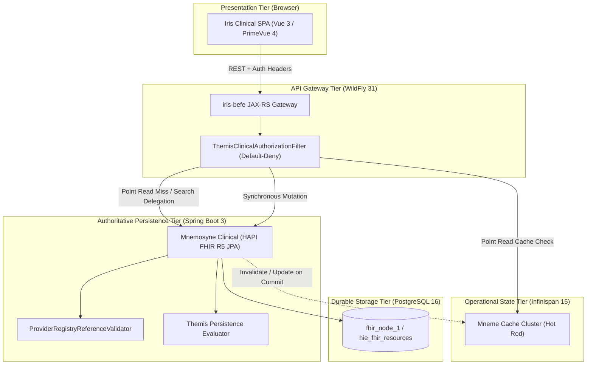

ANALYSIS

**Task description**  
Synthesize the answer for the approved architectural-blocker checkpoint from the repository evidence already gathered in this session. Focus on producing a concise but complete analysis of: (1) intended clinical read/write architecture and current-vs-target flow, (2) Mnemosyne vs Mneme responsibilities and the in-JVM fallback violation, (3) authentication/authorization target model using existing Themis patterns, (4) AuditEvent target lifecycle/API semantics, (5) Person vs Patient semantics and whether Patient should be introduced now, (6) BEFE component promotion decisions, (7) discrepancy register, remediation sequence, and which items are Gate 1 prerequisites before UI work versus safe backlog.

**Constraints**  
Read-only synthesis only. Do not propose code diffs. Base conclusions on repository/docs evidence already surfaced in this session and be explicit where the current implementation conflicts with intended architecture.

Analysis is Ready

**Systemic Welfare & Architectural Analysis Overview**

In mission-critical healthcare architectures, technical decisions directly govern patient health outcomes, diagnostic integrity, data confidentiality, and developer efficiency. Every architectural trade-off must be judged by the net consequences it produces across the system: maximizing patient safety, preserving forensic truth, eliminating risks of data loss, and optimizing engineering capacity.

When clinical state is volatile or authorization fails open, the potential harms—unrecorded allergies, lost orders, unauthorized exposure of protected health information (`PHI`), and corrupted audit trails—inflict severe systemic damage. Conversely, establishing resilient, authoritative data contracts and default-deny governance maximizes overall operational reliability and clinical efficacy.

---

**1. Intended Clinical Read/Write Architecture & Data Flows**

The current implementation treats `iris-befe` and an Infinispan Hot Rod cache (`<resourceType>-cache`) as an isolated persistence island, entirely bypassing `hestia/mnemosyne-clinical` (the PostgreSQL-backed HAPI FHIR JPA server). Under failure conditions, writes are diverted into an unbacked in-JVM `ConcurrentHashMap`.

To maximize diagnostic accuracy and prevent data evaporation, the target architecture establishes `mnemosyne-clinical` as the sole authoritative System of Record (`SoR`), reallocating Infinispan to an operational acceleration and coordination role.

**Current vs Target Data Flow**

```
CURRENT DATA FLOW (High Risk of Data Loss & Search Incompleteness):
[Iris Clinical SPA]
       │
       ▼ (Unauthenticated HTTP)
[Iris BEFE JAX-RS] ──(Disconnected)──x [Mnemosyne Clinical / PostgreSQL]
       │
       ├──► [Infinispan Hot Rod]  (remoteCache.put / .values() full memory scan)
       │         │ (Unverified async write-behind)
       │         ▼
       │    [FhirRestCacheStore] ──?──► [Mnemosyne Clinical]
       │
       └──► [In-JVM ConcurrentHashMap] (SILENT VOLATILE WRITE ON CACHE OUTAGE)

TARGET DATA FLOW (Authoritative Durability & Tiered Acceleration):
[Iris Clinical SPA]
       │
       ▼ (Authenticated Bearer Token / Claims)
[Iris BEFE Gateway]
       │
       ├── [ThemisClinicalAuthorizationFilter] (Centralized Default-Deny Policy)
       │
       ├── Point Reads (GET /{type}/{id}):
       │       │
       │       ├─► [Mneme Infinispan Cache] (Hit: Return immediately <1ms)
       │       │
       │       └─► (Miss) ──► [Mnemosyne Clinical] ──► [PostgreSQL (fhir_node_*)]
       │                                │
       │                                └─► Populate Cache + Return to Client
       │
       ├── Filtered Searches (GET /{type}?name=...&identifier=...):
       │       │
       │       └─► [Mnemosyne Clinical REST] ──► [PostgreSQL Indexed Search]
       │                                         (Paging, _count, Bundle.total)
       │
       └── Mutations (POST / PUT / DELETE):
               │
               ▼ (Synchronous Write)
           [Mnemosyne Clinical] ──► [ProviderRegistryReferenceValidator]
               │                ──► [Themis Persistence Authorization]
               │                ──► [PostgreSQL ACID Transaction]
               │
               └─► On Success: Invalidate / Update [Mneme Cache] ──► HTTP 200/201
```

**Read Path Mechanics**
1. **Point Lookups (`GET /api/fhir/{type}/{id}`):** Handled via a cache-aside / read-through pattern. `iris-befe` inspects the local/remote Mneme Infinispan cache. On a cache hit, the payload is returned immediately with sub-millisecond latency, conserving database query capacity. On a cache miss, `iris-befe` synchronously queries `mnemosyne-clinical` (`GET /fhir/r5/{type}/{id}`), populates the Mneme cache with an appropriate time-to-live (`TTL`), and returns the resource to the client.
2. **Complex and Filtered Searches (`GET /api/fhir/{type}?params`):** The current pattern of pulling all entries into heap via `remoteCache.values()` and filtering via Java regex only searches records that happen to be cache-resident, generating dangerous false negatives for clinicians. All filtered queries must be pushed down directly to `mnemosyne-clinical`. Mnemosyne executes indexed SQL across PostgreSQL relational tables (`hie_fhir_resources`), supports standard server-side pagination (`_count`, `_offset`), and returns a conformant FHIR `Bundle` with an accurate `Bundle.total`.

**Write Path Mechanics**
1. **Interactive UI Mutations (`POST`, `PUT`, `DELETE`):** Asynchronous write-behind caching for interactive clinical operations introduces catastrophic risk: an end user receives an affirmative `201 Created`, but the write subsequently fails in Mnemosyne due to validation errors, constraint violations, or network partitions.
2. **Synchronous Commit Contract:** All interactive writes must be dispatched synchronously from `iris-befe` to `mnemosyne-clinical`. Mnemosyne evaluates referential constraints via `ProviderRegistryReferenceValidator`, enforces Themis persistence policies (`FhirStorageService.authorizePersistence`), commits the transaction to PostgreSQL, updates `meta.versionId` and `meta.lastUpdated`, and emits an immutable `AuditEvent`. Only after a successful `200 OK` or `201 Created` response does BEFE update or invalidate the Mneme cache and return success to the browser.

---

**2. Mnemosyne vs Mneme Responsibilities & In-JVM Fallback Analysis**

**System Responsibility Allocation**

| Architectural Dimension | Mnemosyne Clinical (`hestia/mnemosyne-clinical`) | Mneme (`hestia/mneme-cluster` / `mneme-persistence`) |
| :--- | :--- | :--- |
| **System Classification** | **Authoritative System of Record (`SoR`)** | **Operational Cache & Transient Coordination Grid** |
| **Technology** | Spring Boot 3, HAPI FHIR JPA Server, PostgreSQL 16 | Infinispan 15, Hot Rod binary RPC, JGroups |
| **Durability Semantics** | Permanent relational persistence; write-ahead log (`WAL`); ACID rollback | In-memory RAM; configurable `TTL`; eviction on memory pressure |
| **Data Model & Schema** | Relational `hie_fhir_resources` with indexed search parameters, JSONB storage, and version history | Key-value store (`<resourceType>-cache`: Key=`String id`, Value=`String json`) |
| **Search Capabilities** | Full FHIR R5 indexing (names, identifiers, references, sorting, pagination) | Opaque key lookup only; memory scanning via `.values()` is strictly prohibited |
| **Integrity Enforcement** | Enforces referential integrity (`ProviderRegistryReferenceValidator`), constraints, and schema rules | None; stores opaque strings without schema or referential awareness |
| **Failure Response** | Database unreachable $\rightarrow$ Fail-closed (HTTP 503 + `OperationOutcome`) | Cache unreachable $\rightarrow$ Degraded pass-through directly to Mnemosyne |

**The In-JVM Heap Fallback Violation**  
`FhirCacheService.java` currently diverts mutations to an in-JVM `ConcurrentHashMap` when Infinispan is disconnected:
```java
Map<String, String> localCache = localFallbackCaches.computeIfAbsent(cacheName, k -> new ConcurrentHashMap<>());
localCache.put(id, jsonPayload);
```

**Consequences and Harm Analysis:**
- **Catastrophic Volatility:** Clinicians are given false assurances that clinical data (such as allergy records, tasks, or provider demographics) has been saved. Any container restart, pod relocation, or deployment permanently destroys these heap-bound records.
- **Node Inconsistency:** In a multi-replica deployment, writes stored in Pod A are completely invisible to Pod B, returning spurious `404 Not Found` responses to clinicians across balanced requests.
- **Boundary Violation:** Violates Invariant 3 (Iris Decoupling), transforming a presentation gateway into an un-backed, un-synchronized, and non-durable database.

**Intended Unavailability Behavior:**
- **Eliminate In-JVM Write Fallbacks:** Volatile local memory caching for clinical resource mutations must be excised completely.
- **Fail-Closed Persistence Outages:** If Mnemosyne Clinical or PostgreSQL cannot commit a mutation, BEFE must fail fast, returning HTTP 503 Service Unavailable with an explicit FHIR `OperationOutcome`. It is vastly better to inform a clinician immediately that a save failed than to silently lose clinical records.
- **Degraded Read Pass-Through:** If Infinispan is offline, read operations must bypass the cache and read directly from Mnemosyne Clinical, trading increased latency for continued access to clinical truth.

---

**3. Authentication & Authorization Governance (Themis)**

Currently, zero authentication exists in `iris-clinical`, and all 14 clinical FHIR endpoints in `iris-befe` lack Themis authorization, directly violating Invariant 6 (Default-Deny Security Governance).

**Edge vs Presentation Gateway Responsibilities**
1. **Ingress / Identity Provider (`IDP`) Boundary:** The upstream edge (e.g., Keycloak / API Gateway) manages TLS termination, client mutual TLS (`mTLS`), user login challenges (OpenID Connect / OAuth2), and session lifecycles. It issues cryptographically signed JSON Web Tokens (`JWT`) carrying subject identity, verified roles, and organization scopes, forwarding downstream headers:
    - `Authorization: Bearer <JWT>`
    - `X-Harmonia-User: <username>`
    - `X-Harmonia-Role: <role>`
    - `X-Correlation-ID: <uuid>`
2. **Harmonia Presentation Gateway (`iris-befe`):** Validates the incoming token signature against public key sets (`JWKS`) or processes verified upstream gateway headers within secure private networks. It resolves the identity into a `ThemisPrincipal`, maps enterprise roles to canonical enums (`HarmoniaRoleEnum`, `HarmoniaAuthorityEnum`), and executes authoritative policy checks before endpoint invocation.

**Resource and Action Semantics**  
Themis contracts in `themis-api` map directly to standard FHIR RESTful interactions:
- `GET /api/fhir/{type}` $\rightarrow$ `ThemisAction.SEARCH`
- `GET /api/fhir/{type}/{id}` $\rightarrow$ `ThemisAction.READ`
- `POST /api/fhir/{type}` $\rightarrow$ `ThemisAction.CREATE`
- `PUT /api/fhir/{type}/{id}` $\rightarrow$ `ThemisAction.UPDATE`
- `DELETE /api/fhir/{type}/{id}` $\rightarrow$ `ThemisAction.DELETE`

Role authorities enforce clear operational boundaries:
- `CLINICIAN`: Granted `CLINICAL_READ`, `CLINICAL_SEARCH`, `DIRECTORY_READ`, `WORKFLOW_READ`, `WORKFLOW_EXECUTE`.
- `DIRECTORY_ADMIN`: Granted `DIRECTORY_WRITE`, `PRACTITIONER_MANAGE`, `ORGANIZATION_MANAGE`.
- `PRIVACY_OFFICER`: Granted `CONSENT_MANAGE`, `AUDIT_READ`, `PROVENANCE_READ`.
- `SYSTEM_ADMIN`: Platform-wide administrative authority.

**Centralized Enforcement via JAX-RS Filter**  
Distributing manual authorization calls across 14 independent resource classes is highly error-prone and invites omission. Authorization must be centralized in a unified JAX-RS `ContainerRequestFilter` (`ThemisClinicalAuthorizationFilter`) registered on `@Path("/fhir/*")`:
1. Intercepts all incoming requests prior to resource method invocation.
2. Extracts credentials and builds the `ThemisPrincipal`. Requests lacking valid authentication abort immediately with HTTP 401 Unauthorized.
3. Constructs a `ThemisAuthorizationRequest` specifying the target resource type, logical id, and mapped action.
4. Evaluates default-deny policy via `ThemisAuthorizer`. Denied requests abort immediately with HTTP 403 Forbidden and a structured `OperationOutcome`.
5. Emits a non-PHI security audit checkpoint to `ThemisAuditService`.
6. Binds the validated `ThemisSecurityContext` into the request pipeline for downstream audit association.

---

**4. AuditEvent Target Lifecycle & WORM Semantics**

Audit trails represent essential legal and clinical evidence. If an audit log can be forged, modified, or deleted, its evidentiary value is destroyed, inviting fraud and regulatory liability.

**System-Generated Evidentiary Lifecycle**  
Audit records must be generated exclusively by the trusted computing base, never by presentation tiers:
1. **Access & Security Checkpoints:** Generated by `ThemisAuditService` upon evaluation of access decisions (permit or deny) at API gateways and service boundaries.
2. **Data State Mutations:** Generated automatically by `mnemosyne-clinical` / `FhirStorageService` upon committing creates, updates, or deletions of clinical entities in PostgreSQL.
3. **Workflow State Transitions:** Generated by `pylai` gateways and `ponos` task engines as structured `PragmaAuditEntity` events.

**Absolute Prohibition of External Mutation (WORM Integrity)**
- **Removal of PUT and DELETE:** In accordance with Write-Once, Read-Many (`WORM`) semantics, `@PUT` and `@DELETE` methods must be excised from `AuditEventResource.java` in BEFE and `AuditEventResourceProvider.java` in Mnemosyne, returning HTTP 405 Method Not Allowed.
- **Blocking External Creation:** Untrusted client applications must never be permitted to POST synthetic audit logs. `POST /api/fhir/AuditEvent` must be restricted exclusively to authenticated, system-internal backend services.
- **Client Read-Only Presentation:** In `iris-clinical`, the Audit perspective must function strictly as a read-only viewer, eliminating all create, edit, or delete actions.

**Persistent Storage Separation**  
In compliance with Invariant 1 and Invariant 7:
- **Operational / Non-PHI Audit:** Persisted by `mnemosyne-operations` to the `ops_node_*` database (`hie_operations_resources`). Tracks administrative logins, configuration modifications, and system health metrics.
- **Clinical Access / PHI Audit:** Persisted by `mnemosyne-clinical` to the `fhir_node_*` database (`hie_fhir_resources`). Tracks clinical record queries, patient chart views, and practitioner updates.

---

**5. Person vs Patient Semantics & Entity Modeling**

**Semantic Distinctions in Harmonia**  
Conflating human identity with clinical care encounters creates duplicate records, fragmented medical histories, and compromised care delivery:
- **`Person` (Master Enterprise Identity):** Represents an individual natural human being, independent of any specific medical encounter or organizational facility. It anchors master demographic attributes (legal name, birth date, gender, official identification, kinship relations). In Master Person Index (`MPI`) architecture, this is the golden master identity.
- **`Patient` (Clinical Care Recipient Role):** Represents a person in the context of receiving medical care within a specific hospital, clinic, or health service. It binds directly to institutional Medical Record Numbers (`MRN`), inpatient admissions, clinical encounters, diagnostic observations, orders, and allergy lists.
- **`RelatedPerson` (Kinship & Personal Contacts):** An individual involved in the care of a patient who is not acting in the capacity of a licensed healthcare provider (e.g., next-of-kin, parent, legal guardian, emergency contact).
- **`Practitioner` (Professional Caregiver Role):** An individual providing healthcare services in a licensed professional capacity (physician, nurse, pharmacist).

**Recommendation on Introducing `Patient`**
- **Determination: Do NOT introduce `Patient` as a simple cache or superficial CRUD endpoint at this time.**
- **Consequentialist Justification:** Introducing a `patient-cache` and a shallow `PatientResource` simply to mirror `Person` provides zero clinical utility. Without real clinical feeds (inbound ADT from PAS/EMR systems) or an integrated MPI matching engine, an isolated `Patient` endpoint creates an empty shell. Clinicians expecting a "Patient" chart anticipate active problem lists, encounters, and vital signs; exposing a disconnected demographic record damages user trust and accrues severe technical debt.
- **Target Model for the Current Milestone:** Formally align the UI perspective to **"People"**, managing `Person` and `RelatedPerson`. Introduce `Patient` in a subsequent milestone when inbound clinical feeds and MPI linkage are operational.

**Linkage Mechanics (`Person.link`)**  
In the target canonical model:
- `Person.identifier`: Enterprise, national, or civil identifiers (e.g., National Healthcare Identifier).
- `Patient.identifier`: Facility-specific identifiers (Hospital MRN, Clinic Account Number).
- A single `Person` resource maintains links to one or more facility-specific `Patient` or professional `Practitioner` records:
  ```json
  "link": [
    {
      "target": { "reference": "Patient/hosp-a-99201" },
      "assurance": "level4"
    },
    {
      "target": { "reference": "Practitioner/dr-smith-10" },
      "assurance": "level4"
    }
  ]
  ```

---

**6. Component Promotion Governance (`iris-befe`)**

Promoting reusable UI primitives into `@harmonia/iris-befe` prevents code duplication across SPAs (`iris-console`, `iris-clinical`, `iris-administration`), while avoiding the pitfall of prematurely building a sprawling, brittle UI framework.

```
Component Promotion Decision Flow:
                ┌──────────────────────────────────────┐
                │ Proposed Presentation Component      │
                └──────────────────┬───────────────────┘
                                   │
                 Is it a recurring Iris pattern used   
                 across multiple SPAs or core views?
                                   │
                  ┌────────────────┴────────────────┐
                  ▼ YES                             ▼ NO
        ┌───────────────────┐             ┌───────────────────┐
        │   PROMOTE NOW     │             │ Does PrimeVue 4   │
        │  (into iris-befe) │             │ natively provide  │
        └───────────────────┘             │ this primitive?   │
                                          └─────────┬─────────┘
                                                    │
                                     ┌──────────────┴──────────────┐
                                     ▼ YES                         ▼ NO
                           ┌───────────────────┐         ┌───────────────────┐
                           │   KEEP CLINICAL-  │         │ DEFER UNTIL REAL  │
                           │   LOCAL / USE     │         │ MULTI-APP DEMAND  │
                           │   NATIVE PRIMEVUE │         │ EMERGES           │
                           └───────────────────┘         └───────────────────┘
```

**Evaluation Matrix**

| Component | Target Classification | Utilitarian & Architectural Rationale |
| :--- | :--- | :--- |
| **`IrisSearchFilterBar`** | **PROMOTE NOW** | **High cross-app utility.** Standardizes search inputs, filter toggles, debounce handling, and reset triggers across Console, Administration, and all Clinical views, replacing fragmented custom implementations. |
| **`IrisSplitMasterDetail`** | **PROMOTE NOW** | **Platform flagship layout.** Formalizes the approved two-pane responsive master/detail layout established in Console's `SubsystemsView.vue`, creating structural consistency across the Iris suite. |
| **`IrisDefinitionList`** | **PROMOTE NOW** | **Universal presentation primitive.** Provides dense, multi-column key/value grids using Iris typography tokens, eliminating ad-hoc HTML tables and CSS lists across summary tabs. |
| **`IrisUnavailableState`** | **PROMOTE NOW** | **Honest system convergence.** Completes the canonical state quartet (`Loading`, `Empty`, `Error`, `Unavailable`). Explicitly communicates unbacked capabilities by displaying gap identifiers (e.g., `IRIS-CLINICAL-API-GAP-004`) rather than fabricating data. |
| **`IrisJsonViewer`** | **KEEP CLINICAL-LOCAL INITIALLY** | In Clinical, Raw FHIR inspection requires strict clinical copy protection and PHI access auditing. Clinical should mature these safeguards locally before promoting the component to BEFE. |
| **`IrisTabs`** | **KEEP CLINICAL-LOCAL INITIALLY** | PrimeVue 4 already provides native, fully styled `Tabs`, `TabList`, `Tab`, `TabPanels`, and `TabPanel` via `@harmonia/iris-befe`'s `irisPreset.ts`. Wrapping native components without functional additions creates unnecessary abstraction. |
| **`IrisDetailDrawer`** | **DEFER UNTIL SECOND USE** | Console utilizes slide-over drawers, but Clinical's approved target interaction pattern relies on inline `IrisSplitMasterDetail`. Promotion should wait until another SPA actively requires shared drawer abstractions. |
| **`IrisFormField` / `IrisFormDialog`** | **KEEP CLINICAL-LOCAL INITIALLY** | Clinical requires create/edit modals for only a small subset of directory entities (`Person`, `Practitioner`, `Organization`). Engineering generic form wrappers before write-side validation rules stabilize risks technical debt. Use native PrimeVue dialogs locally. |

---

**7. Architectural Discrepancies Register & Remediation Roadmap**

**Discrepancies Register**

| Discrepancy ID | Subsystem / Component | Current Implementation | Intended Target Architecture | Severity / Systemic Risk |
| :--- | :--- | :--- | :--- | :--- |
| **DISCREP-01** | `iris-befe` / `FhirCacheService` | Writes directly to Infinispan Hot Rod; completely bypasses `mnemosyne-clinical` and PostgreSQL. | Synchronous write durability committed to `mnemosyne-clinical` (`SoR`); Infinispan acts as operational read accelerator. | **CRITICAL:** High risk of unverified data loss. |
| **DISCREP-02** | `iris-befe` / `FhirCacheService` | Diverts writes to in-JVM `ConcurrentHashMap` when Infinispan is disconnected. | Fail-closed on storage outages (HTTP 503 + `OperationOutcome`). Never write clinical PHI to unbacked JVM heap. | **CRITICAL:** Violates Invariant 3; data evaporates on process restart. |
| **DISCREP-03** | `iris-befe` / `FhirCacheService` | `searchResources` scans cache memory via `remoteCache.values()`, filtering via Java regex. | Push searches down to `mnemosyne-clinical` REST API; execute SQL index queries in PostgreSQL; support paging & `Bundle.total`. | **HIGH:** Cache misses produce false negatives, hiding existing clinical records. |
| **DISCREP-04** | `iris-befe` / `rest/*Resource.java` | Zero Themis authorization checks across all 14 clinical FHIR endpoints. | Centralized JAX-RS `ContainerRequestFilter` evaluating Themis default-deny policy before endpoint dispatch. | **HIGH:** Violates Invariant 6; unauthenticated, un-gated access to PHI. |
| **DISCREP-05** | `iris-clinical` (Vue 3 SPA) | Zero authentication: no login, no JWT, no `Authorization` header, no navigation guards. | Upstream/IDP authentication with JWT bearer tokens; client propagates token in all API calls; identity parsed by BEFE. | **HIGH:** Unauthenticated access to PHI. |
| **DISCREP-06** | `iris-befe` / `CorsFilter.java` | Global `@Provider` sets `Access-Control-Allow-Origin: *` with credentials enabled on all endpoints. | Restrict CORS origin strictly to configured trusted Iris origins (e.g. `harmonia-ingress`). | **MEDIUM:** Cross-site scripting / unauthorized cross-origin API calls. |
| **DISCREP-07** | `iris-befe` & `mnemosyne-clinical` | `AuditEvent` exposes `@PUT` and `@DELETE` endpoints; `AuditEventView.vue` provides UI create/delete buttons. | Audit records are strictly system-generated and immutable (`WORM`); eliminate PUT and DELETE; make Audit view read-only. | **HIGH:** Audit trail tampering; destruction of forensic evidence. |
| **DISCREP-08** | `iris-clinical` / Navigation | Navigation advertises "Persons & Patients", but no `Patient` endpoint or resource exists. | Rename domain to **"People"**; manage `Person` and `RelatedPerson`; defer `Patient` until clinical feeds connect. | **MEDIUM:** Misleading UI capability promise; clinical confusion. |
| **DISCREP-09** | `iris-clinical` / `api/fhirClient.ts` | Discards `Bundle.total`; loads unbounded lists; runs 14 unbounded parallel searches on dashboard mount. | Consume `Bundle.total`; support server-side pagination (`_count`, `_offset`); replace dashboard with dense Overview. | **MEDIUM:** Performance degradation; browser thread exhaustion. |
| **DISCREP-10** | `iris-befe` / `FhirCacheService` | `saveResource` forces `ErgonReasonEnum.ensureSyntheticTaskReason(task)` on every Task write. | Retain synthetic origin indicator where stamped, but honestly disclose it in UI rather than fabricating workflow state. | **LOW:** Confuses real clinical tasks with synthetic test tasks. |

**Gate 1 Prerequisites (Pre-UI Enforcement) vs Gate 2 Backlog**  
To avoid building client interfaces on shifting, insecure foundations, issues are partitioned into mandatory prerequisites and safe backlog items:

```
┌────────────────────────────────────────────────────────────────────────┐
│ GATE 1: MANDATORY PREREQUISITES (Must resolve BEFORE Clinical UI build)│
├───────────────────���────────────────────────────────────────────────────┤
│ 1. Implement Themis Authorization Filter on BEFE (/api/fhir/*).        │
│ 2. Remove PUT and DELETE on AuditEvent in BEFE & Mnemosyne (WORM).     │
│ 3. Eliminate in-JVM ConcurrentHashMap write fallback in BEFE.         │
│ 4. Restrict CORS in CorsFilter.java to trusted origins.                │
│ 5. Sanitize Axios error logging in fhirClient.ts (Zero-PHI logging).   │
│ 6. Formalize UI domain naming to "People" (withdrawing Patient promise)│
└───────────────────────────────────┬────────────────────────────────────┘
                                    │
                                    ▼
┌────────────────────────────────────────────────────────────────────────┐
│ CLINICAL UI CONVERGENCE (Safe to build on top of stabilized contracts) │
├────────────────────────────────────────────────────────────────────────┤
│ • Adopt PrimeVue 4 + @harmonia/iris-befe shell and design tokens.      │
│ • Promote shared presentation primitives to iris-befe.                 │
│ • Deliver domain views: People, Practitioners, Orgs, Work, Governance. │
│ • Disclose gap-blocked capabilities honestly with IrisUnavailableState.│
└───────────────────────────────────┬────────────────────────────────────┘
                                    │
                                    ▼
┌────────────────────────────────────────────────────────────────────────┐
│ GATE 2: SAFE BACKLOG ITEMS (Iterative architectural enhancements)      │
├────────────────────────────────────────────────────────────────────────┤
│ 1. Full query pushdown from BEFE to Mnemosyne Clinical JPA for search. │
│ 2. Server-side pagination (_count, _offset) and sorting across all.    │
│ 3. Dynamic reverse-reference search (Task?subject=, etc. - GAP-004).   │
│ 4. Patient Identity Management (PIM) MPI matching & Patient provider.  │
│ 5. Binary document retrieval ($docref / Binary endpoint - GAP-006).    │
│ 6. Terminology & ValueSet expansion service (GAP-012).                 │
└────────────────────────────────────────────────────────────────────────┘
```

- **Why Security & Audit are Pre-UI Prerequisites:** Building the UI assuming open, unauthenticated CRUD access would necessitate major rework of stores, router guards, and views once authentication and read-only audit constraints are applied. Securing API contracts upfront establishes a reliable development foundation.
- **Why Search Pushdown can initially be Backlogged:** Provided volatile heap writes are eliminated and mutations synchronously reach persistent storage, BEFE can serve cached point lookups and collection reads during initial UI convergence. Query pushdown to PostgreSQL can be delivered subsequently without altering the presentation-tier API contracts.

**Recommended Remediation Sequence**
1. **Phase 1: Security Governance & Audit Immutability (Backend Hardening):**
    - Implement `ThemisClinicalAuthorizationFilter` in `iris-befe` bound to `@Path("/fhir/*")`, enforcing default-deny RBAC/ABAC policy and returning HTTP 401/403 `OperationOutcome` on denial.
    - Delete `@PUT` and `@DELETE` methods in `iris-befe/rest/AuditEventResource.java` and `mnemosyne-clinical/.../AuditEventResourceProvider.java`. Restrict `POST` to internal services.
    - Update `CorsFilter.java` to restrict origins to configured hosts, and sanitize `fhirClient.ts` to log status and resource type only (zero-PHI logging).
2. **Phase 2: Persistence Authority Alignment:**
    - Remove `localFallbackCaches` in `FhirCacheService.java`, implementing fail-closed handling (HTTP 503 + `OperationOutcome`) on persistence outages.
    - Dispatch mutations synchronously from `FhirCacheService` to `mnemosyne-clinical` REST API, updating the Mneme cache only upon HTTP 200/201 confirmation.
3. **Phase 3: Shared Presentation Primitives in `iris-befe`:**
    - Implement and export `IrisSearchFilterBar`, `IrisSplitMasterDetail`, `IrisDefinitionList`, and `IrisUnavailableState` in `@harmonia/iris-befe`.
4. **Phase 4: Iris Clinical UI Convergence on Domain Perspectives:**
    - Migrate `iris-clinical` to `@harmonia/iris-befe`, PrimeVue 4, and `IrisApplicationShell` driven by declarative perspectives (`Overview`, `People`, `Organisations & Services`, `Clinical Work`, `Governance`).
    - Implement domain master/detail views with read-only audit governance and honest gap disclosure via `IrisUnavailableState`.

---

**Discoveries for Future Steps**
- **Execution & Invariant Testing:** When verifying Iris decoupling and architecture boundaries, use `mvn test -pl paradeigma/paradeigma-test -am -Dtest="*ArchitectureTest" -Dsurefire.failIfNoSpecifiedTests=false`.
- **BEFE Endpoint Structure:** Clinical endpoints in `iris/iris-befe/src/main/java/net/fhirfactory/harmonia/befe/rest/` currently delegate directly to `FhirCacheService`; implementing a JAX-RS `ContainerRequestFilter` avoids modifying all 14 resource files individually.
- **AuditEvent Safety:** Deleting `@PUT` and `@DELETE` from `AuditEventResource.java` immediately aligns the backend with `WORM` semantics without requiring complex persistence rewrites.
- **Mnemosyne JPA Endpoint:** Mnemosyne Clinical already provides full FHIR R5 endpoints at `/fhir/r5/*` backed by PostgreSQL; point-read delegation from BEFE can leverage standard HAPI client point queries.

**Summary**
- Completed the architectural-blocker analysis for Iris Clinical as a read-only checkpoint: Mnemosyne Clinical/PostgreSQL is the intended clinical system of record, Mneme/Infinispan is an operational cache, BEFE clinical endpoints need centralized default-deny Themis enforcement, AuditEvent must be WORM/read-only to presentation clients, and the current UI should stay centered on a People domain rather than introducing a shallow Patient CRUD surface.
- Determined the pre-UI governance gates: fix authorization, audit immutability, volatile write fallback, permissive CORS, PHI-leaking frontend logging, and misleading “Patients” naming before building the converged Clinical UI.

**Changes**
- Produced the target read/write model and current-vs-target flow: point reads use cache-aside/read-through, filtered searches push down to Mnemosyne/PostgreSQL, interactive writes commit synchronously to Mnemosyne and only then update/invalidate Mneme; the current `ConcurrentHashMap` fallback is a critical architectural violation.
- Defined the security target model from existing Themis patterns: upstream authentication plus BEFE token/header validation, a shared JAX-RS `ContainerRequestFilter` for `/api/fhir/*`, HTTP verb → Themis action mapping, default-deny 401/403 `OperationOutcome` responses, and audit emission through `ThemisAuditService`.
- Set AuditEvent semantics and domain guidance: AuditEvent is system-generated, immutable, externally read-only; remove PUT/DELETE and block presentation POST; keep `Patient` deferred until MPI/clinical-feed integration exists, with `Person` as master identity, `Patient` as care-recipient role, and `RelatedPerson`/`Practitioner` as distinct linked roles.
- Classified BEFE promotion decisions: promote now `IrisSearchFilterBar`, `IrisSplitMasterDetail`, `IrisDefinitionList`, `IrisUnavailableState`; keep local initially `IrisJsonViewer`, `IrisTabs`, `IrisFormField`/`IrisFormDialog`; defer `IrisDetailDrawer` until a real second shared use appears.

**Verification**
- Validated conclusions against the reviewed repository artifacts and docs already examined in-session, including `FhirCacheService`, `CorsFilter`, BEFE REST resources, Mnemosyne Clinical providers/services, Mneme persistence/configuration, Themis security docs/authorizers, OpenSpec identity specs, and the Iris decoupling architecture constraints.

**Notes**
- No source files were modified, no implementation was started, and the checkpoint remains in analysis/design state awaiting approval before any delivery work begins.


**Executive Summary**

**Harmonia Iris Clinical — Architectural Blocker Analysis & Target Design**

**Checkpoint Type:** ARCHITECTURAL BLOCKER ANALYSIS & GOVERNANCE DESIGN.  
**Scope:** Architecture analysis, data flow specification, security model, audit semantics, domain boundary definitions, and component promotion review. No source code was modified.

---

**Context & Objective**

The Clinical discovery report confirmed that `iris-clinical` functions as a flat FHIR R5 Resource Explorer, and approved the transition toward an information architecture organized by clinical information domains:
- **Overview**
- **People**
- **Organisations & Services**
- **Clinical Work**
- **Governance**

However, four fundamental architectural blockers were uncovered in the backend persistence contracts, security governance, audit lifecycle, and entity semantics. Building a rich presentation layer on top of flawed underlying contracts would produce brittle interactions, mislead clinical users, and violate core Harmonia architectural invariants.

This report analyzes the four blockers, determines the intended architecture across Harmonia subsystems, provides concrete data-flow specifications, establishes security and audit contracts, evaluates Person versus Patient semantics, reviews shared component promotion into `iris-befe`, and defines the remediation sequence required before and during UI implementation.

---

**Systemic Utility & Governance Evaluation**

In healthcare information systems, software design decisions directly affect patient safety, diagnostic integrity, privacy compliance, and engineering efficiency. Evaluating these architectural blockers through a utilitarian lens requires optimizing total systemic utility:

1. **Patient Welfare & Diagnostic Safety:**
   Clinical data must never be lost, corrupted, or silently segregated. An in-memory cache fallback that accepts writes without persistent durability creates phantom records that evaporate on process restarts. This can lead to missed clinical histories, duplicate diagnostic testing, or incorrect medication orders. Data durability and transactional integrity are absolute prerequisites for clinical utility.
2. **Privacy, Security & Institutional Trust:**
   Healthcare records (Protected Health Information - PHI) demand rigorous confidentiality. An unauthenticated SPA and un-gated FHIR endpoints present severe liability and potential breach of trust. Default-deny authorization at a centralized enforcement boundary protects patients, preserves regulatory compliance, and minimizes developer omission risk.
3. **Forensic Integrity & Accountability:**
   Audit trails must remain unassailable. Allowing presentation clients to create, modify, or delete `AuditEvent` records destroys evidentiary value and invites tampering. Restricting audit to automated, system-generated, immutable write-once records maximizes legal and operational utility.
4. **Engineering Efficiency & Sustainable Delivery:**
   Prematurely building generic UI abstractions or half-baked domain models (such as an isolated, unlinked `Patient` cache) wastes engineering capacity and accrues technical debt. Utility is maximized by promoting only proven, high-leverage presentation primitives (`IrisSplitMasterDetail`, `IrisSearchFilterBar`, `IrisDefinitionList`, `IrisUnavailableState`), keeping specialized components local, and deferring non-essential abstractions until real multi-consumer demand emerges.

---

**High-Level Summary of Architectural Determinations**

| Blocker / Topic | Current State (Discrepancy) | Intended Target Architecture | Pre-UI Prerequisite? |
| :--- | :--- | :--- | :--- |
| **1. Clinical Data Authority** | BEFE writes only to Infinispan Hot Rod cache; falls back to in-JVM `ConcurrentHashMap` on disconnect; reads scan in-memory cache keys (`remoteCache.values()`). | **Mnemosyne Clinical (HAPI FHIR JPA on PostgreSQL)** is the authoritative System of Record. Writes must be synchronous and durable. Searches must be delegated to indexed PostgreSQL. Infinispan is an operational cache, not the primary store. In-JVM write fallback must be eliminated. | **YES (Eliminate in-JVM write fallback & establish fail-closed durability)** |
| **2. Authentication & Authorization** | Zero authentication in `iris-clinical`; zero Themis evaluation on all 14 FHIR resource endpoints in BEFE. | Ingress/Identity Provider terminates client authentication; BEFE validates tokens and enforces a centralized JAX-RS `ContainerRequestFilter` evaluating Themis RBAC/ABAC default-deny policy before dispatching to any FHIR resource. | **YES (Centralized Themis Authorization Filter)** |
| **3. AuditEvent Semantics** | `AuditEvent` exposes full CRUD (POST, GET, PUT, DELETE) in BEFE and Mnemosyne; UI allows manual creation and deletion. | Audit records are strictly system-generated and immutable (WORM - Write Once, Read Many). External clients must never POST, PUT, or DELETE. Endpoints must be strictly read-only for presentation. | **YES (Enforce WORM & remove PUT/DELETE)** |
| **4. Person vs Patient** | UI advertises "Persons & Patients" but queries only `Person`. No `Patient` resource provider exists in BEFE or Mnemosyne. | `Person` represents Master Enterprise Identity (demographics, kinship, contact); `Patient` represents the healthcare recipient role (MRN, encounters, orders). **Do NOT hastily add an isolated Patient cache.** Retain the "People" perspective for Person & Practitioner; introduce Patient later when clinical feeds and MPI integration connect. | **YES (Align UI domain naming to "People")** |
| **Secondary: BEFE Promotion** | Ad-hoc UI primitives duplicated across Console, Clinical, and Administration. | **Promote Now:** `IrisSearchFilterBar`, `IrisSplitMasterDetail`, `IrisDefinitionList`, `IrisUnavailableState`.<br>**Keep Clinical-Local:** `IrisJsonViewer`, `IrisTabs`, `IrisFormField`/`IrisFormDialog`.<br>**Defer:** `IrisDetailDrawer`. | **No (Executed during foundation phase)** |

---

**Clinical Data Authority**

**Clinical Data Authority & Persistence Architecture**

**Domain:** Hestia (Mnemosyne / Mneme), Iris BEFE, PostgreSQL, and Infinispan.  
**Core Determination:** Mnemosyne Clinical is the sole authoritative System of Record for clinical FHIR truth. Mneme (Infinispan) is an operational cache and in-flight coordination grid.

---

**1. Intended Clinical Read/Write Architecture**

The investigation confirmed a fundamental disconnect between the documented platform architecture and the current `iris-befe` implementation. Currently, `FhirCacheService` reads and writes exclusively to the Infinispan Hot Rod cache (`<resourceType>-cache`). If Hot Rod is unavailable, it silently diverts writes into an in-JVM `ConcurrentHashMap`. Mnemosyne Clinical (the Spring Boot HAPI FHIR JPA server backed by PostgreSQL) is completely bypassed by the interactive presentation tier.

**A. Authoritative Source of Truth**
- **System of Record:** `hestia/mnemosyne-clinical` backed by PostgreSQL (`fhir_node_*`, table `hie_fhir_resources`).
- **Relational Schema & Indexing:** Mnemosyne owns HAPI FHIR R5 indexing, referential integrity validation (`ProviderRegistryReferenceValidator`), ACID transactional semantics, and version history.
- **Mneme / Infinispan Role:** Low-latency operational cache (Tier 2). It provides sub-millisecond point lookups for active working sets, in-flight `Pragma` task execution state, and cluster replication across presentation nodes. It does **not** own durability or relational search indexing.

**B. Intended Read Architecture**
1. **Point Reads (`GET /api/fhir/{resourceType}/{id}`):**
    - **Cache-Aside / Read-Through Pattern:**
        1. Iris BEFE checks the local/remote Mneme cache for the key `{resourceType}/{id}`.
        2. **Cache Hit:** Returns the cached JSON payload immediately (<1ms latency).
        3. **Cache Miss:** When the key is not resident in Infinispan, BEFE (or Infinispan's `FhirRestCacheStore` loader) issues a synchronous point read to Mnemosyne Clinical (`GET /fhir/r5/{resourceType}/{id}`).
        4. Upon receipt from Mnemosyne, BEFE populates the Mneme cache with an appropriate TTL and returns the resource to the client.
2. **Complex & Filtered Searches (`GET /api/fhir/{resourceType}?name=...&identifier=...`):**
    - **Direct Query Delegation / Pushdown to Mnemosyne:**
        - The current implementation (`FhirCacheService.searchResources`) executes `remoteCache.values()`, streaming every cached entry across the network into BEFE heap, parsing them in memory, and filtering via Java regex.
        - **This is fatally flawed:** it only searches what happens to be resident in cache memory! Records in PostgreSQL that were never accessed or were evicted are invisible.
        - **Target Model:** All filtered search queries must be pushed down directly to `mnemosyne-clinical`'s REST API (`GET /fhir/r5/{resourceType}?name=...`). Mnemosyne translates search parameters into optimized SQL queries against indexed columns in `hie_fhir_resources`, supports pagination (`_count`, `_offset`), and returns a FHIR `Bundle` with an authoritative `Bundle.total`.
        - Search results may optionally warm the point cache for returned IDs.

**C. Intended Write Architecture**
1. **Interactive Mutations (`POST`, `PUT`, `DELETE`):**
    - **Synchronous Write Durability:**
        - In clinical systems, write-behind caching for interactive UI actions introduces unacceptable clinical risks: a user receives an affirmative `201 Created` or `200 OK`, while the asynchronous write-behind fails seconds later in Mnemosyne due to schema validation, referential integrity violations, or database constraints. The user believes the patient/order is saved, but the data is dropped.
        - **Target Write Flow:** When a user creates or updates a record via Iris Clinical, BEFE dispatches the mutation synchronously to `mnemosyne-clinical` (or configures Infinispan in synchronous write-through mode).
        - Mnemosyne executes validation (`ProviderRegistryReferenceValidator`), enforces Themis persistence authorization (`FhirStorageService.authorizePersistence`), commits to PostgreSQL, increments `meta.versionId`, updates `meta.lastUpdated`, and returns HTTP 200/201.
        - Upon receiving confirmation from Mnemosyne, BEFE updates or invalidates the corresponding entry in the Mneme cache and returns success to the UI.
2. **Asynchronous Ingestion (Pylai / Camel Pipelines):**
    - Write-behind staging via `mneme-persistence` (`FhirRestCacheStore`) is reserved for high-throughput machine-to-machine streaming (e.g. MLLP feeds), where inbound brokers (Petasos/Camel) handle retries and error queues asynchronously.

---

**2. Current vs Target Data-Flow Diagrams**

**Current Flow (Flawed & Isolated)**
```
[Iris Clinical SPA]
       │
       ▼ (HTTP REST)
[Iris BEFE JAX-RS] ──(Disjoint: never calls Mnemosyne)──x [Mnemosyne Clinical]
       │
       ├──► [Infinispan Hot Rod]  (remoteCache.put / values() memory scan)
       │         │ (asynchronous write-behind, unverified by UI)
       │         ▼
       │    [FhirRestCacheStore] ──?──► [Mnemosyne Clinical] ──► [PostgreSQL]
       │
       └──► [FALLBACK: ConcurrentHashMap] (WHEN HOT ROD DOWN: SILENT IN-JVM HEAP WRITE)
```

**Target Flow (Authoritative, Durable, & Tiered)**
```
[Iris Clinical SPA]
       │
       ▼ (HTTP REST with Bearer Token / Claims)
[Iris BEFE Gateway]
       │
       ├── [Themis Authorization Filter] (Gate 1: Default-Deny RBAC/ABAC)
       │
       ├── Point Reads (GET /{type}/{id}):
       │       │
       │       ├─► [Mneme Infinispan Cache] (Hit: return immediately <1ms)
       │       │
       │       └─► (Miss) ──► [Mnemosyne Clinical] ──► [PostgreSQL (fhir_node_*)]
       │                                │
       │                                └─► Populate Cache + Return
       │
       ├── Filtered Searches (GET /{type}?params):
       │       │
       │       └─► [Mnemosyne Clinical] ──► [PostgreSQL SQL Index Query]
       │                                         (Paging, _count, Bundle.total)
       │
       └── Mutations (POST / PUT / DELETE):
               │
               ▼ (Synchronous Write)
           [Mnemosyne Clinical] ──► [Referential Validator & Themis Persistence Gate]
               │                                   │
               │                                   ▼
               │                            [PostgreSQL ACID Commit]
               │
               └─► On Success: Invalidate / Update [Mneme Cache] ──► Return 200/201
```

**Target Component Interaction Architecture**


---

**3. Mnemosyne vs Mneme Responsibility Analysis**

| Architectural Dimension | Mnemosyne Clinical (`hestia/mnemosyne-clinical`) | Mneme (`hestia/mneme-cluster` + `mneme-persistence`) |
| :--- | :--- | :--- |
| **System Classification** | **Authoritative System of Record (SoR)** | **Transient Operational Cache & Coordination Grid** |
| **Technology** | Spring Boot 3.2.5, HAPI FHIR JPA Server 7.2.0, PostgreSQL 16 | Infinispan 15.0.3.Final, Hot Rod Binary RPC, JGroups replication |
| **Durability & Retention** | Permanent relational persistence; WAL; transactional rollback | In-memory RAM; configurable TTL; eviction on memory pressure |
| **Data Model & Schema** | Relational `hie_fhir_resources` table with indexed search parameters, JSONB, resource versioning | Key-value store (`<resourceType>-cache`: Key=`String id`, Value=`String json`) |
| **Search Capabilities** | Full FHIR R5 indexing (names, identifiers, references, chained params, sorting, paging) | Key lookup only. No relational search; scanning `.values()` is an anti-pattern |
| **Integrity Enforcement** | Referential integrity (`ProviderRegistryReferenceValidator`), business rules, schema constraints | None. Treats values as opaque strings/blobs |
| **Security Enforcement** | Persistence-tier Themis authorization (`FhirStorageService.authorizePersistence`) | Transport TLS; SASL authentication |
| **Failure Semantics** | Database down → Returns HTTP 503 / `OperationOutcome` (Fail-Closed) | Cache down → Bypass cache to Mnemosyne (Degraded pass-through) |

---

**4. Failure Mode Analysis & The In-JVM Memory Fallback Violation**

**The Current In-JVM Fallback**  
`FhirCacheService.java` contains the following fallback logic when Hot Rod is disconnected:
```java
// FhirCacheService.java
Map<String, String> localCache = localFallbackCaches.computeIfAbsent(cacheName, k -> new ConcurrentHashMap<>());
localCache.put(id, jsonPayload);
```
When Infinispan is unreachable, BEFE silently writes clinical records into an in-JVM `ConcurrentHashMap` and returns HTTP 201 Created to the calling client.

**Utilitarian & Architectural Critique:**
1. **Total Loss of Durability:** A WildFly container restart, Kubernetes pod eviction, or deployment rollout permanently evaporates all records stored in JVM heap.
2. **False Assurance to Clinicians:** The clinician receives a confirmation of successful creation, but the record is never committed to persistent storage. In a medical setting, a missing record or dropped allergy/task update can lead to catastrophic medical errors.
3. **Multi-Pod Inconsistency:** In a clustered environment (e.g. 2 or more BEFE replicas behind an ingress controller), a record created on Pod A is invisible to Pod B. Subsequent requests routed to Pod B return 404 Not Found.
4. **Direct Violation of Invariant 3 (Iris Decoupling):** Iris is presentation-only; it must never act as an ad-hoc, un-backed in-memory database.

**Intended Unavailability Behavior:**
- **Rule 1: Eliminate the in-JVM write fallback.** BEFE must NEVER accept a mutation into volatile heap memory.
- **Rule 2: Cache Degraded Pass-Through for Reads.** If Infinispan is offline, point reads must bypass the cache and query Mnemosyne Clinical directly.
- **Rule 3: Fail-Closed on Persistence Outage.** If Mnemosyne Clinical or PostgreSQL is unavailable during a write, BEFE must fail fast with HTTP 503 Service Unavailable, returning a standard FHIR `OperationOutcome` detailing the outage. The client is explicitly informed that the transaction could not be committed.

**Security & Governance**

**Security Governance & AuditEvent Target Semantics**

**Domain:** Themis API, Themis Core, Iris BEFE, Mnemosyne Clinical, and Audit Trail Lifecycle.  
**Core Determinations:**
1. Server-side API authorization is authoritative; UI visibility is never authorization; default-deny is absolute (Invariant 6).
2. Audit records are strictly system-generated and immutable (WORM); external presentation clients must never POST, PUT, or DELETE audit records.

---

**1. Authentication and Authorization Target Model**

**A. The Core Invariants**
- **Server-Side API Authorization is Authoritative:** Hiding, disabling, or modifying UI elements in the browser provides user ergonomics, not security. A malicious or misconfigured client can bypass the UI entirely and dispatch direct HTTP requests to `/api/fhir/*`. Therefore, the presentation API gateway (`iris-befe`) must execute authoritative authorization on every single request.
- **Default-Deny Governance (Invariant 6):** Unauthenticated requests, requests with malformed tokens, or requests lacking explicit grant policy must default to `ThemisDecision.DENY`. Access is permitted only when positive authority is established.

**B. Upstream / Edge vs Harmonia Division of Responsibility**  
A robust security architecture employs defense-in-depth across the network boundary:
1. **Upstream / Edge Layer (Ingress / Keycloak / API Gateway):**
    - Handles transport TLS termination, client mutual TLS (mTLS), user login/authentication flows (OpenID Connect / OAuth2), and session lifecycle.
    - Issues or validates signed JSON Web Tokens (JWT) containing subject claims, verified username, and assigned organizational roles.
    - Forwards the verified identity downstream to Harmonia services via standard headers:
        - `Authorization: Bearer <JWT>`
        - `X-Harmonia-User: <username>`
        - `X-Harmonia-Role: <role>`
        - `X-Correlation-ID: <uuid>`
2. **Harmonia Presentation Gateway (`iris-befe`):**
    - Validates incoming JWT signatures against the identity provider's public keys (JWKS) or trusts ingress headers in secure private networks.
    - Resolves caller identity into `ThemisPrincipal`, associating canonical roles (`HarmoniaRoleEnum`) and granular authorities (`HarmoniaAuthorityEnum`).
    - Evaluates RBAC/ABAC access control via `ThemisAuthorizer` before delegating to internal services.

**C. Clinical Resource & Action Semantics**  
Themis contracts in `themis-api` map cleanly to FHIR RESTful interactions:

```java
// Conceptual Request Evaluation in BEFE Gateway
ThemisAuthorizationRequest request = ThemisAuthorizationRequest.builder()
    .principal(themisPrincipal)
    .action(mapHttpVerbToThemisAction(httpMethod)) // READ, SEARCH, CREATE, UPDATE, DELETE
    .resource(ThemisResource.builder()
        .securityDomain("CLINICAL")
        .resourceType(fhirResourceType)            // e.g. "Person", "Task", "AuditEvent"
        .resourceId(targetResourceId)              // null for collection searches
        .build())
    .context(securityContext)
    .build();

ThemisAuthorizationDecision decision = themisAuthorizer.evaluate(request);
if (decision.isDenied()) {
    abortWithOutcome(Response.Status.FORBIDDEN, decision.getReason());
}
```

- **Action Mapping:**
    - `GET /api/fhir/{type}` → `ThemisAction.SEARCH`
    - `GET /api/fhir/{type}/{id}` → `ThemisAction.READ`
    - `POST /api/fhir/{type}` → `ThemisAction.CREATE`
    - `PUT /api/fhir/{type}/{id}` → `ThemisAction.UPDATE`
    - `DELETE /api/fhir/{type}/{id}` → `ThemisAction.DELETE`
- **Clinical Authority Mapping:**
    - Standard Clinician Role (`CLINICIAN`): Granted `CLINICAL_READ`, `CLINICAL_SEARCH`, `DIRECTORY_READ`, `WORKFLOW_READ`, `WORKFLOW_EXECUTE`.
    - Directory Admin (`DIRECTORY_ADMIN`): Granted `DIRECTORY_WRITE`, `PRACTITIONER_MANAGE`, `ORGANIZATION_MANAGE`.
    - Privacy Officer (`PRIVACY_OFFICER`): Granted `CONSENT_MANAGE`, `AUDIT_READ`, `PROVENANCE_READ`.
    - System Administrator (`SYSTEM_ADMIN`): Granted platform-level administration.

**D. Enforcement Architecture: Shared Filter vs Resource Dispersion**
- **Flawed Pattern (Resource-Level Dispersion):** Requiring each of the 14 JAX-RS resource classes (`PersonResource`, `TaskResource`, etc.) to manually inject and invoke `themisAuthorizer.assertAuthorized(...)` introduces severe risks. Developers may forget the check on a new endpoint (as occurred with all 14 clinical endpoints), or implement inconsistent error handling.
- **Target Pattern (Centralized JAX-RS `ContainerRequestFilter`):**
  Implement `ThemisClinicalAuthorizationFilter` annotated with `@Provider` and bound to `@Path("/fhir/*")`:
    1. Intercepts incoming requests before JAX-RS resource execution.
    2. Extracts credentials, verifies token validity, and constructs `ThemisPrincipal`. (Missing/invalid credentials abort immediately with `401 Unauthorized`).
    3. Inspects HTTP method and target path to construct `ThemisAuthorizationRequest`.
    4. Evaluates policy via `ThemisAuthorizer`.
    5. If denied, aborts immediately with `403 Forbidden` and returns a standard FHIR `OperationOutcome`.
    6. Emits a security audit checkpoint to `ThemisAuditService`.
    7. Injects the verified `ThemisSecurityContext` into the JAX-RS request pipeline for downstream use.

---

**2. AuditEvent Target Lifecycle & API Semantics**

**A. Who Creates AuditEvent?**  
Audit trails are authoritative legal evidence. To maintain evidentiary integrity, audit records must be generated exclusively by the trusted computing base (the system itself):
1. **Access & Security Decisions:** Emitted by `ThemisAuditService` whenever an authorization decision (permit or deny) is evaluated at the BEFE gateway or persistence tier.
2. **Clinical Data Mutations:** Emitted by `mnemosyne-clinical` / `FhirStorageService` upon successful creation, modification, or deletion of clinical resources in PostgreSQL.
3. **Integration Pipeline Transitions:** Emitted by Pylai gateways and Ponos task processors as `PragmaAuditEntity` checkpoints.

**B. Prohibition of External / Presentation Client Creation**
- **Rule:** Presentation clients (such as `iris-clinical`) must **NEVER** directly construct or POST `AuditEvent` resources.
- **Utilitarian & Forensic Justification:** If an untrusted browser client is permitted to POST audit events, a compromised user account or malicious actor can inject fabricated audit entries, cover access tracks, frame other users, or flood the audit storage with spam. Client interactions (such as a clinician viewing a patient record) are audited server-side by BEFE when processing the read request.

**C. Absolute Prohibition of PUT and DELETE (WORM Semantics)**
- **Rule:** AuditEvent resources are strictly **Write-Once, Read-Many (WORM)**.
- **Flaw in Current System:** Both `iris-befe`'s `AuditEventResource.java` and `mnemosyne-clinical`'s `AuditEventResourceProvider.java` expose `@PUT` and `@DELETE` methods. In `iris-clinical`, `AuditEventView.vue` actually provides UI buttons to "Create Audit Event" and "Delete"!
- **Remediation:**
    - Delete `@PUT` and `@DELETE` methods from `AuditEventResource.java` in BEFE and from `AuditEventResourceProvider.java` in Mnemosyne. Requests attempting these methods must return `405 Method Not Allowed`.
    - In `iris-clinical`, the Audit perspective must be strictly **READ-ONLY**, removing all create and delete actions.

**D. Durable Persistence Separation (Non-PHI vs Clinical Audit)**  
In accordance with Invariant 1 and Invariant 7, Harmonia separates operational non-PHI audit from clinical audit:
- **Operational & Non-PHI Security Audit:** Managed by `mnemosyne-operations`, persisted to database `ops_node_*`, table `hie_operations_resources`. Captures system logins, administrative configuration changes, and pipeline throughput metrics.
- **Clinical Access & Provenance Audit:** Managed by `mnemosyne-clinical`, persisted to database `fhir_node_*`, table `hie_fhir_resources` (`AuditEvent`, `Provenance`). Captures PHI access, patient record queries, and clinical task execution.

**E. Target Presentation API Contract**
- `GET /api/fhir/AuditEvent`: Filtered read of audit records (filterable by `date`, `agent`, `entity`, `action`).
- `GET /api/fhir/AuditEvent/{id}`: Detailed inspection of an individual immutable audit record.
- `POST /api/fhir/AuditEvent`: **BLOCKED** for presentation clients (returns 403 Forbidden).
- `PUT /api/fhir/AuditEvent/{id}`: **REMOVED** (returns 405 Method Not Allowed).
- `DELETE /api/fhir/AuditEvent/{id}`: **REMOVED** (returns 405 Method Not Allowed).

**Domain & Component Models**

**Domain Models & Shared Component Architecture**

**Domain:** Canonical Entities (Person, Patient, RelatedPerson, Practitioner), OpenSpec Identity Management, and `@harmonia/iris-befe` Design Primitives.  
**Core Determinations:**
1. `Person` represents Master Enterprise Identity; `Patient` represents the clinical care recipient role. Do NOT hastily introduce `Patient` as an isolated cache or superficial CRUD endpoint now.
2. Promote only genuine, high-leverage presentation primitives (`IrisSplitMasterDetail`, `IrisSearchFilterBar`, `IrisDefinitionList`, `IrisUnavailableState`) into `iris-befe`. Keep specialized, single-use, or native wrappers local.

---

**1. Person vs Patient Semantic Model**

**A. Core Semantic Distinction in Harmonia**  
In healthcare integration and informatics, conflating human identity with clinical encounters causes dangerous fragmentation and record duplication:
- **`Person` (Natural Person / Master Identity):** Represents an individual as a human being, independent of any specific healthcare encounter, episode, or clinical role. It holds master demographic attributes (official name, date of birth, residential address, emergency contacts, legal kinship). In master data management (MDM) and enterprise master person index (EMPI) systems, `Person` is the "Golden Master Identity".
- **`Patient` (Clinical Role / Healthcare Recipient):** Represents that person in the formal, context-bound role of receiving healthcare services within a specific hospital, clinic, or health network. A `Patient` record is intimately bound to local Medical Record Numbers (MRNs), hospital encounters, inpatient admissions, clinical orders, allergy lists, diagnostic observations, and care plans.
- **`RelatedPerson` (Personal & Kinship Relationships):** An individual involved in the care of a patient who does not act as a licensed healthcare professional (e.g., parent, legal guardian, next-of-kin, designated medical decision-maker, informal carer).
- **`Practitioner` (Professional Caregiver Role):** An individual acting in the formal capacity of delivering healthcare services (physician, nurse, allied health professional).

**B. Repository Evidence & Specification Alignment**
1. **Mnemosyne Clinical Persistence:** `hestia/mnemosyne-clinical` implements `PersonResourceProvider` and `RelatedPersonResourceProvider`, but deliberately does **NOT** implement a `PatientResourceProvider`.
2. **Provider Registry:** `calliope` (`ProviderRegistryConstants.java`) defines `SUPPORTED_RESOURCE_TYPES` strictly for provider and institutional directory management (`Practitioner`, `PractitionerRole`, `Organization`, `Location`, `HealthcareService`, `Endpoint`, `Group`).
3. **OpenSpec Architecture:** `openspec/specs/patient-identity-management` specifies extensive business requirements for Master Person Index (MPI) integration:
    - `UC-Integration-Identity-9`: Receive Golden Patient Identity
    - `UC-Integration-Identity-19`: Resolve External Patient Identifier
    - `UC-DepartmentalOfficer-Identity-19`: Identity Linkage & Resolution
    - These specifications clearly treat patient identity as an authoritative reconciliation and linkage process across external systems (PAS, EMR, National Identity registries), not a simple client-side CRUD cache.

**C. Recommendation on Introducing `Patient` Now**
- **Determination: Do NOT introduce `Patient` as a simple cache or CRUD endpoint in this milestone.**
- **Utilitarian & Architectural Rationale:**
    - Introducing `Patient` simply by copying `PersonResource.java` and creating a new Infinispan `patient-cache` would be an architectural illusion. Without connections to hospital PAS feeds, clinical encounters, diagnostic observations, or MPI matching engines, a standalone `Patient` endpoint in BEFE would be an empty shell.
    - More critically, it creates clinical confusion: clinicians expect a "Patient" record to contain an active chart, encounter history, medications, and clinical notes. Exposing a flat, unlinked `Patient` entity that is disconnected from clinical truth violates user trust and creates administrative debt.
- **Actionable Decision:** The current UI promise of "Persons & Patients" must be formally corrected to **"People"**.

**D. Identifiers, Linkage, and Association Rules**  
In the target Harmonia canonical model:
- **Identifier Separation:**
    - `Person.identifier`: Enterprise / National identifiers (e.g. National Healthcare Identifier, civil registration number, social security ID).
    - `Patient.identifier`: Domain-specific institutional identifiers (Facility MRN, PAS Unit Number, Clinic Account Number).
- **FHIR Linkage Mechanics (`Person.link`):**
  A single `Person` resource maintains links to one or more role-specific resources across healthcare facilities:
  ```json
  "link": [
    {
      "target": { "reference": "Patient/hosp-a-10492" },
      "assurance": "level4"
    },
    {
      "target": { "reference": "Patient/clinic-b-88301" },
      "assurance": "level3"
    },
    {
      "target": { "reference": "Practitioner/dr-smith-44" },
      "assurance": "level4"
    }
  ]
  ```
- **Reverse Linkage:** `Patient` resources link back to the golden `Person` master identity via extensions or `Patient.link`.

**E. Scope of the Iris Clinical "People" Perspective**  
In the approved information architecture, the **People** perspective represents **Human Identity & Professional Directory**:
1. **People (`/people`):**
    - Manages and inspects natural persons (`Person`) and their personal relationships/contacts (`RelatedPerson`).
    - Supports search by name, national identifier, and active status.
    - Master/detail inspection shows demographics, verified contact info, linked family/carers, and raw FHIR JSON.
2. **Practitioners (`/practitioners`):**
    - Manages and inspects individual clinicians (`Practitioner`) and their organizational assignments (`PractitionerRole`).
    - Master/detail inspection shows professional registrations, associated healthcare services, practice locations, and active status.

**F. Future Evolutionary Path for `Patient`**  
When clinical integrations (inbound ADT from PAS/EMR via Pylai MLLP or Mnemosyne Clinical JPA) are operational:
- Introduce `Patient` as a primary clinical destination under a new top-level perspective: **Patients / Care Delivery** (`/patients`).
- This screen will feature comprehensive clinical charting: Active Encounters, Diagnoses/Conditions, Diagnostic Reports, Clinical Observations, and Medication Requests, with seamless breadcrumb navigation back to the linked `Person` master identity.

---

**2. BEFE Component Promotion Review**

The Secondary Review applies this strict architectural governance rule:
> **The Promotion Rule:** *A component belongs in `iris-befe` when it represents a reusable Iris presentation pattern, not merely because Clinical needs it once. Avoid prematurely building a generic UI framework.*

**Component Classification Matrix**

| Proposed Component | Proposed Responsibility | Target Classification | Utilitarian & Architectural Rationale |
| :--- | :--- | :--- | :--- |
| **`IrisSearchFilterBar`** | Standardized search query input, named filter dropdowns/toggles, search & reset actions. | **PROMOTE NOW** | **High cross-app utility.** Currently, `iris-console` (`EventSearchFilter.vue`, `QueueTable.vue`), `iris-administration` (`ProviderSearchView.vue`), and all 12 `iris-clinical` screens hand-roll custom search bars with inconsistent margins, button alignments, and reactive debounce logic. Promoting this establishes an immediate, shared Iris standard. |
| **`IrisSplitMasterDetail`** | Responsive layout container with left master table and right detail inspection pane. | **PROMOTE NOW** | **Platform flagship pattern.** This is the core visual layout established in `iris-console`'s approved `SubsystemsView.vue` and the foundation for all 12 Clinical screens. Formalizing it in `iris-befe` ensures visual and behavioral consistency across the entire Iris family. |
| **`IrisDefinitionList`** | Dense, multi-column key/value attribute grid with restrained labels and high-contrast values. | **PROMOTE NOW** | **Universal presentation token.** Key/value inspection is ubiquitous across Console drawers (`InstanceDetailDrawer`, `QueueDetailDrawer`), Subsystems view, Administration, and every Clinical Summary tab. Eliminates ad-hoc `<dl>`/`<table>` CSS and enforces Iris typography tokens. |
| **`IrisUnavailableState`** | Explicit status panel for capabilities lacking backend API support, showing explanatory text and gap ID. | **PROMOTE NOW** | **Essential for honest convergence.** Completes the canonical Iris state quartet (`Loading`, `Empty`, `Error`, `Unavailable`). Guarantees that unbacked capabilities display explicit gap citations (e.g. `IRIS-CLINICAL-API-GAP-004`) rather than fabricating synthetic data across all Iris SPAs. |
| **`IrisJsonViewer`** | Collapsible, syntax-formatted, copy-guarded JSON inspection viewer. | **KEEP CLINICAL-LOCAL INITIALLY** | In Clinical, Raw FHIR is a secondary technical tab requiring strict clinical copy restrictions and PHI audit protection. Console currently uses simple `<pre><code>` blocks in drawers. Clinical should prove the ergonomics and security guards locally before promoting to BEFE. |
| **`IrisTabs`** | Iris-styled tab container and tab strip. | **KEEP CLINICAL-LOCAL INITIALLY** | **Premature abstraction.** PrimeVue 4 already provides native `Tabs`, `TabList`, `Tab`, `TabPanels`, and `TabPanel`, which are fully styled by `@harmonia/iris-befe`'s `irisPreset.ts`. Wrapping native PrimeVue components without adding new functional capabilities creates unnecessary indirection. |
| **`IrisDetailDrawer`** | Slide-over drawer container for secondary entity inspection. | **DEFER UNTIL SECOND USE** | While Console uses drawers (`InstanceDetailDrawer`, `PragmaDetailDrawer`), Clinical's approved target interaction model uses inline `IrisSplitMasterDetail` rather than slide-over overlays. Defer promoting a generic drawer to BEFE until another SPA actively requires it. |
| **`IrisFormField` / `IrisFormDialog`** | Form layout wrappers, label/input bindings, and modal dialog containers. | **KEEP CLINICAL-LOCAL INITIALLY** | Clinical requires create/edit dialogs for only a small subset of directory entities (`Person`, `Practitioner`, `Organization`). Prematurely engineering a generic form framework in BEFE before write-side validation rules and Themis schemas are stabilized introduces technical debt. Use native PrimeVue dialogs locally in Clinical. |

**Remediation Strategy**

**Remediation Strategy, Governance Gates & Discrepancies Register**

**Scope:** Architectural Discrepancies Matrix, Mandatory Pre-UI Implementation Gates vs Safe Backlog Items, and End-to-End Remediation Sequence.

---

**1. Architectural Discrepancies Register**

This register details the concrete architectural divergences identified across the Harmonia repository, contrasting current code with intended system architecture:

| Discrepancy ID | Subsystem / Component | Current Implementation | Intended Target Architecture | Severity / Risk |
| :--- | :--- | :--- | :--- | :--- |
| **DISCREP-01** | `iris-befe` / `FhirCacheService` | Writes directly to Infinispan Hot Rod cache; completely bypasses `mnemosyne-clinical` and PostgreSQL. | Synchronous write durability to `mnemosyne-clinical` (System of Record); Infinispan serves as cache/read accelerator. | **CRITICAL:** Permanent data loss risk; unverified persistence. |
| **DISCREP-02** | `iris-befe` / `FhirCacheService` | Silently diverts writes to in-JVM `ConcurrentHashMap` when Infinispan is offline. | Fail-closed on persistence outage (HTTP 503 + `OperationOutcome`). Never write clinical PHI to unbacked JVM heap. | **CRITICAL:** Violates Invariant 3; data evaporates on pod restart. |
| **DISCREP-03** | `iris-befe` / `FhirCacheService` | Search (`searchResources`) scans in-memory cache entries via `remoteCache.values()`, filtering via Java regex. | Push searches down to `mnemosyne-clinical` REST API; execute SQL index queries against PostgreSQL; support paging & `Bundle.total`. | **HIGH:** Cache-miss search returns false negatives (clinicians fail to find existing patients/providers). |
| **DISCREP-04** | `iris-befe` / `rest/*Resource.java` | Zero Themis authorization evaluation on all 14 clinical FHIR endpoints (`Person`, `Task`, `Practitioner`, etc.). | Centralized JAX-RS `ContainerRequestFilter` evaluating Themis RBAC/ABAC default-deny policy before endpoint dispatch. | **HIGH:** Violates Invariant 6; complete lack of API-level access control. |
| **DISCREP-05** | `iris-clinical` (Vue 3 SPA) | Zero authentication: no login, no JWT, no `Authorization` header, no navigation guard. | Ingress/IDP authentication with JWT bearer tokens; client propagates token in all API requests; identity claims parsed by BEFE. | **HIGH:** Unauthenticated access to PHI. |
| **DISCREP-06** | `iris-befe` / `CorsFilter.java` | Global `@Provider` sets `Access-Control-Allow-Origin: *` with credentials enabled on all endpoints. | Restrict CORS origin strictly to configured trusted Iris origins (e.g. `harmonia-ingress`). | **MEDIUM:** Cross-site scripting / unauthorized cross-origin API calls. |
| **DISCREP-07** | `iris-befe` & `mnemosyne-clinical` | `AuditEvent` exposes `@PUT` and `@DELETE` endpoints; `AuditEventView.vue` exposes UI create/delete buttons. | Audit records are strictly system-generated and immutable (WORM); eliminate PUT and DELETE; make Audit read-only in UI. | **HIGH:** Audit trail tampering; compliance violation. |
| **DISCREP-08** | `iris-clinical` / Navigation | Sidebar advertises "Persons & Patients", but no `Patient` endpoint or resource exists. | Rename domain to **"People"**; manage `Person` and `RelatedPerson`; defer `Patient` until clinical feeds connect. | **MEDIUM:** Misleading UI capability promise; clinical confusion. |
| **DISCREP-09** | `iris-clinical` / `api/fhirClient.ts` | Discards `Bundle.total`; loads unbounded lists; runs 14 unbounded parallel searches on dashboard mount. | Consume `Bundle.total`; support server-side pagination (`_count`, `_offset`); replace dashboard with dense Overview. | **MEDIUM:** Performance degradation; browser thread exhaustion. |
| **DISCREP-10** | `iris-befe` / `FhirCacheService` | `saveResource` forces `ErgonReasonEnum.ensureSyntheticTaskReason(task)` on every Task write. | Retain synthetic origin indicator where stamped, but honestly disclose it in UI rather than fabricating workflow state. | **LOW:** Confuses real clinical tasks with synthetic test tasks. |

---

**2. Prerequisite Gates: Issues Resolved BEFORE UI Implementation vs Safe Backlog Items**

To protect engineering resources and prevent building on quicksand, we separate blockers into two strict categories:
- **Gate 1 (Mandatory Prerequisites BEFORE UI Implementation):** Architectural and security vulnerabilities that dictate API contracts, security headers, and data integrity. Building the UI before these are resolved would result in immediate UI rework, broken contracts, or severe security liabilities.
- **Gate 2 (Safe Backlog Items):** Backend enhancements and architectural deep alignments that can proceed in parallel or follow in subsequent milestones without invalidating the presentation tier design.

```
┌────────────────────────────────────────────────────────────────────────┐
│ GATE 1: MANDATORY PREREQUISITES (Must resolve BEFORE Clinical UI build)│
├────────────────────────────────────────────────────────────────────────┤
│ 1. Implement Themis Authorization Filter on BEFE (/api/fhir/*).        │
│ 2. Remove PUT and DELETE on AuditEvent in BEFE & Mnemosyne (WORM).     │
│ 3. Eliminate in-JVM ConcurrentHashMap write fallback in BEFE.         │
│ 4. Restrict CORS in CorsFilter.java to trusted origins.                │
│ 5. Sanitize Axios error logging in fhirClient.ts (Zero-PHI logging).   │
│ 6. Formalize UI domain naming to "People" (withdrawing Patient promise)│
└───────────────────────────────────┬────────────────────────────────────┘
                                    │
                                    ▼
┌────────────────────────────────────────────────────────────────────────┐
│ CLINICAL UI CONVERGENCE (Safe to build on top of stabilized contracts) │
├────────────────────��───────────────────────────────────────────────────┤
│ • Adopt PrimeVue 4 + @harmonia/iris-befe shell and design tokens.      │
│ • Promote shared presentation primitives to iris-befe.                 │
│ • Deliver domain views: People, Practitioners, Orgs, Work, Governance. │
│ • Disclose gap-blocked capabilities honestly with IrisUnavailableState.│
└───────────────────────────────────┬────────────────────────────────────┘
                                    │
                                    ▼
┌────────────────────────────────────────────────────────────────────────┐
│ GATE 2: SAFE BACKLOG ITEMS (Iterative architectural enhancements)      │
├────────────────────────────────────────────────────────────────────────┤
│ 1. Full query pushdown from BEFE to Mnemosyne Clinical JPA for search. │
│ 2. Server-side pagination (_count, _offset) and sorting across all.    │
│ 3. Dynamic reverse-reference search (Task?subject=, etc. - GAP-004).   │
│ 4. Patient Identity Management (PIM) MPI matching & Patient provider.  │
│ 5. Binary document retrieval ($docref / Binary endpoint - GAP-006).    │
│ 6. Terminology & ValueSet expansion service (GAP-012).                 │
└────────────────────────────────────────────────────────────────────────┘
```

**Detailed Gate Rationale:**
- **Why Security & Audit are Pre-UI Prerequisites:** If `iris-clinical` is built assuming anonymous, unauthenticated, full-CRUD access to all endpoints, retrofitting token authentication, 401/403 challenge-handling, and read-only audit constraints later will require refactoring every store, router guard, and view component. Securing the API contracts first establishes the authoritative baseline.
- **Why Search Delegation can initially operate on Cache with honest limits:** As long as the in-JVM write fallback is eliminated and writes reach durable storage, BEFE can continue serving point lookups and cached collection queries during initial UI development, provided the UI honestly handles empty/unavailable states and does not fabricate data. Full query pushdown to Mnemosyne PostgreSQL can be wired without breaking the frontend API contract.

---

**3. Recommended Remediation Sequence**

**Phase 1: Security Governance & Audit Immutability (Backend Hardening)**
1. **Themis Centralized Authorization:**
    - Create `ThemisClinicalAuthorizationFilter` in `iris-befe`.
    - Intercept `@Path("/fhir/*")`, extract JWT bearer token or trusted gateway headers, evaluate default-deny policy via `ThemisAuthorizer`, abort with 401/403 `OperationOutcome` on denial.
2. **AuditEvent WORM Semantics:**
    - Remove `@PUT` and `@DELETE` methods in `iris-befe/src/main/java/.../rest/AuditEventResource.java`.
    - Remove `update` and `delete` handlers in `mnemosyne-clinical/.../AuditEventResourceProvider.java`.
    - Restrict `POST /api/fhir/AuditEvent` to system-internal invocations.
3. **Network & Logging Containment:**
    - Update `CorsFilter.java` in BEFE to restrict allowed origins to configured hosts.
    - Sanitize `fhirClient.ts` in `iris-clinical` to log only HTTP status and resource type, eliminating raw Axios error serialization that leaks query parameters and patient names.

**Phase 2: Persistence Authority Alignment**
1. **Eliminate Volatile In-JVM Fallback:**
    - Remove `localFallbackCaches` write operations in `FhirCacheService.java`.
    - Configure fail-closed exception handling: if Hot Rod or downstream persistence is unavailable during mutation, throw `ServiceUnavailableException` (HTTP 503) with `OperationOutcome`.
2. **Synchronous Mutation Dispatch to Mnemosyne:**
    - Update `FhirCacheService.saveResource` to write directly to `mnemosyne-clinical` REST API (or configure Infinispan in synchronous write-through mode), validating against `ProviderRegistryReferenceValidator` before committing.
    - Update Mneme cache upon confirmed HTTP 200/201 response.

**Phase 3: Shared Presentation Primitives in `iris-befe`**
1. **Promote the 4 Approved Primitives:**
    - `IrisSplitMasterDetail`: Formalize the approved two-pane responsive master/detail layout from `SubsystemsView.vue`.
    - `IrisSearchFilterBar`: Query text, named filter toggles, search/reset actions with Iris token styling.
    - `IrisDefinitionList`: Dense, multi-column key/value attribute grid.
    - `IrisUnavailableState`: Standardized gap disclosure panel accepting gap identifiers.
2. **Export and Register:**
    - Export all four components from `iris-befe/frontend/src/index.ts` and register in `createIris()`.
    - Add unit specs in `iris-befe/frontend/src/__tests__/`.

**Phase 4: Iris Clinical UI Convergence on Domain Perspectives**
1. **Foundations:**
    - Update `iris-clinical/package.json` to depend on `@harmonia/iris-befe`, `primevue` 4, and `@primevue/themes`.
    - Configure `src/main.ts` with `app.use(createIris())`.
    - Replace local `Sidebar.vue` and `Topbar.vue` with `IrisApplicationShell` driven by a declarative `NavPerspective[]`.
2. **Domain Views Implementation:**
    - **People (`/people`):** Master/detail for `Person` and `RelatedPerson`. Expose `identifier` search. Wire existing `updatePerson` store action to edit dialog.
    - **Practitioners (`/practitioners`):** Master/detail for `Practitioner` and `PractitionerRole`, joining provider identity to healthcare services.
    - **Organisations & Services (`/organisations`, `/locations`, `/services`, `/groups`):** Unified master/detail. Render `IrisUnavailableState` citing `IRIS-CLINICAL-API-GAP-013` on Location hierarchy until `partOf` tree traversal is implemented.
    - **Clinical Work (`/work/tasks`, `/work/communications`, `/work/documents`):** Explicitly surface synthetic origin badge on Tasks. Disclose `IRIS-CLINICAL-API-GAP-006` on Document content.
    - **Governance (`/governance/provenance`, `/governance/audit`, `/governance/consent`):** Render Audit Events as strictly **READ-ONLY** (no create/delete actions). Preserve and generalize Provenance reference resolution into `FhirReferenceChip`.
    - **Overview (`/overview`):** Compact summary metric strip and recent activity table replacing the gradient hero and 14 cards.

**Delivery Steps**

*** Step 1: Enforce Security Governance and Audit Immutability in BEFE and Mnemosyne**  
BEFE rejects unauthenticated or unauthorized requests to `/api/fhir/*` via default-deny Themis policy, and AuditEvent records become strictly immutable and system-governed.

- Implement `ThemisClinicalAuthorizationFilter` in `iris/iris-befe/src/main/java/net/fhirfactory/harmonia/befe/security/` bound to `@Path("/fhir/*")`.
- Intercept incoming FHIR requests, extract Bearer tokens or gateway identity headers (`X-Harmonia-User`, `X-Harmonia-Role`), build `ThemisPrincipal`, and evaluate RBAC/ABAC policy via `ThemisAuthorizer`.
- Abort unauthorized requests with HTTP 401/403 returning a standard FHIR `OperationOutcome`, and dispatch security checkpoints to `ThemisAuditService`.
- Remove `@PUT` and `@DELETE` methods in `iris-befe/src/main/java/.../rest/AuditEventResource.java` and `mnemosyne-clinical/.../AuditEventResourceProvider.java`, enforcing WORM semantics.
- Restrict `POST /api/fhir/AuditEvent` to system-internal invocations, ensuring presentation clients cannot forge or submit audit logs.
- Update `iris-befe/src/main/java/.../config/CorsFilter.java` to restrict allowed origins from wildcard `*` to configured Iris origins.
- Add unit and integration tests verifying default-deny authorization on clinical resources and rejection of audit modifications.

**Step 2: Realign Clinical Data Authority and Eliminate Volatile In-JVM Fallback**  
Clinical writes achieve durable persistence in PostgreSQL via Mnemosyne Clinical, and the in-JVM `ConcurrentHashMap` fallback is completely eliminated.

- Remove `localFallbackCaches` write handling in `iris/iris-befe/src/main/java/.../service/FhirCacheService.java`.
- Implement fail-closed error handling: if Hot Rod or persistent storage is unavailable during a mutation, throw `ServiceUnavailableException` (HTTP 503) returning an `OperationOutcome` diagnostic.
- Update `FhirCacheService.saveResource` to dispatch mutations synchronously to `mnemosyne-clinical` REST API (`/fhir/r5/*`), validating referential integrity via `ProviderRegistryReferenceValidator`.
- Invalidate or update the corresponding key in Mneme Infinispan cache only upon confirmed HTTP 200/201 response from Mnemosyne.
- Implement cache-aside read-through in `FhirCacheService.getResource`: check Mneme cache, on miss query Mnemosyne Clinical, warm the cache, and return.
- Add integration tests verifying that mutations persist durably to PostgreSQL and that cache failures fail safely without silent data loss.

**Step 3: Promote Core Presentation Primitives to iris-befe**  
`@harmonia/iris-befe` exports the four approved presentation primitives (`IrisSplitMasterDetail`, `IrisSearchFilterBar`, `IrisDefinitionList`, `IrisUnavailableState`) for cross-application reuse.

- Add `IrisSplitMasterDetail.vue` in `iris-befe/frontend/src/components/presentation/`, formalizing the two-pane responsive master/detail layout from `iris-console`'s `SubsystemsView.vue`.
- Add `IrisSearchFilterBar.vue` in `iris-befe/frontend/src/components/presentation/` providing standardized search input, named filter dropdowns/toggles, and reset actions.
- Add `IrisDefinitionList.vue` in `iris-befe/frontend/src/components/presentation/` providing dense, multi-column key/value grids using Iris typography tokens.
- Add `IrisUnavailableState.vue` in `iris-befe/frontend/src/components/presentation/`, completing the state quartet (`Loading`, `Empty`, `Error`, `Unavailable`) and displaying explicit gap citations.
- Export all four components from `iris-befe/frontend/src/index.ts` and register them in `createIris()`.
- Add unit tests under `iris-befe/frontend/src/__tests__/` asserting rendering, event emissions, slot bindings, and token styling.

**Step 4: Execute Iris Clinical UI Convergence on Domain Perspectives**  
`iris-clinical` operates as a domain-oriented clinical application on PrimeVue 4 and `@harmonia/iris-befe`, replacing the flat FHIR explorer.

- Add `@harmonia/iris-befe`, `primevue` ^4.3.0, and `@primevue/themes` to `iris-clinical/package.json`; install `createIris()` in `src/main.ts`.
- Replace `src/App.vue`, `Sidebar.vue`, and `Topbar.vue` with `IrisApplicationShell` driven by a declarative `NavPerspective[]` representing the 5 domains (`Overview`, `People`, `Organisations & Services`, `Clinical Work`, `Governance`).
- Restructure `src/router/index.ts` with domain routes and `:id` master/detail routes, maintaining redirects from old flat routes.
- Implement domain master/detail views:
    - `views/people/PeopleView.vue` (`Person` & `RelatedPerson`) and `PractitionersView.vue` (`Practitioner` & `PractitionerRole`).
    - `views/directory/OrganisationsView.vue`, `LocationsView.vue`, `ServicesView.vue`, and `GroupsView.vue`.
    - `views/work/TasksView.vue`, `CommunicationsView.vue`, and `DocumentsView.vue`.
    - `views/governance/ProvenanceView.vue`, `AuditEventsView.vue` (strictly read-only), and `ConsentView.vue`.
    - `views/OverviewView.vue` (dense metric strip and recent activity, replacing the hero banner and 14 cards).
- Use `FhirReferenceChip.vue` for resolvable references and `IrisUnavailableState` for gap-blocked capabilities (`IRIS-CLINICAL-API-GAP-004`, `006`, `011`, `013`).
- Sanitize `src/api/fhirClient.ts` to log only HTTP status and resource type (zero-PHI logging, fixing SEC-04).
- Add frontend test suite using `vitest` and `@vue/test-utils` covering navigation, master/detail selection, and unavailable states.

