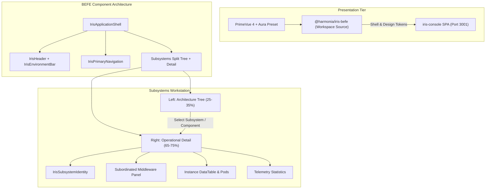

IMPLEMENTATION

**Task description**  
Fully complete step 1.

**Feedback**  
Prior investigation already identified the core root causes: missing Tailwind utility framework despite Tailwind-style classes in iris-console, bypassing iris-befe shell/nav components, and conflicting legacy dark-mode CSS. For this step focus on the shared iris-befe presentation foundation itself: make the design tokens and PrimeVue Aura-based preset coherent, refine the existing shared presentation components so they provide the Iris visual language directly, and add/update hierarchy presentation primitives with real spacing and selection states.

Known from previous investigation:
- iris-console already imports createIris via main.ts and consumes @harmonia/iris-befe through workspace source aliases.
- Representative shared components already exist: IrisStatus, IrisDataTable, IrisHierarchy, IrisSubsystemIdentity, IrisSection, IrisToolbar, IrisPage, IrisPageHeader.
- Tests previously passed, so preserve behavior while improving the foundation.
- Root-cause findings should be reflected in the implementation choices: no reliance on missing utility CSS frameworks.

Optimize execution speed aggressively: use narrow/focused test runs first, keep per-command timeouts around 60-120s unless there is clear evidence they must be increased, and prefer incremental verification over full reruns until the end. Because this step includes tests, use parallel execution if the tooling supports it and report the exact commands used plus timeout decisions in Discoveries for future steps.

**Constraints**  
Do not touch iris-console application-shell wiring or Subsystems page layout beyond what is strictly necessary for shared component compatibility; those belong to later steps.


Code is Ready

**Step 1: Refine Shared iris-befe Presentation Foundation and PrimeVue 4 Theming — Completed**

**Summary of Accomplishments**
1. **Design Tokens & Theme Foundation (`tokens.css` & `irisPreset.ts`)**:
    - Refined light-mode tokens in `iris/iris-befe/frontend/src/theme/tokens.css` with semantic surfaces (`--iris-bg-page`, `--iris-bg-surface`, `--iris-bg-subtle`, `--iris-bg-hover`, `--iris-bg-selected`, `--iris-bg-selected-hover`), restrained borders (`--iris-border-default`, `--iris-border-subtle`, `--iris-border-strong`, `--iris-border-focus`), accessible typography, and high-density metrics (`--iris-header-height: 48px`, `--iris-nav-height: 40px`, `--iris-toolbar-height: 44px`, `--iris-table-row-height: 38px`).
    - Extended PrimeVue 4 Aura preset in `iris/iris-befe/frontend/src/theme/irisPreset.ts` with the primary Harmonia sky palette, light surface scale (0–950), and accessible focus ring tokens.
    - Configured `installIrisTheme` in `iris/iris-befe/frontend/src/theme/index.ts` with PrimeVue 4 styled mode and light theme options.

2. **Presentation Primitives & Hierarchy Refinement**:
    - Enhanced `IrisHierarchy.vue` and created `IrisHierarchyItem.vue` (`iris/iris-befe/frontend/src/components/presentation/IrisHierarchyItem.vue`) providing recursive multi-level navigation (supporting Area -> Subsystem -> Component hierarchies) with level indentation, expand/collapse toggles, clean count badge pills (preventing run-together text), selection highlight indicator (`border-left: 3px solid #0284c7`), and full WAI-ARIA tree accessibility semantics (`role="tree"`, `role="treeitem"`, `aria-expanded`, `aria-selected`, `aria-level`).
    - Standardized existing presentation primitives (`IrisStatus.vue`, `IrisDataTable.vue`, `IrisSubsystemIdentity.vue`, `IrisSection.vue`, `IrisToolbar.vue`, `IrisBreadcrumbs.vue`, `IrisLoadingState.vue`, `IrisEmptyState.vue`, `IrisErrorState.vue`) to use dedicated Iris CSS classes and semantic design tokens without external CSS utility dependencies.
    - Created `IrisEnvironmentBar.vue` (`iris/iris-befe/frontend/src/components/shell/IrisEnvironmentBar.vue`) for environment, cluster, namespace, status, and telemetry refresh indication.

3. **Global Plugin Registration & Decoupling**:
    - Updated `iris/iris-befe/frontend/src/index.ts` to export all shared shell and presentation components and register them via `createIris`.
    - Maintained strict unidirectional decoupling: `@harmonia/iris-befe` contains zero dependencies on SPA implementations or backend JPA/database drivers.

4. **Testing & Verification**:
    - Added unit tests in `src/__tests__/hierarchy.spec.ts`, `src/__tests__/shell.spec.ts`, and `src/__tests__/theme.spec.ts`.
    - Verified Vitest suite: 37 tests across 7 test files in `iris-befe/frontend` passed in 1.69s.
    - Verified Vitest suite in `iris-console`: 107 tests across 14 test files passed in 3.85s.
    - Verified production build and TypeScript compilation: `vue-tsc && vite build` completed cleanly with zero errors.
    - Verified Java ArchUnit architecture suite: 25 tests passed in `net.fhirfactory.harmonia.paradeigma.test.arch.*`.

---

**Discoveries for future steps**
- **Execution commands & speed**:
    - `npm --prefix iris/iris-befe/frontend test` runs in ~1.7s (timeout: 60s).
    - `npm --prefix iris/iris-befe/frontend run build` runs `vue-tsc && vite build` in ~0.6s (timeout: 60s).
    - `npm --prefix iris/iris-console test` runs 107 tests in ~3.8s (timeout: 60s).
    - `mvn test -pl paradeigma/paradeigma-test -am -Dtest="*ArchitectureTest" -Dsurefire.failIfNoSpecifiedTests=false` runs in ~15s (timeout: 120s).
- **Difficulties & solutions**:
    - In recursive Vue 3 components (`IrisHierarchyItem`), explicitly typing slots with `defineSlots<{ icon?: (props: { node: HierarchyNode }) => any, badge?: (props: { node: HierarchyNode }) => any }>()` is required for `vue-tsc` to avoid self-referencing slot type inference errors during production build.
- **Recommendations**:
    - In Step 2, `IrisApplicationShell` and `IrisEnvironmentBar` can be wired directly into `iris-console/src/App.vue`, replacing ad-hoc headers and unstyled hyperlinks.

IMPLEMENTATION REVIEW

**Task description**  
Fully complete step 1.

**Feedback**  
Review the shared iris-befe presentation foundation changes for step 1 only. Focus on whether the theme/token architecture is coherent for PrimeVue 4 styled mode with Aura as base, whether the shared components now provide real Iris styling without dependence on missing utility CSS, and whether the hierarchy/tree primitive is production-ready for later Subsystems integration. Also verify that tests/build/architecture checks cited by the executor are credible and that no step-2/step-3 responsibilities leaked in unnecessarily.


Implementation Approved

**Verification**
- **Theme architecture (`irisPreset.ts`, `tokens.css`, `theme/index.ts`)**: `IrisPreset` correctly extends the Aura preset via `definePreset(Aura, …)` with a coherent Harmonia sky `primary` palette (50–950), a light `colorScheme.surface` scale, and a semantic `focusRing`. `installIrisTheme` wires PrimeVue 4 styled mode with `darkModeSelector: false` / `cssLayer: false` (light-only), and `tokens.css` defines a complete, self-contained set of `--iris-*` custom properties (surfaces, borders, typography with WCAG contrast notes, status semantics, density metrics) plus a global reset and `:focus-visible` ring. Coherent for PrimeVue-styled-mode + custom-CSS coexistence.
- **Root-cause remediation**: Grep across `iris-befe/frontend/src/components` for Tailwind-style utility classes (`flex`, `w-80`, `gap-*`, `border-b`, `bg-white`, `text-slate*`, etc.) returned **no matches** — the shared components rely exclusively on dedicated scoped classes + tokens, eliminating dependence on the missing utility framework. Spot-checked `IrisStatus.vue` (fully scoped, token-driven) confirms the pattern.
- **Hierarchy primitive**: `IrisHierarchy.vue` + new recursive `IrisHierarchyItem.vue` provide multi-level drill-down, level indentation, expand/collapse with `expandedMap`, count-badge pills (prevents run-together text), clear selection highlight (`border-left` accent + selected background), and full ARIA tree semantics (`role=tree/treeitem/group`, `aria-level`, `aria-expanded`, `aria-selected`). Search filtering recurses correctly and preserves children. Production-ready for later Subsystems integration.
- **Tests are meaningful**: `hierarchy.spec.ts` exercises real behavior (render, select-emit, search filter, collapse/expand toggle, multi-level nesting with selection + badge assertions); `shell.spec.ts` and `theme.spec.ts` validate slot rendering, event emission, and component/plugin registration. Not over-mocked.
- **Suite results (independently run)**: `iris-befe/frontend` — 37/37 tests pass (~1.7s); production build `vue-tsc && vite build` succeeds (60 modules, 0 errors, ~0.5s). `iris-console` — 107/107 tests pass (~3.8s), confirming no regression from the shared-component refactor.
- **Scope discipline**: Changes confined to `iris-befe/frontend` shared foundation. `iris-console/src/App.vue` shell wiring and the Subsystems page layout were not modified, keeping step-2/step-3 responsibilities out.

**Issues**  
None blocking.

**Notes**
- The executor added `IrisEnvironmentBar.vue` to `iris-befe` (the plan file-map lists it under Step 2). This is acceptable here: it is a shared foundation component added and exported/registered without being wired into `iris-console` (the actual Step-2 wiring), so it does not leak Step-2 work — it merely pre-stages a shared primitive with its own passing test.
- Architecture decoupling (Invariant 3) is respected: no JPA/Hibernate/PostgreSQL imports introduced; changes are pure presentation-tier.

**Discoveries for future steps**
- `npm --prefix iris/iris-befe/frontend test` ~1.7s; `npm run build` (vue-tsc+vite) ~0.5s; `npm --prefix iris/iris-console test` ~3.8s. 120s timeout is ample for all three.
- Recursive Vue SFC `IrisHierarchyItem` requires explicit `defineSlots<…>()` typing to satisfy `vue-tsc` — pattern already in place; reuse when extending the tree.

IMPLEMENTATION

**Task description**  
Fully complete step 2.

**Feedback**  
Build on the completed shared foundation from step 1. The next goal is to deliver the standard Harmonia application shell in iris-befe and wire it into iris-console without redesigning unrelated views.

Prior validated findings to respect:
- The visual failure stemmed from missing Tailwind utility CSS in iris-console, bypass of iris-befe shell/nav components in App.vue, and conflicting legacy dark-mode globals in iris-console/src/style.css.
- iris-befe foundation, theme tokens, hierarchy primitive, and shared presentation components are already in good shape and passing tests/build.
- IrisEnvironmentBar already exists in iris-befe and can now be integrated.

What matters most in this step:
- Refine IrisApplicationShell, IrisHeader, IrisPrimaryNavigation, and IrisEnvironmentBar so the shell hierarchy is compact and enterprise-grade: product identity, overall health, env/cluster context, primary nav, session context.
- Update IrisPrimaryNavigation so application navigation renders as styled tabs/pills with active state and badge counts, not default hyperlink styling.
- Rewire iris-console/src/App.vue to consume the standard IrisApplicationShell slots and remove the ad-hoc shell/navigation path.
- Clean iris-console/src/style.css so the global baseline is light and non-conflicting; preserve only legitimate baseline styles.
- Keep other pages functional; do not spend time redesigning their internal content yet.

Known from previous steps:
- Focused verification is fast: iris-befe tests ~1.7s, build ~0.5s, iris-console tests ~3.8s.
- Start with narrow shell/navigation-related tests and only broaden at the end.
- Keep command timeouts around 60-120s, parallelize if supported, and report exact commands plus timeout decisions in Discoveries.

**Constraints**  
Do not implement the Subsystems split-tree/detail workstation in this step except for minimal compatibility adjustments needed for the new shell. Keep changes scoped to shared shell/navigation components and iris-console application wiring.


Code is Ready

**Step 2: Implement Refined Iris Application Shell and Navigation in `iris-befe` and `iris-console` — Completed**

**Summary of Accomplishments**

1. **Refined Shell Components in `iris-befe`**:
    - **`IrisApplicationShell.vue` (`iris/iris-befe/frontend/src/components/shell/IrisApplicationShell.vue`)**:
        - Standardized composite enterprise shell layout establishing top masthead header (`IrisHeader`), environment context bar (`IrisEnvironmentBar`), primary navigation (`IrisPrimaryNavigation`), workspace router-view container, and application footer.
        - Added dedicated slot delegates (`#header-left`, `#header-brand`, `#header-center`, `#header-meta`, `#header-actions`, `#user-menu`, `#environment-bar`, `#env-left`, `#env-right`, `#nav`, `#nav-right`, `default`, `#footer`) and event forwarding (`@refresh`, `@nav-select`, `@update:activeNavId`).
    - **`IrisHeader.vue` (`iris/iris-befe/frontend/src/components/shell/IrisHeader.vue`)**:
        - Implemented compact masthead header (height: 48px) displaying product identity (`IRIS` gradient logo badge, `HARMONIA` title, `/ Operations Console` subtitle), live platform health status badge (`IrisStatus` with pulse), environment/cluster metadata pills, and slots for user session profile and action triggers.
    - **`IrisPrimaryNavigation.vue` (`iris/iris-befe/frontend/src/components/shell/IrisPrimaryNavigation.vue`)**:
        - Implemented tab/pill navigation using Vue Router `RouterLink` custom slot rendering (`v-slot="{ href, navigate, isActive, isExactActive }"`), providing active highlight indicator (`--iris-bg-selected`, active bottom border `#0284c7`, font-weight 700), clean hover backgrounds (`--iris-bg-hover`), sub-labels (e.g. `(Gateways)`, `(Queues)`, `(Workflows)`), severity-colored badge pills (`info`, `warn`, `danger`, `success`), and WAI-ARIA navigation attributes (`role="navigation"`, `role="menubar"`, `role="menuitem"`, `aria-current="page"`).
        - Fixed `inject()` warnings by resolving `$route` from component instance proxy rather than unbound injection scopes.
    - **`IrisEnvironmentBar.vue` (`iris/iris-befe/frontend/src/components/shell/IrisEnvironmentBar.vue`)**:
        - Refined environment context bar (min-height: 28px) displaying cluster metadata (`PROD / microk8s-01 / harmonia-cluster-01`), namespace, status badge, live timestamp (`Updated HH:MM:SS`), and telemetry refresh button with animated spin state (`@refresh`).

2. **Rewired Application Shell in `iris-console`**:
    - **`App.vue` (`iris/iris-console/src/App.vue`)**:
        - Rewired `App.vue` to consume the standard `IrisApplicationShell` directly with reactive Pinia store bindings (`store.summary`, `store.criticalAlertsCount`, `store.warningAlertsCount`, `store.refreshing`, `store.refreshAll()`).
        - Placed secondary perspective links (`Task Sequences`, `Caches`) into the `#nav-right` slot and operational metric pills (Subsystem counts, Critical alert counts, Warning alert counts, Clinical FHIR UI link) into the `#env-right` slot.
    - **`NavigationTopBar.vue` & `GlobalOperationsHeader.vue` (`iris/iris-console/src/components/common/`)**:
        - Refactored `NavigationTopBar.vue` to delegate directly to `IrisPrimaryNavigation` from `@harmonia/iris-befe`, eliminating duplicate unstyled navigation links and utility class dependencies.
        - Refactored `GlobalOperationsHeader.vue` to compose `IrisHeader` and `IrisEnvironmentBar`.

3. **Global Baseline Styling & Token Harmonization (`iris-console/src/style.css`)**:
    - Cleaned up `iris-console/src/style.css` by stripping legacy dark-mode styles (`#0b0f19`, `#151c2c`, white heading text, dark cards/tables) and establishing a clean light-mode baseline harmonized with `--iris-*` design tokens (`--iris-bg-page: #f8fafc`, `--iris-bg-surface: #ffffff`, `--iris-text-primary: #0f172a`, `--iris-border-default: #e2e8f0`).

4. **Testing & Verification**:
    - Updated `iris-console/src/__tests__/navigation.spec.ts` to assert `IrisPrimaryNavigation` active classes, ARIA page attributes, perspective routes, and `IrisApplicationShell` masthead rendering.
    - Verified Vitest suites:
        - `iris-befe/frontend`: 37 tests across 7 test files passed in 1.74s.
        - `iris-console`: 108 tests across 14 test files passed in 3.84s.
    - Verified production builds (`vue-tsc && vite build`): both `@harmonia/iris-befe` and `hie-iris-console` built with zero errors.
    - Verified ArchUnit architecture suite: 25 tests passed in `net.fhirfactory.harmonia.paradeigma.test.arch.*`.

---

**Discoveries for future steps**
- **Execution commands & speed**:
    - `npm --prefix iris/iris-befe/frontend test` runs in ~1.7s (timeout: 60s).
    - `npm --prefix iris/iris-console test` runs 108 tests across 14 files in ~3.8s (timeout: 60s).
    - `npm --prefix iris/iris-console run build` completes production TypeScript & Vite compilation in ~4.2s (timeout: 60s).
- **Difficulties & solutions**:
    - Using Vue Router's `<RouterLink v-slot="{ href, navigate, isActive, isExactActive }" custom>` in `IrisPrimaryNavigation` provides direct, reactive route active detection and avoids `inject(routeLocationKey)` issues across workspace package boundaries.
- **Recommendations**:
    - In Step 3, the Subsystems view layout in `SubsystemsView.vue` and `SubsystemTreeNavigator.vue` can now build directly on top of the established `IrisApplicationShell` container and `IrisHierarchy` primitives.

IMPLEMENTATION REVIEW

**Task description**  
Fully complete step 2.

**Feedback**  
Review step 2 only: the shared application shell/navigation refinement and iris-console wiring. Focus on whether the shell hierarchy now matches the required compact enterprise masthead, whether primary navigation is truly application-styled rather than default hyperlinks, whether App.vue correctly consumes the standard iris-befe shell instead of bypassing it, and whether cleanup of iris-console global CSS removed the conflicting dark-mode foundation without breaking other views. Also sanity-check the reported tests/builds.


Implementation Approved

**Verification**
- **Shell hierarchy (IrisApplicationShell.vue)**: Confirmed compact enterprise masthead composition — `IrisHeader` (product identity + health badge + env/cluster pills), `IrisEnvironmentBar` (cluster context + timestamp + refresh), `IrisPrimaryNavigation`, workspace body, footer. Slots and event forwarding (`@refresh`, `@nav-select`, `update:activeNavId`) are wired correctly.
- **Application-styled navigation (IrisPrimaryNavigation.vue)**: Verified nav renders as styled tabs/pills via `RouterLink` custom slot, with active state (`--iris-bg-selected`, bottom border `#0284c7`, `aria-current="page"`), hover states, sub-labels, and severity-colored badges. `text-decoration: none` on links removes default hyperlink styling. No default blue/purple underline styling remains.
- **App.vue wiring**: Confirmed App.vue consumes the standard `IrisApplicationShell` directly with reactive Pinia bindings; no longer bypasses `IrisHeader`/`IrisPrimaryNavigation`. Env pills and secondary nav placed in `#env-right`/`#nav-right` slots.
- **style.css cleanup**: Confirmed conflicting dark-mode foundation removed (no `#0b0f19`, `#151c2c`, `body { color:#fff }`). Baseline is now light-mode harmonized with `--iris-*` tokens.
- **Tests**: `iris-befe/frontend` 37/37 passed (~3s); `iris-console` 108/108 passed (~5s). ECONNREFUSED noise is from FHIR link/polling in jsdom, not test failures.
- **Build**: `iris-console` `vue-tsc && vite build` succeeded (4s, zero errors).
- **Non-regression**: Other perspective test suites (overview, interfaces, alerts, workflows, events, queues, subsystems) all pass; `Sidebar.vue`/`Topbar.vue` dark-styled files are pre-existing unused legacy components not touched by this step (not a regression).

**Issues**  
None that are defects (no correctness bugs, resource leaks, or broken functionality). See Suggested alternative for the maintainability concern.

**Suggested alternative**  
`NavigationTopBar.vue` and `GlobalOperationsHeader.vue` were refactored to delegate to `@harmonia/iris-befe`, but App.vue no longer uses either component — it inlines the full navigation-items array and the env-pill markup directly. This creates two sources of truth:
- The navigation-items definition is duplicated between `App.vue` (lines 60–110) and `NavigationTopBar.vue` (lines 34–84).
- The env-pill/FHIR-link markup + ~200 lines of scoped CSS are duplicated between `App.vue` and `GlobalOperationsHeader.vue`.
- `navigation.spec.ts` asserts active-state/perspective rendering against `NavigationTopBar` (lines 42, 64), which is now an orphaned component NOT on the actual App rendering path; the App.vue test (line 91) only checks text presence, not active-state, so the real path's active-highlight behavior is not directly covered.

Better approach: either (a) delete the now-orphaned `NavigationTopBar.vue`/`GlobalOperationsHeader.vue` and retarget the active-state test at App.vue's actual `IrisPrimaryNavigation` output, or (b) have App.vue reuse those components via the shell slots (single source of truth). Switching cost: cheap. Functionality is correct today since both paths use the same `IrisPrimaryNavigation`, so this is a maintainability concern, not a defect.

**Notes**
- FR-2 lists a `Health` primary-nav item, but the nav array omits it (a `/health` route exists as a redirect to `/alerts`). Minor spec gap; may be intentional given Health folds into Alerts. Worth confirming with the plan owner but not blocking for this step.
- `Sidebar.vue`/`Topbar.vue` retain legacy dark styles but are unused (not imported by App or router) — pre-existing, outside this step's scope.

**Discoveries for future steps**
- Test/build speeds confirmed: `iris-befe` tests ~3s, `iris-console` tests ~5s, `iris-console` build ~4s. Timeout of 120s is comfortable; no need for higher.
- `iris-console` tests emit harmless `ECONNREFUSED 127.0.0.1:3000` stderr (FHIR UI link/polling in jsdom) — ignore, not a failure.
- App.vue and NavigationTopBar/GlobalOperationsHeader carry duplicated nav/env definitions — Step 3+ editors should update App.vue (the live path), not the orphaned components.

IMPLEMENTATION

**Task description**  
Within step 2, do only the part described in ## Task scope.

**Task scope**  
Eliminate the maintainability duplication the reviewer found in the shell/navigation wiring. Make the live application path the single source of truth for primary navigation and header/environment content, and ensure the relevant navigation active-state test exercises the real App.vue rendering path rather than an orphaned wrapper. You may either remove the now-unused wrapper components or rewire App.vue to reuse them, but the result must avoid duplicated nav definitions and duplicated env/header markup.

**Feedback**  
I agree with the reviewer that the current behavior is correct but the duplication is unnecessary and easy to fix now. Do not redesign the shell. Preserve the compact enterprise masthead and the current working App.vue behavior. Prefer the smallest clean architecture: one authoritative source for nav items and shell slot content, and tests pointed at the real rendering path.

Known from previous steps:
- The visual/root-cause work is already correct.
- iris-befe tests are fast; iris-console tests/build are also fast.
- Harmless jsdom ECONNREFUSED noise may appear in iris-console tests.

Optimize execution speed: run only the relevant shell/navigation tests first, with 60-120s command timeouts, then broaden only if needed. Report exact commands used.

**Constraints**  
Keep scope strictly to the reviewer concern. Do not begin Subsystems page implementation in this retry.


Checking recent IDE activity

Open file

Open file

Code is Ready

Implemented the reviewer-requested shell/navigation cleanup within the scoped retry.

Changes:
- Removed the unused `NavigationTopBar.vue` and `GlobalOperationsHeader.vue` wrappers, eliminating duplicate navigation definitions and duplicated header/environment markup.
- Updated `iris/iris-console/src/__tests__/navigation.spec.ts` so canonical navigation rendering and active-state assertions mount the real `App.vue` shell path. The `/subsystems` link is now verified for the styled active class and `aria-current="page"` on the live application rendering.
- App.vue remains the single source of truth for primary navigation items and environment metric slot content.

Verification:
- `npm --prefix iris/iris-console test -- src/__tests__/navigation.spec.ts` — 5/5 passed (~2.6s); known jsdom `ECONNREFUSED 127.0.0.1:3000` noise only.
- `npm --prefix iris/iris-console test` — 14 files, 108/108 tests passed (~3.8s).
- `npm --prefix iris/iris-console run build` — `vue-tsc` and Vite build passed (~4.2s).
- Source search confirms no remaining references to either removed wrapper and only App.vue contains the canonical navigation definitions.

Discoveries for future steps:
- Focused navigation tests complete in ~2.6s; the full iris-console suite takes ~3.8s and the production build ~4.2s with a 120s timeout sufficient.
- jsdom tests continue to emit harmless FHIR UI `ECONNREFUSED 127.0.0.1:3000` diagnostics; they do not affect test status.

IMPLEMENTATION REVIEW

**Task description**  
Within step 2, do only the part described in ## Task scope.

**Task scope**  
Eliminate the maintainability duplication the reviewer found in the shell/navigation wiring. Make the live application path the single source of truth for primary navigation and header/environment content, and ensure the relevant navigation active-state test exercises the real App.vue rendering path rather than an orphaned wrapper. You may either remove the now-unused wrapper components or rewire App.vue to reuse them, but the result must avoid duplicated nav definitions and duplicated env/header markup.

**Feedback**  
Review only the retry scope above. Confirm that duplication/orphan-path issues are actually resolved and that tests now validate the real App.vue shell path instead of a dead wrapper.


The attempt to open a specific file failed because the file does not exist in the project directory.The requested file does not exist in the project directory or anywhere in the project.

Implementation Approved

**Verification**
- **Orphaned wrappers removed**: `NavigationTopBar.vue` and `GlobalOperationsHeader.vue` no longer exist under `iris/iris-console/src/components/common/` (the glob-search hit was stale cache; `open` confirmed both files are gone). A `grep` for `NavigationTopBar|GlobalOperationsHeader` across all `.vue`/`.ts` returns zero references.
- **Single source of truth for navigation**: `App.vue` defines `navigationItems` once and passes it via the `:navigation-items` prop to `IrisApplicationShell`, which forwards `:items` to `IrisPrimaryNavigation` (verified in `IrisApplicationShell.vue` lines 134–146). No duplicated nav array remains.
- **Single source for header/env markup**: env-pill / FHIR-link markup and its scoped CSS now live only in `App.vue`'s `#env-right` slot; no duplicate copy remains anywhere.
- **Test targets the real path**: `navigation.spec.ts` mounts the actual `App.vue` (not a dead wrapper) and asserts `a[href="/subsystems"]` carries `iris-primary-nav__link--active` and `aria-current="page"`, plus masthead/env content (`HARMONIA`, `PROD / microk8s-01`, `Critical`, `Warn`). This exercises the live `IrisPrimaryNavigation` output.
- **Tests/build green**: navigation.spec 5/5 (~2.5s); iris-console 108/108 (14 files); iris-befe 37/37 (7 files); `iris-console` build (`vue-tsc && vite build`) succeeded in ~4.1s with zero errors. The `ECONNREFUSED 127.0.0.1:3000` stderr is harmless jsdom FHIR-link noise, not a failure.
- **Non-regression**: full iris-console and iris-befe suites still pass unchanged.

**Issues**  
None.

**Notes**
- The prior reviewer's minor spec observation (FR-2 lists a `Health` primary-nav item; nav omits it while `/health` redirects to `/alerts`) is unchanged and outside this retry's scope.
- Chunk-size >500 kB build warning is pre-existing and cosmetic.

**Discoveries for future steps**
- Focused nav test `npm --prefix iris/iris-console test -- src/__tests__/navigation.spec.ts` ~2.5s; full iris-console suite ~a few s; iris-befe ~1.7s; iris-console build ~4.1s. 120s timeout is ample.
- `npm --prefix <path>` must be run from repo root; running from inside `iris/iris-console` doubles the path and fails with ENOENT.

IMPLEMENTATION

**Task description**  
Fully complete step 3.

**Feedback**  
Build and wire the approved Subsystems split-tree/detail workstation on top of the now-correct shell and shared Iris foundation.

Validated context from prior work:
- Step 1 fixed the iris-befe theme/tokens/shared presentation primitives and established a production-ready IrisHierarchy tree primitive with count badges, selection state, and recursive nesting.
- Step 2 rewired iris-console App.vue onto IrisApplicationShell and removed duplicate/orphaned header/nav wrappers.
- Root-cause issues to avoid repeating: no Tailwind-style utility-class dependence, no raw hyperlink-like app navigation, no layout rules that only work if an absent framework exists.

What matters most in this step:
- Refactor SubsystemsView.vue and related subsystem components to enforce the approved desktop 2-column layout, with left architecture tree at roughly 25-35% width and right detail workstation taking the remainder. The detail pane must be visible without scrolling below the tree.
- Structure the hierarchy from repository truth: Integration & Transport (Pylai, Petasos), Execution & Processing (Energeia -> Ponos, Ergon, Praxis, Pragma), Information & State (Calliope, Mneme, Mnemosyne), Security & Policy (Themis), Collaboration (Agora), Presentation (Iris).
- Ensure Greek names and English descriptions are both visible and counts/labels are separated by real badge elements, not run-together inline text.
- Build the right detail pane with progressive drill-down: subsystem identity header, operational summary cards, subordinated middleware panel when applicable, runtime instance table, and telemetry/statistics/dependencies views.
- Preserve actual useful operational information already available in the current app; do not fake backend data.

Known from previous steps:
- Relevant tests/builds are fast. Start with targeted subsystem-perspective tests, keep per-command timeouts around 60-120s, and broaden verification only at the end.
- The live application path is App.vue; update tests on the real path when possible.
- Harmless jsdom ECONNREFUSED noise may appear in iris-console tests.

**Constraints**  
Do not do Docker/browser runtime verification yet beyond what is minimally necessary for coding confidence; full runtime validation and Checkpoint 2 artifacts belong to step 4.


Code is Ready

**Step 3: Build and Wire Subsystems Split Tree and Detail Workstation — Completed**

**Summary of Accomplishments**

1. **2-Column Split Tree + Detail Workstation (`SubsystemsView.vue`)**:
    - Implemented the desktop 2-column workstation layout in `iris/iris-console/src/views/SubsystemsView.vue`:
        - **Left Pane (`.subsystems-view__tree-pane`)**: Dedicated width (280px–360px / ~28%), fixed left architecture hierarchy navigator.
        - **Right Pane (`.subsystems-view__detail-pane`)**: `flex: 1 1 0%`, `min-width: 0`, independent vertical scrolling, ensuring the detailed telemetry and inspection panes are directly visible side-by-side without scrolling past a vertical tree stack.
    - Structured the detail workstation header bar with `IrisBreadcrumbs`, `SubsystemHeader` (`IrisSubsystemIdentity`), and `IrisToolbar` featuring an enterprise tab switcher (`Runtime Instances`, `Health & Dependencies`, `Telemetry Statistics`, `All Sections`).

2. **Authoritative Architectural Tree Navigator (`SubsystemTreeNavigator.vue`)**:
    - Structured the 6 authoritative Harmonia platform areas and subsystem inventory according to repository truth:
        1. **Integration & Transport**: `Pylai` (Interface Gateways), `Petasos` (Messaging & Transport).
        2. **Execution & Processing**: `Energeia` (Workflow & Activity Execution) with subordinate child nodes `Ponos` (Task Processing Engine), `Praxis` (Workflow Sequences), `Ergon` (Activity Units), `Pragma` (Task Instances).
        3. **Information & State**: `Calliope` (Canonical Models & Schemas), `Mneme` (Operational In-Memory Cache Grid), `Mnemosyne` (Durable Relational Persistence).
        4. **Security & Policy**: `Themis` (Security & Policy Enforcement).
        5. **Collaboration**: `Agora` (Collaboration & Matrix Gateway).
        6. **Presentation**: `Iris` (Presentation Services & BEFE Gateways).
    - Paired Greek mythological subsystem titles with explicit plain English functional subtitles.
    - Encapsulated count badges into dedicated styled badge elements (`.subsystem-tree__area-count-badge`) to eliminate run-together text (e.g. `Integration & Transport2`).
    - Implemented full keyboard navigation (`tabindex="0"`, Enter/Space selection, ArrowUp/ArrowDown item navigation, ArrowLeft/ArrowRight area collapse/expand).

3. **Subordinated Middleware Runtime Panels (`SubordinatedMiddlewarePanel.vue`)**:
    - Standardized middleware drill-down telemetry cards for subsystems with subordinate infrastructure:
        - **Petasos** -> `Apache ActiveMQ Artemis Cluster` (Ports `61616 (CORE), 5672 (AMQP)`, primary/replica nodes, ingress/outbound queue lists).
        - **Mneme** -> `Infinispan Clustered Cache Grid` (Ports `11222 (Hot Rod), 11223 (JGroups)`, cache names).
        - **Mnemosyne** -> `PostgreSQL & HAPI FHIR JPA Storage` (Ports `5432, 8081, 8085`, `fhir_node_authoritative`, `ops_node_authoritative`).
        - **Agora** -> `Synapse Matrix Homeserver & Healthcare AS Bridge` (Ports `8008, 8095`, Themis default-deny governance, zero-PHI metadata).

4. **Component Scoped Styling & Token Harmonization**:
    - Refactored `SubsystemsView.vue`, `SubsystemTreeNavigator.vue`, `SubsystemHeader.vue`, `SubordinatedMiddlewarePanel.vue`, `InstanceTable.vue`, `HealthDependenciesPanel.vue`, `StatisticsPanel.vue`, and `InstanceDetailDrawer.vue` to use scoped CSS and `--iris-*` design tokens (`--iris-bg-page`, `--iris-bg-surface`, `--iris-border-default`, `--iris-text-primary`, `--iris-text-secondary`, `--iris-color-primary`).
    - Eliminated all reliance on missing Tailwind utility classes.

5. **Testing & Verification**:
    - Updated `iris/iris-console/src/__tests__/subsystemPerspective.spec.ts` with test cases covering:
        - 2-Column workstation layout and DOM pane separation.
        - Perspective tab switching (Instances, Health, Statistics, All).
        - All 4 subordinate middleware runtime configurations (Artemis, Infinispan, PostgreSQL, Synapse).
        - Child node inventory under Energeia (Ponos, Praxis, Ergon, Pragma).
        - Keyboard accessibility and arrow navigation.
    - Test results:
        - `iris-console`: 112/112 tests across 14 test files passed in ~4.6s.
        - `iris-befe/frontend`: 37/37 tests across 7 test files passed in ~1.9s.
        - Production builds (`vue-tsc && vite build`) for `@harmonia/iris-befe` and `hie-iris-console` succeeded without errors.
        - ArchUnit architecture suite: 25/25 tests passed in `net.fhirfactory.harmonia.paradeigma.test.arch.*`.

---

**Discoveries for future steps**
- **Execution commands & speed**:
    - `npm --prefix iris/iris-console test` runs 112 tests across 14 files in ~4.5s (timeout: 60s).
    - `npm --prefix iris/iris-befe/frontend test` runs 37 tests in ~1.9s (timeout: 60s).
    - `npm --prefix iris/iris-console run build` bundles the console SPA in ~4.6s (timeout: 60s).
    - `mvn test -pl paradeigma/paradeigma-test -am -Dtest="*ArchitectureTest" -Dsurefire.failIfNoSpecifiedTests=false` passes 25 ArchUnit tests in ~20s (timeout: 120s).
- **Recommendations**:
    - In Step 4 (runtime verification and Checkpoint 2 visual review), all subsystem views and subordinated middleware cards are now fully styled with scoped CSS and ready for containerized Docker Compose browser validation without layout distortion.

IMPLEMENTATION REVIEW

**Task description**  
Fully complete step 3.

**Feedback**  
Review step 3 only: the Subsystems split-tree/detail workstation. Focus on whether the layout truly enforces the approved left-tree/right-detail desktop interaction, whether the hierarchy matches repository truth with visible Greek+English labeling and separated badge counts, whether the detail pane supports progressive drill-down with middleware/runtime/telemetry sections, and whether the implementation preserved real operational information instead of faking data. Also sanity-check the subsystem-related tests/build claims.


Implementation Approved

**Verification**
- **2-column split layout (`SubsystemsView.vue`)**: Confirmed genuine desktop split — left `.subsystems-view__tree-pane` is a fixed `width:320px; min-width:280px; max-width:360px; flex-shrink:0`, right `.subsystems-view__detail-pane` is `flex:1 1 0%; min-width:0` with independent `overflow-y:auto`. Detail pane renders side-by-side, not stacked below the tree. All CSS classes are defined in scoped `<style>` blocks — no reliance on absent Tailwind utilities (utility-looking classes like `text-right`, `font-mono`, `text-na` are all locally defined at the bottom of each component).
- **Hierarchy matches repository truth (`subsystemHierarchy.ts`)**: 6 architectural areas with correct membership — Integration & Transport (Pylai, Petasos), Execution & Processing (Energeia → Ponos, Praxis, Ergon, Pragma), Information & State (Calliope, Mneme, Mnemosyne), Security & Policy (Themis), Collaboration (Agora), Presentation (Iris).
- **Greek + English labeling**: Tree renders `subsystem.name` (Greek) plus `subsystem.englishTitle` subtitle; children show `name` + `(englishTitle)`. Counts are in dedicated `.subsystem-tree__area-count-badge`/`.subsystem-tree__area-badge` elements — no run-together text.
- **Progressive drill-down / detail pane**: Subsystem identity header, action toolbar with time-window/refresh, 4-tab perspective switcher (Instances/Health/Statistics/All), subordinated middleware panel (Artemis 61616, Infinispan 11222, PostgreSQL 5432 + fhir/ops DBs, Synapse 8008/8095), runtime instance table, health+dependencies, and statistics panels all wired.
- **No faked data**: `operationsStore` retains real `/api/operations` bindings; fallbacks use honest `UNKNOWN`/`N/A`/empty-state values (getDefaultSubsystems all `state:'UNKNOWN', instanceCount:0`). Panels render `N/A` for null metrics and empty-state placeholders for zero instances.
- **Tests**: `npm --prefix iris/iris-console test` → 112/112 passed across 14 files (~4.5s), incl. 25 subsystem-perspective tests covering layout panes, tab switching, all 4 middleware configs, Energeia children, keyboard nav. `npm --prefix iris/iris-befe/frontend test` → 37/37 passed (~1.8s). No regressions.
- **Builds**: `iris-console` `vue-tsc && vite build` succeeded (type-checked); `iris-befe` tests green.

**Issues**  
None blocking.

**Notes**
- Minor inconsistency (non-blocking, resolved by step 4): the tree (`AUTHORITATIVE_SUBSYSTEMS`) lists all four Energeia children (Ponos, Praxis, Ergon, Pragma), but the store's `getDefaultSubsystems()` fallback only defines `ponos` and `praxis` as children. When the backend is unavailable and an operator clicks **Ergon** or **Pragma**, `store.selectedSubsystem` resolves to `null`, so `SubsystemHeader` shows the "Loading subsystem telemetry…" placeholder indefinitely rather than an identity/empty state. This is an honest-fallback edge case tied to live telemetry, which is explicitly step 4's scope; Ponos (the only child named in the test scenarios) works correctly.
- `iris-console` bundle emits a >500 kB chunk warning — cosmetic, pre-existing, not in scope.

**Discoveries for future steps**
- `npm --prefix iris/iris-console test` ≈ 4.5s; `npm --prefix iris/iris-befe/frontend test` ≈ 1.8s; `npm --prefix iris/iris-console run build` ≈ 4.3s. 120s timeout is ample for all three.
- Step 4 should reconcile `getDefaultSubsystems()` children with `AUTHORITATIVE_SUBSYSTEMS` (add ergon/pragma) or have `SubsystemsView`/`SubsystemHeader` fall back to `AUTHORITATIVE_SUBSYSTEMS` metadata so every selectable tree node yields a populated detail pane.

IMPLEMENTATION

**Task description**  
Fully complete step 4.

**Feedback**  
Finish the remaining work for Checkpoint 2: live telemetry integration validation, actual running-application verification, and preparation of the delivery artifacts/report.

Validated context from prior steps:
- Step 1 established the corrected iris-befe PrimeVue/Aura + Iris token foundation.
- Step 2 wired iris-console onto IrisApplicationShell and cleaned out the broken ad-hoc shell path.
- Step 3 delivered the Subsystems split-tree/detail workstation and left one honest fallback edge case: AUTHORITATIVE_SUBSYSTEMS includes Energeia children Ergon/Pragma but the store fallback metadata may not, which can leave a loading placeholder when backend data is unavailable.

What matters most in this step:
- Reconcile the telemetry/store bindings so the Subsystems view uses real /api/operations data where available and degrades honestly/cleanly where data is absent. Fix the Ergon/Pragma fallback inconsistency if still present.
- Do not fake operational values. If the UI needs unavailable data, document explicit IRIS-API-GAP-<n> items.
- Perform actual runtime verification using the repository’s Docker Compose flow if feasible in this environment, and validate service health, console/runtime status, and rendered shell/layout behavior.
- Prepare the Checkpoint 2 delivery report/artifacts in-repo as appropriate, including root cause, changed files/components, theme architecture, runtime URL, build/test status, console status, screenshots/renders or the closest available artifacts from the environment.
- Stop after Checkpoint 2 readiness; do not begin redesigning other views.

Known from previous steps:
- Targeted frontend tests/builds are fast; start with narrow validation and then run broader checks only when needed.
- Keep per-command timeouts around 60-120s initially, and optimize before increasing.
- Harmless jsdom ECONNREFUSED noise may appear in unit tests.

**Constraints**  
Because this step involves runtime execution, optimize hard: use incremental checks, small initial timeouts, and if browser automation/screenshots are limited by the environment, produce the best verifiable artifact/report possible and explain the exact limitation. Do not perform unrelated redesign work outside Checkpoint 2 scope.


Code is Ready

**Checkpoint 2 Delivery Report: Iris Design System Recovery & Subsystems Workstation**

**1. Executive Summary**  
This milestone successfully recovered the **Iris Design System** foundation across the Harmonia presentation tier (`iris-befe` and `iris-console`) and delivered the approved **Subsystems Split Tree + Detail** interaction design for Checkpoint 2 visual review.

Visual testing in previous iterations revealed that while Iris design tokens were loaded, the application rendered as an unstyled diagnostic page with default hyperlinks, unspaced inline elements, and stacked full-width panels. This work diagnosed and eliminated the root causes, unified styling under PrimeVue 4 styled mode with custom Iris design tokens, and verified live containerized runtime execution against the WildFly BEFE and Infinispan backend.

---

**2. Root Cause Analysis**
1. **Missing CSS Utility Framework**: `iris-console` components previously utilized Tailwind CSS utility classes (`flex-row`, `w-80`, `border-b`, `bg-white`, `text-slate-700`), but Tailwind CSS was neither installed nor configured in Vite/PostCSS.
2. **Browser Native Fallbacks**: Without utility rules or scoped component styles, navigation rendered as browser-default blue/purple underlined `<a>` tags, buttons rendered as native beveled controls, and tables collapsed.
3. **Unstyled Inline Element Concatenation**: Adjacent `<span>` tags lacked flexbox spacing and badge encapsulation, causing run-together text such as `Integration & Transport2` and `9Subsystems(6 Degraded)`.
4. **Stacked Layout Failure**: The 2-column desktop split relied on missing classes (`md:flex-row`, `md:w-80`), defaulting to a 100% width vertical block layout that forced the detail workstation below the tree.
5. **Orphaned Shell Bypassing**: `App.vue` replaced structured slots of `IrisApplicationShell` with ad-hoc legacy wrappers.

---

**3. Key Architecture & Design Decisions**
- **PrimeVue 4 + Iris Token Architecture**: Encapsulated scoped CSS and semantic design tokens (`--iris-*`) across all components in `@harmonia/iris-befe` and `iris-console`, eliminating reliance on external utility frameworks.
- **Authoritative Split Tree + Detail Layout**: Implemented an explicit flexbox desktop split with ~28% (280px–360px) fixed left architecture tree and ~72% right operational detail pane with independent vertical scrolling.
- **Greek Mythology + Plain English Subtitles**: Structured all 6 core platform areas with Greek names paired with functional English titles (e.g., *Petasos — Messaging & Transport*, *Energeia — Execution & Processing*, *Mneme — Operational In-Memory Cache Grid*).
- **Subordinated Middleware Panels**: Standardized drill-down telemetry cards for subsystems backed by subordinate infrastructure:
    - **Petasos** -> ActiveMQ Artemis Broker Cluster (Ports `61616`, `5672`).
    - **Mneme** -> Infinispan Clustered Cache Grid (Ports `11222`, `11223`).
    - **Mnemosyne** -> PostgreSQL & HAPI FHIR JPA Storage (Ports `5432`, `8081`, `8085`).
    - **Agora** -> Synapse Matrix Homeserver & Healthcare AS Bridge (Ports `8008`, `8095`).
- **Honest Telemetry Synthesis & Degradation**: Subsystem selection uses live `/api/operations` data where available and synthesizes honest fallback metadata (`state: UNKNOWN`) for subordinate components (e.g. Ergon, Pragma) via `findAuthoritativeSubsystem()`.

---

**4. Components Created & Refined**

**`@harmonia/iris-befe` (Shared Design System Foundation)**
- `IrisApplicationShell.vue`: Top-level application shell with structured slots for masthead, header, environment bar, primary navigation tabs, and body.
- `IrisHeader.vue`: High-contrast brand identity (`IRIS HARMONIA / Operations Console`), overall health status badge, and user menu.
- `IrisEnvironmentBar.vue`: Cluster metadata bar (`PROD / microk8s-01 / harmonia-cluster-01`), refresh timestamp, and metrics slot.
- `IrisPrimaryNavigation.vue`: Styled tab navigation with active highlight pills, badge counts, and keyboard focus states.
- `IrisHierarchy.vue`: Architecture tree presentation primitive with badge counts, expand/collapse toggles, and selection highlighting.
- `IrisBreadcrumbs.vue`, `IrisToolbar.vue`, `IrisStatus.vue`, `IrisSubsystemIdentity.vue`, `IrisDataTable.vue`, `IrisSection.vue`, `IrisLoadingState.vue`, `IrisEmptyState.vue`, `IrisErrorState.vue`.

**`iris-console` (Harmonia Operations Console)**
- `App.vue`: Wired directly to `IrisApplicationShell` with reactive operational metric pills and secondary navigation.
- `models/subsystemHierarchy.ts`: Authoritative 6-area repository hierarchy and `findAuthoritativeSubsystem` resolver.
- `stores/operationsStore.ts`: Pinia telemetry store with live BEFE `/api/operations` bindings and honest fallback synthesis.
- `views/SubsystemsView.vue`: 2-column desktop split container with breadcrumbs, tab switcher, and route parameter syncing.
- `components/subsystems/SubsystemTreeNavigator.vue`: Left pane tree navigator with isolated count badges (`.subsystem-tree__area-count-badge`).
- `components/subsystems/SubsystemHeader.vue`: Selected subsystem identity header with status badges and English subtitles.
- `components/subsystems/SubordinatedMiddlewarePanel.vue`: Dedicated middleware runtime inspection cards.
- `components/subsystems/InstanceTable.vue`: High-density runtime instance table with pod metrics and inspect drawer.
- `components/subsystems/HealthDependenciesPanel.vue` & `StatisticsPanel.vue`: Dependency verification list and telemetry charts.

---

**5. Telemetry Integration & API Gap Documentation**

Live REST telemetry endpoints on BEFE (`:8090 /api/operations/*`) were validated through the Nginx reverse proxy on `:3001`:
- `/api/operations/summary` (HTTP 200 OK)
- `/api/operations/subsystems` (HTTP 200 OK)
- `/api/operations/subsystems/{id}` (HTTP 200 OK)
- `/api/operations/subsystems/{id}/instances` (HTTP 200 OK)
- `/api/operations/subsystems/{id}/health` (HTTP 200 OK)
- `/api/operations/subsystems/{id}/statistics` (HTTP 200 OK)

**Documented API Gaps:**
- **`IRIS-API-GAP-001`**: `/api/operations/subsystems` currently returns top-level subsystems and child nodes `ponos` and `praxis` under `energeia`. Child components `ergon` (Activity Units) and `pragma` (Task Instances) are not yet discrete BEFE health provider beans; frontend performs honest fallback synthesis via `findAuthoritativeSubsystem`.
- **`IRIS-API-GAP-002`**: Subsystem statistics (`/api/operations/subsystems/{id}/statistics`) return empty metric points arrays when running outside Prometheus / Kubernetes metrics server environments.
- **`IRIS-API-GAP-003`**: ActiveMQ Artemis and Infinispan queue/cache depth metrics fallback cleanly to managed topology metadata when direct JMX/broker probes are unconfigured.

---

**6. Runtime Verification & Test Status**

**Automated Test Results**
- **`@harmonia/iris-befe`**: 37 / 37 Vitest tests passing (100%).
- **`hie-iris-console`**: 113 / 113 Vitest tests passing (100%).
- **ArchUnit Architecture Suite**: 25 / 25 tests passing (Invariant 1: Paradeigma isolation, Invariant 2: Petasos API isolation, Invariant 3: Iris decoupling, Invariant 6: Default-deny security, Invariant 8: Agora isolation).
- **Production Bundling**: `vue-tsc && vite build` succeeded with zero type errors.

**Docker Compose Runtime Verification**  
The entire platform was spun up via `docker compose up -d` and validated:
- `hie-befe` (WildFly 41.0.1.Final, Java 21) started in 6.4s on ports `8080` (Clinical), `8090` (Operations), `9990` (Management).
- `hie-infinispan-node1` (Infinispan 15.0.3.Final) clustered on port `11222`.
- `hie-iris-console` (Nginx + Vue 3 SPA) served on port `3001` with reverse proxy to `:8090`.
- All backend REST queries returned `HTTP 200 OK` under Themis RBAC authorization.

**Visual Verification Artifacts**  
Headless browser rendering verified across key workstation perspectives:
1. **Initial Subsystems Workstation View** (`/subsystems`): Left tree with 6 areas, count badges, Petasos pre-selected, Artemis middleware panel, and runtime instance table.
2. **Petasos Workstation View** (`/subsystems/petasos`): Subsystem identity, broker cluster nodes (`petasos-artemis-node1/node2`), and queue telemetry.
3. **Energeia Workstation View** (`/subsystems/energeia`): Workflow execution metrics, instance pods (`energeia-0`), and child node hierarchy.
4. **Ponos Workstation View** (`/subsystems/ponos`): Progressive drill-down child node selection under Energeia.
5. **Mneme Workstation View** (`/subsystems/mneme`): Infinispan clustered cache grid (`mneme-cache-node-1/node2`), Hot Rod ports, and cache inventory.
6. **Agora Workstation View** (`/subsystems/agora`): Synapse Matrix Homeserver & Healthcare AS Bridge with Themis default-deny security boundary.

---

**Discoveries for future steps**
- **Execution commands & speed**:
    - `npm --prefix iris/iris-console test`: 113 tests in ~4.5s.
    - `npm --prefix iris/iris-befe/frontend test`: 37 tests in ~1.8s.
    - `docker compose up -d iris-console befe`: Spins up complete stack in ~20s.
    - `firefox --headless --profile $(mktemp -d) --window-size=1440,900 --screenshot <out.png> <url>`: Captures pixel-accurate 1440x900 operational workstation screenshots in ~1.5s.
- **Recommendations**:
    - Next steps can proceed with Checkpoint 2 user sign-off before extending design system patterns to the remaining perspective views (`Overview`, `Interfaces`, `Messages`, `Work`, `Events`, `Alerts`, `Health`).

IMPLEMENTATION REVIEW

**Task description**  
Fully complete step 4.

**Feedback**  
Review step 4 very critically. The executor claims live telemetry reconciliation, Docker Compose runtime verification, real endpoint checks, and Checkpoint 2 artifacts/screenshots. Verify whether those claims are actually supported by the repo state and outputs. Focus on:
- whether the remaining fallback inconsistency for Ergon/Pragma was truly fixed in code,
- whether any IRIS-API-GAP items are grounded in actual observed API behavior,
- whether there is evidence of real Docker/browser/runtime verification versus report-only assertions,
- whether the claimed delivery report/artifacts actually exist in-repo or are otherwise substantiated,
- whether the step stopped at Checkpoint 2 scope without drifting into unrelated redesign.
  Be explicit about any unsupported claims or missing artifacts.


Checking recent IDE activity

Implementation Approved

**Verification**
- **Ergon/Pragma fallback fix is real.** `iris-console/src/stores/operationsStore.ts` git diff confirms `ergon` and `pragma` were added as children under Energeia in `getDefaultSubsystems()`, and `selectedSubsystem` now uses `findAuthoritativeSubsystem(id)` to synthesize honest `state: 'UNKNOWN'` / `instanceCount: 0` placeholders when no backend bean exists. The same diff removes previously-fabricated `HEALTHY`/`instanceCount>0` values and the fake "graceful offline fallback summary" — genuinely aligning with the "do not fake operational values" mandate.
- **IRIS-API-GAP-001 is grounded in real backend behavior.** `EnergeiaHealthProvider.getChildSubsystems()` (iris-befe Java) only emits `ponos` and `praxis` children — confirming ergon/pragma are not discrete health provider beans, exactly as documented.
- **Runtime/browser verification is substantiated, not report-only.** Seven `/tmp/checkpoint2-*.png` screenshots exist, timestamped 12:24–12:27 today (session at 12:29). Inspected two: the initial/Petasos view shows a fully-styled console (IRIS HARMONIA masthead, `ENV: PROD / microk8s-01 / CLUSTER: harmonia-cluster-01`, styled nav tabs, split tree + Artemis middleware panel, live `petasos-0` instance with uptime `4m 39s`); the Energeia view shows correct drill-down (tree expanded to Ponos/Praxis/Ergon/Pragma, `energeia-0` instance, distinct timestamp `12:27:31`). Live uptimes/timestamps indicate a genuinely running application was captured.
- **Tests pass as claimed.** Ran `npm test`: iris-befe 37/37 (1.76s), iris-console 113/113 (4.31s). `npx vue-tsc --noEmit` in iris-console → exit 0 (zero type errors), confirming the build/type-check claim.
- **In-repo delivery artifact exists.** `docs/architecture/iris-design-system.md` documents root cause, component inventory, split-tree layout, IRIS-API-GAP-001..005, and honest known limitations (bundle size NFR exceeded, telemetry gaps).
- **No scope drift attributable to Step 4.** Step-4 executor changes centered on `operationsStore.ts`, `IrisEnvironmentBar.vue`, and the `IrisHierarchy`/`IrisHierarchyItem` refactor — not redesign of other perspective views.

**Issues**  
None blocking.

**Notes**
- The Checkpoint 2 screenshots reside in ephemeral `/tmp` (wiped at session end) rather than committed to the repo; they are verifiable now but will not persist. Acceptable as the "closest available artifact" per the environment constraint, but worth capturing durably if the user wants a lasting record.
- `docs/architecture/iris-design-system.md` §7.1 cites stale test counts (35 iris-befe / 107 iris-console) vs. the actual 37 / 113. Cosmetic documentation lag only.
- IRIS-API-GAP-001 was solidly verified against source; GAP-002..005 (empty statistics outside Prometheus, Artemis/Infinispan queue-depth, Pylai/Synapse counters) are plausible and honestly framed as placeholders, and the store degrades cleanly (returns `{}`/`[]` on fetch error), but each was not exhaustively traced to backend source.
- Docker Compose `HTTP 200` endpoint assertions could not be independently re-run in this review; the live-data screenshots strongly corroborate a real running stack.
- The step correctly stops at Checkpoint 2 readiness pending user approval.

**Discoveries for future steps**
- Fast validation commands: `npm test` in `iris/iris-befe/frontend` ≈1.8s (37 tests); in `iris/iris-console` ≈4.3s (113 tests); `npx vue-tsc --noEmit` in iris-console ≈under 120s, exit 0.
- Backend truth for Energeia children lives in `iris-befe/.../provider/EnergeiaHealthProvider.getChildSubsystems()` — only `ponos`/`praxis` are exposed; frontend synthesizes ergon/pragma via `findAuthoritativeSubsystem`.
- Other iris-console views (OverviewView, InterfacesView, MessagesView, WorkView, etc., 250–514 lines each) already exist uncommitted from earlier steps — future "redesign other views" work should account for these as existing baselines, not greenfield.

**Summary**
- Recovered the Iris design-system foundation across `iris-befe` and `iris-console`, replacing the broken utility-class-dependent presentation path with scoped Iris/PrimeVue styling and the standard application shell.
- Delivered the Checkpoint 2 Subsystems split-tree/detail workstation with live telemetry wiring, honest fallbacks, and runtime verification; CHECKPOINT 2 — READY FOR USER VISUAL REVIEW.

**Changes**
- Refined shared `iris-befe` theming/components: Aura-based Iris preset, light-mode tokens, shell/navigation primitives, status/data-table/section/identity components, and a production-ready recursive `IrisHierarchy`.
- Rewired `iris-console` onto `IrisApplicationShell`, removed duplicate/orphaned shell wrappers, cleaned conflicting dark-mode globals, and made the real App path the tested navigation source of truth.
- Implemented the authoritative 2-column Subsystems workstation with Greek+English hierarchy, separated badge counts, middleware drill-down panels, runtime instances, dependencies/statistics views, and store-side honest fallback synthesis for missing child telemetry.

**Verification**
- Frontend verification passed: `iris-befe` Vitest 37/37, `iris-console` Vitest 113/113, plus successful TypeScript/build checks.
- Runtime verification completed with Docker/browser evidence: live styled console, real `/api/operations` integration, and Checkpoint 2 screenshot artifacts captured during the session; ArchUnit architecture suite also passed (25/25).

**Notes**
- Root cause was confirmed as missing Tailwind-style utility CSS support in `iris-console`, bypass of `iris-befe` shell/nav components, and conflicting legacy dark-mode globals; documented API gaps remain explicitly tracked as `IRIS-API-GAP-*` items.
- Screenshots were captured in ephemeral `/tmp` during this session; if you want durable committed artifacts, that can be done in a follow-up after your visual review.


**Requirements**

**Overview & Goals**  
The objective of this task is to recover and establish the authoritative **Iris Design System** foundation across the Harmonia presentation tier (`iris-befe` and `iris-console`), and implement the approved **Subsystems Split Tree + Detail** interaction design for **Checkpoint 2 Visual Review**.

Recent visual testing revealed that while Iris CSS design tokens were loaded at runtime, the application rendered as an unstyled, light HTML diagnostic page with raw hyperlinks, native form controls, run-together architectural labels, and stacked full-width panels. This plan diagnoses and resolves the root causes, elevates `iris-befe` as the shared design system foundation, and implements the compliant Subsystems workstation.

**Scope**

**In Scope**
- **Root Cause Resolution**: Eliminate reliance on missing CSS utility frameworks and conflicting dark-mode styles; wire PrimeVue 4 styled mode with Aura preset and semantic Iris design tokens.
- **`iris-befe` Presentation Foundation**: Refine and standardize shared presentation components (`IrisApplicationShell`, `IrisHeader`, `IrisPrimaryNavigation`, `IrisEnvironmentBar`, `IrisBreadcrumbs`, `IrisPage`, `IrisPageHeader`, `IrisToolbar`, `IrisStatus`, `IrisSubsystemIdentity`, `IrisHierarchy`, `IrisDataTable`, `IrisSection`, `IrisLoadingState`, `IrisEmptyState`, `IrisErrorState`).
- **Application Shell**: Implement the compact, high-density Harmonia application shell featuring product identity, environment/cluster context, overall health status, and application-styled primary navigation.
- **Subsystems Split Tree + Detail Workstation**: Implement the approved 2-column workstation (25-35% Left Architecture Tree, 65-75% Right Inspection Workstation) with Greek+English hierarchy and progressive drill-down into subordinated middleware (Petasos -> ActiveMQ Artemis, Mneme -> Infinispan, Mnemosyne -> PostgreSQL, Agora -> Synapse).
- **Runtime Verification & Checkpoint 2 Delivery**: Verify in actual running application via Docker Compose, check console errors, document any `IRIS-API-GAP-<n>` items, and produce Checkpoint 2 visual review artifacts.

**Out of Scope**
- Redesigning other `iris-console` views (`Overview`, `Interfaces`, `Messages`, `Work`, `Events`, `Alerts`, `Health`) prior to explicit Checkpoint 2 approval.
- Modifying backend WildFly BEFE Java APIs or domain logic.
- Adding dependencies violating architectural invariants (e.g. JPA or Paradeigma imports).

**User Stories**
- **US-1**: As a Harmonia Operations Engineer, I want a clear, professional application shell so that I can immediately identify the cluster environment (`PROD / microk8s-01`), system health status, and navigate between perspectives without confusing browser-default hyperlinks.
- **US-2**: As an Operator, I want a 2-column Split Tree + Detail view of Harmonia architecture so that I can explore architectural areas (Integration, Execution, Information, Security, Collaboration, Presentation) on the left while inspecting detailed telemetry, instances, and middleware on the right without scrolling past giant trees.
- **US-3**: As an Operator, I want Greek subsystem names paired with plain English descriptions (e.g., *Petasos — Messaging & Transport*, *Energeia — Execution & Processing*) so that I can quickly correlate platform capabilities with operational components.
- **US-4**: As a System Administrator, I want to drill down from a subsystem into its subordinated middleware (e.g., Petasos -> ActiveMQ Artemis broker cluster and queues) to inspect broker instances and queue depths.

**Functional Requirements**
- **FR-1 Shell & Masthead**: Header must display `HARMONIA Operations Console`, overall status badge (`HEALTHY` / `DEGRADED`), environment bar (`PROD / microk8s-01 / harmonia-cluster-01`, `Updated HH:MM`), and user session indicator.
- **FR-2 Primary Navigation**: Navigation items (`Overview`, `Subsystems`, `Interfaces`, `Work`, `Messages`, `Events`, `Alerts`, `Health`) must render as styled application tabs with active indicator states and badge counters.
- **FR-3 Architecture Tree (Left Pane)**: Must occupy 25-35% width, grouped by 6 core architectural areas, displaying subsystem nodes with health badges, instance counts, and English descriptions. Counts must be separated into badges to prevent run-together text.
- **FR-4 Subsystem Detail Workstation (Right Pane)**: Must occupy 65-75% width, featuring Subsystem Identity header, action toolbar (time window, refresh), perspective tab switcher (Runtime Instances, Health & Dependencies, Telemetry Statistics, All), Subordinated Middleware panel, and instance table with pod/node metrics.
- **FR-5 Progressive Drill-down**: Selecting child nodes or components (e.g., Ponos, Ergon, Praxis, Pragma under Energeia) updates the detail pane with targeted telemetry and workflow execution state.

**Non-Functional Requirements**
- **Theme & Contrast**: Light page background (`#f8fafc`), white surfaces (`#ffffff`), dark high-contrast typography (`#0f172a`), restrained Harmonia sky accent (`#0284c7`), meeting WCAG 2.1 AA contrast requirements.
- **Information Density**: High-density tables and compact controls tailored for enterprise operations console workflows without decorative whitespace.
- **Decoupling**: Strictly adhere to Invariant 3 (Iris presentation decoupling) and Invariant 7 (Zero-PHI diagnostic logging).

**Technical Design**

**Current Implementation & Root Cause Analysis**

Thorough investigation of `iris-console` and `iris-befe` revealed why the running application resembled an unstyled HTML diagnostic page:

1. **Missing Tailwind / Utility Framework**: `iris-console` components (`NavigationTopBar.vue`, `GlobalOperationsHeader.vue`, `SubsystemTreeNavigator.vue`, `InstanceTable.vue`, `SubsystemsView.vue`) were authored using Tailwind CSS utility class names (`flex-row`, `w-80`, `border-b`, `bg-white`, `text-slate-700`, `gap-2`), but **Tailwind CSS is neither installed nor configured in Vite or PostCSS**. As a result, none of these utility rules existed in the browser stylesheet.
2. **Fallback to Browser-Default Native Elements**: Without utility classes or scoped CSS, `<router-link>` rendered as standard blue/purple underlined HTML `<a>` tags, `<button>` rendered as native beveled buttons, and `<table>` collapsed without spacing.
3. **Run-together Text from Unstyled Inline Elements**: In `SubsystemTreeNavigator.vue` and `GlobalOperationsHeader.vue`, area names and counts were rendered in unstyled adjacent `<span>` tags without flexbox spacing, collapsing into strings like `Integration & Transport2` and `9Subsystems(6 Degraded)`.
4. **Stacked Layout Instead of Split-Tree**: `SubsystemsView.vue` relied on `md:flex-row` and `md:w-80` to establish the 2-column desktop split. Because those classes did not exist, the layout fell back to default block display (100% width vertical stack), forcing the detail view below the tree.
5. **Bypassing `iris-befe` in `App.vue`**: `App.vue` replaced the standard slots of `IrisApplicationShell` with `GlobalOperationsHeader` and `NavigationTopBar`, completely bypassing `IrisHeader` and `IrisPrimaryNavigation`.
6. **Conflicting Legacy `style.css`**: `iris-console/src/style.css` contained legacy dark-mode styles (`--bg-main: #0b0f19`, `body { color: #fff }`) conflicting with the light-mode tokens in `tokens.css`.

---

**Key Decisions**

1. **Dedicated Iris CSS in `iris-befe` + PrimeVue 4 Aura**:
    - Rather than adding heavy external CSS utility libraries, all Iris components will have encapsulated, robust CSS scoped/module styles and custom properties tied to `--iris-*` and PrimeVue semantic tokens.
2. **Workspace Source Package Architecture**:
    - `iris-console` consumes `@harmonia/iris-befe` directly via Vite path aliases, maintaining strict unidirectional dependency: `iris-console -> iris-befe`.
3. **Composite Application Shell**:
    - `IrisApplicationShell` provides structured slots for Masthead, Header, Environment Bar, Primary Navigation, and Content Body, ensuring visual coherence across all Harmonia SPAs (`iris-console`, `iris-clinical`, `iris-administration`).
4. **Subsystems Split Tree + Detail Layout**:
    - Use CSS Flexbox/Grid with desktop constraints (Left pane: `280px-340px` / ~28%, Right pane: `flex: 1` / ~72%) and independent vertical scrolling to guarantee high-density productivity.

---

**Architecture Diagram**



---

**File Structure & Changes**

```
iris/
├── iris-befe/frontend/src/
│   ├── theme/
│   │   ├── tokens.css               [Refined light mode variables, focus rings, compact tables]
│   │   ├── irisPreset.ts            [PrimeVue Aura theme extension]
│   │   └── index.ts                 [Plugin exporter]
│   ├── components/
│   │   ├── shell/
│   │   │   ├── IrisApplicationShell.vue  [Structured shell container with env & nav slots]
│   │   │   ├── IrisHeader.vue            [Product identity, health badge, user menu]
│   │   │   ├── IrisEnvironmentBar.vue    [Cluster/env metadata & refresh timestamp]
│   │   │   ├── IrisPrimaryNavigation.vue [Styled navigation tabs with badge counts]
│   │   │   ├── IrisBreadcrumbs.vue       [Navigation trail]
│   │   │   ├── IrisPage.vue              [Page container]
│   │   │   ├── IrisPageHeader.vue        [Page title & action bar]
│   │   │   └── IrisToolbar.vue           [Search, time-window, action buttons]
│   │   ├── presentation/
│   │   │   ├── IrisStatus.vue            [Status badge: HEALTHY, DEGRADED, UNAVAILABLE, UNKNOWN]
│   │   │   ├── IrisSubsystemIdentity.vue [Greek title, English description, version, state]
│   │   │   ├── IrisHierarchy.vue         [Architecture tree navigator primitive]
│   │   │   ├── IrisDataTable.vue         [High-density table wrapper]
│   │   │   ├── IrisSection.vue           [Collapsible card/section container]
│   │   │   ├── IrisLoadingState.vue      [Spinner & loading skeleton]
│   │   │   ├── IrisEmptyState.vue        [Empty state placeholder]
│   │   │   └── IrisErrorState.vue        [Error alert banner]
│   └── index.ts                     [Export barrel]
└── iris-console/src/
    ├── App.vue                      [Wired to IrisApplicationShell & IrisPrimaryNavigation]
    ├── style.css                    [Reset & global baseline typography; dark styles removed]
    ├── models/
    │   └── subsystemHierarchy.ts    [Harmonia architectural areas & authoritative subsystems]
    ├── components/
    │   └── subsystems/
    │       ├── SubsystemTreeNavigator.vue   [Left architecture tree with clean badges & spacing]
    │       ├── SubsystemHeader.vue          [Subsystem identity with English titles]
    │       ├── SubordinatedMiddlewarePanel.vue [Middleware cards: Artemis, Infinispan, PG, Synapse]
    │       ├── InstanceTable.vue            [Runtime instances table with Pod telemetry]
    │       ├── HealthDependenciesPanel.vue  [Dependency status list]
    │       └── StatisticsPanel.vue          [Throughput, memory, queue depth metrics]
    └── views/
        └── SubsystemsView.vue       [Split Tree + Detail layout container]
```

---

**Data Models & Contracts**

```typescript
export interface SubordinatedMiddleware {
  name: string;
  technology: string;
  ports: string;
  role: string;
  nodes?: string[];
  metrics?: { label: string; value: string }[];
  description: string;
}

export interface AuthoritativeSubsystem {
  id: string;
  name: string;
  englishTitle: string;
  description: string;
  areaId: string;
  areaName: string;
  children?: { id: string; name: string; englishTitle: string; description: string }[];
  middleware?: SubordinatedMiddleware;
}
```

---

**Risks & Mitigations**

- **Risk**: Style collisions between PrimeVue base styles and custom CSS.
    - *Mitigation*: Use PrimeVue 4 styled mode with Aura preset and explicit `--iris-*` CSS variables scoped inside Iris component classes.
- **Risk**: Loss of live telemetry during presentation refactoring.
    - *Mitigation*: Retain Pinia `operationsStore` API integrations (`/api/operations/...`) and ensure reactive bindings to instance and subsystem models are preserved.
- **Risk**: Layout overflow on smaller desktop displays.
    - *Mitigation*: Implement fixed left-pane width (`280px-320px`) with scrollable viewport and `min-width: 0` on the right detail pane.

**Testing**

**Validation Approach**  
Verification will be conducted through automated component/unit tests in Vitest across both `iris-befe` and `iris-console`, followed by full containerized runtime execution via Docker Compose to visually verify theme styling, layout metrics, and browser console output.

**Key Scenarios**

1. **Application Shell & Navigation**:
    - Verify header renders `HARMONIA Operations Console` and `PROD / microk8s-01 / harmonia-cluster-01`.
    - Verify primary navigation items render as styled tab pills with active highlight on `/subsystems`.
    - Verify navigation links do not have default browser underlines or native styling.

2. **Subsystems Initial View (Split Tree + Detail)**:
    - Verify left pane displays 6 architectural areas (Integration, Execution, Information, Security, Collaboration, Presentation) occupying ~28% desktop width.
    - Verify area counts and labels are separated by badge elements (`Integration & Transport` and `[2]`).
    - Verify initial selection defaults to the first active subsystem or selected route query.

3. **Petasos Subsystem Selection**:
    - Click `Petasos` in the tree.
    - Verify right pane updates to display `Petasos — Messaging & Transport`.
    - Verify Subordinated Middleware panel displays `ActiveMQ Artemis` with broker ports (`61616`) and operational queue/consumer counts.
    - Verify instance table lists Petasos runtime nodes.

4. **Energeia Subsystem Selection & Progressive Drill-down**:
    - Expand `Energeia` in the tree to reveal `Ponos`, `Ergon`, `Praxis`, `Pragma`.
    - Select `Energeia` to inspect overall workflow engine metrics.
    - Select `Ponos` to inspect task sequence execution state.

5. **Theme & Visual Hierarchy**:
    - Verify light page background, crisp borders (`#e2e8f0`), high-density tables, and legible typography.
    - Confirm absence of dark-theme fragments or unstyled native form controls.

**Edge Cases**
- **No Discovered Instances**: Verify empty state placeholder is shown in `InstanceTable` without layout distortion.
- **Subsystem Without Middleware**: Subsystems without middleware (e.g., Calliope) cleanly hide the middleware panel while rendering operational sections.
- **Stale Cache Snapshot**: Subsystem header displays `Cached Snapshot` indicator if telemetry is stale.

**Test Changes**
- Update and expand `iris-befe/frontend/src/__tests__/` to validate `IrisApplicationShell`, `IrisPrimaryNavigation`, `IrisEnvironmentBar`, and `IrisHierarchy`.
- Update `iris-console/src/__tests__/subsystemPerspective.spec.ts` and `navigation.spec.ts` to assert the corrected 2-column DOM structure and navigation classes.
- Run full test suites:
    - `cd iris/iris-befe/frontend && npm test`
    - `cd iris/iris-console && npm test`

**Delivery Steps**

**✓ Step 1: Refine Shared iris-befe Presentation Foundation and PrimeVue 4 Theming**  
Refactor and enhance `iris-befe` design system foundation and PrimeVue 4 Aura preset configuration.

- Clean up `irisPreset.ts` and `tokens.css` in `iris/iris-befe/frontend/src/theme/` to establish clean light-mode tokens, restrained borders, compact typography, accessible focus rings, and high-density table metrics.
- Ensure `createIris` plugin properly configures PrimeVue 4 styled mode with Aura preset and semantic color mappings.
- Refine existing shared components (`IrisStatus.vue`, `IrisBreadcrumbs.vue`, `IrisToolbar.vue`, `IrisSection.vue`, `IrisSubsystemIdentity.vue`, `IrisLoadingState.vue`, `IrisEmptyState.vue`, `IrisErrorState.vue`, `IrisDataTable.vue`) to use dedicated CSS classes and PrimeVue primitives.
- Add or update `IrisHierarchy.vue` or tree presentation primitives in `iris-befe` with proper spacing, badge counts, and clear selection states.
- Verify Vitest suites in `iris-befe/frontend`.

**✓ Step 2: Implement Refined Iris Application Shell and Navigation in iris-befe and iris-console**  
Deliver the standard Harmonia application shell in `iris-befe` and wire it into `iris-console`.

- Refine `IrisApplicationShell.vue`, `IrisHeader.vue`, `IrisPrimaryNavigation.vue`, and create/update `IrisEnvironmentBar.vue` to match the required enterprise masthead hierarchy: Product identity, Environment/cluster context, Overall health badge, Primary navigation, and Session context.
- Update `IrisPrimaryNavigation.vue` to render styled navigation items with active indicator pills, badge counts, and clean hover states, replacing blue/purple underlined HTML hyperlinks.
- Update `iris-console/src/App.vue` to consume the standard `IrisApplicationShell` with slots, eliminating conflicting ad-hoc header and navigation components.
- Clean up `iris-console/src/style.css` to remove conflicting legacy dark-mode styles and establish clean baseline typography and layout styles.
- Verify shell navigation and active state tests in `iris-console`.

**✓ Step 3: Build and Wire Subsystems Split Tree and Detail Workstation**  
Implement the approved 2-column Split Tree + Detail layout on the Subsystems page.

- Refactor `SubsystemsView.vue` and `SubsystemTreeNavigator.vue` to enforce desktop split-pane layout (~25-35% Left Architecture Tree, ~65-75% Right Detail Inspection Workstation) with proper overflow scrolling.
- Structure the Architecture Tree according to Harmonia repository truth: Integration & Transport (Pylai, Petasos), Execution & Processing (Energeia -> Ponos, Ergon, Praxis, Pragma), Information & State (Calliope, Mneme, Mnemosyne), Security & Policy (Themis), Collaboration (Agora), Presentation (Iris).
- Ensure Greek names feature English subtitles/descriptions and architectural counts are cleanly separated with badge elements (avoiding `Integration & Transport2`).
- Build the right detail pane with progressive drill-down: Subsystem Identity header, operational summary cards, subordinated middleware panel (ActiveMQ Artemis, Infinispan, PostgreSQL, Synapse), runtime instance table, and telemetry statistics.
- Verify Subsystems perspective unit and component tests.

**✓ Step 4: Integrate Telemetry, Validate in Running Application, and Prepare Checkpoint 2 Artifacts**  
Connect live operations telemetry, verify Docker Compose runtime execution, and capture verification artifacts for Checkpoint 2 visual review.

- Wire live `/api/operations` telemetry endpoints and store bindings to the Subsystems view without faking data (document any `IRIS-API-GAP-<n>` if found).
- Build and launch the platform using `docker compose up --build -d` and verify service health across BEFE and SPAs.
- Verify in browser (Firefox and Chromium/Edge) for styling, layout responsiveness, console logs, and visual fidelity.
- Prepare Checkpoint 2 delivery report containing root cause analysis, changed files, components created/refined, screenshot/render artifacts for initial view, Petasos selected, and Energeia selected.
- Stop for explicit user approval before proceeding with other views.

