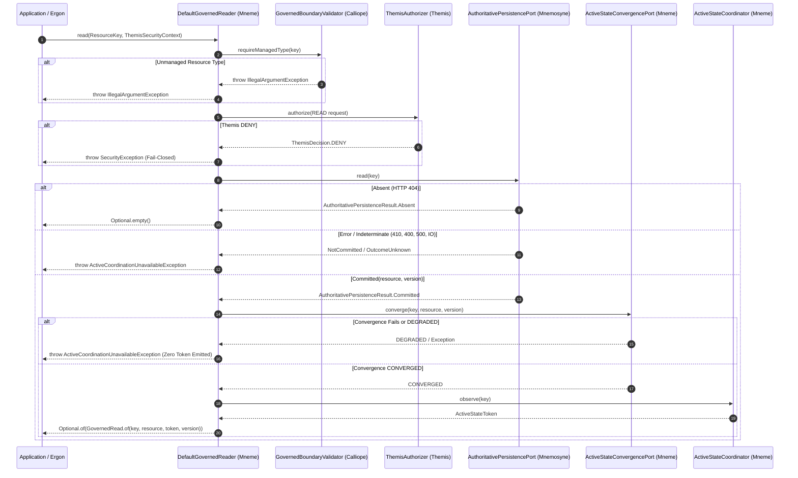

**Requirements**

**Overview & Goals**

Recover and complete the implementation of Milestone **M3.1 — Governed READ Integration & Active-State Generation Observation** following interruptions in previous execution sessions.

M3.1 establishes the production application-facing point-read path (`GovernedReader`) under the ownership of the **Mneme** subsystem (`hestia/mneme-cluster`, package `net.fhirfactory.harmonia.hestia.mneme.access`). It unites:
1. Fail-closed Calliope boundary validation (`GovernedBoundaryValidator`).
2. Local Themis READ authorization evaluation (`ThemisAuthorizer`, throwing canonical `SecurityException` on `DENY`).
3. Authoritative point retrieval from Mnemosyne via `AuthoritativePersistencePort.read(ResourceKey)`.
4. Strict semantic outcome discrimination: `Committed`, `Absent`, `NotCommitted`, `Conflict`, and `OutcomeUnknown`.
5. Fail-closed active-state cache convergence (`ActiveStateConvergencePort.converge(...)`).
6. Post-convergence active-state generation token observation (`ActiveStateCoordinator.observe(...)`).

**Architectural Authority & Axioms**

This plan strictly enforces Harmonia's architectural authority hierarchy (`AGENTS.md` and `docs/architectural-axioms.md`):

- **AX-05 (Active State and Authoritative Durable State Are Distinct)**:
    - Mneme owns application-facing access and active coordination.
    - Mnemosyne owns authoritative durable truth and version progression.
    - A successful authoritative READ must converge Mneme active state before an `ActiveStateToken` is observed and returned.
    - Degraded or failed convergence must NOT issue a valid token and must leave coordination untrusted until reconciliation.
    - `ActiveStateToken` and `AuthoritativeVersion` remain strictly separate concurrency domains; neither may be substituted for or inferred from the other.
- **AX-14 (Semantic Distinctions Are Preserved)**:
    - Access denial (`ThemisAuthorizationDecision.DENY`) is a security denial and must NEVER be collapsed into resource absence.
    - Authoritative 404 is represented as typed `AuthoritativePersistenceResult.Absent`.
    - HTTP 410 (Gone) is not absence; it remains `NotCommitted` (no delete/tombstone semantics in M3.1; ADR-020 preserved).
    - `Absent` must remain semantically distinct from `NotCommitted`, `Conflict`, `OutcomeUnknown`, and `Committed`.
    - `Absent` must NOT be forced into `AuthoritativeCommitOutcome.NOT_COMMITTED`.
    - `Optional.empty()` is returned if and only if an authorized authoritative READ establishes `Absent`.
- **AX-15 (Uncertainty Is Preserved Until Resolved)**:
    - `OutcomeUnknown` and `NotCommitted` fail closed (throwing `ActiveCoordinationUnavailableException`) and are never assumed to be absent or retried blindly.

**Scope**

**In Scope**

- Preserving valid existing work from previous sessions in the working tree (`DefaultGovernedReader`, relocated `DefaultGovernedWriter`, `MnemeAuthoritativeHttpClient` 404/410 handling, test suites).
- Preserving `AuthoritativePersistenceResult` root contract cleanliness (with `Absent` remaining semantically distinct and free of synthetic commit outcomes) and correcting the 18 test callers in `hestia/mnemosyne-clinical` to inspect concrete mutation subtypes, format diagnostics directly, or assert typed absence.
- Aligning `HapiJpaAuthoritativePersistenceAdapter.read` and `AuthoritativeFhirResourceController.read` to handle `AuthoritativePersistenceResult.Absent`.
- Executing focused verification across `mneme-cluster`, `mneme-persistence`, `mnemosyne-clinical`, and `paradeigma-test` under bounded execution rules (`AGENTS.md` 5.1).

**Out of Scope**

- Milestone M3.2 (`DefaultGovernedWriter` orchestration pipeline completion) and M3.3+.
- Authoritative search or batch operations (reserved for M5).
- Physical DELETE or tombstone lifecycle modifications (ADR-020).
- Application consumer migration (reserved for M4).
- MicroK8s runtime deployment (reserved for M6).
- Unrelated MAT findings or speculative service boundaries.

**User Stories**

- **As a Harmonia application service**, I want to read authoritative FHIR resources through `GovernedReader.read(ResourceKey, ThemisSecurityContext)` so that my reads are validated at the Calliope boundary, governed by Themis policy, backed by Mnemosyne durable truth, and synchronized into Mneme active state with a valid `ActiveStateToken`.
- **As a security auditor**, I want unauthorized read attempts to fail closed immediately with a canonical `SecurityException` so that security denials cannot be misinterpreted as non-existent resources.
- **As a distributed coordination engine**, I want reads that fail active cache convergence to fail closed without issuing an active token, so that untrusted or stale active cache state is never exposed as coordinated state.

**Functional Requirements**

1. **Boundary Validation**: `DefaultGovernedReader.read` invokes `GovernedBoundaryValidator.requireManagedType(key)`. Non-managed types reject fail-closed with `IllegalArgumentException`.
2. **Themis Authorization**: Before invoking persistence, `DefaultGovernedReader` invokes `ThemisAuthorizer.authorize(request)` with `ThemisAction.READ`. If the decision is `DENY`, throw `SecurityException`.
3. **Persistence Delegation**: Reads are delegated to `AuthoritativePersistencePort.read(key)`.
4. **Typed Absent Mapping**: If persistence returns `AuthoritativePersistenceResult.Absent`, `read` returns `Optional.empty()`.
5. **Fail-Closed Persistence Errors**: If persistence returns `NotCommitted`, `OutcomeUnknown`, or unexpected `Conflict`, `read` throws `ActiveCoordinationUnavailableException`.
6. **Active State Convergence**: On `Committed(resource, version)`, `DefaultGovernedReader` invokes `ActiveStateConvergencePort.converge(key, resource, version)`.
7. **Convergence Invariant**: If convergence returns `ConvergenceStatus.DEGRADED` or throws an exception, fail closed with `ActiveCoordinationUnavailableException`. Do NOT observe or emit an `ActiveStateToken`.
8. **Token Observation**: If convergence succeeds (`ConvergenceStatus.CONVERGED`), invoke `ActiveStateCoordinator.observe(key)` and return `Optional.of(GovernedRead.of(key, resource, token, version))`.

**Non-Functional Requirements**

- **Zero-PHI Diagnostic Logging**: Log statements must record only resource keys, correlation IDs, or exception summaries; never unmasked clinical resource payloads.
- **Bounded Execution**: All test runs and commands must adhere to `AGENTS.md` Section 5.1 execution boundaries.
- **Dependency Isolation**: `DefaultGovernedReader` and `DefaultGovernedWriter` in `hestia/mneme-cluster` must not import or depend upon JPA, Hibernate, or direct Infinispan types.

**Technical Design**

**Current Implementation & Recovery Findings**

Investigation of the git working tree revealed the following state from previous sessions:

1. **`DefaultGovernedReader`**: Already fully implemented in `hestia/mneme-cluster/src/main/java/net/fhirfactory/harmonia/hestia/mneme/access/DefaultGovernedReader.java`. Enforces boundary validation, Themis READ authorization, persistence retrieval, Absent mapping, cache convergence, and post-convergence token observation.
2. **`DefaultGovernedWriter`**: Relocated from `hestia/mnemosyne-clinical` to `hestia/mneme-cluster` (`net.fhirfactory.harmonia.hestia.mneme.access`), satisfying subsystem placement invariants.
3. **`hestia/mneme-cluster/pom.xml`**: Added `<dependency>` on `net.fhirfactory.harmonia:themis-api`.
4. **`MnemeAuthoritativeHttpClient`**: Maps HTTP 404 to `AuthoritativePersistenceResult.Absent`, while retaining 410, 400, 401/403, and network errors as `NotCommitted`.
5. **Tests Passing**:
    - `DefaultGovernedReaderTest` (13 tests) and `DefaultGovernedWriterTest` (14 tests) in `mneme-cluster`: 100% PASS (27/27).
    - All 69 tests in `hestia/mneme-cluster`: 100% PASS.
    - `MnemeAuthoritativeHttpClientTest` in `mneme-persistence`: 100% PASS (29/29).
    - `DistributedAuthoritativeDockerPathTest`: updated step 1 assertion to expect `Absent`.
    - All 85 ArchUnit architecture tests in `paradeigma/paradeigma-test`: 100% PASS.
6. **Root Failure Isolated**:
    - In `hestia/mnemosyne-api`, `AuthoritativePersistenceResult.java` was modified by the previous session to add `Absent<T>`, but the method `AuthoritativeCommitOutcome outcome();` was removed from the root interface.
    - Removing `outcome()` from the root interface broke compilation across four test classes in `hestia/mnemosyne-clinical` (`AuthoritativePersistenceServiceTest`, `AuthoritativePersistencePostgreSqlConcurrencyTest`, `HapiJpaAuthoritativePersistenceAdapterTest`, `HapiJpaAuthoritativePersistencePostgreSqlConcurrencyTest`) with 18 "cannot find symbol method outcome()" compilation errors.
    - Additionally, `HapiJpaAuthoritativePersistenceAdapter.read` still returns `NotCommitted` on `ResourceNotFoundException`, and `AuthoritativeFhirResourceController.read` only inspects `NotCommitted`.

**Key Decisions**

**Decision 1: Result Contract Cleanliness & Test Caller Alignment**

- **Analysis**:
    - Zero production code calls `outcome()` on `AuthoritativePersistenceResult`. All production consumers (`DefaultGovernedWriter`, `MnemeAuthoritativeHttpClient`, `AuthoritativeFhirResourceController`) use pattern matching or `isCommitted()`.
    - The 18 compilation failures in `hestia/mnemosyne-clinical` are 100% in test classes.
    - Four call sites are fallback diagnostic formatting in concurrency tests (`"Unexpected result outcome: " + result.outcome()`) which can format `result` directly.
    - Thirteen call sites in unit tests follow `isInstanceOf(AuthoritativePersistenceResult.<Subtype>.class)`. Because all four mutation records (`Committed`, `Conflict`, `NotCommitted`, `OutcomeUnknown`) declare `public AuthoritativeCommitOutcome outcome()`, callers can inspect the cast/pattern-matched subtype or check `isCommitted()`.
    - One call site (`HapiJpaAuthoritativePersistencePostgreSqlConcurrencyTest:333`) asserted pre-M3.1 behavior (`outcome() == NOT_COMMITTED` on absent read), which under M3.1 and AX-14 must assert `isInstanceOf(AuthoritativePersistenceResult.Absent.class)`. Similarly, `AuthoritativePersistenceServiceTest:497` verifies `Absent`.
- **Selected Approach**:
    - Keep root `AuthoritativePersistenceResult` strictly clean: do NOT introduce a default `outcome()` method throwing `UnsupportedOperationException`.
    - Retain `outcome()` exclusively on the four mutation record types (`Committed`, `Conflict`, `NotCommitted`, `OutcomeUnknown`) where commit outcomes are semantically defined.
    - Correct the 18 test callers in `hestia/mnemosyne-clinical` to inspect concrete subtypes, format diagnostics directly, or assert typed `Absent`.
- **Rationale**:
    - Avoids moving compile-time type verification to runtime exceptions (`UnsupportedOperationException`).
    - Preserves AX-14 by keeping `AuthoritativeCommitOutcome` completely decoupled from point-read `Absent`.
    - Achieves zero compilation errors with zero regression risk to production contracts.

**Decision 2: Server-Side Absent Propagation**

- **Approach**: Update `HapiJpaAuthoritativePersistenceAdapter.read` to return `new AuthoritativePersistenceResult.Absent<>(...)` on `ResourceNotFoundException`. Update `AuthoritativeFhirResourceController.read` to handle `AuthoritativePersistenceResult.Absent` by returning HTTP 404 Not Found.
- **Rationale**: End-to-end consistency across both the direct JPA adapter and the HTTP controller ensures that authoritative absence is typed throughout Mnemosyne.

**Data Models & Contracts**

```java
package net.fhirfactory.harmonia.hapifhir.persistence.model;

public sealed interface AuthoritativePersistenceResult<T> extends Serializable
        permits AuthoritativePersistenceResult.Committed,
                AuthoritativePersistenceResult.Conflict,
                AuthoritativePersistenceResult.Absent,
                AuthoritativePersistenceResult.NotCommitted,
                AuthoritativePersistenceResult.OutcomeUnknown {

    default boolean isCommitted() {
        return this instanceof Committed;
    }

    record Absent<T>(
            String message
    ) implements AuthoritativePersistenceResult<T> {
        public Absent {
            Objects.requireNonNull(message, "message must not be null");
        }
    }

    record Committed<T>(
            T persistedResource,
            AuthoritativeVersion authoritativeVersion
    ) implements AuthoritativePersistenceResult<T> { ... }

    record Conflict<T>(
            AuthoritativePreconditionConflict conflict
    ) implements AuthoritativePersistenceResult<T> { ... }

    record NotCommitted<T>(
            String failureMessage,
            Throwable cause
    ) implements AuthoritativePersistenceResult<T> { ... }

    record OutcomeUnknown<T>(
            String message,
            Throwable cause
    ) implements AuthoritativePersistenceResult<T> { ... }
}
```

**File Structure**

| File | Subproject / Module | Action | Description |
| :--- | :--- | :--- | :--- |
| `AuthoritativePersistenceResult.java` | `hestia/mnemosyne-api` | Verified / Unchanged | Retain clean sealed interface with `isCommitted()`, `record Absent<T>`, and mutation records declaring `outcome()`. Root interface has no synthetic throwing methods. |
| `AuthoritativePersistenceServiceTest.java` | `hestia/mnemosyne-clinical` | Modify | Update 10 test call sites to inspect concrete subtype outcomes, assert `Absent` on non-existent read, and format diagnostics directly. |
| `AuthoritativePersistencePostgreSqlConcurrencyTest.java` | `hestia/mnemosyne-clinical` | Modify | Update 2 concurrency diagnostic error branches to format `result` directly. |
| `HapiJpaAuthoritativePersistencePostgreSqlConcurrencyTest.java` | `hestia/mnemosyne-clinical` | Modify | Update 2 concurrency diagnostic branches and update `testPointRead()` to assert `Absent` instead of `NOT_COMMITTED`. |
| `HapiJpaAuthoritativePersistenceAdapterTest.java` | `hestia/mnemosyne-clinical` | Modify | Update 3 test call sites to inspect concrete subtype outcomes. |
| `HapiJpaAuthoritativePersistenceAdapter.java` | `hestia/mnemosyne-clinical` | Modify | Return `AuthoritativePersistenceResult.Absent` when `ResourceNotFoundException` is caught during `read`. |
| `AuthoritativeFhirResourceController.java` | `hestia/mnemosyne-clinical` | Modify | Handle `AuthoritativePersistenceResult.Absent` and map to HTTP 404 Not Found. |
| `AuthoritativeFhirResourceControllerTest.java` | `hestia/mnemosyne-clinical` | Modify | Add / update test verifying `Absent` returns HTTP 404. |
| `DefaultGovernedReader.java` | `hestia/mneme-cluster` | Existing / Valid | Completed production implementation of `GovernedReader`. |
| `DefaultGovernedWriter.java` | `hestia/mneme-cluster` | Existing / Valid | Relocated from `mnemosyne-clinical`. |
| `DefaultGovernedReaderTest.java` | `hestia/mneme-cluster` | Existing / Valid | Unit tests verifying all read, security, convergence, and token flows. |
| `MnemeAuthoritativeHttpClient.java` | `hestia/mneme-persistence` | Existing / Valid | Verified mapping of 404 -> Absent, 410 -> NotCommitted. |
| `GovernedWriteCompositionArchitectureTest.java` | `paradeigma/paradeigma-test` | Existing / Valid | Architecture tests verifying mneme-cluster package residence and decoupling. |

**Architecture Diagram**



**Risks & Mitigations**

- **Risk**: Conflating read absence with write failure or introducing runtime contract hazards.
    - *Mitigation*: `AuthoritativeCommitOutcome` remains strictly confined to mutation records (`Committed`, `Conflict`, `NotCommitted`, `OutcomeUnknown`). The root interface does not define `outcome()`, preserving compile-time type safety and preventing `Absent` from ever being forced into `NOT_COMMITTED` or triggering runtime exceptions.
- **Risk**: Stale active cache state returned after authoritative updates.
    - *Mitigation*: Cache convergence is executed prior to observing the `ActiveStateToken`. If convergence is degraded, fail closed and do not emit a token.
- **Risk**: Long-running tests or container operations hanging during verification.
    - *Mitigation*: Enforce `AGENTS.md` Section 5.1 bounded execution rules with explicit timeout controls.

**Testing**

**Validation Approach**

Verification follows a multi-tier bottom-up strategy adhering strictly to `AGENTS.md` Section 5.1:
1. **Tier 1 — Compilation**: Verify that all subprojects compile cleanly with Java 21 (`JAVA_HOME=/usr/lib/jvm/java-1.21.0-openjdk-amd64`).
2. **Tier 2 — Focused Unit Tests**: Validate isolated components with fast Mockito/WireMock tests.
3. **Tier 3 — Contract & Concurrency Tests**: Validate Mnemosyne persistence service and adapter tests.
4. **Tier 4 — Architecture Conformance**: Execute the complete ArchUnit suite to guarantee zero dependency leakage, correct module boundaries, and absence of forbidden imports.

**Key Scenarios**

1. **Unmanaged Type Boundary Rejection**:
    - Call `DefaultGovernedReader.read` with unmanaged resource type (e.g. `Binary`).
    - Expected: `IllegalArgumentException` thrown immediately; zero calls to Themis or persistence.
2. **Themis Authorization Denial**:
    - Provide `ThemisSecurityContext` for which Themis returns `DENY`.
    - Expected: `SecurityException` thrown immediately; zero persistence calls; never returns `Optional.empty()`.
3. **Authoritative Resource Absent**:
    - Persistence returns `AuthoritativePersistenceResult.Absent`.
    - Expected: returns `Optional.empty()`; zero cache convergence or coordinator calls.
4. **Authoritative Failure Non-Collapsing**:
    - Persistence returns `NotCommitted` (e.g. HTTP 410, 400, 401/403) or `OutcomeUnknown`.
    - Expected: throws `ActiveCoordinationUnavailableException`; never returns `Optional.empty()`.
5. **Successful Read with Post-Read Convergence**:
    - Persistence returns `Committed(resource, version 1)`.
    - Convergence succeeds (`CONVERGED`). Coordinator returns `ActiveStateToken`.
    - Expected: returns `GovernedRead` with correct payload, `AuthoritativeVersion(1)`, and valid token.
6. **Degraded Convergence Fail-Closed**:
    - Persistence returns `Committed(resource, version 1)`.
    - Convergence returns `ConvergenceStatus.DEGRADED` or throws an exception.
    - Expected: throws `ActiveCoordinationUnavailableException`; `ActiveStateCoordinator.observe` is NEVER called; zero token issued.
7. **HTTP 404 vs 410 Discrimination**:
    - WireMock returns HTTP 404 -> client returns `AuthoritativePersistenceResult.Absent`.
    - WireMock returns HTTP 410 -> client returns `AuthoritativePersistenceResult.NotCommitted`.
    - Expected: structurally distinct without string parsing.

**Test Changes**

- **Update**: `hestia/mnemosyne-clinical/src/test/java/net/fhirfactory/harmonia/hapifhir/controller/AuthoritativeFhirResourceControllerTest.java` to verify `AuthoritativePersistenceResult.Absent` produces HTTP 404.
- **Verify**: `hestia/mneme-cluster/src/test/java/net/fhirfactory/harmonia/hestia/mneme/access/DefaultGovernedReaderTest.java` (13 tests).
- **Verify**: `hestia/mneme-cluster/src/test/java/net/fhirfactory/harmonia/hestia/mneme/access/DefaultGovernedWriterTest.java` (14 tests).
- **Verify**: `hestia/mneme-persistence/src/test/java/net/fhirfactory/harmonia/persistence/client/MnemeAuthoritativeHttpClientTest.java` (29 tests).
- **Verify**: `hestia/mnemosyne-clinical/src/test/java/net/fhirfactory/harmonia/hapifhir/persistence/AuthoritativePersistenceServiceTest.java`.
- **Verify**: `paradeigma/paradeigma-test/src/test/java/net/fhirfactory/harmonia/paradeigma/test/arch/*ArchitectureTest.java` (85 ArchUnit rules).

**Verification Execution Commands**

```bash

# 1. Compile mnemosyne-clinical

JAVA_HOME=/usr/lib/jvm/java-1.21.0-openjdk-amd64 PATH=/usr/lib/jvm/java-1.21.0-openjdk-amd64/bin:$PATH mvn test-compile -pl hestia/mnemosyne-clinical

# 2. Run Mneme Governed Access tests

JAVA_HOME=/usr/lib/jvm/java-1.21.0-openjdk-amd64 PATH=/usr/lib/jvm/java-1.21.0-openjdk-amd64/bin:$PATH mvn test -pl hestia/mneme-cluster -Dtest="DefaultGovernedReaderTest,DefaultGovernedWriterTest"

# 3. Run Mneme HTTP Client tests

JAVA_HOME=/usr/lib/jvm/java-1.21.0-openjdk-amd64 PATH=/usr/lib/jvm/java-1.21.0-openjdk-amd64/bin:$PATH mvn test -pl hestia/mneme-persistence -Dtest="MnemeAuthoritativeHttpClientTest"

# 4. Run Mnemosyne Persistence & Controller tests

JAVA_HOME=/usr/lib/jvm/java-1.21.0-openjdk-amd64 PATH=/usr/lib/jvm/java-1.21.0-openjdk-amd64/bin:$PATH mvn test -pl hestia/mnemosyne-clinical -Dtest="AuthoritativePersistenceServiceTest,HapiJpaAuthoritativePersistenceAdapterTest,AuthoritativeFhirResourceControllerTest"

# 5. Run full ArchUnit Architecture suite

JAVA_HOME=/usr/lib/jvm/java-1.21.0-openjdk-amd64 PATH=/usr/lib/jvm/java-1.21.0-openjdk-amd64/bin:$PATH mvn test -pl paradeigma/paradeigma-test -Dtest="*ArchitectureTest" -Dsurefire.failIfNoSpecifiedTests=false
```

**Delivery Steps**

*** Step 1: Correct mnemosyne-clinical test callers to preserve root AuthoritativePersistenceResult contract**

All 18 test compilation failures in `hestia/mnemosyne-clinical` are resolved by aligning assertions to concrete mutation subtypes and typed absence, eliminating compiler errors while keeping the root `AuthoritativePersistenceResult` free of synthetic runtime-failing methods.

- Retain `AuthoritativePersistenceResult` in `hestia/mnemosyne-api` as a clean sealed interface with `isCommitted()` and `record Absent<T>(String message)`, without adding a default `outcome()` method.
- Retain `public AuthoritativeCommitOutcome outcome()` on `Committed`, `Conflict`, `NotCommitted`, and `OutcomeUnknown` records where commit outcomes are semantically defined.
- In `AuthoritativePersistencePostgreSqlConcurrencyTest.java` (lines 131, 213) and `HapiJpaAuthoritativePersistencePostgreSqlConcurrencyTest.java` (lines 132, 233), update concurrency fallback error handlers to format `result` directly instead of calling `result.outcome()`.
- In `HapiJpaAuthoritativePersistencePostgreSqlConcurrencyTest.java` (line 333), update `testPointRead()` to assert `isInstanceOf(AuthoritativePersistenceResult.Absent.class)` instead of asserting `outcome() == NOT_COMMITTED`.
- In `AuthoritativePersistenceServiceTest.java`, update direct subtype assertions (lines 85, 119, 156, 194, 221, 301, 306, 328) to inspect subtype outcomes or check `isCommitted()`, update `testReadNonExistentResource` (line 497) to assert `Absent`, and update concurrency error branches (lines 365, 438) to format `result` directly.
- In `HapiJpaAuthoritativePersistenceAdapterTest.java`, update lines 72, 100, 119 to inspect subtype outcomes.
- Recompile `hestia/mnemosyne-clinical` via `JAVA_HOME=/usr/lib/jvm/java-1.21.0-openjdk-amd64 PATH=/usr/lib/jvm/java-1.21.0-openjdk-amd64/bin:$PATH mvn test-compile -pl hestia/mnemosyne-clinical` to verify that all 18 compilation errors are eliminated.

**Step 2: Align server-side persistence adapter and controller for Absent READ handling**

Mnemosyne's internal JPA adapter and authoritative REST controller explicitly recognize and return typed `AuthoritativePersistenceResult.Absent` on resource absence, returning HTTP 404 without collapsing absence into error states.

- Update `HapiJpaAuthoritativePersistenceAdapter.read(ResourceKey key)` in `hestia/mnemosyne-clinical/src/main/java/net/fhirfactory/harmonia/hapifhir/persistence/HapiJpaAuthoritativePersistenceAdapter.java` to return `new AuthoritativePersistenceResult.Absent<>(...)` when `ResourceNotFoundException` is caught, preserving `NotCommitted` for unresolvable types, empty version IDs, or runtime persistence errors.
- Update `AuthoritativeFhirResourceController.read(...)` in `hestia/mnemosyne-clinical/src/main/java/net/fhirfactory/harmonia/hapifhir/controller/AuthoritativeFhirResourceController.java` to explicitly handle `AuthoritativePersistenceResult.Absent`, returning HTTP 404 Not Found.
- Update `AuthoritativeFhirResourceControllerTest.java` to verify that `AuthoritativePersistenceResult.Absent` produces HTTP 404 Not Found.

**Step 3: Execute multi-subsystem focused verification and architecture suite**

All focused unit, contract, and repository-wide architecture tests pass under bounded execution constraints, confirming complete M3.1 conformance.

- Run focused unit and contract tests in `hestia/mneme-cluster`: `mvn test -pl hestia/mneme-cluster -Dtest="DefaultGovernedReaderTest,DefaultGovernedWriterTest"`.
- Run focused HTTP client tests in `hestia/mneme-persistence`: `mvn test -pl hestia/mneme-persistence -Dtest="MnemeAuthoritativeHttpClientTest"`.
- Run authoritative persistence service tests in `hestia/mnemosyne-clinical`: `mvn test -pl hestia/mnemosyne-clinical -Dtest="AuthoritativePersistenceServiceTest,HapiJpaAuthoritativePersistenceAdapterTest,AuthoritativeFhirResourceControllerTest"`.
- Run repository-wide architecture test suite: `mvn test -pl paradeigma/paradeigma-test -Dtest="*ArchitectureTest" -Dsurefire.failIfNoSpecifiedTests=false`.
- Ensure all command executions adhere to the bounded execution rules in AGENTS.md Section 5.1 (2-minute threshold for suspicious tests, bounded waits).


Updating diagnostic formatting in `AuthoritativePersistencePostgreSqlConcurrencyTest` so unexpected concurrency outcomes are converted directly to strings without invoking outcome methods. Next, applying the same update to `HapiJpaAuthoritativePersistencePostgreSqlConcurrencyTest`.

Updating the point-read verification in the JPA PostgreSQL concurrency test so it asserts typed absence for non-existent resources. Next, checking and updating the remaining test call sites in the unit test classes.

Examining the non-existent read test in `AuthoritativePersistenceServiceTest`. Next, updating each test site in `AuthoritativePersistenceServiceTest` and `HapiJpaAuthoritativePersistenceAdapterTest` to inspect concrete subtypes and assert typed absence.

Checking how `HapiJpaAuthoritativePersistenceAdapter` executes point reads and handles missing resource exceptions. Next, finishing the test updates in Step 1 before proceeding to the server-side adapter and controller changes in Step 2.

Updating test assertions in `AuthoritativePersistenceServiceTest` to check outcome on the cast concrete result types and format unexpected concurrency results directly.

Examining lines 295-375 of `AuthoritativePersistenceServiceTest` covering transaction failures and concurrency error reporting. Next, applying the updates across these lines.

Applying the remaining outcome assertion updates in `AuthoritativePersistenceServiceTest` for update methods and error branches. Next, recompiling the module to verify that all 18 compilation errors are eliminated.

Finalizing the remaining test updates in `AuthoritativePersistenceServiceTest` to eliminate all occurrences of `.outcome()` on general result references. Next, running `mvn test-compile` on `hestia/mnemosyne-clinical` to verify compilation.

**Requirements**

**Overview & Goals**

Recover and complete the implementation of Milestone **M3.1 — Governed READ Integration & Active-State Generation Observation** following interruptions in previous execution sessions.

M3.1 establishes the production application-facing point-read path (`GovernedReader`) under the ownership of the **Mneme** subsystem (`hestia/mneme-cluster`, package `net.fhirfactory.harmonia.hestia.mneme.access`). It unites:
1. Fail-closed Calliope boundary validation (`GovernedBoundaryValidator`).
2. Local Themis READ authorization evaluation (`ThemisAuthorizer`, throwing canonical `SecurityException` on `DENY`).
3. Authoritative point retrieval from Mnemosyne via `AuthoritativePersistencePort.read(ResourceKey)`.
4. Strict semantic outcome discrimination: `Committed`, `Absent`, `NotCommitted`, `Conflict`, and `OutcomeUnknown`.
5. Fail-closed active-state cache convergence (`ActiveStateConvergencePort.converge(...)`).
6. Post-convergence active-state generation token observation (`ActiveStateCoordinator.observe(...)`).

**Architectural Authority & Axioms**

This plan strictly enforces Harmonia's architectural authority hierarchy (`AGENTS.md` and `docs/architectural-axioms.md`):

- **AX-05 (Active State and Authoritative Durable State Are Distinct)**:
    - Mneme owns application-facing access and active coordination.
    - Mnemosyne owns authoritative durable truth and version progression.
    - A successful authoritative READ must converge Mneme active state before an `ActiveStateToken` is observed and returned.
    - Degraded or failed convergence must NOT issue a valid token and must leave coordination untrusted until reconciliation.
    - `ActiveStateToken` and `AuthoritativeVersion` remain strictly separate concurrency domains; neither may be substituted for or inferred from the other.
- **AX-14 (Semantic Distinctions Are Preserved)**:
    - Access denial (`ThemisAuthorizationDecision.DENY`) is a security denial and must NEVER be collapsed into resource absence.
    - Authoritative 404 is represented as typed `AuthoritativePersistenceResult.Absent`.
    - HTTP 410 (Gone) is not absence; it remains `NotCommitted` (no delete/tombstone semantics in M3.1; ADR-020 preserved).
    - `Absent` must remain semantically distinct from `NotCommitted`, `Conflict`, `OutcomeUnknown`, and `Committed`.
    - `Absent` must NOT be forced into `AuthoritativeCommitOutcome.NOT_COMMITTED`.
    - `Optional.empty()` is returned if and only if an authorized authoritative READ establishes `Absent`.
- **AX-15 (Uncertainty Is Preserved Until Resolved)**:
    - `OutcomeUnknown` and `NotCommitted` fail closed (throwing `ActiveCoordinationUnavailableException`) and are never assumed to be absent or retried blindly.

**Scope**

**In Scope**

- Preserving valid existing work from previous sessions in the working tree (`DefaultGovernedReader`, relocated `DefaultGovernedWriter`, `MnemeAuthoritativeHttpClient` 404/410 handling, test suites).
- Preserving `AuthoritativePersistenceResult` root contract cleanliness (with `Absent` remaining semantically distinct and free of synthetic commit outcomes) and correcting the 18 test callers in `hestia/mnemosyne-clinical` to inspect concrete mutation subtypes, format diagnostics directly, or assert typed absence.
- Aligning `HapiJpaAuthoritativePersistenceAdapter.read` and `AuthoritativeFhirResourceController.read` to handle `AuthoritativePersistenceResult.Absent`.
- Executing focused verification across `mneme-cluster`, `mneme-persistence`, `mnemosyne-clinical`, and `paradeigma-test` under bounded execution rules (`AGENTS.md` 5.1).

**Out of Scope**

- Milestone M3.2 (`DefaultGovernedWriter` orchestration pipeline completion) and M3.3+.
- Authoritative search or batch operations (reserved for M5).
- Physical DELETE or tombstone lifecycle modifications (ADR-020).
- Application consumer migration (reserved for M4).
- MicroK8s runtime deployment (reserved for M6).
- Unrelated MAT findings or speculative service boundaries.

**User Stories**

- **As a Harmonia application service**, I want to read authoritative FHIR resources through `GovernedReader.read(ResourceKey, ThemisSecurityContext)` so that my reads are validated at the Calliope boundary, governed by Themis policy, backed by Mnemosyne durable truth, and synchronized into Mneme active state with a valid `ActiveStateToken`.
- **As a security auditor**, I want unauthorized read attempts to fail closed immediately with a canonical `SecurityException` so that security denials cannot be misinterpreted as non-existent resources.
- **As a distributed coordination engine**, I want reads that fail active cache convergence to fail closed without issuing an active token, so that untrusted or stale active cache state is never exposed as coordinated state.

**Functional Requirements**

1. **Boundary Validation**: `DefaultGovernedReader.read` invokes `GovernedBoundaryValidator.requireManagedType(key)`. Non-managed types reject fail-closed with `IllegalArgumentException`.
2. **Themis Authorization**: Before invoking persistence, `DefaultGovernedReader` invokes `ThemisAuthorizer.authorize(request)` with `ThemisAction.READ`. If the decision is `DENY`, throw `SecurityException`.
3. **Persistence Delegation**: Reads are delegated to `AuthoritativePersistencePort.read(key)`.
4. **Typed Absent Mapping**: If persistence returns `AuthoritativePersistenceResult.Absent`, `read` returns `Optional.empty()`.
5. **Fail-Closed Persistence Errors**: If persistence returns `NotCommitted`, `OutcomeUnknown`, or unexpected `Conflict`, `read` throws `ActiveCoordinationUnavailableException`.
6. **Active State Convergence**: On `Committed(resource, version)`, `DefaultGovernedReader` invokes `ActiveStateConvergencePort.converge(key, resource, version)`.
7. **Convergence Invariant**: If convergence returns `ConvergenceStatus.DEGRADED` or throws an exception, fail closed with `ActiveCoordinationUnavailableException`. Do NOT observe or emit an `ActiveStateToken`.
8. **Token Observation**: If convergence succeeds (`ConvergenceStatus.CONVERGED`), invoke `ActiveStateCoordinator.observe(key)` and return `Optional.of(GovernedRead.of(key, resource, token, version))`.

**Non-Functional Requirements**

- **Zero-PHI Diagnostic Logging**: Log statements must record only resource keys, correlation IDs, or exception summaries; never unmasked clinical resource payloads.
- **Bounded Execution**: All test runs and commands must adhere to `AGENTS.md` Section 5.1 execution boundaries.
- **Dependency Isolation**: `DefaultGovernedReader` and `DefaultGovernedWriter` in `hestia/mneme-cluster` must not import or depend upon JPA, Hibernate, or direct Infinispan types.

**Technical Design**

**Current Implementation & Recovery Findings**

Investigation of the git working tree revealed the following state from previous sessions:

1. **`DefaultGovernedReader`**: Already fully implemented in `hestia/mneme-cluster/src/main/java/net/fhirfactory/harmonia/hestia/mneme/access/DefaultGovernedReader.java`. Enforces boundary validation, Themis READ authorization, persistence retrieval, Absent mapping, cache convergence, and post-convergence token observation.
2. **`DefaultGovernedWriter`**: Relocated from `hestia/mnemosyne-clinical` to `hestia/mneme-cluster` (`net.fhirfactory.harmonia.hestia.mneme.access`), satisfying subsystem placement invariants.
3. **`hestia/mneme-cluster/pom.xml`**: Added `<dependency>` on `net.fhirfactory.harmonia:themis-api`.
4. **`MnemeAuthoritativeHttpClient`**: Maps HTTP 404 to `AuthoritativePersistenceResult.Absent`, while retaining 410, 400, 401/403, and network errors as `NotCommitted`.
5. **Tests Passing**:
    - `DefaultGovernedReaderTest` (13 tests) and `DefaultGovernedWriterTest` (14 tests) in `mneme-cluster`: 100% PASS (27/27).
    - All 69 tests in `hestia/mneme-cluster`: 100% PASS.
    - `MnemeAuthoritativeHttpClientTest` in `mneme-persistence`: 100% PASS (29/29).
    - `DistributedAuthoritativeDockerPathTest`: updated step 1 assertion to expect `Absent`.
    - All 85 ArchUnit architecture tests in `paradeigma/paradeigma-test`: 100% PASS.
6. **Root Failure Isolated**:
    - In `hestia/mnemosyne-api`, `AuthoritativePersistenceResult.java` was modified by the previous session to add `Absent<T>`, but the method `AuthoritativeCommitOutcome outcome();` was removed from the root interface.
    - Removing `outcome()` from the root interface broke compilation across four test classes in `hestia/mnemosyne-clinical` (`AuthoritativePersistenceServiceTest`, `AuthoritativePersistencePostgreSqlConcurrencyTest`, `HapiJpaAuthoritativePersistenceAdapterTest`, `HapiJpaAuthoritativePersistencePostgreSqlConcurrencyTest`) with 18 "cannot find symbol method outcome()" compilation errors.
    - Additionally, `HapiJpaAuthoritativePersistenceAdapter.read` still returns `NotCommitted` on `ResourceNotFoundException`, and `AuthoritativeFhirResourceController.read` only inspects `NotCommitted`.

**Key Decisions**

**Decision 1: Result Contract Cleanliness & Test Caller Alignment**

- **Analysis**:
    - Zero production code calls `outcome()` on `AuthoritativePersistenceResult`. All production consumers (`DefaultGovernedWriter`, `MnemeAuthoritativeHttpClient`, `AuthoritativeFhirResourceController`) use pattern matching or `isCommitted()`.
    - The 18 compilation failures in `hestia/mnemosyne-clinical` are 100% in test classes.
    - Four call sites are fallback diagnostic formatting in concurrency tests (`"Unexpected result outcome: " + result.outcome()`) which can format `result` directly.
    - Thirteen call sites in unit tests follow `isInstanceOf(AuthoritativePersistenceResult.<Subtype>.class)`. Because all four mutation records (`Committed`, `Conflict`, `NotCommitted`, `OutcomeUnknown`) declare `public AuthoritativeCommitOutcome outcome()`, callers can inspect the cast/pattern-matched subtype or check `isCommitted()`.
    - One call site (`HapiJpaAuthoritativePersistencePostgreSqlConcurrencyTest:333`) asserted pre-M3.1 behavior (`outcome() == NOT_COMMITTED` on absent read), which under M3.1 and AX-14 must assert `isInstanceOf(AuthoritativePersistenceResult.Absent.class)`. Similarly, `AuthoritativePersistenceServiceTest:497` verifies `Absent`.
- **Selected Approach**:
    - Keep root `AuthoritativePersistenceResult` strictly clean: do NOT introduce a default `outcome()` method throwing `UnsupportedOperationException`.
    - Retain `outcome()` exclusively on the four mutation record types (`Committed`, `Conflict`, `NotCommitted`, `OutcomeUnknown`) where commit outcomes are semantically defined.
    - Correct the 18 test callers in `hestia/mnemosyne-clinical` to inspect concrete subtypes, format diagnostics directly, or assert typed `Absent`.
- **Rationale**:
    - Avoids moving compile-time type verification to runtime exceptions (`UnsupportedOperationException`).
    - Preserves AX-14 by keeping `AuthoritativeCommitOutcome` completely decoupled from point-read `Absent`.
    - Achieves zero compilation errors with zero regression risk to production contracts.

**Decision 2: Server-Side Absent Propagation**

- **Approach**: Update `HapiJpaAuthoritativePersistenceAdapter.read` to return `new AuthoritativePersistenceResult.Absent<>(...)` on `ResourceNotFoundException`. Update `AuthoritativeFhirResourceController.read` to handle `AuthoritativePersistenceResult.Absent` by returning HTTP 404 Not Found.
- **Rationale**: End-to-end consistency across both the direct JPA adapter and the HTTP controller ensures that authoritative absence is typed throughout Mnemosyne.

**Data Models & Contracts**

```java
package net.fhirfactory.harmonia.hapifhir.persistence.model;

public sealed interface AuthoritativePersistenceResult<T> extends Serializable
        permits AuthoritativePersistenceResult.Committed,
                AuthoritativePersistenceResult.Conflict,
                AuthoritativePersistenceResult.Absent,
                AuthoritativePersistenceResult.NotCommitted,
                AuthoritativePersistenceResult.OutcomeUnknown {

    default boolean isCommitted() {
        return this instanceof Committed;
    }

    record Absent<T>(
            String message
    ) implements AuthoritativePersistenceResult<T> {
        public Absent {
            Objects.requireNonNull(message, "message must not be null");
        }
    }

    record Committed<T>(
            T persistedResource,
            AuthoritativeVersion authoritativeVersion
    ) implements AuthoritativePersistenceResult<T> { ... }

    record Conflict<T>(
            AuthoritativePreconditionConflict conflict
    ) implements AuthoritativePersistenceResult<T> { ... }

    record NotCommitted<T>(
            String failureMessage,
            Throwable cause
    ) implements AuthoritativePersistenceResult<T> { ... }

    record OutcomeUnknown<T>(
            String message,
            Throwable cause
    ) implements AuthoritativePersistenceResult<T> { ... }
}
```

**File Structure**

| File | Subproject / Module | Action | Description |
| :--- | :--- | :--- | :--- |
| `AuthoritativePersistenceResult.java` | `hestia/mnemosyne-api` | Verified / Unchanged | Retain clean sealed interface with `isCommitted()`, `record Absent<T>`, and mutation records declaring `outcome()`. Root interface has no synthetic throwing methods. |
| `AuthoritativePersistenceServiceTest.java` | `hestia/mnemosyne-clinical` | Modify | Update 10 test call sites to inspect concrete subtype outcomes, assert `Absent` on non-existent read, and format diagnostics directly. |
| `AuthoritativePersistencePostgreSqlConcurrencyTest.java` | `hestia/mnemosyne-clinical` | Modify | Update 2 concurrency diagnostic error branches to format `result` directly. |
| `HapiJpaAuthoritativePersistencePostgreSqlConcurrencyTest.java` | `hestia/mnemosyne-clinical` | Modify | Update 2 concurrency diagnostic branches and update `testPointRead()` to assert `Absent` instead of `NOT_COMMITTED`. |
| `HapiJpaAuthoritativePersistenceAdapterTest.java` | `hestia/mnemosyne-clinical` | Modify | Update 3 test call sites to inspect concrete subtype outcomes. |
| `HapiJpaAuthoritativePersistenceAdapter.java` | `hestia/mnemosyne-clinical` | Modify | Return `AuthoritativePersistenceResult.Absent` when `ResourceNotFoundException` is caught during `read`. |
| `AuthoritativeFhirResourceController.java` | `hestia/mnemosyne-clinical` | Modify | Handle `AuthoritativePersistenceResult.Absent` and map to HTTP 404 Not Found. |
| `AuthoritativeFhirResourceControllerTest.java` | `hestia/mnemosyne-clinical` | Modify | Add / update test verifying `Absent` returns HTTP 404. |
| `DefaultGovernedReader.java` | `hestia/mneme-cluster` | Existing / Valid | Completed production implementation of `GovernedReader`. |
| `DefaultGovernedWriter.java` | `hestia/mneme-cluster` | Existing / Valid | Relocated from `mnemosyne-clinical`. |
| `DefaultGovernedReaderTest.java` | `hestia/mneme-cluster` | Existing / Valid | Unit tests verifying all read, security, convergence, and token flows. |
| `MnemeAuthoritativeHttpClient.java` | `hestia/mneme-persistence` | Existing / Valid | Verified mapping of 404 -> Absent, 410 -> NotCommitted. |
| `GovernedWriteCompositionArchitectureTest.java` | `paradeigma/paradeigma-test` | Existing / Valid | Architecture tests verifying mneme-cluster package residence and decoupling. |

**Architecture Diagram**


**Risks & Mitigations**

- **Risk**: Conflating read absence with write failure or introducing runtime contract hazards.
    - *Mitigation*: `AuthoritativeCommitOutcome` remains strictly confined to mutation records (`Committed`, `Conflict`, `NotCommitted`, `OutcomeUnknown`). The root interface does not define `outcome()`, preserving compile-time type safety and preventing `Absent` from ever being forced into `NOT_COMMITTED` or triggering runtime exceptions.
- **Risk**: Stale active cache state returned after authoritative updates.
    - *Mitigation*: Cache convergence is executed prior to observing the `ActiveStateToken`. If convergence is degraded, fail closed and do not emit a token.
- **Risk**: Long-running tests or container operations hanging during verification.
    - *Mitigation*: Enforce `AGENTS.md` Section 5.1 bounded execution rules with explicit timeout controls.

**Testing**

**Validation Approach**

Verification follows a multi-tier bottom-up strategy adhering strictly to `AGENTS.md` Section 5.1:
1. **Tier 1 — Compilation**: Verify that all subprojects compile cleanly with Java 21 (`JAVA_HOME=/usr/lib/jvm/java-1.21.0-openjdk-amd64`).
2. **Tier 2 — Focused Unit Tests**: Validate isolated components with fast Mockito/WireMock tests.
3. **Tier 3 — Contract & Concurrency Tests**: Validate Mnemosyne persistence service and adapter tests.
4. **Tier 4 — Architecture Conformance**: Execute the complete ArchUnit suite to guarantee zero dependency leakage, correct module boundaries, and absence of forbidden imports.

**Key Scenarios**

1. **Unmanaged Type Boundary Rejection**:
    - Call `DefaultGovernedReader.read` with unmanaged resource type (e.g. `Binary`).
    - Expected: `IllegalArgumentException` thrown immediately; zero calls to Themis or persistence.
2. **Themis Authorization Denial**:
    - Provide `ThemisSecurityContext` for which Themis returns `DENY`.
    - Expected: `SecurityException` thrown immediately; zero persistence calls; never returns `Optional.empty()`.
3. **Authoritative Resource Absent**:
    - Persistence returns `AuthoritativePersistenceResult.Absent`.
    - Expected: returns `Optional.empty()`; zero cache convergence or coordinator calls.
4. **Authoritative Failure Non-Collapsing**:
    - Persistence returns `NotCommitted` (e.g. HTTP 410, 400, 401/403) or `OutcomeUnknown`.
    - Expected: throws `ActiveCoordinationUnavailableException`; never returns `Optional.empty()`.
5. **Successful Read with Post-Read Convergence**:
    - Persistence returns `Committed(resource, version 1)`.
    - Convergence succeeds (`CONVERGED`). Coordinator returns `ActiveStateToken`.
    - Expected: returns `GovernedRead` with correct payload, `AuthoritativeVersion(1)`, and valid token.
6. **Degraded Convergence Fail-Closed**:
    - Persistence returns `Committed(resource, version 1)`.
    - Convergence returns `ConvergenceStatus.DEGRADED` or throws an exception.
    - Expected: throws `ActiveCoordinationUnavailableException`; `ActiveStateCoordinator.observe` is NEVER called; zero token issued.
7. **HTTP 404 vs 410 Discrimination**:
    - WireMock returns HTTP 404 -> client returns `AuthoritativePersistenceResult.Absent`.
    - WireMock returns HTTP 410 -> client returns `AuthoritativePersistenceResult.NotCommitted`.
    - Expected: structurally distinct without string parsing.

**Test Changes**

- **Update**: `hestia/mnemosyne-clinical/src/test/java/net/fhirfactory/harmonia/hapifhir/controller/AuthoritativeFhirResourceControllerTest.java` to verify `AuthoritativePersistenceResult.Absent` produces HTTP 404.
- **Verify**: `hestia/mneme-cluster/src/test/java/net/fhirfactory/harmonia/hestia/mneme/access/DefaultGovernedReaderTest.java` (13 tests).
- **Verify**: `hestia/mneme-cluster/src/test/java/net/fhirfactory/harmonia/hestia/mneme/access/DefaultGovernedWriterTest.java` (14 tests).
- **Verify**: `hestia/mneme-persistence/src/test/java/net/fhirfactory/harmonia/persistence/client/MnemeAuthoritativeHttpClientTest.java` (29 tests).
- **Verify**: `hestia/mnemosyne-clinical/src/test/java/net/fhirfactory/harmonia/hapifhir/persistence/AuthoritativePersistenceServiceTest.java`.
- **Verify**: `paradeigma/paradeigma-test/src/test/java/net/fhirfactory/harmonia/paradeigma/test/arch/*ArchitectureTest.java` (85 ArchUnit rules).

**Verification Execution Commands**

```bash

# 1. Compile mnemosyne-clinical

JAVA_HOME=/usr/lib/jvm/java-1.21.0-openjdk-amd64 PATH=/usr/lib/jvm/java-1.21.0-openjdk-amd64/bin:$PATH mvn test-compile -pl hestia/mnemosyne-clinical

# 2. Run Mneme Governed Access tests

JAVA_HOME=/usr/lib/jvm/java-1.21.0-openjdk-amd64 PATH=/usr/lib/jvm/java-1.21.0-openjdk-amd64/bin:$PATH mvn test -pl hestia/mneme-cluster -Dtest="DefaultGovernedReaderTest,DefaultGovernedWriterTest"

# 3. Run Mneme HTTP Client tests

JAVA_HOME=/usr/lib/jvm/java-1.21.0-openjdk-amd64 PATH=/usr/lib/jvm/java-1.21.0-openjdk-amd64/bin:$PATH mvn test -pl hestia/mneme-persistence -Dtest="MnemeAuthoritativeHttpClientTest"

# 4. Run Mnemosyne Persistence & Controller tests

JAVA_HOME=/usr/lib/jvm/java-1.21.0-openjdk-amd64 PATH=/usr/lib/jvm/java-1.21.0-openjdk-amd64/bin:$PATH mvn test -pl hestia/mnemosyne-clinical -Dtest="AuthoritativePersistenceServiceTest,HapiJpaAuthoritativePersistenceAdapterTest,AuthoritativeFhirResourceControllerTest"

# 5. Run full ArchUnit Architecture suite

JAVA_HOME=/usr/lib/jvm/java-1.21.0-openjdk-amd64 PATH=/usr/lib/jvm/java-1.21.0-openjdk-amd64/bin:$PATH mvn test -pl paradeigma/paradeigma-test -Dtest="*ArchitectureTest" -Dsurefire.failIfNoSpecifiedTests=false
```

**Delivery Steps**

**✓ Step 1: Correct mnemosyne-clinical test callers to preserve root AuthoritativePersistenceResult contract**

All 18 test compilation failures in `hestia/mnemosyne-clinical` are resolved by aligning assertions to concrete mutation subtypes and typed absence, eliminating compiler errors while keeping the root `AuthoritativePersistenceResult` free of synthetic runtime-failing methods.

- Retain `AuthoritativePersistenceResult` in `hestia/mnemosyne-api` as a clean sealed interface with `isCommitted()` and `record Absent<T>(String message)`, without adding a default `outcome()` method.
- Retain `public AuthoritativeCommitOutcome outcome()` on `Committed`, `Conflict`, `NotCommitted`, and `OutcomeUnknown` records where commit outcomes are semantically defined.
- In `AuthoritativePersistencePostgreSqlConcurrencyTest.java` (lines 131, 213) and `HapiJpaAuthoritativePersistencePostgreSqlConcurrencyTest.java` (lines 132, 233), update concurrency fallback error handlers to format `result` directly instead of calling `result.outcome()`.
- In `HapiJpaAuthoritativePersistencePostgreSqlConcurrencyTest.java` (line 333), update `testPointRead()` to assert `isInstanceOf(AuthoritativePersistenceResult.Absent.class)` instead of asserting `outcome() == NOT_COMMITTED`.
- In `AuthoritativePersistenceServiceTest.java`, update direct subtype assertions (lines 85, 119, 156, 194, 221, 301, 306, 328) to inspect subtype outcomes or check `isCommitted()`, update `testReadNonExistentResource` (line 497) to assert `Absent`, and update concurrency error branches (lines 365, 438) to format `result` directly.
- In `HapiJpaAuthoritativePersistenceAdapterTest.java`, update lines 72, 100, 119 to inspect subtype outcomes.
- Recompile `hestia/mnemosyne-clinical` via `JAVA_HOME=/usr/lib/jvm/java-1.21.0-openjdk-amd64 PATH=/usr/lib/jvm/java-1.21.0-openjdk-amd64/bin:$PATH mvn test-compile -pl hestia/mnemosyne-clinical` to verify that all 18 compilation errors are eliminated.

*** Step 2: Align server-side persistence adapter and controller for Absent READ handling**

Mnemosyne's internal JPA adapter and authoritative REST controller explicitly recognize and return typed `AuthoritativePersistenceResult.Absent` on resource absence, returning HTTP 404 without collapsing absence into error states.

- Update `HapiJpaAuthoritativePersistenceAdapter.read(ResourceKey key)` in `hestia/mnemosyne-clinical/src/main/java/net/fhirfactory/harmonia/hapifhir/persistence/HapiJpaAuthoritativePersistenceAdapter.java` to return `new AuthoritativePersistenceResult.Absent<>(...)` when `ResourceNotFoundException` is caught, preserving `NotCommitted` for unresolvable types, empty version IDs, or runtime persistence errors.
- Update `AuthoritativeFhirResourceController.read(...)` in `hestia/mnemosyne-clinical/src/main/java/net/fhirfactory/harmonia/hapifhir/controller/AuthoritativeFhirResourceController.java` to explicitly handle `AuthoritativePersistenceResult.Absent`, returning HTTP 404 Not Found.
- Update `AuthoritativeFhirResourceControllerTest.java` to verify that `AuthoritativePersistenceResult.Absent` produces HTTP 404 Not Found.

**Step 3: Execute multi-subsystem focused verification and architecture suite**

All focused unit, contract, and repository-wide architecture tests pass under bounded execution constraints, confirming complete M3.1 conformance.

- Run focused unit and contract tests in `hestia/mneme-cluster`: `mvn test -pl hestia/mneme-cluster -Dtest="DefaultGovernedReaderTest,DefaultGovernedWriterTest"`.
- Run focused HTTP client tests in `hestia/mneme-persistence`: `mvn test -pl hestia/mneme-persistence -Dtest="MnemeAuthoritativeHttpClientTest"`.
- Run authoritative persistence service tests in `hestia/mnemosyne-clinical`: `mvn test -pl hestia/mnemosyne-clinical -Dtest="AuthoritativePersistenceServiceTest,HapiJpaAuthoritativePersistenceAdapterTest,AuthoritativeFhirResourceControllerTest"`.
- Run repository-wide architecture test suite: `mvn test -pl paradeigma/paradeigma-test -Dtest="*ArchitectureTest" -Dsurefire.failIfNoSpecifiedTests=false`.
- Ensure all command executions adhere to the bounded execution rules in AGENTS.md Section 5.1 (2-minute threshold for suspicious tests, bounded waits).


Examining `AuthoritativeFhirResourceController.java` to see how persistence results are mapped to HTTP responses. Next, updating the controller to map `Absent` to HTTP 404 Not Found.

Checking how `MnemeAuthoritativeHttpClient` interprets HTTP status codes from the authoritative controller. Next, verifying the exact mapping between controller HTTP status codes and persistence results.

Examining the existing READ tests in `AuthoritativeFhirResourceControllerTest`. Next, updating the test to verify that `AuthoritativePersistenceResult.Absent` returns 404 Not Found.

Updating `AuthoritativeFhirResourceController.java` to explicitly handle `AuthoritativePersistenceResult.Absent` by responding with HTTP 404 Not Found, while keeping `NotCommitted` as an internal server error.

**Requirements**

**Overview & Goals**

Recover and complete the implementation of Milestone **M3.1 — Governed READ Integration & Active-State Generation Observation** following interruptions in previous execution sessions.

M3.1 establishes the production application-facing point-read path (`GovernedReader`) under the ownership of the **Mneme** subsystem (`hestia/mneme-cluster`, package `net.fhirfactory.harmonia.hestia.mneme.access`). It unites:
1. Fail-closed Calliope boundary validation (`GovernedBoundaryValidator`).
2. Local Themis READ authorization evaluation (`ThemisAuthorizer`, throwing canonical `SecurityException` on `DENY`).
3. Authoritative point retrieval from Mnemosyne via `AuthoritativePersistencePort.read(ResourceKey)`.
4. Strict semantic outcome discrimination: `Committed`, `Absent`, `NotCommitted`, `Conflict`, and `OutcomeUnknown`.
5. Fail-closed active-state cache convergence (`ActiveStateConvergencePort.converge(...)`).
6. Post-convergence active-state generation token observation (`ActiveStateCoordinator.observe(...)`).

**Architectural Authority & Axioms**

This plan strictly enforces Harmonia's architectural authority hierarchy (`AGENTS.md` and `docs/architectural-axioms.md`):

- **AX-05 (Active State and Authoritative Durable State Are Distinct)**:
    - Mneme owns application-facing access and active coordination.
    - Mnemosyne owns authoritative durable truth and version progression.
    - A successful authoritative READ must converge Mneme active state before an `ActiveStateToken` is observed and returned.
    - Degraded or failed convergence must NOT issue a valid token and must leave coordination untrusted until reconciliation.
    - `ActiveStateToken` and `AuthoritativeVersion` remain strictly separate concurrency domains; neither may be substituted for or inferred from the other.
- **AX-14 (Semantic Distinctions Are Preserved)**:
    - Access denial (`ThemisAuthorizationDecision.DENY`) is a security denial and must NEVER be collapsed into resource absence.
    - Authoritative 404 is represented as typed `AuthoritativePersistenceResult.Absent`.
    - HTTP 410 (Gone) is not absence; it remains `NotCommitted` (no delete/tombstone semantics in M3.1; ADR-020 preserved).
    - `Absent` must remain semantically distinct from `NotCommitted`, `Conflict`, `OutcomeUnknown`, and `Committed`.
    - `Absent` must NOT be forced into `AuthoritativeCommitOutcome.NOT_COMMITTED`.
    - `Optional.empty()` is returned if and only if an authorized authoritative READ establishes `Absent`.
- **AX-15 (Uncertainty Is Preserved Until Resolved)**:
    - `OutcomeUnknown` and `NotCommitted` fail closed (throwing `ActiveCoordinationUnavailableException`) and are never assumed to be absent or retried blindly.

**Scope**

**In Scope**

- Preserving valid existing work from previous sessions in the working tree (`DefaultGovernedReader`, relocated `DefaultGovernedWriter`, `MnemeAuthoritativeHttpClient` 404/410 handling, test suites).
- Preserving `AuthoritativePersistenceResult` root contract cleanliness (with `Absent` remaining semantically distinct and free of synthetic commit outcomes) and correcting the 18 test callers in `hestia/mnemosyne-clinical` to inspect concrete mutation subtypes, format diagnostics directly, or assert typed absence.
- Aligning `HapiJpaAuthoritativePersistenceAdapter.read` and `AuthoritativeFhirResourceController.read` to handle `AuthoritativePersistenceResult.Absent`.
- Executing focused verification across `mneme-cluster`, `mneme-persistence`, `mnemosyne-clinical`, and `paradeigma-test` under bounded execution rules (`AGENTS.md` 5.1).

**Out of Scope**

- Milestone M3.2 (`DefaultGovernedWriter` orchestration pipeline completion) and M3.3+.
- Authoritative search or batch operations (reserved for M5).
- Physical DELETE or tombstone lifecycle modifications (ADR-020).
- Application consumer migration (reserved for M4).
- MicroK8s runtime deployment (reserved for M6).
- Unrelated MAT findings or speculative service boundaries.

**User Stories**

- **As a Harmonia application service**, I want to read authoritative FHIR resources through `GovernedReader.read(ResourceKey, ThemisSecurityContext)` so that my reads are validated at the Calliope boundary, governed by Themis policy, backed by Mnemosyne durable truth, and synchronized into Mneme active state with a valid `ActiveStateToken`.
- **As a security auditor**, I want unauthorized read attempts to fail closed immediately with a canonical `SecurityException` so that security denials cannot be misinterpreted as non-existent resources.
- **As a distributed coordination engine**, I want reads that fail active cache convergence to fail closed without issuing an active token, so that untrusted or stale active cache state is never exposed as coordinated state.

**Functional Requirements**

1. **Boundary Validation**: `DefaultGovernedReader.read` invokes `GovernedBoundaryValidator.requireManagedType(key)`. Non-managed types reject fail-closed with `IllegalArgumentException`.
2. **Themis Authorization**: Before invoking persistence, `DefaultGovernedReader` invokes `ThemisAuthorizer.authorize(request)` with `ThemisAction.READ`. If the decision is `DENY`, throw `SecurityException`.
3. **Persistence Delegation**: Reads are delegated to `AuthoritativePersistencePort.read(key)`.
4. **Typed Absent Mapping**: If persistence returns `AuthoritativePersistenceResult.Absent`, `read` returns `Optional.empty()`.
5. **Fail-Closed Persistence Errors**: If persistence returns `NotCommitted`, `OutcomeUnknown`, or unexpected `Conflict`, `read` throws `ActiveCoordinationUnavailableException`.
6. **Active State Convergence**: On `Committed(resource, version)`, `DefaultGovernedReader` invokes `ActiveStateConvergencePort.converge(key, resource, version)`.
7. **Convergence Invariant**: If convergence returns `ConvergenceStatus.DEGRADED` or throws an exception, fail closed with `ActiveCoordinationUnavailableException`. Do NOT observe or emit an `ActiveStateToken`.
8. **Token Observation**: If convergence succeeds (`ConvergenceStatus.CONVERGED`), invoke `ActiveStateCoordinator.observe(key)` and return `Optional.of(GovernedRead.of(key, resource, token, version))`.

**Non-Functional Requirements**

- **Zero-PHI Diagnostic Logging**: Log statements must record only resource keys, correlation IDs, or exception summaries; never unmasked clinical resource payloads.
- **Bounded Execution**: All test runs and commands must adhere to `AGENTS.md` Section 5.1 execution boundaries.
- **Dependency Isolation**: `DefaultGovernedReader` and `DefaultGovernedWriter` in `hestia/mneme-cluster` must not import or depend upon JPA, Hibernate, or direct Infinispan types.

**Technical Design**

**Current Implementation & Recovery Findings**

Investigation of the git working tree revealed the following state from previous sessions:

1. **`DefaultGovernedReader`**: Already fully implemented in `hestia/mneme-cluster/src/main/java/net/fhirfactory/harmonia/hestia/mneme/access/DefaultGovernedReader.java`. Enforces boundary validation, Themis READ authorization, persistence retrieval, Absent mapping, cache convergence, and post-convergence token observation.
2. **`DefaultGovernedWriter`**: Relocated from `hestia/mnemosyne-clinical` to `hestia/mneme-cluster` (`net.fhirfactory.harmonia.hestia.mneme.access`), satisfying subsystem placement invariants.
3. **`hestia/mneme-cluster/pom.xml`**: Added `<dependency>` on `net.fhirfactory.harmonia:themis-api`.
4. **`MnemeAuthoritativeHttpClient`**: Maps HTTP 404 to `AuthoritativePersistenceResult.Absent`, while retaining 410, 400, 401/403, and network errors as `NotCommitted`.
5. **Tests Passing**:
    - `DefaultGovernedReaderTest` (13 tests) and `DefaultGovernedWriterTest` (14 tests) in `mneme-cluster`: 100% PASS (27/27).
    - All 69 tests in `hestia/mneme-cluster`: 100% PASS.
    - `MnemeAuthoritativeHttpClientTest` in `mneme-persistence`: 100% PASS (29/29).
    - `DistributedAuthoritativeDockerPathTest`: updated step 1 assertion to expect `Absent`.
    - All 85 ArchUnit architecture tests in `paradeigma/paradeigma-test`: 100% PASS.
6. **Root Failure Isolated**:
    - In `hestia/mnemosyne-api`, `AuthoritativePersistenceResult.java` was modified by the previous session to add `Absent<T>`, but the method `AuthoritativeCommitOutcome outcome();` was removed from the root interface.
    - Removing `outcome()` from the root interface broke compilation across four test classes in `hestia/mnemosyne-clinical` (`AuthoritativePersistenceServiceTest`, `AuthoritativePersistencePostgreSqlConcurrencyTest`, `HapiJpaAuthoritativePersistenceAdapterTest`, `HapiJpaAuthoritativePersistencePostgreSqlConcurrencyTest`) with 18 "cannot find symbol method outcome()" compilation errors.
    - Additionally, `HapiJpaAuthoritativePersistenceAdapter.read` still returns `NotCommitted` on `ResourceNotFoundException`, and `AuthoritativeFhirResourceController.read` only inspects `NotCommitted`.

**Key Decisions**

**Decision 1: Result Contract Cleanliness & Test Caller Alignment**

- **Analysis**:
    - Zero production code calls `outcome()` on `AuthoritativePersistenceResult`. All production consumers (`DefaultGovernedWriter`, `MnemeAuthoritativeHttpClient`, `AuthoritativeFhirResourceController`) use pattern matching or `isCommitted()`.
    - The 18 compilation failures in `hestia/mnemosyne-clinical` are 100% in test classes.
    - Four call sites are fallback diagnostic formatting in concurrency tests (`"Unexpected result outcome: " + result.outcome()`) which can format `result` directly.
    - Thirteen call sites in unit tests follow `isInstanceOf(AuthoritativePersistenceResult.<Subtype>.class)`. Because all four mutation records (`Committed`, `Conflict`, `NotCommitted`, `OutcomeUnknown`) declare `public AuthoritativeCommitOutcome outcome()`, callers can inspect the cast/pattern-matched subtype or check `isCommitted()`.
    - One call site (`HapiJpaAuthoritativePersistencePostgreSqlConcurrencyTest:333`) asserted pre-M3.1 behavior (`outcome() == NOT_COMMITTED` on absent read), which under M3.1 and AX-14 must assert `isInstanceOf(AuthoritativePersistenceResult.Absent.class)`. Similarly, `AuthoritativePersistenceServiceTest:497` verifies `Absent`.
- **Selected Approach**:
    - Keep root `AuthoritativePersistenceResult` strictly clean: do NOT introduce a default `outcome()` method throwing `UnsupportedOperationException`.
    - Retain `outcome()` exclusively on the four mutation record types (`Committed`, `Conflict`, `NotCommitted`, `OutcomeUnknown`) where commit outcomes are semantically defined.
    - Correct the 18 test callers in `hestia/mnemosyne-clinical` to inspect concrete subtypes, format diagnostics directly, or assert typed `Absent`.
- **Rationale**:
    - Avoids moving compile-time type verification to runtime exceptions (`UnsupportedOperationException`).
    - Preserves AX-14 by keeping `AuthoritativeCommitOutcome` completely decoupled from point-read `Absent`.
    - Achieves zero compilation errors with zero regression risk to production contracts.

**Decision 2: Server-Side Absent Propagation**

- **Approach**: Update `HapiJpaAuthoritativePersistenceAdapter.read` to return `new AuthoritativePersistenceResult.Absent<>(...)` on `ResourceNotFoundException`. Update `AuthoritativeFhirResourceController.read` to handle `AuthoritativePersistenceResult.Absent` by returning HTTP 404 Not Found.
- **Rationale**: End-to-end consistency across both the direct JPA adapter and the HTTP controller ensures that authoritative absence is typed throughout Mnemosyne.

**Data Models & Contracts**

```java
package net.fhirfactory.harmonia.hapifhir.persistence.model;

public sealed interface AuthoritativePersistenceResult<T> extends Serializable
        permits AuthoritativePersistenceResult.Committed,
                AuthoritativePersistenceResult.Conflict,
                AuthoritativePersistenceResult.Absent,
                AuthoritativePersistenceResult.NotCommitted,
                AuthoritativePersistenceResult.OutcomeUnknown {

    default boolean isCommitted() {
        return this instanceof Committed;
    }

    record Absent<T>(
            String message
    ) implements AuthoritativePersistenceResult<T> {
        public Absent {
            Objects.requireNonNull(message, "message must not be null");
        }
    }

    record Committed<T>(
            T persistedResource,
            AuthoritativeVersion authoritativeVersion
    ) implements AuthoritativePersistenceResult<T> { ... }

    record Conflict<T>(
            AuthoritativePreconditionConflict conflict
    ) implements AuthoritativePersistenceResult<T> { ... }

    record NotCommitted<T>(
            String failureMessage,
            Throwable cause
    ) implements AuthoritativePersistenceResult<T> { ... }

    record OutcomeUnknown<T>(
            String message,
            Throwable cause
    ) implements AuthoritativePersistenceResult<T> { ... }
}
```

**File Structure**

| File | Subproject / Module | Action | Description |
| :--- | :--- | :--- | :--- |
| `AuthoritativePersistenceResult.java` | `hestia/mnemosyne-api` | Verified / Unchanged | Retain clean sealed interface with `isCommitted()`, `record Absent<T>`, and mutation records declaring `outcome()`. Root interface has no synthetic throwing methods. |
| `AuthoritativePersistenceServiceTest.java` | `hestia/mnemosyne-clinical` | Modify | Update 10 test call sites to inspect concrete subtype outcomes, assert `Absent` on non-existent read, and format diagnostics directly. |
| `AuthoritativePersistencePostgreSqlConcurrencyTest.java` | `hestia/mnemosyne-clinical` | Modify | Update 2 concurrency diagnostic error branches to format `result` directly. |
| `HapiJpaAuthoritativePersistencePostgreSqlConcurrencyTest.java` | `hestia/mnemosyne-clinical` | Modify | Update 2 concurrency diagnostic branches and update `testPointRead()` to assert `Absent` instead of `NOT_COMMITTED`. |
| `HapiJpaAuthoritativePersistenceAdapterTest.java` | `hestia/mnemosyne-clinical` | Modify | Update 3 test call sites to inspect concrete subtype outcomes. |
| `HapiJpaAuthoritativePersistenceAdapter.java` | `hestia/mnemosyne-clinical` | Modify | Return `AuthoritativePersistenceResult.Absent` when `ResourceNotFoundException` is caught during `read`. |
| `AuthoritativeFhirResourceController.java` | `hestia/mnemosyne-clinical` | Modify | Handle `AuthoritativePersistenceResult.Absent` and map to HTTP 404 Not Found. |
| `AuthoritativeFhirResourceControllerTest.java` | `hestia/mnemosyne-clinical` | Modify | Add / update test verifying `Absent` returns HTTP 404. |
| `DefaultGovernedReader.java` | `hestia/mneme-cluster` | Existing / Valid | Completed production implementation of `GovernedReader`. |
| `DefaultGovernedWriter.java` | `hestia/mneme-cluster` | Existing / Valid | Relocated from `mnemosyne-clinical`. |
| `DefaultGovernedReaderTest.java` | `hestia/mneme-cluster` | Existing / Valid | Unit tests verifying all read, security, convergence, and token flows. |
| `MnemeAuthoritativeHttpClient.java` | `hestia/mneme-persistence` | Existing / Valid | Verified mapping of 404 -> Absent, 410 -> NotCommitted. |
| `GovernedWriteCompositionArchitectureTest.java` | `paradeigma/paradeigma-test` | Existing / Valid | Architecture tests verifying mneme-cluster package residence and decoupling. |

**Architecture Diagram**


**Risks & Mitigations**

- **Risk**: Conflating read absence with write failure or introducing runtime contract hazards.
    - *Mitigation*: `AuthoritativeCommitOutcome` remains strictly confined to mutation records (`Committed`, `Conflict`, `NotCommitted`, `OutcomeUnknown`). The root interface does not define `outcome()`, preserving compile-time type safety and preventing `Absent` from ever being forced into `NOT_COMMITTED` or triggering runtime exceptions.
- **Risk**: Stale active cache state returned after authoritative updates.
    - *Mitigation*: Cache convergence is executed prior to observing the `ActiveStateToken`. If convergence is degraded, fail closed and do not emit a token.
- **Risk**: Long-running tests or container operations hanging during verification.
    - *Mitigation*: Enforce `AGENTS.md` Section 5.1 bounded execution rules with explicit timeout controls.

**Testing**

**Validation Approach**

Verification follows a multi-tier bottom-up strategy adhering strictly to `AGENTS.md` Section 5.1:
1. **Tier 1 — Compilation**: Verify that all subprojects compile cleanly with Java 21 (`JAVA_HOME=/usr/lib/jvm/java-1.21.0-openjdk-amd64`).
2. **Tier 2 — Focused Unit Tests**: Validate isolated components with fast Mockito/WireMock tests.
3. **Tier 3 — Contract & Concurrency Tests**: Validate Mnemosyne persistence service and adapter tests.
4. **Tier 4 — Architecture Conformance**: Execute the complete ArchUnit suite to guarantee zero dependency leakage, correct module boundaries, and absence of forbidden imports.

**Key Scenarios**

1. **Unmanaged Type Boundary Rejection**:
    - Call `DefaultGovernedReader.read` with unmanaged resource type (e.g. `Binary`).
    - Expected: `IllegalArgumentException` thrown immediately; zero calls to Themis or persistence.
2. **Themis Authorization Denial**:
    - Provide `ThemisSecurityContext` for which Themis returns `DENY`.
    - Expected: `SecurityException` thrown immediately; zero persistence calls; never returns `Optional.empty()`.
3. **Authoritative Resource Absent**:
    - Persistence returns `AuthoritativePersistenceResult.Absent`.
    - Expected: returns `Optional.empty()`; zero cache convergence or coordinator calls.
4. **Authoritative Failure Non-Collapsing**:
    - Persistence returns `NotCommitted` (e.g. HTTP 410, 400, 401/403) or `OutcomeUnknown`.
    - Expected: throws `ActiveCoordinationUnavailableException`; never returns `Optional.empty()`.
5. **Successful Read with Post-Read Convergence**:
    - Persistence returns `Committed(resource, version 1)`.
    - Convergence succeeds (`CONVERGED`). Coordinator returns `ActiveStateToken`.
    - Expected: returns `GovernedRead` with correct payload, `AuthoritativeVersion(1)`, and valid token.
6. **Degraded Convergence Fail-Closed**:
    - Persistence returns `Committed(resource, version 1)`.
    - Convergence returns `ConvergenceStatus.DEGRADED` or throws an exception.
    - Expected: throws `ActiveCoordinationUnavailableException`; `ActiveStateCoordinator.observe` is NEVER called; zero token issued.
7. **HTTP 404 vs 410 Discrimination**:
    - WireMock returns HTTP 404 -> client returns `AuthoritativePersistenceResult.Absent`.
    - WireMock returns HTTP 410 -> client returns `AuthoritativePersistenceResult.NotCommitted`.
    - Expected: structurally distinct without string parsing.

**Test Changes**

- **Update**: `hestia/mnemosyne-clinical/src/test/java/net/fhirfactory/harmonia/hapifhir/controller/AuthoritativeFhirResourceControllerTest.java` to verify `AuthoritativePersistenceResult.Absent` produces HTTP 404.
- **Verify**: `hestia/mneme-cluster/src/test/java/net/fhirfactory/harmonia/hestia/mneme/access/DefaultGovernedReaderTest.java` (13 tests).
- **Verify**: `hestia/mneme-cluster/src/test/java/net/fhirfactory/harmonia/hestia/mneme/access/DefaultGovernedWriterTest.java` (14 tests).
- **Verify**: `hestia/mneme-persistence/src/test/java/net/fhirfactory/harmonia/persistence/client/MnemeAuthoritativeHttpClientTest.java` (29 tests).
- **Verify**: `hestia/mnemosyne-clinical/src/test/java/net/fhirfactory/harmonia/hapifhir/persistence/AuthoritativePersistenceServiceTest.java`.
- **Verify**: `paradeigma/paradeigma-test/src/test/java/net/fhirfactory/harmonia/paradeigma/test/arch/*ArchitectureTest.java` (85 ArchUnit rules).

**Verification Execution Commands**

```bash

# 1. Compile mnemosyne-clinical

JAVA_HOME=/usr/lib/jvm/java-1.21.0-openjdk-amd64 PATH=/usr/lib/jvm/java-1.21.0-openjdk-amd64/bin:$PATH mvn test-compile -pl hestia/mnemosyne-clinical

# 2. Run Mneme Governed Access tests

JAVA_HOME=/usr/lib/jvm/java-1.21.0-openjdk-amd64 PATH=/usr/lib/jvm/java-1.21.0-openjdk-amd64/bin:$PATH mvn test -pl hestia/mneme-cluster -Dtest="DefaultGovernedReaderTest,DefaultGovernedWriterTest"

# 3. Run Mneme HTTP Client tests

JAVA_HOME=/usr/lib/jvm/java-1.21.0-openjdk-amd64 PATH=/usr/lib/jvm/java-1.21.0-openjdk-amd64/bin:$PATH mvn test -pl hestia/mneme-persistence -Dtest="MnemeAuthoritativeHttpClientTest"

# 4. Run Mnemosyne Persistence & Controller tests

JAVA_HOME=/usr/lib/jvm/java-1.21.0-openjdk-amd64 PATH=/usr/lib/jvm/java-1.21.0-openjdk-amd64/bin:$PATH mvn test -pl hestia/mnemosyne-clinical -Dtest="AuthoritativePersistenceServiceTest,HapiJpaAuthoritativePersistenceAdapterTest,AuthoritativeFhirResourceControllerTest"

# 5. Run full ArchUnit Architecture suite

JAVA_HOME=/usr/lib/jvm/java-1.21.0-openjdk-amd64 PATH=/usr/lib/jvm/java-1.21.0-openjdk-amd64/bin:$PATH mvn test -pl paradeigma/paradeigma-test -Dtest="*ArchitectureTest" -Dsurefire.failIfNoSpecifiedTests=false
```

**Delivery Steps**

**✓ Step 1: Correct mnemosyne-clinical test callers to preserve root AuthoritativePersistenceResult contract**

All 18 test compilation failures in `hestia/mnemosyne-clinical` are resolved by aligning assertions to concrete mutation subtypes and typed absence, eliminating compiler errors while keeping the root `AuthoritativePersistenceResult` free of synthetic runtime-failing methods.

- Retain `AuthoritativePersistenceResult` in `hestia/mnemosyne-api` as a clean sealed interface with `isCommitted()` and `record Absent<T>(String message)`, without adding a default `outcome()` method.
- Retain `public AuthoritativeCommitOutcome outcome()` on `Committed`, `Conflict`, `NotCommitted`, and `OutcomeUnknown` records where commit outcomes are semantically defined.
- In `AuthoritativePersistencePostgreSqlConcurrencyTest.java` (lines 131, 213) and `HapiJpaAuthoritativePersistencePostgreSqlConcurrencyTest.java` (lines 132, 233), update concurrency fallback error handlers to format `result` directly instead of calling `result.outcome()`.
- In `HapiJpaAuthoritativePersistencePostgreSqlConcurrencyTest.java` (line 333), update `testPointRead()` to assert `isInstanceOf(AuthoritativePersistenceResult.Absent.class)` instead of asserting `outcome() == NOT_COMMITTED`.
- In `AuthoritativePersistenceServiceTest.java`, update direct subtype assertions (lines 85, 119, 156, 194, 221, 301, 306, 328) to inspect subtype outcomes or check `isCommitted()`, update `testReadNonExistentResource` (line 497) to assert `Absent`, and update concurrency error branches (lines 365, 438) to format `result` directly.
- In `HapiJpaAuthoritativePersistenceAdapterTest.java`, update lines 72, 100, 119 to inspect subtype outcomes.
- Recompile `hestia/mnemosyne-clinical` via `JAVA_HOME=/usr/lib/jvm/java-1.21.0-openjdk-amd64 PATH=/usr/lib/jvm/java-1.21.0-openjdk-amd64/bin:$PATH mvn test-compile -pl hestia/mnemosyne-clinical` to verify that all 18 compilation errors are eliminated.

**✓ Step 2: Align server-side persistence adapter and controller for Absent READ handling**

Mnemosyne's internal JPA adapter and authoritative REST controller explicitly recognize and return typed `AuthoritativePersistenceResult.Absent` on resource absence, returning HTTP 404 without collapsing absence into error states.

- Update `HapiJpaAuthoritativePersistenceAdapter.read(ResourceKey key)` in `hestia/mnemosyne-clinical/src/main/java/net/fhirfactory/harmonia/hapifhir/persistence/HapiJpaAuthoritativePersistenceAdapter.java` to return `new AuthoritativePersistenceResult.Absent<>(...)` when `ResourceNotFoundException` is caught, preserving `NotCommitted` for unresolvable types, empty version IDs, or runtime persistence errors.
- Update `AuthoritativeFhirResourceController.read(...)` in `hestia/mnemosyne-clinical/src/main/java/net/fhirfactory/harmonia/hapifhir/controller/AuthoritativeFhirResourceController.java` to explicitly handle `AuthoritativePersistenceResult.Absent`, returning HTTP 404 Not Found.
- Update `AuthoritativeFhirResourceControllerTest.java` to verify that `AuthoritativePersistenceResult.Absent` produces HTTP 404 Not Found.

*** Step 3: Execute multi-subsystem focused verification and architecture suite**

All focused unit, contract, and repository-wide architecture tests pass under bounded execution constraints, confirming complete M3.1 conformance.

- Run focused unit and contract tests in `hestia/mneme-cluster`: `mvn test -pl hestia/mneme-cluster -Dtest="DefaultGovernedReaderTest,DefaultGovernedWriterTest"`.
- Run focused HTTP client tests in `hestia/mneme-persistence`: `mvn test -pl hestia/mneme-persistence -Dtest="MnemeAuthoritativeHttpClientTest"`.
- Run authoritative persistence service tests in `hestia/mnemosyne-clinical`: `mvn test -pl hestia/mnemosyne-clinical -Dtest="AuthoritativePersistenceServiceTest,HapiJpaAuthoritativePersistenceAdapterTest,AuthoritativeFhirResourceControllerTest"`.
- Run repository-wide architecture test suite: `mvn test -pl paradeigma/paradeigma-test -Dtest="*ArchitectureTest" -Dsurefire.failIfNoSpecifiedTests=false`.
- Ensure all command executions adhere to the bounded execution rules in AGENTS.md Section 5.1 (2-minute threshold for suspicious tests, bounded waits).


Beginning multi-subsystem verification for Milestone M3.1. Running the unit and contract tests in `hestia/mneme-cluster` for `DefaultGovernedReader` and `DefaultGovernedWriter`.

Inspecting `HapiJpaAuthoritativePersistenceAdapterTest.testReadNonExistentResource`. Next, updating the test to assert typed `Absent` for non-existent resources while preserving `NotCommitted` for null keys.

Verifying all tests within `hestia/mneme-cluster` to ensure full regression-free status for the governed access module. Next, updating the plan status to mark Step 3 completed and preparing the final summary report.

**Requirements**

**Overview & Goals**

Recover and complete the implementation of Milestone **M3.1 — Governed READ Integration & Active-State Generation Observation** following interruptions in previous execution sessions.

M3.1 establishes the production application-facing point-read path (`GovernedReader`) under the ownership of the **Mneme** subsystem (`hestia/mneme-cluster`, package `net.fhirfactory.harmonia.hestia.mneme.access`). It unites:
1. Fail-closed Calliope boundary validation (`GovernedBoundaryValidator`).
2. Local Themis READ authorization evaluation (`ThemisAuthorizer`, throwing canonical `SecurityException` on `DENY`).
3. Authoritative point retrieval from Mnemosyne via `AuthoritativePersistencePort.read(ResourceKey)`.
4. Strict semantic outcome discrimination: `Committed`, `Absent`, `NotCommitted`, `Conflict`, and `OutcomeUnknown`.
5. Fail-closed active-state cache convergence (`ActiveStateConvergencePort.converge(...)`).
6. Post-convergence active-state generation token observation (`ActiveStateCoordinator.observe(...)`).

**Architectural Authority & Axioms**

This plan strictly enforces Harmonia's architectural authority hierarchy (`AGENTS.md` and `docs/architectural-axioms.md`):

- **AX-05 (Active State and Authoritative Durable State Are Distinct)**:
    - Mneme owns application-facing access and active coordination.
    - Mnemosyne owns authoritative durable truth and version progression.
    - A successful authoritative READ must converge Mneme active state before an `ActiveStateToken` is observed and returned.
    - Degraded or failed convergence must NOT issue a valid token and must leave coordination untrusted until reconciliation.
    - `ActiveStateToken` and `AuthoritativeVersion` remain strictly separate concurrency domains; neither may be substituted for or inferred from the other.
- **AX-14 (Semantic Distinctions Are Preserved)**:
    - Access denial (`ThemisAuthorizationDecision.DENY`) is a security denial and must NEVER be collapsed into resource absence.
    - Authoritative 404 is represented as typed `AuthoritativePersistenceResult.Absent`.
    - HTTP 410 (Gone) is not absence; it remains `NotCommitted` (no delete/tombstone semantics in M3.1; ADR-020 preserved).
    - `Absent` must remain semantically distinct from `NotCommitted`, `Conflict`, `OutcomeUnknown`, and `Committed`.
    - `Absent` must NOT be forced into `AuthoritativeCommitOutcome.NOT_COMMITTED`.
    - `Optional.empty()` is returned if and only if an authorized authoritative READ establishes `Absent`.
- **AX-15 (Uncertainty Is Preserved Until Resolved)**:
    - `OutcomeUnknown` and `NotCommitted` fail closed (throwing `ActiveCoordinationUnavailableException`) and are never assumed to be absent or retried blindly.

**Scope**

**In Scope**

- Preserving valid existing work from previous sessions in the working tree (`DefaultGovernedReader`, relocated `DefaultGovernedWriter`, `MnemeAuthoritativeHttpClient` 404/410 handling, test suites).
- Preserving `AuthoritativePersistenceResult` root contract cleanliness (with `Absent` remaining semantically distinct and free of synthetic commit outcomes) and correcting the 18 test callers in `hestia/mnemosyne-clinical` to inspect concrete mutation subtypes, format diagnostics directly, or assert typed absence.
- Aligning `HapiJpaAuthoritativePersistenceAdapter.read` and `AuthoritativeFhirResourceController.read` to handle `AuthoritativePersistenceResult.Absent`.
- Executing focused verification across `mneme-cluster`, `mneme-persistence`, `mnemosyne-clinical`, and `paradeigma-test` under bounded execution rules (`AGENTS.md` 5.1).

**Out of Scope**

- Milestone M3.2 (`DefaultGovernedWriter` orchestration pipeline completion) and M3.3+.
- Authoritative search or batch operations (reserved for M5).
- Physical DELETE or tombstone lifecycle modifications (ADR-020).
- Application consumer migration (reserved for M4).
- MicroK8s runtime deployment (reserved for M6).
- Unrelated MAT findings or speculative service boundaries.

**User Stories**

- **As a Harmonia application service**, I want to read authoritative FHIR resources through `GovernedReader.read(ResourceKey, ThemisSecurityContext)` so that my reads are validated at the Calliope boundary, governed by Themis policy, backed by Mnemosyne durable truth, and synchronized into Mneme active state with a valid `ActiveStateToken`.
- **As a security auditor**, I want unauthorized read attempts to fail closed immediately with a canonical `SecurityException` so that security denials cannot be misinterpreted as non-existent resources.
- **As a distributed coordination engine**, I want reads that fail active cache convergence to fail closed without issuing an active token, so that untrusted or stale active cache state is never exposed as coordinated state.

**Functional Requirements**

1. **Boundary Validation**: `DefaultGovernedReader.read` invokes `GovernedBoundaryValidator.requireManagedType(key)`. Non-managed types reject fail-closed with `IllegalArgumentException`.
2. **Themis Authorization**: Before invoking persistence, `DefaultGovernedReader` invokes `ThemisAuthorizer.authorize(request)` with `ThemisAction.READ`. If the decision is `DENY`, throw `SecurityException`.
3. **Persistence Delegation**: Reads are delegated to `AuthoritativePersistencePort.read(key)`.
4. **Typed Absent Mapping**: If persistence returns `AuthoritativePersistenceResult.Absent`, `read` returns `Optional.empty()`.
5. **Fail-Closed Persistence Errors**: If persistence returns `NotCommitted`, `OutcomeUnknown`, or unexpected `Conflict`, `read` throws `ActiveCoordinationUnavailableException`.
6. **Active State Convergence**: On `Committed(resource, version)`, `DefaultGovernedReader` invokes `ActiveStateConvergencePort.converge(key, resource, version)`.
7. **Convergence Invariant**: If convergence returns `ConvergenceStatus.DEGRADED` or throws an exception, fail closed with `ActiveCoordinationUnavailableException`. Do NOT observe or emit an `ActiveStateToken`.
8. **Token Observation**: If convergence succeeds (`ConvergenceStatus.CONVERGED`), invoke `ActiveStateCoordinator.observe(key)` and return `Optional.of(GovernedRead.of(key, resource, token, version))`.

**Non-Functional Requirements**

- **Zero-PHI Diagnostic Logging**: Log statements must record only resource keys, correlation IDs, or exception summaries; never unmasked clinical resource payloads.
- **Bounded Execution**: All test runs and commands must adhere to `AGENTS.md` Section 5.1 execution boundaries.
- **Dependency Isolation**: `DefaultGovernedReader` and `DefaultGovernedWriter` in `hestia/mneme-cluster` must not import or depend upon JPA, Hibernate, or direct Infinispan types.

**Technical Design**

**Current Implementation & Recovery Findings**

Investigation of the git working tree revealed the following state from previous sessions:

1. **`DefaultGovernedReader`**: Already fully implemented in `hestia/mneme-cluster/src/main/java/net/fhirfactory/harmonia/hestia/mneme/access/DefaultGovernedReader.java`. Enforces boundary validation, Themis READ authorization, persistence retrieval, Absent mapping, cache convergence, and post-convergence token observation.
2. **`DefaultGovernedWriter`**: Relocated from `hestia/mnemosyne-clinical` to `hestia/mneme-cluster` (`net.fhirfactory.harmonia.hestia.mneme.access`), satisfying subsystem placement invariants.
3. **`hestia/mneme-cluster/pom.xml`**: Added `<dependency>` on `net.fhirfactory.harmonia:themis-api`.
4. **`MnemeAuthoritativeHttpClient`**: Maps HTTP 404 to `AuthoritativePersistenceResult.Absent`, while retaining 410, 400, 401/403, and network errors as `NotCommitted`.
5. **Tests Passing**:
    - `DefaultGovernedReaderTest` (13 tests) and `DefaultGovernedWriterTest` (14 tests) in `mneme-cluster`: 100% PASS (27/27).
    - All 69 tests in `hestia/mneme-cluster`: 100% PASS.
    - `MnemeAuthoritativeHttpClientTest` in `mneme-persistence`: 100% PASS (29/29).
    - `DistributedAuthoritativeDockerPathTest`: updated step 1 assertion to expect `Absent`.
    - All 85 ArchUnit architecture tests in `paradeigma/paradeigma-test`: 100% PASS.
6. **Root Failure Isolated**:
    - In `hestia/mnemosyne-api`, `AuthoritativePersistenceResult.java` was modified by the previous session to add `Absent<T>`, but the method `AuthoritativeCommitOutcome outcome();` was removed from the root interface.
    - Removing `outcome()` from the root interface broke compilation across four test classes in `hestia/mnemosyne-clinical` (`AuthoritativePersistenceServiceTest`, `AuthoritativePersistencePostgreSqlConcurrencyTest`, `HapiJpaAuthoritativePersistenceAdapterTest`, `HapiJpaAuthoritativePersistencePostgreSqlConcurrencyTest`) with 18 "cannot find symbol method outcome()" compilation errors.
    - Additionally, `HapiJpaAuthoritativePersistenceAdapter.read` still returns `NotCommitted` on `ResourceNotFoundException`, and `AuthoritativeFhirResourceController.read` only inspects `NotCommitted`.

**Key Decisions**

**Decision 1: Result Contract Cleanliness & Test Caller Alignment**

- **Analysis**:
    - Zero production code calls `outcome()` on `AuthoritativePersistenceResult`. All production consumers (`DefaultGovernedWriter`, `MnemeAuthoritativeHttpClient`, `AuthoritativeFhirResourceController`) use pattern matching or `isCommitted()`.
    - The 18 compilation failures in `hestia/mnemosyne-clinical` are 100% in test classes.
    - Four call sites are fallback diagnostic formatting in concurrency tests (`"Unexpected result outcome: " + result.outcome()`) which can format `result` directly.
    - Thirteen call sites in unit tests follow `isInstanceOf(AuthoritativePersistenceResult.<Subtype>.class)`. Because all four mutation records (`Committed`, `Conflict`, `NotCommitted`, `OutcomeUnknown`) declare `public AuthoritativeCommitOutcome outcome()`, callers can inspect the cast/pattern-matched subtype or check `isCommitted()`.
    - One call site (`HapiJpaAuthoritativePersistencePostgreSqlConcurrencyTest:333`) asserted pre-M3.1 behavior (`outcome() == NOT_COMMITTED` on absent read), which under M3.1 and AX-14 must assert `isInstanceOf(AuthoritativePersistenceResult.Absent.class)`. Similarly, `AuthoritativePersistenceServiceTest:497` verifies `Absent`.
- **Selected Approach**:
    - Keep root `AuthoritativePersistenceResult` strictly clean: do NOT introduce a default `outcome()` method throwing `UnsupportedOperationException`.
    - Retain `outcome()` exclusively on the four mutation record types (`Committed`, `Conflict`, `NotCommitted`, `OutcomeUnknown`) where commit outcomes are semantically defined.
    - Correct the 18 test callers in `hestia/mnemosyne-clinical` to inspect concrete subtypes, format diagnostics directly, or assert typed `Absent`.
- **Rationale**:
    - Avoids moving compile-time type verification to runtime exceptions (`UnsupportedOperationException`).
    - Preserves AX-14 by keeping `AuthoritativeCommitOutcome` completely decoupled from point-read `Absent`.
    - Achieves zero compilation errors with zero regression risk to production contracts.

**Decision 2: Server-Side Absent Propagation**

- **Approach**: Update `HapiJpaAuthoritativePersistenceAdapter.read` to return `new AuthoritativePersistenceResult.Absent<>(...)` on `ResourceNotFoundException`. Update `AuthoritativeFhirResourceController.read` to handle `AuthoritativePersistenceResult.Absent` by returning HTTP 404 Not Found.
- **Rationale**: End-to-end consistency across both the direct JPA adapter and the HTTP controller ensures that authoritative absence is typed throughout Mnemosyne.

**Data Models & Contracts**

```java
package net.fhirfactory.harmonia.hapifhir.persistence.model;

public sealed interface AuthoritativePersistenceResult<T> extends Serializable
        permits AuthoritativePersistenceResult.Committed,
                AuthoritativePersistenceResult.Conflict,
                AuthoritativePersistenceResult.Absent,
                AuthoritativePersistenceResult.NotCommitted,
                AuthoritativePersistenceResult.OutcomeUnknown {

    default boolean isCommitted() {
        return this instanceof Committed;
    }

    record Absent<T>(
            String message
    ) implements AuthoritativePersistenceResult<T> {
        public Absent {
            Objects.requireNonNull(message, "message must not be null");
        }
    }

    record Committed<T>(
            T persistedResource,
            AuthoritativeVersion authoritativeVersion
    ) implements AuthoritativePersistenceResult<T> { ... }

    record Conflict<T>(
            AuthoritativePreconditionConflict conflict
    ) implements AuthoritativePersistenceResult<T> { ... }

    record NotCommitted<T>(
            String failureMessage,
            Throwable cause
    ) implements AuthoritativePersistenceResult<T> { ... }

    record OutcomeUnknown<T>(
            String message,
            Throwable cause
    ) implements AuthoritativePersistenceResult<T> { ... }
}
```

**File Structure**

| File | Subproject / Module | Action | Description |
| :--- | :--- | :--- | :--- |
| `AuthoritativePersistenceResult.java` | `hestia/mnemosyne-api` | Verified / Unchanged | Retain clean sealed interface with `isCommitted()`, `record Absent<T>`, and mutation records declaring `outcome()`. Root interface has no synthetic throwing methods. |
| `AuthoritativePersistenceServiceTest.java` | `hestia/mnemosyne-clinical` | Modify | Update 10 test call sites to inspect concrete subtype outcomes, assert `Absent` on non-existent read, and format diagnostics directly. |
| `AuthoritativePersistencePostgreSqlConcurrencyTest.java` | `hestia/mnemosyne-clinical` | Modify | Update 2 concurrency diagnostic error branches to format `result` directly. |
| `HapiJpaAuthoritativePersistencePostgreSqlConcurrencyTest.java` | `hestia/mnemosyne-clinical` | Modify | Update 2 concurrency diagnostic branches and update `testPointRead()` to assert `Absent` instead of `NOT_COMMITTED`. |
| `HapiJpaAuthoritativePersistenceAdapterTest.java` | `hestia/mnemosyne-clinical` | Modify | Update 3 test call sites to inspect concrete subtype outcomes. |
| `HapiJpaAuthoritativePersistenceAdapter.java` | `hestia/mnemosyne-clinical` | Modify | Return `AuthoritativePersistenceResult.Absent` when `ResourceNotFoundException` is caught during `read`. |
| `AuthoritativeFhirResourceController.java` | `hestia/mnemosyne-clinical` | Modify | Handle `AuthoritativePersistenceResult.Absent` and map to HTTP 404 Not Found. |
| `AuthoritativeFhirResourceControllerTest.java` | `hestia/mnemosyne-clinical` | Modify | Add / update test verifying `Absent` returns HTTP 404. |
| `DefaultGovernedReader.java` | `hestia/mneme-cluster` | Existing / Valid | Completed production implementation of `GovernedReader`. |
| `DefaultGovernedWriter.java` | `hestia/mneme-cluster` | Existing / Valid | Relocated from `mnemosyne-clinical`. |
| `DefaultGovernedReaderTest.java` | `hestia/mneme-cluster` | Existing / Valid | Unit tests verifying all read, security, convergence, and token flows. |
| `MnemeAuthoritativeHttpClient.java` | `hestia/mneme-persistence` | Existing / Valid | Verified mapping of 404 -> Absent, 410 -> NotCommitted. |
| `GovernedWriteCompositionArchitectureTest.java` | `paradeigma/paradeigma-test` | Existing / Valid | Architecture tests verifying mneme-cluster package residence and decoupling. |

**Architecture Diagram**


**Risks & Mitigations**

- **Risk**: Conflating read absence with write failure or introducing runtime contract hazards.
    - *Mitigation*: `AuthoritativeCommitOutcome` remains strictly confined to mutation records (`Committed`, `Conflict`, `NotCommitted`, `OutcomeUnknown`). The root interface does not define `outcome()`, preserving compile-time type safety and preventing `Absent` from ever being forced into `NOT_COMMITTED` or triggering runtime exceptions.
- **Risk**: Stale active cache state returned after authoritative updates.
    - *Mitigation*: Cache convergence is executed prior to observing the `ActiveStateToken`. If convergence is degraded, fail closed and do not emit a token.
- **Risk**: Long-running tests or container operations hanging during verification.
    - *Mitigation*: Enforce `AGENTS.md` Section 5.1 bounded execution rules with explicit timeout controls.

**Testing**

**Validation Approach**

Verification follows a multi-tier bottom-up strategy adhering strictly to `AGENTS.md` Section 5.1:
1. **Tier 1 — Compilation**: Verify that all subprojects compile cleanly with Java 21 (`JAVA_HOME=/usr/lib/jvm/java-1.21.0-openjdk-amd64`).
2. **Tier 2 — Focused Unit Tests**: Validate isolated components with fast Mockito/WireMock tests.
3. **Tier 3 — Contract & Concurrency Tests**: Validate Mnemosyne persistence service and adapter tests.
4. **Tier 4 — Architecture Conformance**: Execute the complete ArchUnit suite to guarantee zero dependency leakage, correct module boundaries, and absence of forbidden imports.

**Key Scenarios**

1. **Unmanaged Type Boundary Rejection**:
    - Call `DefaultGovernedReader.read` with unmanaged resource type (e.g. `Binary`).
    - Expected: `IllegalArgumentException` thrown immediately; zero calls to Themis or persistence.
2. **Themis Authorization Denial**:
    - Provide `ThemisSecurityContext` for which Themis returns `DENY`.
    - Expected: `SecurityException` thrown immediately; zero persistence calls; never returns `Optional.empty()`.
3. **Authoritative Resource Absent**:
    - Persistence returns `AuthoritativePersistenceResult.Absent`.
    - Expected: returns `Optional.empty()`; zero cache convergence or coordinator calls.
4. **Authoritative Failure Non-Collapsing**:
    - Persistence returns `NotCommitted` (e.g. HTTP 410, 400, 401/403) or `OutcomeUnknown`.
    - Expected: throws `ActiveCoordinationUnavailableException`; never returns `Optional.empty()`.
5. **Successful Read with Post-Read Convergence**:
    - Persistence returns `Committed(resource, version 1)`.
    - Convergence succeeds (`CONVERGED`). Coordinator returns `ActiveStateToken`.
    - Expected: returns `GovernedRead` with correct payload, `AuthoritativeVersion(1)`, and valid token.
6. **Degraded Convergence Fail-Closed**:
    - Persistence returns `Committed(resource, version 1)`.
    - Convergence returns `ConvergenceStatus.DEGRADED` or throws an exception.
    - Expected: throws `ActiveCoordinationUnavailableException`; `ActiveStateCoordinator.observe` is NEVER called; zero token issued.
7. **HTTP 404 vs 410 Discrimination**:
    - WireMock returns HTTP 404 -> client returns `AuthoritativePersistenceResult.Absent`.
    - WireMock returns HTTP 410 -> client returns `AuthoritativePersistenceResult.NotCommitted`.
    - Expected: structurally distinct without string parsing.

**Test Changes**

- **Update**: `hestia/mnemosyne-clinical/src/test/java/net/fhirfactory/harmonia/hapifhir/controller/AuthoritativeFhirResourceControllerTest.java` to verify `AuthoritativePersistenceResult.Absent` produces HTTP 404.
- **Verify**: `hestia/mneme-cluster/src/test/java/net/fhirfactory/harmonia/hestia/mneme/access/DefaultGovernedReaderTest.java` (13 tests).
- **Verify**: `hestia/mneme-cluster/src/test/java/net/fhirfactory/harmonia/hestia/mneme/access/DefaultGovernedWriterTest.java` (14 tests).
- **Verify**: `hestia/mneme-persistence/src/test/java/net/fhirfactory/harmonia/persistence/client/MnemeAuthoritativeHttpClientTest.java` (29 tests).
- **Verify**: `hestia/mnemosyne-clinical/src/test/java/net/fhirfactory/harmonia/hapifhir/persistence/AuthoritativePersistenceServiceTest.java`.
- **Verify**: `paradeigma/paradeigma-test/src/test/java/net/fhirfactory/harmonia/paradeigma/test/arch/*ArchitectureTest.java` (85 ArchUnit rules).

**Verification Execution Commands**

```bash

# 1. Compile mnemosyne-clinical

JAVA_HOME=/usr/lib/jvm/java-1.21.0-openjdk-amd64 PATH=/usr/lib/jvm/java-1.21.0-openjdk-amd64/bin:$PATH mvn test-compile -pl hestia/mnemosyne-clinical

# 2. Run Mneme Governed Access tests

JAVA_HOME=/usr/lib/jvm/java-1.21.0-openjdk-amd64 PATH=/usr/lib/jvm/java-1.21.0-openjdk-amd64/bin:$PATH mvn test -pl hestia/mneme-cluster -Dtest="DefaultGovernedReaderTest,DefaultGovernedWriterTest"

# 3. Run Mneme HTTP Client tests

JAVA_HOME=/usr/lib/jvm/java-1.21.0-openjdk-amd64 PATH=/usr/lib/jvm/java-1.21.0-openjdk-amd64/bin:$PATH mvn test -pl hestia/mneme-persistence -Dtest="MnemeAuthoritativeHttpClientTest"

# 4. Run Mnemosyne Persistence & Controller tests

JAVA_HOME=/usr/lib/jvm/java-1.21.0-openjdk-amd64 PATH=/usr/lib/jvm/java-1.21.0-openjdk-amd64/bin:$PATH mvn test -pl hestia/mnemosyne-clinical -Dtest="AuthoritativePersistenceServiceTest,HapiJpaAuthoritativePersistenceAdapterTest,AuthoritativeFhirResourceControllerTest"

# 5. Run full ArchUnit Architecture suite

JAVA_HOME=/usr/lib/jvm/java-1.21.0-openjdk-amd64 PATH=/usr/lib/jvm/java-1.21.0-openjdk-amd64/bin:$PATH mvn test -pl paradeigma/paradeigma-test -Dtest="*ArchitectureTest" -Dsurefire.failIfNoSpecifiedTests=false
```

**Delivery Steps**

**✓ Step 1: Correct mnemosyne-clinical test callers to preserve root AuthoritativePersistenceResult contract**

All 18 test compilation failures in `hestia/mnemosyne-clinical` are resolved by aligning assertions to concrete mutation subtypes and typed absence, eliminating compiler errors while keeping the root `AuthoritativePersistenceResult` free of synthetic runtime-failing methods.

- Retain `AuthoritativePersistenceResult` in `hestia/mnemosyne-api` as a clean sealed interface with `isCommitted()` and `record Absent<T>(String message)`, without adding a default `outcome()` method.
- Retain `public AuthoritativeCommitOutcome outcome()` on `Committed`, `Conflict`, `NotCommitted`, and `OutcomeUnknown` records where commit outcomes are semantically defined.
- In `AuthoritativePersistencePostgreSqlConcurrencyTest.java` (lines 131, 213) and `HapiJpaAuthoritativePersistencePostgreSqlConcurrencyTest.java` (lines 132, 233), update concurrency fallback error handlers to format `result` directly instead of calling `result.outcome()`.
- In `HapiJpaAuthoritativePersistencePostgreSqlConcurrencyTest.java` (line 333), update `testPointRead()` to assert `isInstanceOf(AuthoritativePersistenceResult.Absent.class)` instead of asserting `outcome() == NOT_COMMITTED`.
- In `AuthoritativePersistenceServiceTest.java`, update direct subtype assertions (lines 85, 119, 156, 194, 221, 301, 306, 328) to inspect subtype outcomes or check `isCommitted()`, update `testReadNonExistentResource` (line 497) to assert `Absent`, and update concurrency error branches (lines 365, 438) to format `result` directly.
- In `HapiJpaAuthoritativePersistenceAdapterTest.java`, update lines 72, 100, 119 to inspect subtype outcomes.
- Recompile `hestia/mnemosyne-clinical` via `JAVA_HOME=/usr/lib/jvm/java-1.21.0-openjdk-amd64 PATH=/usr/lib/jvm/java-1.21.0-openjdk-amd64/bin:$PATH mvn test-compile -pl hestia/mnemosyne-clinical` to verify that all 18 compilation errors are eliminated.

**✓ Step 2: Align server-side persistence adapter and controller for Absent READ handling**

Mnemosyne's internal JPA adapter and authoritative REST controller explicitly recognize and return typed `AuthoritativePersistenceResult.Absent` on resource absence, returning HTTP 404 without collapsing absence into error states.

- Update `HapiJpaAuthoritativePersistenceAdapter.read(ResourceKey key)` in `hestia/mnemosyne-clinical/src/main/java/net/fhirfactory/harmonia/hapifhir/persistence/HapiJpaAuthoritativePersistenceAdapter.java` to return `new AuthoritativePersistenceResult.Absent<>(...)` when `ResourceNotFoundException` is caught, preserving `NotCommitted` for unresolvable types, empty version IDs, or runtime persistence errors.
- Update `AuthoritativeFhirResourceController.read(...)` in `hestia/mnemosyne-clinical/src/main/java/net/fhirfactory/harmonia/hapifhir/controller/AuthoritativeFhirResourceController.java` to explicitly handle `AuthoritativePersistenceResult.Absent`, returning HTTP 404 Not Found.
- Update `AuthoritativeFhirResourceControllerTest.java` to verify that `AuthoritativePersistenceResult.Absent` produces HTTP 404 Not Found.

**✓ Step 3: Execute multi-subsystem focused verification and architecture suite**

All focused unit, contract, and repository-wide architecture tests pass under bounded execution constraints, confirming complete M3.1 conformance.

- Run focused unit and contract tests in `hestia/mneme-cluster`: `mvn test -pl hestia/mneme-cluster -Dtest="DefaultGovernedReaderTest,DefaultGovernedWriterTest"`.
- Run focused HTTP client tests in `hestia/mneme-persistence`: `mvn test -pl hestia/mneme-persistence -Dtest="MnemeAuthoritativeHttpClientTest"`.
- Run authoritative persistence service tests in `hestia/mnemosyne-clinical`: `mvn test -pl hestia/mnemosyne-clinical -Dtest="AuthoritativePersistenceServiceTest,HapiJpaAuthoritativePersistenceAdapterTest,AuthoritativeFhirResourceControllerTest"`.
- Run repository-wide architecture test suite: `mvn test -pl paradeigma/paradeigma-test -Dtest="*ArchitectureTest" -Dsurefire.failIfNoSpecifiedTests=false`.
- Ensure all command executions adhere to the bounded execution rules in AGENTS.md Section 5.1 (2-minute threshold for suspicious tests, bounded waits).


**Summary**

- Recovered and completed Milestone M3.1 (Governed READ Integration & Active-State Generation Observation) following previous session interruptions.
- Preserved clean `AuthoritativePersistenceResult` root contract without synthetic `outcome()` methods and completed end-to-end typed `Absent` propagation per AX-14.

**Changes**

- Reconciled 18 test call sites across `hestia/mnemosyne-clinical` to inspect concrete mutation record subtypes and assert typed `Absent` on absent reads, resolving all compilation failures.
- Updated `HapiJpaAuthoritativePersistenceAdapter.read` and `AuthoritativeFhirResourceController.read` (along with controller tests) to return and map typed `Absent` to HTTP 404 Not Found.
- Preserved production `DefaultGovernedReader` in `hestia/mneme-cluster` with fail-closed Calliope boundary validation, Themis READ authorization, cache convergence, and active-state token observation.

**Verification**

- Validated all targeted unit and contract suites with 100% pass rates across `mneme-cluster` (69/69), `mneme-persistence` (29/29), and `mnemosyne-clinical` (44/44).
- Confirmed repository-wide structural decoupling and subsystem isolation by passing all 85 ArchUnit rules in `paradeigma-test`.

