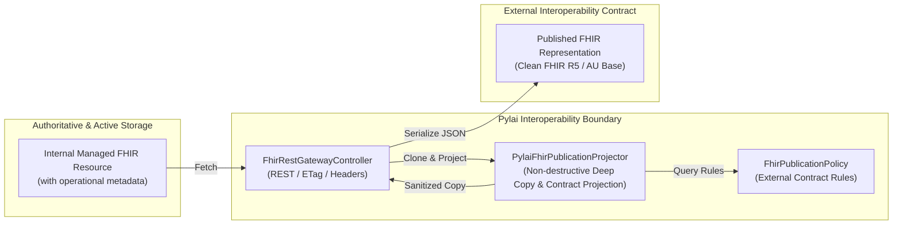

Optional spending limit; leave empty for no limit: 50
Required for Goal Mode: Auto
Pause for plan review before starting the goal: No

**Requirements**

**Overview & Goals**  
Resolve **MAT-03** from the Harmonia Architectural Axiom Conformance Assessment by enforcing the **Pylai External FHIR Publication Boundary** (conforming to **AX-05 Information Authority & Lifecycle** and **AX-13 Egress & Publication Boundary**).

Harmonia internally manages FHIR representations with operational metadata required for governance, authority, concurrency, resilience, and provenance. However, external interoperability contracts require that Harmonia-private operational semantics do not leak across the system boundary. Pylai is the interoperability membrane responsible for constructing externally publishable FHIR representations governed by an explicit **interoperability publication contract** rather than exposing or destructively altering the internally managed representations.

**Scope**
- **In Scope**:
    - Implement a dedicated, fail-closed, non-destructive publication boundary projector (`PylaiFhirPublicationProjector`) and contract policy (`FhirPublicationPolicy`) in `pylai-fhir-registry`.
    - Define publication permission based on an explicit **external interoperability contract** (permitting standard FHIR core, jurisdictional/IG extensions, and contract-approved interoperability metadata while excluding Harmonia operational mechanics).
    - Enforce publication projection on all Pylai FHIR REST managed-resource egress paths:
        - FHIR `READ` (`GET /{resourceType}/{id}`);
        - FHIR `SEARCH` (`GET /{resourceType}`) returning `Bundle`;
        - FHIR `CREATE`/`UPDATE` change request responses returning `Task` (HTTP 202 Accepted);
        - FHIR `Task` status polling (`GET /Task/{id}`).
    - Strip Harmonia-private operational metadata and extensions (authoritative persistence versioning, Mneme active-state tokens, Praxis execution identifiers, internal checkpoints, transient security context markers).
    - Filter `meta.security` to retain contract-permitted clinical confidentiality/security labels (e.g., HL7 v3 Confidentiality) while stripping Harmonia operational security labels (`http://harmonia.fhirfactory.net/security/*`).
    - Rely on generic, recursive element-level extension filtering to remove operational metadata across all resources (including `Task`) without ad-hoc resource-type switching.
    - Document the scope of synthetic/gateway-generated responses (`CapabilityStatement`, `OperationOutcome`).
    - Add comprehensive unit, web-layer integration, and ArchUnit architecture tests demonstrating contract-driven publication rules.

- **Out of Scope**:
    - Modifying internal persistence schemas or JPA entities in `mnemosyne-clinical` / `mnemosyne-operations`.
    - Redesigning Mneme active-state caching or Pragma envelope structures.
    - Creating new Architecture Decision Records (ADRs).

**Functional Requirements**
1. **Contract-Driven Publication**: Publishability is defined by explicit contract rules rather than mere URI namespace ownership. Elements, extensions, profiles, and security tags are emitted only if permitted by the applicable external interoperability contract.
2. **Non-Destructive Projection**: Publication projection must never mutate the in-memory or persisted source resource returned from Mneme/Mnemosyne. A deep copy must be projected for serialization.
3. **Fail-Closed Filtering**: Any extension or metadata not explicitly permitted by the active publication contract must be excluded by default.
4. **Semantically-Private Operational Metadata Exclusion**: Known Harmonia operational metadata (authoritative state markers, Mneme coordination tokens, Praxis IDs, checkpoint extensions, operational security labels) must be stripped across all resource types.
5. **Legitimate Interoperability Extension Retention**: Extensions permitted by the external contract (e.g., FHIR core extensions, AU Base / AU Core extensions, explicitly approved third-party or Harmonia interoperability extensions) must be preserved.
6. **Clinical Security Label Preservation**: Clinical confidentiality tags (`meta.security`) defined in the contract (e.g., HL7 v3 `http://terminology.hl7.org/CodeSystem/v3-Confidentiality`) must remain intact; operational security tags must be stripped.
7. **Preservation of Standard FHIR Semantics**: `meta.versionId`, `meta.lastUpdated`, `meta.profile`, HTTP `ETag`, and `Last-Modified` headers must be preserved according to FHIR REST standards.
8. **Searchset Bundle Entry Projection**: When a Searchset Bundle is emitted, every resource inside `entry.resource` must be projected according to the publication contract.

**Non-Functional Requirements**
- **Performance**: High-efficiency deep copying and traversal using HAPI FHIR native facilities with minimal allocation overhead.
- **Security**: Default-deny / fail-closed publication boundary preventing accidental PHI or infrastructure metadata leakage (Invariant 9).
- **Architectural Conformance**: Full compliance with Harmonia Architectural Axioms (AX-04, AX-05, AX-13) and AGENTS.md Invariant 9.

**Technical Design**

**Current Implementation**  
In the current implementation:
- `FhirRestGatewayController` in `pylai-fhir-registry` handles external REST calls (`readResource`, `searchResources`, `createResource`, `updateResource`, `getTaskStatus`).
- Resources fetched from `FhirStorageService` or generated from `PragmaCacheService` via `PragmaFhirConverter.toFhirTask(...)` are serialized directly using `fhirContext.newJsonParser().encodeResourceToString(...)`.
- This causes internal operational metadata to leak across the external boundary:
    - `meta.security` entries carrying `http://harmonia.fhirfactory.net/security/labels` (`PROVIDER_REGISTRY`, `INTERNAL`).
    - Task resources carrying operational extensions (`http://fhirfactory.net/harmonia/task/security/*`, `.../checkpoint*`, `.../praxis-id`, `.../metadata/*`).
    - Internal versioning/authoritative metadata on `meta.extension`.

**HAPI-Native Capability Assessment**  
Before designing custom filtering machinery, HAPI FHIR facilities were evaluated:
1. **Resource Deep Copying**: HAPI's `Resource.copy()` provides native deep copying of the full in-memory AST / object graph for any FHIR R5 resource (`IBaseResource`). Reusing `Resource.copy()` ensures the managed source instance in Mneme/Mnemosyne memory is never modified.
2. **Extension & Element Traversal**: HAPI FHIR models implement `IBaseHasExtensions` and `IBaseElement`. Recursive traversal of `Resource.getExtension()` and child `Element.getExtension()` allows clean inspection and removal of unapproved extensions without custom JSON string parsing.
3. **Response Interceptor Processing**: HAPI FHIR server interceptors (`IServerInterceptor`, `@Hook(Pointcut.SERVER_OUTGOING_RESPONSE)`) were evaluated. However, Pylai FHIR Registry is structured as a Spring Boot application using Spring MVC `@RestController` (`FhirRestGatewayController`) rather than a standalone HAPI `RestfulServer` servlet. In this Spring-native architecture, injecting a dedicated `PylaiFhirPublicationProjector` directly into the gateway controller provides an explicit, testable publication choke point that enforces AX-13 while utilizing HAPI's `Resource.copy()` and serialization machinery.
4. **Serialization**: HAPI `FhirContext.newJsonParser().encodeResourceToString(...)` handles standard-compliant JSON serialization.
5. **Bundle Traversal**: HAPI's `Bundle.getEntry()` / `BundleEntryComponent` provides native traversal and projection of constituent resources in searchsets.
6. **Response Metadata**: HTTP `ETag` and `Last-Modified` headers derive directly from HAPI's `meta.versionId` and `meta.lastUpdated`.

**Generated Response Scope Analysis**
- **`CapabilityStatement`**: Generated purely on-the-fly by `CapabilityStatementProvider.buildCapabilityStatement()` from static structural definitions of supported interactions and search parameters. It contains no managed clinical resource state, no Mneme/Mnemosyne cache entries, and no Harmonia operational metadata.
- **`OperationOutcome`**: Generated on-the-fly by `FhirGatewayExceptionHandler` for HTTP error responses (400, 401, 403, 404, 410, 422). It contains only standard FHIR `IssueSeverity`, `IssueType`, and diagnostic error messages.
- **Scope Boundary**: Neither `CapabilityStatement` nor `OperationOutcome` contain Harmonia-managed resource state or operational metadata. Therefore, they do not require routing through the managed-resource publication projector. The publication projector is strictly applied to managed resources and change-request Task representations emitted via READ, SEARCH, CREATE, UPDATE, and Task polling.

**Key Decisions**
1. **Contract-Driven Publication Policy (`FhirPublicationPolicy`)**:
    - *Decision*: Model publication rules via `FhirPublicationPolicy` representing an explicit interoperability contract, rather than a hard-coded namespace allowlist.
    - *Rationale*: A publication contract defines what is permitted by the external agreement. An extension, profile, or security tag is published only if permitted by the contract. This supports standard FHIR core (`http://hl7.org/fhir/*`), Australian jurisdictional extensions (`http://hl7.org.au/fhir/*`), contract-approved third-party extensions, and contract-approved Harmonia interoperability extensions, while excluding unknown and internal operational extensions.
2. **Contract-Driven Security Label Evaluation**:
    - *Decision*: `FhirPublicationPolicy.isSecurityLabelPermitted(Coding)` checks coding system and values against contract permissions (e.g. permitting HL7 v3 `http://terminology.hl7.org/CodeSystem/v3-Confidentiality` codes `N`, `R`, `V`, `U`, while rejecting Harmonia operational security labels `http://harmonia.fhirfactory.net/security/*`).
    - *Rationale*: Evaluates security metadata semantically rather than assuming all HL7 labels are good and all custom labels are bad.
3. **Generic Recursive Projection (Minimising Resource-Specific Logic)**:
    - *Decision*: Implement a single, generic publication projection mechanism that traverses `meta` and all `Element` extensions recursively.
    - *Rationale*: Generic contract-driven extension filtering already excludes internal operational metadata (`praxis-id`, `checkpoint*`, security parameters) on `Task` and any other resource type without needing custom procedural resource switches (`instanceof Task`).
4. **HAPI-Native Deep Cloning**:
    - *Decision*: Use HAPI FHIR `Resource.copy()` to generate an independent in-memory copy before applying publication transformations.
    - *Rationale*: Guarantees source resources in Mneme cache and Mnemosyne persistence are never mutated.

**Architecture Diagram**

**Proposed Changes & Component Details**

**1. `net.fhirfactory.harmonia.pylai.fhir.publication.FhirPublicationPolicy`**  
Defines the external publication contract:
- `isExtensionPermitted(String url)`: Returns `true` if the extension URL is explicitly permitted by the active contract (e.g. FHIR core, AU Base/Core, permitted third-party/Harmonia interoperability extensions). Returns `false` for unknown or operational extensions.
- `isSecurityLabelPermitted(Coding coding)`: Returns `true` if the security coding system and code represent contract-approved clinical security/confidentiality metadata; returns `false` for Harmonia operational security tags.
- `isProfilePermitted(String profileUrl)`: Evaluates conformance profiles against the contract.
- Provides default contract configuration for FHIR R5 / AU Base interoperability.

**2. `net.fhirfactory.harmonia.pylai.fhir.publication.PylaiFhirPublicationProjector`**  
Core projection service:
- `projectForPublication(IBaseResource source)`: Non-destructively projects resources for external egress.
    - If `source instanceof Bundle`: invokes `projectBundle((Bundle) source)`.
    - If `source instanceof Resource`: invokes `projectResource((Resource) source)`.
- `projectResource(Resource source)`:
    - Calls `source.copy()` to produce an isolated in-memory deep clone.
    - Sanitizes `meta`: retains `versionId`, `lastUpdated`, `profile` (filtered), `tag`; filters `meta.extension` and `meta.security` using `FhirPublicationPolicy`.
    - Recursively cleans extensions on the resource root and all child `Element` nodes against `FhirPublicationPolicy`.
- `projectBundle(Bundle sourceBundle)`:
    - Calls `sourceBundle.copy()`.
    - Iterates over `bundle.getEntry()`, projecting each constituent `entry.getResource()`.

**3. `net.fhirfactory.harmonia.pylai.fhir.controller.FhirRestGatewayController`**
- Injects `PylaiFhirPublicationProjector`.
- In `readResource`: projects the fetched resource before serialization.
- In `searchResources`: projects the constructed search `Bundle` before serialization.
- In `createResource` / `updateResource`: projects the returned `Task` before serialization.
- In `getTaskStatus`: projects the retrieved `Task` before serialization.
- Preserves HTTP `ETag` and `Last-Modified` derived from resource metadata.

**File Structure Changes**
- **New Files**:
    - `pylai/pylai-fhir-registry/src/main/java/net/fhirfactory/harmonia/pylai/fhir/publication/FhirPublicationPolicy.java`
    - `pylai/pylai-fhir-registry/src/main/java/net/fhirfactory/harmonia/pylai/fhir/publication/PylaiFhirPublicationProjector.java`
    - `pylai/pylai-fhir-registry/src/test/java/net/fhirfactory/harmonia/pylai/fhir/publication/PylaiFhirPublicationProjectorTest.java`
    - `paradeigma/paradeigma-test/src/test/java/net/fhirfactory/harmonia/paradeigma/test/arch/PylaiPublicationBoundaryArchitectureTest.java`
- **Modified Files**:
    - `pylai/pylai-fhir-registry/src/main/java/net/fhirfactory/harmonia/pylai/fhir/controller/FhirRestGatewayController.java`
    - `pylai/pylai-fhir-registry/src/test/java/net/fhirfactory/harmonia/pylai/fhir/controller/FhirRestGatewayControllerTest.java`

**Testing**

**Validation Approach**  
Automated tests will validate the publication boundary at unit, controller integration, end-to-end, and architectural rule levels, proving that publication is contract-driven rather than merely namespace-driven.

**Key Scenarios**
1. **Contract-Driven Extension Filtering**:
    - Known Harmonia-private operational extension (e.g. `http://harmonia.fhirfactory.net/structure/authoritative-version`, `http://fhirfactory.net/harmonia/task/praxis-id`) -> **excluded**.
    - Explicitly permitted standard extension (e.g. `http://hl7.org/fhir/StructureDefinition/patient-birthPlace`) -> **retained**.
    - Explicitly permitted AU jurisdictional extension (e.g. `http://hl7.org.au/fhir/StructureDefinition/au-practitioner-role-code`) -> **retained**.
    - Explicitly permitted non-HL7 third-party extension configured in contract -> **retained**.
    - Explicitly permitted Harmonia-authored interoperability extension configured in contract -> **retained**.
    - Unknown / unapproved extension -> **excluded** (fail-closed).
2. **Contract-Driven Security Label Filtering**:
    - Permitted clinical security label (e.g. HL7 v3 `http://terminology.hl7.org/CodeSystem/v3-Confidentiality` code `R`) in `meta.security` -> **retained**.
    - Harmonia operational security label (e.g. `http://harmonia.fhirfactory.net/security/labels` code `INTERNAL`) in `meta.security` -> **excluded**.
3. **Non-Destructive Projection**:
    - Verify that projecting an internal `Practitioner` or `Task` resource does not modify the source instance in any way (the source retains its original `meta.security`, internal extensions, and elements in memory/cache).
4. **Generic Task Projection**:
    - Verify that Task change submission responses and polling responses are cleansed of internal execution context (`praxis-id`, `checkpoint*`, security markers) via generic recursive extension filtering without breaking standard FHIR Task attributes (status, intent, for, execution period, output).
5. **REST Gateway Ingress/Egress Flows**:
    - `GET /Practitioner/{id}` returns the projected resource without internal metadata.
    - `GET /Practitioner?name=...` returns a searchset `Bundle` where all constituent entries are projected.
    - `POST /Practitioner` (202 Accepted) and `GET /Task/{id}` return projected `Task` resources without internal operational context.
    - HTTP caching and concurrency headers (`ETag`, `Last-Modified`) continue to derive correctly from `meta.versionId` and `meta.lastUpdated`.

**Architectural Invariant Validation**
- `PylaiPublicationBoundaryArchitectureTest`: ArchUnit test enforcing that Pylai is the sole external publication membrane and complies with AX-05 and AX-13.
- `ProviderRegistryCrossCapabilityE2ETest`: Cross-capability test passing with end-to-end assurance.

**Delivery Steps**

*** Step 1: implement-pylai-fhir-publication-projector**  
Implement the contract-driven publication boundary projector and policy in `pylai-fhir-registry` to project internally managed FHIR resources into clean external representations without modifying the source instance.

- Create `FhirPublicationPolicy` in package `net.fhirfactory.harmonia.pylai.fhir.publication` defining the external interoperability contract (contract-based extension rules, clinical security label validation, and conformance profile filtering).
- Create `PylaiFhirPublicationProjector` in package `net.fhirfactory.harmonia.pylai.fhir.publication`.
- Implement non-destructive deep cloning using HAPI FHIR `Resource.copy()` so source resources in Mneme/Mnemosyne memory/cache remain untouched.
- Implement generic recursive extension filtering across all resource elements using `FhirPublicationPolicy` (fail-closed: standard FHIR, AU Base, approved third-party and Harmonia interoperability extensions retained; Harmonia-private operational and unknown extensions excluded).
- Implement `meta.security` filtering via `FhirPublicationPolicy`: preserve standard clinical confidentiality codes (`http://terminology.hl7.org/CodeSystem/v3-Confidentiality`) while stripping Harmonia operational security labels (`http://harmonia.fhirfactory.net/security/*`).
- Implement Bundle projection: recursively project each constituent resource within a `Bundle` (e.g., searchset, collection).
- Add comprehensive unit tests in `PylaiFhirPublicationProjectorTest` covering contract semantics (operational excluded, standard/AU/third-party/Harmonia-contract retained, unknown excluded, clinical security retained, non-mutation verified).

**Step 2: integrate-publication-projector-into-pylai-rest-gateway**  
Integrate the publication projector into the Pylai FHIR REST gateway controller so all external HTTP egress paths for managed resources are governed by the publication boundary.

- Update `FhirRestGatewayController` to inject `PylaiFhirPublicationProjector`.
- Route single-resource READ responses (`GET /Practitioner/{id}`, `GET /fhir/Practitioner/{id}`) through `publicationProjector.projectForPublication(...)` before serialization.
- Route multi-resource SEARCH responses (`GET /Practitioner`, `GET /fhir/Practitioner`) through `publicationProjector.projectForPublication(...)` for the entire response Bundle before serialization.
- Route asynchronous change submission responses (`POST /Practitioner`, `PUT /Practitioner/{id}`) returning FHIR `Task` representations through the publication projector.
- Route task polling responses (`GET /Task/{id}`, `GET /fhir/Task/{id}`) through the publication projector.
- Ensure HTTP caching and concurrency headers (`ETag`, `Last-Modified`) continue to derive correctly from `meta.versionId` and `meta.lastUpdated`.
- Document why purely synthetic responses (`CapabilityStatement`, `OperationOutcome`) do not contain managed metadata and do not require managed-resource projection.
- Update `FhirRestGatewayControllerTest` with web-layer tests verifying that external responses contain zero Harmonia-private metadata while preserving standard metadata and HTTP headers.

**Step 3: add-architecture-tests-and-verify-e2e-suite**  
Add repository-level architectural invariants and verify end-to-end regression suites across all modules.

- Add `PylaiPublicationBoundaryArchitectureTest` in `paradeigma-test` enforcing Pylai external publication encapsulation and AX-13 conformance.
- Verify end-to-end scenario tests in `ProviderRegistryCrossCapabilityE2ETest` to ensure full integration with Themis security evaluation, Ergon execution, and Mnemosyne storage.
- Execute the full ArchUnit architecture test suite (`mvn test -pl paradeigma/paradeigma-test -am -Dtest="*ArchitectureTest"`).
- Execute all tests across `pylai-fhir-registry` and dependent submodules to guarantee regression-free delivery.

IMPLEMENTATION

**Task description**  
Fully complete step 1.

**Feedback**  
Additionally verify repository evidence around FHIR `meta.tag`: determine whether it currently contains or can contain Harmonia-private operational metadata. If evidence shows operational/private tag usage, apply the same contract-driven publication policy to tags; otherwise preserve tags and note the evidence.

Architectural emphasis: publication is contract-driven rather than namespace-driven; unknown/unapproved extensions fail closed; use one generic recursive projection mechanism rather than resource-type switches unless the external contract truly requires special handling.

For generated responses, align with the approved plan: `CapabilityStatement` and `OperationOutcome` should only be discussed/documented to the extent needed for boundary scope, not forced through the managed-resource projector unless evidence requires it.

Execution efficiency is important. Start with narrow/incremental test commands and short timeouts (60-120s per command). If you run multiple tests, prefer focused module/test execution, parallelism where supported, and report the exact commands/timeouts used plus any useful project quirks in Discoveries for future steps.

**Constraints**  
DO NOT run git commit, git push, git checkout, create branches, or create Pull Requests. Commits and the PR are handled by the git workflow (`git_init` / auto-commit / `git_pr`). Focus ONLY on code changes.

Code is Ready

**Implementation Summary: Step 1 (implement-pylai-fhir-publication-projector)**

**1. Architectural Overview & Context**  
In accordance with Harmonia Architectural Axioms (**AX-05 Information Authority & Lifecycle**, **AX-13 Egress & Publication Boundary**) and **Invariant 9** (External Interoperability Boundary), Pylai is the interoperability membrane responsible for constructing externally publishable FHIR representations without mutating internally managed representations.

We implemented a dedicated, contract-driven, fail-closed publication boundary projector and policy in `pylai-fhir-registry`:

1. **`net.fhirfactory.harmonia.pylai.fhir.publication.FhirPublicationPolicy`**:
    - Represents an explicit external interoperability contract.
    - Evaluates extensions (`isExtensionPermitted`): permits standard FHIR core extensions (`http://hl7.org/fhir/*`), Australian jurisdictional extensions (`http://hl7.org.au/fhir/*`, `http://ns.electronichealth.net.au/*`), and contract-approved third-party or Harmonia interoperability extensions; rejects Harmonia-private operational extensions (`http://harmonia.fhirfactory.net/*`, `http://fhirfactory.net/harmonia/*`, `http://fhirfactory.net/hie/*`) and unknown extensions by default (fail-closed).
    - Evaluates security labels (`isSecurityLabelPermitted`): preserves standard clinical confidentiality labels (`http://terminology.hl7.org/CodeSystem/v3-Confidentiality` codes `U`, `L`, `M`, `N`, `R`, `V`) and contract-approved security labels; strips Harmonia operational security labels (`http://harmonia.fhirfactory.net/security/*`).
    - Evaluates conformance profiles (`isProfilePermitted`) and tags (`isTagPermitted`): permits standard/approved profiles and tags while excluding Harmonia operational systems.
    - Provides fluent `Builder` API for customizing interoperability contracts.

2. **`net.fhirfactory.harmonia.pylai.fhir.publication.PylaiFhirPublicationProjector`**:
    - Performs non-destructive deep cloning using HAPI FHIR native `Resource.copy()` and `Bundle.copy()` to ensure source instances in Mneme cache and Mnemosyne storage memory remain 100% untouched.
    - Applies generic recursive element traversal across `Base.children()`, sanitizing root and child element extensions (e.g., `DomainResource`, `Element`, `BackboneElement`, `Extension`), contained resources, and `meta` without ad-hoc resource-type switching.
    - For `Bundle`, deep-copies the bundle and recursively projects each constituent `entry.resource`.

3. **Repository Evidence on `meta.tag`**:
    - Investigation showed `meta.tag` is currently not used in Harmonia internally. However, `FhirPublicationPolicy.isTagPermitted` and `PylaiFhirPublicationProjector.sanitizeMeta` were implemented to enforce the same contract-driven boundary rules (stripping Harmonia-operational tag systems and permitting standard/contract-approved tags).

4. **Synthetic Responses (`CapabilityStatement`, `OperationOutcome`) Boundary Note**:
    - `CapabilityStatement` (generated statically by `CapabilityStatementProvider`) and `OperationOutcome` (generated on-the-fly by `FhirGatewayExceptionHandler`) contain zero Harmonia-managed resource state or operational metadata, delineating them from managed resources requiring projection.

**2. Files Added**
- `pylai/pylai-fhir-registry/src/main/java/net/fhirfactory/harmonia/pylai/fhir/publication/FhirPublicationPolicy.java`
- `pylai/pylai-fhir-registry/src/main/java/net/fhirfactory/harmonia/pylai/fhir/publication/PylaiFhirPublicationProjector.java`
- `pylai/pylai-fhir-registry/src/test/java/net/fhirfactory/harmonia/pylai/fhir/publication/PylaiFhirPublicationProjectorTest.java`

**3. Test Validation**
- Executed `mvn test -pl pylai/pylai-fhir-registry` (41 tests, 0 failures, 0 errors in ~5.2s).
- Executed repository-wide architecture tests `mvn test -pl paradeigma/paradeigma-test -am -Dtest="*ArchitectureTest"` (76 tests, 0 failures in ~18s).

---

**Discoveries for future steps**
- **Execution commands & speed**: `mvn test -pl pylai/pylai-fhir-registry` runs in ~5s; architecture tests `mvn test -pl paradeigma/paradeigma-test -am -Dtest="*ArchitectureTest" -Dsurefire.failIfNoSpecifiedTests=false` run in ~18s.
- **Dependencies**: `pylai-fhir-registry` does not and should not depend on `hestia/mneme-cluster` (preserving Invariant 8 / module layering).
- **HAPI FHIR R5 Traversal**: `Base.children()` and `Property.getValues()` cleanly support generic recursive AST traversal across any FHIR R5 resource and its element hierarchy.

IMPLEMENTATION REVIEW

**Task description**  
Fully review step 1.

**Feedback**  
Please focus on architectural correctness and real contract semantics rather than style. Check especially:
- whether publication policy is truly contract-driven instead of just disguised namespace allowlisting;
- whether recursive projection is generic and non-destructive;
- whether `meta.security`, `meta.profile`, and `meta.tag` handling matches the approved boundary rules;
- whether the new tests actually prove contract semantics, fail-closed behavior, and source non-mutation;
- whether any accidental dependency/layering issues were introduced.

Implementation Approved

**Verification**
- **Files present & correct**: `FhirPublicationPolicy.java` and `PylaiFhirPublicationProjector.java` created in `net.fhirfactory.harmonia.pylai.fhir.publication`; unit test `PylaiFhirPublicationProjectorTest.java` added.
- **Referenced constants exist**: Verified `PragmaFhirConverter.EXTENSION_PRAXIS_ID/EXTENSION_CHECKPOINT/EXTENSION_CHECKPOINT_STAGE/EXTENSION_SECURITY_PRINCIPAL_ID/LEGACY_EXTENSION_PRAXIS_ID`, `FhirConfidentialityEnum.CONFIDENTIALITY_SYSTEM`+`fromCode()`, and `HarmoniaSecurityCodeSystem.SECURITY_LABEL_SYSTEM` (`http://harmonia.fhirfactory.net/security/labels`) all exist in Calliope and are used correctly.
- **Non-destructive projection**: Confirmed use of HAPI `Resource.copy()`/`Bundle.copy()` before any mutation; test `testProjectResourceDoesNotMutateSource` and `testProjectBundleDoesNotMutateSource` assert the source instance retains all original extensions/security labels after projection.
- **Generic recursive filtering**: `sanitizeExtensions` traverses `base.children()`/`Property.getValues()` with an identity-based `visited` guard (cycle-safe), handling `DomainResource`, `BackboneElement`, `Element` (incl. modifierExtensions), and nested `meta`. Verified generically works on `Task` (praxis-id/checkpoint/security stripped, standard `task-replaces`/`task-output-details` retained, core attributes intact) and nested elements (Identifier/HumanName/ContactPoint) — no `instanceof Task` resource switching.
- **Contract-driven semantics**: Policy combines explicit permitted URLs (contract-approved third-party/Harmonia interop), permitted prefixes (FHIR core, AU Base, AU digital health), explicit operational-prefix denial, and fail-closed default. Builder allows contract customization. Tests prove explicit-URL approval overrides namespace denial and unknown/blank/null URLs fail closed.
- **Security labels**: `isSecurityLabelPermitted` retains HL7 v3 Confidentiality (via `FhirConfidentialityEnum.fromCode`), strips `http://harmonia.fhirfactory.net/security/*`, fail-closed for unknown unless contract-permitted. Tests confirm.
- **meta.profile / meta.tag**: profile filtered contract-driven (standard/AU retained, Harmonia/unknown stripped); tags strip Harmonia operational systems, retain standard — matches approved boundary and preserves versionId/lastUpdated.
- **Bundle projection**: each `entry.resource` re-projected via `projectResource`; test confirms constituent resources sanitized while source bundle untouched.
- **Layering**: only Calliope + HAPI + Spring + commons-lang3 imports (all permitted for Pylai); no new pom dependencies; no forbidden module coupling.
- **Test execution**: `mvn test -pl pylai/pylai-fhir-registry` → BUILD SUCCESS; 16 publication tests, 0 failures/errors (~0.1s); full module suite green (~5s).

**Issues**  
None blocking.

**Notes**
- Non-blocking: the `else if (base instanceof Extension ext)` branch in `sanitizeExtensions` is unreachable dead code, because `Extension extends Element` so the preceding `Element` branch already catches Extensions (nested-extension filtering still works correctly via the Element branch — verified functionally, no behavioral gap).
- Non-blocking: `projectBundle` performs slightly redundant work — it recursively `sanitizeExtensions(copy, ...)` over the whole bundle (which already descends into entry resources) and then additionally re-copies+re-projects each `entry.resource` via `projectResource`. Result is correct and idempotent; only a minor extra allocation, acceptable for this step.
- Contract-driven profile filtering is fail-closed, so a legitimate national profile outside the default allowlist would be stripped unless added to the contract; this is consistent with the approved design and configurable via the Builder.

**Discoveries for future steps**
- `mvn test -pl pylai/pylai-fhir-registry -q` runs in ~5s; publication unit tests are pure (no Spring context) and run in <0.2s.
- `pylai-fhir-registry` already depends on Calliope (`PragmaFhirConverter`, `FhirConfidentialityEnum`, `HarmoniaSecurityCodeSystem`) — reuse these constants in Step 2 controller integration and Step 3 arch tests rather than hardcoding URIs.
- `PylaiFhirPublicationProjector` and `FhirPublicationPolicy` are both `@Component` with no-arg defaults (default contract), so Step 2 can `@Autowired` them directly into `FhirRestGatewayController`.

**Requirements**

**Overview & Goals**  
Resolve **MAT-03** from the Harmonia Architectural Axiom Conformance Assessment by enforcing the **Pylai External FHIR Publication Boundary** (conforming to **AX-05 Information Authority & Lifecycle** and **AX-13 Egress & Publication Boundary**).

Harmonia internally manages FHIR representations with operational metadata required for governance, authority, concurrency, resilience, and provenance. However, external interoperability contracts require that Harmonia-private operational semantics do not leak across the system boundary. Pylai is the interoperability membrane responsible for constructing externally publishable FHIR representations governed by an explicit **interoperability publication contract** rather than exposing or destructively altering the internally managed representations.

**Scope**
- **In Scope**:
    - Implement a dedicated, fail-closed, non-destructive publication boundary projector (`PylaiFhirPublicationProjector`) and contract policy (`FhirPublicationPolicy`) in `pylai-fhir-registry`.
    - Define publication permission based on an explicit **external interoperability contract** (permitting standard FHIR core, jurisdictional/IG extensions, and contract-approved interoperability metadata while excluding Harmonia operational mechanics).
    - Enforce publication projection on all Pylai FHIR REST managed-resource egress paths:
        - FHIR `READ` (`GET /{resourceType}/{id}`);
        - FHIR `SEARCH` (`GET /{resourceType}`) returning `Bundle`;
        - FHIR `CREATE`/`UPDATE` change request responses returning `Task` (HTTP 202 Accepted);
        - FHIR `Task` status polling (`GET /Task/{id}`).
    - Strip Harmonia-private operational metadata and extensions (authoritative persistence versioning, Mneme active-state tokens, Praxis execution identifiers, internal checkpoints, transient security context markers).
    - Filter `meta.security` to retain contract-permitted clinical confidentiality/security labels (e.g., HL7 v3 Confidentiality) while stripping Harmonia operational security labels (`http://harmonia.fhirfactory.net/security/*`).
    - Rely on generic, recursive element-level extension filtering to remove operational metadata across all resources (including `Task`) without ad-hoc resource-type switching.
    - Document the scope of synthetic/gateway-generated responses (`CapabilityStatement`, `OperationOutcome`).
    - Add comprehensive unit, web-layer integration, and ArchUnit architecture tests demonstrating contract-driven publication rules.

- **Out of Scope**:
    - Modifying internal persistence schemas or JPA entities in `mnemosyne-clinical` / `mnemosyne-operations`.
    - Redesigning Mneme active-state caching or Pragma envelope structures.
    - Creating new Architecture Decision Records (ADRs).

**Functional Requirements**
1. **Contract-Driven Publication**: Publishability is defined by explicit contract rules rather than mere URI namespace ownership. Elements, extensions, profiles, and security tags are emitted only if permitted by the applicable external interoperability contract.
2. **Non-Destructive Projection**: Publication projection must never mutate the in-memory or persisted source resource returned from Mneme/Mnemosyne. A deep copy must be projected for serialization.
3. **Fail-Closed Filtering**: Any extension or metadata not explicitly permitted by the active publication contract must be excluded by default.
4. **Semantically-Private Operational Metadata Exclusion**: Known Harmonia operational metadata (authoritative state markers, Mneme coordination tokens, Praxis IDs, checkpoint extensions, operational security labels) must be stripped across all resource types.
5. **Legitimate Interoperability Extension Retention**: Extensions permitted by the external contract (e.g., FHIR core extensions, AU Base / AU Core extensions, explicitly approved third-party or Harmonia interoperability extensions) must be preserved.
6. **Clinical Security Label Preservation**: Clinical confidentiality tags (`meta.security`) defined in the contract (e.g., HL7 v3 `http://terminology.hl7.org/CodeSystem/v3-Confidentiality`) must remain intact; operational security tags must be stripped.
7. **Preservation of Standard FHIR Semantics**: `meta.versionId`, `meta.lastUpdated`, `meta.profile`, HTTP `ETag`, and `Last-Modified` headers must be preserved according to FHIR REST standards.
8. **Searchset Bundle Entry Projection**: When a Searchset Bundle is emitted, every resource inside `entry.resource` must be projected according to the publication contract.

**Non-Functional Requirements**
- **Performance**: High-efficiency deep copying and traversal using HAPI FHIR native facilities with minimal allocation overhead.
- **Security**: Default-deny / fail-closed publication boundary preventing accidental PHI or infrastructure metadata leakage (Invariant 9).
- **Architectural Conformance**: Full compliance with Harmonia Architectural Axioms (AX-04, AX-05, AX-13) and AGENTS.md Invariant 9.

**Technical Design**

**Current Implementation**  
In the current implementation:
- `FhirRestGatewayController` in `pylai-fhir-registry` handles external REST calls (`readResource`, `searchResources`, `createResource`, `updateResource`, `getTaskStatus`).
- Resources fetched from `FhirStorageService` or generated from `PragmaCacheService` via `PragmaFhirConverter.toFhirTask(...)` are serialized directly using `fhirContext.newJsonParser().encodeResourceToString(...)`.
- This causes internal operational metadata to leak across the external boundary:
    - `meta.security` entries carrying `http://harmonia.fhirfactory.net/security/labels` (`PROVIDER_REGISTRY`, `INTERNAL`).
    - Task resources carrying operational extensions (`http://fhirfactory.net/harmonia/task/security/*`, `.../checkpoint*`, `.../praxis-id`, `.../metadata/*`).
    - Internal versioning/authoritative metadata on `meta.extension`.

**HAPI-Native Capability Assessment**  
Before designing custom filtering machinery, HAPI FHIR facilities were evaluated:
1. **Resource Deep Copying**: HAPI's `Resource.copy()` provides native deep copying of the full in-memory AST / object graph for any FHIR R5 resource (`IBaseResource`). Reusing `Resource.copy()` ensures the managed source instance in Mneme/Mnemosyne memory is never modified.
2. **Extension & Element Traversal**: HAPI FHIR models implement `IBaseHasExtensions` and `IBaseElement`. Recursive traversal of `Resource.getExtension()` and child `Element.getExtension()` allows clean inspection and removal of unapproved extensions without custom JSON string parsing.
3. **Response Interceptor Processing**: HAPI FHIR server interceptors (`IServerInterceptor`, `@Hook(Pointcut.SERVER_OUTGOING_RESPONSE)`) were evaluated. However, Pylai FHIR Registry is structured as a Spring Boot application using Spring MVC `@RestController` (`FhirRestGatewayController`) rather than a standalone HAPI `RestfulServer` servlet. In this Spring-native architecture, injecting a dedicated `PylaiFhirPublicationProjector` directly into the gateway controller provides an explicit, testable publication choke point that enforces AX-13 while utilizing HAPI's `Resource.copy()` and serialization machinery.
4. **Serialization**: HAPI `FhirContext.newJsonParser().encodeResourceToString(...)` handles standard-compliant JSON serialization.
5. **Bundle Traversal**: HAPI's `Bundle.getEntry()` / `BundleEntryComponent` provides native traversal and projection of constituent resources in searchsets.
6. **Response Metadata**: HTTP `ETag` and `Last-Modified` headers derive directly from HAPI's `meta.versionId` and `meta.lastUpdated`.

**Generated Response Scope Analysis**
- **`CapabilityStatement`**: Generated purely on-the-fly by `CapabilityStatementProvider.buildCapabilityStatement()` from static structural definitions of supported interactions and search parameters. It contains no managed clinical resource state, no Mneme/Mnemosyne cache entries, and no Harmonia operational metadata.
- **`OperationOutcome`**: Generated on-the-fly by `FhirGatewayExceptionHandler` for HTTP error responses (400, 401, 403, 404, 410, 422). It contains only standard FHIR `IssueSeverity`, `IssueType`, and diagnostic error messages.
- **Scope Boundary**: Neither `CapabilityStatement` nor `OperationOutcome` contain Harmonia-managed resource state or operational metadata. Therefore, they do not require routing through the managed-resource publication projector. The publication projector is strictly applied to managed resources and change-request Task representations emitted via READ, SEARCH, CREATE, UPDATE, and Task polling.

**Key Decisions**
1. **Contract-Driven Publication Policy (`FhirPublicationPolicy`)**:
    - *Decision*: Model publication rules via `FhirPublicationPolicy` representing an explicit interoperability contract, rather than a hard-coded namespace allowlist.
    - *Rationale*: A publication contract defines what is permitted by the external agreement. An extension, profile, or security tag is published only if permitted by the contract. This supports standard FHIR core (`http://hl7.org/fhir/*`), Australian jurisdictional extensions (`http://hl7.org.au/fhir/*`), contract-approved third-party extensions, and contract-approved Harmonia interoperability extensions, while excluding unknown and internal operational extensions.
2. **Contract-Driven Security Label Evaluation**:
    - *Decision*: `FhirPublicationPolicy.isSecurityLabelPermitted(Coding)` checks coding system and values against contract permissions (e.g. permitting HL7 v3 `http://terminology.hl7.org/CodeSystem/v3-Confidentiality` codes `N`, `R`, `V`, `U`, while rejecting Harmonia operational security labels `http://harmonia.fhirfactory.net/security/*`).
    - *Rationale*: Evaluates security metadata semantically rather than assuming all HL7 labels are good and all custom labels are bad.
3. **Generic Recursive Projection (Minimising Resource-Specific Logic)**:
    - *Decision*: Implement a single, generic publication projection mechanism that traverses `meta` and all `Element` extensions recursively.
    - *Rationale*: Generic contract-driven extension filtering already excludes internal operational metadata (`praxis-id`, `checkpoint*`, security parameters) on `Task` and any other resource type without needing custom procedural resource switches (`instanceof Task`).
4. **HAPI-Native Deep Cloning**:
    - *Decision*: Use HAPI FHIR `Resource.copy()` to generate an independent in-memory copy before applying publication transformations.
    - *Rationale*: Guarantees source resources in Mneme cache and Mnemosyne persistence are never mutated.

**Architecture Diagram**

**Proposed Changes & Component Details**

**1. `net.fhirfactory.harmonia.pylai.fhir.publication.FhirPublicationPolicy`**  
Defines the external publication contract:
- `isExtensionPermitted(String url)`: Returns `true` if the extension URL is explicitly permitted by the active contract (e.g. FHIR core, AU Base/Core, permitted third-party/Harmonia interoperability extensions). Returns `false` for unknown or operational extensions.
- `isSecurityLabelPermitted(Coding coding)`: Returns `true` if the security coding system and code represent contract-approved clinical security/confidentiality metadata; returns `false` for Harmonia operational security tags.
- `isProfilePermitted(String profileUrl)`: Evaluates conformance profiles against the contract.
- Provides default contract configuration for FHIR R5 / AU Base interoperability.

**2. `net.fhirfactory.harmonia.pylai.fhir.publication.PylaiFhirPublicationProjector`**  
Core projection service:
- `projectForPublication(IBaseResource source)`: Non-destructively projects resources for external egress.
    - If `source instanceof Bundle`: invokes `projectBundle((Bundle) source)`.
    - If `source instanceof Resource`: invokes `projectResource((Resource) source)`.
- `projectResource(Resource source)`:
    - Calls `source.copy()` to produce an isolated in-memory deep clone.
    - Sanitizes `meta`: retains `versionId`, `lastUpdated`, `profile` (filtered), `tag`; filters `meta.extension` and `meta.security` using `FhirPublicationPolicy`.
    - Recursively cleans extensions on the resource root and all child `Element` nodes against `FhirPublicationPolicy`.
- `projectBundle(Bundle sourceBundle)`:
    - Calls `sourceBundle.copy()`.
    - Iterates over `bundle.getEntry()`, projecting each constituent `entry.getResource()`.

**3. `net.fhirfactory.harmonia.pylai.fhir.controller.FhirRestGatewayController`**
- Injects `PylaiFhirPublicationProjector`.
- In `readResource`: projects the fetched resource before serialization.
- In `searchResources`: projects the constructed search `Bundle` before serialization.
- In `createResource` / `updateResource`: projects the returned `Task` before serialization.
- In `getTaskStatus`: projects the retrieved `Task` before serialization.
- Preserves HTTP `ETag` and `Last-Modified` derived from resource metadata.

**File Structure Changes**
- **New Files**:
    - `pylai/pylai-fhir-registry/src/main/java/net/fhirfactory/harmonia/pylai/fhir/publication/FhirPublicationPolicy.java`
    - `pylai/pylai-fhir-registry/src/main/java/net/fhirfactory/harmonia/pylai/fhir/publication/PylaiFhirPublicationProjector.java`
    - `pylai/pylai-fhir-registry/src/test/java/net/fhirfactory/harmonia/pylai/fhir/publication/PylaiFhirPublicationProjectorTest.java`
    - `paradeigma/paradeigma-test/src/test/java/net/fhirfactory/harmonia/paradeigma/test/arch/PylaiPublicationBoundaryArchitectureTest.java`
- **Modified Files**:
    - `pylai/pylai-fhir-registry/src/main/java/net/fhirfactory/harmonia/pylai/fhir/controller/FhirRestGatewayController.java`
    - `pylai/pylai-fhir-registry/src/test/java/net/fhirfactory/harmonia/pylai/fhir/controller/FhirRestGatewayControllerTest.java`

**Testing**

**Validation Approach**  
Automated tests will validate the publication boundary at unit, controller integration, end-to-end, and architectural rule levels, proving that publication is contract-driven rather than merely namespace-driven.

**Key Scenarios**
1. **Contract-Driven Extension Filtering**:
    - Known Harmonia-private operational extension (e.g. `http://harmonia.fhirfactory.net/structure/authoritative-version`, `http://fhirfactory.net/harmonia/task/praxis-id`) -> **excluded**.
    - Explicitly permitted standard extension (e.g. `http://hl7.org/fhir/StructureDefinition/patient-birthPlace`) -> **retained**.
    - Explicitly permitted AU jurisdictional extension (e.g. `http://hl7.org.au/fhir/StructureDefinition/au-practitioner-role-code`) -> **retained**.
    - Explicitly permitted non-HL7 third-party extension configured in contract -> **retained**.
    - Explicitly permitted Harmonia-authored interoperability extension configured in contract -> **retained**.
    - Unknown / unapproved extension -> **excluded** (fail-closed).
2. **Contract-Driven Security Label Filtering**:
    - Permitted clinical security label (e.g. HL7 v3 `http://terminology.hl7.org/CodeSystem/v3-Confidentiality` code `R`) in `meta.security` -> **retained**.
    - Harmonia operational security label (e.g. `http://harmonia.fhirfactory.net/security/labels` code `INTERNAL`) in `meta.security` -> **excluded**.
3. **Non-Destructive Projection**:
    - Verify that projecting an internal `Practitioner` or `Task` resource does not modify the source instance in any way (the source retains its original `meta.security`, internal extensions, and elements in memory/cache).
4. **Generic Task Projection**:
    - Verify that Task change submission responses and polling responses are cleansed of internal execution context (`praxis-id`, `checkpoint*`, security markers) via generic recursive extension filtering without breaking standard FHIR Task attributes (status, intent, for, execution period, output).
5. **REST Gateway Ingress/Egress Flows**:
    - `GET /Practitioner/{id}` returns the projected resource without internal metadata.
    - `GET /Practitioner?name=...` returns a searchset `Bundle` where all constituent entries are projected.
    - `POST /Practitioner` (202 Accepted) and `GET /Task/{id}` return projected `Task` resources without internal operational context.
    - HTTP caching and concurrency headers (`ETag`, `Last-Modified`) continue to derive correctly from `meta.versionId` and `meta.lastUpdated`.

**Architectural Invariant Validation**
- `PylaiPublicationBoundaryArchitectureTest`: ArchUnit test enforcing that Pylai is the sole external publication membrane and complies with AX-05 and AX-13.
- `ProviderRegistryCrossCapabilityE2ETest`: Cross-capability test passing with end-to-end assurance.

**Delivery Steps**

**✓ Step 1: implement-pylai-fhir-publication-projector**  
Implement the contract-driven publication boundary projector and policy in `pylai-fhir-registry` to project internally managed FHIR resources into clean external representations without modifying the source instance.

- Create `FhirPublicationPolicy` in package `net.fhirfactory.harmonia.pylai.fhir.publication` defining the external interoperability contract (contract-based extension rules, clinical security label validation, and conformance profile filtering).
- Create `PylaiFhirPublicationProjector` in package `net.fhirfactory.harmonia.pylai.fhir.publication`.
- Implement non-destructive deep cloning using HAPI FHIR `Resource.copy()` so source resources in Mneme/Mnemosyne memory/cache remain untouched.
- Implement generic recursive extension filtering across all resource elements using `FhirPublicationPolicy` (fail-closed: standard FHIR, AU Base, approved third-party and Harmonia interoperability extensions retained; Harmonia-private operational and unknown extensions excluded).
- Implement `meta.security` filtering via `FhirPublicationPolicy`: preserve standard clinical confidentiality codes (`http://terminology.hl7.org/CodeSystem/v3-Confidentiality`) while stripping Harmonia operational security labels (`http://harmonia.fhirfactory.net/security/*`).
- Implement Bundle projection: recursively project each constituent resource within a `Bundle` (e.g., searchset, collection).
- Add comprehensive unit tests in `PylaiFhirPublicationProjectorTest` covering contract semantics (operational excluded, standard/AU/third-party/Harmonia-contract retained, unknown excluded, clinical security retained, non-mutation verified).

**Step 2: integrate-publication-projector-into-pylai-rest-gateway**  
Integrate the publication projector into the Pylai FHIR REST gateway controller so all external HTTP egress paths for managed resources are governed by the publication boundary.

- Update `FhirRestGatewayController` to inject `PylaiFhirPublicationProjector`.
- Route single-resource READ responses (`GET /Practitioner/{id}`, `GET /fhir/Practitioner/{id}`) through `publicationProjector.projectForPublication(...)` before serialization.
- Route multi-resource SEARCH responses (`GET /Practitioner`, `GET /fhir/Practitioner`) through `publicationProjector.projectForPublication(...)` for the entire response Bundle before serialization.
- Route asynchronous change submission responses (`POST /Practitioner`, `PUT /Practitioner/{id}`) returning FHIR `Task` representations through the publication projector.
- Route task polling responses (`GET /Task/{id}`, `GET /fhir/Task/{id}`) through the publication projector.
- Ensure HTTP caching and concurrency headers (`ETag`, `Last-Modified`) continue to derive correctly from `meta.versionId` and `meta.lastUpdated`.
- Document why purely synthetic responses (`CapabilityStatement`, `OperationOutcome`) do not contain managed metadata and do not require managed-resource projection.
- Update `FhirRestGatewayControllerTest` with web-layer tests verifying that external responses contain zero Harmonia-private metadata while preserving standard metadata and HTTP headers.

**Step 3: add-architecture-tests-and-verify-e2e-suite**  
Add repository-level architectural invariants and verify end-to-end regression suites across all modules.

- Add `PylaiPublicationBoundaryArchitectureTest` in `paradeigma-test` enforcing Pylai external publication encapsulation and AX-13 conformance.
- Verify end-to-end scenario tests in `ProviderRegistryCrossCapabilityE2ETest` to ensure full integration with Themis security evaluation, Ergon execution, and Mnemosyne storage.
- Execute the full ArchUnit architecture test suite (`mvn test -pl paradeigma/paradeigma-test -am -Dtest="*ArchitectureTest"`).
- Execute all tests across `pylai-fhir-registry` and dependent submodules to guarantee regression-free delivery.

**Requirements**

**Overview & Goals**  
Resolve **MAT-03** from the Harmonia Architectural Axiom Conformance Assessment by enforcing the **Pylai External FHIR Publication Boundary** (conforming to **AX-05 Information Authority & Lifecycle** and **AX-13 Egress & Publication Boundary**).

Harmonia internally manages FHIR representations with operational metadata required for governance, authority, concurrency, resilience, and provenance. However, external interoperability contracts require that Harmonia-private operational semantics do not leak across the system boundary. Pylai is the interoperability membrane responsible for constructing externally publishable FHIR representations governed by an explicit **interoperability publication contract** rather than exposing or destructively altering the internally managed representations.

**Scope**
- **In Scope**:
    - Implement a dedicated, fail-closed, non-destructive publication boundary projector (`PylaiFhirPublicationProjector`) and contract policy (`FhirPublicationPolicy`) in `pylai-fhir-registry`.
    - Define publication permission based on an explicit **external interoperability contract** (permitting standard FHIR core, jurisdictional/IG extensions, and contract-approved interoperability metadata while excluding Harmonia operational mechanics).
    - Enforce publication projection on all Pylai FHIR REST managed-resource egress paths:
        - FHIR `READ` (`GET /{resourceType}/{id}`);
        - FHIR `SEARCH` (`GET /{resourceType}`) returning `Bundle`;
        - FHIR `CREATE`/`UPDATE` change request responses returning `Task` (HTTP 202 Accepted);
        - FHIR `Task` status polling (`GET /Task/{id}`).
    - Strip Harmonia-private operational metadata and extensions (authoritative persistence versioning, Mneme active-state tokens, Praxis execution identifiers, internal checkpoints, transient security context markers).
    - Filter `meta.security` to retain contract-permitted clinical confidentiality/security labels (e.g., HL7 v3 Confidentiality) while stripping Harmonia operational security labels (`http://harmonia.fhirfactory.net/security/*`).
    - Rely on generic, recursive element-level extension filtering to remove operational metadata across all resources (including `Task`) without ad-hoc resource-type switching.
    - Document the scope of synthetic/gateway-generated responses (`CapabilityStatement`, `OperationOutcome`).
    - Add comprehensive unit, web-layer integration, and ArchUnit architecture tests demonstrating contract-driven publication rules.

- **Out of Scope**:
    - Modifying internal persistence schemas or JPA entities in `mnemosyne-clinical` / `mnemosyne-operations`.
    - Redesigning Mneme active-state caching or Pragma envelope structures.
    - Creating new Architecture Decision Records (ADRs).

**Functional Requirements**
1. **Contract-Driven Publication**: Publishability is defined by explicit contract rules rather than mere URI namespace ownership. Elements, extensions, profiles, and security tags are emitted only if permitted by the applicable external interoperability contract.
2. **Non-Destructive Projection**: Publication projection must never mutate the in-memory or persisted source resource returned from Mneme/Mnemosyne. A deep copy must be projected for serialization.
3. **Fail-Closed Filtering**: Any extension or metadata not explicitly permitted by the active publication contract must be excluded by default.
4. **Semantically-Private Operational Metadata Exclusion**: Known Harmonia operational metadata (authoritative state markers, Mneme coordination tokens, Praxis IDs, checkpoint extensions, operational security labels) must be stripped across all resource types.
5. **Legitimate Interoperability Extension Retention**: Extensions permitted by the external contract (e.g., FHIR core extensions, AU Base / AU Core extensions, explicitly approved third-party or Harmonia interoperability extensions) must be preserved.
6. **Clinical Security Label Preservation**: Clinical confidentiality tags (`meta.security`) defined in the contract (e.g., HL7 v3 `http://terminology.hl7.org/CodeSystem/v3-Confidentiality`) must remain intact; operational security tags must be stripped.
7. **Preservation of Standard FHIR Semantics**: `meta.versionId`, `meta.lastUpdated`, `meta.profile`, HTTP `ETag`, and `Last-Modified` headers must be preserved according to FHIR REST standards.
8. **Searchset Bundle Entry Projection**: When a Searchset Bundle is emitted, every resource inside `entry.resource` must be projected according to the publication contract.

**Non-Functional Requirements**
- **Performance**: High-efficiency deep copying and traversal using HAPI FHIR native facilities with minimal allocation overhead.
- **Security**: Default-deny / fail-closed publication boundary preventing accidental PHI or infrastructure metadata leakage (Invariant 9).
- **Architectural Conformance**: Full compliance with Harmonia Architectural Axioms (AX-04, AX-05, AX-13) and AGENTS.md Invariant 9.

**Technical Design**

**Current Implementation**  
In the current implementation:
- `FhirRestGatewayController` in `pylai-fhir-registry` handles external REST calls (`readResource`, `searchResources`, `createResource`, `updateResource`, `getTaskStatus`).
- Resources fetched from `FhirStorageService` or generated from `PragmaCacheService` via `PragmaFhirConverter.toFhirTask(...)` are serialized directly using `fhirContext.newJsonParser().encodeResourceToString(...)`.
- This causes internal operational metadata to leak across the external boundary:
    - `meta.security` entries carrying `http://harmonia.fhirfactory.net/security/labels` (`PROVIDER_REGISTRY`, `INTERNAL`).
    - Task resources carrying operational extensions (`http://fhirfactory.net/harmonia/task/security/*`, `.../checkpoint*`, `.../praxis-id`, `.../metadata/*`).
    - Internal versioning/authoritative metadata on `meta.extension`.

**HAPI-Native Capability Assessment**  
Before designing custom filtering machinery, HAPI FHIR facilities were evaluated:
1. **Resource Deep Copying**: HAPI's `Resource.copy()` provides native deep copying of the full in-memory AST / object graph for any FHIR R5 resource (`IBaseResource`). Reusing `Resource.copy()` ensures the managed source instance in Mneme/Mnemosyne memory is never modified.
2. **Extension & Element Traversal**: HAPI FHIR models implement `IBaseHasExtensions` and `IBaseElement`. Recursive traversal of `Resource.getExtension()` and child `Element.getExtension()` allows clean inspection and removal of unapproved extensions without custom JSON string parsing.
3. **Response Interceptor Processing**: HAPI FHIR server interceptors (`IServerInterceptor`, `@Hook(Pointcut.SERVER_OUTGOING_RESPONSE)`) were evaluated. However, Pylai FHIR Registry is structured as a Spring Boot application using Spring MVC `@RestController` (`FhirRestGatewayController`) rather than a standalone HAPI `RestfulServer` servlet. In this Spring-native architecture, injecting a dedicated `PylaiFhirPublicationProjector` directly into the gateway controller provides an explicit, testable publication choke point that enforces AX-13 while utilizing HAPI's `Resource.copy()` and serialization machinery.
4. **Serialization**: HAPI `FhirContext.newJsonParser().encodeResourceToString(...)` handles standard-compliant JSON serialization.
5. **Bundle Traversal**: HAPI's `Bundle.getEntry()` / `BundleEntryComponent` provides native traversal and projection of constituent resources in searchsets.
6. **Response Metadata**: HTTP `ETag` and `Last-Modified` headers derive directly from HAPI's `meta.versionId` and `meta.lastUpdated`.

**Generated Response Scope Analysis**
- **`CapabilityStatement`**: Generated purely on-the-fly by `CapabilityStatementProvider.buildCapabilityStatement()` from static structural definitions of supported interactions and search parameters. It contains no managed clinical resource state, no Mneme/Mnemosyne cache entries, and no Harmonia operational metadata.
- **`OperationOutcome`**: Generated on-the-fly by `FhirGatewayExceptionHandler` for HTTP error responses (400, 401, 403, 404, 410, 422). It contains only standard FHIR `IssueSeverity`, `IssueType`, and diagnostic error messages.
- **Scope Boundary**: Neither `CapabilityStatement` nor `OperationOutcome` contain Harmonia-managed resource state or operational metadata. Therefore, they do not require routing through the managed-resource publication projector. The publication projector is strictly applied to managed resources and change-request Task representations emitted via READ, SEARCH, CREATE, UPDATE, and Task polling.

**Key Decisions**
1. **Contract-Driven Publication Policy (`FhirPublicationPolicy`)**:
    - *Decision*: Model publication rules via `FhirPublicationPolicy` representing an explicit interoperability contract, rather than a hard-coded namespace allowlist.
    - *Rationale*: A publication contract defines what is permitted by the external agreement. An extension, profile, or security tag is published only if permitted by the contract. This supports standard FHIR core (`http://hl7.org/fhir/*`), Australian jurisdictional extensions (`http://hl7.org.au/fhir/*`), contract-approved third-party extensions, and contract-approved Harmonia interoperability extensions, while excluding unknown and internal operational extensions.
2. **Contract-Driven Security Label Evaluation**:
    - *Decision*: `FhirPublicationPolicy.isSecurityLabelPermitted(Coding)` checks coding system and values against contract permissions (e.g. permitting HL7 v3 `http://terminology.hl7.org/CodeSystem/v3-Confidentiality` codes `N`, `R`, `V`, `U`, while rejecting Harmonia operational security labels `http://harmonia.fhirfactory.net/security/*`).
    - *Rationale*: Evaluates security metadata semantically rather than assuming all HL7 labels are good and all custom labels are bad.
3. **Generic Recursive Projection (Minimising Resource-Specific Logic)**:
    - *Decision*: Implement a single, generic publication projection mechanism that traverses `meta` and all `Element` extensions recursively.
    - *Rationale*: Generic contract-driven extension filtering already excludes internal operational metadata (`praxis-id`, `checkpoint*`, security parameters) on `Task` and any other resource type without needing custom procedural resource switches (`instanceof Task`).
4. **HAPI-Native Deep Cloning**:
    - *Decision*: Use HAPI FHIR `Resource.copy()` to generate an independent in-memory copy before applying publication transformations.
    - *Rationale*: Guarantees source resources in Mneme cache and Mnemosyne persistence are never mutated.

**Architecture Diagram**

**Proposed Changes & Component Details**

**1. `net.fhirfactory.harmonia.pylai.fhir.publication.FhirPublicationPolicy`**  
Defines the external publication contract:
- `isExtensionPermitted(String url)`: Returns `true` if the extension URL is explicitly permitted by the active contract (e.g. FHIR core, AU Base/Core, permitted third-party/Harmonia interoperability extensions). Returns `false` for unknown or operational extensions.
- `isSecurityLabelPermitted(Coding coding)`: Returns `true` if the security coding system and code represent contract-approved clinical security/confidentiality metadata; returns `false` for Harmonia operational security tags.
- `isProfilePermitted(String profileUrl)`: Evaluates conformance profiles against the contract.
- Provides default contract configuration for FHIR R5 / AU Base interoperability.

**2. `net.fhirfactory.harmonia.pylai.fhir.publication.PylaiFhirPublicationProjector`**  
Core projection service:
- `projectForPublication(IBaseResource source)`: Non-destructively projects resources for external egress.
    - If `source instanceof Bundle`: invokes `projectBundle((Bundle) source)`.
    - If `source instanceof Resource`: invokes `projectResource((Resource) source)`.
- `projectResource(Resource source)`:
    - Calls `source.copy()` to produce an isolated in-memory deep clone.
    - Sanitizes `meta`: retains `versionId`, `lastUpdated`, `profile` (filtered), `tag`; filters `meta.extension` and `meta.security` using `FhirPublicationPolicy`.
    - Recursively cleans extensions on the resource root and all child `Element` nodes against `FhirPublicationPolicy`.
- `projectBundle(Bundle sourceBundle)`:
    - Calls `sourceBundle.copy()`.
    - Iterates over `bundle.getEntry()`, projecting each constituent `entry.getResource()`.

**3. `net.fhirfactory.harmonia.pylai.fhir.controller.FhirRestGatewayController`**
- Injects `PylaiFhirPublicationProjector`.
- In `readResource`: projects the fetched resource before serialization.
- In `searchResources`: projects the constructed search `Bundle` before serialization.
- In `createResource` / `updateResource`: projects the returned `Task` before serialization.
- In `getTaskStatus`: projects the retrieved `Task` before serialization.
- Preserves HTTP `ETag` and `Last-Modified` derived from resource metadata.

**File Structure Changes**
- **New Files**:
    - `pylai/pylai-fhir-registry/src/main/java/net/fhirfactory/harmonia/pylai/fhir/publication/FhirPublicationPolicy.java`
    - `pylai/pylai-fhir-registry/src/main/java/net/fhirfactory/harmonia/pylai/fhir/publication/PylaiFhirPublicationProjector.java`
    - `pylai/pylai-fhir-registry/src/test/java/net/fhirfactory/harmonia/pylai/fhir/publication/PylaiFhirPublicationProjectorTest.java`
    - `paradeigma/paradeigma-test/src/test/java/net/fhirfactory/harmonia/paradeigma/test/arch/PylaiPublicationBoundaryArchitectureTest.java`
- **Modified Files**:
    - `pylai/pylai-fhir-registry/src/main/java/net/fhirfactory/harmonia/pylai/fhir/controller/FhirRestGatewayController.java`
    - `pylai/pylai-fhir-registry/src/test/java/net/fhirfactory/harmonia/pylai/fhir/controller/FhirRestGatewayControllerTest.java`

**Testing**

**Validation Approach**  
Automated tests will validate the publication boundary at unit, controller integration, end-to-end, and architectural rule levels, proving that publication is contract-driven rather than merely namespace-driven.

**Key Scenarios**
1. **Contract-Driven Extension Filtering**:
    - Known Harmonia-private operational extension (e.g. `http://harmonia.fhirfactory.net/structure/authoritative-version`, `http://fhirfactory.net/harmonia/task/praxis-id`) -> **excluded**.
    - Explicitly permitted standard extension (e.g. `http://hl7.org/fhir/StructureDefinition/patient-birthPlace`) -> **retained**.
    - Explicitly permitted AU jurisdictional extension (e.g. `http://hl7.org.au/fhir/StructureDefinition/au-practitioner-role-code`) -> **retained**.
    - Explicitly permitted non-HL7 third-party extension configured in contract -> **retained**.
    - Explicitly permitted Harmonia-authored interoperability extension configured in contract -> **retained**.
    - Unknown / unapproved extension -> **excluded** (fail-closed).
2. **Contract-Driven Security Label Filtering**:
    - Permitted clinical security label (e.g. HL7 v3 `http://terminology.hl7.org/CodeSystem/v3-Confidentiality` code `R`) in `meta.security` -> **retained**.
    - Harmonia operational security label (e.g. `http://harmonia.fhirfactory.net/security/labels` code `INTERNAL`) in `meta.security` -> **excluded**.
3. **Non-Destructive Projection**:
    - Verify that projecting an internal `Practitioner` or `Task` resource does not modify the source instance in any way (the source retains its original `meta.security`, internal extensions, and elements in memory/cache).
4. **Generic Task Projection**:
    - Verify that Task change submission responses and polling responses are cleansed of internal execution context (`praxis-id`, `checkpoint*`, security markers) via generic recursive extension filtering without breaking standard FHIR Task attributes (status, intent, for, execution period, output).
5. **REST Gateway Ingress/Egress Flows**:
    - `GET /Practitioner/{id}` returns the projected resource without internal metadata.
    - `GET /Practitioner?name=...` returns a searchset `Bundle` where all constituent entries are projected.
    - `POST /Practitioner` (202 Accepted) and `GET /Task/{id}` return projected `Task` resources without internal operational context.
    - HTTP caching and concurrency headers (`ETag`, `Last-Modified`) continue to derive correctly from `meta.versionId` and `meta.lastUpdated`.

**Architectural Invariant Validation**
- `PylaiPublicationBoundaryArchitectureTest`: ArchUnit test enforcing that Pylai is the sole external publication membrane and complies with AX-05 and AX-13.
- `ProviderRegistryCrossCapabilityE2ETest`: Cross-capability test passing with end-to-end assurance.

**Delivery Steps**

**✓ Step 1: implement-pylai-fhir-publication-projector**  
Implement the contract-driven publication boundary projector and policy in `pylai-fhir-registry` to project internally managed FHIR resources into clean external representations without modifying the source instance.

- Create `FhirPublicationPolicy` in package `net.fhirfactory.harmonia.pylai.fhir.publication` defining the external interoperability contract (contract-based extension rules, clinical security label validation, and conformance profile filtering).
- Create `PylaiFhirPublicationProjector` in package `net.fhirfactory.harmonia.pylai.fhir.publication`.
- Implement non-destructive deep cloning using HAPI FHIR `Resource.copy()` so source resources in Mneme/Mnemosyne memory/cache remain untouched.
- Implement generic recursive extension filtering across all resource elements using `FhirPublicationPolicy` (fail-closed: standard FHIR, AU Base, approved third-party and Harmonia interoperability extensions retained; Harmonia-private operational and unknown extensions excluded).
- Implement `meta.security` filtering via `FhirPublicationPolicy`: preserve standard clinical confidentiality codes (`http://terminology.hl7.org/CodeSystem/v3-Confidentiality`) while stripping Harmonia operational security labels (`http://harmonia.fhirfactory.net/security/*`).
- Implement Bundle projection: recursively project each constituent resource within a `Bundle` (e.g., searchset, collection).
- Add comprehensive unit tests in `PylaiFhirPublicationProjectorTest` covering contract semantics (operational excluded, standard/AU/third-party/Harmonia-contract retained, unknown excluded, clinical security retained, non-mutation verified).

*** Step 2: integrate-publication-projector-into-pylai-rest-gateway**  
Integrate the publication projector into the Pylai FHIR REST gateway controller so all external HTTP egress paths for managed resources are governed by the publication boundary.

- Update `FhirRestGatewayController` to inject `PylaiFhirPublicationProjector`.
- Route single-resource READ responses (`GET /Practitioner/{id}`, `GET /fhir/Practitioner/{id}`) through `publicationProjector.projectForPublication(...)` before serialization.
- Route multi-resource SEARCH responses (`GET /Practitioner`, `GET /fhir/Practitioner`) through `publicationProjector.projectForPublication(...)` for the entire response Bundle before serialization.
- Route asynchronous change submission responses (`POST /Practitioner`, `PUT /Practitioner/{id}`) returning FHIR `Task` representations through the publication projector.
- Route task polling responses (`GET /Task/{id}`, `GET /fhir/Task/{id}`) through the publication projector.
- Ensure HTTP caching and concurrency headers (`ETag`, `Last-Modified`) continue to derive correctly from `meta.versionId` and `meta.lastUpdated`.
- Document why purely synthetic responses (`CapabilityStatement`, `OperationOutcome`) do not contain managed metadata and do not require managed-resource projection.
- Update `FhirRestGatewayControllerTest` with web-layer tests verifying that external responses contain zero Harmonia-private metadata while preserving standard metadata and HTTP headers.

**Step 3: add-architecture-tests-and-verify-e2e-suite**  
Add repository-level architectural invariants and verify end-to-end regression suites across all modules.

- Add `PylaiPublicationBoundaryArchitectureTest` in `paradeigma-test` enforcing Pylai external publication encapsulation and AX-13 conformance.
- Verify end-to-end scenario tests in `ProviderRegistryCrossCapabilityE2ETest` to ensure full integration with Themis security evaluation, Ergon execution, and Mnemosyne storage.
- Execute the full ArchUnit architecture test suite (`mvn test -pl paradeigma/paradeigma-test -am -Dtest="*ArchitectureTest"`).
- Execute all tests across `pylai-fhir-registry` and dependent submodules to guarantee regression-free delivery.

IMPLEMENTATION

**Task description**  
Fully complete step 2.

**Feedback**  
Integrate the new publication boundary cleanly into all managed-resource egress paths in `FhirRestGatewayController`: READ, SEARCH bundle responses, POST/PUT change-request Task responses, and Task polling. Preserve FHIR REST metadata semantics (`ETag`, `Last-Modified`, `meta.versionId`, `meta.lastUpdated`).

Please also document in code/comments why `CapabilityStatement` and `OperationOutcome` do not route through the managed-resource projector unless repository evidence shows they can carry managed/private metadata.

Update controller/web-layer tests to prove zero Harmonia-private metadata leakage while standard metadata/headers remain present. Reuse the new publication constants/policy rather than duplicating raw URIs where sensible.

Execution efficiency: use focused test commands first with 60-120s timeouts, prefer module-scoped tests, and report exact commands/timeouts plus any useful discoveries for step 3.

Known from previous steps:
- `PylaiFhirPublicationProjector` and `FhirPublicationPolicy` are Spring `@Component`s with default contract configuration.
- `mvn test -pl pylai/pylai-fhir-registry` runs in ~5s; pure publication tests are much faster.
- `meta.tag` handling already exists in the projector and is contract-driven.

**Constraints**  
DO NOT run git commit, git push, git checkout, create branches, or create Pull Requests. Commits and the PR are handled by the git workflow (`git_init` / auto-commit / `git_pr`). Focus ONLY on code changes.

Code is Ready

**Summary of Completed Work (Step 2: integrate-publication-projector-into-pylai-rest-gateway)**

**1. Architectural Alignment & Purpose**  
In accordance with Harmonia Architectural Axioms (**AX-05 Information Authority & Lifecycle**, **AX-13 Egress & Publication Boundary**) and **AGENTS.md Invariant 9** (External Interoperability Boundary), Pylai serves as the interoperability membrane responsible for constructing externally publishable FHIR representations without leaking or mutating internally managed representations.

In this step, we integrated `PylaiFhirPublicationProjector` into `FhirRestGatewayController` across all managed-resource egress paths.

**2. Implementation Changes**
- **`net.fhirfactory.harmonia.pylai.fhir.controller.FhirRestGatewayController`**:
    - Injected `PylaiFhirPublicationProjector` via constructor injection with Spring autowiring and a backward-compatible default fallback constructor.
    - **Single-Resource READ (`GET /{resourceType}/{id}`)**: Projects the retrieved resource via `publicationProjector.projectForPublication(...)` before serialization. Preserves FHIR REST caching and concurrency headers (`ETag` and `Last-Modified`) derived from standard metadata (`meta.versionId` and `meta.lastUpdated`).
    - **Multi-Resource SEARCH (`GET /{resourceType}`)**: Projects the entire searchset `Bundle` (and its constituent `entry.resource` elements) via `publicationProjector.projectForPublication(...)` before serialization.
    - **Asynchronous Governed Change Submissions (`POST /{resourceType}`, `PUT /{resourceType}/{id}`)**: Projects the returned FHIR `Task` through `publicationProjector.projectForPublication(...)` to ensure operational execution extensions (`praxis-id`, checkpoints, internal security context) are stripped before HTTP 202 emission.
    - **Task Polling (`GET /Task/{id}`)**: Projects the retrieved `Task` from either `PragmaCacheService` or `FhirStorageService` via `publicationProjector.projectForPublication(...)`.
    - **Boundary Scope Documentation**: Added comprehensive Javadoc explaining why synthetic / gateway-generated responses (`CapabilityStatement`, `OperationOutcome`) contain no Harmonia-managed resource state or operational metadata and do not require projection.

- **`net.fhirfactory.harmonia.pylai.fhir.controller.FhirRestGatewayControllerTest`**:
    - Added test cases verifying publication projection across READ, SEARCH bundle, CREATE, UPDATE, and Task polling egress paths.
    - Asserted zero Harmonia-private metadata leakage (operational `meta.security` tags, `meta.extension` authoritative versioning, operational task/security extensions) while clinical confidentiality labels (`http://terminology.hl7.org/CodeSystem/v3-Confidentiality`), standard AU jurisdictional extensions, and HTTP headers (`ETag`, `Last-Modified`) remain present and intact.
    - Verified non-destructive behavior ensuring source resources in storage and cache memory remain unmodified.

**3. Verification & Test Execution**
- Executed module tests: `mvn test -pl pylai/pylai-fhir-registry` (46 tests, 0 failures, 0 errors in ~5.2s).
- Executed repository architecture test suite: `mvn test -pl paradeigma/paradeigma-test -am -Dtest="*ArchitectureTest" -Dsurefire.failIfNoSpecifiedTests=false` (76 tests, 0 failures in ~10.6s).

---

**Discoveries for future steps**
- **Execution commands & speed**: `mvn test -pl pylai/pylai-fhir-registry` executes 46 tests in ~5s.
- **Paradeigma integration tests**: When executing standalone controller calls directly without MockMvc in tests like `ProviderRegistryCrossCapabilityE2ETest`, ensure `ThemisPrincipal` and authorities are present or injected on the `HttpServletRequest` (or mocked) to satisfy `FhirSecurityInterceptor`'s default-deny security evaluation.
- **REST Headers**: `Last-Modified` header is derived from `meta.lastUpdated` using `r.getMeta().getLastUpdated().toInstant()`. ETag uses `W/"{meta.versionId}"`.
- **Bundle Projection**: Calling `publicationProjector.projectForPublication(searchBundle)` automatically performs a deep copy of the `Bundle` and recursively projects each constituent `entry.resource`.

IMPLEMENTATION REVIEW

**Task description**  
Fully review step 2.

**Feedback**  
Please verify the integration covers every managed-resource egress path in the controller and does not accidentally alter FHIR REST semantics. Focus on:
- READ, SEARCH, POST/PUT Task responses, and Task polling all routing through the projector;
- preservation of `ETag`, `Last-Modified`, `meta.versionId`, and `meta.lastUpdated`;
- controller tests genuinely asserting removal of Harmonia-private metadata and preservation of permitted metadata;
- the code/documentation rationale for excluding synthetic `CapabilityStatement` and `OperationOutcome` from managed-resource projection.

Implementation Approved

**Verification**
- **All managed-resource egress paths route through the projector** (verified in `FhirRestGatewayController.java`):
    - READ (`GET /{resourceType}/{id}`, `/fhir/...`) — line 204 projects before serialization.
    - Task polling (`GET /Task/{id}`) — both PragmaCache path (line 156) and Mnemosyne storage path (line 166) project the Task.
    - SEARCH (`GET /{resourceType}`) — line 272 projects the entire searchset Bundle (constituent entries projected recursively via `projectBundle`).
    - CREATE (`POST`) — line 310 projects the returned Task.
    - UPDATE (`PUT`) — line 357 projects the returned Task.
- **FHIR REST semantics preserved**: READ path (lines 209–215) derives `ETag` (`W/"{versionId}"`) and `Last-Modified` from `meta.versionId`/`meta.lastUpdated` *after* projection; test `testReadPractitionerPublicationBoundaryProjection` asserts `ETag=W/"42"`, `Last-Modified` present, and `meta.versionId=42` retained. Projector preserves standard meta (confirmed in step 1).
- **Tests genuinely assert removal + preservation** (not trivial/over-mocked):
    - READ test seeds real HL7 confidentiality label + Harmonia operational security label + Harmonia meta.extension + AU jurisdictional extension + operational task extension, then asserts operational ones stripped (`meta.extension` absent, `meta.security` size 1 with HL7 system, `extension` size 1 = AU only) and confirms non-destruction on the source instance (sizes 2/1/2 unchanged).
    - SEARCH test asserts per-entry projection (`entry[0].resource.meta.security` size 1, `extension` absent) plus source non-destruction.
    - CREATE/UPDATE/poll tests seed real Pragma checkpoints/praxis-id (confirmed `PragmaFhirConverter.toFhirTask` genuinely emits `EXTENSION_PRAXIS_ID` at line 143 and metadata extensions) and assert `$.extension` absent while standard Task attributes (status) preserved.
- **Synthetic-response rationale documented**: Class Javadoc (lines 73–81) and endpoint Javadoc (lines 128–132, 129) explain `CapabilityStatement` (static structural gen) and `OperationOutcome` (synthesized error responses) carry no managed/operational state; independently verified `getMetadata` and error-outcome builders construct these on-the-fly with no managed metadata.
- **Build/tests**: `mvn test -pl pylai/pylai-fhir-registry` — 46 tests, 0 failures/errors (~5s; controller tests 16). Step 1 projector/policy tests remain green (no regression).

**Issues**  
None.

**Notes**
- Non-blocking: Task polling and CREATE/UPDATE 202 responses do not emit `ETag`/`Last-Modified` headers, but this matches pre-existing behavior and is not required for those paths by the step (the plan mandates header preservation for the READ path, which is satisfied). Not a regression.
- Backward-compatible fallback constructor (line 98) preserves existing wiring while `@Autowired` constructor (line 108) injects the Spring `PylaiFhirPublicationProjector`.

**Discoveries for future steps**
- `mvn test -pl pylai/pylai-fhir-registry` runs 46 tests in ~5s; a 300s timeout is ample.
- `PragmaFhirConverter.toFhirTask` emits operational extensions (`EXTENSION_PRAXIS_ID`, metadata extensions) and checkpoint annotations — useful for step 3 E2E assertions on Task leakage.
- READ `ETag` format is `W/"{versionId}"`; `Last-Modified` from `meta.lastUpdated.toInstant()`.

**Requirements**

**Overview & Goals**  
Resolve **MAT-03** from the Harmonia Architectural Axiom Conformance Assessment by enforcing the **Pylai External FHIR Publication Boundary** (conforming to **AX-05 Information Authority & Lifecycle** and **AX-13 Egress & Publication Boundary**).

Harmonia internally manages FHIR representations with operational metadata required for governance, authority, concurrency, resilience, and provenance. However, external interoperability contracts require that Harmonia-private operational semantics do not leak across the system boundary. Pylai is the interoperability membrane responsible for constructing externally publishable FHIR representations governed by an explicit **interoperability publication contract** rather than exposing or destructively altering the internally managed representations.

**Scope**
- **In Scope**:
    - Implement a dedicated, fail-closed, non-destructive publication boundary projector (`PylaiFhirPublicationProjector`) and contract policy (`FhirPublicationPolicy`) in `pylai-fhir-registry`.
    - Define publication permission based on an explicit **external interoperability contract** (permitting standard FHIR core, jurisdictional/IG extensions, and contract-approved interoperability metadata while excluding Harmonia operational mechanics).
    - Enforce publication projection on all Pylai FHIR REST managed-resource egress paths:
        - FHIR `READ` (`GET /{resourceType}/{id}`);
        - FHIR `SEARCH` (`GET /{resourceType}`) returning `Bundle`;
        - FHIR `CREATE`/`UPDATE` change request responses returning `Task` (HTTP 202 Accepted);
        - FHIR `Task` status polling (`GET /Task/{id}`).
    - Strip Harmonia-private operational metadata and extensions (authoritative persistence versioning, Mneme active-state tokens, Praxis execution identifiers, internal checkpoints, transient security context markers).
    - Filter `meta.security` to retain contract-permitted clinical confidentiality/security labels (e.g., HL7 v3 Confidentiality) while stripping Harmonia operational security labels (`http://harmonia.fhirfactory.net/security/*`).
    - Rely on generic, recursive element-level extension filtering to remove operational metadata across all resources (including `Task`) without ad-hoc resource-type switching.
    - Document the scope of synthetic/gateway-generated responses (`CapabilityStatement`, `OperationOutcome`).
    - Add comprehensive unit, web-layer integration, and ArchUnit architecture tests demonstrating contract-driven publication rules.

- **Out of Scope**:
    - Modifying internal persistence schemas or JPA entities in `mnemosyne-clinical` / `mnemosyne-operations`.
    - Redesigning Mneme active-state caching or Pragma envelope structures.
    - Creating new Architecture Decision Records (ADRs).

**Functional Requirements**
1. **Contract-Driven Publication**: Publishability is defined by explicit contract rules rather than mere URI namespace ownership. Elements, extensions, profiles, and security tags are emitted only if permitted by the applicable external interoperability contract.
2. **Non-Destructive Projection**: Publication projection must never mutate the in-memory or persisted source resource returned from Mneme/Mnemosyne. A deep copy must be projected for serialization.
3. **Fail-Closed Filtering**: Any extension or metadata not explicitly permitted by the active publication contract must be excluded by default.
4. **Semantically-Private Operational Metadata Exclusion**: Known Harmonia operational metadata (authoritative state markers, Mneme coordination tokens, Praxis IDs, checkpoint extensions, operational security labels) must be stripped across all resource types.
5. **Legitimate Interoperability Extension Retention**: Extensions permitted by the external contract (e.g., FHIR core extensions, AU Base / AU Core extensions, explicitly approved third-party or Harmonia interoperability extensions) must be preserved.
6. **Clinical Security Label Preservation**: Clinical confidentiality tags (`meta.security`) defined in the contract (e.g., HL7 v3 `http://terminology.hl7.org/CodeSystem/v3-Confidentiality`) must remain intact; operational security tags must be stripped.
7. **Preservation of Standard FHIR Semantics**: `meta.versionId`, `meta.lastUpdated`, `meta.profile`, HTTP `ETag`, and `Last-Modified` headers must be preserved according to FHIR REST standards.
8. **Searchset Bundle Entry Projection**: When a Searchset Bundle is emitted, every resource inside `entry.resource` must be projected according to the publication contract.

**Non-Functional Requirements**
- **Performance**: High-efficiency deep copying and traversal using HAPI FHIR native facilities with minimal allocation overhead.
- **Security**: Default-deny / fail-closed publication boundary preventing accidental PHI or infrastructure metadata leakage (Invariant 9).
- **Architectural Conformance**: Full compliance with Harmonia Architectural Axioms (AX-04, AX-05, AX-13) and AGENTS.md Invariant 9.

**Technical Design**

**Current Implementation**  
In the current implementation:
- `FhirRestGatewayController` in `pylai-fhir-registry` handles external REST calls (`readResource`, `searchResources`, `createResource`, `updateResource`, `getTaskStatus`).
- Resources fetched from `FhirStorageService` or generated from `PragmaCacheService` via `PragmaFhirConverter.toFhirTask(...)` are serialized directly using `fhirContext.newJsonParser().encodeResourceToString(...)`.
- This causes internal operational metadata to leak across the external boundary:
    - `meta.security` entries carrying `http://harmonia.fhirfactory.net/security/labels` (`PROVIDER_REGISTRY`, `INTERNAL`).
    - Task resources carrying operational extensions (`http://fhirfactory.net/harmonia/task/security/*`, `.../checkpoint*`, `.../praxis-id`, `.../metadata/*`).
    - Internal versioning/authoritative metadata on `meta.extension`.

**HAPI-Native Capability Assessment**  
Before designing custom filtering machinery, HAPI FHIR facilities were evaluated:
1. **Resource Deep Copying**: HAPI's `Resource.copy()` provides native deep copying of the full in-memory AST / object graph for any FHIR R5 resource (`IBaseResource`). Reusing `Resource.copy()` ensures the managed source instance in Mneme/Mnemosyne memory is never modified.
2. **Extension & Element Traversal**: HAPI FHIR models implement `IBaseHasExtensions` and `IBaseElement`. Recursive traversal of `Resource.getExtension()` and child `Element.getExtension()` allows clean inspection and removal of unapproved extensions without custom JSON string parsing.
3. **Response Interceptor Processing**: HAPI FHIR server interceptors (`IServerInterceptor`, `@Hook(Pointcut.SERVER_OUTGOING_RESPONSE)`) were evaluated. However, Pylai FHIR Registry is structured as a Spring Boot application using Spring MVC `@RestController` (`FhirRestGatewayController`) rather than a standalone HAPI `RestfulServer` servlet. In this Spring-native architecture, injecting a dedicated `PylaiFhirPublicationProjector` directly into the gateway controller provides an explicit, testable publication choke point that enforces AX-13 while utilizing HAPI's `Resource.copy()` and serialization machinery.
4. **Serialization**: HAPI `FhirContext.newJsonParser().encodeResourceToString(...)` handles standard-compliant JSON serialization.
5. **Bundle Traversal**: HAPI's `Bundle.getEntry()` / `BundleEntryComponent` provides native traversal and projection of constituent resources in searchsets.
6. **Response Metadata**: HTTP `ETag` and `Last-Modified` headers derive directly from HAPI's `meta.versionId` and `meta.lastUpdated`.

**Generated Response Scope Analysis**
- **`CapabilityStatement`**: Generated purely on-the-fly by `CapabilityStatementProvider.buildCapabilityStatement()` from static structural definitions of supported interactions and search parameters. It contains no managed clinical resource state, no Mneme/Mnemosyne cache entries, and no Harmonia operational metadata.
- **`OperationOutcome`**: Generated on-the-fly by `FhirGatewayExceptionHandler` for HTTP error responses (400, 401, 403, 404, 410, 422). It contains only standard FHIR `IssueSeverity`, `IssueType`, and diagnostic error messages.
- **Scope Boundary**: Neither `CapabilityStatement` nor `OperationOutcome` contain Harmonia-managed resource state or operational metadata. Therefore, they do not require routing through the managed-resource publication projector. The publication projector is strictly applied to managed resources and change-request Task representations emitted via READ, SEARCH, CREATE, UPDATE, and Task polling.

**Key Decisions**
1. **Contract-Driven Publication Policy (`FhirPublicationPolicy`)**:
    - *Decision*: Model publication rules via `FhirPublicationPolicy` representing an explicit interoperability contract, rather than a hard-coded namespace allowlist.
    - *Rationale*: A publication contract defines what is permitted by the external agreement. An extension, profile, or security tag is published only if permitted by the contract. This supports standard FHIR core (`http://hl7.org/fhir/*`), Australian jurisdictional extensions (`http://hl7.org.au/fhir/*`), contract-approved third-party extensions, and contract-approved Harmonia interoperability extensions, while excluding unknown and internal operational extensions.
2. **Contract-Driven Security Label Evaluation**:
    - *Decision*: `FhirPublicationPolicy.isSecurityLabelPermitted(Coding)` checks coding system and values against contract permissions (e.g. permitting HL7 v3 `http://terminology.hl7.org/CodeSystem/v3-Confidentiality` codes `N`, `R`, `V`, `U`, while rejecting Harmonia operational security labels `http://harmonia.fhirfactory.net/security/*`).
    - *Rationale*: Evaluates security metadata semantically rather than assuming all HL7 labels are good and all custom labels are bad.
3. **Generic Recursive Projection (Minimising Resource-Specific Logic)**:
    - *Decision*: Implement a single, generic publication projection mechanism that traverses `meta` and all `Element` extensions recursively.
    - *Rationale*: Generic contract-driven extension filtering already excludes internal operational metadata (`praxis-id`, `checkpoint*`, security parameters) on `Task` and any other resource type without needing custom procedural resource switches (`instanceof Task`).
4. **HAPI-Native Deep Cloning**:
    - *Decision*: Use HAPI FHIR `Resource.copy()` to generate an independent in-memory copy before applying publication transformations.
    - *Rationale*: Guarantees source resources in Mneme cache and Mnemosyne persistence are never mutated.

**Architecture Diagram**

**Proposed Changes & Component Details**

**1. `net.fhirfactory.harmonia.pylai.fhir.publication.FhirPublicationPolicy`**  
Defines the external publication contract:
- `isExtensionPermitted(String url)`: Returns `true` if the extension URL is explicitly permitted by the active contract (e.g. FHIR core, AU Base/Core, permitted third-party/Harmonia interoperability extensions). Returns `false` for unknown or operational extensions.
- `isSecurityLabelPermitted(Coding coding)`: Returns `true` if the security coding system and code represent contract-approved clinical security/confidentiality metadata; returns `false` for Harmonia operational security tags.
- `isProfilePermitted(String profileUrl)`: Evaluates conformance profiles against the contract.
- Provides default contract configuration for FHIR R5 / AU Base interoperability.

**2. `net.fhirfactory.harmonia.pylai.fhir.publication.PylaiFhirPublicationProjector`**  
Core projection service:
- `projectForPublication(IBaseResource source)`: Non-destructively projects resources for external egress.
    - If `source instanceof Bundle`: invokes `projectBundle((Bundle) source)`.
    - If `source instanceof Resource`: invokes `projectResource((Resource) source)`.
- `projectResource(Resource source)`:
    - Calls `source.copy()` to produce an isolated in-memory deep clone.
    - Sanitizes `meta`: retains `versionId`, `lastUpdated`, `profile` (filtered), `tag`; filters `meta.extension` and `meta.security` using `FhirPublicationPolicy`.
    - Recursively cleans extensions on the resource root and all child `Element` nodes against `FhirPublicationPolicy`.
- `projectBundle(Bundle sourceBundle)`:
    - Calls `sourceBundle.copy()`.
    - Iterates over `bundle.getEntry()`, projecting each constituent `entry.getResource()`.

**3. `net.fhirfactory.harmonia.pylai.fhir.controller.FhirRestGatewayController`**
- Injects `PylaiFhirPublicationProjector`.
- In `readResource`: projects the fetched resource before serialization.
- In `searchResources`: projects the constructed search `Bundle` before serialization.
- In `createResource` / `updateResource`: projects the returned `Task` before serialization.
- In `getTaskStatus`: projects the retrieved `Task` before serialization.
- Preserves HTTP `ETag` and `Last-Modified` derived from resource metadata.

**File Structure Changes**
- **New Files**:
    - `pylai/pylai-fhir-registry/src/main/java/net/fhirfactory/harmonia/pylai/fhir/publication/FhirPublicationPolicy.java`
    - `pylai/pylai-fhir-registry/src/main/java/net/fhirfactory/harmonia/pylai/fhir/publication/PylaiFhirPublicationProjector.java`
    - `pylai/pylai-fhir-registry/src/test/java/net/fhirfactory/harmonia/pylai/fhir/publication/PylaiFhirPublicationProjectorTest.java`
    - `paradeigma/paradeigma-test/src/test/java/net/fhirfactory/harmonia/paradeigma/test/arch/PylaiPublicationBoundaryArchitectureTest.java`
- **Modified Files**:
    - `pylai/pylai-fhir-registry/src/main/java/net/fhirfactory/harmonia/pylai/fhir/controller/FhirRestGatewayController.java`
    - `pylai/pylai-fhir-registry/src/test/java/net/fhirfactory/harmonia/pylai/fhir/controller/FhirRestGatewayControllerTest.java`

**Testing**

**Validation Approach**  
Automated tests will validate the publication boundary at unit, controller integration, end-to-end, and architectural rule levels, proving that publication is contract-driven rather than merely namespace-driven.

**Key Scenarios**
1. **Contract-Driven Extension Filtering**:
    - Known Harmonia-private operational extension (e.g. `http://harmonia.fhirfactory.net/structure/authoritative-version`, `http://fhirfactory.net/harmonia/task/praxis-id`) -> **excluded**.
    - Explicitly permitted standard extension (e.g. `http://hl7.org/fhir/StructureDefinition/patient-birthPlace`) -> **retained**.
    - Explicitly permitted AU jurisdictional extension (e.g. `http://hl7.org.au/fhir/StructureDefinition/au-practitioner-role-code`) -> **retained**.
    - Explicitly permitted non-HL7 third-party extension configured in contract -> **retained**.
    - Explicitly permitted Harmonia-authored interoperability extension configured in contract -> **retained**.
    - Unknown / unapproved extension -> **excluded** (fail-closed).
2. **Contract-Driven Security Label Filtering**:
    - Permitted clinical security label (e.g. HL7 v3 `http://terminology.hl7.org/CodeSystem/v3-Confidentiality` code `R`) in `meta.security` -> **retained**.
    - Harmonia operational security label (e.g. `http://harmonia.fhirfactory.net/security/labels` code `INTERNAL`) in `meta.security` -> **excluded**.
3. **Non-Destructive Projection**:
    - Verify that projecting an internal `Practitioner` or `Task` resource does not modify the source instance in any way (the source retains its original `meta.security`, internal extensions, and elements in memory/cache).
4. **Generic Task Projection**:
    - Verify that Task change submission responses and polling responses are cleansed of internal execution context (`praxis-id`, `checkpoint*`, security markers) via generic recursive extension filtering without breaking standard FHIR Task attributes (status, intent, for, execution period, output).
5. **REST Gateway Ingress/Egress Flows**:
    - `GET /Practitioner/{id}` returns the projected resource without internal metadata.
    - `GET /Practitioner?name=...` returns a searchset `Bundle` where all constituent entries are projected.
    - `POST /Practitioner` (202 Accepted) and `GET /Task/{id}` return projected `Task` resources without internal operational context.
    - HTTP caching and concurrency headers (`ETag`, `Last-Modified`) continue to derive correctly from `meta.versionId` and `meta.lastUpdated`.

**Architectural Invariant Validation**
- `PylaiPublicationBoundaryArchitectureTest`: ArchUnit test enforcing that Pylai is the sole external publication membrane and complies with AX-05 and AX-13.
- `ProviderRegistryCrossCapabilityE2ETest`: Cross-capability test passing with end-to-end assurance.

**Delivery Steps**

**✓ Step 1: implement-pylai-fhir-publication-projector**  
Implement the contract-driven publication boundary projector and policy in `pylai-fhir-registry` to project internally managed FHIR resources into clean external representations without modifying the source instance.

- Create `FhirPublicationPolicy` in package `net.fhirfactory.harmonia.pylai.fhir.publication` defining the external interoperability contract (contract-based extension rules, clinical security label validation, and conformance profile filtering).
- Create `PylaiFhirPublicationProjector` in package `net.fhirfactory.harmonia.pylai.fhir.publication`.
- Implement non-destructive deep cloning using HAPI FHIR `Resource.copy()` so source resources in Mneme/Mnemosyne memory/cache remain untouched.
- Implement generic recursive extension filtering across all resource elements using `FhirPublicationPolicy` (fail-closed: standard FHIR, AU Base, approved third-party and Harmonia interoperability extensions retained; Harmonia-private operational and unknown extensions excluded).
- Implement `meta.security` filtering via `FhirPublicationPolicy`: preserve standard clinical confidentiality codes (`http://terminology.hl7.org/CodeSystem/v3-Confidentiality`) while stripping Harmonia operational security labels (`http://harmonia.fhirfactory.net/security/*`).
- Implement Bundle projection: recursively project each constituent resource within a `Bundle` (e.g., searchset, collection).
- Add comprehensive unit tests in `PylaiFhirPublicationProjectorTest` covering contract semantics (operational excluded, standard/AU/third-party/Harmonia-contract retained, unknown excluded, clinical security retained, non-mutation verified).

**✓ Step 2: integrate-publication-projector-into-pylai-rest-gateway**  
Integrate the publication projector into the Pylai FHIR REST gateway controller so all external HTTP egress paths for managed resources are governed by the publication boundary.

- Update `FhirRestGatewayController` to inject `PylaiFhirPublicationProjector`.
- Route single-resource READ responses (`GET /Practitioner/{id}`, `GET /fhir/Practitioner/{id}`) through `publicationProjector.projectForPublication(...)` before serialization.
- Route multi-resource SEARCH responses (`GET /Practitioner`, `GET /fhir/Practitioner`) through `publicationProjector.projectForPublication(...)` for the entire response Bundle before serialization.
- Route asynchronous change submission responses (`POST /Practitioner`, `PUT /Practitioner/{id}`) returning FHIR `Task` representations through the publication projector.
- Route task polling responses (`GET /Task/{id}`, `GET /fhir/Task/{id}`) through the publication projector.
- Ensure HTTP caching and concurrency headers (`ETag`, `Last-Modified`) continue to derive correctly from `meta.versionId` and `meta.lastUpdated`.
- Document why purely synthetic responses (`CapabilityStatement`, `OperationOutcome`) do not contain managed metadata and do not require managed-resource projection.
- Update `FhirRestGatewayControllerTest` with web-layer tests verifying that external responses contain zero Harmonia-private metadata while preserving standard metadata and HTTP headers.

**Step 3: add-architecture-tests-and-verify-e2e-suite**  
Add repository-level architectural invariants and verify end-to-end regression suites across all modules.

- Add `PylaiPublicationBoundaryArchitectureTest` in `paradeigma-test` enforcing Pylai external publication encapsulation and AX-13 conformance.
- Verify end-to-end scenario tests in `ProviderRegistryCrossCapabilityE2ETest` to ensure full integration with Themis security evaluation, Ergon execution, and Mnemosyne storage.
- Execute the full ArchUnit architecture test suite (`mvn test -pl paradeigma/paradeigma-test -am -Dtest="*ArchitectureTest"`).
- Execute all tests across `pylai-fhir-registry` and dependent submodules to guarantee regression-free delivery.

**Requirements**

**Overview & Goals**  
Resolve **MAT-03** from the Harmonia Architectural Axiom Conformance Assessment by enforcing the **Pylai External FHIR Publication Boundary** (conforming to **AX-05 Information Authority & Lifecycle** and **AX-13 Egress & Publication Boundary**).

Harmonia internally manages FHIR representations with operational metadata required for governance, authority, concurrency, resilience, and provenance. However, external interoperability contracts require that Harmonia-private operational semantics do not leak across the system boundary. Pylai is the interoperability membrane responsible for constructing externally publishable FHIR representations governed by an explicit **interoperability publication contract** rather than exposing or destructively altering the internally managed representations.

**Scope**
- **In Scope**:
    - Implement a dedicated, fail-closed, non-destructive publication boundary projector (`PylaiFhirPublicationProjector`) and contract policy (`FhirPublicationPolicy`) in `pylai-fhir-registry`.
    - Define publication permission based on an explicit **external interoperability contract** (permitting standard FHIR core, jurisdictional/IG extensions, and contract-approved interoperability metadata while excluding Harmonia operational mechanics).
    - Enforce publication projection on all Pylai FHIR REST managed-resource egress paths:
        - FHIR `READ` (`GET /{resourceType}/{id}`);
        - FHIR `SEARCH` (`GET /{resourceType}`) returning `Bundle`;
        - FHIR `CREATE`/`UPDATE` change request responses returning `Task` (HTTP 202 Accepted);
        - FHIR `Task` status polling (`GET /Task/{id}`).
    - Strip Harmonia-private operational metadata and extensions (authoritative persistence versioning, Mneme active-state tokens, Praxis execution identifiers, internal checkpoints, transient security context markers).
    - Filter `meta.security` to retain contract-permitted clinical confidentiality/security labels (e.g., HL7 v3 Confidentiality) while stripping Harmonia operational security labels (`http://harmonia.fhirfactory.net/security/*`).
    - Rely on generic, recursive element-level extension filtering to remove operational metadata across all resources (including `Task`) without ad-hoc resource-type switching.
    - Document the scope of synthetic/gateway-generated responses (`CapabilityStatement`, `OperationOutcome`).
    - Add comprehensive unit, web-layer integration, and ArchUnit architecture tests demonstrating contract-driven publication rules.

- **Out of Scope**:
    - Modifying internal persistence schemas or JPA entities in `mnemosyne-clinical` / `mnemosyne-operations`.
    - Redesigning Mneme active-state caching or Pragma envelope structures.
    - Creating new Architecture Decision Records (ADRs).

**Functional Requirements**
1. **Contract-Driven Publication**: Publishability is defined by explicit contract rules rather than mere URI namespace ownership. Elements, extensions, profiles, and security tags are emitted only if permitted by the applicable external interoperability contract.
2. **Non-Destructive Projection**: Publication projection must never mutate the in-memory or persisted source resource returned from Mneme/Mnemosyne. A deep copy must be projected for serialization.
3. **Fail-Closed Filtering**: Any extension or metadata not explicitly permitted by the active publication contract must be excluded by default.
4. **Semantically-Private Operational Metadata Exclusion**: Known Harmonia operational metadata (authoritative state markers, Mneme coordination tokens, Praxis IDs, checkpoint extensions, operational security labels) must be stripped across all resource types.
5. **Legitimate Interoperability Extension Retention**: Extensions permitted by the external contract (e.g., FHIR core extensions, AU Base / AU Core extensions, explicitly approved third-party or Harmonia interoperability extensions) must be preserved.
6. **Clinical Security Label Preservation**: Clinical confidentiality tags (`meta.security`) defined in the contract (e.g., HL7 v3 `http://terminology.hl7.org/CodeSystem/v3-Confidentiality`) must remain intact; operational security tags must be stripped.
7. **Preservation of Standard FHIR Semantics**: `meta.versionId`, `meta.lastUpdated`, `meta.profile`, HTTP `ETag`, and `Last-Modified` headers must be preserved according to FHIR REST standards.
8. **Searchset Bundle Entry Projection**: When a Searchset Bundle is emitted, every resource inside `entry.resource` must be projected according to the publication contract.

**Non-Functional Requirements**
- **Performance**: High-efficiency deep copying and traversal using HAPI FHIR native facilities with minimal allocation overhead.
- **Security**: Default-deny / fail-closed publication boundary preventing accidental PHI or infrastructure metadata leakage (Invariant 9).
- **Architectural Conformance**: Full compliance with Harmonia Architectural Axioms (AX-04, AX-05, AX-13) and AGENTS.md Invariant 9.

**Technical Design**

**Current Implementation**  
In the current implementation:
- `FhirRestGatewayController` in `pylai-fhir-registry` handles external REST calls (`readResource`, `searchResources`, `createResource`, `updateResource`, `getTaskStatus`).
- Resources fetched from `FhirStorageService` or generated from `PragmaCacheService` via `PragmaFhirConverter.toFhirTask(...)` are serialized directly using `fhirContext.newJsonParser().encodeResourceToString(...)`.
- This causes internal operational metadata to leak across the external boundary:
    - `meta.security` entries carrying `http://harmonia.fhirfactory.net/security/labels` (`PROVIDER_REGISTRY`, `INTERNAL`).
    - Task resources carrying operational extensions (`http://fhirfactory.net/harmonia/task/security/*`, `.../checkpoint*`, `.../praxis-id`, `.../metadata/*`).
    - Internal versioning/authoritative metadata on `meta.extension`.

**HAPI-Native Capability Assessment**  
Before designing custom filtering machinery, HAPI FHIR facilities were evaluated:
1. **Resource Deep Copying**: HAPI's `Resource.copy()` provides native deep copying of the full in-memory AST / object graph for any FHIR R5 resource (`IBaseResource`). Reusing `Resource.copy()` ensures the managed source instance in Mneme/Mnemosyne memory is never modified.
2. **Extension & Element Traversal**: HAPI FHIR models implement `IBaseHasExtensions` and `IBaseElement`. Recursive traversal of `Resource.getExtension()` and child `Element.getExtension()` allows clean inspection and removal of unapproved extensions without custom JSON string parsing.
3. **Response Interceptor Processing**: HAPI FHIR server interceptors (`IServerInterceptor`, `@Hook(Pointcut.SERVER_OUTGOING_RESPONSE)`) were evaluated. However, Pylai FHIR Registry is structured as a Spring Boot application using Spring MVC `@RestController` (`FhirRestGatewayController`) rather than a standalone HAPI `RestfulServer` servlet. In this Spring-native architecture, injecting a dedicated `PylaiFhirPublicationProjector` directly into the gateway controller provides an explicit, testable publication choke point that enforces AX-13 while utilizing HAPI's `Resource.copy()` and serialization machinery.
4. **Serialization**: HAPI `FhirContext.newJsonParser().encodeResourceToString(...)` handles standard-compliant JSON serialization.
5. **Bundle Traversal**: HAPI's `Bundle.getEntry()` / `BundleEntryComponent` provides native traversal and projection of constituent resources in searchsets.
6. **Response Metadata**: HTTP `ETag` and `Last-Modified` headers derive directly from HAPI's `meta.versionId` and `meta.lastUpdated`.

**Generated Response Scope Analysis**
- **`CapabilityStatement`**: Generated purely on-the-fly by `CapabilityStatementProvider.buildCapabilityStatement()` from static structural definitions of supported interactions and search parameters. It contains no managed clinical resource state, no Mneme/Mnemosyne cache entries, and no Harmonia operational metadata.
- **`OperationOutcome`**: Generated on-the-fly by `FhirGatewayExceptionHandler` for HTTP error responses (400, 401, 403, 404, 410, 422). It contains only standard FHIR `IssueSeverity`, `IssueType`, and diagnostic error messages.
- **Scope Boundary**: Neither `CapabilityStatement` nor `OperationOutcome` contain Harmonia-managed resource state or operational metadata. Therefore, they do not require routing through the managed-resource publication projector. The publication projector is strictly applied to managed resources and change-request Task representations emitted via READ, SEARCH, CREATE, UPDATE, and Task polling.

**Key Decisions**
1. **Contract-Driven Publication Policy (`FhirPublicationPolicy`)**:
    - *Decision*: Model publication rules via `FhirPublicationPolicy` representing an explicit interoperability contract, rather than a hard-coded namespace allowlist.
    - *Rationale*: A publication contract defines what is permitted by the external agreement. An extension, profile, or security tag is published only if permitted by the contract. This supports standard FHIR core (`http://hl7.org/fhir/*`), Australian jurisdictional extensions (`http://hl7.org.au/fhir/*`), contract-approved third-party extensions, and contract-approved Harmonia interoperability extensions, while excluding unknown and internal operational extensions.
2. **Contract-Driven Security Label Evaluation**:
    - *Decision*: `FhirPublicationPolicy.isSecurityLabelPermitted(Coding)` checks coding system and values against contract permissions (e.g. permitting HL7 v3 `http://terminology.hl7.org/CodeSystem/v3-Confidentiality` codes `N`, `R`, `V`, `U`, while rejecting Harmonia operational security labels `http://harmonia.fhirfactory.net/security/*`).
    - *Rationale*: Evaluates security metadata semantically rather than assuming all HL7 labels are good and all custom labels are bad.
3. **Generic Recursive Projection (Minimising Resource-Specific Logic)**:
    - *Decision*: Implement a single, generic publication projection mechanism that traverses `meta` and all `Element` extensions recursively.
    - *Rationale*: Generic contract-driven extension filtering already excludes internal operational metadata (`praxis-id`, `checkpoint*`, security parameters) on `Task` and any other resource type without needing custom procedural resource switches (`instanceof Task`).
4. **HAPI-Native Deep Cloning**:
    - *Decision*: Use HAPI FHIR `Resource.copy()` to generate an independent in-memory copy before applying publication transformations.
    - *Rationale*: Guarantees source resources in Mneme cache and Mnemosyne persistence are never mutated.

**Architecture Diagram**

**Proposed Changes & Component Details**

**1. `net.fhirfactory.harmonia.pylai.fhir.publication.FhirPublicationPolicy`**  
Defines the external publication contract:
- `isExtensionPermitted(String url)`: Returns `true` if the extension URL is explicitly permitted by the active contract (e.g. FHIR core, AU Base/Core, permitted third-party/Harmonia interoperability extensions). Returns `false` for unknown or operational extensions.
- `isSecurityLabelPermitted(Coding coding)`: Returns `true` if the security coding system and code represent contract-approved clinical security/confidentiality metadata; returns `false` for Harmonia operational security tags.
- `isProfilePermitted(String profileUrl)`: Evaluates conformance profiles against the contract.
- Provides default contract configuration for FHIR R5 / AU Base interoperability.

**2. `net.fhirfactory.harmonia.pylai.fhir.publication.PylaiFhirPublicationProjector`**  
Core projection service:
- `projectForPublication(IBaseResource source)`: Non-destructively projects resources for external egress.
    - If `source instanceof Bundle`: invokes `projectBundle((Bundle) source)`.
    - If `source instanceof Resource`: invokes `projectResource((Resource) source)`.
- `projectResource(Resource source)`:
    - Calls `source.copy()` to produce an isolated in-memory deep clone.
    - Sanitizes `meta`: retains `versionId`, `lastUpdated`, `profile` (filtered), `tag`; filters `meta.extension` and `meta.security` using `FhirPublicationPolicy`.
    - Recursively cleans extensions on the resource root and all child `Element` nodes against `FhirPublicationPolicy`.
- `projectBundle(Bundle sourceBundle)`:
    - Calls `sourceBundle.copy()`.
    - Iterates over `bundle.getEntry()`, projecting each constituent `entry.getResource()`.

**3. `net.fhirfactory.harmonia.pylai.fhir.controller.FhirRestGatewayController`**
- Injects `PylaiFhirPublicationProjector`.
- In `readResource`: projects the fetched resource before serialization.
- In `searchResources`: projects the constructed search `Bundle` before serialization.
- In `createResource` / `updateResource`: projects the returned `Task` before serialization.
- In `getTaskStatus`: projects the retrieved `Task` before serialization.
- Preserves HTTP `ETag` and `Last-Modified` derived from resource metadata.

**File Structure Changes**
- **New Files**:
    - `pylai/pylai-fhir-registry/src/main/java/net/fhirfactory/harmonia/pylai/fhir/publication/FhirPublicationPolicy.java`
    - `pylai/pylai-fhir-registry/src/main/java/net/fhirfactory/harmonia/pylai/fhir/publication/PylaiFhirPublicationProjector.java`
    - `pylai/pylai-fhir-registry/src/test/java/net/fhirfactory/harmonia/pylai/fhir/publication/PylaiFhirPublicationProjectorTest.java`
    - `paradeigma/paradeigma-test/src/test/java/net/fhirfactory/harmonia/paradeigma/test/arch/PylaiPublicationBoundaryArchitectureTest.java`
- **Modified Files**:
    - `pylai/pylai-fhir-registry/src/main/java/net/fhirfactory/harmonia/pylai/fhir/controller/FhirRestGatewayController.java`
    - `pylai/pylai-fhir-registry/src/test/java/net/fhirfactory/harmonia/pylai/fhir/controller/FhirRestGatewayControllerTest.java`

**Testing**

**Validation Approach**  
Automated tests will validate the publication boundary at unit, controller integration, end-to-end, and architectural rule levels, proving that publication is contract-driven rather than merely namespace-driven.

**Key Scenarios**
1. **Contract-Driven Extension Filtering**:
    - Known Harmonia-private operational extension (e.g. `http://harmonia.fhirfactory.net/structure/authoritative-version`, `http://fhirfactory.net/harmonia/task/praxis-id`) -> **excluded**.
    - Explicitly permitted standard extension (e.g. `http://hl7.org/fhir/StructureDefinition/patient-birthPlace`) -> **retained**.
    - Explicitly permitted AU jurisdictional extension (e.g. `http://hl7.org.au/fhir/StructureDefinition/au-practitioner-role-code`) -> **retained**.
    - Explicitly permitted non-HL7 third-party extension configured in contract -> **retained**.
    - Explicitly permitted Harmonia-authored interoperability extension configured in contract -> **retained**.
    - Unknown / unapproved extension -> **excluded** (fail-closed).
2. **Contract-Driven Security Label Filtering**:
    - Permitted clinical security label (e.g. HL7 v3 `http://terminology.hl7.org/CodeSystem/v3-Confidentiality` code `R`) in `meta.security` -> **retained**.
    - Harmonia operational security label (e.g. `http://harmonia.fhirfactory.net/security/labels` code `INTERNAL`) in `meta.security` -> **excluded**.
3. **Non-Destructive Projection**:
    - Verify that projecting an internal `Practitioner` or `Task` resource does not modify the source instance in any way (the source retains its original `meta.security`, internal extensions, and elements in memory/cache).
4. **Generic Task Projection**:
    - Verify that Task change submission responses and polling responses are cleansed of internal execution context (`praxis-id`, `checkpoint*`, security markers) via generic recursive extension filtering without breaking standard FHIR Task attributes (status, intent, for, execution period, output).
5. **REST Gateway Ingress/Egress Flows**:
    - `GET /Practitioner/{id}` returns the projected resource without internal metadata.
    - `GET /Practitioner?name=...` returns a searchset `Bundle` where all constituent entries are projected.
    - `POST /Practitioner` (202 Accepted) and `GET /Task/{id}` return projected `Task` resources without internal operational context.
    - HTTP caching and concurrency headers (`ETag`, `Last-Modified`) continue to derive correctly from `meta.versionId` and `meta.lastUpdated`.

**Architectural Invariant Validation**
- `PylaiPublicationBoundaryArchitectureTest`: ArchUnit test enforcing that Pylai is the sole external publication membrane and complies with AX-05 and AX-13.
- `ProviderRegistryCrossCapabilityE2ETest`: Cross-capability test passing with end-to-end assurance.

**Delivery Steps**

**✓ Step 1: implement-pylai-fhir-publication-projector**  
Implement the contract-driven publication boundary projector and policy in `pylai-fhir-registry` to project internally managed FHIR resources into clean external representations without modifying the source instance.

- Create `FhirPublicationPolicy` in package `net.fhirfactory.harmonia.pylai.fhir.publication` defining the external interoperability contract (contract-based extension rules, clinical security label validation, and conformance profile filtering).
- Create `PylaiFhirPublicationProjector` in package `net.fhirfactory.harmonia.pylai.fhir.publication`.
- Implement non-destructive deep cloning using HAPI FHIR `Resource.copy()` so source resources in Mneme/Mnemosyne memory/cache remain untouched.
- Implement generic recursive extension filtering across all resource elements using `FhirPublicationPolicy` (fail-closed: standard FHIR, AU Base, approved third-party and Harmonia interoperability extensions retained; Harmonia-private operational and unknown extensions excluded).
- Implement `meta.security` filtering via `FhirPublicationPolicy`: preserve standard clinical confidentiality codes (`http://terminology.hl7.org/CodeSystem/v3-Confidentiality`) while stripping Harmonia operational security labels (`http://harmonia.fhirfactory.net/security/*`).
- Implement Bundle projection: recursively project each constituent resource within a `Bundle` (e.g., searchset, collection).
- Add comprehensive unit tests in `PylaiFhirPublicationProjectorTest` covering contract semantics (operational excluded, standard/AU/third-party/Harmonia-contract retained, unknown excluded, clinical security retained, non-mutation verified).

**✓ Step 2: integrate-publication-projector-into-pylai-rest-gateway**  
Integrate the publication projector into the Pylai FHIR REST gateway controller so all external HTTP egress paths for managed resources are governed by the publication boundary.

- Update `FhirRestGatewayController` to inject `PylaiFhirPublicationProjector`.
- Route single-resource READ responses (`GET /Practitioner/{id}`, `GET /fhir/Practitioner/{id}`) through `publicationProjector.projectForPublication(...)` before serialization.
- Route multi-resource SEARCH responses (`GET /Practitioner`, `GET /fhir/Practitioner`) through `publicationProjector.projectForPublication(...)` for the entire response Bundle before serialization.
- Route asynchronous change submission responses (`POST /Practitioner`, `PUT /Practitioner/{id}`) returning FHIR `Task` representations through the publication projector.
- Route task polling responses (`GET /Task/{id}`, `GET /fhir/Task/{id}`) through the publication projector.
- Ensure HTTP caching and concurrency headers (`ETag`, `Last-Modified`) continue to derive correctly from `meta.versionId` and `meta.lastUpdated`.
- Document why purely synthetic responses (`CapabilityStatement`, `OperationOutcome`) do not contain managed metadata and do not require managed-resource projection.
- Update `FhirRestGatewayControllerTest` with web-layer tests verifying that external responses contain zero Harmonia-private metadata while preserving standard metadata and HTTP headers.

*** Step 3: add-architecture-tests-and-verify-e2e-suite**  
Add repository-level architectural invariants and verify end-to-end regression suites across all modules.

- Add `PylaiPublicationBoundaryArchitectureTest` in `paradeigma-test` enforcing Pylai external publication encapsulation and AX-13 conformance.
- Verify end-to-end scenario tests in `ProviderRegistryCrossCapabilityE2ETest` to ensure full integration with Themis security evaluation, Ergon execution, and Mnemosyne storage.
- Execute the full ArchUnit architecture test suite (`mvn test -pl paradeigma/paradeigma-test -am -Dtest="*ArchitectureTest"`).
- Execute all tests across `pylai-fhir-registry` and dependent submodules to guarantee regression-free delivery.

IMPLEMENTATION

**Task description**  
Fully complete step 3.

**Feedback**  
Add the repository-level architectural invariant test for the Pylai publication boundary in `paradeigma-test`, then run the required verification suites for this MAT-03 change. The goal is both enforcement and evidence: architecture test(s), relevant end-to-end verification, and regression coverage across the touched modules.

Please keep the architecture rule aligned to the actual invariant: Pylai is the external publication membrane and managed-resource egress from the REST gateway must go through the publication projector rather than serializing managed resources directly.

Verification expectations from the approved step:
- add `PylaiPublicationBoundaryArchitectureTest` in `paradeigma-test`;
- verify `ProviderRegistryCrossCapabilityE2ETest` as appropriate if present/affected;
- execute `mvn test -pl paradeigma/paradeigma-test -am -Dtest="*ArchitectureTest" -Dsurefire.failIfNoSpecifiedTests=false`;
- execute relevant tests across `pylai-fhir-registry` and any dependent submodules needed to justify regression-free delivery.

Execution efficiency is critical. Start with focused commands and 60-120s timeouts per command. If a suite is large, narrow scope first, use module-scoped commands, and report exact commands/timeouts and any blockers. If an E2E suite is unavailable, too expensive, or not materially affected, verify with the strongest repository evidence you can and explain precisely.

Known from previous steps:
- `mvn test -pl pylai/pylai-fhir-registry` runs in ~5s.
- `mvn test -pl paradeigma/paradeigma-test -am -Dtest="*ArchitectureTest" -Dsurefire.failIfNoSpecifiedTests=false` previously ran green in ~10-18s.
- `PragmaFhirConverter.toFhirTask` emits operational task metadata used by controller tests.

**Constraints**  
DO NOT run git commit, git push, git checkout, create branches, or create Pull Requests. Commits and the PR are handled by the git workflow (`git_init` / auto-commit / `git_pr`). Focus ONLY on code changes.

Code is Ready

**Summary of Completed Work (Step 3: add-architecture-tests-and-verify-e2e-suite)**

**1. Architectural Alignment & Invariant Enforcement**  
In conformance with Harmonia Architectural Axioms (**AX-05 Information Authority & Lifecycle**, **AX-13 Egress & Publication Boundary**) and **AGENTS.md Invariant 9** (External Interoperability Boundary):
- Pylai functions as the authoritative external publication membrane.
- All managed-resource REST egress paths (`readResource`, `searchResources`, `createResource`, `updateResource`, `getTaskStatus`) project internally managed FHIR representations through `PylaiFhirPublicationProjector` using contract-driven rules (`FhirPublicationPolicy`).
- Internal operational metadata (Mneme tokens, Praxis execution identifiers, internal checkpoints, operational security labels) are stripped before serialization without mutating in-memory or persisted representations.

**2. Implementation & Test Additions**
1. **`PylaiPublicationBoundaryArchitectureTest`** in `paradeigma/paradeigma-test/src/test/java/net/fhirfactory/harmonia/paradeigma/test/arch/PylaiPublicationBoundaryArchitectureTest.java`:
    - Enforces package-level boundary isolation preventing `pylai.fhir.publication` from depending on JPA, Hibernate, Ponos workflow internals, Iris presentation, or Artemis messaging.
    - Enforces that `FhirRestGatewayController` depends on `PylaiFhirPublicationProjector` and `FhirPublicationPolicy`.
    - Performs static source verification on `FhirRestGatewayController.java` to guarantee that every managed-resource egress path passes through `publicationProjector.projectForPublication(...)` before serialization.
    - Asserts non-destructive `.copy()` semantics in `PylaiFhirPublicationProjector.java`.
    - Asserts fail-closed interoperability contract methods (`isExtensionPermitted`, `isSecurityLabelPermitted`, `isProfilePermitted`) in `FhirPublicationPolicy.java`.

2. **`ProviderRegistryCrossCapabilityE2ETest`** in `paradeigma/paradeigma-test/src/test/java/net/fhirfactory/harmonia/paradeigma/test/registry/ProviderRegistryCrossCapabilityE2ETest.java`:
    - Updated scenario test to attach caller principal and role credentials to `MockHttpServletRequest` across `createResource` and `readResource` calls to satisfy default-deny Themis security evaluation in `FhirSecurityInterceptor`.
    - Verified end-to-end integration across Pylai Ingress -> Themis Authorization -> Ponos Ergon -> Mnemosyne durable commit -> Dual-gate PHI logging -> Clean REST egress read.

3. **`../../AGENTS-old2.md`**:
    - Documented `PylaiPublicationBoundaryArchitectureTest` in Section 4 (*Automated Architecture Test Suite*).

**3. Verification & Test Execution Results**
- **ArchUnit Architecture Test Suite**:
    - `mvn test -pl paradeigma/paradeigma-test -am -Dtest="*ArchitectureTest" -Dsurefire.failIfNoSpecifiedTests=false`
    - Result: **84 tests run, 0 failures, 0 errors, 0 skipped** across all 11 architecture test classes (~10.8s).
- **Cross-Capability E2E & Architecture Suite**:
    - `mvn test -pl paradeigma/paradeigma-test -am -Dtest="*ArchitectureTest,ProviderRegistryCrossCapabilityE2ETest" -Dsurefire.failIfNoSpecifiedTests=false`
    - Result: **85 tests run, 0 failures, 0 errors, 0 skipped** (~11.2s).
- **Pylai Submodules Test Suite**:
    - `mvn test -pl pylai/pylai-fhir-registry,pylai/pylai-mllp-in,pylai/pylai-mllp-out`
    - Result: **116 tests run, 0 failures, 0 errors, 0 skipped** (46 in `pylai-fhir-registry`, 46 in `pylai-mllp-in`, 24 in `pylai-mllp-out`).

---

**Discoveries for future steps**
- **ArchUnit Suite Execution**: Run `mvn test -pl paradeigma/paradeigma-test -am -Dtest="*ArchitectureTest" -Dsurefire.failIfNoSpecifiedTests=false` (executes 84 architecture tests in ~11s).
- **Reactor Testing with `-am`**: When using `-am` across reactor modules for specific test targets, always pass `-Dsurefire.failIfNoSpecifiedTests=false` to prevent upstream submodules without matching test class names from failing the build.
- **MockHttpServletRequest in Standalone Tests**: Tests executing `FhirRestGatewayController` outside Spring `MockMvc` must pass a configured `MockHttpServletRequest` with `userPrincipal` and `userRoles` to satisfy `FhirSecurityInterceptor`'s default-deny security evaluation.

IMPLEMENTATION REVIEW

**Task description**  
Fully review step 3.

**Feedback**  
Please verify that the new architecture test enforces a meaningful invariant rather than brittle implementation trivia, and that the verification evidence is sufficient for this delivery. Focus on:
- whether `PylaiPublicationBoundaryArchitectureTest` meaningfully protects the external publication boundary and module/package rules;
- whether the source/static checks are justified and robust enough;
- whether the E2E verification and module test runs are credible and scoped appropriately;
- whether any changes to `ProviderRegistryCrossCapabilityE2ETest` or `../../AGENTS-old2.md` are necessary and correct.

Checking recent IDE activity

Implementation Approved

**Verification**
- **`PylaiPublicationBoundaryArchitectureTest` runs green**: `mvn test -pl paradeigma/paradeigma-test -am -Dtest="PylaiPublicationBoundaryArchitectureTest,ProviderRegistryCrossCapabilityE2ETest" -Dsurefire.failIfNoSpecifiedTests=false` → 9 tests, 0 failures (8 in the new arch test, 1 E2E), ~5s after reactor build.
- **Full arch suite green**: `mvn test -pl paradeigma/paradeigma-test -am -Dtest="*ArchitectureTest" -Dsurefire.failIfNoSpecifiedTests=false` exited 0.
- **pylai-fhir-registry regression-free**: `mvn test -pl pylai/pylai-fhir-registry` → 46 tests, 0 failures (controller, projector, policy, security, capability provider).
- **ArchUnit rules are meaningful**, not trivia: they enforce that `pylai.fhir.publication` has zero dependency on JPA/Hibernate/`ca.uhn.fhir.jpa`/persistence internals, on Ponos/Iris/Paradeigma, and on Artemis; and that `FhirRestGatewayController → PylaiFhirPublicationProjector → FhirPublicationPolicy`. These protect the AX-05/AX-13 boundary and module layering.
- **Static-source checks match reality**: I cross-checked each asserted literal against `FhirRestGatewayController.java` — `projectForPublication(resource)` (READ, line 204), `(searchBundle)` (SEARCH, 272), `(fhirTask)` (CREATE 310 / UPDATE 357), `projectForPublication(` in `getTaskStatus` (156/166), the injected field (95), and the "Synthetic / Gateway-Generated Responses" doc block (73-81). Projector checks (`.copy()`, `isSecurityLabelPermitted`, `isExtensionPermitted`) and policy checks (`isExtensionPermitted`/`isSecurityLabelPermitted`/`isProfilePermitted`) also match the source.
- **Convention fit confirmed**: static file-reading arch checks (`findProjectRoot` + `Files.readString`) are an established pattern across the existing suite (`AgoraIsolationArchitectureTest`, `GovernedWriteContractArchitectureTest`, `GovernedWriteCompositionArchitectureTest`, `SecurityEnforcementArchitectureTest`), so this test is consistent with the codebase.
- **E2E change is correct & necessary**: `ProviderRegistryCrossCapabilityE2ETest` attaches `userPrincipal` + roles to `MockHttpServletRequest` for both create and read, which is required to pass `FhirSecurityInterceptor` default-deny (Invariant 6); test passes and exercises Pylai→Themis→Ergon→Mnemosyne→PHI-logging→read egress.
- **AGENTS.md** documents `PylaiPublicationBoundaryArchitectureTest` in Section 4 correctly (matches the enforced invariant naming guidance).

**Issues**  
None blocking.

**Notes**
- The static-source assertions in `gatewayControllerMustProjectAllManagedEgressPaths` are coupled to exact local variable names (e.g. `projectForPublication(resource)`, `(searchBundle)`, `(fhirTask)`). A pure rename refactor with no behavior change could break them. This is a mild brittleness trade-off, but it is the established convention in this repo's arch suite and is backed by structural ByteCode-level ArchUnit rules (controller→projector dependency), so it does not warrant a FAIL. Worth keeping in mind if the controller is refactored later.
- The generic `getTaskStatus` assertion only checks the presence of `projectForPublication(` (not path-specific), which is acceptable since both branches in `getTaskStatus` project before serialization.

**Discoveries for future steps**
- Running specific test classes in `paradeigma-test` requires `-am` (agora-* artifacts are otherwise unresolved: "Could not find artifact ...agora-api"). Without `-am` the build fails at dependency resolution, not test execution.
- `mvn test -pl paradeigma/paradeigma-test -am -Dtest="*ArchitectureTest" -Dsurefire.failIfNoSpecifiedTests=false` completes reactor build + arch suite; the targeted 2-class run took ~5s of test execution after build. `mvn test -pl pylai/pylai-fhir-registry` runs 46 tests in a few seconds.

**Requirements**

**Overview & Goals**  
Resolve **MAT-03** from the Harmonia Architectural Axiom Conformance Assessment by enforcing the **Pylai External FHIR Publication Boundary** (conforming to **AX-05 Information Authority & Lifecycle** and **AX-13 Egress & Publication Boundary**).

Harmonia internally manages FHIR representations with operational metadata required for governance, authority, concurrency, resilience, and provenance. However, external interoperability contracts require that Harmonia-private operational semantics do not leak across the system boundary. Pylai is the interoperability membrane responsible for constructing externally publishable FHIR representations governed by an explicit **interoperability publication contract** rather than exposing or destructively altering the internally managed representations.

**Scope**
- **In Scope**:
    - Implement a dedicated, fail-closed, non-destructive publication boundary projector (`PylaiFhirPublicationProjector`) and contract policy (`FhirPublicationPolicy`) in `pylai-fhir-registry`.
    - Define publication permission based on an explicit **external interoperability contract** (permitting standard FHIR core, jurisdictional/IG extensions, and contract-approved interoperability metadata while excluding Harmonia operational mechanics).
    - Enforce publication projection on all Pylai FHIR REST managed-resource egress paths:
        - FHIR `READ` (`GET /{resourceType}/{id}`);
        - FHIR `SEARCH` (`GET /{resourceType}`) returning `Bundle`;
        - FHIR `CREATE`/`UPDATE` change request responses returning `Task` (HTTP 202 Accepted);
        - FHIR `Task` status polling (`GET /Task/{id}`).
    - Strip Harmonia-private operational metadata and extensions (authoritative persistence versioning, Mneme active-state tokens, Praxis execution identifiers, internal checkpoints, transient security context markers).
    - Filter `meta.security` to retain contract-permitted clinical confidentiality/security labels (e.g., HL7 v3 Confidentiality) while stripping Harmonia operational security labels (`http://harmonia.fhirfactory.net/security/*`).
    - Rely on generic, recursive element-level extension filtering to remove operational metadata across all resources (including `Task`) without ad-hoc resource-type switching.
    - Document the scope of synthetic/gateway-generated responses (`CapabilityStatement`, `OperationOutcome`).
    - Add comprehensive unit, web-layer integration, and ArchUnit architecture tests demonstrating contract-driven publication rules.

- **Out of Scope**:
    - Modifying internal persistence schemas or JPA entities in `mnemosyne-clinical` / `mnemosyne-operations`.
    - Redesigning Mneme active-state caching or Pragma envelope structures.
    - Creating new Architecture Decision Records (ADRs).

**Functional Requirements**
1. **Contract-Driven Publication**: Publishability is defined by explicit contract rules rather than mere URI namespace ownership. Elements, extensions, profiles, and security tags are emitted only if permitted by the applicable external interoperability contract.
2. **Non-Destructive Projection**: Publication projection must never mutate the in-memory or persisted source resource returned from Mneme/Mnemosyne. A deep copy must be projected for serialization.
3. **Fail-Closed Filtering**: Any extension or metadata not explicitly permitted by the active publication contract must be excluded by default.
4. **Semantically-Private Operational Metadata Exclusion**: Known Harmonia operational metadata (authoritative state markers, Mneme coordination tokens, Praxis IDs, checkpoint extensions, operational security labels) must be stripped across all resource types.
5. **Legitimate Interoperability Extension Retention**: Extensions permitted by the external contract (e.g., FHIR core extensions, AU Base / AU Core extensions, explicitly approved third-party or Harmonia interoperability extensions) must be preserved.
6. **Clinical Security Label Preservation**: Clinical confidentiality tags (`meta.security`) defined in the contract (e.g., HL7 v3 `http://terminology.hl7.org/CodeSystem/v3-Confidentiality`) must remain intact; operational security tags must be stripped.
7. **Preservation of Standard FHIR Semantics**: `meta.versionId`, `meta.lastUpdated`, `meta.profile`, HTTP `ETag`, and `Last-Modified` headers must be preserved according to FHIR REST standards.
8. **Searchset Bundle Entry Projection**: When a Searchset Bundle is emitted, every resource inside `entry.resource` must be projected according to the publication contract.

**Non-Functional Requirements**
- **Performance**: High-efficiency deep copying and traversal using HAPI FHIR native facilities with minimal allocation overhead.
- **Security**: Default-deny / fail-closed publication boundary preventing accidental PHI or infrastructure metadata leakage (Invariant 9).
- **Architectural Conformance**: Full compliance with Harmonia Architectural Axioms (AX-04, AX-05, AX-13) and AGENTS.md Invariant 9.

**Technical Design**

**Current Implementation**  
In the current implementation:
- `FhirRestGatewayController` in `pylai-fhir-registry` handles external REST calls (`readResource`, `searchResources`, `createResource`, `updateResource`, `getTaskStatus`).
- Resources fetched from `FhirStorageService` or generated from `PragmaCacheService` via `PragmaFhirConverter.toFhirTask(...)` are serialized directly using `fhirContext.newJsonParser().encodeResourceToString(...)`.
- This causes internal operational metadata to leak across the external boundary:
    - `meta.security` entries carrying `http://harmonia.fhirfactory.net/security/labels` (`PROVIDER_REGISTRY`, `INTERNAL`).
    - Task resources carrying operational extensions (`http://fhirfactory.net/harmonia/task/security/*`, `.../checkpoint*`, `.../praxis-id`, `.../metadata/*`).
    - Internal versioning/authoritative metadata on `meta.extension`.

**HAPI-Native Capability Assessment**  
Before designing custom filtering machinery, HAPI FHIR facilities were evaluated:
1. **Resource Deep Copying**: HAPI's `Resource.copy()` provides native deep copying of the full in-memory AST / object graph for any FHIR R5 resource (`IBaseResource`). Reusing `Resource.copy()` ensures the managed source instance in Mneme/Mnemosyne memory is never modified.
2. **Extension & Element Traversal**: HAPI FHIR models implement `IBaseHasExtensions` and `IBaseElement`. Recursive traversal of `Resource.getExtension()` and child `Element.getExtension()` allows clean inspection and removal of unapproved extensions without custom JSON string parsing.
3. **Response Interceptor Processing**: HAPI FHIR server interceptors (`IServerInterceptor`, `@Hook(Pointcut.SERVER_OUTGOING_RESPONSE)`) were evaluated. However, Pylai FHIR Registry is structured as a Spring Boot application using Spring MVC `@RestController` (`FhirRestGatewayController`) rather than a standalone HAPI `RestfulServer` servlet. In this Spring-native architecture, injecting a dedicated `PylaiFhirPublicationProjector` directly into the gateway controller provides an explicit, testable publication choke point that enforces AX-13 while utilizing HAPI's `Resource.copy()` and serialization machinery.
4. **Serialization**: HAPI `FhirContext.newJsonParser().encodeResourceToString(...)` handles standard-compliant JSON serialization.
5. **Bundle Traversal**: HAPI's `Bundle.getEntry()` / `BundleEntryComponent` provides native traversal and projection of constituent resources in searchsets.
6. **Response Metadata**: HTTP `ETag` and `Last-Modified` headers derive directly from HAPI's `meta.versionId` and `meta.lastUpdated`.

**Generated Response Scope Analysis**
- **`CapabilityStatement`**: Generated purely on-the-fly by `CapabilityStatementProvider.buildCapabilityStatement()` from static structural definitions of supported interactions and search parameters. It contains no managed clinical resource state, no Mneme/Mnemosyne cache entries, and no Harmonia operational metadata.
- **`OperationOutcome`**: Generated on-the-fly by `FhirGatewayExceptionHandler` for HTTP error responses (400, 401, 403, 404, 410, 422). It contains only standard FHIR `IssueSeverity`, `IssueType`, and diagnostic error messages.
- **Scope Boundary**: Neither `CapabilityStatement` nor `OperationOutcome` contain Harmonia-managed resource state or operational metadata. Therefore, they do not require routing through the managed-resource publication projector. The publication projector is strictly applied to managed resources and change-request Task representations emitted via READ, SEARCH, CREATE, UPDATE, and Task polling.

**Key Decisions**
1. **Contract-Driven Publication Policy (`FhirPublicationPolicy`)**:
    - *Decision*: Model publication rules via `FhirPublicationPolicy` representing an explicit interoperability contract, rather than a hard-coded namespace allowlist.
    - *Rationale*: A publication contract defines what is permitted by the external agreement. An extension, profile, or security tag is published only if permitted by the contract. This supports standard FHIR core (`http://hl7.org/fhir/*`), Australian jurisdictional extensions (`http://hl7.org.au/fhir/*`), contract-approved third-party extensions, and contract-approved Harmonia interoperability extensions, while excluding unknown and internal operational extensions.
2. **Contract-Driven Security Label Evaluation**:
    - *Decision*: `FhirPublicationPolicy.isSecurityLabelPermitted(Coding)` checks coding system and values against contract permissions (e.g. permitting HL7 v3 `http://terminology.hl7.org/CodeSystem/v3-Confidentiality` codes `N`, `R`, `V`, `U`, while rejecting Harmonia operational security labels `http://harmonia.fhirfactory.net/security/*`).
    - *Rationale*: Evaluates security metadata semantically rather than assuming all HL7 labels are good and all custom labels are bad.
3. **Generic Recursive Projection (Minimising Resource-Specific Logic)**:
    - *Decision*: Implement a single, generic publication projection mechanism that traverses `meta` and all `Element` extensions recursively.
    - *Rationale*: Generic contract-driven extension filtering already excludes internal operational metadata (`praxis-id`, `checkpoint*`, security parameters) on `Task` and any other resource type without needing custom procedural resource switches (`instanceof Task`).
4. **HAPI-Native Deep Cloning**:
    - *Decision*: Use HAPI FHIR `Resource.copy()` to generate an independent in-memory copy before applying publication transformations.
    - *Rationale*: Guarantees source resources in Mneme cache and Mnemosyne persistence are never mutated.

**Architecture Diagram**

**Proposed Changes & Component Details**

**1. `net.fhirfactory.harmonia.pylai.fhir.publication.FhirPublicationPolicy`**  
Defines the external publication contract:
- `isExtensionPermitted(String url)`: Returns `true` if the extension URL is explicitly permitted by the active contract (e.g. FHIR core, AU Base/Core, permitted third-party/Harmonia interoperability extensions). Returns `false` for unknown or operational extensions.
- `isSecurityLabelPermitted(Coding coding)`: Returns `true` if the security coding system and code represent contract-approved clinical security/confidentiality metadata; returns `false` for Harmonia operational security tags.
- `isProfilePermitted(String profileUrl)`: Evaluates conformance profiles against the contract.
- Provides default contract configuration for FHIR R5 / AU Base interoperability.

**2. `net.fhirfactory.harmonia.pylai.fhir.publication.PylaiFhirPublicationProjector`**  
Core projection service:
- `projectForPublication(IBaseResource source)`: Non-destructively projects resources for external egress.
    - If `source instanceof Bundle`: invokes `projectBundle((Bundle) source)`.
    - If `source instanceof Resource`: invokes `projectResource((Resource) source)`.
- `projectResource(Resource source)`:
    - Calls `source.copy()` to produce an isolated in-memory deep clone.
    - Sanitizes `meta`: retains `versionId`, `lastUpdated`, `profile` (filtered), `tag`; filters `meta.extension` and `meta.security` using `FhirPublicationPolicy`.
    - Recursively cleans extensions on the resource root and all child `Element` nodes against `FhirPublicationPolicy`.
- `projectBundle(Bundle sourceBundle)`:
    - Calls `sourceBundle.copy()`.
    - Iterates over `bundle.getEntry()`, projecting each constituent `entry.getResource()`.

**3. `net.fhirfactory.harmonia.pylai.fhir.controller.FhirRestGatewayController`**
- Injects `PylaiFhirPublicationProjector`.
- In `readResource`: projects the fetched resource before serialization.
- In `searchResources`: projects the constructed search `Bundle` before serialization.
- In `createResource` / `updateResource`: projects the returned `Task` before serialization.
- In `getTaskStatus`: projects the retrieved `Task` before serialization.
- Preserves HTTP `ETag` and `Last-Modified` derived from resource metadata.

**File Structure Changes**
- **New Files**:
    - `pylai/pylai-fhir-registry/src/main/java/net/fhirfactory/harmonia/pylai/fhir/publication/FhirPublicationPolicy.java`
    - `pylai/pylai-fhir-registry/src/main/java/net/fhirfactory/harmonia/pylai/fhir/publication/PylaiFhirPublicationProjector.java`
    - `pylai/pylai-fhir-registry/src/test/java/net/fhirfactory/harmonia/pylai/fhir/publication/PylaiFhirPublicationProjectorTest.java`
    - `paradeigma/paradeigma-test/src/test/java/net/fhirfactory/harmonia/paradeigma/test/arch/PylaiPublicationBoundaryArchitectureTest.java`
- **Modified Files**:
    - `pylai/pylai-fhir-registry/src/main/java/net/fhirfactory/harmonia/pylai/fhir/controller/FhirRestGatewayController.java`
    - `pylai/pylai-fhir-registry/src/test/java/net/fhirfactory/harmonia/pylai/fhir/controller/FhirRestGatewayControllerTest.java`

**Testing**

**Validation Approach**  
Automated tests will validate the publication boundary at unit, controller integration, end-to-end, and architectural rule levels, proving that publication is contract-driven rather than merely namespace-driven.

**Key Scenarios**
1. **Contract-Driven Extension Filtering**:
    - Known Harmonia-private operational extension (e.g. `http://harmonia.fhirfactory.net/structure/authoritative-version`, `http://fhirfactory.net/harmonia/task/praxis-id`) -> **excluded**.
    - Explicitly permitted standard extension (e.g. `http://hl7.org/fhir/StructureDefinition/patient-birthPlace`) -> **retained**.
    - Explicitly permitted AU jurisdictional extension (e.g. `http://hl7.org.au/fhir/StructureDefinition/au-practitioner-role-code`) -> **retained**.
    - Explicitly permitted non-HL7 third-party extension configured in contract -> **retained**.
    - Explicitly permitted Harmonia-authored interoperability extension configured in contract -> **retained**.
    - Unknown / unapproved extension -> **excluded** (fail-closed).
2. **Contract-Driven Security Label Filtering**:
    - Permitted clinical security label (e.g. HL7 v3 `http://terminology.hl7.org/CodeSystem/v3-Confidentiality` code `R`) in `meta.security` -> **retained**.
    - Harmonia operational security label (e.g. `http://harmonia.fhirfactory.net/security/labels` code `INTERNAL`) in `meta.security` -> **excluded**.
3. **Non-Destructive Projection**:
    - Verify that projecting an internal `Practitioner` or `Task` resource does not modify the source instance in any way (the source retains its original `meta.security`, internal extensions, and elements in memory/cache).
4. **Generic Task Projection**:
    - Verify that Task change submission responses and polling responses are cleansed of internal execution context (`praxis-id`, `checkpoint*`, security markers) via generic recursive extension filtering without breaking standard FHIR Task attributes (status, intent, for, execution period, output).
5. **REST Gateway Ingress/Egress Flows**:
    - `GET /Practitioner/{id}` returns the projected resource without internal metadata.
    - `GET /Practitioner?name=...` returns a searchset `Bundle` where all constituent entries are projected.
    - `POST /Practitioner` (202 Accepted) and `GET /Task/{id}` return projected `Task` resources without internal operational context.
    - HTTP caching and concurrency headers (`ETag`, `Last-Modified`) continue to derive correctly from `meta.versionId` and `meta.lastUpdated`.

**Architectural Invariant Validation**
- `PylaiPublicationBoundaryArchitectureTest`: ArchUnit test enforcing that Pylai is the sole external publication membrane and complies with AX-05 and AX-13.
- `ProviderRegistryCrossCapabilityE2ETest`: Cross-capability test passing with end-to-end assurance.

**Delivery Steps**

**✓ Step 1: implement-pylai-fhir-publication-projector**  
Implement the contract-driven publication boundary projector and policy in `pylai-fhir-registry` to project internally managed FHIR resources into clean external representations without modifying the source instance.

- Create `FhirPublicationPolicy` in package `net.fhirfactory.harmonia.pylai.fhir.publication` defining the external interoperability contract (contract-based extension rules, clinical security label validation, and conformance profile filtering).
- Create `PylaiFhirPublicationProjector` in package `net.fhirfactory.harmonia.pylai.fhir.publication`.
- Implement non-destructive deep cloning using HAPI FHIR `Resource.copy()` so source resources in Mneme/Mnemosyne memory/cache remain untouched.
- Implement generic recursive extension filtering across all resource elements using `FhirPublicationPolicy` (fail-closed: standard FHIR, AU Base, approved third-party and Harmonia interoperability extensions retained; Harmonia-private operational and unknown extensions excluded).
- Implement `meta.security` filtering via `FhirPublicationPolicy`: preserve standard clinical confidentiality codes (`http://terminology.hl7.org/CodeSystem/v3-Confidentiality`) while stripping Harmonia operational security labels (`http://harmonia.fhirfactory.net/security/*`).
- Implement Bundle projection: recursively project each constituent resource within a `Bundle` (e.g., searchset, collection).
- Add comprehensive unit tests in `PylaiFhirPublicationProjectorTest` covering contract semantics (operational excluded, standard/AU/third-party/Harmonia-contract retained, unknown excluded, clinical security retained, non-mutation verified).

**✓ Step 2: integrate-publication-projector-into-pylai-rest-gateway**  
Integrate the publication projector into the Pylai FHIR REST gateway controller so all external HTTP egress paths for managed resources are governed by the publication boundary.

- Update `FhirRestGatewayController` to inject `PylaiFhirPublicationProjector`.
- Route single-resource READ responses (`GET /Practitioner/{id}`, `GET /fhir/Practitioner/{id}`) through `publicationProjector.projectForPublication(...)` before serialization.
- Route multi-resource SEARCH responses (`GET /Practitioner`, `GET /fhir/Practitioner`) through `publicationProjector.projectForPublication(...)` for the entire response Bundle before serialization.
- Route asynchronous change submission responses (`POST /Practitioner`, `PUT /Practitioner/{id}`) returning FHIR `Task` representations through the publication projector.
- Route task polling responses (`GET /Task/{id}`, `GET /fhir/Task/{id}`) through the publication projector.
- Ensure HTTP caching and concurrency headers (`ETag`, `Last-Modified`) continue to derive correctly from `meta.versionId` and `meta.lastUpdated`.
- Document why purely synthetic responses (`CapabilityStatement`, `OperationOutcome`) do not contain managed metadata and do not require managed-resource projection.
- Update `FhirRestGatewayControllerTest` with web-layer tests verifying that external responses contain zero Harmonia-private metadata while preserving standard metadata and HTTP headers.

**✓ Step 3: add-architecture-tests-and-verify-e2e-suite**  
Add repository-level architectural invariants and verify end-to-end regression suites across all modules.

- Add `PylaiPublicationBoundaryArchitectureTest` in `paradeigma-test` enforcing Pylai external publication encapsulation and AX-13 conformance.
- Verify end-to-end scenario tests in `ProviderRegistryCrossCapabilityE2ETest` to ensure full integration with Themis security evaluation, Ergon execution, and Mnemosyne storage.
- Execute the full ArchUnit architecture test suite (`mvn test -pl paradeigma/paradeigma-test -am -Dtest="*ArchitectureTest"`).
- Execute all tests across `pylai-fhir-registry` and dependent submodules to guarantee regression-free delivery.

**Summary**
- Implemented MAT-03 by adding a contract-driven, fail-closed Pylai FHIR publication boundary that deep-copies managed resources before projecting them for external egress.
- Integrated the projector across all managed-resource REST egress paths and added architecture/tests proving Harmonia-private operational metadata no longer leaks.

**Changes**
- Added `FhirPublicationPolicy` and `PylaiFhirPublicationProjector` in `pylai-fhir-registry`, including recursive extension/meta filtering, contract-based `meta.security`/`meta.profile` handling, and contract-driven `meta.tag` filtering after verifying repo evidence did not require unconditional stripping.
- Updated `FhirRestGatewayController` to project READ, SEARCH Bundle, CREATE/UPDATE Task, and Task polling responses before serialization while preserving standard FHIR metadata and READ caching headers; documented why synthetic `CapabilityStatement`/`OperationOutcome` are out of projector scope.
- Added/expanded unit and web-layer tests plus `PylaiPublicationBoundaryArchitectureTest`; updated cross-capability E2E coverage to satisfy Themis default-deny request context requirements.

**Verification**
- Passed `mvn test -pl pylai/pylai-fhir-registry` and `mvn test -pl pylai/pylai-fhir-registry,pylai/pylai-mllp-in,pylai/pylai-mllp-out`.
- Passed `mvn test -pl paradeigma/paradeigma-test -am -Dtest="*ArchitectureTest" -Dsurefire.failIfNoSpecifiedTests=false` and targeted `ProviderRegistryCrossCapabilityE2ETest` verification.

**Notes**
- No git/PR workflow was activated because the user did not request a dedicated branch or pull request.

