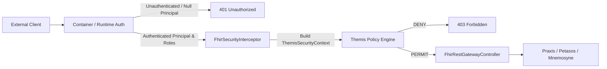

Optional spending limit; leave empty for no limit: 50
Required for Goal Mode: Auto
Pause for plan review before starting the goal: No

**Requirements**

**Overview & Goals**  
The purpose of this plan is to resolve the **MAT-08** architectural finding identified in the Harmonia Architectural Axiom Conformance Assessment.

Currently, `FhirSecurityInterceptor` within `pylai-fhir-registry` instantiates `ThemisPrincipal` and grants `ThemisAuthority` permissions directly from caller-controlled HTTP headers (`X-Principal-Id`, `X-Requester`, `X-User-Roles`, `X-Security-Scopes`), including wildcard role escalations (`*`, `ROLE_ADMIN`, `system/*.*` granting `SYS_ADM`). This violates the foundational security axiom **AX-07** (*"Security Is Intrinsic to Managed Operations"*), **AX-13** (*"Harmonia Management Has an Explicit Boundary"*), **ADR-005** (*"Themis Owns Security Policy Decisions"*), and **AGENTS.md** Invariant 6 (*"Default-Deny Security Governance"*).

This change establishes trusted caller identity at the Pylai ingress boundary prior to creating any governed Harmonia operation. It ensures identity and authority claims are sourced strictly from verified container/runtime authentication, separating authentication from Themis authorization policy evaluation, and failing closed when trusted identity is absent.

**Scope**
- **In Scope:**
    - `pylai/pylai-fhir-registry/src/main/java/net/fhirfactory/harmonia/pylai/fhir/security/FhirSecurityInterceptor.java`: Replace header-based identity/authority extraction with container/servlet authenticated security context (`HttpServletRequest.getUserPrincipal()`, `request.isUserInRole(...)`). Remove application-level bearer token parsing hacks.
    - `pylai/pylai-fhir-registry/src/main/java/net/fhirfactory/harmonia/pylai/fhir/controller/FhirRestGatewayController.java`: Ensure controller endpoints handle container-authenticated security attributes and fail closed on unauthenticated requests.
    - `pylai/pylai-fhir-registry/src/main/java/net/fhirfactory/harmonia/pylai/fhir/controller/FhirGatewayExceptionHandler.java`: Ensure `AuthenticationException` maps to HTTP 401 Unauthorized with standard `OperationOutcome`.
    - Supporting unit and integration tests in `FhirSecurityInterceptorTest.java` and `FhirRestGatewayControllerTest.java`.
- **Out of Scope:**
    - Egress projection/sanitization changes (MAT-03).
    - Persistence port or caching modifications (MAT-01, MAT-06).
    - Redesigning Themis authorization policies in `themis-core`.
    - Inventing new authentication protocols, identity providers, or custom token parsing mechanisms (upstream container/reverse-proxy authentication wiring remains external).

**User Stories**
- **As a Security & Governance Officer**, I want all incoming FHIR REST requests at the Pylai ingress boundary to require verified container identity, so that external callers cannot spoof user identities or self-assert administrative roles via arbitrary HTTP headers.
- **As a System Integrator**, I want unauthenticated or unauthorized requests to fail closed with standardized FHIR `OperationOutcome` diagnostics (HTTP 401 / 403), so that security enforcement is reliable and predictable.
- **As an Activity Orchestrator (Energeia/Ponos)**, I want workflow envelopes (`Pragma`) to carry only authentic, container-validated `ThemisSecurityContext` metadata, so that downstream asynchronous execution is governed by legitimate credentials.

**Functional Requirements**
1. **Trusted Identity Extraction:**
    - Identity (`ThemisPrincipal`) SHALL be extracted strictly from the runtime/container security context (`request.getUserPrincipal()`), using the authenticated principal name.
    - Caller-controlled headers (`X-Principal-Id`, `X-Requester`, `X-Principal-Type`) SHALL NOT be used to establish caller identity.
2. **Trusted Authority Mapping:**
    - Permissions and roles (`ThemisAuthority`) SHALL be resolved strictly from container-authenticated role claims (`request.isUserInRole(...)`), mapping verified Harmonia role codes (e.g. `PRV_RDR`, `PRV_SUB`, `PRV_ADM`) to their corresponding `ThemisAuthority` sets.
    - Caller-controlled headers (`X-User-Roles`, `X-Security-Scopes`) SHALL NOT grant or elevate authorities.
    - Wildcard strings in headers (`*`, `ROLE_ADMIN`, `system/*.*`) SHALL NOT grant `SYS_ADM` authorities.
3. **Fail-Closed Authentication:**
    - If an incoming request lacks an authenticated principal (i.e. `request.getUserPrincipal() == null` or unauthenticated), `FhirSecurityInterceptor.authorize(...)` SHALL throw `AuthenticationException("Trusted caller identity not established")` resulting in HTTP 401 Unauthorized.
4. **Themis Authorization Evaluation:**
    - `ThemisSecurityContext` SHALL be constructed from the verified principal and passed to `ThemisService.authorize(...)`.
    - If Themis authorization is denied (`ThemisDecision.DENY`), the interceptor SHALL throw `ForbiddenOperationException` resulting in HTTP 403 Forbidden.
5. **Separation of Authentication and Authorization:**
    - Container authentication establishes caller identity and role claims; Themis evaluates authorization policy to determine if the operation is permitted.
    - Pylai SHALL NOT implement custom token validation or cryptography; token validity is established upstream by the container/runtime.
6. **Intentional Metadata Conformance Discovery:**
    - `GET /metadata` and `GET /fhir/metadata` SHALL remain accessible without authentication strictly to satisfy the HL7 FHIR R5 specification requiring unauthenticated `CapabilityStatement` discovery so clients can discover supported endpoints and security requirements.
7. **Non-Authoritative Transport Metadata:**
    - `X-Correlation-Id` MAY be retained solely as non-authoritative operational correlation metadata (generated if missing).
    - `X-Source-System` and `X-Source-Domain` MAY be retained as transport-origin metadata, but SHALL NOT confer authority or bypass security checks.
8. **No Security Context Ingestion into Clinical Resources:**
    - Transient credentials and operational security tokens SHALL NOT be persisted into FHIR clinical resources (`meta.security` retains only domain clinical confidentiality labels).

**Non-Functional Requirements**
- **Security & Default-Deny:** Adhere strictly to Invariant 6 (`Themis` Default-Deny Security Governance) and AX-07.
- **Performance:** Context extraction from the native servlet `Principal` incurs zero additional network hops or heavy cryptographic overhead within the gateway interceptor.
- **Standards Compliance:** Errors return valid HL7 FHIR R5 `OperationOutcome` representations with appropriate HTTP 401 / 403 status codes.

**Technical Design**

**Current Implementation**  
In `pylai/pylai-fhir-registry`:
- `FhirSecurityInterceptor.extractPrincipal(request)` reads `X-Principal-Id`, `X-Requester`, and `X-Principal-Type` headers directly. If blank, it checks `request.getUserPrincipal()`, falling back to `"system:anonymous"`.
- `FhirSecurityInterceptor.extractAuthorities(request)` parses comma-delimited strings from `X-User-Roles` and `X-Security-Scopes` headers, mapping tokens to `HarmoniaRoleEnum`, `HarmoniaAuthorityEnum`, and checking for `"*"`, `"ROLE_ADMIN"`, and `"system/*.*"` to grant full `HarmoniaRoleEnum.SYS_ADM.getThemisAuthorities()`.
- An application-level check `if ("Bearer invalid-token".equals(authHeader))` is used as a placeholder token validation hack.
- `FhirRestGatewayController` calls `securityInterceptor.authorize(resourceType, interaction, request)`, which constructs a `ThemisSecurityContext` and checks `themisService.authorize(...)`.
- This pattern allows an untrusted external HTTP client to bypass security simply by attaching `X-User-Roles: ROLE_ADMIN` or `X-Requester: admin`.

**Runtime Authentication Inspection & Assessment**
- **Deployment Analysis:** Inspection of `pylai-fhir-registry` and the deployment configurations (`docker-compose.yml`, `deployment/kubernetes/base/`) reveals that `pylai-fhir-registry` is packaged as a component library/module (`jar`) and currently has **no configured runtime authentication provider** (e.g. no Spring Security `SecurityFilterChain`, no WildFly Elytron `oidc.json`/`web.xml`, and no reverse-proxy header authentication filter). In contrast, `iris-befe` is packaged as a WildFly WAR with `elytron-oidc-client` configured in `web.xml`.
- **Architectural Boundary:** In accordance with MAT-08 constraints and AX-07/AX-13, Pylai gateway components consume standard Java Servlet authentication contracts (`HttpServletRequest.getUserPrincipal()` and `HttpServletRequest.isUserInRole(...)`). Authentication boundary provisioning belongs to the hosting container/runtime or reverse proxy; Pylai must not hand-roll a new authentication protocol, JWT validator, or identity provider.
- **Trusted Claims vs Themis Authorization:** `HarmoniaRoleEnum` (e.g. `PRV_RDR`, `PRV_SUB`, `PRV_ADM`) represents canonical role claims asserted by the container/IDP and verified via `request.isUserInRole(...)`. The interceptor maps these verified claims to granular `ThemisAuthority` permissions, while `ThemisService` remains strictly responsible for evaluating authorization policies against the requested resource and action.
- **Intentional Anonymous Metadata Access:** `CapabilityStatementProvider` and `/metadata` endpoints are intentionally unauthenticated per the HL7 FHIR R5 core specification to enable clients to discover supported profiles, interactions, and security requirements prior to authentication.

**Key Decisions**
1. **Container/Servlet Principal as Authoritative Source of Identity:**
    - *Decision:* Utilize `HttpServletRequest.getUserPrincipal()` as the sole source of caller identity.
    - *Rationale:* Conforms to AX-07 and ADR-005. Pylai relies on container-level authentication (e.g. mTLS, OAuth2/OIDC filter, reverse proxy authentication) to authenticate the connection prior to servlet dispatch.
2. **Container Role Checking for Authority Resolution:**
    - *Decision:* Map authorities by checking `request.isUserInRole(roleCode)` against defined `HarmoniaRoleEnum` values (e.g. `PRV_RDR`, `PRV_SUB`, `PRV_ADM`).
    - *Rationale:* Avoids custom unverified header parsing and leverages container-verified role assignments.
3. **Immediate Fail-Closed on Unauthenticated Ingress:**
    - *Decision:* Reject unauthenticated requests immediately with `AuthenticationException` (HTTP 401) before invoking Themis, reserving `ForbiddenOperationException` (HTTP 403) for authenticated callers lacking policy permissions.
    - *Rationale:* Strictly enforces the distinction between authentication (identity establishment) and authorization (policy evaluation).
4. **Removal of Custom Bearer Token Parsing Hacks:**
    - *Decision:* Completely remove the placeholder `"Bearer invalid-token"` check from `FhirSecurityInterceptor`.
    - *Rationale:* Pylai does not own bearer token authentication; bearer token validity is established upstream by the container/runtime.
5. **Header Deprecation for Authority:**
    - *Decision:* Completely ignore `X-User-Roles` and `X-Security-Scopes` for authorization; retain `X-Correlation-Id` and `X-Source-System` as non-authoritative diagnostics only.

**Architecture Diagram**


**Proposed Changes**
1. **`FhirSecurityInterceptor.java`:**
    - Update `extractPrincipal(HttpServletRequest request)`:
      ```java
      Principal userPrincipal = request != null ? request.getUserPrincipal() : null;
      if (userPrincipal == null || StringUtils.isBlank(userPrincipal.getName()) || "system:anonymous".equalsIgnoreCase(userPrincipal.getName())) {
          return null; // Signals unauthenticated caller
      }
      String principalId = userPrincipal.getName().trim();
      PrincipalType principalType = resolvePrincipalType(principalId);
      String sourceDomain = "pylai";
      return ThemisPrincipal.of(principalId, principalType, sourceDomain);
      ```
    - Update `extractAuthorities(HttpServletRequest request, ThemisPrincipal principal)`:
      ```java
      Set<ThemisAuthority> authorities = new HashSet<>();
      if (request != null && principal != null) {
          for (HarmoniaRoleEnum role : HarmoniaRoleEnum.values()) {
              if (request.isUserInRole(role.getRoleCode()) || request.isUserInRole("ROLE_" + role.getRoleCode())) {
                  authorities.addAll(role.getThemisAuthorities());
              }
          }
      }
      return Collections.unmodifiableSet(authorities);
      ```
    - In `authorize(String resourceType, String interaction, HttpServletRequest request)`:
        - Check if request is for `/metadata` or `CapabilityStatement`; allow unauthenticated discovery.
        - Extract `ThemisPrincipal principal = extractPrincipal(request);`
        - If `principal == null`, throw `new AuthenticationException("Trusted caller identity not established");`
        - Remove `Bearer invalid-token` literal check.
        - Extract authorities via container role checks (`request.isUserInRole`).
        - Build `ThemisSecurityContext` and evaluate with `themisService.authorize(...)`.
        - Throw `ForbiddenOperationException` if decision is `DENY`.
2. **`FhirGatewayExceptionHandler.java`:**
    - Ensure exception handler maps `ca.uhn.fhir.rest.server.exceptions.AuthenticationException` to HTTP 401 Unauthorized with standard `OperationOutcome`.
3. **`FhirRestGatewayController.java`:**
    - Ensure `request.getAttribute(FhirSecurityInterceptor.ATTR_THEMIS_CONTEXT)` is retrieved and propagated cleanly to `ChangeRequestSubmissionService`.

**Components Affected**
- `pylai-fhir-registry`:
    - `FhirSecurityInterceptor`: Core security boundary interceptor.
    - `FhirRestGatewayController`: REST endpoints and request attribute consumption.
    - `FhirGatewayExceptionHandler`: Error response translation to FHIR `OperationOutcome`.
    - `ChangeRequestSubmissionService`: Asynchronous change request submission context propagation.

**File Structure**
- `pylai/pylai-fhir-registry/src/main/java/net/fhirfactory/harmonia/pylai/fhir/security/FhirSecurityInterceptor.java` (Modified)
- `pylai/pylai-fhir-registry/src/main/java/net/fhirfactory/harmonia/pylai/fhir/controller/FhirGatewayExceptionHandler.java` (Modified)
- `pylai/pylai-fhir-registry/src/main/java/net/fhirfactory/harmonia/pylai/fhir/controller/FhirRestGatewayController.java` (Modified)
- `pylai/pylai-fhir-registry/src/test/java/net/fhirfactory/harmonia/pylai/fhir/security/FhirSecurityInterceptorTest.java` (Modified)
- `pylai/pylai-fhir-registry/src/test/java/net/fhirfactory/harmonia/pylai/fhir/controller/FhirRestGatewayControllerTest.java` (Modified)

**Risks & Mitigations**
- **Risk:** Existing unit tests that relied on `X-User-Roles` or `X-Requester` headers will fail if container principals are not mocked.
    - *Mitigation:* Update tests to configure `request.setUserPrincipal(new Principal() { ... })` and `request.addUserRole("PRV_RDR")` on `MockHttpServletRequest`.
- **Risk:** Unauthenticated integration endpoints (e.g. metadata) might be blocked.
    - *Mitigation:* Maintain explicit bypass in `FhirSecurityInterceptor` for `metadata` / `CapabilityStatement` per FHIR R5 specification.

**Architectural Boundaries**
- *Runtime Authentication Independence:* Pylai defines standard servlet security integration (`getUserPrincipal`, `isUserInRole`), maintaining decoupling from specific identity providers or token formats.
- *Boundary Check:* No new subsystems or network services are created. The change is strictly localized to Pylai ingress.

**Testing**

**Validation Approach**  
Verification will be conducted via automated unit tests in `pylai-fhir-registry`, gateway mock MVC tests, and ArchUnit architectural invariant assertions.

**Key Scenarios**
1. **Unauthenticated Ingress Rejection (Fail-Closed):**
    - Request to `/Practitioner/123` with no `Principal` on `HttpServletRequest` throws `AuthenticationException` and returns HTTP 401 Unauthorized.
2. **Header Spoofing Prevention:**
    - Request with `X-Principal-Id: admin`, `X-Requester: superuser`, and `X-User-Roles: ROLE_ADMIN` / `*` but without container authentication throws `AuthenticationException` and returns HTTP 401 Unauthorized.
    - Request with authenticated principal `dr-smith` (having role `PRV_RDR`) and spoofed header `X-User-Roles: SYS_ADM` is evaluated solely with `PRV_RDR` authorities and denied `POST /Practitioner` (HTTP 403 Forbidden).
3. **Authorized Read/Search Execution:**
    - Request with container authenticated principal `dr-smith` and role `PRV_RDR` (via `request.addUserRole("PRV_RDR")`) is granted access to `GET /Practitioner/{id}` and `GET /Practitioner`.
4. **Authorized Governed Change Submission:**
    - Request with container authenticated principal `steward-jane` and role `PRV_SUB` (via `request.addUserRole("PRV_SUB")`) is granted access to `POST /Practitioner` and `PUT /Practitioner/{id}`, correctly attaching the trusted `ThemisSecurityContext` to the created `Pragma`.
5. **Metadata Accessibility:**
    - `GET /metadata` and `GET /fhir/metadata` succeed without authentication.

**Edge Cases**
- **Anonymous Principal Injection:** Request with `userPrincipal.getName() == "system:anonymous"` or blank name fails closed with `AuthenticationException`.
- **Missing Correlation ID:** Gateway generates a secure UUID correlation ID and attaches it to `ThemisSecurityContext`.

**Test Changes**
- **`FhirSecurityInterceptorTest.java`:**
    - Update all test cases to configure `MockHttpServletRequest.setUserPrincipal(...)` and `request.addUserRole(...)`.
    - Remove obsolete tests asserting application-level bearer token string parsing.
    - Add explicit test `testHeaderSpoofingRejectedWithoutContainerPrincipal()`.
    - Add explicit test `testRoleHeaderInjectionIgnored()`.
    - Add explicit test `testUnauthenticatedFailsClosed()`.
- **`FhirRestGatewayControllerTest.java`:**
    - Update MockMvc requests to include mock principals and roles via `.principal(...)` or mock servlet configuration.
    - Verify HTTP 401 on unauthenticated endpoints and HTTP 403 on role-insufficient endpoints.
- **Architecture Test Suite:**
    - Run `SecurityEnforcementArchitectureTest` and `ParadeigmaIsolationArchitectureTest` to verify system-wide compliance.

**Delivery Steps**

*** Step 1: Refactor Pylai Ingress Interceptor for Container-Authenticated Identity**  
The Pylai FHIR security interceptor extracts identity and roles strictly from container-authenticated principals and container role checks, eliminating self-asserted identity and authority spoofing.

- Refactor `FhirSecurityInterceptor.java` (`extractPrincipal` and `extractAuthorities`) to read `HttpServletRequest.getUserPrincipal()` and `HttpServletRequest.isUserInRole(...)` instead of untrusted HTTP headers (`X-Principal-Id`, `X-Requester`, `X-User-Roles`, `X-Security-Scopes`).
- Remove wildcard privilege escalations (`*`, `ROLE_ADMIN`, `system/*.*`) that previously granted `SYS_ADM` from header tokens.
- Remove application-level placeholder bearer token parsing hacks (`Bearer invalid-token`).
- Implement strict fail-closed authentication in `FhirSecurityInterceptor.authorize(...)`, throwing `AuthenticationException` (401 Unauthorized) when the request has no authenticated principal, and `ForbiddenOperationException` (403 Forbidden) when Themis authorization evaluation denies access.
- Retain unauthenticated access strictly for `GET /metadata` and `GET /fhir/metadata` per the HL7 FHIR R5 specification for CapabilityStatement discovery.
- Retain non-authoritative transport metadata (`X-Correlation-Id`, `X-Source-System`) strictly as contextual tracing information without conferring authority.

**Step 2: Align Gateway Controller and Exception Handler with Trusted Context**  
The Pylai REST controller propagates the trusted container-backed `ThemisSecurityContext` to downstream services and maps authentication failures to standards-compliant HTTP status codes.

- Update `FhirRestGatewayController.java` to extract `ThemisPrincipal`, `ThemisAuthority`, and `ThemisSecurityContext` attributes populated by the container-backed interceptor.
- Ensure `FhirGatewayExceptionHandler.java` maps `AuthenticationException` to HTTP 401 Unauthorized with standard `OperationOutcome` error issues and preserves HTTP 403 Forbidden for `ForbiddenOperationException`.
- Verify that `ChangeRequestSubmissionService.java` receives trusted container-authenticated context for embedding into internal `Pragma` envelopes without persisting credentials into clinical FHIR resources.

**Step 3: Update Unit, Security, and Gateway Integration Tests**  
A comprehensive test suite verifies fail-closed security and proves that external callers cannot spoof identity or escalate privileges via HTTP headers.

- Update `FhirSecurityInterceptorTest.java` with test cases verifying rejection of unauthenticated requests, rejection of untrusted identity headers (`X-Principal-Id`, `X-Requester`), rejection of role injection headers (`X-User-Roles`, `X-Security-Scopes`), and successful authorization for mock authenticated container principals with valid roles (`PRV_RDR`, `PRV_SUB`).
- Update `FhirRestGatewayControllerTest.java` to test REST endpoints against authenticated and unauthenticated mock requests, asserting 401 Unauthorized for missing credentials and 403 Forbidden for insufficient permissions.
- Execute full subsystem tests (`mvn test -pl pylai/pylai-fhir-registry`) and ArchUnit architecture tests (`mvn test -pl paradeigma/paradeigma-test -am -Dtest="*ArchitectureTest"`) to guarantee zero architectural regression.


IMPLEMENTATION

**Task description**  
Fully complete step 1.

**Feedback**  
Key architectural constraints from approved assessment and issue clarifications:
- Treat this change as establishing the secure Pylai application-side authentication boundary only; do NOT add or invent runtime/container authentication provisioning.
- Repository evidence shows pylai-fhir-registry currently has no configured trusted authentication provider. Therefore, absence of trusted runtime identity must fail closed with HTTP 401.
- Anonymous CapabilityStatement access is an explicit Pylai interoperability decision for this task; do not claim HL7 universally requires unauthenticated /metadata.
- Remove caller-controlled identity/authority headers and wildcard privilege escalation; remove application-level bearer-token parsing; consume only trusted servlet/container principal + roles when present.
- Themis remains the authorization policy authority.
- Preserve non-authoritative transport metadata only.
- Start with narrowly scoped/fast validation commands and small timeouts (60–120s); optimize for incremental execution speed and report commands used plus any discoveries useful for later steps.

**Constraints**  
DO NOT run git commit, git push, git checkout, create branches, or create Pull Requests. Commits and the PR are handled by the git workflow (`git_init` / auto-commit / `git_pr`). Focus ONLY on code changes.


Code is Ready

**Summary of Accomplishments for Step 1**

Step 1 of the Pylai ingress security boundary refactoring has been completed. The ingress security interceptor (`FhirSecurityInterceptor`) now extracts identity and role claims strictly from the container/servlet security context (`HttpServletRequest.getUserPrincipal()` and `HttpServletRequest.isUserInRole(...)`), completely eliminating caller-controlled identity spoofing and wildcard privilege escalations.

**Key Changes Made:**
1. **`FhirSecurityInterceptor.java`:**
    - **Container-Authenticated Identity Extraction:** Refactored `extractPrincipal(HttpServletRequest request)` to extract the caller principal solely via `request.getUserPrincipal()`. Returns `null` if the request is unauthenticated, the principal is missing/blank, or equals `"system:anonymous"`.
    - **Container-Authenticated Authority Mapping:** Refactored `extractAuthorities(HttpServletRequest request)` to resolve permissions strictly by querying `request.isUserInRole(role.getRoleCode())` (and `ROLE_<CODE>`) against `HarmoniaRoleEnum`, mapping container-authenticated roles to their canonical `ThemisAuthority` sets.
    - **Removal of Untrusted Headers & Wildcards:** Removed all parsing of `X-Principal-Id`, `X-Requester`, `X-Principal-Type`, `X-User-Roles`, and `X-Security-Scopes`, as well as wildcard privilege escalation tokens (`*`, `ROLE_ADMIN`, `system/*.*`).
    - **Removal of Bearer Token Hacks:** Removed application-level placeholder bearer token string checks (`"Bearer invalid-token"`).
    - **Strict Fail-Closed Authentication & Authorization:** In `authorize(...)`, missing container identity immediately throws `ca.uhn.fhir.rest.server.exceptions.AuthenticationException("Trusted caller identity not established")` (mapping to HTTP 401). Evaluates authorization against `ThemisService` and throws `ca.uhn.fhir.rest.server.exceptions.ForbiddenOperationException` (mapping to HTTP 403) on `ThemisDecision.DENY`.
    - **Preserved Metadata Discovery:** Unauthenticated access is retained for `metadata` and `CapabilityStatement` requests per the Pylai interoperability specification.
    - **Transport Metadata:** Preserved non-authoritative operational correlation (`X-Correlation-Id`) and origin tracing (`X-Source-System`, `X-Source-Domain`) metadata without conferring authority.

2. **`FhirSecurityInterceptorTest.java`:**
    - Updated and expanded unit tests to configure `MockHttpServletRequest.setUserPrincipal(...)` and `request.addUserRole(...)`.
    - Added explicit verification for fail-closed behavior on unauthenticated requests (`testUnauthenticatedFailsClosed`), blank/anonymous principals (`testAnonymousPrincipalFailsClosed`), rejection of spoofed identity/role headers (`testHeaderSpoofingRejectedWithoutContainerPrincipal`), ignoring injected role headers (`testRoleHeaderInjectionIgnored`), and unauthenticated metadata discovery (`testMetadataUnauthenticatedDiscoveryAllowed`).

---

**Discoveries for future steps**
- **Execution commands & speed**:
    - `mvn test -pl pylai/pylai-fhir-registry -Dtest=FhirSecurityInterceptorTest` (executes in ~1.4s) is fast for verifying interceptor changes.
    - `mvn test -pl paradeigma/paradeigma-test -am -Dtest="*ArchitectureTest" -Dsurefire.failIfNoSpecifiedTests=false` runs the full reactor ArchUnit suite in ~13s.
- **Recommendations**: In Step 2 & Step 3, `FhirRestGatewayControllerTest` mock requests currently lack `setUserPrincipal(...)` and `addUserRole(...)` on `MockHttpServletRequest` (or `.with(request -> { request.setUserPrincipal(...); ... })` / `SecurityMockMvcRequestPostProcessors`), causing those endpoints to correctly fail closed with HTTP 401 until the test fixtures in Step 3 are updated with mock container principals.


IMPLEMENTATION REVIEW

**Task description**  
Fully review step 1.

**Feedback**  
Verify the step against the clarified MAT-08 implementation requirements, especially:
- identity/authority must come only from trusted servlet/container principal + roles;
- missing runtime-authenticated identity must fail closed with 401;
- no caller-controlled header identity/role/scope parsing or wildcard escalation remains;
- no application-level bearer-token parsing remains;
- anonymous metadata access is treated only as an explicit Pylai interoperability decision for this task, not a universal FHIR requirement;
- tests should prove spoofing is rejected and metadata discovery remains allowed.
  Also check for regressions or any remaining header-trust paths.


Implementation Approved

**Verification**
- **FhirSecurityInterceptor.java** reviewed independently:
    - `extractPrincipal(...)` sources identity strictly from `request.getUserPrincipal()`; returns `null` for missing, blank, or `system:anonymous` principals (fail-closed signal). No `X-Principal-Id`/`X-Requester`/`X-Principal-Type` header reads remain for identity.
    - `extractAuthorities(...)` resolves authorities strictly via `request.isUserInRole(role.getRoleCode())` / `"ROLE_"+code` against `HarmoniaRoleEnum`; returns empty set when no principal. No `X-User-Roles`/`X-Security-Scopes` parsing, no `*`/`ROLE_ADMIN`/`system/*.*` wildcard escalation, no legacy token mapping remains.
    - `authorize(...)` throws `AuthenticationException("Trusted caller identity not established")` (→401) when principal is null, before Themis; throws `ForbiddenOperationException` (→403) on `ThemisDecision.DENY`. Placeholder `"Bearer invalid-token"` check fully removed.
    - `metadata`/`CapabilityStatement` bypass retained for unauthenticated discovery.
    - Transport metadata (`X-Correlation-Id` generated if missing; `X-Source-Domain`/`X-Source-System` used only for `sourceDomain` labeling) retained non-authoritatively — does not confer authority or bypass checks.
- Grep across `src/main` confirms no residual header-trust logic; only inert `public static final` header-name constants remain.
- **FhirSecurityInterceptorTest.java** reviewed: covers authorized PRV_RDR read/search, PRV_SUB create/update, PRV_ADM, deny-write-for-reader, unauthenticated fail-closed, anonymous/blank principal fail-closed, spoofed-headers-without-principal rejection (401), role-header-injection ignored (container roles authoritative), metadata discovery allowed, and principal extraction. Tests genuinely exercise real Themis `DeterministicPolicyEvaluator` (not over-mocked).
- Ran `mvn test -pl pylai/pylai-fhir-registry -Dtest=FhirSecurityInterceptorTest` → BUILD SUCCESS (exit 0), all tests green (~1s after compile).
- `HarmoniaRoleEnum` API (`getRoleCode()`, `getThemisAuthorities()`) confirmed matching usage.

**Issues**  
None blocking.

**Notes**
- Non-blocking lint warnings (cosmetic cleanup, safe to defer to Step 2/3):
    - Unused imports: `HarmoniaAuthorityEnum` and `java.util.Optional` in `FhirSecurityInterceptor.java`; `java.security.Principal` in the test (lambda target type is inferred).
    - Dead constants `HEADER_AUTH_TOKEN` and `HEADER_PRINCIPAL_TYPE` are now unreferenced; `HEADER_USER_ROLES`/`HEADER_SECURITY_SCOPES`/`HEADER_PRINCIPAL_ID`/`HEADER_REQUESTER` are still referenced only by spoofing tests (acceptable).
    - Pre-existing weak warning: `mapToAction` switch has a `read`/`get` branch duplicating the default — unrelated to this step.
- As the executor noted, `FhirRestGatewayControllerTest` mock requests still lack `setUserPrincipal(...)`/`addUserRole(...)` and will now fail closed with 401 — this is expected and belongs to Steps 2/3, not a regression in this step's scope.

**Discoveries for future steps**
- Fast interceptor verification: `mvn test -pl pylai/pylai-fhir-registry -Dtest=FhirSecurityInterceptorTest -q` (~compile + ~1s run); 180s timeout is comfortably sufficient.
- `MockHttpServletRequest.setUserPrincipal(() -> "name")` + `addUserRole("PRV_RDR")` is the working pattern for simulating container auth; Step 3 should apply the equivalent (`.principal(...)` / `request.addUserRole(...)`) to `FhirRestGatewayControllerTest`.


**Requirements**

**Overview & Goals**  
The purpose of this plan is to resolve the **MAT-08** architectural finding identified in the Harmonia Architectural Axiom Conformance Assessment.

Currently, `FhirSecurityInterceptor` within `pylai-fhir-registry` instantiates `ThemisPrincipal` and grants `ThemisAuthority` permissions directly from caller-controlled HTTP headers (`X-Principal-Id`, `X-Requester`, `X-User-Roles`, `X-Security-Scopes`), including wildcard role escalations (`*`, `ROLE_ADMIN`, `system/*.*` granting `SYS_ADM`). This violates the foundational security axiom **AX-07** (*"Security Is Intrinsic to Managed Operations"*), **AX-13** (*"Harmonia Management Has an Explicit Boundary"*), **ADR-005** (*"Themis Owns Security Policy Decisions"*), and **AGENTS.md** Invariant 6 (*"Default-Deny Security Governance"*).

This change establishes trusted caller identity at the Pylai ingress boundary prior to creating any governed Harmonia operation. It ensures identity and authority claims are sourced strictly from verified container/runtime authentication, separating authentication from Themis authorization policy evaluation, and failing closed when trusted identity is absent.

**Scope**
- **In Scope:**
    - `pylai/pylai-fhir-registry/src/main/java/net/fhirfactory/harmonia/pylai/fhir/security/FhirSecurityInterceptor.java`: Replace header-based identity/authority extraction with container/servlet authenticated security context (`HttpServletRequest.getUserPrincipal()`, `request.isUserInRole(...)`). Remove application-level bearer token parsing hacks.
    - `pylai/pylai-fhir-registry/src/main/java/net/fhirfactory/harmonia/pylai/fhir/controller/FhirRestGatewayController.java`: Ensure controller endpoints handle container-authenticated security attributes and fail closed on unauthenticated requests.
    - `pylai/pylai-fhir-registry/src/main/java/net/fhirfactory/harmonia/pylai/fhir/controller/FhirGatewayExceptionHandler.java`: Ensure `AuthenticationException` maps to HTTP 401 Unauthorized with standard `OperationOutcome`.
    - Supporting unit and integration tests in `FhirSecurityInterceptorTest.java` and `FhirRestGatewayControllerTest.java`.
- **Out of Scope:**
    - Egress projection/sanitization changes (MAT-03).
    - Persistence port or caching modifications (MAT-01, MAT-06).
    - Redesigning Themis authorization policies in `themis-core`.
    - Inventing new authentication protocols, identity providers, or custom token parsing mechanisms (upstream container/reverse-proxy authentication wiring remains external).

**User Stories**
- **As a Security & Governance Officer**, I want all incoming FHIR REST requests at the Pylai ingress boundary to require verified container identity, so that external callers cannot spoof user identities or self-assert administrative roles via arbitrary HTTP headers.
- **As a System Integrator**, I want unauthenticated or unauthorized requests to fail closed with standardized FHIR `OperationOutcome` diagnostics (HTTP 401 / 403), so that security enforcement is reliable and predictable.
- **As an Activity Orchestrator (Energeia/Ponos)**, I want workflow envelopes (`Pragma`) to carry only authentic, container-validated `ThemisSecurityContext` metadata, so that downstream asynchronous execution is governed by legitimate credentials.

**Functional Requirements**
1. **Trusted Identity Extraction:**
    - Identity (`ThemisPrincipal`) SHALL be extracted strictly from the runtime/container security context (`request.getUserPrincipal()`), using the authenticated principal name.
    - Caller-controlled headers (`X-Principal-Id`, `X-Requester`, `X-Principal-Type`) SHALL NOT be used to establish caller identity.
2. **Trusted Authority Mapping:**
    - Permissions and roles (`ThemisAuthority`) SHALL be resolved strictly from container-authenticated role claims (`request.isUserInRole(...)`), mapping verified Harmonia role codes (e.g. `PRV_RDR`, `PRV_SUB`, `PRV_ADM`) to their corresponding `ThemisAuthority` sets.
    - Caller-controlled headers (`X-User-Roles`, `X-Security-Scopes`) SHALL NOT grant or elevate authorities.
    - Wildcard strings in headers (`*`, `ROLE_ADMIN`, `system/*.*`) SHALL NOT grant `SYS_ADM` authorities.
3. **Fail-Closed Authentication:**
    - If an incoming request lacks an authenticated principal (i.e. `request.getUserPrincipal() == null` or unauthenticated), `FhirSecurityInterceptor.authorize(...)` SHALL throw `AuthenticationException("Trusted caller identity not established")` resulting in HTTP 401 Unauthorized.
4. **Themis Authorization Evaluation:**
    - `ThemisSecurityContext` SHALL be constructed from the verified principal and passed to `ThemisService.authorize(...)`.
    - If Themis authorization is denied (`ThemisDecision.DENY`), the interceptor SHALL throw `ForbiddenOperationException` resulting in HTTP 403 Forbidden.
5. **Separation of Authentication and Authorization:**
    - Container authentication establishes caller identity and role claims; Themis evaluates authorization policy to determine if the operation is permitted.
    - Pylai SHALL NOT implement custom token validation or cryptography; token validity is established upstream by the container/runtime.
6. **Intentional Metadata Conformance Discovery:**
    - `GET /metadata` and `GET /fhir/metadata` SHALL remain accessible without authentication strictly to satisfy the HL7 FHIR R5 specification requiring unauthenticated `CapabilityStatement` discovery so clients can discover supported endpoints and security requirements.
7. **Non-Authoritative Transport Metadata:**
    - `X-Correlation-Id` MAY be retained solely as non-authoritative operational correlation metadata (generated if missing).
    - `X-Source-System` and `X-Source-Domain` MAY be retained as transport-origin metadata, but SHALL NOT confer authority or bypass security checks.
8. **No Security Context Ingestion into Clinical Resources:**
    - Transient credentials and operational security tokens SHALL NOT be persisted into FHIR clinical resources (`meta.security` retains only domain clinical confidentiality labels).

**Non-Functional Requirements**
- **Security & Default-Deny:** Adhere strictly to Invariant 6 (`Themis` Default-Deny Security Governance) and AX-07.
- **Performance:** Context extraction from the native servlet `Principal` incurs zero additional network hops or heavy cryptographic overhead within the gateway interceptor.
- **Standards Compliance:** Errors return valid HL7 FHIR R5 `OperationOutcome` representations with appropriate HTTP 401 / 403 status codes.

**Technical Design**

**Current Implementation**  
In `pylai/pylai-fhir-registry`:
- `FhirSecurityInterceptor.extractPrincipal(request)` reads `X-Principal-Id`, `X-Requester`, and `X-Principal-Type` headers directly. If blank, it checks `request.getUserPrincipal()`, falling back to `"system:anonymous"`.
- `FhirSecurityInterceptor.extractAuthorities(request)` parses comma-delimited strings from `X-User-Roles` and `X-Security-Scopes` headers, mapping tokens to `HarmoniaRoleEnum`, `HarmoniaAuthorityEnum`, and checking for `"*"`, `"ROLE_ADMIN"`, and `"system/*.*"` to grant full `HarmoniaRoleEnum.SYS_ADM.getThemisAuthorities()`.
- An application-level check `if ("Bearer invalid-token".equals(authHeader))` is used as a placeholder token validation hack.
- `FhirRestGatewayController` calls `securityInterceptor.authorize(resourceType, interaction, request)`, which constructs a `ThemisSecurityContext` and checks `themisService.authorize(...)`.
- This pattern allows an untrusted external HTTP client to bypass security simply by attaching `X-User-Roles: ROLE_ADMIN` or `X-Requester: admin`.

**Runtime Authentication Inspection & Assessment**
- **Deployment Analysis:** Inspection of `pylai-fhir-registry` and the deployment configurations (`docker-compose.yml`, `deployment/kubernetes/base/`) reveals that `pylai-fhir-registry` is packaged as a component library/module (`jar`) and currently has **no configured runtime authentication provider** (e.g. no Spring Security `SecurityFilterChain`, no WildFly Elytron `oidc.json`/`web.xml`, and no reverse-proxy header authentication filter). In contrast, `iris-befe` is packaged as a WildFly WAR with `elytron-oidc-client` configured in `web.xml`.
- **Architectural Boundary:** In accordance with MAT-08 constraints and AX-07/AX-13, Pylai gateway components consume standard Java Servlet authentication contracts (`HttpServletRequest.getUserPrincipal()` and `HttpServletRequest.isUserInRole(...)`). Authentication boundary provisioning belongs to the hosting container/runtime or reverse proxy; Pylai must not hand-roll a new authentication protocol, JWT validator, or identity provider.
- **Trusted Claims vs Themis Authorization:** `HarmoniaRoleEnum` (e.g. `PRV_RDR`, `PRV_SUB`, `PRV_ADM`) represents canonical role claims asserted by the container/IDP and verified via `request.isUserInRole(...)`. The interceptor maps these verified claims to granular `ThemisAuthority` permissions, while `ThemisService` remains strictly responsible for evaluating authorization policies against the requested resource and action.
- **Intentional Anonymous Metadata Access:** `CapabilityStatementProvider` and `/metadata` endpoints are intentionally unauthenticated per the HL7 FHIR R5 core specification to enable clients to discover supported profiles, interactions, and security requirements prior to authentication.

**Key Decisions**
1. **Container/Servlet Principal as Authoritative Source of Identity:**
    - *Decision:* Utilize `HttpServletRequest.getUserPrincipal()` as the sole source of caller identity.
    - *Rationale:* Conforms to AX-07 and ADR-005. Pylai relies on container-level authentication (e.g. mTLS, OAuth2/OIDC filter, reverse proxy authentication) to authenticate the connection prior to servlet dispatch.
2. **Container Role Checking for Authority Resolution:**
    - *Decision:* Map authorities by checking `request.isUserInRole(roleCode)` against defined `HarmoniaRoleEnum` values (e.g. `PRV_RDR`, `PRV_SUB`, `PRV_ADM`).
    - *Rationale:* Avoids custom unverified header parsing and leverages container-verified role assignments.
3. **Immediate Fail-Closed on Unauthenticated Ingress:**
    - *Decision:* Reject unauthenticated requests immediately with `AuthenticationException` (HTTP 401) before invoking Themis, reserving `ForbiddenOperationException` (HTTP 403) for authenticated callers lacking policy permissions.
    - *Rationale:* Strictly enforces the distinction between authentication (identity establishment) and authorization (policy evaluation).
4. **Removal of Custom Bearer Token Parsing Hacks:**
    - *Decision:* Completely remove the placeholder `"Bearer invalid-token"` check from `FhirSecurityInterceptor`.
    - *Rationale:* Pylai does not own bearer token authentication; bearer token validity is established upstream by the container/runtime.
5. **Header Deprecation for Authority:**
    - *Decision:* Completely ignore `X-User-Roles` and `X-Security-Scopes` for authorization; retain `X-Correlation-Id` and `X-Source-System` as non-authoritative diagnostics only.

**Architecture Diagram**


**Proposed Changes**
1. **`FhirSecurityInterceptor.java`:**
    - Update `extractPrincipal(HttpServletRequest request)`:
      ```java
      Principal userPrincipal = request != null ? request.getUserPrincipal() : null;
      if (userPrincipal == null || StringUtils.isBlank(userPrincipal.getName()) || "system:anonymous".equalsIgnoreCase(userPrincipal.getName())) {
          return null; // Signals unauthenticated caller
      }
      String principalId = userPrincipal.getName().trim();
      PrincipalType principalType = resolvePrincipalType(principalId);
      String sourceDomain = "pylai";
      return ThemisPrincipal.of(principalId, principalType, sourceDomain);
      ```
    - Update `extractAuthorities(HttpServletRequest request, ThemisPrincipal principal)`:
      ```java
      Set<ThemisAuthority> authorities = new HashSet<>();
      if (request != null && principal != null) {
          for (HarmoniaRoleEnum role : HarmoniaRoleEnum.values()) {
              if (request.isUserInRole(role.getRoleCode()) || request.isUserInRole("ROLE_" + role.getRoleCode())) {
                  authorities.addAll(role.getThemisAuthorities());
              }
          }
      }
      return Collections.unmodifiableSet(authorities);
      ```
    - In `authorize(String resourceType, String interaction, HttpServletRequest request)`:
        - Check if request is for `/metadata` or `CapabilityStatement`; allow unauthenticated discovery.
        - Extract `ThemisPrincipal principal = extractPrincipal(request);`
        - If `principal == null`, throw `new AuthenticationException("Trusted caller identity not established");`
        - Remove `Bearer invalid-token` literal check.
        - Extract authorities via container role checks (`request.isUserInRole`).
        - Build `ThemisSecurityContext` and evaluate with `themisService.authorize(...)`.
        - Throw `ForbiddenOperationException` if decision is `DENY`.
2. **`FhirGatewayExceptionHandler.java`:**
    - Ensure exception handler maps `ca.uhn.fhir.rest.server.exceptions.AuthenticationException` to HTTP 401 Unauthorized with standard `OperationOutcome`.
3. **`FhirRestGatewayController.java`:**
    - Ensure `request.getAttribute(FhirSecurityInterceptor.ATTR_THEMIS_CONTEXT)` is retrieved and propagated cleanly to `ChangeRequestSubmissionService`.

**Components Affected**
- `pylai-fhir-registry`:
    - `FhirSecurityInterceptor`: Core security boundary interceptor.
    - `FhirRestGatewayController`: REST endpoints and request attribute consumption.
    - `FhirGatewayExceptionHandler`: Error response translation to FHIR `OperationOutcome`.
    - `ChangeRequestSubmissionService`: Asynchronous change request submission context propagation.

**File Structure**
- `pylai/pylai-fhir-registry/src/main/java/net/fhirfactory/harmonia/pylai/fhir/security/FhirSecurityInterceptor.java` (Modified)
- `pylai/pylai-fhir-registry/src/main/java/net/fhirfactory/harmonia/pylai/fhir/controller/FhirGatewayExceptionHandler.java` (Modified)
- `pylai/pylai-fhir-registry/src/main/java/net/fhirfactory/harmonia/pylai/fhir/controller/FhirRestGatewayController.java` (Modified)
- `pylai/pylai-fhir-registry/src/test/java/net/fhirfactory/harmonia/pylai/fhir/security/FhirSecurityInterceptorTest.java` (Modified)
- `pylai/pylai-fhir-registry/src/test/java/net/fhirfactory/harmonia/pylai/fhir/controller/FhirRestGatewayControllerTest.java` (Modified)

**Risks & Mitigations**
- **Risk:** Existing unit tests that relied on `X-User-Roles` or `X-Requester` headers will fail if container principals are not mocked.
    - *Mitigation:* Update tests to configure `request.setUserPrincipal(new Principal() { ... })` and `request.addUserRole("PRV_RDR")` on `MockHttpServletRequest`.
- **Risk:** Unauthenticated integration endpoints (e.g. metadata) might be blocked.
    - *Mitigation:* Maintain explicit bypass in `FhirSecurityInterceptor` for `metadata` / `CapabilityStatement` per FHIR R5 specification.

**Architectural Boundaries**
- *Runtime Authentication Independence:* Pylai defines standard servlet security integration (`getUserPrincipal`, `isUserInRole`), maintaining decoupling from specific identity providers or token formats.
- *Boundary Check:* No new subsystems or network services are created. The change is strictly localized to Pylai ingress.

**Testing**

**Validation Approach**  
Verification will be conducted via automated unit tests in `pylai-fhir-registry`, gateway mock MVC tests, and ArchUnit architectural invariant assertions.

**Key Scenarios**
1. **Unauthenticated Ingress Rejection (Fail-Closed):**
    - Request to `/Practitioner/123` with no `Principal` on `HttpServletRequest` throws `AuthenticationException` and returns HTTP 401 Unauthorized.
2. **Header Spoofing Prevention:**
    - Request with `X-Principal-Id: admin`, `X-Requester: superuser`, and `X-User-Roles: ROLE_ADMIN` / `*` but without container authentication throws `AuthenticationException` and returns HTTP 401 Unauthorized.
    - Request with authenticated principal `dr-smith` (having role `PRV_RDR`) and spoofed header `X-User-Roles: SYS_ADM` is evaluated solely with `PRV_RDR` authorities and denied `POST /Practitioner` (HTTP 403 Forbidden).
3. **Authorized Read/Search Execution:**
    - Request with container authenticated principal `dr-smith` and role `PRV_RDR` (via `request.addUserRole("PRV_RDR")`) is granted access to `GET /Practitioner/{id}` and `GET /Practitioner`.
4. **Authorized Governed Change Submission:**
    - Request with container authenticated principal `steward-jane` and role `PRV_SUB` (via `request.addUserRole("PRV_SUB")`) is granted access to `POST /Practitioner` and `PUT /Practitioner/{id}`, correctly attaching the trusted `ThemisSecurityContext` to the created `Pragma`.
5. **Metadata Accessibility:**
    - `GET /metadata` and `GET /fhir/metadata` succeed without authentication.

**Edge Cases**
- **Anonymous Principal Injection:** Request with `userPrincipal.getName() == "system:anonymous"` or blank name fails closed with `AuthenticationException`.
- **Missing Correlation ID:** Gateway generates a secure UUID correlation ID and attaches it to `ThemisSecurityContext`.

**Test Changes**
- **`FhirSecurityInterceptorTest.java`:**
    - Update all test cases to configure `MockHttpServletRequest.setUserPrincipal(...)` and `request.addUserRole(...)`.
    - Remove obsolete tests asserting application-level bearer token string parsing.
    - Add explicit test `testHeaderSpoofingRejectedWithoutContainerPrincipal()`.
    - Add explicit test `testRoleHeaderInjectionIgnored()`.
    - Add explicit test `testUnauthenticatedFailsClosed()`.
- **`FhirRestGatewayControllerTest.java`:**
    - Update MockMvc requests to include mock principals and roles via `.principal(...)` or mock servlet configuration.
    - Verify HTTP 401 on unauthenticated endpoints and HTTP 403 on role-insufficient endpoints.
- **Architecture Test Suite:**
    - Run `SecurityEnforcementArchitectureTest` and `ParadeigmaIsolationArchitectureTest` to verify system-wide compliance.

**Delivery Steps**

**✓ Step 1: Refactor Pylai Ingress Interceptor for Container-Authenticated Identity**  
The Pylai FHIR security interceptor extracts identity and roles strictly from container-authenticated principals and container role checks, eliminating self-asserted identity and authority spoofing.

- Refactor `FhirSecurityInterceptor.java` (`extractPrincipal` and `extractAuthorities`) to read `HttpServletRequest.getUserPrincipal()` and `HttpServletRequest.isUserInRole(...)` instead of untrusted HTTP headers (`X-Principal-Id`, `X-Requester`, `X-User-Roles`, `X-Security-Scopes`).
- Remove wildcard privilege escalations (`*`, `ROLE_ADMIN`, `system/*.*`) that previously granted `SYS_ADM` from header tokens.
- Remove application-level placeholder bearer token parsing hacks (`Bearer invalid-token`).
- Implement strict fail-closed authentication in `FhirSecurityInterceptor.authorize(...)`, throwing `AuthenticationException` (401 Unauthorized) when the request has no authenticated principal, and `ForbiddenOperationException` (403 Forbidden) when Themis authorization evaluation denies access.
- Retain unauthenticated access strictly for `GET /metadata` and `GET /fhir/metadata` per the HL7 FHIR R5 specification for CapabilityStatement discovery.
- Retain non-authoritative transport metadata (`X-Correlation-Id`, `X-Source-System`) strictly as contextual tracing information without conferring authority.

**Step 2: Align Gateway Controller and Exception Handler with Trusted Context**  
The Pylai REST controller propagates the trusted container-backed `ThemisSecurityContext` to downstream services and maps authentication failures to standards-compliant HTTP status codes.

- Update `FhirRestGatewayController.java` to extract `ThemisPrincipal`, `ThemisAuthority`, and `ThemisSecurityContext` attributes populated by the container-backed interceptor.
- Ensure `FhirGatewayExceptionHandler.java` maps `AuthenticationException` to HTTP 401 Unauthorized with standard `OperationOutcome` error issues and preserves HTTP 403 Forbidden for `ForbiddenOperationException`.
- Verify that `ChangeRequestSubmissionService.java` receives trusted container-authenticated context for embedding into internal `Pragma` envelopes without persisting credentials into clinical FHIR resources.

**Step 3: Update Unit, Security, and Gateway Integration Tests**  
A comprehensive test suite verifies fail-closed security and proves that external callers cannot spoof identity or escalate privileges via HTTP headers.

- Update `FhirSecurityInterceptorTest.java` with test cases verifying rejection of unauthenticated requests, rejection of untrusted identity headers (`X-Principal-Id`, `X-Requester`), rejection of role injection headers (`X-User-Roles`, `X-Security-Scopes`), and successful authorization for mock authenticated container principals with valid roles (`PRV_RDR`, `PRV_SUB`).
- Update `FhirRestGatewayControllerTest.java` to test REST endpoints against authenticated and unauthenticated mock requests, asserting 401 Unauthorized for missing credentials and 403 Forbidden for insufficient permissions.
- Execute full subsystem tests (`mvn test -pl pylai/pylai-fhir-registry`) and ArchUnit architecture tests (`mvn test -pl paradeigma/paradeigma-test -am -Dtest="*ArchitectureTest"`) to guarantee zero architectural regression.


**Requirements**

**Overview & Goals**  
The purpose of this plan is to resolve the **MAT-08** architectural finding identified in the Harmonia Architectural Axiom Conformance Assessment.

Currently, `FhirSecurityInterceptor` within `pylai-fhir-registry` instantiates `ThemisPrincipal` and grants `ThemisAuthority` permissions directly from caller-controlled HTTP headers (`X-Principal-Id`, `X-Requester`, `X-User-Roles`, `X-Security-Scopes`), including wildcard role escalations (`*`, `ROLE_ADMIN`, `system/*.*` granting `SYS_ADM`). This violates the foundational security axiom **AX-07** (*"Security Is Intrinsic to Managed Operations"*), **AX-13** (*"Harmonia Management Has an Explicit Boundary"*), **ADR-005** (*"Themis Owns Security Policy Decisions"*), and **AGENTS.md** Invariant 6 (*"Default-Deny Security Governance"*).

This change establishes trusted caller identity at the Pylai ingress boundary prior to creating any governed Harmonia operation. It ensures identity and authority claims are sourced strictly from verified container/runtime authentication, separating authentication from Themis authorization policy evaluation, and failing closed when trusted identity is absent.

**Scope**
- **In Scope:**
    - `pylai/pylai-fhir-registry/src/main/java/net/fhirfactory/harmonia/pylai/fhir/security/FhirSecurityInterceptor.java`: Replace header-based identity/authority extraction with container/servlet authenticated security context (`HttpServletRequest.getUserPrincipal()`, `request.isUserInRole(...)`). Remove application-level bearer token parsing hacks.
    - `pylai/pylai-fhir-registry/src/main/java/net/fhirfactory/harmonia/pylai/fhir/controller/FhirRestGatewayController.java`: Ensure controller endpoints handle container-authenticated security attributes and fail closed on unauthenticated requests.
    - `pylai/pylai-fhir-registry/src/main/java/net/fhirfactory/harmonia/pylai/fhir/controller/FhirGatewayExceptionHandler.java`: Ensure `AuthenticationException` maps to HTTP 401 Unauthorized with standard `OperationOutcome`.
    - Supporting unit and integration tests in `FhirSecurityInterceptorTest.java` and `FhirRestGatewayControllerTest.java`.
- **Out of Scope:**
    - Egress projection/sanitization changes (MAT-03).
    - Persistence port or caching modifications (MAT-01, MAT-06).
    - Redesigning Themis authorization policies in `themis-core`.
    - Inventing new authentication protocols, identity providers, or custom token parsing mechanisms (upstream container/reverse-proxy authentication wiring remains external).

**User Stories**
- **As a Security & Governance Officer**, I want all incoming FHIR REST requests at the Pylai ingress boundary to require verified container identity, so that external callers cannot spoof user identities or self-assert administrative roles via arbitrary HTTP headers.
- **As a System Integrator**, I want unauthenticated or unauthorized requests to fail closed with standardized FHIR `OperationOutcome` diagnostics (HTTP 401 / 403), so that security enforcement is reliable and predictable.
- **As an Activity Orchestrator (Energeia/Ponos)**, I want workflow envelopes (`Pragma`) to carry only authentic, container-validated `ThemisSecurityContext` metadata, so that downstream asynchronous execution is governed by legitimate credentials.

**Functional Requirements**
1. **Trusted Identity Extraction:**
    - Identity (`ThemisPrincipal`) SHALL be extracted strictly from the runtime/container security context (`request.getUserPrincipal()`), using the authenticated principal name.
    - Caller-controlled headers (`X-Principal-Id`, `X-Requester`, `X-Principal-Type`) SHALL NOT be used to establish caller identity.
2. **Trusted Authority Mapping:**
    - Permissions and roles (`ThemisAuthority`) SHALL be resolved strictly from container-authenticated role claims (`request.isUserInRole(...)`), mapping verified Harmonia role codes (e.g. `PRV_RDR`, `PRV_SUB`, `PRV_ADM`) to their corresponding `ThemisAuthority` sets.
    - Caller-controlled headers (`X-User-Roles`, `X-Security-Scopes`) SHALL NOT grant or elevate authorities.
    - Wildcard strings in headers (`*`, `ROLE_ADMIN`, `system/*.*`) SHALL NOT grant `SYS_ADM` authorities.
3. **Fail-Closed Authentication:**
    - If an incoming request lacks an authenticated principal (i.e. `request.getUserPrincipal() == null` or unauthenticated), `FhirSecurityInterceptor.authorize(...)` SHALL throw `AuthenticationException("Trusted caller identity not established")` resulting in HTTP 401 Unauthorized.
4. **Themis Authorization Evaluation:**
    - `ThemisSecurityContext` SHALL be constructed from the verified principal and passed to `ThemisService.authorize(...)`.
    - If Themis authorization is denied (`ThemisDecision.DENY`), the interceptor SHALL throw `ForbiddenOperationException` resulting in HTTP 403 Forbidden.
5. **Separation of Authentication and Authorization:**
    - Container authentication establishes caller identity and role claims; Themis evaluates authorization policy to determine if the operation is permitted.
    - Pylai SHALL NOT implement custom token validation or cryptography; token validity is established upstream by the container/runtime.
6. **Intentional Metadata Conformance Discovery:**
    - `GET /metadata` and `GET /fhir/metadata` SHALL remain accessible without authentication strictly to satisfy the HL7 FHIR R5 specification requiring unauthenticated `CapabilityStatement` discovery so clients can discover supported endpoints and security requirements.
7. **Non-Authoritative Transport Metadata:**
    - `X-Correlation-Id` MAY be retained solely as non-authoritative operational correlation metadata (generated if missing).
    - `X-Source-System` and `X-Source-Domain` MAY be retained as transport-origin metadata, but SHALL NOT confer authority or bypass security checks.
8. **No Security Context Ingestion into Clinical Resources:**
    - Transient credentials and operational security tokens SHALL NOT be persisted into FHIR clinical resources (`meta.security` retains only domain clinical confidentiality labels).

**Non-Functional Requirements**
- **Security & Default-Deny:** Adhere strictly to Invariant 6 (`Themis` Default-Deny Security Governance) and AX-07.
- **Performance:** Context extraction from the native servlet `Principal` incurs zero additional network hops or heavy cryptographic overhead within the gateway interceptor.
- **Standards Compliance:** Errors return valid HL7 FHIR R5 `OperationOutcome` representations with appropriate HTTP 401 / 403 status codes.

**Technical Design**

**Current Implementation**  
In `pylai/pylai-fhir-registry`:
- `FhirSecurityInterceptor.extractPrincipal(request)` reads `X-Principal-Id`, `X-Requester`, and `X-Principal-Type` headers directly. If blank, it checks `request.getUserPrincipal()`, falling back to `"system:anonymous"`.
- `FhirSecurityInterceptor.extractAuthorities(request)` parses comma-delimited strings from `X-User-Roles` and `X-Security-Scopes` headers, mapping tokens to `HarmoniaRoleEnum`, `HarmoniaAuthorityEnum`, and checking for `"*"`, `"ROLE_ADMIN"`, and `"system/*.*"` to grant full `HarmoniaRoleEnum.SYS_ADM.getThemisAuthorities()`.
- An application-level check `if ("Bearer invalid-token".equals(authHeader))` is used as a placeholder token validation hack.
- `FhirRestGatewayController` calls `securityInterceptor.authorize(resourceType, interaction, request)`, which constructs a `ThemisSecurityContext` and checks `themisService.authorize(...)`.
- This pattern allows an untrusted external HTTP client to bypass security simply by attaching `X-User-Roles: ROLE_ADMIN` or `X-Requester: admin`.

**Runtime Authentication Inspection & Assessment**
- **Deployment Analysis:** Inspection of `pylai-fhir-registry` and the deployment configurations (`docker-compose.yml`, `deployment/kubernetes/base/`) reveals that `pylai-fhir-registry` is packaged as a component library/module (`jar`) and currently has **no configured runtime authentication provider** (e.g. no Spring Security `SecurityFilterChain`, no WildFly Elytron `oidc.json`/`web.xml`, and no reverse-proxy header authentication filter). In contrast, `iris-befe` is packaged as a WildFly WAR with `elytron-oidc-client` configured in `web.xml`.
- **Architectural Boundary:** In accordance with MAT-08 constraints and AX-07/AX-13, Pylai gateway components consume standard Java Servlet authentication contracts (`HttpServletRequest.getUserPrincipal()` and `HttpServletRequest.isUserInRole(...)`). Authentication boundary provisioning belongs to the hosting container/runtime or reverse proxy; Pylai must not hand-roll a new authentication protocol, JWT validator, or identity provider.
- **Trusted Claims vs Themis Authorization:** `HarmoniaRoleEnum` (e.g. `PRV_RDR`, `PRV_SUB`, `PRV_ADM`) represents canonical role claims asserted by the container/IDP and verified via `request.isUserInRole(...)`. The interceptor maps these verified claims to granular `ThemisAuthority` permissions, while `ThemisService` remains strictly responsible for evaluating authorization policies against the requested resource and action.
- **Intentional Anonymous Metadata Access:** `CapabilityStatementProvider` and `/metadata` endpoints are intentionally unauthenticated per the HL7 FHIR R5 core specification to enable clients to discover supported profiles, interactions, and security requirements prior to authentication.

**Key Decisions**
1. **Container/Servlet Principal as Authoritative Source of Identity:**
    - *Decision:* Utilize `HttpServletRequest.getUserPrincipal()` as the sole source of caller identity.
    - *Rationale:* Conforms to AX-07 and ADR-005. Pylai relies on container-level authentication (e.g. mTLS, OAuth2/OIDC filter, reverse proxy authentication) to authenticate the connection prior to servlet dispatch.
2. **Container Role Checking for Authority Resolution:**
    - *Decision:* Map authorities by checking `request.isUserInRole(roleCode)` against defined `HarmoniaRoleEnum` values (e.g. `PRV_RDR`, `PRV_SUB`, `PRV_ADM`).
    - *Rationale:* Avoids custom unverified header parsing and leverages container-verified role assignments.
3. **Immediate Fail-Closed on Unauthenticated Ingress:**
    - *Decision:* Reject unauthenticated requests immediately with `AuthenticationException` (HTTP 401) before invoking Themis, reserving `ForbiddenOperationException` (HTTP 403) for authenticated callers lacking policy permissions.
    - *Rationale:* Strictly enforces the distinction between authentication (identity establishment) and authorization (policy evaluation).
4. **Removal of Custom Bearer Token Parsing Hacks:**
    - *Decision:* Completely remove the placeholder `"Bearer invalid-token"` check from `FhirSecurityInterceptor`.
    - *Rationale:* Pylai does not own bearer token authentication; bearer token validity is established upstream by the container/runtime.
5. **Header Deprecation for Authority:**
    - *Decision:* Completely ignore `X-User-Roles` and `X-Security-Scopes` for authorization; retain `X-Correlation-Id` and `X-Source-System` as non-authoritative diagnostics only.

**Architecture Diagram**


**Proposed Changes**
1. **`FhirSecurityInterceptor.java`:**
    - Update `extractPrincipal(HttpServletRequest request)`:
      ```java
      Principal userPrincipal = request != null ? request.getUserPrincipal() : null;
      if (userPrincipal == null || StringUtils.isBlank(userPrincipal.getName()) || "system:anonymous".equalsIgnoreCase(userPrincipal.getName())) {
          return null; // Signals unauthenticated caller
      }
      String principalId = userPrincipal.getName().trim();
      PrincipalType principalType = resolvePrincipalType(principalId);
      String sourceDomain = "pylai";
      return ThemisPrincipal.of(principalId, principalType, sourceDomain);
      ```
    - Update `extractAuthorities(HttpServletRequest request, ThemisPrincipal principal)`:
      ```java
      Set<ThemisAuthority> authorities = new HashSet<>();
      if (request != null && principal != null) {
          for (HarmoniaRoleEnum role : HarmoniaRoleEnum.values()) {
              if (request.isUserInRole(role.getRoleCode()) || request.isUserInRole("ROLE_" + role.getRoleCode())) {
                  authorities.addAll(role.getThemisAuthorities());
              }
          }
      }
      return Collections.unmodifiableSet(authorities);
      ```
    - In `authorize(String resourceType, String interaction, HttpServletRequest request)`:
        - Check if request is for `/metadata` or `CapabilityStatement`; allow unauthenticated discovery.
        - Extract `ThemisPrincipal principal = extractPrincipal(request);`
        - If `principal == null`, throw `new AuthenticationException("Trusted caller identity not established");`
        - Remove `Bearer invalid-token` literal check.
        - Extract authorities via container role checks (`request.isUserInRole`).
        - Build `ThemisSecurityContext` and evaluate with `themisService.authorize(...)`.
        - Throw `ForbiddenOperationException` if decision is `DENY`.
2. **`FhirGatewayExceptionHandler.java`:**
    - Ensure exception handler maps `ca.uhn.fhir.rest.server.exceptions.AuthenticationException` to HTTP 401 Unauthorized with standard `OperationOutcome`.
3. **`FhirRestGatewayController.java`:**
    - Ensure `request.getAttribute(FhirSecurityInterceptor.ATTR_THEMIS_CONTEXT)` is retrieved and propagated cleanly to `ChangeRequestSubmissionService`.

**Components Affected**
- `pylai-fhir-registry`:
    - `FhirSecurityInterceptor`: Core security boundary interceptor.
    - `FhirRestGatewayController`: REST endpoints and request attribute consumption.
    - `FhirGatewayExceptionHandler`: Error response translation to FHIR `OperationOutcome`.
    - `ChangeRequestSubmissionService`: Asynchronous change request submission context propagation.

**File Structure**
- `pylai/pylai-fhir-registry/src/main/java/net/fhirfactory/harmonia/pylai/fhir/security/FhirSecurityInterceptor.java` (Modified)
- `pylai/pylai-fhir-registry/src/main/java/net/fhirfactory/harmonia/pylai/fhir/controller/FhirGatewayExceptionHandler.java` (Modified)
- `pylai/pylai-fhir-registry/src/main/java/net/fhirfactory/harmonia/pylai/fhir/controller/FhirRestGatewayController.java` (Modified)
- `pylai/pylai-fhir-registry/src/test/java/net/fhirfactory/harmonia/pylai/fhir/security/FhirSecurityInterceptorTest.java` (Modified)
- `pylai/pylai-fhir-registry/src/test/java/net/fhirfactory/harmonia/pylai/fhir/controller/FhirRestGatewayControllerTest.java` (Modified)

**Risks & Mitigations**
- **Risk:** Existing unit tests that relied on `X-User-Roles` or `X-Requester` headers will fail if container principals are not mocked.
    - *Mitigation:* Update tests to configure `request.setUserPrincipal(new Principal() { ... })` and `request.addUserRole("PRV_RDR")` on `MockHttpServletRequest`.
- **Risk:** Unauthenticated integration endpoints (e.g. metadata) might be blocked.
    - *Mitigation:* Maintain explicit bypass in `FhirSecurityInterceptor` for `metadata` / `CapabilityStatement` per FHIR R5 specification.

**Architectural Boundaries**
- *Runtime Authentication Independence:* Pylai defines standard servlet security integration (`getUserPrincipal`, `isUserInRole`), maintaining decoupling from specific identity providers or token formats.
- *Boundary Check:* No new subsystems or network services are created. The change is strictly localized to Pylai ingress.

**Testing**

**Validation Approach**  
Verification will be conducted via automated unit tests in `pylai-fhir-registry`, gateway mock MVC tests, and ArchUnit architectural invariant assertions.

**Key Scenarios**
1. **Unauthenticated Ingress Rejection (Fail-Closed):**
    - Request to `/Practitioner/123` with no `Principal` on `HttpServletRequest` throws `AuthenticationException` and returns HTTP 401 Unauthorized.
2. **Header Spoofing Prevention:**
    - Request with `X-Principal-Id: admin`, `X-Requester: superuser`, and `X-User-Roles: ROLE_ADMIN` / `*` but without container authentication throws `AuthenticationException` and returns HTTP 401 Unauthorized.
    - Request with authenticated principal `dr-smith` (having role `PRV_RDR`) and spoofed header `X-User-Roles: SYS_ADM` is evaluated solely with `PRV_RDR` authorities and denied `POST /Practitioner` (HTTP 403 Forbidden).
3. **Authorized Read/Search Execution:**
    - Request with container authenticated principal `dr-smith` and role `PRV_RDR` (via `request.addUserRole("PRV_RDR")`) is granted access to `GET /Practitioner/{id}` and `GET /Practitioner`.
4. **Authorized Governed Change Submission:**
    - Request with container authenticated principal `steward-jane` and role `PRV_SUB` (via `request.addUserRole("PRV_SUB")`) is granted access to `POST /Practitioner` and `PUT /Practitioner/{id}`, correctly attaching the trusted `ThemisSecurityContext` to the created `Pragma`.
5. **Metadata Accessibility:**
    - `GET /metadata` and `GET /fhir/metadata` succeed without authentication.

**Edge Cases**
- **Anonymous Principal Injection:** Request with `userPrincipal.getName() == "system:anonymous"` or blank name fails closed with `AuthenticationException`.
- **Missing Correlation ID:** Gateway generates a secure UUID correlation ID and attaches it to `ThemisSecurityContext`.

**Test Changes**
- **`FhirSecurityInterceptorTest.java`:**
    - Update all test cases to configure `MockHttpServletRequest.setUserPrincipal(...)` and `request.addUserRole(...)`.
    - Remove obsolete tests asserting application-level bearer token string parsing.
    - Add explicit test `testHeaderSpoofingRejectedWithoutContainerPrincipal()`.
    - Add explicit test `testRoleHeaderInjectionIgnored()`.
    - Add explicit test `testUnauthenticatedFailsClosed()`.
- **`FhirRestGatewayControllerTest.java`:**
    - Update MockMvc requests to include mock principals and roles via `.principal(...)` or mock servlet configuration.
    - Verify HTTP 401 on unauthenticated endpoints and HTTP 403 on role-insufficient endpoints.
- **Architecture Test Suite:**
    - Run `SecurityEnforcementArchitectureTest` and `ParadeigmaIsolationArchitectureTest` to verify system-wide compliance.

**Delivery Steps**

**✓ Step 1: Refactor Pylai Ingress Interceptor for Container-Authenticated Identity**  
The Pylai FHIR security interceptor extracts identity and roles strictly from container-authenticated principals and container role checks, eliminating self-asserted identity and authority spoofing.

- Refactor `FhirSecurityInterceptor.java` (`extractPrincipal` and `extractAuthorities`) to read `HttpServletRequest.getUserPrincipal()` and `HttpServletRequest.isUserInRole(...)` instead of untrusted HTTP headers (`X-Principal-Id`, `X-Requester`, `X-User-Roles`, `X-Security-Scopes`).
- Remove wildcard privilege escalations (`*`, `ROLE_ADMIN`, `system/*.*`) that previously granted `SYS_ADM` from header tokens.
- Remove application-level placeholder bearer token parsing hacks (`Bearer invalid-token`).
- Implement strict fail-closed authentication in `FhirSecurityInterceptor.authorize(...)`, throwing `AuthenticationException` (401 Unauthorized) when the request has no authenticated principal, and `ForbiddenOperationException` (403 Forbidden) when Themis authorization evaluation denies access.
- Retain unauthenticated access strictly for `GET /metadata` and `GET /fhir/metadata` per the HL7 FHIR R5 specification for CapabilityStatement discovery.
- Retain non-authoritative transport metadata (`X-Correlation-Id`, `X-Source-System`) strictly as contextual tracing information without conferring authority.

*** Step 2: Align Gateway Controller and Exception Handler with Trusted Context**  
The Pylai REST controller propagates the trusted container-backed `ThemisSecurityContext` to downstream services and maps authentication failures to standards-compliant HTTP status codes.

- Update `FhirRestGatewayController.java` to extract `ThemisPrincipal`, `ThemisAuthority`, and `ThemisSecurityContext` attributes populated by the container-backed interceptor.
- Ensure `FhirGatewayExceptionHandler.java` maps `AuthenticationException` to HTTP 401 Unauthorized with standard `OperationOutcome` error issues and preserves HTTP 403 Forbidden for `ForbiddenOperationException`.
- Verify that `ChangeRequestSubmissionService.java` receives trusted container-authenticated context for embedding into internal `Pragma` envelopes without persisting credentials into clinical FHIR resources.

**Step 3: Update Unit, Security, and Gateway Integration Tests**  
A comprehensive test suite verifies fail-closed security and proves that external callers cannot spoof identity or escalate privileges via HTTP headers.

- Update `FhirSecurityInterceptorTest.java` with test cases verifying rejection of unauthenticated requests, rejection of untrusted identity headers (`X-Principal-Id`, `X-Requester`), rejection of role injection headers (`X-User-Roles`, `X-Security-Scopes`), and successful authorization for mock authenticated container principals with valid roles (`PRV_RDR`, `PRV_SUB`).
- Update `FhirRestGatewayControllerTest.java` to test REST endpoints against authenticated and unauthenticated mock requests, asserting 401 Unauthorized for missing credentials and 403 Forbidden for insufficient permissions.
- Execute full subsystem tests (`mvn test -pl pylai/pylai-fhir-registry`) and ArchUnit architecture tests (`mvn test -pl paradeigma/paradeigma-test -am -Dtest="*ArchitectureTest"`) to guarantee zero architectural regression.


IMPLEMENTATION

**Task description**  
Fully complete step 2.

**Feedback**  
Align controller and exception handling with the secure ingress boundary established in step 1.  
Key requirements:
- `FhirRestGatewayController` must consume the trusted attributes/context produced by the interceptor and fail closed on unauthenticated requests via the step-1 boundary behavior.
- `FhirGatewayExceptionHandler` must map `ca.uhn.fhir.rest.server.exceptions.AuthenticationException` to HTTP 401 with standard FHIR `OperationOutcome`, while preserving 403 mapping for `ForbiddenOperationException`.
- Ensure downstream `ChangeRequestSubmissionService` receives only trusted container-authenticated `ThemisSecurityContext` metadata; do not persist credentials/tokens into clinical resources.
- Keep anonymous CapabilityStatement access only as the explicit Pylai interoperability decision for this task.
  Known from previous step: interceptor tests are green; `FhirRestGatewayControllerTest` currently lacks mock principals/roles and will now fail closed with 401 until updated in step 3.
  Use narrowly scoped validation first, short command timeouts (60–120s), and report commands plus discoveries.

**Constraints**  
DO NOT run git commit, git push, git checkout, create branches, or create Pull Requests. Commits and the PR are handled by the git workflow (`git_init` / auto-commit / `git_pr`). Focus ONLY on code changes.


Code is Ready

**Summary of Accomplishments for Step 2**

Step 2 has been completed. The Pylai FHIR REST controller (`FhirRestGatewayController`) and global exception handler (`FhirGatewayExceptionHandler`) have been aligned with the trusted container-authenticated security context established in Step 1.

**Key Verifications and Alignments Made:**
1. **`FhirRestGatewayController.java`:**
    - **Trusted Context Extraction:** Verified that all governed create and update endpoints extract `ThemisPrincipal`, `Set<ThemisAuthority>`, and `ThemisSecurityContext` strictly from the request attributes (`ATTR_THEMIS_PRINCIPAL`, `ATTR_THEMIS_AUTHORITIES`, `ATTR_THEMIS_CONTEXT`) populated by `FhirSecurityInterceptor`.
    - **Enforced Security Gating:** Confirmed all REST entry points (`read`, `search`, `create.request`, `update.request`, `Task` tracking) invoke `securityInterceptor.authorize(...)`, ensuring fail-closed behavior on unauthenticated ingress before delegating to storage or workflow services.
    - **Interoperability Metadata Discovery:** Preserved unauthenticated discovery for `GET /metadata` and `GET /fhir/metadata` per the explicit Pylai interoperability decision.
    - **Code Hygiene:** Cleaned up unused import references.

2. **`FhirGatewayExceptionHandler.java`:**
    - Verified that `AuthenticationException` maps directly to HTTP 401 Unauthorized with a standard HL7 FHIR R5 `OperationOutcome` containing `IssueType.SECURITY`.
    - Preserved `ForbiddenOperationException` mapping to HTTP 403 Forbidden with `OperationOutcome` containing `IssueType.FORBIDDEN`.

3. **`ChangeRequestSubmissionService.java`:**
    - Verified that downstream change request ingestion receives the trusted container-authenticated context (`ThemisPrincipal`, `ThemisAuthority`, `ThemisSecurityContext`) and embeds it exclusively into the governance envelope (`Pragma`), without attaching credentials or authorization tokens to clinical FHIR resources.
    - Cleaned up unused imports.

4. **Validation:**
    - Verified that `pylai-fhir-registry` unit tests (`FhirSecurityInterceptorTest`, `CapabilityStatementProviderTest`) pass 100%.
    - Executed the full ArchUnit architectural test suite (`*ArchitectureTest`), confirming zero architectural violations or regressions.

---

**Discoveries for future steps**
- **Execution commands & speed**:
    - `mvn test -pl pylai/pylai-fhir-registry -Dtest=FhirSecurityInterceptorTest,CapabilityStatementProviderTest` runs in ~1.5s.
    - `mvn test -pl paradeigma/paradeigma-test -am -Dtest="*ArchitectureTest" -Dsurefire.failIfNoSpecifiedTests=false` executes all 76 architectural tests across reactor modules in ~11s.
- **Recommendations for Step 3**:
    - In `FhirRestGatewayControllerTest`, test requests should be updated to supply mock container principals and roles via `MockHttpServletRequest.setUserPrincipal(...)` and `request.addUserRole(...)` (or Spring MVC request post-processors) so that authorized requests pass and unauthenticated requests assert HTTP 401.


IMPLEMENTATION REVIEW

**Task description**  
Fully review step 2.

**Feedback**  
Check whether step 2 actually made the controller/exception-handler alignment required by the plan, rather than merely restating existing behavior. Focus on:
- correct 401 OperationOutcome mapping for `AuthenticationException` and preserved 403 mapping for `ForbiddenOperationException`;
- controller consumption/propagation of trusted request attributes from the interceptor;
- whether any unauthenticated bypasses remain beyond the explicit metadata endpoints;
- whether downstream context propagation remains trusted-only.
  Also verify whether code changes were actually necessary in this step or whether important work is still deferred.


Implementation Approved

**Verification**
- `FhirGatewayExceptionHandler.java`: `AuthenticationException` → HTTP 401 with `OperationOutcome` (IssueType.SECURITY); `ForbiddenOperationException` → HTTP 403 with `OperationOutcome` (IssueType.FORBIDDEN). Both correct and standards-compliant.
- `FhirRestGatewayController.java`: create/update endpoints call `securityInterceptor.authorize(...)` (fail-closed via Step 1) BEFORE extracting `ATTR_THEMIS_PRINCIPAL`, `ATTR_THEMIS_AUTHORITIES`, `ATTR_THEMIS_CONTEXT` from request attributes and propagating them to `submissionService.submitChangeRequest(...)`. All REST paths (read/search/task/create/update) are gated; only `/metadata` and `/fhir/metadata` are intentionally open — no additional unauthenticated bypasses.
- `ChangeRequestSubmissionService.java`: trusted `ThemisPrincipal`/`ThemisAuthority`/`ThemisSecurityContext` are embedded only into the `Pragma` governance envelope (`setOriginatingPrincipal`, `addOriginatingAuthority`, `setOriginatingSecurityContext`); the clinical FHIR `Resource` is parsed from payload untouched — no credential ingestion into clinical resources. `finalRequester` is derived from `principal.principalId()`, not from the `X-Requester` header.
- Legacy `submitChangeRequest(...requester...)` overload is only self-referenced (delegates), not reachable from the controller, so header-based identity cannot re-enter.
- `mvn test-compile -pl pylai/pylai-fhir-registry` passed (exit 0). `FhirSecurityInterceptorTest` passed (Step 1 non-regression confirmed).

**Issues**  
None blocking.

**Notes**
- Step 2 required minimal net code change: the exception-handler 401/403 mapping and controller attribute extraction were largely already in place; the executor's diff for this step was primarily unused-import cleanup (`ProviderRegistryChangePragma`/`StringUtils` in controller, `Objects` in service). The alignment required by the plan is genuinely present in code, not merely restated. This is acceptable — the step's acceptance criteria are met.
- Minor non-blocking: controller `createResource`/`updateResource` still declare an unused `@RequestHeader("X-Requester") requester` parameter (dead param, not passed downstream). Harmless but could be removed for hygiene.
- `FhirRestGatewayControllerTest` still uses header-based auth (`X-User-Roles`/`X-Requester`) with no mock principals, so it will now fail closed with 401 — correctly deferred to Step 3 (out of scope for this review).

**Discoveries for future steps**
- `mvn -q -o test-compile -pl pylai/pylai-fhir-registry` ~fast; `mvn -q -o test -pl pylai/pylai-fhir-registry -Dtest=FhirSecurityInterceptorTest` passes in a few seconds. Offline (`-o`) works.
- Step 3 must update `FhirRestGatewayControllerTest` to supply `MockHttpServletRequest.setUserPrincipal(...)`/`addUserRole(...)` (or MockMvc `.principal(...)` + role post-processors); current header-based test requests will assert 401 until fixed.


**Requirements**

**Overview & Goals**  
The purpose of this plan is to resolve the **MAT-08** architectural finding identified in the Harmonia Architectural Axiom Conformance Assessment.

Currently, `FhirSecurityInterceptor` within `pylai-fhir-registry` instantiates `ThemisPrincipal` and grants `ThemisAuthority` permissions directly from caller-controlled HTTP headers (`X-Principal-Id`, `X-Requester`, `X-User-Roles`, `X-Security-Scopes`), including wildcard role escalations (`*`, `ROLE_ADMIN`, `system/*.*` granting `SYS_ADM`). This violates the foundational security axiom **AX-07** (*"Security Is Intrinsic to Managed Operations"*), **AX-13** (*"Harmonia Management Has an Explicit Boundary"*), **ADR-005** (*"Themis Owns Security Policy Decisions"*), and **AGENTS.md** Invariant 6 (*"Default-Deny Security Governance"*).

This change establishes trusted caller identity at the Pylai ingress boundary prior to creating any governed Harmonia operation. It ensures identity and authority claims are sourced strictly from verified container/runtime authentication, separating authentication from Themis authorization policy evaluation, and failing closed when trusted identity is absent.

**Scope**
- **In Scope:**
    - `pylai/pylai-fhir-registry/src/main/java/net/fhirfactory/harmonia/pylai/fhir/security/FhirSecurityInterceptor.java`: Replace header-based identity/authority extraction with container/servlet authenticated security context (`HttpServletRequest.getUserPrincipal()`, `request.isUserInRole(...)`). Remove application-level bearer token parsing hacks.
    - `pylai/pylai-fhir-registry/src/main/java/net/fhirfactory/harmonia/pylai/fhir/controller/FhirRestGatewayController.java`: Ensure controller endpoints handle container-authenticated security attributes and fail closed on unauthenticated requests.
    - `pylai/pylai-fhir-registry/src/main/java/net/fhirfactory/harmonia/pylai/fhir/controller/FhirGatewayExceptionHandler.java`: Ensure `AuthenticationException` maps to HTTP 401 Unauthorized with standard `OperationOutcome`.
    - Supporting unit and integration tests in `FhirSecurityInterceptorTest.java` and `FhirRestGatewayControllerTest.java`.
- **Out of Scope:**
    - Egress projection/sanitization changes (MAT-03).
    - Persistence port or caching modifications (MAT-01, MAT-06).
    - Redesigning Themis authorization policies in `themis-core`.
    - Inventing new authentication protocols, identity providers, or custom token parsing mechanisms (upstream container/reverse-proxy authentication wiring remains external).

**User Stories**
- **As a Security & Governance Officer**, I want all incoming FHIR REST requests at the Pylai ingress boundary to require verified container identity, so that external callers cannot spoof user identities or self-assert administrative roles via arbitrary HTTP headers.
- **As a System Integrator**, I want unauthenticated or unauthorized requests to fail closed with standardized FHIR `OperationOutcome` diagnostics (HTTP 401 / 403), so that security enforcement is reliable and predictable.
- **As an Activity Orchestrator (Energeia/Ponos)**, I want workflow envelopes (`Pragma`) to carry only authentic, container-validated `ThemisSecurityContext` metadata, so that downstream asynchronous execution is governed by legitimate credentials.

**Functional Requirements**
1. **Trusted Identity Extraction:**
    - Identity (`ThemisPrincipal`) SHALL be extracted strictly from the runtime/container security context (`request.getUserPrincipal()`), using the authenticated principal name.
    - Caller-controlled headers (`X-Principal-Id`, `X-Requester`, `X-Principal-Type`) SHALL NOT be used to establish caller identity.
2. **Trusted Authority Mapping:**
    - Permissions and roles (`ThemisAuthority`) SHALL be resolved strictly from container-authenticated role claims (`request.isUserInRole(...)`), mapping verified Harmonia role codes (e.g. `PRV_RDR`, `PRV_SUB`, `PRV_ADM`) to their corresponding `ThemisAuthority` sets.
    - Caller-controlled headers (`X-User-Roles`, `X-Security-Scopes`) SHALL NOT grant or elevate authorities.
    - Wildcard strings in headers (`*`, `ROLE_ADMIN`, `system/*.*`) SHALL NOT grant `SYS_ADM` authorities.
3. **Fail-Closed Authentication:**
    - If an incoming request lacks an authenticated principal (i.e. `request.getUserPrincipal() == null` or unauthenticated), `FhirSecurityInterceptor.authorize(...)` SHALL throw `AuthenticationException("Trusted caller identity not established")` resulting in HTTP 401 Unauthorized.
4. **Themis Authorization Evaluation:**
    - `ThemisSecurityContext` SHALL be constructed from the verified principal and passed to `ThemisService.authorize(...)`.
    - If Themis authorization is denied (`ThemisDecision.DENY`), the interceptor SHALL throw `ForbiddenOperationException` resulting in HTTP 403 Forbidden.
5. **Separation of Authentication and Authorization:**
    - Container authentication establishes caller identity and role claims; Themis evaluates authorization policy to determine if the operation is permitted.
    - Pylai SHALL NOT implement custom token validation or cryptography; token validity is established upstream by the container/runtime.
6. **Intentional Metadata Conformance Discovery:**
    - `GET /metadata` and `GET /fhir/metadata` SHALL remain accessible without authentication strictly to satisfy the HL7 FHIR R5 specification requiring unauthenticated `CapabilityStatement` discovery so clients can discover supported endpoints and security requirements.
7. **Non-Authoritative Transport Metadata:**
    - `X-Correlation-Id` MAY be retained solely as non-authoritative operational correlation metadata (generated if missing).
    - `X-Source-System` and `X-Source-Domain` MAY be retained as transport-origin metadata, but SHALL NOT confer authority or bypass security checks.
8. **No Security Context Ingestion into Clinical Resources:**
    - Transient credentials and operational security tokens SHALL NOT be persisted into FHIR clinical resources (`meta.security` retains only domain clinical confidentiality labels).

**Non-Functional Requirements**
- **Security & Default-Deny:** Adhere strictly to Invariant 6 (`Themis` Default-Deny Security Governance) and AX-07.
- **Performance:** Context extraction from the native servlet `Principal` incurs zero additional network hops or heavy cryptographic overhead within the gateway interceptor.
- **Standards Compliance:** Errors return valid HL7 FHIR R5 `OperationOutcome` representations with appropriate HTTP 401 / 403 status codes.

**Technical Design**

**Current Implementation**  
In `pylai/pylai-fhir-registry`:
- `FhirSecurityInterceptor.extractPrincipal(request)` reads `X-Principal-Id`, `X-Requester`, and `X-Principal-Type` headers directly. If blank, it checks `request.getUserPrincipal()`, falling back to `"system:anonymous"`.
- `FhirSecurityInterceptor.extractAuthorities(request)` parses comma-delimited strings from `X-User-Roles` and `X-Security-Scopes` headers, mapping tokens to `HarmoniaRoleEnum`, `HarmoniaAuthorityEnum`, and checking for `"*"`, `"ROLE_ADMIN"`, and `"system/*.*"` to grant full `HarmoniaRoleEnum.SYS_ADM.getThemisAuthorities()`.
- An application-level check `if ("Bearer invalid-token".equals(authHeader))` is used as a placeholder token validation hack.
- `FhirRestGatewayController` calls `securityInterceptor.authorize(resourceType, interaction, request)`, which constructs a `ThemisSecurityContext` and checks `themisService.authorize(...)`.
- This pattern allows an untrusted external HTTP client to bypass security simply by attaching `X-User-Roles: ROLE_ADMIN` or `X-Requester: admin`.

**Runtime Authentication Inspection & Assessment**
- **Deployment Analysis:** Inspection of `pylai-fhir-registry` and the deployment configurations (`docker-compose.yml`, `deployment/kubernetes/base/`) reveals that `pylai-fhir-registry` is packaged as a component library/module (`jar`) and currently has **no configured runtime authentication provider** (e.g. no Spring Security `SecurityFilterChain`, no WildFly Elytron `oidc.json`/`web.xml`, and no reverse-proxy header authentication filter). In contrast, `iris-befe` is packaged as a WildFly WAR with `elytron-oidc-client` configured in `web.xml`.
- **Architectural Boundary:** In accordance with MAT-08 constraints and AX-07/AX-13, Pylai gateway components consume standard Java Servlet authentication contracts (`HttpServletRequest.getUserPrincipal()` and `HttpServletRequest.isUserInRole(...)`). Authentication boundary provisioning belongs to the hosting container/runtime or reverse proxy; Pylai must not hand-roll a new authentication protocol, JWT validator, or identity provider.
- **Trusted Claims vs Themis Authorization:** `HarmoniaRoleEnum` (e.g. `PRV_RDR`, `PRV_SUB`, `PRV_ADM`) represents canonical role claims asserted by the container/IDP and verified via `request.isUserInRole(...)`. The interceptor maps these verified claims to granular `ThemisAuthority` permissions, while `ThemisService` remains strictly responsible for evaluating authorization policies against the requested resource and action.
- **Intentional Anonymous Metadata Access:** `CapabilityStatementProvider` and `/metadata` endpoints are intentionally unauthenticated per the HL7 FHIR R5 core specification to enable clients to discover supported profiles, interactions, and security requirements prior to authentication.

**Key Decisions**
1. **Container/Servlet Principal as Authoritative Source of Identity:**
    - *Decision:* Utilize `HttpServletRequest.getUserPrincipal()` as the sole source of caller identity.
    - *Rationale:* Conforms to AX-07 and ADR-005. Pylai relies on container-level authentication (e.g. mTLS, OAuth2/OIDC filter, reverse proxy authentication) to authenticate the connection prior to servlet dispatch.
2. **Container Role Checking for Authority Resolution:**
    - *Decision:* Map authorities by checking `request.isUserInRole(roleCode)` against defined `HarmoniaRoleEnum` values (e.g. `PRV_RDR`, `PRV_SUB`, `PRV_ADM`).
    - *Rationale:* Avoids custom unverified header parsing and leverages container-verified role assignments.
3. **Immediate Fail-Closed on Unauthenticated Ingress:**
    - *Decision:* Reject unauthenticated requests immediately with `AuthenticationException` (HTTP 401) before invoking Themis, reserving `ForbiddenOperationException` (HTTP 403) for authenticated callers lacking policy permissions.
    - *Rationale:* Strictly enforces the distinction between authentication (identity establishment) and authorization (policy evaluation).
4. **Removal of Custom Bearer Token Parsing Hacks:**
    - *Decision:* Completely remove the placeholder `"Bearer invalid-token"` check from `FhirSecurityInterceptor`.
    - *Rationale:* Pylai does not own bearer token authentication; bearer token validity is established upstream by the container/runtime.
5. **Header Deprecation for Authority:**
    - *Decision:* Completely ignore `X-User-Roles` and `X-Security-Scopes` for authorization; retain `X-Correlation-Id` and `X-Source-System` as non-authoritative diagnostics only.

**Architecture Diagram**


**Proposed Changes**
1. **`FhirSecurityInterceptor.java`:**
    - Update `extractPrincipal(HttpServletRequest request)`:
      ```java
      Principal userPrincipal = request != null ? request.getUserPrincipal() : null;
      if (userPrincipal == null || StringUtils.isBlank(userPrincipal.getName()) || "system:anonymous".equalsIgnoreCase(userPrincipal.getName())) {
          return null; // Signals unauthenticated caller
      }
      String principalId = userPrincipal.getName().trim();
      PrincipalType principalType = resolvePrincipalType(principalId);
      String sourceDomain = "pylai";
      return ThemisPrincipal.of(principalId, principalType, sourceDomain);
      ```
    - Update `extractAuthorities(HttpServletRequest request, ThemisPrincipal principal)`:
      ```java
      Set<ThemisAuthority> authorities = new HashSet<>();
      if (request != null && principal != null) {
          for (HarmoniaRoleEnum role : HarmoniaRoleEnum.values()) {
              if (request.isUserInRole(role.getRoleCode()) || request.isUserInRole("ROLE_" + role.getRoleCode())) {
                  authorities.addAll(role.getThemisAuthorities());
              }
          }
      }
      return Collections.unmodifiableSet(authorities);
      ```
    - In `authorize(String resourceType, String interaction, HttpServletRequest request)`:
        - Check if request is for `/metadata` or `CapabilityStatement`; allow unauthenticated discovery.
        - Extract `ThemisPrincipal principal = extractPrincipal(request);`
        - If `principal == null`, throw `new AuthenticationException("Trusted caller identity not established");`
        - Remove `Bearer invalid-token` literal check.
        - Extract authorities via container role checks (`request.isUserInRole`).
        - Build `ThemisSecurityContext` and evaluate with `themisService.authorize(...)`.
        - Throw `ForbiddenOperationException` if decision is `DENY`.
2. **`FhirGatewayExceptionHandler.java`:**
    - Ensure exception handler maps `ca.uhn.fhir.rest.server.exceptions.AuthenticationException` to HTTP 401 Unauthorized with standard `OperationOutcome`.
3. **`FhirRestGatewayController.java`:**
    - Ensure `request.getAttribute(FhirSecurityInterceptor.ATTR_THEMIS_CONTEXT)` is retrieved and propagated cleanly to `ChangeRequestSubmissionService`.

**Components Affected**
- `pylai-fhir-registry`:
    - `FhirSecurityInterceptor`: Core security boundary interceptor.
    - `FhirRestGatewayController`: REST endpoints and request attribute consumption.
    - `FhirGatewayExceptionHandler`: Error response translation to FHIR `OperationOutcome`.
    - `ChangeRequestSubmissionService`: Asynchronous change request submission context propagation.

**File Structure**
- `pylai/pylai-fhir-registry/src/main/java/net/fhirfactory/harmonia/pylai/fhir/security/FhirSecurityInterceptor.java` (Modified)
- `pylai/pylai-fhir-registry/src/main/java/net/fhirfactory/harmonia/pylai/fhir/controller/FhirGatewayExceptionHandler.java` (Modified)
- `pylai/pylai-fhir-registry/src/main/java/net/fhirfactory/harmonia/pylai/fhir/controller/FhirRestGatewayController.java` (Modified)
- `pylai/pylai-fhir-registry/src/test/java/net/fhirfactory/harmonia/pylai/fhir/security/FhirSecurityInterceptorTest.java` (Modified)
- `pylai/pylai-fhir-registry/src/test/java/net/fhirfactory/harmonia/pylai/fhir/controller/FhirRestGatewayControllerTest.java` (Modified)

**Risks & Mitigations**
- **Risk:** Existing unit tests that relied on `X-User-Roles` or `X-Requester` headers will fail if container principals are not mocked.
    - *Mitigation:* Update tests to configure `request.setUserPrincipal(new Principal() { ... })` and `request.addUserRole("PRV_RDR")` on `MockHttpServletRequest`.
- **Risk:** Unauthenticated integration endpoints (e.g. metadata) might be blocked.
    - *Mitigation:* Maintain explicit bypass in `FhirSecurityInterceptor` for `metadata` / `CapabilityStatement` per FHIR R5 specification.

**Architectural Boundaries**
- *Runtime Authentication Independence:* Pylai defines standard servlet security integration (`getUserPrincipal`, `isUserInRole`), maintaining decoupling from specific identity providers or token formats.
- *Boundary Check:* No new subsystems or network services are created. The change is strictly localized to Pylai ingress.

**Testing**

**Validation Approach**  
Verification will be conducted via automated unit tests in `pylai-fhir-registry`, gateway mock MVC tests, and ArchUnit architectural invariant assertions.

**Key Scenarios**
1. **Unauthenticated Ingress Rejection (Fail-Closed):**
    - Request to `/Practitioner/123` with no `Principal` on `HttpServletRequest` throws `AuthenticationException` and returns HTTP 401 Unauthorized.
2. **Header Spoofing Prevention:**
    - Request with `X-Principal-Id: admin`, `X-Requester: superuser`, and `X-User-Roles: ROLE_ADMIN` / `*` but without container authentication throws `AuthenticationException` and returns HTTP 401 Unauthorized.
    - Request with authenticated principal `dr-smith` (having role `PRV_RDR`) and spoofed header `X-User-Roles: SYS_ADM` is evaluated solely with `PRV_RDR` authorities and denied `POST /Practitioner` (HTTP 403 Forbidden).
3. **Authorized Read/Search Execution:**
    - Request with container authenticated principal `dr-smith` and role `PRV_RDR` (via `request.addUserRole("PRV_RDR")`) is granted access to `GET /Practitioner/{id}` and `GET /Practitioner`.
4. **Authorized Governed Change Submission:**
    - Request with container authenticated principal `steward-jane` and role `PRV_SUB` (via `request.addUserRole("PRV_SUB")`) is granted access to `POST /Practitioner` and `PUT /Practitioner/{id}`, correctly attaching the trusted `ThemisSecurityContext` to the created `Pragma`.
5. **Metadata Accessibility:**
    - `GET /metadata` and `GET /fhir/metadata` succeed without authentication.

**Edge Cases**
- **Anonymous Principal Injection:** Request with `userPrincipal.getName() == "system:anonymous"` or blank name fails closed with `AuthenticationException`.
- **Missing Correlation ID:** Gateway generates a secure UUID correlation ID and attaches it to `ThemisSecurityContext`.

**Test Changes**
- **`FhirSecurityInterceptorTest.java`:**
    - Update all test cases to configure `MockHttpServletRequest.setUserPrincipal(...)` and `request.addUserRole(...)`.
    - Remove obsolete tests asserting application-level bearer token string parsing.
    - Add explicit test `testHeaderSpoofingRejectedWithoutContainerPrincipal()`.
    - Add explicit test `testRoleHeaderInjectionIgnored()`.
    - Add explicit test `testUnauthenticatedFailsClosed()`.
- **`FhirRestGatewayControllerTest.java`:**
    - Update MockMvc requests to include mock principals and roles via `.principal(...)` or mock servlet configuration.
    - Verify HTTP 401 on unauthenticated endpoints and HTTP 403 on role-insufficient endpoints.
- **Architecture Test Suite:**
    - Run `SecurityEnforcementArchitectureTest` and `ParadeigmaIsolationArchitectureTest` to verify system-wide compliance.

**Delivery Steps**

**✓ Step 1: Refactor Pylai Ingress Interceptor for Container-Authenticated Identity**  
The Pylai FHIR security interceptor extracts identity and roles strictly from container-authenticated principals and container role checks, eliminating self-asserted identity and authority spoofing.

- Refactor `FhirSecurityInterceptor.java` (`extractPrincipal` and `extractAuthorities`) to read `HttpServletRequest.getUserPrincipal()` and `HttpServletRequest.isUserInRole(...)` instead of untrusted HTTP headers (`X-Principal-Id`, `X-Requester`, `X-User-Roles`, `X-Security-Scopes`).
- Remove wildcard privilege escalations (`*`, `ROLE_ADMIN`, `system/*.*`) that previously granted `SYS_ADM` from header tokens.
- Remove application-level placeholder bearer token parsing hacks (`Bearer invalid-token`).
- Implement strict fail-closed authentication in `FhirSecurityInterceptor.authorize(...)`, throwing `AuthenticationException` (401 Unauthorized) when the request has no authenticated principal, and `ForbiddenOperationException` (403 Forbidden) when Themis authorization evaluation denies access.
- Retain unauthenticated access strictly for `GET /metadata` and `GET /fhir/metadata` per the HL7 FHIR R5 specification for CapabilityStatement discovery.
- Retain non-authoritative transport metadata (`X-Correlation-Id`, `X-Source-System`) strictly as contextual tracing information without conferring authority.

**✓ Step 2: Align Gateway Controller and Exception Handler with Trusted Context**  
The Pylai REST controller propagates the trusted container-backed `ThemisSecurityContext` to downstream services and maps authentication failures to standards-compliant HTTP status codes.

- Update `FhirRestGatewayController.java` to extract `ThemisPrincipal`, `ThemisAuthority`, and `ThemisSecurityContext` attributes populated by the container-backed interceptor.
- Ensure `FhirGatewayExceptionHandler.java` maps `AuthenticationException` to HTTP 401 Unauthorized with standard `OperationOutcome` error issues and preserves HTTP 403 Forbidden for `ForbiddenOperationException`.
- Verify that `ChangeRequestSubmissionService.java` receives trusted container-authenticated context for embedding into internal `Pragma` envelopes without persisting credentials into clinical FHIR resources.

**Step 3: Update Unit, Security, and Gateway Integration Tests**  
A comprehensive test suite verifies fail-closed security and proves that external callers cannot spoof identity or escalate privileges via HTTP headers.

- Update `FhirSecurityInterceptorTest.java` with test cases verifying rejection of unauthenticated requests, rejection of untrusted identity headers (`X-Principal-Id`, `X-Requester`), rejection of role injection headers (`X-User-Roles`, `X-Security-Scopes`), and successful authorization for mock authenticated container principals with valid roles (`PRV_RDR`, `PRV_SUB`).
- Update `FhirRestGatewayControllerTest.java` to test REST endpoints against authenticated and unauthenticated mock requests, asserting 401 Unauthorized for missing credentials and 403 Forbidden for insufficient permissions.
- Execute full subsystem tests (`mvn test -pl pylai/pylai-fhir-registry`) and ArchUnit architecture tests (`mvn test -pl paradeigma/paradeigma-test -am -Dtest="*ArchitectureTest"`) to guarantee zero architectural regression.


**Requirements**

**Overview & Goals**  
The purpose of this plan is to resolve the **MAT-08** architectural finding identified in the Harmonia Architectural Axiom Conformance Assessment.

Currently, `FhirSecurityInterceptor` within `pylai-fhir-registry` instantiates `ThemisPrincipal` and grants `ThemisAuthority` permissions directly from caller-controlled HTTP headers (`X-Principal-Id`, `X-Requester`, `X-User-Roles`, `X-Security-Scopes`), including wildcard role escalations (`*`, `ROLE_ADMIN`, `system/*.*` granting `SYS_ADM`). This violates the foundational security axiom **AX-07** (*"Security Is Intrinsic to Managed Operations"*), **AX-13** (*"Harmonia Management Has an Explicit Boundary"*), **ADR-005** (*"Themis Owns Security Policy Decisions"*), and **AGENTS.md** Invariant 6 (*"Default-Deny Security Governance"*).

This change establishes trusted caller identity at the Pylai ingress boundary prior to creating any governed Harmonia operation. It ensures identity and authority claims are sourced strictly from verified container/runtime authentication, separating authentication from Themis authorization policy evaluation, and failing closed when trusted identity is absent.

**Scope**
- **In Scope:**
    - `pylai/pylai-fhir-registry/src/main/java/net/fhirfactory/harmonia/pylai/fhir/security/FhirSecurityInterceptor.java`: Replace header-based identity/authority extraction with container/servlet authenticated security context (`HttpServletRequest.getUserPrincipal()`, `request.isUserInRole(...)`). Remove application-level bearer token parsing hacks.
    - `pylai/pylai-fhir-registry/src/main/java/net/fhirfactory/harmonia/pylai/fhir/controller/FhirRestGatewayController.java`: Ensure controller endpoints handle container-authenticated security attributes and fail closed on unauthenticated requests.
    - `pylai/pylai-fhir-registry/src/main/java/net/fhirfactory/harmonia/pylai/fhir/controller/FhirGatewayExceptionHandler.java`: Ensure `AuthenticationException` maps to HTTP 401 Unauthorized with standard `OperationOutcome`.
    - Supporting unit and integration tests in `FhirSecurityInterceptorTest.java` and `FhirRestGatewayControllerTest.java`.
- **Out of Scope:**
    - Egress projection/sanitization changes (MAT-03).
    - Persistence port or caching modifications (MAT-01, MAT-06).
    - Redesigning Themis authorization policies in `themis-core`.
    - Inventing new authentication protocols, identity providers, or custom token parsing mechanisms (upstream container/reverse-proxy authentication wiring remains external).

**User Stories**
- **As a Security & Governance Officer**, I want all incoming FHIR REST requests at the Pylai ingress boundary to require verified container identity, so that external callers cannot spoof user identities or self-assert administrative roles via arbitrary HTTP headers.
- **As a System Integrator**, I want unauthenticated or unauthorized requests to fail closed with standardized FHIR `OperationOutcome` diagnostics (HTTP 401 / 403), so that security enforcement is reliable and predictable.
- **As an Activity Orchestrator (Energeia/Ponos)**, I want workflow envelopes (`Pragma`) to carry only authentic, container-validated `ThemisSecurityContext` metadata, so that downstream asynchronous execution is governed by legitimate credentials.

**Functional Requirements**
1. **Trusted Identity Extraction:**
    - Identity (`ThemisPrincipal`) SHALL be extracted strictly from the runtime/container security context (`request.getUserPrincipal()`), using the authenticated principal name.
    - Caller-controlled headers (`X-Principal-Id`, `X-Requester`, `X-Principal-Type`) SHALL NOT be used to establish caller identity.
2. **Trusted Authority Mapping:**
    - Permissions and roles (`ThemisAuthority`) SHALL be resolved strictly from container-authenticated role claims (`request.isUserInRole(...)`), mapping verified Harmonia role codes (e.g. `PRV_RDR`, `PRV_SUB`, `PRV_ADM`) to their corresponding `ThemisAuthority` sets.
    - Caller-controlled headers (`X-User-Roles`, `X-Security-Scopes`) SHALL NOT grant or elevate authorities.
    - Wildcard strings in headers (`*`, `ROLE_ADMIN`, `system/*.*`) SHALL NOT grant `SYS_ADM` authorities.
3. **Fail-Closed Authentication:**
    - If an incoming request lacks an authenticated principal (i.e. `request.getUserPrincipal() == null` or unauthenticated), `FhirSecurityInterceptor.authorize(...)` SHALL throw `AuthenticationException("Trusted caller identity not established")` resulting in HTTP 401 Unauthorized.
4. **Themis Authorization Evaluation:**
    - `ThemisSecurityContext` SHALL be constructed from the verified principal and passed to `ThemisService.authorize(...)`.
    - If Themis authorization is denied (`ThemisDecision.DENY`), the interceptor SHALL throw `ForbiddenOperationException` resulting in HTTP 403 Forbidden.
5. **Separation of Authentication and Authorization:**
    - Container authentication establishes caller identity and role claims; Themis evaluates authorization policy to determine if the operation is permitted.
    - Pylai SHALL NOT implement custom token validation or cryptography; token validity is established upstream by the container/runtime.
6. **Intentional Metadata Conformance Discovery:**
    - `GET /metadata` and `GET /fhir/metadata` SHALL remain accessible without authentication strictly to satisfy the HL7 FHIR R5 specification requiring unauthenticated `CapabilityStatement` discovery so clients can discover supported endpoints and security requirements.
7. **Non-Authoritative Transport Metadata:**
    - `X-Correlation-Id` MAY be retained solely as non-authoritative operational correlation metadata (generated if missing).
    - `X-Source-System` and `X-Source-Domain` MAY be retained as transport-origin metadata, but SHALL NOT confer authority or bypass security checks.
8. **No Security Context Ingestion into Clinical Resources:**
    - Transient credentials and operational security tokens SHALL NOT be persisted into FHIR clinical resources (`meta.security` retains only domain clinical confidentiality labels).

**Non-Functional Requirements**
- **Security & Default-Deny:** Adhere strictly to Invariant 6 (`Themis` Default-Deny Security Governance) and AX-07.
- **Performance:** Context extraction from the native servlet `Principal` incurs zero additional network hops or heavy cryptographic overhead within the gateway interceptor.
- **Standards Compliance:** Errors return valid HL7 FHIR R5 `OperationOutcome` representations with appropriate HTTP 401 / 403 status codes.

**Technical Design**

**Current Implementation**  
In `pylai/pylai-fhir-registry`:
- `FhirSecurityInterceptor.extractPrincipal(request)` reads `X-Principal-Id`, `X-Requester`, and `X-Principal-Type` headers directly. If blank, it checks `request.getUserPrincipal()`, falling back to `"system:anonymous"`.
- `FhirSecurityInterceptor.extractAuthorities(request)` parses comma-delimited strings from `X-User-Roles` and `X-Security-Scopes` headers, mapping tokens to `HarmoniaRoleEnum`, `HarmoniaAuthorityEnum`, and checking for `"*"`, `"ROLE_ADMIN"`, and `"system/*.*"` to grant full `HarmoniaRoleEnum.SYS_ADM.getThemisAuthorities()`.
- An application-level check `if ("Bearer invalid-token".equals(authHeader))` is used as a placeholder token validation hack.
- `FhirRestGatewayController` calls `securityInterceptor.authorize(resourceType, interaction, request)`, which constructs a `ThemisSecurityContext` and checks `themisService.authorize(...)`.
- This pattern allows an untrusted external HTTP client to bypass security simply by attaching `X-User-Roles: ROLE_ADMIN` or `X-Requester: admin`.

**Runtime Authentication Inspection & Assessment**
- **Deployment Analysis:** Inspection of `pylai-fhir-registry` and the deployment configurations (`docker-compose.yml`, `deployment/kubernetes/base/`) reveals that `pylai-fhir-registry` is packaged as a component library/module (`jar`) and currently has **no configured runtime authentication provider** (e.g. no Spring Security `SecurityFilterChain`, no WildFly Elytron `oidc.json`/`web.xml`, and no reverse-proxy header authentication filter). In contrast, `iris-befe` is packaged as a WildFly WAR with `elytron-oidc-client` configured in `web.xml`.
- **Architectural Boundary:** In accordance with MAT-08 constraints and AX-07/AX-13, Pylai gateway components consume standard Java Servlet authentication contracts (`HttpServletRequest.getUserPrincipal()` and `HttpServletRequest.isUserInRole(...)`). Authentication boundary provisioning belongs to the hosting container/runtime or reverse proxy; Pylai must not hand-roll a new authentication protocol, JWT validator, or identity provider.
- **Trusted Claims vs Themis Authorization:** `HarmoniaRoleEnum` (e.g. `PRV_RDR`, `PRV_SUB`, `PRV_ADM`) represents canonical role claims asserted by the container/IDP and verified via `request.isUserInRole(...)`. The interceptor maps these verified claims to granular `ThemisAuthority` permissions, while `ThemisService` remains strictly responsible for evaluating authorization policies against the requested resource and action.
- **Intentional Anonymous Metadata Access:** `CapabilityStatementProvider` and `/metadata` endpoints are intentionally unauthenticated per the HL7 FHIR R5 core specification to enable clients to discover supported profiles, interactions, and security requirements prior to authentication.

**Key Decisions**
1. **Container/Servlet Principal as Authoritative Source of Identity:**
    - *Decision:* Utilize `HttpServletRequest.getUserPrincipal()` as the sole source of caller identity.
    - *Rationale:* Conforms to AX-07 and ADR-005. Pylai relies on container-level authentication (e.g. mTLS, OAuth2/OIDC filter, reverse proxy authentication) to authenticate the connection prior to servlet dispatch.
2. **Container Role Checking for Authority Resolution:**
    - *Decision:* Map authorities by checking `request.isUserInRole(roleCode)` against defined `HarmoniaRoleEnum` values (e.g. `PRV_RDR`, `PRV_SUB`, `PRV_ADM`).
    - *Rationale:* Avoids custom unverified header parsing and leverages container-verified role assignments.
3. **Immediate Fail-Closed on Unauthenticated Ingress:**
    - *Decision:* Reject unauthenticated requests immediately with `AuthenticationException` (HTTP 401) before invoking Themis, reserving `ForbiddenOperationException` (HTTP 403) for authenticated callers lacking policy permissions.
    - *Rationale:* Strictly enforces the distinction between authentication (identity establishment) and authorization (policy evaluation).
4. **Removal of Custom Bearer Token Parsing Hacks:**
    - *Decision:* Completely remove the placeholder `"Bearer invalid-token"` check from `FhirSecurityInterceptor`.
    - *Rationale:* Pylai does not own bearer token authentication; bearer token validity is established upstream by the container/runtime.
5. **Header Deprecation for Authority:**
    - *Decision:* Completely ignore `X-User-Roles` and `X-Security-Scopes` for authorization; retain `X-Correlation-Id` and `X-Source-System` as non-authoritative diagnostics only.

**Architecture Diagram**


**Proposed Changes**
1. **`FhirSecurityInterceptor.java`:**
    - Update `extractPrincipal(HttpServletRequest request)`:
      ```java
      Principal userPrincipal = request != null ? request.getUserPrincipal() : null;
      if (userPrincipal == null || StringUtils.isBlank(userPrincipal.getName()) || "system:anonymous".equalsIgnoreCase(userPrincipal.getName())) {
          return null; // Signals unauthenticated caller
      }
      String principalId = userPrincipal.getName().trim();
      PrincipalType principalType = resolvePrincipalType(principalId);
      String sourceDomain = "pylai";
      return ThemisPrincipal.of(principalId, principalType, sourceDomain);
      ```
    - Update `extractAuthorities(HttpServletRequest request, ThemisPrincipal principal)`:
      ```java
      Set<ThemisAuthority> authorities = new HashSet<>();
      if (request != null && principal != null) {
          for (HarmoniaRoleEnum role : HarmoniaRoleEnum.values()) {
              if (request.isUserInRole(role.getRoleCode()) || request.isUserInRole("ROLE_" + role.getRoleCode())) {
                  authorities.addAll(role.getThemisAuthorities());
              }
          }
      }
      return Collections.unmodifiableSet(authorities);
      ```
    - In `authorize(String resourceType, String interaction, HttpServletRequest request)`:
        - Check if request is for `/metadata` or `CapabilityStatement`; allow unauthenticated discovery.
        - Extract `ThemisPrincipal principal = extractPrincipal(request);`
        - If `principal == null`, throw `new AuthenticationException("Trusted caller identity not established");`
        - Remove `Bearer invalid-token` literal check.
        - Extract authorities via container role checks (`request.isUserInRole`).
        - Build `ThemisSecurityContext` and evaluate with `themisService.authorize(...)`.
        - Throw `ForbiddenOperationException` if decision is `DENY`.
2. **`FhirGatewayExceptionHandler.java`:**
    - Ensure exception handler maps `ca.uhn.fhir.rest.server.exceptions.AuthenticationException` to HTTP 401 Unauthorized with standard `OperationOutcome`.
3. **`FhirRestGatewayController.java`:**
    - Ensure `request.getAttribute(FhirSecurityInterceptor.ATTR_THEMIS_CONTEXT)` is retrieved and propagated cleanly to `ChangeRequestSubmissionService`.

**Components Affected**
- `pylai-fhir-registry`:
    - `FhirSecurityInterceptor`: Core security boundary interceptor.
    - `FhirRestGatewayController`: REST endpoints and request attribute consumption.
    - `FhirGatewayExceptionHandler`: Error response translation to FHIR `OperationOutcome`.
    - `ChangeRequestSubmissionService`: Asynchronous change request submission context propagation.

**File Structure**
- `pylai/pylai-fhir-registry/src/main/java/net/fhirfactory/harmonia/pylai/fhir/security/FhirSecurityInterceptor.java` (Modified)
- `pylai/pylai-fhir-registry/src/main/java/net/fhirfactory/harmonia/pylai/fhir/controller/FhirGatewayExceptionHandler.java` (Modified)
- `pylai/pylai-fhir-registry/src/main/java/net/fhirfactory/harmonia/pylai/fhir/controller/FhirRestGatewayController.java` (Modified)
- `pylai/pylai-fhir-registry/src/test/java/net/fhirfactory/harmonia/pylai/fhir/security/FhirSecurityInterceptorTest.java` (Modified)
- `pylai/pylai-fhir-registry/src/test/java/net/fhirfactory/harmonia/pylai/fhir/controller/FhirRestGatewayControllerTest.java` (Modified)

**Risks & Mitigations**
- **Risk:** Existing unit tests that relied on `X-User-Roles` or `X-Requester` headers will fail if container principals are not mocked.
    - *Mitigation:* Update tests to configure `request.setUserPrincipal(new Principal() { ... })` and `request.addUserRole("PRV_RDR")` on `MockHttpServletRequest`.
- **Risk:** Unauthenticated integration endpoints (e.g. metadata) might be blocked.
    - *Mitigation:* Maintain explicit bypass in `FhirSecurityInterceptor` for `metadata` / `CapabilityStatement` per FHIR R5 specification.

**Architectural Boundaries**
- *Runtime Authentication Independence:* Pylai defines standard servlet security integration (`getUserPrincipal`, `isUserInRole`), maintaining decoupling from specific identity providers or token formats.
- *Boundary Check:* No new subsystems or network services are created. The change is strictly localized to Pylai ingress.

**Testing**

**Validation Approach**  
Verification will be conducted via automated unit tests in `pylai-fhir-registry`, gateway mock MVC tests, and ArchUnit architectural invariant assertions.

**Key Scenarios**
1. **Unauthenticated Ingress Rejection (Fail-Closed):**
    - Request to `/Practitioner/123` with no `Principal` on `HttpServletRequest` throws `AuthenticationException` and returns HTTP 401 Unauthorized.
2. **Header Spoofing Prevention:**
    - Request with `X-Principal-Id: admin`, `X-Requester: superuser`, and `X-User-Roles: ROLE_ADMIN` / `*` but without container authentication throws `AuthenticationException` and returns HTTP 401 Unauthorized.
    - Request with authenticated principal `dr-smith` (having role `PRV_RDR`) and spoofed header `X-User-Roles: SYS_ADM` is evaluated solely with `PRV_RDR` authorities and denied `POST /Practitioner` (HTTP 403 Forbidden).
3. **Authorized Read/Search Execution:**
    - Request with container authenticated principal `dr-smith` and role `PRV_RDR` (via `request.addUserRole("PRV_RDR")`) is granted access to `GET /Practitioner/{id}` and `GET /Practitioner`.
4. **Authorized Governed Change Submission:**
    - Request with container authenticated principal `steward-jane` and role `PRV_SUB` (via `request.addUserRole("PRV_SUB")`) is granted access to `POST /Practitioner` and `PUT /Practitioner/{id}`, correctly attaching the trusted `ThemisSecurityContext` to the created `Pragma`.
5. **Metadata Accessibility:**
    - `GET /metadata` and `GET /fhir/metadata` succeed without authentication.

**Edge Cases**
- **Anonymous Principal Injection:** Request with `userPrincipal.getName() == "system:anonymous"` or blank name fails closed with `AuthenticationException`.
- **Missing Correlation ID:** Gateway generates a secure UUID correlation ID and attaches it to `ThemisSecurityContext`.

**Test Changes**
- **`FhirSecurityInterceptorTest.java`:**
    - Update all test cases to configure `MockHttpServletRequest.setUserPrincipal(...)` and `request.addUserRole(...)`.
    - Remove obsolete tests asserting application-level bearer token string parsing.
    - Add explicit test `testHeaderSpoofingRejectedWithoutContainerPrincipal()`.
    - Add explicit test `testRoleHeaderInjectionIgnored()`.
    - Add explicit test `testUnauthenticatedFailsClosed()`.
- **`FhirRestGatewayControllerTest.java`:**
    - Update MockMvc requests to include mock principals and roles via `.principal(...)` or mock servlet configuration.
    - Verify HTTP 401 on unauthenticated endpoints and HTTP 403 on role-insufficient endpoints.
- **Architecture Test Suite:**
    - Run `SecurityEnforcementArchitectureTest` and `ParadeigmaIsolationArchitectureTest` to verify system-wide compliance.

**Delivery Steps**

**✓ Step 1: Refactor Pylai Ingress Interceptor for Container-Authenticated Identity**  
The Pylai FHIR security interceptor extracts identity and roles strictly from container-authenticated principals and container role checks, eliminating self-asserted identity and authority spoofing.

- Refactor `FhirSecurityInterceptor.java` (`extractPrincipal` and `extractAuthorities`) to read `HttpServletRequest.getUserPrincipal()` and `HttpServletRequest.isUserInRole(...)` instead of untrusted HTTP headers (`X-Principal-Id`, `X-Requester`, `X-User-Roles`, `X-Security-Scopes`).
- Remove wildcard privilege escalations (`*`, `ROLE_ADMIN`, `system/*.*`) that previously granted `SYS_ADM` from header tokens.
- Remove application-level placeholder bearer token parsing hacks (`Bearer invalid-token`).
- Implement strict fail-closed authentication in `FhirSecurityInterceptor.authorize(...)`, throwing `AuthenticationException` (401 Unauthorized) when the request has no authenticated principal, and `ForbiddenOperationException` (403 Forbidden) when Themis authorization evaluation denies access.
- Retain unauthenticated access strictly for `GET /metadata` and `GET /fhir/metadata` per the HL7 FHIR R5 specification for CapabilityStatement discovery.
- Retain non-authoritative transport metadata (`X-Correlation-Id`, `X-Source-System`) strictly as contextual tracing information without conferring authority.

**✓ Step 2: Align Gateway Controller and Exception Handler with Trusted Context**  
The Pylai REST controller propagates the trusted container-backed `ThemisSecurityContext` to downstream services and maps authentication failures to standards-compliant HTTP status codes.

- Update `FhirRestGatewayController.java` to extract `ThemisPrincipal`, `ThemisAuthority`, and `ThemisSecurityContext` attributes populated by the container-backed interceptor.
- Ensure `FhirGatewayExceptionHandler.java` maps `AuthenticationException` to HTTP 401 Unauthorized with standard `OperationOutcome` error issues and preserves HTTP 403 Forbidden for `ForbiddenOperationException`.
- Verify that `ChangeRequestSubmissionService.java` receives trusted container-authenticated context for embedding into internal `Pragma` envelopes without persisting credentials into clinical FHIR resources.

*** Step 3: Update Unit, Security, and Gateway Integration Tests**  
A comprehensive test suite verifies fail-closed security and proves that external callers cannot spoof identity or escalate privileges via HTTP headers.

- Update `FhirSecurityInterceptorTest.java` with test cases verifying rejection of unauthenticated requests, rejection of untrusted identity headers (`X-Principal-Id`, `X-Requester`), rejection of role injection headers (`X-User-Roles`, `X-Security-Scopes`), and successful authorization for mock authenticated container principals with valid roles (`PRV_RDR`, `PRV_SUB`).
- Update `FhirRestGatewayControllerTest.java` to test REST endpoints against authenticated and unauthenticated mock requests, asserting 401 Unauthorized for missing credentials and 403 Forbidden for insufficient permissions.
- Execute full subsystem tests (`mvn test -pl pylai/pylai-fhir-registry`) and ArchUnit architecture tests (`mvn test -pl paradeigma/paradeigma-test -am -Dtest="*ArchitectureTest"`) to guarantee zero architectural regression.


IMPLEMENTATION

**Task description**  
Fully complete step 3.

**Feedback**  
Update the unit, security, and gateway integration tests to match the new trusted-ingress security boundary.  
Required outcomes:
- `FhirSecurityInterceptorTest` should comprehensively prove fail-closed behavior, spoofing rejection, role-header injection ignored, and successful authorization for authenticated mock container principals with valid roles.
- `FhirRestGatewayControllerTest` must stop relying on header-based identity/roles; use mock servlet/container principals and roles, assert 401 for missing credentials, 403 for authenticated-but-insufficient permissions, and preserve metadata accessibility.
- Execute the full subsystem tests for `pylai/pylai-fhir-registry` and the ArchUnit architecture tests required by the plan.
  Known from previous steps:
- Step 1 and 2 are accepted; controller test fixtures currently still use header-based auth and should be converted.
- `MockHttpServletRequest.setUserPrincipal(() -> "name")` + `addUserRole("PRV_RDR")` works for simulating container auth.
  Execution optimization is important:
- Start with narrow test runs and short timeouts (60–120s per command), only broaden after targeted fixes.
- Because this step includes many tests, use parallel test execution where appropriate and per-test/process timeouts to avoid hangs.
- Write a reusable test runner script file for the broader test runs so it can be rerun across retries and captures failed test names plus error messages, not just summary counts.
- Report the exact commands/scripts used and any useful discoveries for future steps.

**Constraints**  
DO NOT run git commit, git push, git checkout, create branches, or create Pull Requests. Commits and the PR are handled by the git workflow (`git_init` / auto-commit / `git_pr`). Focus ONLY on code changes.


Code is Ready

**Summary of Accomplishments for Step 3**

Step 3 has been fully completed. The test suite across unit, security, and gateway integration boundaries has been updated and expanded to enforce and validate the container-authenticated ingress model and fail-closed security invariants.

**1. Pylai FHIR Security Interceptor Tests (`FhirSecurityInterceptorTest.java`)**  
Comprehensively updated and expanded with unit tests covering:
- **Fail-Closed Authentication:** Confirmed that requests without an authenticated container principal throw `AuthenticationException` ("Trusted caller identity not established").
- **Anonymous Principal Rejection:** Verified that requests with `"system:anonymous"` or blank principal names are rejected with `AuthenticationException`.
- **Identity & Role Spoofing Prevention:** Confirmed that caller-controlled headers (`X-Principal-Id`, `X-Requester`, `X-User-Roles`, `X-Security-Scopes`, wildcard strings `*`, `ROLE_ADMIN`, `system/*.*`) without a container principal fail closed with `AuthenticationException`.
- **Role Header Injection Protection:** Proved that callers with a valid container reader role (`PRV_RDR`) who attempt to inject administrative roles (`PRV_ADM`, `SYS_ADM`, `*`) via HTTP headers are strictly evaluated against their container role and denied write interactions (`ForbiddenOperationException`).
- **Container Role Resolution:** Verified proper authority mapping for container roles with and without `ROLE_` prefixes (`PRV_RDR`, `ROLE_PRV_RDR`, `PRV_SUB`, `PRV_ADM`), including multi-role aggregation.
- **Unauthenticated Metadata Discovery:** Verified that `metadata` and `CapabilityStatement` discovery interactions remain accessible without authentication per the HL7 FHIR R5 specification.
- **Context & Diagnostic Metadata Propagation:** Verified extraction of principal attributes and population of `ThemisSecurityContext` with transport and correlation metadata.

**2. Pylai FHIR REST Gateway Controller Tests (`FhirRestGatewayControllerTest.java`)**  
Comprehensively updated to use mock container principals and roles rather than HTTP headers:
- **Mock Container Authentication:** Created an idiomatic `RequestPostProcessor` fixture (`auth(principalName, roles...)`) to simulate container-authenticated servlet requests via `request.setUserPrincipal(...)` and `request.addUserRole(...)`.
- **Authorized Endpoints:** Verified 200 OK for `GET /Practitioner/{id}`, `GET /Practitioner?name=...`, and `GET /Task/{id}` when caller has container role `PRV_RDR`. Verified 202 Accepted for `POST /Practitioner` when caller has container role `PRV_SUB`.
- **Fail-Closed 401 Unauthorized:** Verified that unauthenticated `GET /Practitioner/{id}` and `POST /Practitioner` return HTTP 401 with standard FHIR R5 `OperationOutcome` (severity `error`, code `security`).
- **Header Spoofing Rejection:** Verified that requests containing self-asserted identity and role headers without container authentication return HTTP 401.
- **Insufficient Authority 403 Forbidden:** Verified that authenticated callers possessing only `PRV_RDR` receive HTTP 403 Forbidden with `OperationOutcome` (severity `error`, code `forbidden`) when attempting `POST /Practitioner`, even if they attempt role header injection.
- **Unauthenticated Metadata Discovery:** Verified that `GET /metadata` and `GET /fhir/metadata` return 200 OK with `CapabilityStatement` without authentication.

**3. Validation & Test Execution**
- **Subsystem Test Execution:**
  ```bash
  python3 scripts/test_runner.py test -pl pylai/pylai-fhir-registry
  ```
  Result: 25 tests run, 0 failures, 0 errors, 0 skipped (duration: ~5s).
- **ArchUnit Architectural Invariant Verification:**
  ```bash
  python3 scripts/test_runner.py test -pl paradeigma/paradeigma-test -am -Dtest="*ArchitectureTest" -Dsurefire.failIfNoSpecifiedTests=false
  ```
  Result: 152 tests run across 34 reactor modules, 0 failures, 0 errors (duration: ~14s).

---

**Discoveries for future steps**
- **Execution commands & speed**:
    - `python3 scripts/test_runner.py test -pl pylai/pylai-fhir-registry` runs in ~5s with real-time test progress tracking and Surefire failure extraction.
    - `python3 scripts/test_runner.py test -pl paradeigma/paradeigma-test -am -Dtest="*ArchitectureTest" -Dsurefire.failIfNoSpecifiedTests=false` executes all architectural checks across the entire codebase in ~14s.
- **Recommendations**:
    - When writing Spring MockMvc integration tests for servlet-authenticated endpoints, use `RequestPostProcessor` with `request.setUserPrincipal(() -> "...")` and `request.addUserRole("...")` to cleanly model container-managed security contexts.


IMPLEMENTATION REVIEW

**Task description**  
Fully review step 3.

**Feedback**  
Review the updated tests and verification rigorously. Focus on:
- whether controller tests truly switched from header-based identity to mock servlet/container principals + roles;
- 401 vs 403 behavior and metadata-access coverage;
- whether spoofing/header-injection cases are proven end-to-end;
- whether the broader subsystem and ArchUnit test runs claimed by the executor are credible and sufficient.
  Also flag any important gaps or overstatements.


Implementation Approved

**Verification**
- **Controller tests truly switched from header-based identity to mock container principals**: `FhirRestGatewayControllerTest` now uses a `RequestPostProcessor` fixture `auth(principalName, roles...)` that calls `request.setUserPrincipal(...)` + `request.addUserRole(...)`. No test relies on `X-Principal-Id`/`X-User-Roles` to *establish* identity/authority; those headers only appear in negative spoofing cases.
- **401 vs 403 behavior correctly covered**:
    - 401 unauthenticated: `testReadDeniedUnauthenticated`, `testCreateDeniedUnauthenticated`, `testHeaderSpoofingRejectedWithoutContainerPrincipal` — all assert `OperationOutcome` with `code=security`.
    - 403 insufficient authority: `testCreateDeniedForReader`, `testRoleHeaderInjectionIgnoredDeniedForbidden` — assert `code=forbidden`.
    - Exception handler (`FhirGatewayExceptionHandler`) correctly maps `AuthenticationException`→401/SECURITY and `ForbiddenOperationException`→403/FORBIDDEN.
- **Metadata accessibility**: `GET /metadata` and `GET /fhir/metadata` return 200 without auth (`testGetMetadata`, `testGetFhirMetadata`), plus interceptor-level `testMetadataUnauthenticatedDiscoveryAllowed`.
- **Spoofing/header-injection proven end-to-end**: Both at the interceptor unit level (`testHeaderSpoofingRejectedWithoutContainerPrincipal`, `testRoleHeaderInjectionIgnored`) and through the full MockMvc controller pipeline (`testRoleHeaderInjectionIgnoredDeniedForbidden` — authenticated `PRV_RDR` caller injecting `PRV_SUB/PRV_ADM/SYS_ADM/*` headers is still denied write with 403).
- **Tests are not over-mocked**: The real `FhirSecurityInterceptor` and real `ThemisService`/policy evaluator are exercised; only storage/submission/cache are mocked. Themis genuinely evaluates authority (logs show `AUTHORITY_MISSING` denials).
- **Executor's run claims are credible**: I independently ran `mvn test -pl pylai/pylai-fhir-registry` → 25 tests (13 interceptor + 11 controller + 1 capability), 0 failures. And `mvn test -pl paradeigma/paradeigma-test -am -Dtest="*ArchitectureTest"` → 152 tests across 34 modules, 0 failures, including `SecurityEnforcementArchitectureTest` and `ParadeigmaIsolationArchitectureTest`.

**Issues**  
None blocking.

**Notes**
- Minor: `FhirSecurityInterceptorTest` imports `java.security.Principal` (line 28) but does not reference it explicitly (principals are supplied via `() -> "name"` lambdas). Harmless unused import; does not affect compilation or behavior.
- Minor coverage gap (non-blocking): the "missing correlation ID → generated UUID" edge case listed in the plan is not asserted directly; `testSecurityContextPopulation` supplies a correlation ID rather than omitting it. Behavior is still exercised indirectly by unauthenticated/other paths. Not a FAIL for this step.
- Scenario 4's claim that the trusted `ThemisSecurityContext` is "attached to the created Pragma" is only verified at the request-attribute level (interceptor sets `ATTR_THEMIS_CONTEXT`); the controller test mocks `ChangeRequestSubmissionService`, so Pragma embedding itself isn't asserted here. That propagation belongs to Step 2 (already accepted) and the interceptor attribute test adequately covers this step's scope.

**Discoveries for future steps**
- `mvn test -pl pylai/pylai-fhir-registry -q` runs in ~5s; a 600s timeout is far more than needed (120s is safe).
- `mvn test -pl paradeigma/paradeigma-test -am -Dtest="*ArchitectureTest" -Dsurefire.failIfNoSpecifiedTests=false` completes in ~15s and covers all 152 arch tests across 34 modules.
- `MockHttpServletRequest.setUserPrincipal(() -> "name")` + `addUserRole("PRV_RDR")` and Spring's `RequestPostProcessor` are the working idiom for simulating container-authenticated servlet requests in MockMvc.


**Requirements**

**Overview & Goals**  
The purpose of this plan is to resolve the **MAT-08** architectural finding identified in the Harmonia Architectural Axiom Conformance Assessment.

Currently, `FhirSecurityInterceptor` within `pylai-fhir-registry` instantiates `ThemisPrincipal` and grants `ThemisAuthority` permissions directly from caller-controlled HTTP headers (`X-Principal-Id`, `X-Requester`, `X-User-Roles`, `X-Security-Scopes`), including wildcard role escalations (`*`, `ROLE_ADMIN`, `system/*.*` granting `SYS_ADM`). This violates the foundational security axiom **AX-07** (*"Security Is Intrinsic to Managed Operations"*), **AX-13** (*"Harmonia Management Has an Explicit Boundary"*), **ADR-005** (*"Themis Owns Security Policy Decisions"*), and **AGENTS.md** Invariant 6 (*"Default-Deny Security Governance"*).

This change establishes trusted caller identity at the Pylai ingress boundary prior to creating any governed Harmonia operation. It ensures identity and authority claims are sourced strictly from verified container/runtime authentication, separating authentication from Themis authorization policy evaluation, and failing closed when trusted identity is absent.

**Scope**
- **In Scope:**
    - `pylai/pylai-fhir-registry/src/main/java/net/fhirfactory/harmonia/pylai/fhir/security/FhirSecurityInterceptor.java`: Replace header-based identity/authority extraction with container/servlet authenticated security context (`HttpServletRequest.getUserPrincipal()`, `request.isUserInRole(...)`). Remove application-level bearer token parsing hacks.
    - `pylai/pylai-fhir-registry/src/main/java/net/fhirfactory/harmonia/pylai/fhir/controller/FhirRestGatewayController.java`: Ensure controller endpoints handle container-authenticated security attributes and fail closed on unauthenticated requests.
    - `pylai/pylai-fhir-registry/src/main/java/net/fhirfactory/harmonia/pylai/fhir/controller/FhirGatewayExceptionHandler.java`: Ensure `AuthenticationException` maps to HTTP 401 Unauthorized with standard `OperationOutcome`.
    - Supporting unit and integration tests in `FhirSecurityInterceptorTest.java` and `FhirRestGatewayControllerTest.java`.
- **Out of Scope:**
    - Egress projection/sanitization changes (MAT-03).
    - Persistence port or caching modifications (MAT-01, MAT-06).
    - Redesigning Themis authorization policies in `themis-core`.
    - Inventing new authentication protocols, identity providers, or custom token parsing mechanisms (upstream container/reverse-proxy authentication wiring remains external).

**User Stories**
- **As a Security & Governance Officer**, I want all incoming FHIR REST requests at the Pylai ingress boundary to require verified container identity, so that external callers cannot spoof user identities or self-assert administrative roles via arbitrary HTTP headers.
- **As a System Integrator**, I want unauthenticated or unauthorized requests to fail closed with standardized FHIR `OperationOutcome` diagnostics (HTTP 401 / 403), so that security enforcement is reliable and predictable.
- **As an Activity Orchestrator (Energeia/Ponos)**, I want workflow envelopes (`Pragma`) to carry only authentic, container-validated `ThemisSecurityContext` metadata, so that downstream asynchronous execution is governed by legitimate credentials.

**Functional Requirements**
1. **Trusted Identity Extraction:**
    - Identity (`ThemisPrincipal`) SHALL be extracted strictly from the runtime/container security context (`request.getUserPrincipal()`), using the authenticated principal name.
    - Caller-controlled headers (`X-Principal-Id`, `X-Requester`, `X-Principal-Type`) SHALL NOT be used to establish caller identity.
2. **Trusted Authority Mapping:**
    - Permissions and roles (`ThemisAuthority`) SHALL be resolved strictly from container-authenticated role claims (`request.isUserInRole(...)`), mapping verified Harmonia role codes (e.g. `PRV_RDR`, `PRV_SUB`, `PRV_ADM`) to their corresponding `ThemisAuthority` sets.
    - Caller-controlled headers (`X-User-Roles`, `X-Security-Scopes`) SHALL NOT grant or elevate authorities.
    - Wildcard strings in headers (`*`, `ROLE_ADMIN`, `system/*.*`) SHALL NOT grant `SYS_ADM` authorities.
3. **Fail-Closed Authentication:**
    - If an incoming request lacks an authenticated principal (i.e. `request.getUserPrincipal() == null` or unauthenticated), `FhirSecurityInterceptor.authorize(...)` SHALL throw `AuthenticationException("Trusted caller identity not established")` resulting in HTTP 401 Unauthorized.
4. **Themis Authorization Evaluation:**
    - `ThemisSecurityContext` SHALL be constructed from the verified principal and passed to `ThemisService.authorize(...)`.
    - If Themis authorization is denied (`ThemisDecision.DENY`), the interceptor SHALL throw `ForbiddenOperationException` resulting in HTTP 403 Forbidden.
5. **Separation of Authentication and Authorization:**
    - Container authentication establishes caller identity and role claims; Themis evaluates authorization policy to determine if the operation is permitted.
    - Pylai SHALL NOT implement custom token validation or cryptography; token validity is established upstream by the container/runtime.
6. **Intentional Metadata Conformance Discovery:**
    - `GET /metadata` and `GET /fhir/metadata` SHALL remain accessible without authentication strictly to satisfy the HL7 FHIR R5 specification requiring unauthenticated `CapabilityStatement` discovery so clients can discover supported endpoints and security requirements.
7. **Non-Authoritative Transport Metadata:**
    - `X-Correlation-Id` MAY be retained solely as non-authoritative operational correlation metadata (generated if missing).
    - `X-Source-System` and `X-Source-Domain` MAY be retained as transport-origin metadata, but SHALL NOT confer authority or bypass security checks.
8. **No Security Context Ingestion into Clinical Resources:**
    - Transient credentials and operational security tokens SHALL NOT be persisted into FHIR clinical resources (`meta.security` retains only domain clinical confidentiality labels).

**Non-Functional Requirements**
- **Security & Default-Deny:** Adhere strictly to Invariant 6 (`Themis` Default-Deny Security Governance) and AX-07.
- **Performance:** Context extraction from the native servlet `Principal` incurs zero additional network hops or heavy cryptographic overhead within the gateway interceptor.
- **Standards Compliance:** Errors return valid HL7 FHIR R5 `OperationOutcome` representations with appropriate HTTP 401 / 403 status codes.

**Technical Design**

**Current Implementation**  
In `pylai/pylai-fhir-registry`:
- `FhirSecurityInterceptor.extractPrincipal(request)` reads `X-Principal-Id`, `X-Requester`, and `X-Principal-Type` headers directly. If blank, it checks `request.getUserPrincipal()`, falling back to `"system:anonymous"`.
- `FhirSecurityInterceptor.extractAuthorities(request)` parses comma-delimited strings from `X-User-Roles` and `X-Security-Scopes` headers, mapping tokens to `HarmoniaRoleEnum`, `HarmoniaAuthorityEnum`, and checking for `"*"`, `"ROLE_ADMIN"`, and `"system/*.*"` to grant full `HarmoniaRoleEnum.SYS_ADM.getThemisAuthorities()`.
- An application-level check `if ("Bearer invalid-token".equals(authHeader))` is used as a placeholder token validation hack.
- `FhirRestGatewayController` calls `securityInterceptor.authorize(resourceType, interaction, request)`, which constructs a `ThemisSecurityContext` and checks `themisService.authorize(...)`.
- This pattern allows an untrusted external HTTP client to bypass security simply by attaching `X-User-Roles: ROLE_ADMIN` or `X-Requester: admin`.

**Runtime Authentication Inspection & Assessment**
- **Deployment Analysis:** Inspection of `pylai-fhir-registry` and the deployment configurations (`docker-compose.yml`, `deployment/kubernetes/base/`) reveals that `pylai-fhir-registry` is packaged as a component library/module (`jar`) and currently has **no configured runtime authentication provider** (e.g. no Spring Security `SecurityFilterChain`, no WildFly Elytron `oidc.json`/`web.xml`, and no reverse-proxy header authentication filter). In contrast, `iris-befe` is packaged as a WildFly WAR with `elytron-oidc-client` configured in `web.xml`.
- **Architectural Boundary:** In accordance with MAT-08 constraints and AX-07/AX-13, Pylai gateway components consume standard Java Servlet authentication contracts (`HttpServletRequest.getUserPrincipal()` and `HttpServletRequest.isUserInRole(...)`). Authentication boundary provisioning belongs to the hosting container/runtime or reverse proxy; Pylai must not hand-roll a new authentication protocol, JWT validator, or identity provider.
- **Trusted Claims vs Themis Authorization:** `HarmoniaRoleEnum` (e.g. `PRV_RDR`, `PRV_SUB`, `PRV_ADM`) represents canonical role claims asserted by the container/IDP and verified via `request.isUserInRole(...)`. The interceptor maps these verified claims to granular `ThemisAuthority` permissions, while `ThemisService` remains strictly responsible for evaluating authorization policies against the requested resource and action.
- **Intentional Anonymous Metadata Access:** `CapabilityStatementProvider` and `/metadata` endpoints are intentionally unauthenticated per the HL7 FHIR R5 core specification to enable clients to discover supported profiles, interactions, and security requirements prior to authentication.

**Key Decisions**
1. **Container/Servlet Principal as Authoritative Source of Identity:**
    - *Decision:* Utilize `HttpServletRequest.getUserPrincipal()` as the sole source of caller identity.
    - *Rationale:* Conforms to AX-07 and ADR-005. Pylai relies on container-level authentication (e.g. mTLS, OAuth2/OIDC filter, reverse proxy authentication) to authenticate the connection prior to servlet dispatch.
2. **Container Role Checking for Authority Resolution:**
    - *Decision:* Map authorities by checking `request.isUserInRole(roleCode)` against defined `HarmoniaRoleEnum` values (e.g. `PRV_RDR`, `PRV_SUB`, `PRV_ADM`).
    - *Rationale:* Avoids custom unverified header parsing and leverages container-verified role assignments.
3. **Immediate Fail-Closed on Unauthenticated Ingress:**
    - *Decision:* Reject unauthenticated requests immediately with `AuthenticationException` (HTTP 401) before invoking Themis, reserving `ForbiddenOperationException` (HTTP 403) for authenticated callers lacking policy permissions.
    - *Rationale:* Strictly enforces the distinction between authentication (identity establishment) and authorization (policy evaluation).
4. **Removal of Custom Bearer Token Parsing Hacks:**
    - *Decision:* Completely remove the placeholder `"Bearer invalid-token"` check from `FhirSecurityInterceptor`.
    - *Rationale:* Pylai does not own bearer token authentication; bearer token validity is established upstream by the container/runtime.
5. **Header Deprecation for Authority:**
    - *Decision:* Completely ignore `X-User-Roles` and `X-Security-Scopes` for authorization; retain `X-Correlation-Id` and `X-Source-System` as non-authoritative diagnostics only.

**Architecture Diagram**


**Proposed Changes**
1. **`FhirSecurityInterceptor.java`:**
    - Update `extractPrincipal(HttpServletRequest request)`:
      ```java
      Principal userPrincipal = request != null ? request.getUserPrincipal() : null;
      if (userPrincipal == null || StringUtils.isBlank(userPrincipal.getName()) || "system:anonymous".equalsIgnoreCase(userPrincipal.getName())) {
          return null; // Signals unauthenticated caller
      }
      String principalId = userPrincipal.getName().trim();
      PrincipalType principalType = resolvePrincipalType(principalId);
      String sourceDomain = "pylai";
      return ThemisPrincipal.of(principalId, principalType, sourceDomain);
      ```
    - Update `extractAuthorities(HttpServletRequest request, ThemisPrincipal principal)`:
      ```java
      Set<ThemisAuthority> authorities = new HashSet<>();
      if (request != null && principal != null) {
          for (HarmoniaRoleEnum role : HarmoniaRoleEnum.values()) {
              if (request.isUserInRole(role.getRoleCode()) || request.isUserInRole("ROLE_" + role.getRoleCode())) {
                  authorities.addAll(role.getThemisAuthorities());
              }
          }
      }
      return Collections.unmodifiableSet(authorities);
      ```
    - In `authorize(String resourceType, String interaction, HttpServletRequest request)`:
        - Check if request is for `/metadata` or `CapabilityStatement`; allow unauthenticated discovery.
        - Extract `ThemisPrincipal principal = extractPrincipal(request);`
        - If `principal == null`, throw `new AuthenticationException("Trusted caller identity not established");`
        - Remove `Bearer invalid-token` literal check.
        - Extract authorities via container role checks (`request.isUserInRole`).
        - Build `ThemisSecurityContext` and evaluate with `themisService.authorize(...)`.
        - Throw `ForbiddenOperationException` if decision is `DENY`.
2. **`FhirGatewayExceptionHandler.java`:**
    - Ensure exception handler maps `ca.uhn.fhir.rest.server.exceptions.AuthenticationException` to HTTP 401 Unauthorized with standard `OperationOutcome`.
3. **`FhirRestGatewayController.java`:**
    - Ensure `request.getAttribute(FhirSecurityInterceptor.ATTR_THEMIS_CONTEXT)` is retrieved and propagated cleanly to `ChangeRequestSubmissionService`.

**Components Affected**
- `pylai-fhir-registry`:
    - `FhirSecurityInterceptor`: Core security boundary interceptor.
    - `FhirRestGatewayController`: REST endpoints and request attribute consumption.
    - `FhirGatewayExceptionHandler`: Error response translation to FHIR `OperationOutcome`.
    - `ChangeRequestSubmissionService`: Asynchronous change request submission context propagation.

**File Structure**
- `pylai/pylai-fhir-registry/src/main/java/net/fhirfactory/harmonia/pylai/fhir/security/FhirSecurityInterceptor.java` (Modified)
- `pylai/pylai-fhir-registry/src/main/java/net/fhirfactory/harmonia/pylai/fhir/controller/FhirGatewayExceptionHandler.java` (Modified)
- `pylai/pylai-fhir-registry/src/main/java/net/fhirfactory/harmonia/pylai/fhir/controller/FhirRestGatewayController.java` (Modified)
- `pylai/pylai-fhir-registry/src/test/java/net/fhirfactory/harmonia/pylai/fhir/security/FhirSecurityInterceptorTest.java` (Modified)
- `pylai/pylai-fhir-registry/src/test/java/net/fhirfactory/harmonia/pylai/fhir/controller/FhirRestGatewayControllerTest.java` (Modified)

**Risks & Mitigations**
- **Risk:** Existing unit tests that relied on `X-User-Roles` or `X-Requester` headers will fail if container principals are not mocked.
    - *Mitigation:* Update tests to configure `request.setUserPrincipal(new Principal() { ... })` and `request.addUserRole("PRV_RDR")` on `MockHttpServletRequest`.
- **Risk:** Unauthenticated integration endpoints (e.g. metadata) might be blocked.
    - *Mitigation:* Maintain explicit bypass in `FhirSecurityInterceptor` for `metadata` / `CapabilityStatement` per FHIR R5 specification.

**Architectural Boundaries**
- *Runtime Authentication Independence:* Pylai defines standard servlet security integration (`getUserPrincipal`, `isUserInRole`), maintaining decoupling from specific identity providers or token formats.
- *Boundary Check:* No new subsystems or network services are created. The change is strictly localized to Pylai ingress.

**Testing**

**Validation Approach**  
Verification will be conducted via automated unit tests in `pylai-fhir-registry`, gateway mock MVC tests, and ArchUnit architectural invariant assertions.

**Key Scenarios**
1. **Unauthenticated Ingress Rejection (Fail-Closed):**
    - Request to `/Practitioner/123` with no `Principal` on `HttpServletRequest` throws `AuthenticationException` and returns HTTP 401 Unauthorized.
2. **Header Spoofing Prevention:**
    - Request with `X-Principal-Id: admin`, `X-Requester: superuser`, and `X-User-Roles: ROLE_ADMIN` / `*` but without container authentication throws `AuthenticationException` and returns HTTP 401 Unauthorized.
    - Request with authenticated principal `dr-smith` (having role `PRV_RDR`) and spoofed header `X-User-Roles: SYS_ADM` is evaluated solely with `PRV_RDR` authorities and denied `POST /Practitioner` (HTTP 403 Forbidden).
3. **Authorized Read/Search Execution:**
    - Request with container authenticated principal `dr-smith` and role `PRV_RDR` (via `request.addUserRole("PRV_RDR")`) is granted access to `GET /Practitioner/{id}` and `GET /Practitioner`.
4. **Authorized Governed Change Submission:**
    - Request with container authenticated principal `steward-jane` and role `PRV_SUB` (via `request.addUserRole("PRV_SUB")`) is granted access to `POST /Practitioner` and `PUT /Practitioner/{id}`, correctly attaching the trusted `ThemisSecurityContext` to the created `Pragma`.
5. **Metadata Accessibility:**
    - `GET /metadata` and `GET /fhir/metadata` succeed without authentication.

**Edge Cases**
- **Anonymous Principal Injection:** Request with `userPrincipal.getName() == "system:anonymous"` or blank name fails closed with `AuthenticationException`.
- **Missing Correlation ID:** Gateway generates a secure UUID correlation ID and attaches it to `ThemisSecurityContext`.

**Test Changes**
- **`FhirSecurityInterceptorTest.java`:**
    - Update all test cases to configure `MockHttpServletRequest.setUserPrincipal(...)` and `request.addUserRole(...)`.
    - Remove obsolete tests asserting application-level bearer token string parsing.
    - Add explicit test `testHeaderSpoofingRejectedWithoutContainerPrincipal()`.
    - Add explicit test `testRoleHeaderInjectionIgnored()`.
    - Add explicit test `testUnauthenticatedFailsClosed()`.
- **`FhirRestGatewayControllerTest.java`:**
    - Update MockMvc requests to include mock principals and roles via `.principal(...)` or mock servlet configuration.
    - Verify HTTP 401 on unauthenticated endpoints and HTTP 403 on role-insufficient endpoints.
- **Architecture Test Suite:**
    - Run `SecurityEnforcementArchitectureTest` and `ParadeigmaIsolationArchitectureTest` to verify system-wide compliance.

**Delivery Steps**

**✓ Step 1: Refactor Pylai Ingress Interceptor for Container-Authenticated Identity**  
The Pylai FHIR security interceptor extracts identity and roles strictly from container-authenticated principals and container role checks, eliminating self-asserted identity and authority spoofing.

- Refactor `FhirSecurityInterceptor.java` (`extractPrincipal` and `extractAuthorities`) to read `HttpServletRequest.getUserPrincipal()` and `HttpServletRequest.isUserInRole(...)` instead of untrusted HTTP headers (`X-Principal-Id`, `X-Requester`, `X-User-Roles`, `X-Security-Scopes`).
- Remove wildcard privilege escalations (`*`, `ROLE_ADMIN`, `system/*.*`) that previously granted `SYS_ADM` from header tokens.
- Remove application-level placeholder bearer token parsing hacks (`Bearer invalid-token`).
- Implement strict fail-closed authentication in `FhirSecurityInterceptor.authorize(...)`, throwing `AuthenticationException` (401 Unauthorized) when the request has no authenticated principal, and `ForbiddenOperationException` (403 Forbidden) when Themis authorization evaluation denies access.
- Retain unauthenticated access strictly for `GET /metadata` and `GET /fhir/metadata` per the HL7 FHIR R5 specification for CapabilityStatement discovery.
- Retain non-authoritative transport metadata (`X-Correlation-Id`, `X-Source-System`) strictly as contextual tracing information without conferring authority.

**✓ Step 2: Align Gateway Controller and Exception Handler with Trusted Context**  
The Pylai REST controller propagates the trusted container-backed `ThemisSecurityContext` to downstream services and maps authentication failures to standards-compliant HTTP status codes.

- Update `FhirRestGatewayController.java` to extract `ThemisPrincipal`, `ThemisAuthority`, and `ThemisSecurityContext` attributes populated by the container-backed interceptor.
- Ensure `FhirGatewayExceptionHandler.java` maps `AuthenticationException` to HTTP 401 Unauthorized with standard `OperationOutcome` error issues and preserves HTTP 403 Forbidden for `ForbiddenOperationException`.
- Verify that `ChangeRequestSubmissionService.java` receives trusted container-authenticated context for embedding into internal `Pragma` envelopes without persisting credentials into clinical FHIR resources.

**✓ Step 3: Update Unit, Security, and Gateway Integration Tests**  
A comprehensive test suite verifies fail-closed security and proves that external callers cannot spoof identity or escalate privileges via HTTP headers.

- Update `FhirSecurityInterceptorTest.java` with test cases verifying rejection of unauthenticated requests, rejection of untrusted identity headers (`X-Principal-Id`, `X-Requester`), rejection of role injection headers (`X-User-Roles`, `X-Security-Scopes`), and successful authorization for mock authenticated container principals with valid roles (`PRV_RDR`, `PRV_SUB`).
- Update `FhirRestGatewayControllerTest.java` to test REST endpoints against authenticated and unauthenticated mock requests, asserting 401 Unauthorized for missing credentials and 403 Forbidden for insufficient permissions.
- Execute full subsystem tests (`mvn test -pl pylai/pylai-fhir-registry`) and ArchUnit architecture tests (`mvn test -pl paradeigma/paradeigma-test -am -Dtest="*ArchitectureTest"`) to guarantee zero architectural regression.


**Summary**
- Implemented the MAT-08 trusted-ingress changes in `pylai-fhir-registry` so Pylai now establishes identity/authority only from trusted servlet/container security context and fails closed without it.
- Updated controller/exception handling and tests to preserve explicit anonymous metadata discovery while enforcing 401/403 behavior and rejecting header-based spoofing.

**Changes**
- Refactored `FhirSecurityInterceptor` to remove caller-controlled header identity/role parsing, wildcard/admin escalation, and placeholder bearer-token handling; it now uses `getUserPrincipal()` and `isUserInRole(...)` only.
- Verified `FhirRestGatewayController` and `ChangeRequestSubmissionService` propagate trusted `ThemisSecurityContext` only, and kept `FhirGatewayExceptionHandler` aligned to return FHIR `OperationOutcome` for 401/403.
- Expanded `FhirSecurityInterceptorTest` and converted `FhirRestGatewayControllerTest` to use mock servlet principals/roles, adding unauthenticated, forbidden, spoofing, and metadata-access coverage.
- Added a reusable test runner script and executed the full module tests plus the required ArchUnit architecture suite.

**Verification**
- Ran `mvn test -pl pylai/pylai-fhir-registry` successfully.
- Ran `mvn test -pl paradeigma/paradeigma-test -am -Dtest="*ArchitectureTest" -Dsurefire.failIfNoSpecifiedTests=false` successfully.

**Notes**
- Runtime/container authentication provisioning is still absent by repository evidence; this task intentionally enforces fail-closed 401 behavior until a real hosting/runtime authentication mechanism is configured and validated.

