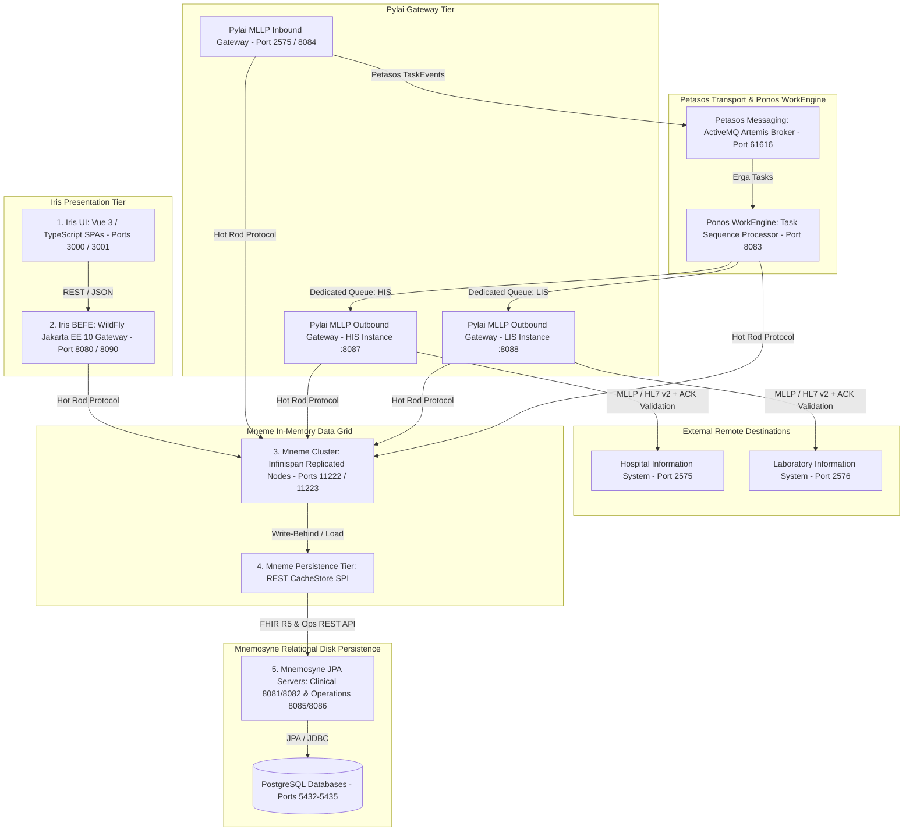

# Harmonia 5-Tier FHIR Platform

A modular, scalable, enterprise-grade Health Information Exchange (HIE) platform targeting HL7 FHIR Release 5 (R5). The Harmonia platform provides high-throughput in-memory cached access, asynchronous write-behind persistence, robust workflow task orchestration, and modern TypeScript/Vue presentation interfaces.

---

## Architectural Naming Conventions & System Meanings

Harmonia adopts naming conventions rooted in Greek mythology and classical terminology to clearly delineate domain boundaries and architectural roles across the platform:

| System / Subsystem | Architectural Role | Classical Origin & Meaning | Platform Scope & Responsibilities |
| :--- | :--- | :--- | :--- |
| **`Harmonia`** | **Health Integration Environment (HIE)** | *Harmonia* (Ἁρμονία) — Greek goddess of harmony, concord, and cosmic balance; the unifying force bringing diverse elements into agreement. | The overall root platform uniting clinical protocols (HL7 v2.x, FHIR R5), streaming message transports, in-memory caching grids, and relational persistence stores into a cohesive health information exchange. |
| **`Petasos`** | **Messaging / Transport & Event Distribution** | *Petasos* (πέτασος) — The winged sun hat worn by Hermes, messenger of the gods, symbolizing swift dispatch, journeying, and reliable delivery. | Asynchronous messaging backbone and transport layer (Apache ActiveMQ Artemis JMS message broker, Camel transport routes, and `ErgonEvent` notification publisher). |
| **`Energeia`** | **Workflow Services** | *Energeia* (ἐνέργεια) — The Aristotelian concept of actuality, activity, being-at-work, and continuous operational energy. | Workflow orchestration and services aggregator (`energeia`) uniting Ponos execution engine (`ponos`), Erga activity processing (`erga`), Praxis task sequences (`praxis`), and Ponos CLI (`ponos-cli`). |
| **`Ponos`** | **WorkEngine (Workflow Execution Framework)** | *Ponos* (Πόνος) — The Greek personification of hard work, continuous labor, effort, and industrious toil. | WildFly Jakarta EE 10 asynchronous workflow execution engine (`energeia/ponos`) consuming Erga/Praxis tasks and Petasos TaskEvents from message queues and updating Mneme cache. |
| **`Erga`** | **Task / Work Unit Activities** | *Erga* (ἔργα, pl. of *Ergon* / ἔργον) — The ancient Greek noun for works, tasks, actions, or discrete deeds. | Activity processing library (`energeia/erga`) providing base activity classes (`ErgonBase`) and Camel route abstractions for clinical transformations (e.g. ADT, MFN). |
| **`Praxis`** | **Task Sequence Definitions &amp; Structure** | *Praxis* (πρᾶξις) — The process by which a theory, lesson, or skill is enacted, embodied, or realized through structured action. | Library (`energeia/praxis`) managing the definitions, structure, loading, seeding, and cache synchronization of task sequences (`Praxis`). |
| **`Pragma`** | **Task Instance / State** | *Pragma* (πρᾶγμα) — That which has been done, an act, deed, concrete affair, or instance of action. | Concrete Task instance / state used wherever Task (as a synthetic FHIR::Task resource) is used within the codebase. |
| **`Calliope`** | **Canonical Model &amp; Schema Library** | *Calliope* (Καλλιόπη) — Chief of the Muses, Muse of eloquence and epic poetry; the authoritative voice of harmonious structure. | The authoritative repository and management service for the shared information models, schemas and structural definitions used throughout Harmonia (`calliope`). |
| **`Mnemosyne`** | **Persistence Layer (Relational Storage)** | *Mnemosyne* (Μνημοσύνη) — Titaness of memory, mother of the Muses, personifying enduring, durable remembrance. | Long-term relational disk persistence layer comprising Spring Boot HAPI FHIR JPA server (`mnemosyne-clinical`) and relational operations JPA server (`mnemosyne-operations`) backed by PostgreSQL. |
| **`Mneme`** | **Cache Layer (In-Memory Data Grid)** | *Mneme* (Μνήμη) — The classical Muse of active memory and rapid recollection. | High-throughput, low-latency in-memory data grid (`mneme-cluster`) powered by Infinispan with custom write-behind persistence SPI (`mneme-persistence`). |
| **`Hestia`** | **Data Services (Persistence &amp; Cache)** | *Hestia* (Ἑστία) — Goddess of the hearth, home, architecture, and foundational stability. | Data persistence services (`hestia`) managing relational databases (Mnemosyne) and in-memory caching grids (Mneme). |
| **`Iris`** | **User Interface / Presentation Services** | *Iris* (Ἶρις) — Goddess of the rainbow and divine messenger connecting heaven to humanity; symbol of visual representation and presentation. | Presentation tier (`iris`) comprising the WildFly Backend-For-Frontend gateway (`iris-befe`), Clinical UI (`iris-clinical`), and Operations Console (`iris-console`). |
| **`Pylai`** | **Interface / Gateway Services** | *Pylai* (Πύλαι, pl. of *Pyle* / πύλη) — Greek word for "gates", "gateways", or portals of entry and exit. | The boundary through which Harmonia communicates with external systems (`pylai`), including MLLP inbound gateway (`pylai-mllp-in`), MLLP outbound gateway (`pylai-mllp-out`), shared gateway base utilities (`pylai-mllp-base`), and MLLP synthetic test CLI (`pylai-mllp-cli`). |

---

## Architecture Overview

The system is organized into a 5-tier architecture across coordinated subsystems:



### Supported FHIR R5 Resources
The platform delivers full CRUD and search lifecycle support for 14 core FHIR R5 resources:
1. `Person`
2. `RelatedPerson`
3. `Practitioner`
4. `PractitionerRole`
5. `Organization`
6. `Location`
7. `HealthcareService`
8. `Group`
9. `Provenance`
10. `AuditEvent`
11. `Consent`
12. `Task` (Pragma — Task Instance / State)
13. `Communication`
14. `DocumentReference`

---

## Submodules

The project is structured into domain-driven service groups containing specialized modules:

- **`Calliope` (`calliope`)**: Canonical Model & Schema Library
  - The authoritative repository and management service for the shared information models, schemas and structural definitions used throughout Harmonia. Shared domain models, DTOs, event definitions (`ErgonEvent`), Pragma/Erga task payload wrappers (`ErgonPayload`), and enumerations (`ErgonReasonEnum`) with FHIR R5 `CodeableConcept` and `CodeableReference` mappings for cross-module reuse.
- **`Petasos` (`petasos`)**: High-Availability Messaging & Transport Subsystem
  - **`petasos-api`**: Core abstractions, interfaces (`Petasos`, `PetasosProducer`, `PetasosConsumer`, `PetasosMessage`, `PetasosDestination`), and standard envelope tracking `messageId`, `correlationId`, and schemas.
  - **`petasos-core`**: Envelope serialization, deduplication sliding window cache, configuration resolvers, and thread-safe metrics collection (`PetasosMetrics`).
  - **`petasos-artemis`**: Apache ActiveMQ Artemis adapter handling connection failover, dynamic cluster topology, and durable messaging.
  - **`petasos-test`**: Integration test harness (`EmbeddedArtemisCluster`) and automated HA/clustering test suites.
  - **`deployment`**: Docker Compose 4-node reference HA topology (Primary A/B and Backup A/B) and Artemis profiles.
  - **`docs`**: Architectural specifications ([Architecture](docs/architecture.md), [High Availability](docs/high-availability.md), [Failure Scenarios](docs/failure-scenarios.md)).
- **`Iris` (`iris`)**: User Interface / Presentation Services
  - **`iris-befe`**: WildFly Jakarta EE 10 Backend-For-Frontend providing dual-port separated RESTful interfaces for clinical FHIR resources on port 8080 (`/api/fhir/{resourceType}`) and operations/task-sequences on port 8090 (`/api/operations/{resourceType}`) connected via Mneme (Infinispan) Hot Rod client.
  - **`iris-clinical`**: Single Page Application built with Vue 3, Vite, TypeScript, and Pinia dedicated to FHIR R5 resource browsing and CRUD exploration.
  - **`iris-console`**: Single Page Application built with Vue 3, Vite, TypeScript, and Pinia dedicated to system topology monitoring, ActiveMQ Artemis messaging queues, distributed cache grid, and TaskSequence workflow management.
- **`Pylai` (`pylai`)**: Interface / Gateway Services
  - The boundary through which Harmonia communicates with external systems.
  - **`pylai-mllp-base`**: Core integration library providing Mneme cache services (Communication, Task, Provenance), Petasos (Artemis JMS) event production, canonical outbound models (`OutboundMllpRequest`, `OutboundMllpResponse`), destination registry (`MllpDestinationRegistry`), and FHIR resource management.
  - **`pylai-mllp-in`**: Jakarta EE 10 MLLP inbound interface with Apache Camel for HL7 v2.4/v2.5 ADT/MFN/ORU/ORM trigger event ingestion, Topic data type resolution, Communication encapsulation, and Ergon task generation.
  - **`pylai-mllp-out`**: WildFly Jakarta EE 10 MLLP outbound gateway with Apache Camel for reliable HL7 v2.x message transmission to external clinical systems, synchronous HL7 ACK/NACK validation, independent Petasos queues per egress destination (`petasos.queue.mllp.outbound.<endpoint-id>`), dynamic destination registry, Mneme cache state updates (FHIR `Communication`, `Task`, `Provenance`), and REST dispatch APIs (`/api/mllp/outbound/send`, `/api/mllp/outbound/adt/send`, `/api/mllp/outbound/mfn/send`).
  - **`pylai-mllp-cli`**: Command-line tool for generating and sending HL7 v2.4 MLLP messages and ADT trigger events (A01-A40) to Pylai MLLP Gateways with parameter customization (MRN, names, DOB, gender).
- **`Energeia` (`energeia`)**: Workflow Services &amp; Task Processing
  - **`erga`**: Shared activity library and base Apache Camel Route abstractions (`ErgonBase`) for task execution and HL7-to-FHIR transformations (e.g., `Adt2FhirMapper`, `Mfn2FhirBundle`).
  - **`praxis`**: Library managing the definition, structure, loading, and cache synchronization of task sequences (`Praxis`, `PraxisImplementation`, `TaskSequenceLoader`, `PraxisService`, `TaskSequenceDefaultSeeder`).
  - **`ponos`**: WildFly Jakarta EE 10 asynchronous workflow execution engine consuming Ergon/Erga tasks and Petasos task events via Artemis message queues.
  - **`ponos-cli`**: Command-line interface for connecting to Ponos workflow engine to trigger live reload and synchronization of message queues and task sequences, query runtime processor status, and validate configurations against the runtime environment.
- **`Hestia` (`hestia`)**: Mneme (Cache) & Mnemosyne (Persistence) Data Services
  - **`mnemosyne-clinical`**: Spring Boot Mnemosyne Clinical JPA server (FHIR R5) managing relational disk persistence via PostgreSQL/H2 with custom resource providers.
  - **`mnemosyne-operations`**: Spring Boot Mnemosyne Operations JPA server managing relational disk persistence for non-FHIR operational data, task sequences, and workflow definitions via PostgreSQL/H2.
  - **`hie-operations-cli`**: Command-line tool for interacting with the Mnemosyne Operations JPA Server, inspecting operational resources, and listing/managing all TaskSequence definitions.
  - **`mneme-cluster`**: Clustered High-Availability Mneme (Infinispan) Data Grid with custom FHIR and Operations SPI Store configuration.
  - **`mneme-persistence`**: Custom Mneme `NonBlockingStore` SPI (`FhirRestCacheStore` and `OperationsRestCacheStore`) performing asynchronous write-behind queuing and read-through loading against Mnemosyne Clinical and Operations JPA REST endpoints.

---

## Prerequisites

Ensure the following tools are installed on your host system:
- **Java Development Kit (JDK)**: Version 21+
- **Apache Maven**: Version 3.9+
- **Node.js & npm**: Node v20+ / npm 10+ (managed automatically by `frontend-maven-plugin` during Maven builds)
- **Docker & Docker Compose**: Docker Engine 24+ and Docker Compose v2+

---

## Building the Project

Compile all submodules, run unit/integration test suites, and package the artifacts:

```bash
# Build and run all automated tests across all 5 submodules
mvn clean test

# Build and package all JARs, WARs, and frontend bundles without tests
mvn clean package -DskipTests
```

---

## Executing the Platform via Docker Compose

The fastest and most reliable way to run the entire 5-tier environment is using Docker Compose.

### 1. Launch All Services

```bash
docker compose up --build -d
```

### 2. Verify Service Status

```bash
docker compose ps
```

All 17 services (across 17 containers) should show `Up` (and `healthy` where applicable):
- `hie-postgres-1`
- `hie-postgres-2`
- `hie-postgres-ops-1`
- `hie-postgres-ops-2`
- `hie-hapi-fhir-1`
- `hie-hapi-fhir-2`
- `hie-operations-1`
- `hie-operations-2`
- `hie-infinispan-node1`
- `hie-infinispan-node2`
- `hie-befe`
- `hie-iris-clinical`
- `hie-iris-console`
- `hie-mllp-gateway`
- `hie-mllp-outbound-his`
- `hie-mllp-outbound-lis`
- `hie-task-processor`

### 3. Service Endpoints and Port Mappings

| Service / Subsystem | Host Port | Internal Port | Description & URL |
| :--- | :--- | :--- | :--- |
| **Iris FHIR Resource UI** | `3000` | `80` | [http://localhost:3000](http://localhost:3000) (FHIR R5 Resource Explorer) |
| **Iris Operations UI** | `3001` | `80` | [http://localhost:3001](http://localhost:3001) (Topology, Queues & Task Sequences) |
| **Iris BEFE FHIR Gateway** | `8080` | `8080` | [http://localhost:8080/api/fhir](http://localhost:8080/api/fhir) (RESTful Clinical FHIR Endpoints) |
| **Iris BEFE Operations Gateway** | `8090` | `8090` | [http://localhost:8090/api/operations](http://localhost:8090/api/operations) (Operations & Task Sequence Telemetry) |
| **WildFly Admin Console** | `9990` | `9990` | [http://localhost:9990](http://localhost:9990) |
| **Mnemosyne Clinical JPA Node 1** | `8081` | `8080` | [http://localhost:8081/fhir](http://localhost:8081/fhir) (FHIR R5 REST Server) |
| **Mnemosyne Clinical JPA Node 2** | `8082` | `8080` | [http://localhost:8082/fhir](http://localhost:8082/fhir) (Replicated JPA Node) |
| **Mnemosyne Operations JPA Node 1** | `8085` | `8080` | [http://localhost:8085/api/operations](http://localhost:8085/api/operations) (Non-FHIR & TaskSequence Persistence) |
| **Mnemosyne Operations JPA Node 2** | `8086` | `8080` | [http://localhost:8086/api/operations](http://localhost:8086/api/operations) (Replicated Operations Node) |
| **Mneme Cluster Node 1** | `11222`, `7800` | `11222`, `7800` | Hot Rod & JGroups Discovery |
| **Mneme Cluster Node 2** | `11223`, `7801` | `11222`, `7800` | Hot Rod & JGroups Discovery |
| **Pylai MLLP Inbound Gateway** | `2575`, `8084` | `2575`, `8080` | HL7 v2.4/v2.5 MLLP Interface & REST endpoints |
| **Pylai MLLP Outbound Gateway (HIS Instance)** | `8087` | `8080` | [http://localhost:8087/api/mllp/outbound](http://localhost:8087/api/mllp/outbound) (Outbound MLLP Dispatch REST Endpoints & Health) |
| **Pylai MLLP Outbound Gateway (LIS Instance)** | `8088` | `8080` | [http://localhost:8088/api/mllp/outbound](http://localhost:8088/api/mllp/outbound) (Outbound MLLP Dispatch REST Endpoints & Health) |
| **Ponos Task Sequence Processor & Petasos Broker** | `8083`, `61616` | `8080`, `61616` | Workflow Task Processing Engine & Artemis Broker |
| **PostgreSQL FHIR Database Node 1** | `5432` | `5432` | `jdbc:postgresql://localhost:5432/fhir_node_1` (user: `fhir_user`, pass: `fhir_password`) |
| **PostgreSQL FHIR Database Node 2** | `5433` | `5432` | `jdbc:postgresql://localhost:5433/fhir_node_2` (user: `fhir_user`, pass: `fhir_password`) |
| **PostgreSQL Operations DB Node 1** | `5434` | `5432` | `jdbc:postgresql://localhost:5434/ops_node_1` (user: `ops_user`, pass: `ops_password`) |
| **PostgreSQL Operations DB Node 2** | `5435` | `5432` | `jdbc:postgresql://localhost:5435/ops_node_2` (user: `ops_user`, pass: `ops_password`) |

### 4. Stopping and Cleaning Up

```bash
# Stop all services
docker compose down

# Stop all services and remove persisted volume data
docker compose down -v
```

---

## End-to-End Workflow & Verification

You can verify the end-to-end data flow (Iris UI/REST -> Iris BEFE -> Mneme Cache -> Write-Behind SPI -> Mnemosyne Clinical JPA -> PostgreSQL) using `curl`:

### 1. Create a FHIR Resource via BEFE
```bash
curl -i -X POST http://localhost:8080/api/fhir/Organization \
  -H "Content-Type: application/json" \
  -d '{
    "resourceType": "Organization",
    "name": "General Healthcare System",
    "active": true
  }'
```
*Expected response:* `HTTP/1.1 201 Created` with a `Location: /api/fhir/Organization/{id}` header and the JSON resource body containing the assigned ID.

### 2. Read Resource (Served from Mneme Cache)
```bash
curl -i http://localhost:8080/api/fhir/Organization/{id}
```
*Expected response:* `HTTP/1.1 200 OK` with sub-10ms response latency.

### 3. Verify Asynchronous Persistence in Mnemosyne Clinical JPA
The write-behind persistence SPI asynchronously flushes mutations to the Mnemosyne Clinical JPA cluster:
```bash
curl -i http://localhost:8081/fhir/Organization/{id}
```
*Expected response:* `HTTP/1.1 200 OK` confirming data persistence on disk.

### 4. Interactive Web UI
Navigate to [http://localhost:3000](http://localhost:3000) to:
- Access the **Dashboard** displaying live resource metrics.
- Navigate to resource management pages (`Organizations`, `Locations`, `Practitioners`, `Roles`, `Services`, `Persons`, `Related Persons`, `Groups`, `Provenance`, `Audit`, `Consent`, `Tasks`, `Communication`, `Documents`).
- Create, filter, update, and delete records with automatic form validation.

---

## Running Submodules Locally (Development Mode)

If you prefer to run services individually on the host machine without Docker:

### 1. Database
Ensure PostgreSQL is running locally on port 5432 with database `fhir`, username `fhir_user`, and password `fhir_password` (or run `docker compose up -d postgres`).

### 2. Mnemosyne Clinical JPA Server
```bash
cd hestia/mnemosyne-clinical
SPRING_PROFILES_ACTIVE=postgres mvn spring-boot:run
```

### 3. Mneme Cluster
```bash
cd hestia/mneme-cluster
mvn clean package
# Start Mneme Infinispan server referencing the built mneme-persistence provider and configuration
```

### 4. WildFly BEFE
```bash
cd iris/iris-befe
mvn clean package
# Deploy target/iris-befe.war to your local WildFly 31+ application server
```

### 5. Vue 3 Iris Clinical (Vite Dev Server)
```bash
cd iris/iris-clinical
npm install
npm run dev
```
The Vite development server will start at `http://localhost:3000`.

### 6. Vue 3 Iris Console (Vite Dev Server)
```bash
cd iris/iris-console
npm install
npm run dev
```
The Vite development server will start at `http://localhost:3001`.

### 7. Pylai MLLP Inbound Gateway
```bash
cd pylai/pylai-mllp-in
mvn clean package
# Deploy target/pylai-mllp-in.war to WildFly application server listening on MLLP port 2575 and REST port 8084
```

### 8. Pylai MLLP Outbound Gateway
```bash
cd pylai/pylai-mllp-out
mvn clean package
# Deploy target/pylai-mllp-out.war to WildFly application server configured with target destination and Artemis broker properties (e.g. ports 8087 / 8088)
```

### 9. Ponos Workflow Task Processor
```bash
cd energeia/ponos
mvn clean package
# Deploy target/ponos.war to WildFly application server connected to Mneme cache grid and ActiveMQ Artemis broker
```

---

## License

Copyright (C) 2026 Mark Hunter.

This project is licensed under the terms of the GNU General Public License v3.0 (GPL-3.0). See the [LICENSE](LICENSE) file for details.
