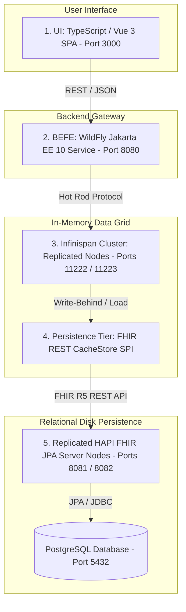

# Health Information Exchange (HIE) 5-Tier FHIR Platform

A modular, scalable, enterprise-grade Health Information Exchange (HIE) platform targeting HL7 FHIR Release 5 (R5). The platform provides high-throughput in-memory cached access, asynchronous write-behind persistence, and a modern TypeScript/Vue single-page web interface.

---

## Architecture Overview

The system is organized into a 5-tier architecture across 5 coordinated submodules:



### Supported FHIR R5 Resources
The platform delivers full CRUD and search lifecycle support for 8 core FHIR R5 resources:
1. `Person`
2. `RelatedPerson`
3. `Practitioner`
4. `PractitionerRole`
5. `Organization`
6. `Location`
7. `HealthcareService`
8. `Group`

---

## Submodules

- **`hapi-fhir-jpa-server`**: Spring Boot HAPI FHIR JPA server (FHIR R5) managing relational disk persistence via PostgreSQL/H2 with custom resource providers.
- **`persistence-tier`**: Custom Infinispan `NonBlockingStore` SPI (`FhirRestCacheStore`) performing asynchronous write-behind queuing and read-through loading against HAPI FHIR REST endpoints.
- **`hapi-fhir-jpa-server-1`**: HAPI FHIR JPA Server Node 1 (Replicated) managing FHIR data.
- **`hapi-fhir-jpa-server-2`**: HAPI FHIR JPA Server Node 2 (Replicated) managing FHIR data.
- **`befe`**: WildFly Jakarta EE 10 Backend-For-Frontend providing RESTful JAX-RS endpoints (`/api/fhir/{resourceType}`) connected via Infinispan Hot Rod client.
- **`ui`**: Single Page Application built with Vue 3, Vite, TypeScript, Pinia, and TailwindCSS, packaged via Nginx.

---

## Prerequisites

Ensure the following tools are installed on your host system:
- **Java Development Kit (JDK)**: Version 21+
- **Apache Maven**: Version 3.9+
- **Node.js & npm**: Node v20+ / npm 10+ (managed automatically by `frontend-maven-plugin` during Maven builds)
- **Docker & Docker Compose**: Docker Engine 24+ and Docker Compose v2+

---

## Building the Project

Compile all submodules, run unit/integration test suites, and package the artifacts:

```bash
# Build and run all automated tests across all 5 submodules
mvn clean test

# Build and package all JARs, WARs, and frontend bundles without tests
mvn clean package -DskipTests
```

---

## Executing the Platform via Docker Compose

The fastest and most reliable way to run the entire 5-tier environment is using Docker Compose.

### 1. Launch All Services

```bash
docker compose up --build -d
```

### 2. Verify Service Status

```bash
docker compose ps
```

All 7 containers should show `Up` (and `healthy` where applicable):
- `hie-postgres`
- `hie-hapi-fhir-1`
- `hie-hapi-fhir-2`
- `hie-infinispan-node1`
- `hie-infinispan-node2`
- `hie-befe`
- `hie-ui`

### 3. Service Endpoints and Port Mappings

| Service / Subproject | Host Port | Internal Port | Description & URL |
| :--- | :--- | :--- | :--- |
| **Vue 3 Web UI** | `3000` | `80` | [http://localhost:3000](http://localhost:3000) (Dashboard & Resource Management) |
| **WildFly BEFE Gateway** | `8080` | `8080` | [http://localhost:8080/api/fhir](http://localhost:8080/api/fhir) (RESTful FHIR Endpoints) |
| **WildFly Admin Console** | `9990` | `9990` | [http://localhost:9990](http://localhost:9990) |
| **HAPI FHIR JPA Node 1** | `8081` | `8080` | [http://localhost:8081/fhir](http://localhost:8081/fhir) (FHIR R5 REST Server) |
| **HAPI FHIR JPA Node 2** | `8082` | `8080` | [http://localhost:8082/fhir](http://localhost:8082/fhir) (Replicated JPA Node) |
| **HAPI FHIR JPA Node 1** | `8081` | `8080` | [http://localhost:8081/fhir](http://localhost:8081/fhir) (FHIR R5 REST Server) |
| **HAPI FHIR JPA Node 2** | `8082` | `8080` | [http://localhost:8082/fhir](http://localhost:8082/fhir) (Replicated JPA Node) |
| **PostgreSQL Database** | `5432` | `5432` | `jdbc:postgresql://localhost:5432/fhir` (user: `fhir_user`, pass: `fhir_password`) |

### 4. Stopping and Cleaning Up

```bash
# Stop all services
docker compose down

# Stop all services and remove persisted volume data
docker compose down -v
```

---

## End-to-End Workflow & Verification

You can verify the end-to-end data flow (UI/REST -> BEFE -> Infinispan -> Write-Behind SPI -> HAPI FHIR JPA -> PostgreSQL) using `curl`:

### 1. Create a FHIR Resource via BEFE
```bash
curl -i -X POST http://localhost:8080/api/fhir/Organization \
  -H "Content-Type: application/json" \
  -d '{
    "resourceType": "Organization",
    "name": "General Healthcare System",
    "active": true
  }'
```
*Expected response:* `HTTP/1.1 201 Created` with a `Location: /api/fhir/Organization/{id}` header and the JSON resource body containing the assigned ID.

### 2. Read Resource (Served from Infinispan Cache)
```bash
curl -i http://localhost:8080/api/fhir/Organization/{id}
```
*Expected response:* `HTTP/1.1 200 OK` with sub-10ms response latency.

### 3. Verify Asynchronous Persistence in HAPI FHIR JPA
The write-behind persistence SPI asynchronously flushes mutations to the HAPI FHIR JPA cluster:
```bash
curl -i http://localhost:8081/fhir/Organization/{id}
```
*Expected response:* `HTTP/1.1 200 OK` confirming data persistence on disk.

### 4. Interactive Web UI
Navigate to [http://localhost:3000](http://localhost:3000) to:
- Access the **Dashboard** displaying live resource metrics.
- Navigate to resource management pages (`Organizations`, `Locations`, `Practitioners`, `Roles`, `Services`, `Persons`, `Related Persons`, `Groups`).
- Create, filter, update, and delete records with automatic form validation.

---

## Running Submodules Locally (Development Mode)

If you prefer to run services individually on the host machine without Docker:

### 1. Database
Ensure PostgreSQL is running locally on port 5432 with database `fhir`, username `fhir_user`, and password `fhir_password` (or run `docker compose up -d postgres`).

### 2. HAPI FHIR JPA Server
```bash
cd hapi-fhir-jpa-server
SPRING_PROFILES_ACTIVE=postgres mvn spring-boot:run
```

### 3. Infinispan Cluster
```bash
cd infinispan-cluster
mvn clean package
# Start Infinispan server referencing the built persistence-tier provider and configuration
```

### 4. WildFly BEFE
```bash
cd befe
mvn clean package
# Deploy target/befe.war to your local WildFly 31+ application server
```

### 5. Vue 3 UI (Vite Dev Server)
```bash
cd ui
npm install
npm run dev
```
The Vite development server will start at `http://localhost:3000` with hot-module replacement enabled.

```xml
<plugin>
    <groupId>org.wildfly.plugins</groupId>
    <artifactId>wildfly-jar-maven-plugin</artifactId>
    <version>${wildfly-jar-maven-plugin.version}</version>
    <configuration>
        <feature-pack-location>wildfly@maven(org.jboss.universe:community-universe)#${wildfly.version}</feature-pack-location>
        <layers>
            <layer>jaxrs</layer>
            <layer>cdi</layer>
            <layer>jsonb</layer>
            <layer>management</layer>
        </layers>
        <context-root>/</context-root>
        <cloud/>
        <excluded-layers>
            <layer>deployment-scanner</layer>
        </excluded-layers>
        <plugin-options>
            <jboss-fork-embedded>true</jboss-fork-embedded>
        </plugin-options>
    </configuration>
    <executions>
        <execution>
            <goals>
                <goal>package</goal>
            </goals>
        </execution>
    </executions>
</plugin>
```
