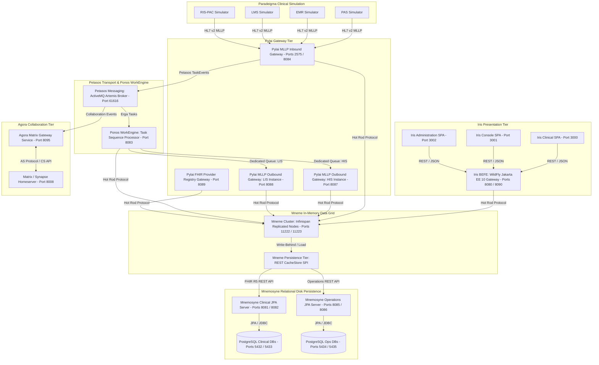

# Harmonia 5-Tier FHIR Platform

A modular, scalable, enterprise-grade Health Information Exchange (HIE) platform targeting HL7 FHIR Release 5 (R5). The Harmonia platform provides high-throughput in-memory cached access, asynchronous write-behind persistence, resilient messaging, robust workflow task orchestration, Matrix/Synapse clinical collaboration, and modern TypeScript/Vue 3 presentation interfaces.

---

## Architectural Naming Conventions & System Meanings

Harmonia adopts naming conventions rooted in Greek mythology and classical terminology to clearly delineate domain boundaries and architectural roles across the platform:

| System / Subsystem | Architectural Role | Classical Origin & Meaning | Platform Scope & Responsibilities |
| :--- | :--- | :--- | :--- |
| **`Harmonia`** | **Health Integration Environment (HIE)** | *Harmonia* (Ἁρμονία) — Greek goddess of harmony, concord, and cosmic balance; the unifying force bringing diverse elements into agreement. | The overall root platform uniting clinical protocols (HL7 v2.x, FHIR R5), streaming message transports, in-memory caching grids, relational persistence stores, and Matrix collaboration into a cohesive health information exchange. |
| **`Themis`** | **Policy & Authorisation Service** | *Themis* (Θέμις) — Ancient Greek Titaness of divine law, justice, fairness, natural order, and wise counsel. | Centralized policy and authorization subsystem (`themis`) delivering deterministic default-deny policy evaluation, role-to-authority mappings, security label governance, and non-PHI decision auditing. |
| **`Calliope`** | **Canonical Model & Schema Library** | *Calliope* (Καλλιόπη) — Chief of the Muses, Muse of eloquence and epic poetry; the authoritative voice of harmonious structure. | The authoritative repository and management service for the shared information models, schemas, and structural definitions used throughout Harmonia (`calliope`). |
| **`Hestia`** | **Data Services (Persistence & Cache)** | *Hestia* (Ἑστία) — Goddess of the hearth, home, architecture, and foundational stability. | Data persistence and caching services (`hestia`) managing relational databases (Mnemosyne) and in-memory caching grids (Mneme). |
| **`Mneme`** | **Cache Layer (In-Memory Data Grid)** | *Mneme* (Μνήμη) — The classical Muse of active memory and rapid recollection. | High-throughput, low-latency in-memory data grid (`mneme-cluster`) powered by Infinispan with custom write-behind persistence SPI (`mneme-persistence`). |
| **`Mnemosyne`** | **Persistence Layer (Relational Storage)** | *Mnemosyne* (Μνημοσύνη) — Titaness of memory, mother of the Muses, personifying enduring, durable remembrance. | Long-term relational disk persistence layer comprising Spring Boot HAPI FHIR JPA server (`mnemosyne-clinical`) and relational operations JPA server (`mnemosyne-operations`) backed by PostgreSQL. |
| **`Petasos`** | **Messaging / Transport & Event Distribution** | *Petasos* (πέτασος) — The winged sun hat worn by Hermes, messenger of the gods, symbolizing swift dispatch, journeying, and reliable delivery. | Resilient asynchronous messaging backbone and transport layer (`petasos`) providing decoupled messaging abstractions (`petasos-api`), deduplication engines, and Apache ActiveMQ Artemis broker adapters. |
| **`Energeia`** | **Workflow Services** | *Energeia* (ἐνέργεια) — The Aristotelian concept of actuality, activity, being-at-work, and continuous operational energy. | Workflow orchestration and activity aggregator (`energeia`) uniting Ponos execution engine (`ponos`), Erga activity processing (`erga`), Praxis task sequences (`praxis`), and Ponos CLI (`ponos-cli`). |
| **`Ponos`** | **WorkEngine (Workflow Execution Framework)** | *Ponos* (Πόνος) — The Greek personification of hard work, continuous labor, effort, and industrious toil. | WildFly Jakarta EE 10 asynchronous workflow execution engine (`energeia/ponos`) consuming Erga/Praxis tasks and Petasos TaskEvents from message queues and synchronizing with the Mneme cache. |
| **`Erga`** | **Task / Work Unit Activities** | *Erga* (ἔργα, pl. of *Ergon* / ἔργον) — The ancient Greek noun for works, tasks, actions, or discrete deeds. | Activity processing library (`energeia/erga`) providing base activity classes (`ErgonBase`) and Camel route abstractions for clinical transformations (e.g., ADT, MFN). |
| **`Praxis`** | **Task Sequence Definitions & Structure** | *Praxis* (πρᾶξις) — The process by which a theory, lesson, or skill is enacted, embodied, or realized through structured action. | Library (`energeia/praxis`) managing the definitions, structure, loading, seeding, and cache synchronization of task sequences (`Praxis`). |
| **`Pragma`** | **Task Instance / State** | *Pragma* (πρᾶγμα) — That which has been done, an act, deed, concrete affair, or instance of action. | Concrete Task instance and runtime execution state wrapper used across workflow orchestration and pipeline tracking. |
| **`Pylai`** | **Interface / Gateway Services** | *Pylai* (Πύλαι, pl. of *Pyle* / πύλη) — Greek word for "gates", "gateways", or portals of entry and exit. | The boundary through which Harmonia communicates with external systems (`pylai`), including MLLP inbound gateway (`pylai-mllp-in`), MLLP outbound gateway (`pylai-mllp-out`), FHIR Provider Registry gateway (`pylai-fhir-provider-registry`), shared utilities (`pylai-mllp-base`), and MLLP synthetic test CLI (`pylai-mllp-cli`). |
| **`Iris`** | **User Interface / Presentation Services** | *Iris* (Ἶρις) — Goddess of the rainbow and divine messenger connecting heaven to humanity; symbol of visual representation and presentation. | Presentation tier (`iris`) comprising the WildFly Backend-For-Frontend gateway (`iris-befe`), Clinical UI (`iris-clinical`), Operations Console (`iris-console`), and Provider Registry Administration UI (`iris-administration`). |
| **`Agora`** | **Collaboration & Matrix Gateway** | *Agora* (Ἀγορά) — The ancient Greek central public gathering space for assembly, civic discourse, and collaboration. | Real-time clinical collaboration projection subsystem (`agora`) interfacing with Matrix/Synapse via Application Service (AS) protocol, managing dynamic room and space lifecycles, and enforcing Themis default-deny security. |
| **`Paradeigma`** | **Synthetic Clinical Simulation Exemplar** | *Paradeigma* (Παράδειγμα) — The Greek term for pattern, archetype, exemplar, or illustrative model. | Comprehensive synthetic clinical simulation and testing subsystem (`paradeigma`) providing EMR, PAS, LMS, and RIS-PAC simulators, scenario generation engines, and automated multi-tier architecture verification. |

---

## Architecture Overview

The system is organized into a cohesive 5-tier architecture across coordinated subsystems:



### Supported FHIR R5 Resources
The platform delivers full CRUD, search, and validation lifecycle support for core FHIR R5 resources:
1. `Person`
2. `RelatedPerson`
3. `Practitioner`
4. `PractitionerRole`
5. `Organization`
6. `Location`
7. `HealthcareService`
8. `Group`
9. `Provenance`
10. `AuditEvent`
11. `Consent`
12. `Task` (Pragma — Task Instance / State)
13. `Communication`
14. `DocumentReference`

---

## Subprojects & Modules

The repository enforces strict separation of concerns across 9 core subprojects:

- **`Calliope` (`calliope`)**: Canonical Model & Schema Library
  - Authoritative repository and management service for shared domain models, schemas, and structural definitions.
  - Shared domain models, DTOs, event definitions (`ErgonEvent`), task payload wrappers (`ErgonPayload`), and enumerations (`ErgonReasonEnum`) with FHIR R5 `CodeableConcept` and `CodeableReference` mappings.

- **`Themis` (`themis`)**: Policy & Authorisation Subsystem
  - **`themis-api`**: Transport- and persistence-independent security contracts, domain models (`ThemisPrincipal`, `ThemisRole`, `ThemisAuthority`, `ThemisAction`, `ThemisResource`, `ThemisSecurityLabel`, `ThemisSecurityContext`), and decision interfaces.
  - **`themis-core`**: Deterministic default-deny policy evaluator, mnemonic role-to-authority mappings (`HarmoniaRoleEnum` to `HarmoniaAuthorityEnum`), built-in policies (`ProviderRegistryReadPolicy`, `ProviderRegistrySubmitPolicy`, `ProviderRegistryProcessPolicy`, `ProviderRegistryPersistPolicy`, `SystemAdminPolicy`), and controlled service identities (`HarmoniaServiceIdentities`).
  - **`themis-audit`**: Structured, non-PHI security decision auditing service (`ThemisAuditService`) and correlation logger tagged with the `AUDIT` security label.

- **`Hestia` (`hestia`)**: Data Services (Mnemosyne Persistence & Mneme Cache)
  - **`mnemosyne-clinical`**: Spring Boot Mnemosyne Clinical JPA server (FHIR R5) managing relational disk persistence via PostgreSQL/H2 with custom resource providers.
  - **`mnemosyne-operations`**: Spring Boot Mnemosyne Operations JPA server managing relational disk persistence for non-FHIR operational data, task sequences, and workflow definitions via PostgreSQL/H2.
  - **`mnemosyne-operations-cli`**: Command-line interface for inspecting and managing Mnemosyne Operations JPA resources and TaskSequence definitions.
  - **`mneme-cluster`**: Clustered high-availability Mneme (Infinispan) data grid with custom FHIR and Operations SPI store configurations.
  - **`mneme-persistence`**: Custom Mneme `NonBlockingStore` SPI (`FhirRestCacheStore` and `OperationsRestCacheStore`) performing asynchronous write-behind queuing and read-through loading against Mnemosyne Clinical and Operations JPA REST endpoints.

- **`Petasos` (`petasos`)**: High-Availability Messaging & Transport Subsystem
  - **`petasos-api`**: Pure Java messaging abstractions and contracts (`Petasos`, `PetasosProducer`, `PetasosConsumer`, `PetasosMessage`, `PetasosDestination`), standard envelope tracking `messageId`, `correlationId`, and message topics.
  - **`petasos-core`**: Envelope serialization, deduplication sliding window cache, configuration resolvers, and thread-safe metrics collection (`PetasosMetrics`).
  - **`petasos-artemis`**: Apache ActiveMQ Artemis adapter handling connection failover, dynamic cluster topology, and durable queue/topic management.
  - **`petasos-test`**: Integration test harness (`EmbeddedArtemisCluster`) and automated HA/clustering test suites.

- **`Energeia` (`energeia`)**: Workflow Services & Task Processing
  - **`erga`**: Shared activity library and base Apache Camel route abstractions (`ErgonBase`) for task execution, destination fan-out tracking, and HL7-to-FHIR transformations (e.g., `Adt2FhirMapper`, `Mfn2FhirBundle`).
  - **`praxis`**: Library managing definition, structure, loading, and cache synchronization of task sequences (`Praxis`, `PraxisImplementation`, `TaskSequenceLoader`, `PraxisService`, `TaskSequenceDefaultSeeder`).
  - **`ponos`**: WildFly Jakarta EE 10 asynchronous workflow execution engine consuming Erga/Praxis tasks and Petasos task events via Artemis message queues and updating Mneme cache state.
  - **`ponos-cli`**: Command-line tool for interacting with the Ponos workflow engine, triggering synchronization of queues and task sequences, and checking processor status.

- **`Pylai` (`pylai`)**: Inbound/Outbound Interface & Gateway Services
  - **`pylai-mllp-base`**: Core integration library providing Mneme cache services, Petasos (Artemis JMS) event production, canonical outbound models (`OutboundMllpRequest`, `OutboundMllpResponse`), destination registry (`MllpDestinationRegistry`), and FHIR resource management.
  - **`pylai-mllp-in`**: Jakarta EE 10 MLLP inbound gateway with Apache Camel for HL7 v2.4/v2.5 ADT/MFN/ORU/ORM trigger event ingestion, dual-write safety, Communication encapsulation, and Ergon task generation.
  - **`pylai-mllp-out`**: WildFly Jakarta EE 10 MLLP outbound gateway with Apache Camel for reliable HL7 v2.x message transmission to external clinical systems, synchronous HL7 ACK/NACK validation, independent Petasos queues per egress destination (`petasos.queue.mllp.outbound.<endpoint-id>`), and REST dispatch APIs.
  - **`pylai-mllp-cli`**: Command-line tool for generating and sending synthetic HL7 v2.4 MLLP messages and ADT trigger events (A01-A40) to Pylai MLLP Gateways with parameter customization.
  - **`pylai-fhir-provider-registry`**: REST gateway for Provider Registry operations interfacing with Themis security and Mneme cache.

- **`Iris` (`iris`)**: User Interface & Presentation Services
  - **`iris-befe`**: WildFly Jakarta EE 10 Backend-For-Frontend providing dual-port separated RESTful interfaces for clinical FHIR resources on port 8080 (`/api/fhir/{resourceType}`) and operations/task sequences on port 8090 (`/api/operations/{resourceType}`) connected via Mneme (Infinispan) Hot Rod client.
  - **`iris-clinical`**: Single Page Application built with Vue 3, Vite, TypeScript, and Pinia dedicated to FHIR R5 clinical resource browsing and CRUD exploration.
  - **`iris-console`**: Single Page Application built with Vue 3, Vite, TypeScript, and Pinia dedicated to system topology monitoring, ActiveMQ Artemis messaging queues, distributed cache grid, and TaskSequence workflow management.
  - **`iris-administration`**: Single Page Application built with Vue 3, Vite, TypeScript, and Pinia for Provider Registry administration and practitioner governance.

- **`Agora` (`agora`)**: Collaboration & Matrix Gateway Subsystem
  - **`agora-api`**: Contracts, interfaces, and DTOs for Matrix/Synapse collaboration projections, event encapsulation, and room/space lifecycles.
  - **`agora-matrix`**: Encapsulated Matrix protocol DTOs (Client-Server API, Synapse Admin API, Application Service transactions) preventing Matrix protocol structures from leaking into the wider platform.
  - **`agora-core`**: Core collaboration services, projection orchestration, room/space state machines, and Themis default-deny policy governance.
  - **`agora-service`**: Standalone collaboration gateway service handling Matrix Application Service (AS) transaction ingestion and Petasos event bridging.

- **`Paradeigma` (`paradeigma`)**: Synthetic Clinical Simulation Exemplar
  - **`paradeigma-common`**: Shared clinical simulation data models, generators, synthetic HL7 v2 message builders, and scenario helpers.
  - **`paradeigma-pas`**: Patient Administration System (PAS) simulator generating realistic patient admission, discharge, and transfer (ADT) event streams.
  - **`paradeigma-emr`**: Electronic Medical Record (EMR) simulator generating clinical observations, diagnostic reports, and document references.
  - **`paradeigma-lms`**: Laboratory Management System (LMS) simulator generating pathology orders (ORM) and laboratory results (ORU).
  - **`paradeigma-rispac`**: Radiology Information System & PACS (RIS-PAC) simulator generating imaging studies, appointments, and diagnostic imaging reports.
  - **`paradeigma-scenarios`**: End-to-end clinical workflow scenario engine for complex multi-facility patient journeys.
  - **`paradeigma-test`**: Integration test harness and ArchUnit architectural rule enforcement suite.

---

## Architectural Guardrails & Invariants

Harmonia enforces strict architectural invariants continuously verified via ArchUnit automated tests (`*ArchitectureTest`):

1. **Paradeigma Production Isolation**: Production modules must NEVER depend on or import `net.fhirfactory.harmonia.paradeigma.*` or include simulation flags.
2. **Petasos API Abstraction**: `petasos-api` is strictly free of JMS (`jakarta.jms..`) and ActiveMQ Artemis dependencies.
3. **Iris Presentation Decoupling**: Iris presentation modules must remain presentation-only and decoupled from direct JPA, Hibernate, or PostgreSQL database dependencies.
4. **Ingress Dual-Write Safety (REC-001)**: Inbound gateways (`pylai-mllp-in`) must guarantee downstream Petasos event acceptance before returning an `AA` (Application Accept) ACK.
5. **Destination Fan-Out State Tracking (REC-002)**: Workflow tasks in Mnemosyne and Pragma envelopes must track granular sub-status per fan-out destination.
6. **Default-Deny Security Governance**: All ingress endpoints, task processors, and storage mutators must evaluate authorization through Themis.
7. **Zero-PHI Diagnostic Logging**: Protected Health Information (PHI) must never be emitted into non-clinical log streams.
8. **Agora Collaboration & Matrix Isolation**: Agora encapsulates Matrix DTOs, coordinates with Ponos via Petasos queues only (no direct dependency), and enforces Themis default-deny authorization on all room operations.

---

## Prerequisites

Ensure the following tools are installed on your host system:
- **Java Development Kit (JDK)**: Version 21+
- **Apache Maven**: Version 3.9+
- **Node.js & npm**: Node v20+ / npm 10+ (managed automatically by `frontend-maven-plugin` during Maven builds)
- **Docker & Docker Compose**: Docker Engine 24+ and Docker Compose v2+

---

## Building the Project

### Standard Build
Compile all submodules, run unit test suites, and package artifacts:

```bash
# Build and run automated tests
mvn clean test

# Build and package all JARs, WARs, and frontend bundles without tests
mvn clean package -DskipTests
```

### Architecture Tests
Verify that all architectural boundaries and module invariants are strictly maintained:

```bash
mvn test -pl paradeigma/paradeigma-test -am -Dtest="*ArchitectureTest" -Dsurefire.failIfNoSpecifiedTests=false
```

### Docker Container Image Build
Build container images locally across all containerized modules:

```bash
mvn clean package -Pcontainer-build -DskipTests
```

---

## Executing the Platform via Docker Compose

The fastest and most reliable way to run the entire 5-tier environment is using Docker Compose.

### 1. Launch All Services

```bash
docker compose up --build -d
```

### 2. Verify Service Status

```bash
docker compose ps
```

All services across the containers should show `Up` (and `healthy` where applicable):
- `hie-postgres-1`, `hie-postgres-2` (PostgreSQL Clinical DB nodes)
- `hie-postgres-ops-1`, `hie-postgres-ops-2` (PostgreSQL Operations DB nodes)
- `hie-hapi-fhir-1`, `hie-hapi-fhir-2` (Mnemosyne Clinical JPA servers)
- `hie-operations-1`, `hie-operations-2` (Mnemosyne Operations JPA servers)
- `hie-infinispan-node1`, `hie-infinispan-node2` (Mneme In-Memory Cache Grid nodes)
- `hie-befe` (Iris WildFly Backend-For-Frontend)
- `hie-iris-clinical`, `hie-iris-console` (Iris Vue 3 SPAs)
- `hie-mllp-gateway` (Pylai Inbound MLLP Gateway)
- `hie-mllp-outbound-his`, `hie-mllp-outbound-lis` (Pylai Outbound MLLP Gateways)
- `hie-task-processor` (Ponos WorkEngine & Petasos Artemis Broker)

### 3. Service Endpoints and Port Mappings

| Service / Subsystem | Host Port | Internal Port | Description & URL |
| :--- | :--- | :--- | :--- |
| **Iris FHIR Resource UI** | `3000` | `80` | [http://localhost:3000](http://localhost:3000) (FHIR R5 Resource Explorer) |
| **Iris Operations UI** | `3001` | `80` | [http://localhost:3001](http://localhost:3001) (Topology, Queues & Task Sequences) |
| **Iris Administration UI** | `3002` | `80` | [http://localhost:3002](http://localhost:3002) (Provider Registry Administration) |
| **Iris BEFE FHIR Gateway** | `8080` | `8080` | [http://localhost:8080/api/fhir](http://localhost:8080/api/fhir) (RESTful Clinical FHIR Endpoints) |
| **Iris BEFE Operations Gateway** | `8090` | `8090` | [http://localhost:8090/api/operations](http://localhost:8090/api/operations) (Operations & Task Sequence Telemetry) |
| **WildFly Admin Console** | `9990` | `9990` | [http://localhost:9990](http://localhost:9990) |
| **Mnemosyne Clinical JPA Node 1** | `8081` | `8080` | [http://localhost:8081/fhir](http://localhost:8081/fhir) (FHIR R5 REST Server) |
| **Mnemosyne Clinical JPA Node 2** | `8082` | `8080` | [http://localhost:8082/fhir](http://localhost:8082/fhir) (Replicated JPA Node) |
| **Mnemosyne Operations JPA Node 1** | `8085` | `8080` | [http://localhost:8085/api/operations](http://localhost:8085/api/operations) (Non-FHIR & TaskSequence Persistence) |
| **Mnemosyne Operations JPA Node 2** | `8086` | `8080` | [http://localhost:8086/api/operations](http://localhost:8086/api/operations) (Replicated Operations Node) |
| **Mneme Cluster Node 1** | `11222`, `7800` | `11222`, `7800` | Hot Rod & JGroups Discovery |
| **Mneme Cluster Node 2** | `11223`, `7801` | `11222`, `7800` | Hot Rod & JGroups Discovery |
| **Pylai MLLP Inbound Gateway** | `2575`, `8084` | `2575`, `8080` | HL7 v2.4/v2.5 MLLP Interface & REST endpoints |
| **Pylai MLLP Outbound Gateway (HIS Instance)** | `8087` | `8080` | [http://localhost:8087/api/mllp/outbound](http://localhost:8087/api/mllp/outbound) (Outbound MLLP Dispatch REST Endpoints) |
| **Pylai MLLP Outbound Gateway (LIS Instance)** | `8088` | `8080` | [http://localhost:8088/api/mllp/outbound](http://localhost:8088/api/mllp/outbound) (Outbound MLLP Dispatch REST Endpoints) |
| **Ponos Task Sequence Processor & Petasos Broker** | `8083`, `61616` | `8080`, `61616` | Workflow Task Processing Engine & Artemis Broker |
| **Agora Matrix Collaboration Gateway** | `8095` | `8080` | [http://localhost:8095/api/agora](http://localhost:8095/api/agora) (Matrix AS Bridge & REST API) |
| **PostgreSQL FHIR Database Node 1** | `5432` | `5432` | `jdbc:postgresql://localhost:5432/fhir_node_1` (user: `fhir_user`, pass: `fhir_password`) |
| **PostgreSQL FHIR Database Node 2** | `5433` | `5432` | `jdbc:postgresql://localhost:5433/fhir_node_2` (user: `fhir_user`, pass: `fhir_password`) |
| **PostgreSQL Operations DB Node 1** | `5434` | `5432` | `jdbc:postgresql://localhost:5434/ops_node_1` (user: `ops_user`, pass: `ops_password`) |
| **PostgreSQL Operations DB Node 2** | `5435` | `5432` | `jdbc:postgresql://localhost:5435/ops_node_2` (user: `ops_user`, pass: `ops_password`) |

### 4. Stopping and Cleaning Up

```bash
# Stop all services
docker compose down

# Stop all services and remove persisted volume data
docker compose down -v
```

---

## End-to-End Workflow & Verification

You can verify the end-to-end data flow (Iris UI/REST -> Iris BEFE -> Mneme Cache -> Write-Behind SPI -> Mnemosyne Clinical JPA -> PostgreSQL) using `curl`:

### 1. Create a FHIR Resource via BEFE
```bash
curl -i -X POST http://localhost:8080/api/fhir/Organization \
  -H "Content-Type: application/json" \
  -d '{
    "resourceType": "Organization",
    "name": "General Healthcare System",
    "active": true
  }'
```
*Expected response:* `HTTP/1.1 201 Created` with a `Location: /api/fhir/Organization/{id}` header and the JSON resource body containing the assigned ID.

### 2. Read Resource (Served from Mneme Cache)
```bash
curl -i http://localhost:8080/api/fhir/Organization/{id}
```
*Expected response:* `HTTP/1.1 200 OK` with sub-10ms response latency.

### 3. Verify Asynchronous Persistence in Mnemosyne Clinical JPA
The write-behind persistence SPI asynchronously flushes mutations to the Mnemosyne Clinical JPA cluster:
```bash
curl -i http://localhost:8081/fhir/Organization/{id}
```
*Expected response:* `HTTP/1.1 200 OK` confirming data persistence on disk.

### 4. Interactive Web UI
Navigate to [http://localhost:3000](http://localhost:3000) or [http://localhost:3001](http://localhost:3001) to:
- Access the **Dashboard** displaying live resource metrics.
- Navigate to resource management pages (`Organizations`, `Locations`, `Practitioners`, `Roles`, `Services`, `Persons`, `Related Persons`, `Groups`, `Provenance`, `Audit`, `Consent`, `Tasks`, `Communication`, `Documents`).
- Create, filter, update, and delete records with automatic form validation.

---

## Running Submodules Locally (Development Mode)

If you prefer to run services individually on the host machine without Docker:

### 1. Database
Ensure PostgreSQL is running locally on port 5432 with database `fhir_node_1`, username `fhir_user`, and password `fhir_password` (or run `docker compose up -d postgres-1`).

### 2. Mnemosyne Clinical JPA Server
```bash
cd hestia/mnemosyne-clinical
SPRING_PROFILES_ACTIVE=postgres mvn spring-boot:run
```

### 3. Mneme Cluster
```bash
cd hestia/mneme-cluster
mvn clean package
# Start Mneme Infinispan server referencing the built mneme-persistence provider and configuration
```

### 4. WildFly BEFE
```bash
cd iris/iris-befe
mvn clean package
# Deploy target/iris-befe.war to your local WildFly 31+ application server
```

### 5. Vue 3 Iris Clinical (Vite Dev Server)
```bash
cd iris/iris-clinical
npm install
npm run dev
```
The Vite development server will start at `http://localhost:3000`.

### 6. Vue 3 Iris Console (Vite Dev Server)
```bash
cd iris/iris-console
npm install
npm run dev
```
The Vite development server will start at `http://localhost:3001`.

### 7. Vue 3 Iris Administration (Vite Dev Server)
```bash
cd iris/iris-administration
npm install
npm run dev
```
The Vite development server will start at `http://localhost:3002`.

### 8. Pylai MLLP Inbound Gateway
```bash
cd pylai/pylai-mllp-in
mvn clean package
# Deploy target/pylai-mllp-in.war to WildFly application server listening on MLLP port 2575 and REST port 8084
```

### 9. Pylai MLLP Outbound Gateway
```bash
cd pylai/pylai-mllp-out
mvn clean package
# Deploy target/pylai-mllp-out.war to WildFly application server configured with target destination and Artemis broker properties
```

### 10. Ponos Workflow Task Processor
```bash
cd energeia/ponos
mvn clean package
# Deploy target/ponos.war to WildFly application server connected to Mneme cache grid and ActiveMQ Artemis broker
```

### 11. Agora Collaboration Gateway
```bash
cd agora/agora-service
mvn clean package
# Deploy target/agora-service.war or run standalone Agora gateway service
```

---

## Documentation & Architectural Specifications

Comprehensive technical specifications, message lifecycles, and security guides are organized across the following documentation modules:

- **[System Architecture Overview](docs/architecture/overview.md)**: Comprehensive architectural blueprint, multi-tier layout, and cross-subsystem contracts.
- **[Architectural Guardrails for AI Agents (AGENTS.md)](AGENTS.md)**: Authoritative architectural boundaries, subproject hierarchy, mandatory invariants, and test commands.
- **[Runtime Architecture & Topology](docs/architecture/runtime-architecture.md)**: Concrete runtime topology, clustering models, network flows, and failure domains.
- **[Execution Model & Task Processing](docs/architecture/execution-model.md)**: Deep dive into Ponos, Erga, Praxis, and Pragma task lifecycle execution.
- **[Security Architecture & Themis Framework](docs/security/architecture.md)**: Defence-in-depth principles, default-deny policy engine, role-to-authority mappings, service identities, and boundary checkpoint matrices.
- **[PHI-Aware Logging Architecture & Security Policy](docs/security/logging.md)**: 5-tier logging policy matrix, dual-gate security evaluation, `PhiLogger` API specification, and appender isolation.
- **[Provider Registry Security & Architecture](docs/provider-registry/security.md)**: Domain-specific access control, FHIR security labels (`PROVIDER_REGISTRY`), and persistence gates.
- **[Petasos Messaging & Artemis Architecture](docs/architecture.md)**: Clustered messaging topology, replication, message envelope specifications, and delivery guarantees.
- **[Persistence & Storage Architecture](docs/persistence-architecture.md)**: Storage model (Artemis journal, Ponos cache grid, Mnemosyne PostgreSQL database, Paradeigma exemplar state).
- **[Message Lifecycle & Flow Specifications](docs/message-lifecycle.md)**: End-to-end clinical message sequences (ADT fan-out, ORM routing, ORU ingestion) and dual-write failure analyses.
- **[Failure Recovery & Guarantees](docs/failure-recovery.md)**: Restart recovery, lease reclamation, idempotency models, and DLQ handling.
- **[MicroK8s Deployment Reference Guide](docs/deployment-microk8s.md)**: Kubernetes workloads, container orchestration, and multi-node cluster deployment.

---

## License

Copyright (C) 2026 Mark Hunter.

This program is free software: you can redistribute it and/or modify it under the terms of the GNU General Public License as published by the Free Software Foundation, either version 3 of the License, or (at your option) any later version.

This program is distributed in the hope that it will be useful, but WITHOUT ANY WARRANTY; without even the implied warranty of MERCHANTABILITY or FITNESS FOR A PARTICULAR PURPOSE. See the [GNU General Public License](LICENSE) for details.
