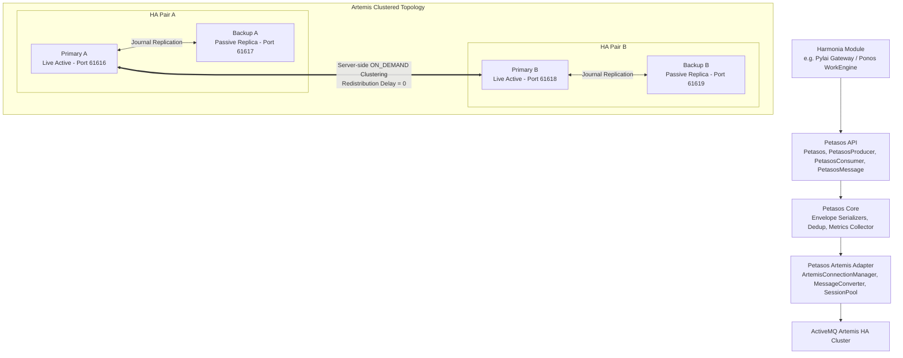
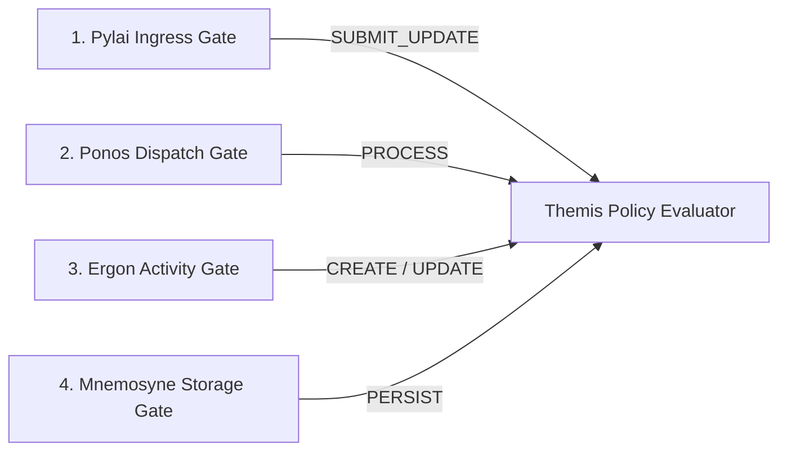

# Petasos Architecture

Petasos is the reliable, high-availability asynchronous messaging and event distribution framework for the **Harmonia** Health Integration Environment (HIE).

Its primary mandate is to decouple Harmonia microservices, gateways (Pylai), and workflow processors (Ponos/Erga) through resilient, durable message transport powered by **Apache ActiveMQ Artemis**, while completely encapsulating and hiding Artemis-specific connection APIs and JMS boilerplate behind clean, healthcare-ready domain abstractions.

---

### Layered Architecture & Component Model

The Petasos subsystem sits between upstream Harmonia modules and the underlying clustered messaging infrastructure.

---

### Key Architectural Concepts

#### 1. Clustering vs. High Availability (HA) Replication

Petasos cleanly distinguishes between **Server-Side Clustering** and **HA Replication**:

* **Clustering (`petasos-cluster`)**:
  * Unites multiple **concurrently active** Artemis brokers (`Primary A` and `Primary B`) into a unified messaging mesh.
  * Dynamically load-balances messages across active nodes based on consumer demand (`ON_DEMAND`).
  * If consumers disconnect from one node, queued messages are automatically redistributed across cluster connections to available consumers on other active nodes (`redistribution-delay = 0`).
  * Enables horizontal scalability as new active/backup pairs are introduced.

* **HA Replication (`group-a`, `group-b`)**:
  * Protects an individual broker against node, VM, or process failure.
  * An active Primary node continuously replicates its persistent journal stream (NIO file journal) over the network to a paired passive Backup replica.
  * When a Primary fails, its paired Backup detects the failure and immediately activates as the new Live broker without data loss.

#### 2. Isolated Storage Ownership

* Multiple active Artemis brokers **never share journal directories or storage filesystems**. Shared-storage architectures create single points of failure and storage lock contention.
* Each broker instance (Primary A, Backup A, Primary B, Backup B) maintains its own independent storage tree:
  * `./data/journal` (Artemis high-performance NIO file journal)
  * `./data/bindings` (Queue and routing configurations)
  * `./data/paging` (Paging files when memory thresholds are exceeded)
  * `./data/large-messages` (Large streaming payloads)
  * Unique Broker Identity and Node ID.

#### 3. Broker Durability vs. Harmonia Application Persistence (Mnemosyne)

* **Artemis Journal Durability**:
  * Exclusively responsible for transient in-flight message transport durability until acknowledged by consuming applications.
  * It is **not** a clinical database or application persistence store.
* **Mnemosyne / Mneme Persistence**:
  * Harmonia’s permanent clinical records (FHIR R5 resources, Provenance, AuditEvents, Task histories) are managed and persisted by **Mnemosyne** JPA database servers (PostgreSQL) and **Mneme** distributed caches (Infinispan).

---

### Standard Message Envelope

Petasos provides an immutable, strongly-typed envelope (`PetasosMessage`) designed for healthcare interoperability:

| Field | Type | Description |
| :--- | :--- | :--- |
| `messageId` | `String` | Universally unique message identifier (UUID). |
| `correlationId` | `String` | Tracks the conversational thread or end-to-end integration transaction. |
| `causationId` | `String` | Tracks the immediate predecessor message or event triggering this action. |
| `messageType` | `String` | Logical event type (e.g., `PatientAdmitEvent`, `ObservationDispatch`). |
| `source` | `String` | Logical identifier of the originating gateway or module. |
| `destination` | `PetasosDestination` | Target queue or topic routing address. |
| `timestamp` | `Instant` | Message creation timestamp. |
| `contentType` | `String` | MIME type (e.g., `application/json`, `application/fhir+json`). |
| `schemaIdentifier` | `String` | Model schema URI (e.g., `http://hl7.org/fhir/StructureDefinition/Patient`). |
| `schemaVersion` | `String` | Schema version (e.g., `5.0.0`, `R5`). |
| `payload` | `byte[]` | Opaque binary or text payload. Completely uninspected by Petasos transport. |
| `metadata` | `Map<String, Object>` | Custom transport headers, tracing tokens, and tenancy metadata. |
| `durable` | `boolean` | Indicates whether persistent file journal storage is required before acknowledgment. |
| `duplicateDetectionId`| `String` | Stable identifier used by Artemis and Petasos for idempotent deduplication. |

---

### Delivery Guarantees & Idempotency

* **At-Least-Once Delivery**: Petasos guarantees that acknowledged durable messages are never lost across broker restarts, network interruptions, or failovers. In exchange, consuming applications must be idempotent.
* **Deduplication Mechanisms**:
  1. **Broker-Side Deduplication**: Artemis evaluates the `_AMQ_DUPL_ID` header (mapped from `PetasosMessage.duplicateDetectionId`) against its sliding ID cache (`id-cache-size = 20000`). Duplicate transmissions within the cache window are dropped automatically.
  2. **Client-Side Deduplication**: `DuplicateDetector` maintains an in-memory sliding window cache on consumers to suppress duplicates locally.
  3. **Application Idempotency**: Healthcare workflows use `messageId` and FHIR identifiers in Mneme/Mnemosyne to achieve business-level idempotency.

---

### Observability & Privacy Protection

* **Strict Clinical Privacy**: Petasos explicitly avoids logging payload contents at any log level (`INFO`, `WARN`, `ERROR`, `DEBUG`) to prevent sensitive Protected Health Information (PHI) exposure in server logs.
* **Standard Metrics (`PetasosMetrics`)**:
  * Messages sent and received totals.
  * Message processing and transmission failures.
  * Broker failover and reconnection counts.
  * Message redelivery counts.
  * Dead Letter Queue (DLQ) arrival counts.
  * Active producer and consumer counts.

---

### Security Framework & Defence-in-Depth (Themis)

Harmonia implements a multi-tier **defence-in-depth** security architecture governed by **Themis**, the centralized Policy and Authorisation Service:

* **Default-Deny Policy Invariant**: Every ingress request, message queue dispatch, asynchronous task execution, and database mutation is denied unless explicitly permitted by deterministic Themis policy rules.
* **Role and Authority Decoupling**: Mnemonic roles (`HarmoniaRoleEnum`, e.g., `PRV_RDR`, `PRV_SUB`, `PRV_PROC`, `PRV_APR`, `PRV_ADM`, `AUD_RDR`, `SYS_INT`, `SYS_ADM`) map to granular authorities (`HarmoniaAuthorityEnum`), ensuring that business logic evaluates exact capability tokens.
* **Immutable Security Context (`Pragma`)**: Ingress caller identities (`ThemisPrincipal`) and authority claims are immutably captured at Pylai and propagated across asynchronous Petasos queues and Ponos pipelines via FHIR R5 Task extensions.
* **Independent Persistence Gates**: In-memory caching and database persistence services (Mnemosyne) independently evaluate storage mutation permissions before executing writes, preventing privilege amplification or repository bypass.
* **Non-PHI Auditing**: Every authorization decision is captured by `ThemisAuditService` as a structured, non-PHI `ThemisAuditEvent` carrying correlation lineage.

---

### Persistence, Lifecycle & Recovery Documentation Index

For comprehensive deep dives into Harmonia's persistence model, database schemas, message lifecycles, and failure recovery specifications, refer to:

1. **[Persistence Architecture](persistence-architecture.md)**: 4-tier storage model (Artemis journal, Ponos cache grid, Mnemosyne PostgreSQL database, Paradeigma exemplar state), persistent entity catalogue, and ownership boundaries.
2. **[Database Schema Specification](database-schema.md)**: Detailed relational table definitions (`hie_fhir_resources`, `hie_operations_resources`), JPA mappings, unique constraints, and PostgreSQL physical DDL.
3. **[Message Lifecycle & Transaction Boundaries](message-lifecycle.md)**: End-to-end clinical message flows (PAS ADT fan-out, EMR ORM routing, LMS/RIS ORU ingestion), Mermaid sequence diagrams, and dual-write failure window analyses.
4. **[Failure-Recovery Architecture](failure-recovery.md)**: Comprehensive failure matrix, restart recovery procedures, lease/ownership recovery, 4-tier idempotency model, ACK semantics (AA/AE/AR), retry policies, and DLQ handling.
5. **[Recovery Guarantees & Objectives](recovery-guarantees.md)**: Formal delivery guarantees (at-least-once, effectively-once) and Recovery Point Objectives (RPO) / Recovery Time Objectives (RTO) across all platform boundaries.
6. **[Persistence & Recovery Gap Analysis](persistence-recovery-gaps.md)**: Catalog of identified implementation deviations (REC-001 through REC-004) with risk ratings and remediation roadmaps.

---

### Security Framework Documentation Index

For complete specifications on the Themis security framework, authorization policies, and boundary enforcement, refer to:

1. **[Security Architecture Overview](security/architecture.md)**: Executive overview, defence-in-depth principles, boundary checkpoint matrix, and non-amplification invariants.
2. **[Themis Core Subsystem](security/themis.md)**: Subsystem architecture, module organization, `ThemisService` contracts, and deterministic evaluation pipeline.
3. **[Policy Model & Precedence](security/policy-model.md)**: Policy interface (`ThemisPolicy`), evaluation precedence (`Explicit Deny` $\rightarrow$ `Policy Rules` $\rightarrow$ `Default Deny`), and built-in domain policies.
4. **[Mnemonic Roles & Granular Authorities](security/roles-authorities.md)**: Complete mapping of mnemonic roles (`HarmoniaRoleEnum`) to granular authorities (`HarmoniaAuthorityEnum`).
5. **[Principals & Identity Model](security/principals.md)**: Principal types (`HUMAN`, `SYSTEM`, `SERVICE`, `PROCESS`), naming conventions, and credential hygiene.
6. **[Controlled Service Identities](security/service-identities.md)**: Catalogue of internal service identities (`HarmoniaServiceIdentities`) and administrative separation.
7. **[Data Security Labels & FHIR Mapping](security/security-labels.md)**: Security labels (`HarmoniaSecurityLabelEnum`) and serialization to FHIR R5 `Resource.meta.security`.
8. **[Pylai Ingress Security](security/pylai-security.md)**: Gateway interceptor enforcement, interaction mapping, and asynchronous task submission.
9. **[Pragma Security Context](security/pragma-security.md)**: Immutable caller context propagation and FHIR R5 Task extension serialization.
10. **[Ponos Execution & Dispatch Security](security/ponos-security.md)**: Asynchronous task dispatch gates, dual-authority verification, and failure handling.
11. **[Ergon Security Envelopes](security/ergon-security.md)**: Activity security definitions (`ErgonSecurityDefinition`), permitted actions, and execution envelopes.
12. **[Provider Registry Security](security/provider-registry-security.md)**: Domain-specific security rules, resource classifications, and independent storage gates.
13. **[Security Decision Auditing](security/audit.md)**: `ThemisAuditEvent` schema, privacy sanitization (no PHI, no tokens), and correlation tracking.
14. **[Failure Behaviour & Fail-Safe Defaults](security/failure-behaviour.md)**: Fail-closed mechanics, decision reason codes (`ThemisDecisionReason`), and error handling.
15. **[Threat Model & Risk Analysis](security/threat-model.md)**: Threat vectors, defence-in-depth mitigations, and residual risk assessment.
16. **[Security Gap Analysis](security/security-gaps.md)**: Architectural security gap tracking matrix (GAP-01 to GAP-07) and remediation roadmap.
17. **[Testing Strategy & Verification Guide](security/testing.md)**: Utilitarian testing philosophy, acceptance scenarios (A through E), and negative tampering tests.
