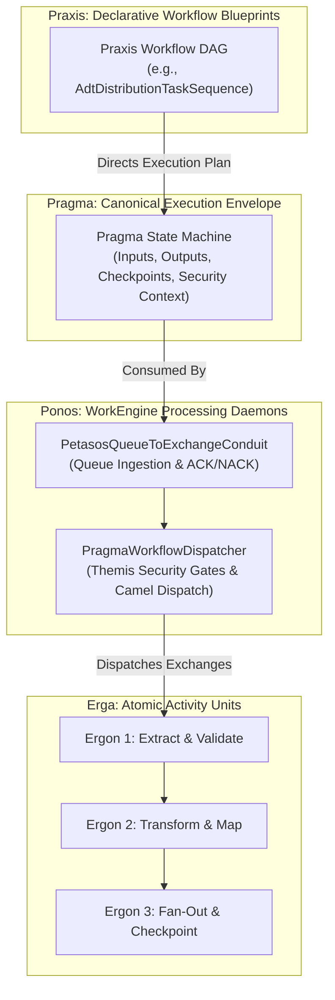
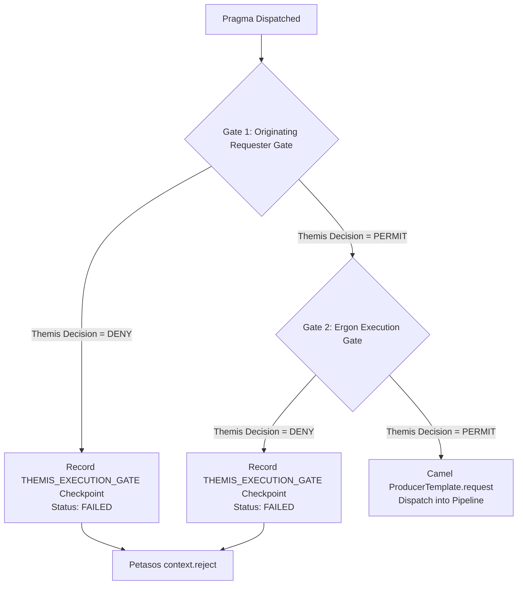
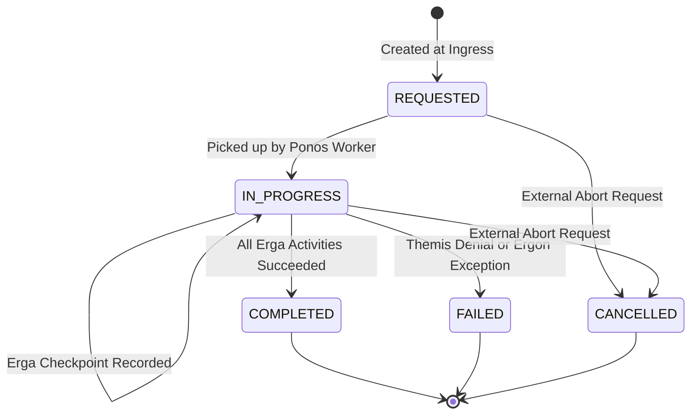

# Energeia Workflow & Task Execution Model `[IMPLEMENTED]`

Energeia constitutes Harmonia's core workflow and task processing engine. It organizes processing into a deterministic, four-tier task execution hierarchy: **Praxis** (Workflow DAGs), **Pragma** (Canonical State Machines), **Ponos** (WorkEngine Daemons), and **Erga** (Single-Responsibility Activities).

---

## 1. 4-Tier Task Processing Hierarchy `[IMPLEMENTED]`



### Hierarchy Dimension Mapping
| Level | Metaphor | Architectural Entity | Concrete Implementation | Primary Invariant |
| :--- | :--- | :--- | :--- | :--- |
| **Level 1** | *Praxis* (Action / Practice) | Workflow Blueprint DAG | `PraxisImplementation`, `TaskSequenceLoader` | Declarative, immutable graph topology. |
| **Level 2** | *Pragma* (Thing Done / Fact) | Task Execution State Machine | `Pragma`, `PragmaCheckpoint`, `ErgonPayload` | Immutable history; zero unmasked PHI in envelope headers. |
| **Level 3** | *Ponos* (Labor / Engine) | Worker Daemon & Conduits | `PetasosQueueToExchangeConduit`, `TaskProcessorRouteBuilder` | Consumes Petasos queues; enforces Themis authorization. |
| **Level 4** | *Ergon* (Work / Unit) | Atomic Activity Step | `ErgonBase`, `AdtDistributionErgon`, `Adt2FhirMapper` | Single responsibility, idempotent, granular checkpoints. |

---

## 2. Ingress Conduits & Camel Routing `[IMPLEMENTED]`

Ponos bridges messaging queues into Apache Camel route execution pipelines using two specialized conduits:

### 2.1 Petasos-to-Exchange Conduit (`PetasosQueueToExchangeConduit`)
Consumes standard `PetasosMessage` envelopes from configured transport queues:
1. Receives message via `petasos.receive(queue, handler)`.
2. Converts `PetasosMessage` into canonical `Pragma` instance (`convertToPragma`), maintaining correlation and causation IDs.
3. Forwards `Pragma` to `PragmaWorkflowDispatcher`.
4. If workflow succeeds, invokes `context.acknowledge()`; if execution fails, invokes `context.reject()`.

### 2.2 Task Processor Route Builder (`TaskProcessorRouteBuilder`)
Implements lightweight Camel JMS routes:
- `jms:queue:task.processing.queue` -> `taskMessageProcessor`
- `jms:queue:task.event.queue.*` -> `taskEventMessageProcessor` -> `direct:sequence-dispatcher`
- `direct:sequence-dispatcher` -> Dynamically routes to sequence endpoints via `recipientList(method(this, "resolvePipelineEndpoints"))`.

---

## 3. Themis Dual-Authority Security Gates `[IMPLEMENTED]`

Before any `Pragma` task is permitted into a Camel route pipeline, `PragmaWorkflowDispatcher` executes two distinct Themis security policy evaluations:



### Themis Gate Specifications
1. **Gate 1: Originating Requester Evaluation**:
   - Asserts whether the client or system that created the task (`originatingPrincipal`) possessed sufficient authority to request this operation on the target resource domain.
   - Action: `ThemisAction.SUBMIT_UPDATE`.
2. **Gate 2: Ergon Execution Authority Evaluation**:
   - Asserts whether the internal worker daemon (`process:ponos-engine`) possesses the execution privileges required by the specific Erga activities in the target Praxis workflow.
   - Action: `ThemisAction.PROCESS`.

---

## 4. Pragma Task State Machine & Checkpointing `[IMPLEMENTED]`

The canonical `Pragma` advances through deterministic state transitions:



### Checkpointing Mechanics (`PragmaCheckpoint`)
Every activity unit records structured checkpoints directly into the `Pragma`:
```java
PragmaCheckpoint cp = new PragmaCheckpoint(
    pragma.getPragmaId(),
    "adt-distribution",
    "FANOUT_DISPATCH_INITIATED",
    PragmaStatus.IN_PROGRESS,
    checkpointOrder++
);
cp.addMetadata("destinationQueue", targetQueue);
cp.addMetadata("status", "QUEUED");
pragma.addCheckpoint(cp);
```
- **Durability**: Checkpoints are written to Mneme (`task-cache`) and persisted asynchronously to Mnemosyne PostgreSQL via write-behind SPI.
- **Granular Fan-Out Tracking (REC-002)**: Enables operational consoles (`iris-console`) to display real-time per-destination delivery progress for complex multi-cast workflows.

---

## 5. Thread Pool Sizing & Concurrency Governance `[CONFIGURED]`

Ponos WorkEngine manages background worker concurrency using configured worker pools:

| Parameter Key | Environment Variable | Default Value | Description |
| :--- | :--- | :--- | :--- |
| `ponos.worker.threads.core` | `PONOS_WORKER_CORE` | `10` | Core worker threads per Ponos replica. |
| `ponos.worker.threads.max` | `PONOS_WORKER_MAX` | `50` | Maximum bursting threads for high-volume spikes. |
| `ponos.worker.queue.capacity` | `PONOS_QUEUE_CAPACITY` | `1000` | In-memory work queue capacity before backpressure. |
| `ponos.task.timeout.seconds` | `PONOS_TASK_TIMEOUT` | `30` | Execution timeout before task abort and DLQ escalation. |
