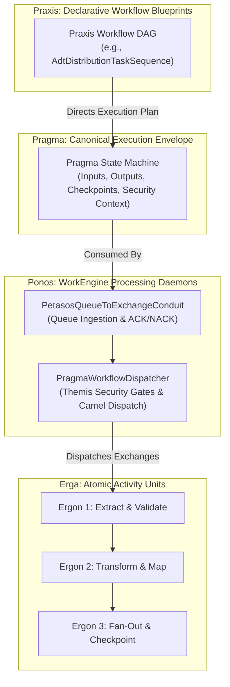
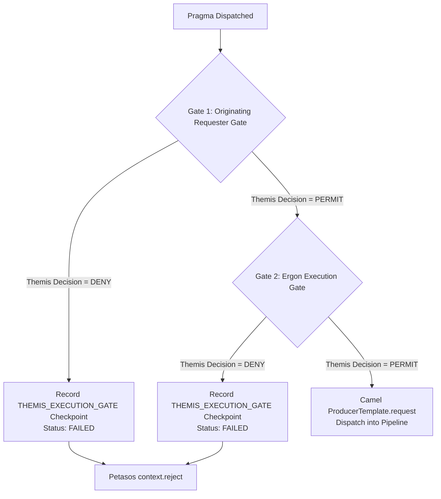
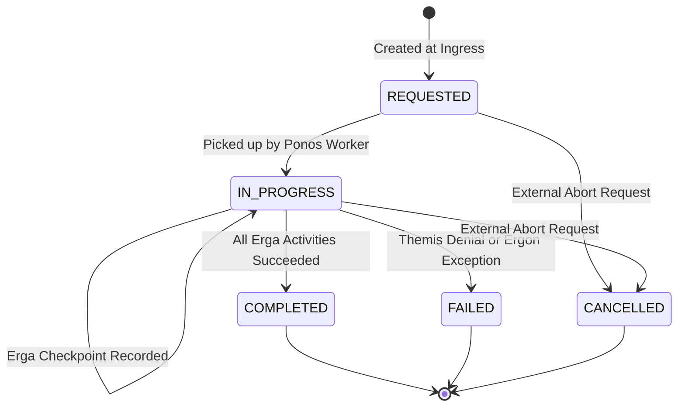

# Energeia Workflow & Task Execution Model `[IMPLEMENTED]`

This is legacy architecture and implementation documentation under the
repository [RADS / legacy-doco policy](../../AGENTS.md#12-rads-and-legacy-documentation-governance).
The general runtime-AI position in §§6–6.1 is superseded by
[Domain04's optional adjunct boundary](../markdown/04-information-architecture/guardrails/observable-information-and-domain-meaning.md#4-runtime-ai-as-an-optional-adjunct).
The wrapper preserves that original content. The other sections, including
§6.2's assurance-specific material, remain reconciliation input or supporting
detail and do not independently establish current architecture.

Energeia constitutes Harmonia's core workflow and task processing engine. It organizes processing into a deterministic, four-tier task execution hierarchy: **Praxis** (Workflow DAGs), **Pragma** (Canonical State Machines), **Ponos** (WorkEngine Daemons), and **Erga** (Single-Responsibility Activities).

---

## 1. 4-Tier Task Processing Hierarchy `[IMPLEMENTED]`


```mermaid
graph TD
    subgraph Tier1 ["Praxis: Declarative Workflow Blueprints"]
        PRAXIS["Praxis Workflow DAG<br/>(e.g., AdtDistributionTaskSequence)"]
    end

    subgraph Tier2 ["Pragma: Canonical Execution Envelope"]
        PRAGMA["Pragma State Machine<br/>(Inputs, Outputs, Checkpoints, Security Context)"]
    end

    subgraph Tier3 ["Ponos: WorkEngine Processing Daemons"]
        CONDUIT["PetasosQueueToExchangeConduit<br/>(Queue Ingestion & ACK/NACK)"]
        DISPATCHER["PragmaWorkflowDispatcher<br/>(Themis Security Gates & Camel Dispatch)"]
    end

    subgraph Tier4 ["Erga: Atomic Activity Units"]
        E1["Ergon 1: Extract & Validate"]
        E2["Ergon 2: Transform & Map"]
        E3["Ergon 3: Fan-Out & Checkpoint"]
    end

    PRAXIS -->|Directs Execution Plan| PRAGMA
    PRAGMA -->|Consumed By| CONDUIT
    CONDUIT --> DISPATCHER
    DISPATCHER -->|Dispatches Exchanges| E1
    E1 --> E2
    E2 --> E3
```

### Hierarchy Dimension Mapping
| Level | Metaphor | Architectural Entity | Concrete Implementation | Primary Invariant |
| :--- | :--- | :--- | :--- | :--- |
| **Level 1** | *Praxis* (Action / Practice) | Workflow Blueprint DAG | `PraxisImplementation`, `TaskSequenceLoader` | Declarative, immutable graph topology. |
| **Level 2** | *Pragma* (Thing Done / Fact) | Task Execution State Machine | `Pragma`, `PragmaCheckpoint`, `ErgonPayload` | Immutable history; zero unmasked PHI in envelope headers. |
| **Level 3** | *Ponos* (Labor / Engine) | Worker Daemon & Conduits | `PetasosQueueToExchangeConduit`, `TaskProcessorRouteBuilder` | Consumes Petasos queues; enforces Themis authorization. |
| **Level 4** | *Ergon* (Work / Unit) | Atomic Activity Step | `ErgonBase`, `AdtDistributionErgon`, `Adt2FhirMapper` | Single responsibility, idempotent, granular checkpoints. |

---

## 2. Ingress Conduits & Camel Routing `[IMPLEMENTED]`

Ponos bridges messaging queues into Apache Camel route execution pipelines using two specialized conduits:

### 2.1 Petasos-to-Exchange Conduit (`PetasosQueueToExchangeConduit`)
Consumes standard `PetasosMessage` envelopes from configured transport queues:
1. Receives message via `petasos.receive(queue, handler)`.
2. Converts `PetasosMessage` into canonical `Pragma` instance (`convertToPragma`), maintaining correlation and causation IDs.
3. Forwards `Pragma` to `PragmaWorkflowDispatcher`.
4. If workflow succeeds, invokes `context.acknowledge()`; if execution fails, invokes `context.reject()`.

### 2.2 Task Processor Route Builder (`TaskProcessorRouteBuilder`)
Implements lightweight Camel JMS routes:
- `jms:queue:task.processing.queue` -> `taskMessageProcessor`
- `jms:queue:task.event.queue.*` -> `taskEventMessageProcessor` -> `direct:sequence-dispatcher`
- `direct:sequence-dispatcher` -> Dynamically routes to sequence endpoints via `recipientList(method(this, "resolvePipelineEndpoints"))`.

---

## 3. Themis Dual-Authority Security Gates `[IMPLEMENTED]`

Before any `Pragma` task is permitted into a Camel route pipeline, `PragmaWorkflowDispatcher` executes two distinct Themis security policy evaluations:


```mermaid
graph TD
    PRAGMA_IN[Pragma Dispatched] --> GATE1{Gate 1: Originating Requester Gate}
    
    GATE1 -->|Themis Decision = DENY| FAIL_AUTH1[Record THEMIS_EXECUTION_GATE Checkpoint<br/>Status: FAILED]
    GATE1 -->|Themis Decision = PERMIT| GATE2{Gate 2: Ergon Execution Gate}

    GATE2 -->|Themis Decision = DENY| FAIL_AUTH2[Record THEMIS_EXECUTION_GATE Checkpoint<br/>Status: FAILED]
    GATE2 -->|Themis Decision = PERMIT| EXECUTE[Camel ProducerTemplate.request<br/>Dispatch into Pipeline]

    FAIL_AUTH1 --> REJECT_QUEUE[Petasos context.reject]
    FAIL_AUTH2 --> REJECT_QUEUE
```

### Themis Gate Specifications
1. **Gate 1: Originating Requester Evaluation**:
   - Asserts whether the client or system that created the task (`originatingPrincipal`) possessed sufficient authority to request this operation on the target resource domain.
   - Action: `ThemisAction.SUBMIT_UPDATE`.
2. **Gate 2: Ergon Execution Authority Evaluation**:
   - Asserts whether the internal worker daemon (`process:ponos-engine`) possesses the execution privileges required by the specific Erga activities in the target Praxis workflow.
   - Action: `ThemisAction.PROCESS`.

---

## 4. Pragma Task State Machine & Checkpointing `[IMPLEMENTED]`

The canonical `Pragma` advances through deterministic state transitions:


```mermaid
stateDiagram-v2
    [*] --> REQUESTED: Created at Ingress
    REQUESTED --> IN_PROGRESS: Picked up by Ponos Worker
    IN_PROGRESS --> IN_PROGRESS: Erga Checkpoint Recorded
    IN_PROGRESS --> COMPLETED: All Erga Activities Succeeded
    IN_PROGRESS --> FAILED: Themis Denial or Ergon Exception
    REQUESTED --> CANCELLED: External Abort Request
    IN_PROGRESS --> CANCELLED: External Abort Request
    COMPLETED --> [*]
    FAILED --> [*]
    CANCELLED --> [*]
```

### Checkpointing Mechanics (`PragmaCheckpoint`)
Every activity unit records structured checkpoints directly into the `Pragma`:
```java
PragmaCheckpoint cp = new PragmaCheckpoint(
    pragma.getPragmaId(),
    "adt-distribution",
    "FANOUT_DISPATCH_INITIATED",
    PragmaStatus.IN_PROGRESS,
    checkpointOrder++
);
cp.addMetadata("destinationQueue", targetQueue);
cp.addMetadata("status", "QUEUED");
pragma.addCheckpoint(cp);
```
- **Durability**: Checkpoints are written to Mneme (`task-cache`) and persisted asynchronously to Mnemosyne PostgreSQL via write-behind SPI.
- **Granular Fan-Out Tracking (REC-002)**: Enables operational consoles (`iris-console`) to display real-time per-destination delivery progress for complex multi-cast workflows.

---

## 5. Thread Pool Sizing & Concurrency Governance `[CONFIGURED]`

Ponos WorkEngine manages background worker concurrency using configured worker pools:

| Parameter Key | Environment Variable | Default Value | Description |
| :--- | :--- | :--- | :--- |
| `ponos.worker.threads.core` | `PONOS_WORKER_CORE` | `10` | Core worker threads per Ponos replica. |
| `ponos.worker.threads.max` | `PONOS_WORKER_MAX` | `50` | Maximum bursting threads for high-volume spikes. |
| `ponos.worker.queue.capacity` | `PONOS_QUEUE_CAPACITY` | `1000` | In-memory work queue capacity before backpressure. |
| `ponos.task.timeout.seconds` | `PONOS_TASK_TIMEOUT` | `30` | Execution timeout before task abort and DLQ escalation. |


---

```text
------- Legacy Content - Superseded ------- Start ------
Superseded by:
```

- [Domain04 — Runtime AI as an Optional Adjunct (§4)](../markdown/04-information-architecture/guardrails/observable-information-and-domain-meaning.md#4-runtime-ai-as-an-optional-adjunct)
- [Domain04 — Runtime AI and AI-Assisted Development (§4.1)](../markdown/04-information-architecture/guardrails/observable-information-and-domain-meaning.md#41-runtime-ai-and-ai-assisted-development)

```text
---------------------------------------------------------
```

## 6. Runtime AI as Adjunct Ergo Execution Capability

This section records an architectural position, not an implemented AI capability or a runtime topology. It applies [AX-04](../markdown/governance/architectural-axioms.md#ax-04), AX-06, AX-07 and AX-08 to preserve Harmonia semantics, authority, governance and meaningful evidence; [AX-14](../markdown/governance/architectural-axioms.md#ax-14) and [AX-17](../markdown/governance/architectural-axioms.md#ax-17) preserve responsibility distinctions and explicit architectural uncertainty.

> **Runtime AI is an adjunct execution capability available to Ergo business logic. Use of an AI agent or AI service does not alter the architectural responsibility, authority, governance or execution semantics of the Ergo, Praxis or Digital Twin invoking it.**

Here, *Ergo* denotes the activity business-logic construct documented as [Ergon (plural Erga)](../concepts/ergon.md). An Ergo may use deterministic business logic, rules/algorithms, governed information/service access or an AI agent/service where appropriate:

```text
Digital Twin / Praxis
        |
        v
       Ergo
        +-- deterministic business logic
        +-- rules / algorithms
        +-- governed information/service access
        +-- AI Agent / AI Service
                    |
                    v
             result returned into
             governed Ergo execution
```

This is conceptual responsibility/execution guidance, not mandatory runtime topology. An Ergo does not require AI to be an Ergo. A [Digital Twin](../markdown/02-strategy/strategic-views/logical-component-responsibilities.md#component-7-digital-twin-entity-centred-operational-coordination-construct) does not require AI to be a Digital Twin; AI, assurance and Dokimasia do not define Twin identity.

An AI agent/service may perform or assist with business logic on behalf of a governed Harmonia execution construct. Architectural responsibility remains with the Harmonia construct invoking and governing that execution. Use alone does not make the AI a Digital Twin, Business Role, Service Guardian, governance authority, independent workflow authority or owner of the business responsibility. AI remains execution capability unless later approved architecture explicitly establishes a different responsibility. The existing [Praxis](../concepts/praxis.md) and [Ponos](../concepts/ponos.md) responsibility boundaries remain applicable; this principle allocates no Dokimasia execution engine.

### 6.1 Runtime AI and AI-Assisted Development

**AI-assisted development** uses tools such as Codex, Junie, ChatGPT or other AI tooling to design, document, analyse, test or implement Harmonia. These are development-time capabilities; their use to build Harmonia does not make them participants in its runtime business execution.

**Runtime AI** comprises AI agents/services intentionally invoked by Harmonia runtime behaviour, for example Ergo business logic, to contribute to governed business execution. The distinction concerns the purpose of invocation, not the product name: development tooling helps build Harmonia; runtime AI participates in executing Harmonia business behaviour.

```text
------- Legacy Content - Superseded ------- Finish ----
```

### 6.2 Assurance Use and Authority Boundaries

Health Service Assurance is expected to be a significant consumer of runtime AI because assurance involves criteria, patterns and expected behaviour, evidence, contextual interpretation, assessment and potentially complex reasoning. Evidence interpretation, pattern recognition, criteria evaluation and assistance with other governed assurance activities are possible examples, not mandatory implementation decisions.

Assurance semantics remain derived through [Motivation](../markdown/01-motivation/requirements-constraints/foundational-requirements.md), [approved Strategy](../markdown/02-strategy/capability-maps/health-service-assurance-derivation.md) and the [approved Health Service Assurance Business Architecture](../markdown/03-business-architecture/behaviours/health-service-assurance.md). Neither runtime AI nor [Dokimasia](../modules/dokimasia.md) redefines those semantics.

AI may assist with or execute assurance business logic, but its use transfers no assurance authority or responsibility from the governed assurance construct to the agent/service. AI does not become [Service Guardian](../markdown/03-business-architecture/actors-roles/roles.md#service-guardian) merely because it is used during Establish Assurance Context, Assess Assurance Evidence or Adjudicate Assurance Assessment. If future approved architecture permits AI-backed Ergo logic to perform assessment or adjudication, the authority remains that of the governed assurance process/construct under which the Ergo executes. This section neither approves nor prohibits that future allocation.

The approved [non-recursion boundary](../markdown/03-business-architecture/behaviours/health-service-assurance.md#assurance-non-recursion-boundary) remains intact:

> **Governed Assurance does not recursively assure its own execution. Assurance activity execution integrity is provided by the established activity execution framework.**

Adding AI to an assurance Ergo introduces no Assurance of AI, Assurance of Assurance, Guardian-of-Guardian, recursive assurance workflow or requirement for another Service Guardian to oversee the invocation. Any future AI-specific governance, safety, provenance or control requirements must be derived separately if required. No such requirements or detailed AI execution model are established here.
