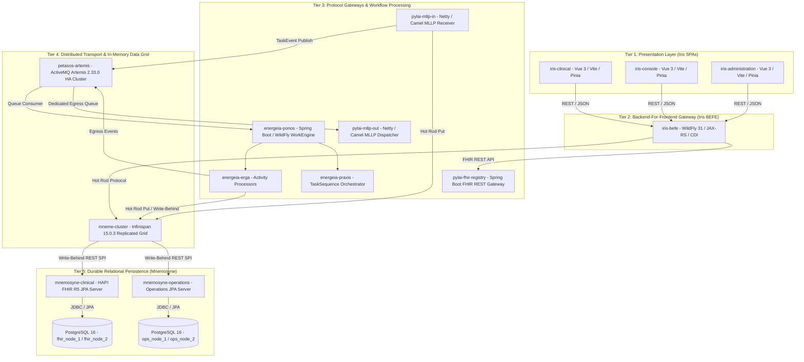

# Harmonia Architecture Overview

Harmonia is an enterprise-grade Health Integration Environment (HIE) engineered for the reliable ingestion, transformation, governance, caching, and persistence of healthcare data using HL7 FHIR Release 5 (R5) and HL7 v2.x standards.

---

## 1. 5-Tier Architectural Model

Harmonia decomposes integration capabilities into 5 discrete functional tiers:



---

## 2. Core Architectural Principles

### 2.1 Separation of Transience from Authoritative Durability
- **Transient In-Flight Durability**: Managed by **Apache ActiveMQ Artemis 2.33.0** via replicated file journals (`petasos-artemis`). Artemis stores messages only until acknowledged by downstream consumers.
- **In-Memory Operational Caching**: Managed by **Infinispan 15.0.3** (`mneme-cluster`) via Hot Rod binary protocol for high-throughput reads, task sequence synchronization, and operational status.
- **Authoritative Long-Term Persistence**: Managed by **PostgreSQL 16** via Spring Boot HAPI FHIR R5 JPA servers (`mnemosyne-clinical`) and Operations JPA servers (`mnemosyne-operations`).

### 2.2 Unidirectional Layering & Boundary Governance
Platform dependencies flow strictly from higher layers down to foundation layers:
$$\text{Iris (Presentation)} \rightarrow \text{Pylai (Gateways)} \rightarrow \text{Energeia (Execution)} \rightarrow \text{Petasos (Transport)} \rightarrow \text{Hestia (Data)} \rightarrow \text{Themis (Security)} \rightarrow \text{Calliope (Canonical)}$$

1. **Calliope**: Pure domain models and schemas. Zero dependencies on higher layers.
2. **Themis API**: Pure security contracts. Decoupled from engine implementation and persistence.
3. **Petasos API**: Pure transport abstractions. Strictly zero dependencies on JMS or ActiveMQ Artemis libraries.
4. **Iris SPAs & BEFE**: Presentation only. Strictly forbidden from importing JPA, Hibernate, or PostgreSQL database drivers.
5. **Paradeigma Isolation**: Synthetic simulation subproject. Permitted to call production APIs (MLLP/REST), but **production code must never depend on or import Paradeigma**.

---

## 3. End-to-End Clinical Data Flow

```
[ External Clinical System (EMR / PAS) ]
               │  1. HL7 v2 Message (e.g. ADT^A01 over MLLP)
               ▼
   [ Pylai Inbound Gateway (pylai-mllp-in) ]
               │
               ├─► Themis Security Gate (Authorize & Tag Security Context)
               ├─► Parse HL7 into FHIR Communication & Task (Pragma)
               ├─► Store in Mneme Infinispan Cache
               ├─► Publish TaskEvent to Petasos Queue (petasos.queue.task.inbound)
               │   (Guaranteed delivery before MLLP AA response - REC-001)
               │
               ▼  2. Return MLLP AA ACK (or AE NACK on failure)
[ Upstream EMR / PAS ]

               │  3. Asynchronous Petasos Consumption
               ▼
    [ Ponos WorkEngine (energeia-ponos) ]
               │
               ├─► Themis Dispatch Authorization Gate
               ├─► Resolve TaskSequence via Praxis (e.g. AdtDistributionTaskSequence)
               ├─► Execute Erga Activities (Adt2FhirMapper, Mfn2FhirBundle, AdtDistributionErgon)
               ├─► Update Mneme Cache (Write-Behind to Mnemosyne PostgreSQL)
               ├─► Track Granular Fan-Out Sub-Status in Pragma / Task.output (REC-002)
               │
               ▼  4. Publish Outbound Egress Events
    [ Petasos Outbound Queues (petasos.queue.mllp.outbound.<endpoint-id>) ]
               │
               ▼  5. Egress Consumption
   [ Pylai Outbound Gateway (pylai-mllp-out) ]
               │
               ├─► Format HL7 v2 Egress Message
               ├─► Dispatch over MLLP to Remote Systems (HIS / LIS / RIS)
               ├─► Await and Validate Synchronous Remote MLLP ACK
               └─► Update Mneme/Mnemosyne Delivery Status & Provenance
```

---

## 4. Subsystem Taxonomy & Domain Mapping

| Subsystem | Classical Name Meaning | Domain & Role in Harmonia | Primary Artifacts |
| :--- | :--- | :--- | :--- |
| **Calliope** | *Muse of Eloquence* | Canonical information models, schemas, DTOs, and topic definitions. | `calliope` |
| **Themis** | *Titaness of Divine Law* | Default-deny policy evaluation, RBAC/ABAC authorization, and non-PHI audit. | `themis-api`, `themis-core`, `themis-audit` |
| **Hestia** | *Goddess of the Hearth* | Persistent relational databases and in-memory caching infrastructure. | `mneme-cluster`, `mnemosyne-clinical`, `mnemosyne-operations` |
| **Petasos** | *Winged Hat of Hermes* | Resilient transport abstraction, message deduplication, and Artemis HA clustering. | `petasos-api`, `petasos-core`, `petasos-artemis` |
| **Energeia** | *Actuality & Labor* | Asynchronous task processing (Ponos), activity units (Erga), and workflows (Praxis). | `ponos`, `erga`, `praxis`, `ponos-cli` |
| **Pylai** | *Gateways / Portals* | Inbound/Outbound MLLP protocol gateways and FHIR REST Registry gateway. | `pylai-mllp-in`, `pylai-mllp-out`, `pylai-fhir-registry`, `pylai-mllp-base` |
| **Iris** | *Goddess of the Rainbow* | Presentation services: WildFly BEFE gateway, Clinical UI, Console UI, and Admin UI. | `iris-befe`, `iris-clinical`, `iris-console`, `iris-administration` |
| **Paradeigma** | *Pattern / Exemplar* | Synthetic clinical simulation, HL7/FHIR generators, and end-to-end scenarios. | `paradeigma-emr`, `paradeigma-lms`, `paradeigma-pas`, `paradeigma-scenarios` |
