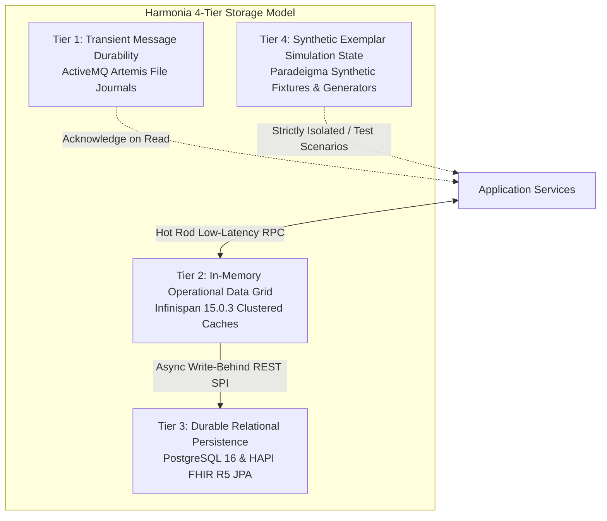

# Harmonia Persistence Architecture & Storage Lifecycle

This document defines the 4-tier storage hierarchy, data ownership boundaries, relational schemas, write-behind synchronization, and transactional lifecycles across the Harmonia platform.

---

## 1. 4-Tier Storage Hierarchy



| Tier | Technology | Persistence Mechanism | Scope & Purpose | Lifespan & Retention |
| :--- | :--- | :--- | :--- | :--- |
| **Tier 1: Messaging Journal** | Apache ActiveMQ Artemis 2.33.0 | Persistent file journal (`./data/journal`) on dedicated PVC | Transient in-flight transport durability for Petasos queues | Deleted upon consumer ACK or DLQ move |
| **Tier 2: In-Memory Data Grid** | Infinispan 15.0.3 (`mneme-cluster`) | Memory / JGroups replicated cache with NonBlockingStore SPI | High-speed cache for active FHIR resources, task states & sequences | In-memory with write-behind persistence |
| **Tier 3: Relational Persistence** | PostgreSQL 16 & Spring Boot JPA | Relational tables (`hie_fhir_resources`, `hie_operations_resources`) on dedicated PVC | Authoritative clinical records, workflow task histories, and audit logs | Permanent clinical repository (Full retention) |
| **Tier 4: Synthetic Simulation** | Paradeigma In-Memory / Fixtures | Deterministic scenario generator models | Simulated personas, synthetic clinical encounters, test data | Ephemeral / Test execution only |

---

## 2. Storage Entities & Ownership Matrix

| Entity / Resource | Authoritative Owner | Cache Key (`Mneme`) | Persistent Storage (`Mnemosyne`) | Database Instance |
| :--- | :--- | :--- | :--- | :--- |
| **Clinical FHIR R5 Resources** (`Patient`, `Practitioner`, `Organization`, `Location`, etc.) | `mnemosyne-clinical` | `<resourceType>/<id>` | `hie_fhir_resources` | PostgreSQL Clinical (`fhir_node_1`, `fhir_node_2`) |
| **Clinical Communication** (`Communication`) | `pylai-mllp-in` / `mnemosyne-clinical` | `Communication/<id>` | `hie_fhir_resources` | PostgreSQL Clinical (`fhir_node_1`, `fhir_node_2`) |
| **Task / Pragma** (`Task`) | `energeia-ponos` / `mnemosyne-clinical` | `Task/<id>` | `hie_fhir_resources` | PostgreSQL Clinical (`fhir_node_1`, `fhir_node_2`) |
| **Provenance** (`Provenance`) | `themis-audit` / `mnemosyne-clinical` | `Provenance/<id>` | `hie_fhir_resources` | PostgreSQL Clinical (`fhir_node_1`, `fhir_node_2`) |
| **TaskSequence Definitions** | `energeia-praxis` / `mnemosyne-operations` | `TaskSequence/<name>` | `hie_operations_resources` | PostgreSQL Operations (`ops_node_1`, `ops_node_2`) |
| **Non-PHI Security Audit Logs** | `themis-audit` / `mnemosyne-operations` | N/A (Streamed) | `hie_operations_resources` / Audit Stream | PostgreSQL Operations (`ops_node_1`, `ops_node_2`) |

---

## 3. Asynchronous Write-Behind Synchronization Lifecycle

```
Client (Iris BEFE / Gateways / Ponos)
       │
       ├─► 1. PUT / UPDATE Resource
       ▼
[ Mneme Infinispan Cache Grid ]
       │  (Immediate in-memory update & JGroups peer replication)
       ▼
[ Mneme NonBlockingStore SPI (mneme-persistence) ]
       │  (Queued in asynchronous write-behind buffer)
       ▼
[ Mnemosyne JPA REST Server (mnemosyne-clinical / operations) ]
       │  (Validates HAPI FHIR structure & executes JPA entity mapping)
       ▼
[ PostgreSQL 16 Relational Database ]
          (ACID transaction commit & WAL flush to persistent disk)
```

- **Write-Behind Properties**:
  - Buffer queue size: 10,000 entries.
  - Flush interval: 500 ms (or upon reaching buffer threshold).
  - Retry on failure: 3 attempts with exponential backoff before generating diagnostic alerts.

---

## 4. Relational Database Schema Architecture

### 4.1 Clinical Database Schema (`hie_fhir_resources`)

```sql
CREATE TABLE hie_fhir_resources (
    res_id VARCHAR(64) NOT NULL,
    res_type VARCHAR(64) NOT NULL,
    res_version BIGINT NOT NULL,
    res_text_r5 TEXT NOT NULL,
    res_updated TIMESTAMP WITH TIME ZONE NOT NULL,
    res_deleted BOOLEAN NOT NULL DEFAULT FALSE,
    security_labels VARCHAR(255),
    PRIMARY KEY (res_type, res_id, res_version)
);

CREATE INDEX idx_fhir_res_lookup ON hie_fhir_resources (res_type, res_id);
CREATE INDEX idx_fhir_res_updated ON hie_fhir_resources (res_updated);
```

### 4.2 Operations Database Schema (`hie_operations_resources`)

```sql
CREATE TABLE hie_operations_resources (
    resource_id VARCHAR(128) NOT NULL,
    resource_type VARCHAR(64) NOT NULL,
    resource_version BIGINT NOT NULL,
    payload_json TEXT NOT NULL,
    created_at TIMESTAMP WITH TIME ZONE NOT NULL,
    updated_at TIMESTAMP WITH TIME ZONE NOT NULL,
    PRIMARY KEY (resource_type, resource_id, resource_version)
);

CREATE INDEX idx_ops_res_lookup ON hie_operations_resources (resource_type, resource_id);
```
