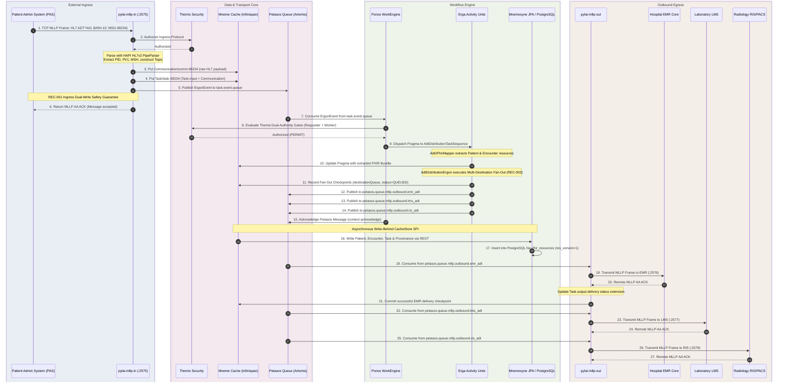

# Harmonia End-to-End Runtime Architecture & Clinical Message Lifecycle `[IMPLEMENTED]`

This document articulates the end-to-end runtime lifecycle of clinical messages traversing Harmonia, tracing events from external MLLP network arrival through security gating, queue buffering, task execution, in-memory caching, relational JPA persistence, and multi-destination outbound egress.

---

## 1. End-to-End Clinical Data Flow Diagram `[IMPLEMENTED]`



---

## 2. Granular Execution Phase Breakdown `[IMPLEMENTED]`

### Phase 1: Perimeter Ingress & Dual-Write Safety (REC-001)
1. **TCP Connection**: External PAS connects to `pylai-mllp-in` on TCP port `2575`.
2. **Netty Ingestion**: Camel's `camel-mllp` component terminates the frame and invokes `IncomingAdtMessageProcessor`.
3. **HL7 Parsing**: HAPI HL7 v2 `PipeParser` extracts `MSH-10` (MessageControlId), `MSH-9` (MessageType/TriggerEvent), `PID-3` (Patient MRN), and `PV1-3` (Location).
4. **Canonical Enveloping**:
   - Raw HL7 string wrapped in FHIR R5 `Communication` resource.
   - Routing `Task` created with `Task.input` referencing the `Communication`.
5. **Mneme Write**: `Communication` and `Task` written to Infinispan `task-cache`.
6. **Petasos Dispatch**: `TaskEventProducerService` publishes an `ErgonEvent` to `task.event.queue` in ActiveMQ Artemis.
7. **Synchronous ACK**: Only after both the cache write and queue publish succeed is the HL7 `AA` ACK generated and sent to the PAS. If either write fails, an `AE` NACK is emitted, prompting upstream retry.

---

### Phase 2: Broker Transport & Replication
1. **Replicated Journaling**: The Artemis primary broker (`artemis-primary-a`) writes the event to `./data/journal` and replicates the log over port `61616` to `artemis-backup-a`.
2. **Cluster Balancing**: The broker evaluates consumer queues across HA pairs, redistributing messages using `ON_DEMAND` load balancing.

---

### Phase 3: WorkEngine Ingestion & Themis Authorization
1. **Queue Consumption**: `PetasosQueueToExchangeConduit` in `energeia-ponos` consumes the message from Artemis.
2. **Envelope Translation**: Converts message into a canonical `Pragma` task envelope.
3. **Themis Security Gates**:
   - **Gate 1**: Validates that the originating system (`originatingPrincipal`) has authority to request updates in the clinical domain (`ThemisAction.SUBMIT_UPDATE`).
   - **Gate 2**: Validates that the worker daemon (`process:ponos-engine`) possesses the execution privileges required by the downstream Erga activities (`ThemisAction.PROCESS`).
4. **Pipeline Dispatch**: Dispatches the `Pragma` into the Camel pipeline via `ProducerTemplate.request("direct:sequence-dispatcher", ...)`.

---

### Phase 4: Erga Activities & Destination Fan-Out (REC-002)
1. **Domain Transformation**: `Adt2FhirMapper` converts PID/PV1 segments into FHIR R5 `Patient` and `Encounter` resources.
2. **Multi-Destination Fan-Out**: `AdtDistributionErgon` evaluates target endpoints (EMR, LMS, RIS).
3. **Granular Checkpointing**:
   - Records discrete checkpoints in `Pragma` for each destination:
     ```json
     {
       "stageName": "FANOUT_DISPATCH_INITIATED",
       "status": "IN_PROGRESS",
       "metadata": {
         "destinationQueue": "petasos.queue.mllp.outbound.emr_adt",
         "status": "QUEUED"
       }
     }
     ```
4. **Queue Emission**: Emits independent dispatch messages to:
   - `petasos.queue.mllp.outbound.emr_adt`
   - `petasos.queue.mllp.outbound.lms_adt`
   - `petasos.queue.mllp.outbound.ris_adt`
5. **Message Acknowledgment**: `PetasosQueueToExchangeConduit` acknowledges the inbound event in Artemis (`context.acknowledge()`).

---

### Phase 5: Relational Persistence & Lineage
1. **Write-Behind Flushing**: Mneme's `FhirRestCacheStore` write-behind buffer flushes the `Patient`, `Encounter`, `Task`, and `Provenance` resources to `mnemosyne-clinical` (`POST /fhir/r5`).
2. **Integrity Validation**: `ProviderRegistryReferenceValidator` validates cross-resource references.
3. **Relational Commit**: `FhirStorageService` inserts rows into PostgreSQL `hie_fhir_resources` with composite primary key `(res_type, res_id, res_version)`.

---

### Phase 6: Egress Transmission & External ACK Validation
1. **Outbound Ingestion**: `OutboundTaskQueueConsumer` in `pylai-mllp-out` reads from `petasos.queue.mllp.outbound.emr_adt`.
2. **MLLP Dispatch**: `OutboundMllpRouteBuilder` connects to the EMR TCP listener (`mllp://${header.HIE_DEST_HOST}:${header.HIE_DEST_PORT}`).
3. **Remote ACK Parsing**: Awaits remote response; `Hl7AckProcessor` validates MSA-1 (`AA`).
4. **Status Update**: `OutboundStateLifecycleManager` commits the successful transmission timestamp and response code to the `Task.output` extension in Mnemosyne.
