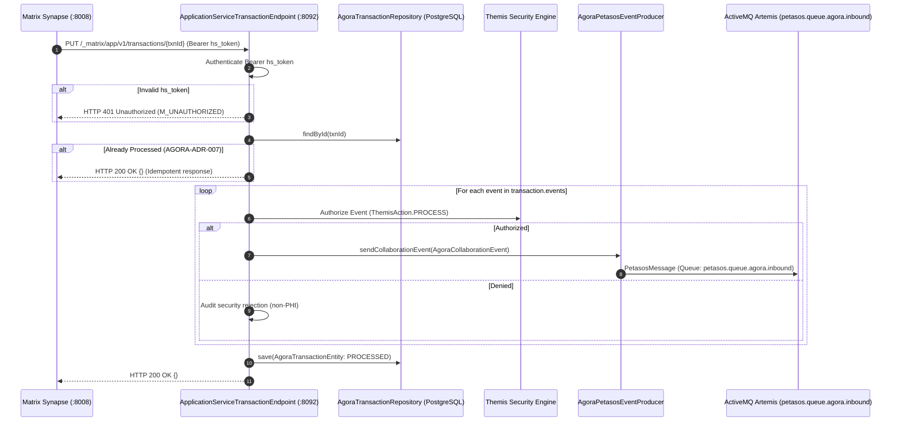

# Concept: Agora `[IMPLEMENTED]`

Agora is Harmonia's first-class collaboration integration framework, establishing an authoritative, governed architectural boundary between the Harmonia Health Integration Environment (HIE) and the Matrix Synapse collaboration ecosystem.

---

## 1. Classical Metaphor & Etymology `[IMPLEMENTED]`

- **Greek Term**: *Ἀγορά* (Agora)
- **Etymology**: Ancient Greek feminine noun derived from the verb *ἀγείρω* (*ageirō* — "to gather", "to assemble", "to bring together").
- **Historical & Cultural Context**: In the ancient Greek polis (most famously the Agora of Athens), the agora was the civic center, central open assembly, and heart of community life. It was where citizens gathered to debate political policies, conduct commercial trade, meet colleagues, hear philosophical discourses, and receive public decrees. It was flanked by civic temples, law courts, and administrative magistrates.
- **Architectural Rationale**: Healthcare is an inherently collaborative, multidisciplinary practice: physicians, nursing staff, clinical pharmacists, laboratory scientists, and imaging specialists must converse, coordinate care handoffs, review metrics, and resolve tasks in real time. Agora serves as Harmonia's digital gathering place, projecting structured clinical events and care team relationships into secure Matrix spaces and chat rooms while maintaining strict administrative governance and zero PHI leakage.

---

## 2. Core Architectural Principle `[IMPLEMENTED]`

> **Agora makes Matrix a Harmonia collaboration capability; it does NOT make Matrix the Harmonia architecture.**

- **Authoritative Boundary**: Harmonia remains the single source of truth for healthcare information, FHIR resources, Provider Registry state, identity relationships, security policies, and clinical workflows.
- **Collaboration Boundary**: Matrix Synapse provides authorized collaboration, communication, and notification surfaces only.
- **Subordinate Metadata**: Matrix room topics, aliases, and membership states are subordinate projections of Harmonia's authoritative state in Mnemosyne.
- **Non-Authoritative Retention**: Matrix homeserver message stores are subject to ephemeral retention limits (default 90 days). Clinical decisions, notes, and task outputs must be committed back to Mnemosyne FHIR storage.

---

## 3. Module Decomposition & Layering `[IMPLEMENTED]`

Agora is partitioned across 4 decoupled Maven submodules under `agora/`:

```
agora/
├── agora-api/       # Pure Java domain models, events, and topic constants; zero Matrix or Spring dependencies
├── agora-matrix/    # Encapsulated Matrix Client-Server & Synapse Administration REST adapters and DTOs
├── agora-core/      # Collaboration lifecycle, identity resolution, reconciliation, JPA persistence, Petasos messaging
└── agora-service/   # Spring Boot 3.2.5 runtime, AS transaction endpoint, Actuator health indicators
```

### Dependency Flow & Packaging Boundaries
$$\text{agora-service} \longrightarrow \text{agora-core} \longrightarrow \text{agora-matrix}$$
$$\text{agora-core} \longrightarrow \text{agora-api} \longleftarrow \text{calliope}, \text{themis-api}, \text{petasos-api}$$

- **Zero Ponos Dependency**: Direct dependency on Ponos (`net.fhirfactory.harmonia.energeia.ponos..`) is strictly prohibited. Agora coordinates with workflows exclusively via Petasos queues (`petasos.queue.agora.*`).
- **Matrix DTO Encapsulation**: Matrix protocol JSON structures (Client-Server and Synapse Admin DTOs) are strictly quarantined within `agora-matrix` and never leak into `agora-core` public interfaces or downstream Harmonia components.
- **Paradeigma Isolation**: Agora production code must never declare dependencies on or import Paradeigma simulation modules.

---

## 4. Key Architecture Decision Records (ADRs) `[IMPLEMENTED]`

The architecture of Agora is governed by eight formal platform Architecture Decision Records:

| ADR Identifier | Decision Title | Architectural Choice & Rationale | Status |
| :--- | :--- | :--- | :--- |
| **AGORA-ADR-001** | Identity Provisioning | **Provisioned Local Users**. Agora provisions dedicated local Matrix accounts (`@_harmonia_p_<uuid>:synapse`) via the Synapse Admin REST API with secure credentials stored in Mnemosyne. Public user registration is disabled. | `[IMPLEMENTED]` |
| **AGORA-ADR-002** | Room Encryption Policy | **Transport TLS Non-E2EE**. Rooms operate without Olm/Megolm end-to-end room encryption, protected by TLS 1.3 within a closed Kubernetes network boundary. This enables automated clinical governance, indexing, auditing, and Petasos workflow dispatch without key-distribution failure modes. | `[IMPLEMENTED]` |
| **AGORA-ADR-003** | Authoritative ID Mapping | **Relational PostgreSQL Persistence**. Mappings between Harmonia entities and Matrix room/space IDs are durably persisted in Mnemosyne table `agora_resource_mappings`. | `[IMPLEMENTED]` |
| **AGORA-ADR-004** | Conversation Retention | **90-Day Ephemeral Retention**. Synapse retains room events with a default maximum lifetime of 90 days. Clinical decisions and task outputs must be committed back to Mnemosyne FHIR resources prior to purge. | `[CONFIGURED]` |
| **AGORA-ADR-005** | PHI Minimisation | **Zero-PHI Room Metadata**. Room aliases, Space names, and topics use opaque UUIDs and synthetic labels. Raw patient names, MRNs, dates of birth, and clinical conditions are strictly forbidden in Matrix metadata. | `[IMPLEMENTED]` |
| **AGORA-ADR-006** | Federation & Public Access | **Closed, Non-Federated Deployment**. Inter-server federation (`federation.enabled: false`), public registration, and room directories are disabled. | `[CONFIGURED]` |
| **AGORA-ADR-007** | AS Transaction Idempotency | **Durable Transaction Deduplication**. Homeserver transaction IDs (`txnId`) are recorded in table `agora_as_transactions` to guarantee zero duplicate business effects in Harmonia across homeserver retries. | `[IMPLEMENTED]` |
| **AGORA-ADR-008** | Room Archival Lifecycle | **Soft Retirement & Archival**. When an encounter concludes, Agora updates rooms to read-only (`m.room.power_levels`), kicks active participants, and marks mappings as `ARCHIVED` in Mnemosyne. | `[IMPLEMENTED]` |

---

## 5. Identity Resolution & Mapping `[IMPLEMENTED]`

Agora provisions deterministic, opaque Matrix identities via `AgoraIdentityService`:

1. **Localpart Derivation**:
   - For a given Harmonia principal identifier (e.g. Practitioner UUID or ID), a deterministic UUID is generated:
     $$\text{uuid} = \text{UUID.nameUUIDFromBytes}(\text{principalId.getBytes(UTF\_8)})$$
   - Localpart format: `_harmonia_p_<uuid>`
   - Full Matrix User ID: `@_harmonia_p_<uuid>:synapse` (or configured server name, e.g. `@_harmonia_p_<uuid>:harmonia.local`)
2. **Deterministic Provisioning via Synapse Admin API**:
   - Invokes `PUT /_synapse/admin/v2/users/{userId}` via `SynapseAdministrationGateway`.
   - Sets secure random password, display name, and admin flags (`admin: false`).
3. **Durable Mapping Storage**:
   - Persisted in PostgreSQL table `agora_resource_mappings`:
     - `harmonia_resource_type`: `PRACTITIONER` or `PATIENT`
     - `harmonia_resource_id`: canonical Harmonia UUID / identifier
     - `matrix_entity_type`: `USER`
     - `matrix_entity_id`: `@_harmonia_p_<uuid>:synapse`
     - `status`: `ACTIVE`

---

## 6. Collaboration Projections & Room Lifecycles `[IMPLEMENTED]`

Agora manages structured collaboration spaces projected from authoritative Harmonia contexts via `AgoraCollaborationLifecycleService`:

```mermaid
graph TD
    subgraph PatientSpace ["Patient Collaboration Space (Private Matrix Space)"]
        PS[Parent Space: Patient Space [uuid]<br/>Topic: Encounter Collaboration Space]
        
        R1[Child Room 1: Statistics<br/>Vitals, Trajectory & Metrics]
        R2[Child Room 2: Tasks<br/>Clinical Task Notifications & Action Items]
        R3[Child Room 3: Discussion<br/>Multidisciplinary Team Chat]
        R4[Child Room 4: Diagnostics<br/>Pathology & Imaging Result Summaries]
        
        PS -->|m.space.child| R1
        PS -->|m.space.child| R2
        PS -->|m.space.child| R3
        PS -->|m.space.child| R4
    end
```

### 6.1 Patient Space Hierarchy
When a patient encounter is initiated or requested via `AgoraSpaceRequest`:
1. **Parent Space Creation**:
   - Provisions a private room with creation content `{"type": "m.space"}`.
   - Title: `Patient Space [<patientId>]` (PHI-safe identifier).
   - Topic: `Encounter Collaboration Space for patient <patientId>`.
   - Persisted in `agora_resource_mappings` with `matrix_entity_type = SPACE`.
2. **Four Standard Child Rooms**:
   - **Statistics** (`AgoraRoomType.STATISTICS`): Monitors vital trends, clinical score trajectories, and encounter metrics.
   - **Tasks** (`AgoraRoomType.TASKS`): Real-time clinical task dispatches, workflow assignments, and status updates.
   - **Discussion** (`AgoraRoomType.DISCUSSION`): Secure multidisciplinary clinical dialogue between assigned team members.
   - **Diagnostics** (`AgoraRoomType.DIAGNOSTICS`): Lab results (LMS) and diagnostic radiology notifications (RIS-PAC).
3. **Space-Child Linking**:
   - Each child room is linked to the parent space via a state event:
     `PUT /_matrix/client/v3/rooms/{spaceRoomId}/state/m.space.child/{childRoomId}`
     Payload: `{"via": ["synapse"]}`.
4. **Child-Parent Reverse Linking**:
   - Each child room declares the parent space via:
     `PUT /_matrix/client/v3/rooms/{childRoomId}/state/m.space.parent/{spaceRoomId}`
     Payload: `{"canonical": true, "via": ["synapse"]}`.

### 6.2 Practitioner Spaces & Group Collaboration
- **Practitioner Space**: Personal collaboration space for an individual practitioner, housing child rooms partitioned by `PractitionerRole`.
- **Group Collaboration Rooms**: Ad-hoc or ward-based rooms for clinical teams, registered under `RESOURCE_TYPE_GROUP`.

### 6.3 Soft Archival Lifecycle (AGORA-ADR-008)
Upon patient discharge or encounter completion:
1. `archiveSpace(spaceRoomId, context)` or `archiveRoom(roomId, context)` is invoked.
2. Room permissions are downgraded to read-only via `MatrixPowerLevelsDto` (`events_default = 100`, preventing non-admin posting).
3. Active participants are kicked via `MatrixClientAdapter.kickUser(...)`.
4. The mapping record in `agora_resource_mappings` transitions from `ACTIVE` to `ARCHIVED`.

---

## 7. Security Governance & Authorization (Themis) `[IMPLEMENTED]`

Collaboration actions are strictly governed by **Themis** default-deny policy evaluation (`AgoraCollaborationPolicy`):

### Evaluation Precedence & Rules
- **Policy ID**: `agora-collaboration-policy` (Priority Order = 50).
- **Security Domain**: `AGORA` (matching resources `MatrixRoom`, `MatrixSpace`, `AgoraCollaboration`).
- **Authorities**:
  - `system.admin`, `agora.admin`, `*`: Full administrative rights (create, archive, kick, invite).
  - `system.integration`: Background queue processing and Petasos event bridging.
  - `agora.collaboration`: Space and child room lifecycle provisioning.
  - `agora.member`: Read, search, process, execute, and member interaction in assigned rooms.
- **Default-Deny Invariant**: Any request lacking explicit granted authorities evaluates to `ThemisDecision.DENY`.
- **Zero-PHI Audit**: All authorization decisions emit structured audit events to `petasos.queue.agora.audit` without unmasked patient details.

---

## 8. Care Team Reconciliation Engine `[IMPLEMENTED]`

Care team membership is authoritatively governed by Harmonia's Provider Registry in Mnemosyne.

`AgoraMembershipReconciliationService` resolves drift between the authoritative roster and active Matrix room members:
1. **Fetch Live Members**: Calls `MatrixClientAdapter.getRoomMembers(roomId)` to retrieve active Matrix user IDs.
2. **Exclude Bot Identity**: Automatically filters out the system bot user (`_harmonia_bot`).
3. **Identify Discrepancies**:
   - **Missing Members** (Authoritative Care Team $\setminus$ Live Members): Evaluates Themis authorization and executes `MatrixClientAdapter.inviteUser(roomId, userId)`.
   - **Unauthorized Members** (Live Members $\setminus$ Authoritative Care Team): Evaluates Themis authorization and executes `MatrixClientAdapter.kickUser(roomId, userId, "Membership reconciliation: no longer authorized")`.
4. **Audit Reporting**: Returns an `AgoraReconciliationResult` summarizing invited, kicked, retained, and denied members.

---

## 9. Application Service & Petasos Transport Ingestion `[IMPLEMENTED]`

Agora acts as a privileged Matrix Application Service (AS) communicating over HTTP and Petasos messaging:



- **Inbound Queue**: `petasos.queue.agora.inbound`
- **Outbound Queue**: `petasos.queue.agora.outbound`
- **Audit Queue**: `petasos.queue.agora.audit`
- **Events Topic**: `petasos.topic.agora.events`
