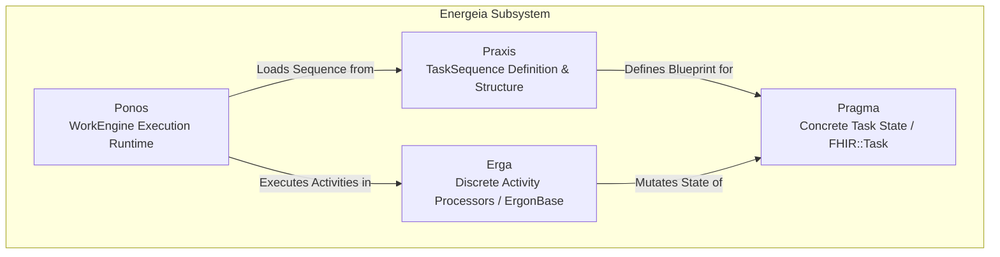

# Energeia Workflow and Task Processing Architecture

Energeia is Harmonia's workflow processing framework, coordinating discrete activity units (Erga) and task sequence definitions (Praxis) executed by the asynchronous task processing WorkEngine (Ponos).

---

## 1. Energeia Conceptual Taxonomy

| Concept | Greek Term & Meaning | Architectural Implementation | Key Classes / Interfaces |
| :--- | :--- | :--- | :--- |
| **`Energeia`** | *ἐνέργεια* — Actuality, continuous operational energy | Workflow subsystem grouping Ponos, Erga, and Praxis | Subproject root (`energeia/`) |
| **`Ponos`** | *Πόνος* — Industrious labor, continuous effort | Asynchronous workflow execution engine | `PonosTaskProcessor`, `PonosWorker`, `PonosApplication` |
| **`Erga` / `Ergon`** | *ἔργον* — Discrete deed, activity, or work unit | Activity processing library and Camel route transformers | `ErgonBase`, `AdtDistributionErgon`, `Adt2FhirMapper`, `Mfn2FhirBundle` |
| **`Praxis`** | *πρᾶξις* — Enacted theory, structured action sequence | Task sequence definitions, loaders, and cache seeders | `Praxis`, `PraxisImplementation`, `TaskSequenceLoader`, `TaskSequenceDefaultSeeder` |
| **`Pragma`** | *πρᾶγμα* — Concrete deed done, instance of action | Runtime task state mapped to FHIR R5 `Task` | `Pragma`, `PragmaCheckpoint`, FHIR R5 `Task` |

---

## 2. Ponos WorkEngine Execution Lifecycle

1. **Event Consumption**: `Ponos` consumes a `TaskEvent` from `petasos.queue.task.inbound`.
2. **Security Authorization**: Themis evaluates `PonosDispatchPolicy` validating the caller security context.
3. **Praxis Sequence Resolution**: `Ponos` retrieves the `TaskSequence` blueprint from Mneme cache / Praxis loader.
4. **Ergon Activity Pipeline**: Sequentially executes configured Ergon steps:
   - Inbound Transformation (e.g. `Adt2FhirMapper`).
   - Canonical FHIR validation & security tagging.
   - Clinical state update in Mneme cache.
   - Fan-out distribution evaluation (`AdtDistributionErgon`).
5. **Checkpoint & Sub-Status Tracking (REC-002)**: Updates `PragmaCheckpoint` records per egress destination (`QUEUED`, `IN_TRANSIT`, `DELIVERED`, `FAILED_RETRYING`).
6. **Egress Dispatch**: Publishes outbound events to destination-specific Petasos queues (`petasos.queue.mllp.outbound.<endpoint-id>`).
7. **Acknowledgement**: Acknowledges the inbound Petasos message once all activities succeed.

---

## 3. FHIR R5 Task State Mapping

The execution of a `Pragma` maps to standard FHIR R5 `Task` status enumerations:

| Harmonia Workflow State | FHIR R5 `Task.status` | Description |
| :--- | :--- | :--- |
| `INITIATED` | `draft` | Task created upon message ingress at Pylai gateway |
| `QUEUED` | `requested` | Task published to Petasos queue, awaiting worker pickup |
| `PROCESSING` | `in-progress` | Ponos worker actively executing Ergon activities |
| `COMPLETED` | `completed` | All activities and fan-out dispatches completed successfully |
| `FAILED_RETRYING` | `on-hold` | Transient failure encountered; scheduled for retry backoff |
| `FAILED_TERMINAL` | `failed` | Max retries exceeded; moved to DLQ and flagged for investigation |
