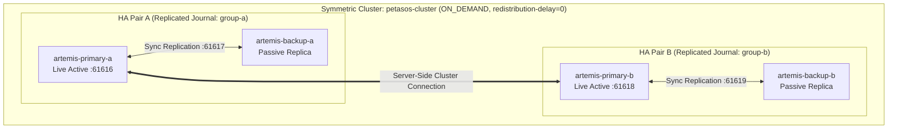

# Petasos Messaging and Transport Architecture

Petasos is Harmonia's resilient, high-availability asynchronous messaging and transport framework.

---

## 1. Subsystem Architecture & Responsibilities

Petasos provides an abstraction layer over enterprise messaging brokers, isolating healthcare business logic from JMS/Artemis transport mechanics:

```
[ Gateways (Pylai) / Workflows (Ponos) ]
                 │
                 ▼
  [ petasos-api (Pure Java Interfaces) ]
                 │
                 ▼
 [ petasos-core (Envelopes, Dedup, Metrics) ]
                 │
                 ▼
[ petasos-artemis (ActiveMQ Artemis Adapter) ]
                 │
                 ▼
[ Apache ActiveMQ Artemis 2.33.0 HA Cluster ]
```

### Module Breakdown
1. **`petasos-api`**: Pure Java interfaces (`Petasos`, `PetasosProducer`, `PetasosConsumer`, `PetasosMessage`, `PetasosDestination`). Zero JMS or vendor dependencies.
2. **`petasos-core`**: Envelope serialization/deserialization, in-memory duplicate detection sliding cache, and metrics gathering (`PetasosMetrics`).
3. **`petasos-artemis`**: Artemis Core JMS adapter implementing session pooling, automatic failover connection strings, and message converter bridges.

---

## 2. Standard Message Envelope (`PetasosMessage`)

All events across Petasos are encapsulated in an immutable, strongly typed envelope:

```java
public class PetasosMessage {
    private String messageId;              // UUID
    private String correlationId;          // End-to-end integration transaction thread
    private String causationId;            // Parent message / event ID
    private String messageType;            // Logical event name (e.g., TaskEvent, AdtA01)
    private String source;                 // Originating component / gateway
    private PetasosDestination destination;// Target queue / topic
    private Instant timestamp;             // Creation timestamp
    private String contentType;            // MIME type (application/json, application/fhir+json)
    private String schemaIdentifier;       // Canonical schema URI
    private String schemaVersion;          // e.g., "5.0.0"
    private byte[] payload;                // Opaque binary or text payload (zero inspection)
    private Map<String, Object> metadata;  // Tracing headers, tenant IDs, security context
    private boolean durable;               // Requires persistent journal flush
    private String duplicateDetectionId;   // Artemis _AMQ_DUPL_ID token
}
```

---

## 3. ActiveMQ Artemis HA Clustering & Topology

Petasos operates a 4-node ActiveMQ Artemis topology combining symmetric server-side clustering with active/passive replicated journals:



- **Failover Connection URL**:
  ```
  (tcp://artemis-primary-a:61616,tcp://artemis-backup-a:61616,tcp://artemis-primary-b:61618,tcp://artemis-backup-b:61618)?ha=true&reconnectAttempts=-1
  ```
- **Load Balancing**: `ON_DEMAND` distribution forwards messages to nodes with active consumers.
- **Instant Redistribution**: `redistribution-delay = 0` guarantees that if consumers disconnect on one node, queued messages are immediately routed to available cluster peers.

---

## 4. Message Queues & Routing Addresses

| Queue Name | Address | Consumer(s) | Message Type |
| :--- | :--- | :--- | :--- |
| `petasos.queue.task.inbound` | `petasos.address.task.inbound` | `energeia-ponos` | Inbound task events generated by `pylai-mllp-in` / `pylai-fhir-registry` |
| `petasos.queue.mllp.outbound.his`| `petasos.address.mllp.outbound` | `pylai-mllp-out` (HIS instance) | Egress HL7 ADT/ORM messages for hospital information systems |
| `petasos.queue.mllp.outbound.lis`| `petasos.address.mllp.outbound` | `pylai-mllp-out` (LIS instance) | Egress HL7 MFN/ORU messages for laboratory information systems |
| `petasos.queue.dlq` | `petasos.address.dlq` | Operations / Iris Console | Dead Letter Queue for poison messages |
