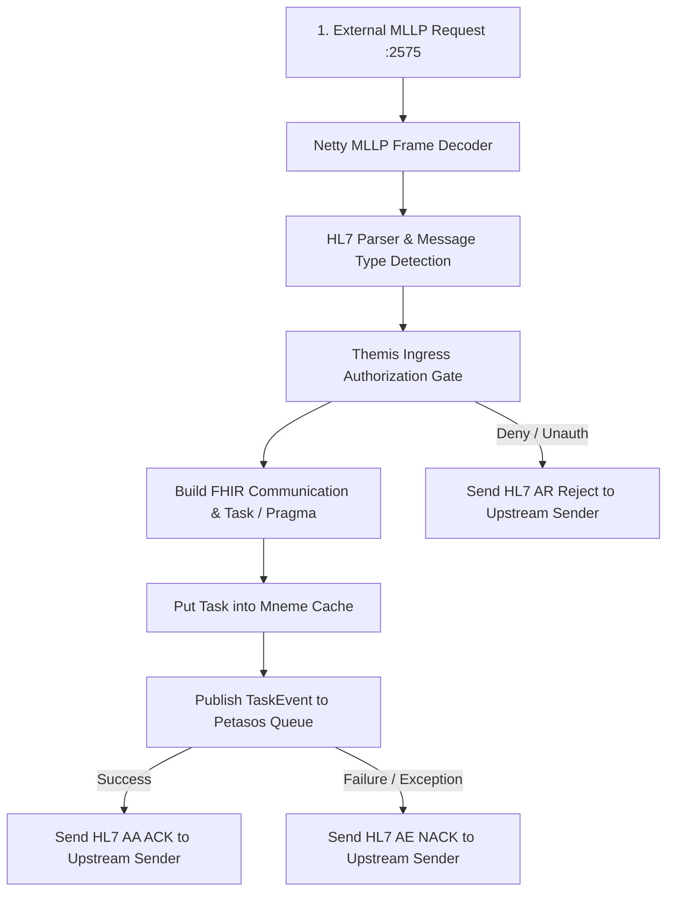

# Pylai Protocol Gateways Architecture

Pylai represents the external boundary and protocol adaptation tier for the Harmonia platform.

---

## 1. Subsystem Overview

Pylai translates external clinical messaging protocols (HL7 v2.x MLLP and FHIR R5 REST) into canonical Harmonia events and tasks:

```
[ External Systems ]
  ├── Inbound HL7 v2 (EMR/PAS)   ──► pylai-mllp-in   (:2575) ──► Petasos Queue
  ├── Outbound HL7 v2 (HIS/LIS)  ◄── pylai-mllp-out  (:8087) ◄── Petasos Queue
  └── External FHIR REST Clients ──► pylai-fhir-reg  (:8080) ──► Mnemosyne Clinical
```

### Module Breakdown
- **`pylai-mllp-base`**: Core MLLP framing utilities, destination registries (`MllpDestinationRegistry`), Petasos event producers, and FHIR resource construction helpers.
- **`pylai-mllp-in`**: Spring Boot / Netty / Apache Camel MLLP server on port `2575` ingesting HL7 v2.4/v2.5 ADT, MFN, ORM, and ORU messages.
- **`pylai-mllp-out`**: Spring Boot / Netty / Apache Camel outbound dispatcher with synchronous HL7 ACK validation and independent destination egress queues (`petasos.queue.mllp.outbound.<endpoint-id>`).
- **`pylai-fhir-registry`**: Direct FHIR REST API gateway exposing canonical endpoints for clinical and provider registry resources.
- **`pylai-mllp-cli`**: CLI diagnostic utility for generating and transmitting synthetic HL7 v2 MLLP trigger events.

---

## 2. Inbound Gateway Pipeline & Ingress Dual-Write Handling (REC-001)



- **Guaranteed Durability Before ACK**: As remediated in REC-001, `IncomingAdtMessageProcessor` propagates Petasos publish exceptions to ensure an `AE` NACK is sent if the queue write fails, preventing silent message loss.

---

## 3. Outbound Gateway Pipeline & Granular Fan-Out Delivery (REC-002)

- **Dedicated Per-Destination Queues**: Prevents head-of-line blocking if one downstream system is offline.
- **Synchronous Remote ACK Validation**: Awaits remote MLLP ACK (`AA`, `AE`, `AR`) before completing egress task.
- **Destination Delivery Status Tracking**: Populates `Task.output` with structured `http://example.org/hie/destination-delivery-status` extensions capturing `destinationId`, `status`, `ackCode`, `timestamp`, and `errorMessage`.
