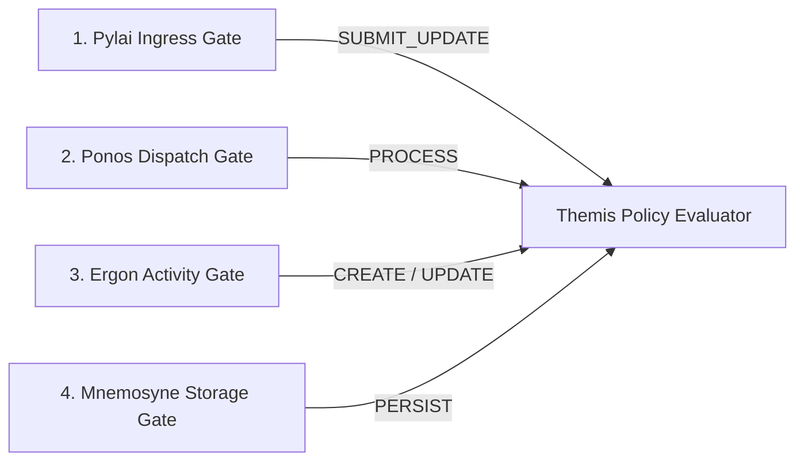

# Themis Policy Governance & Security Architecture

Themis is Harmonia's centralized security policy, authorization, and audit subsystem.

---

## 1. Defence-in-Depth & Default-Deny Invariant

Themis enforces a strict **default-deny invariant** across all processing boundaries. Any operation lacking an explicit permit is rejected:



1. **Gate 1: Ingress Gateway**: Evaluates client identity, TLS context, and interaction permissions.
2. **Gate 2: Asynchronous Dispatch**: Validates `PragmaSecurityContext` before worker execution.
3. **Gate 3: Activity Execution**: Evaluates domain-specific permissions for individual Ergon actions.
4. **Gate 4: Relational Persistence**: Independent authorization gate at storage tier preventing repository bypass.

---

## 2. Role and Authority Decoupling

Themis cleanly decouples human/service mnemonic roles from granular machine authorities:

| Mnemonic Role (`HarmoniaRoleEnum`) | Role Name | Associated Granular Authorities (`HarmoniaAuthorityEnum`) |
| :--- | :--- | :--- |
| `PRV_RDR` | Provider Reader | `PRV_READ`, `PRV_SEARCH` |
| `PRV_SUB` | Provider Submitter | `PRV_READ`, `PRV_SUBMIT` |
| `PRV_PROC` | Provider Processor | `PRV_READ`, `PRV_PROCESS`, `PRV_TRANSFORM` |
| `PRV_APR` | Provider Approver | `PRV_READ`, `PRV_APPROVE`, `PRV_REJECT` |
| `PRV_ADM` | Provider Admin | `PRV_READ`, `PRV_WRITE`, `PRV_ADMIN`, `PRV_DELETE` |
| `AUD_RDR` | Audit Reader | `AUDIT_READ`, `AUDIT_SEARCH` |
| `SYS_INT` | System Integrator | `SYS_INGRESS`, `SYS_EGRESS`, `SYS_DISPATCH` |
| `SYS_ADM` | Platform Admin | Full platform privileges (`*`) |

---

## 3. Pragma Security Context Propagation

Caller credentials and security attributes are captured immutably at ingress in a `PragmaSecurityContext`:

```java
public class PragmaSecurityContext {
    private String principalId;
    private PrincipalType principalType;
    private Set<HarmoniaRoleEnum> roles;
    private Set<HarmoniaAuthorityEnum> authorities;
    private Set<HarmoniaSecurityLabelEnum> securityLabels;
    private Instant authenticatedAt;
}
```

This context is serialized into FHIR R5 `Task.extension` structures, allowing asynchronous workers to reconstruct and verify caller authorization without shared session state.

---

## 4. Zero-PHI Decision Auditing (`ThemisAuditService`)

- Every authorization evaluation produces a structured `ThemisAuditEvent`.
- **Zero-PHI Guarantee**: Audit logs record timestamps, principal IDs, requested actions, resource types, decision outcomes (`PERMIT`/`DENY`), and reason codes (`ThemisDecisionReason`).
- Message payloads, patient medical history, clinical observations, and passwords/tokens are strictly excluded.
