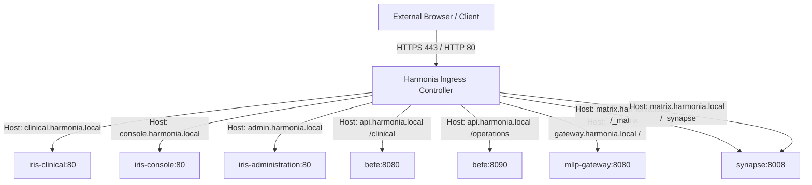

# Harmonia Port & Protocol Reference `[CONFIGURED]`

This document specifies the authoritative network architecture, transport protocols, listener port bindings, traffic directions, and TLS termination boundaries across the Harmonia Health Integration Environment.

---

## 1. Network Boundary Architecture `[IMPLEMENTED]`

Harmonia partitions network communications into three distinct security zones:
1. **Perimeter Ingress Zone**: External clinical actors (EMR, PAS, LIS, RIS) connect via HL7 MLLP (Port `2575`) or HTTP/HTTPS via the Nginx Ingress Controller (Ports `80`, `443`).
2. **Internal Microservices Mesh Zone**: Inter-pod communication within the `harmonia` Kubernetes namespace using cluster-internal DNS names (e.g., `infinispan-1`, `postgres-1`, `artemis-primary-a`).
3. **Internal Administrative & Telemetry Zone**: Container health probes, Actuator endpoints, WildFly management CLI (`9990`), and Artemis console (`8161`).

---

## 2. The 18 Platform Network Listeners Register `[CONFIGURED]`

The table below enumerates all 18 network listeners across the Harmonia runtime:

| Listener # | Port Number | Transport Protocol | Workload Binding | Service Binding | Direction & Traffic Flow | Purpose & Traffic Description | TLS & Security Boundary | Status |
| :---: | :--- | :--- | :--- | :--- | :--- | :--- | :--- | :--- |
| **1** | **`2575`** | TCP / MLLP | `pylai-mllp-in` | `mllp-gateway` | Ingress: External PAS/EMR $\rightarrow$ Harmonia | HL7 v2.4/v2.5 trigger event stream (ADT, ORM, ORU). | Plaintext MLLP or mutual TLS tunnel via VPN | `[IMPLEMENTED]` |
| **2** | **`80`** | TCP / HTTP | `iris-clinical`, `iris-console`, `iris-administration` | `iris-clinical`, `iris-console`, `iris-administration` | Ingress: Ingress Controller $\rightarrow$ Nginx SPAs | Static asset delivery for Iris Vue 3 web SPAs. | Plaintext HTTP (TLS terminated at Ingress) | `[IMPLEMENTED]` |
| **3** | **`443`** | TCP / HTTPS | Ingress Controller | `harmonia-ingress` | Ingress: Browser / External $\rightarrow$ Cluster | External TLS entrypoint for all web SPAs and REST APIs. | TLS 1.2/1.3 Termination | `[CONFIGURED]` |
| **4** | **`8080`** | TCP / HTTP | `iris-befe` (WildFly) | `befe` | Ingress: Ingress $\rightarrow$ BEFE, Inter-service | Clinical FHIR R5 REST API (`/clinical/*`) & internal JPA REST. | Internal plaintext HTTP | `[IMPLEMENTED]` |
| **5** | **`8090`** | TCP / HTTP | `iris-befe` (WildFly) | `befe` | Ingress: Ingress $\rightarrow$ BEFE | Operations, telemetry, queue metrics, and cache inspection (`/operations/*`). | Internal plaintext HTTP | `[IMPLEMENTED]` |
| **6** | **`9990`** | TCP / HTTP | `iris-befe`, `ponos`, `pylai` | Pod internal | Management: Admin $\rightarrow$ WildFly Management | Jakarta EE 10 management console and WildFly deployment scanner. | Digest Authentication / Admin Role | `[CONFIGURED]` |
| **7** | **`61616`** | TCP / Netty | `artemis-primary-a/b`, `artemis-backup-a/b` | `petasos-artemis-discovery`, `artemis-*` | Intra-cluster: Workloads $\rightarrow$ Artemis | Petasos message transport (`CORE,AMQP,OPENWIRE`) and HA journal replication. | Internal cluster network with Artemis auth | `[IMPLEMENTED]` |
| **8** | **`8161`** | TCP / HTTP | `artemis-*` | `artemis-*` | Intra-cluster: Admin $\rightarrow$ Artemis | ActiveMQ Artemis Web Management Console and Jolokia metrics. | HTTP Basic Authentication (`admin`) | `[CONFIGURED]` |
| **9** | **`11222`** | TCP / Hot Rod | `infinispan-1`, `infinispan-2` | `infinispan-service`, `infinispan-*` | Intra-cluster: BEFE / Ponos $\rightarrow$ Cache Grid | Hot Rod binary RPC protocol and REST API for 17 replicated Mneme caches. | Hot Rod Binary Protocol with auth | `[IMPLEMENTED]` |
| **10** | **`7800`** | TCP / JGroups | `infinispan-1`, `infinispan-2` | `infinispan-service` | Intra-cluster: Node 1 $\leftrightarrow$ Node 2 | JGroups TCP peer-to-peer discovery and synchronous cache replication. | Internal cluster network | `[CONFIGURED]` |
| **11** | **`5432`** | TCP / Native PG | `postgres-1` | `postgres-1` | Intra-cluster: Clinical Node 1 $\rightarrow$ DB | Primary relational storage for clinical FHIR resources (`fhir_node_1`). | PostgreSQL SCRAM-SHA-256 Auth | `[CONFIGURED]` |
| **12** | **`5433` (mapped)** | TCP / Native PG | `postgres-2` | `postgres-2` (5432 internal) | Intra-cluster: Clinical Node 2 $\rightarrow$ DB | Secondary relational storage for clinical FHIR resources (`fhir_node_2`). | PostgreSQL SCRAM-SHA-256 Auth | `[CONFIGURED]` |
| **13** | **`5434` (mapped)** | TCP / Native PG | `postgres-ops-1` | `postgres-ops-1` (5432 internal) | Intra-cluster: Ops Node 1 $\rightarrow$ DB | Primary operational storage for workflow states (`ops_node_1`). | PostgreSQL SCRAM-SHA-256 Auth | `[CONFIGURED]` |
| **14** | **`5435` (mapped)** | TCP / Native PG | `postgres-ops-2` | `postgres-ops-2` (5432 internal) | Intra-cluster: Ops Node 2 $\rightarrow$ DB | Secondary operational storage for workflow states (`ops_node_2`). | PostgreSQL SCRAM-SHA-256 Auth | `[CONFIGURED]` |
| **15** | **`5436` (mapped)** | TCP / Native PG | `postgres-synapse` | `postgres-synapse` (5432 internal) | Intra-cluster: Synapse $\rightarrow$ DB | Relational storage for Matrix Synapse homeserver state (`synapse_db`). | PostgreSQL SCRAM-SHA-256 Auth | `[CONFIGURED]` |
| **16** | **`8008`** | TCP / HTTP | `synapse` | `synapse` | Ingress & Intra-cluster: Agora $\rightarrow$ Synapse | Matrix Client-Server API, Synapse Admin API, and AS transaction egress. | Internal HTTP / TLS at Ingress | `[CONFIGURED]` |
| **17** | **`8092`** | TCP / HTTP | `agora` | `agora` | Intra-cluster: Synapse $\rightarrow$ Agora | Matrix Application Service transaction endpoint (`PUT /_matrix/app/v1/transactions/{txnId}`). | Bearer `hs_token` Authentication | `[IMPLEMENTED]` |
| **18** | **`9992`** | TCP / HTTP | `agora` | `agora` | Intra-cluster: K8s Probes $\rightarrow$ Agora | Spring Boot Actuator health, liveness, readiness, and metrics. | Internal cluster only | `[CONFIGURED]` |

---

## 3. Ingress Routing Specification (Nginx) `[CONFIGURED]`

The MicroK8s Nginx Ingress Controller evaluates host headers and paths according to `deployment/kubernetes/base/ingress.yaml`:

### Virtual Host Dispatch Rules:
1. `clinical.harmonia.local`:
   - Prefix `/` $\rightarrow$ Service `iris-clinical:80` (Clinical Observation & Practitioner Vue 3 SPA)
2. `console.harmonia.local`:
   - Prefix `/` $\rightarrow$ Service `iris-console:80` (Operations, Queue Monitoring & System Telemetry Vue 3 SPA)
3. `admin.harmonia.local`:
   - Prefix `/` $\rightarrow$ Service `iris-administration:80` (Provider Registry Administration Vue 3 SPA)
4. `api.harmonia.local`:
   - Prefix `/clinical` $\rightarrow$ Service `befe:8080` (Iris BEFE Clinical REST Gateway)
   - Prefix `/operations` $\rightarrow$ Service `befe:8090` (Iris BEFE Operations REST Gateway)
5. `gateway.harmonia.local`:
   - Prefix `/` $\rightarrow$ Service `mllp-gateway:8080` (Pylai Inbound HTTP Gateway & Health)
6. `matrix.harmonia.local`:
   - Prefix `/_matrix` $\rightarrow$ Service `synapse:8008` (Matrix Client-Server / AS APIs)
   - Prefix `/_synapse` $\rightarrow$ Service `synapse:8008` (Matrix Synapse Admin APIs)

---

## 4. Egress Network Flows `[CONFIGURED]`

In addition to inbound listeners, Harmonia establishes outbound connections:
1. **Outbound MLLP Egress**:
   - `mllp-outbound-his` dispatches HL7 messages to external EMR/HIS systems (target port configurable, e.g. `2576`).
   - `mllp-outbound-lis` dispatches HL7 messages to external LIS systems (target port configurable, e.g. `2577`).
2. **DNS Resolution**:
   - All pods query CoreDNS on port `53/UDP` and `53/TCP` via `kube-dns`.
3. **Database & Message Broker Replication**:
   - Artemis brokers replicate journals over port `61616`.
   - Infinispan cache nodes replicate in-memory state over port `7800`.
