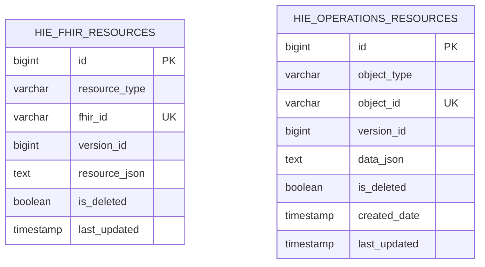

# Harmonia Database Schema Specification

## 1. Overview

Harmonia utilizes a PostgreSQL relational database managed by the `mnemosyne` persistence modules:
- **`mnemosyne-clinical`**: Manages clinical FHIR R5 resources in `hie_fhir_resources`.
- **`mnemosyne-operations`**: Manages non-FHIR operational metadata and telemetry in `hie_operations_resources`.

Both tables use a hybrid relational-document storage pattern: relational metadata columns (`resource_type`, `fhir_id`, `version_id`, `is_deleted`, timestamps) provide indexed lookup and concurrency control, while the complete entity state is stored as a structured JSON document in a `TEXT` LOB column.

---

## 2. Table Catalog

### 2.1 Table: `hie_fhir_resources`

* **Owning Module**: `hestia/mnemosyne-clinical`
* **JPA Entity**: `net.fhirfactory.harmonia.hapifhir.model.FhirResourceEntity`
* **Repository**: `net.fhirfactory.harmonia.hapifhir.repository.FhirResourceRepository`
* **Purpose**: Authoritative durable storage for all HL7 FHIR R5 clinical resources, including `Communication`, `Task`, `Patient`, `Encounter`, `Observation`, `DiagnosticReport`, and `Provenance`.

#### Column Definitions

| Column Name | Data Type | Nullable | Default | Description |
| :--- | :--- | :--- | :--- | :--- |
| `id` | `BIGINT` | `NOT NULL` | Auto-Increment (Identity) | Synthetic primary key for relational indexing. |
| `resource_type` | `VARCHAR(64)` | `NOT NULL` | - | FHIR resource type name (e.g., `Communication`, `Task`, `Patient`). |
| `fhir_id` | `VARCHAR(128)` | `NOT NULL` | - | Logical FHIR resource identifier (UUID). |
| `version_id` | `BIGINT` | `NOT NULL` | `1` | Monotonically increasing version counter for optimistic locking. |
| `resource_json` | `TEXT` | `NOT NULL` | - | Serialized FHIR R5 JSON payload. |
| `is_deleted` | `BOOLEAN` | `NOT NULL` | `FALSE` | Relational retirement flag reflecting domain lifecycle status (records are retained for regulatory audit; see ADR-020). |
| `last_updated` | `TIMESTAMP` | `NOT NULL` | `CURRENT_TIMESTAMP` | UTC timestamp of the last write or mutation. |

#### Constraints & Indexes

| Constraint / Index Name | Type | Columns | Purpose |
| :--- | :--- | :--- | :--- |
| `pk_hie_fhir_resources` | Primary Key | `id` | Unique row identification. |
| `uk_resource_type_fhir_id` | Unique Constraint | `(resource_type, fhir_id)` | Enforces single-record uniqueness for any given resource ID per resource type. |
| `idx_resource_type_fhir_id` | B-Tree Index | `(resource_type, fhir_id)` | Fast index scan for direct resource retrieval by type and ID. |
| `idx_resource_type_deleted` | B-Tree Index | `(resource_type, is_deleted)` | Fast index scan for non-deleted resource list/search operations. |

---

### 2.2 Table: `hie_operations_resources`

* **Owning Module**: `hestia/mnemosyne-operations`
* **JPA Entity**: `net.fhirfactory.harmonia.operations.model.OperationResourceEntity`
* **Repository**: `net.fhirfactory.harmonia.operations.repository.OperationResourceRepository`
* **Purpose**: Authoritative durable storage for non-FHIR operational metadata, processing telemetry, runtime settings, and monitoring state.

#### Column Definitions

| Column Name | Data Type | Nullable | Default | Description |
| :--- | :--- | :--- | :--- | :--- |
| `id` | `BIGINT` | `NOT NULL` | Auto-Increment (Identity) | Synthetic primary key for relational indexing. |
| `object_type` | `VARCHAR(64)` | `NOT NULL` | - | Categorical operational type (e.g., `metrics`, `gateway_config`, `audit_log`). |
| `object_id` | `VARCHAR(128)` | `NOT NULL` | - | Logical unique identifier for the operational object. |
| `version_id` | `BIGINT` | `NOT NULL` | `1` | Monotonically increasing version counter for optimistic locking. |
| `data_json` | `TEXT` | `NOT NULL` | `""` | Serialized JSON operational payload or configuration blob. |
| `is_deleted` | `BOOLEAN` | `NOT NULL` | `FALSE` | Relational retirement flag for operational telemetry (see ADR-020). |
| `created_date` | `TIMESTAMP` | `NOT NULL` | `CURRENT_TIMESTAMP` | UTC creation timestamp. |
| `last_updated` | `TIMESTAMP` | `NOT NULL` | `CURRENT_TIMESTAMP` | UTC timestamp of last update. |

#### Constraints & Indexes

| Constraint / Index Name | Type | Columns | Purpose |
| :--- | :--- | :--- | :--- |
| `pk_hie_operations_resources` | Primary Key | `id` | Unique row identification. |
| `uk_ops_object_type_object_id` | Unique Constraint | `(object_type, object_id)` | Enforces single-instance uniqueness for an operational object. |
| `idx_ops_object_type_object_id` | B-Tree Index | `(object_type, object_id)` | Fast index scan for operational object retrieval. |
| `idx_ops_object_type_deleted` | B-Tree Index | `(object_type, is_deleted)` | Fast index scan for active operational resource listing. |

---

## 3. Physical DDL Definition

Below is the standard PostgreSQL physical DDL script for initializing the Harmonia schema:

```sql
-- Harmonia Relational Schema Initialization (PostgreSQL 16+)

-- 1. Create hie_fhir_resources Table
CREATE TABLE IF NOT EXISTS hie_fhir_resources (
    id BIGSERIAL PRIMARY KEY,
    resource_type VARCHAR(64) NOT NULL,
    fhir_id VARCHAR(128) NOT NULL,
    version_id BIGINT NOT NULL DEFAULT 1,
    resource_json TEXT NOT NULL,
    is_deleted BOOLEAN NOT NULL DEFAULT FALSE,
    last_updated TIMESTAMP WITHOUT TIME ZONE NOT NULL DEFAULT (NOW() AT TIME ZONE 'UTC'),
    CONSTRAINT uk_resource_type_fhir_id UNIQUE (resource_type, fhir_id)
);

-- Indexes on hie_fhir_resources
CREATE INDEX IF NOT EXISTS idx_resource_type_fhir_id 
    ON hie_fhir_resources (resource_type, fhir_id);

CREATE INDEX IF NOT EXISTS idx_resource_type_deleted 
    ON hie_fhir_resources (resource_type, is_deleted);


-- 2. Create hie_operations_resources Table
CREATE TABLE IF NOT EXISTS hie_operations_resources (
    id BIGSERIAL PRIMARY KEY,
    object_type VARCHAR(64) NOT NULL,
    object_id VARCHAR(128) NOT NULL,
    version_id BIGINT NOT NULL DEFAULT 1,
    data_json TEXT NOT NULL DEFAULT '',
    is_deleted BOOLEAN NOT NULL DEFAULT FALSE,
    created_date TIMESTAMP WITHOUT TIME ZONE NOT NULL DEFAULT (NOW() AT TIME ZONE 'UTC'),
    last_updated TIMESTAMP WITHOUT TIME ZONE NOT NULL DEFAULT (NOW() AT TIME ZONE 'UTC'),
    CONSTRAINT uk_ops_object_type_object_id UNIQUE (object_type, object_id)
);

-- Indexes on hie_operations_resources
CREATE INDEX IF NOT EXISTS idx_ops_object_type_object_id 
    ON hie_operations_resources (object_type, object_id);

CREATE INDEX IF NOT EXISTS idx_ops_object_type_deleted 
    ON hie_operations_resources (object_type, is_deleted);
```

---

## 4. Entity Relationship Diagram



---

## 5. Retention & Data Governance

1. **Clinical Retention Compliance (ADR-020)**:
   - In accordance with healthcare data compliance standards and platform architectural invariants (ADR-020), clinical entries in `hie_fhir_resources` are never physically deleted during normal operations.
   - Logical deactivations or retirements are domain-appropriate lifecycle transitions executed as authoritative `UPDATE` operations, preserving complete historical provenance, Kleio audit evidence, and referential integrity.
2. **Archival, Retention-Based Purge, and Physical Disposal**:
   - Long-term archival, retention-based purge policies, and physical storage disposal are formally designated as outside the scope of the current Harmonia framework (see ADR-020). Any out-of-band operational lifecycle procedures implemented by host infrastructure must preserve audit immutability and clinical safety.
