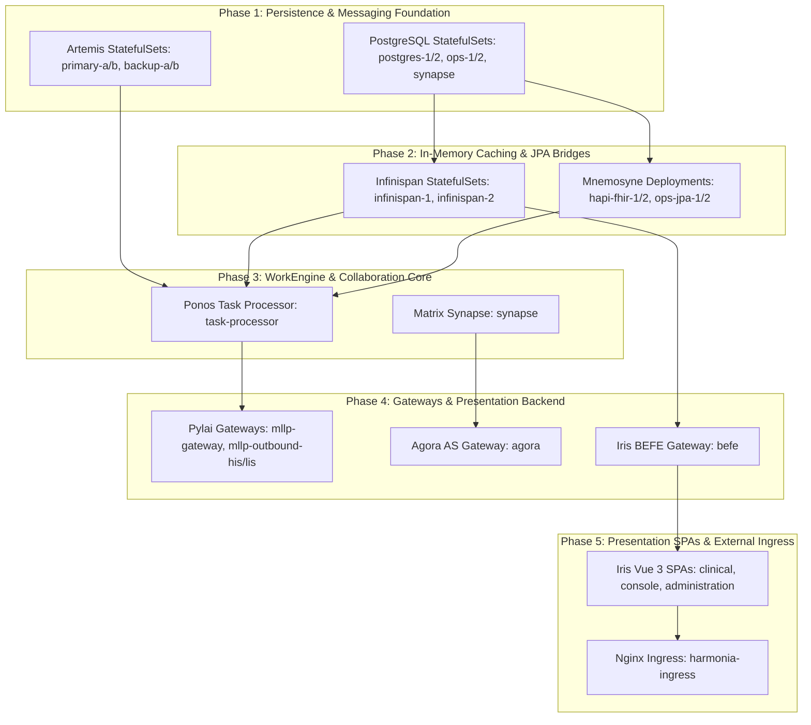

# Harmonia Normal MicroK8s Deployment Runbook `[CONFIGURED]`

This runbook specifies the step-by-step procedure for deploying the normal (production/reference) Harmonia Health Integration Environment onto a prepared Ubuntu MicroK8s cluster.

---

## 1. Deployment Overview & Phased Architecture `[CONFIGURED]`

Harmonia orchestrates 25 containerized workloads organized into 5 architectural tiers. To prevent initialization deadlocks and connection failures during startup, workloads must roll out in strict chronological sequence:



---

## 2. Step-by-Step Manual Deployment Walkthrough `[CONFIGURED]`

### Step 2.1: Namespace Provisioning
Create the dedicated `harmonia` namespace with standard labels:
```bash
microk8s kubectl create namespace harmonia --dry-run=client -o yaml | microk8s kubectl apply -f -
microk8s kubectl label namespace harmonia app.kubernetes.io/part-of=harmonia-platform --overwrite
```

---

### Step 2.2: Secrets Provisioning
Before deploying workloads, provision all required database, messaging, cache, and collaboration credentials:

```bash
# 1. PostgreSQL Database Credentials
microk8s kubectl create secret generic harmonia-db-secrets \
  --namespace harmonia \
  --from-literal=fhir-password="fhir_password" \
  --from-literal=ops-password="ops_password" \
  --dry-run=client -o yaml | microk8s kubectl apply -f -

# 2. ActiveMQ Artemis Credentials
microk8s kubectl create secret generic harmonia-artemis-secrets \
  --namespace harmonia \
  --from-literal=admin-password="admin" \
  --from-literal=cluster-password="artemisClusterPassword" \
  --dry-run=client -o yaml | microk8s kubectl apply -f -

# 3. Infinispan Hot Rod Credentials
microk8s kubectl create secret generic harmonia-infinispan-secrets \
  --namespace harmonia \
  --from-literal=admin-password="admin" \
  --dry-run=client -o yaml | microk8s kubectl apply -f -

# 4. Matrix Synapse Homeserver Secrets
microk8s kubectl create secret generic harmonia-synapse-secrets \
  --namespace harmonia \
  --from-literal=registration-shared-secret="synapse_reg_secret_shared_12345" \
  --from-literal=macaroon-secret-key="synapse_macaroon_secret_key_12345" \
  --from-literal=form-secret="synapse_form_secret_12345" \
  --from-literal=db-password="synapse_db_password" \
  --dry-run=client -o yaml | microk8s kubectl apply -f -

# 5. Agora Application Service Secrets
microk8s kubectl create secret generic harmonia-agora-secrets \
  --namespace harmonia \
  --from-literal=hs-token="agora_hs_token_secure_value_abc123" \
  --from-literal=as-token="agora_as_token_secure_value_def456" \
  --from-literal=synapse-admin-token="synapse_admin_token_secure_value_ghi789" \
  --dry-run=client -o yaml | microk8s kubectl apply -f -
```

---

### Step 2.3: Declarative Kustomize Deployment
Deploy all base workloads and the MicroK8s hostpath storage patch:

```bash
# Apply declarative Kustomize overlay
microk8s kubectl apply -k deployment/kubernetes/environments/microk8s
```

---

### Step 2.4: Phased Rollout Monitoring
Monitor StatefulSet and Deployment rollouts until all workloads report complete:

```bash
# Phase 1: Wait for StatefulSets
echo "Waiting for Tier 4 & 5 StatefulSets..."
microk8s kubectl rollout status statefulset/postgres-1 -n harmonia --timeout 180s
microk8s kubectl rollout status statefulset/postgres-2 -n harmonia --timeout 180s
microk8s kubectl rollout status statefulset/postgres-ops-1 -n harmonia --timeout 180s
microk8s kubectl rollout status statefulset/postgres-ops-2 -n harmonia --timeout 180s
microk8s kubectl rollout status statefulset/postgres-synapse -n harmonia --timeout 180s
microk8s kubectl rollout status statefulset/artemis-primary-a -n harmonia --timeout 180s
microk8s kubectl rollout status statefulset/artemis-backup-a -n harmonia --timeout 180s
microk8s kubectl rollout status statefulset/artemis-primary-b -n harmonia --timeout 180s
microk8s kubectl rollout status statefulset/artemis-backup-b -n harmonia --timeout 180s
microk8s kubectl rollout status statefulset/infinispan-1 -n harmonia --timeout 180s
microk8s kubectl rollout status statefulset/infinispan-2 -n harmonia --timeout 180s
microk8s kubectl rollout status statefulset/synapse -n harmonia --timeout 300s

# Phase 2: Wait for Deployments
echo "Waiting for Tier 1, 2, 3 & 5 Deployments..."
microk8s kubectl rollout status deployment/hapi-fhir-jpa-server-1 -n harmonia --timeout 180s
microk8s kubectl rollout status deployment/hapi-fhir-jpa-server-2 -n harmonia --timeout 180s
microk8s kubectl rollout status deployment/hie-operations-jpa-server-1 -n harmonia --timeout 180s
microk8s kubectl rollout status deployment/hie-operations-jpa-server-2 -n harmonia --timeout 180s
microk8s kubectl rollout status deployment/task-processor -n harmonia --timeout 180s
microk8s kubectl rollout status deployment/mllp-gateway -n harmonia --timeout 180s
microk8s kubectl rollout status deployment/mllp-outbound-his -n harmonia --timeout 180s
microk8s kubectl rollout status deployment/mllp-outbound-lis -n harmonia --timeout 180s
microk8s kubectl rollout status deployment/befe -n harmonia --timeout 180s
microk8s kubectl rollout status deployment/iris-clinical -n harmonia --timeout 180s
microk8s kubectl rollout status deployment/iris-console -n harmonia --timeout 180s
microk8s kubectl rollout status deployment/iris-administration -n harmonia --timeout 180s
microk8s kubectl rollout status deployment/agora -n harmonia --timeout 180s
```

---

## 3. Automated Deployment via Ansible `[CONFIGURED]`

As an alternative to manual `kubectl` commands, Harmonia provides automated, idempotent Ansible playbooks in `deployment/ansible/`:

```bash
# 1. Navigate to Ansible directory
cd deployment/ansible

# 2. Prepare reference Ubuntu host and install MicroK8s
ansible-playbook -i inventory/hosts.ini prepare-microk8s.yml

# 3. Deploy Harmonia platform, secrets, and verify rollouts
ansible-playbook -i inventory/hosts.ini deploy-harmonia.yml
```

### Ansible Playbook Execution Guarantees:
- Validates Ubuntu OS and minimum 4 vCPU / 8 GB RAM / 40 GB disk.
- Sets kernel bridge and IP forwarding parameters.
- Installs MicroK8s snap (`1.28/stable`) and activates add-ons (`dns`, `ingress`, `hostpath-storage`, `metrics-server`).
- Generates all Kubernetes secrets from Ansible Vault (`inventory/group_vars/vault.yml`).
- Deploys Kustomize manifests and polls rollout status for all 25 workloads.
- Asserts that all 12 PersistentVolumeClaims are in `Bound` phase.
