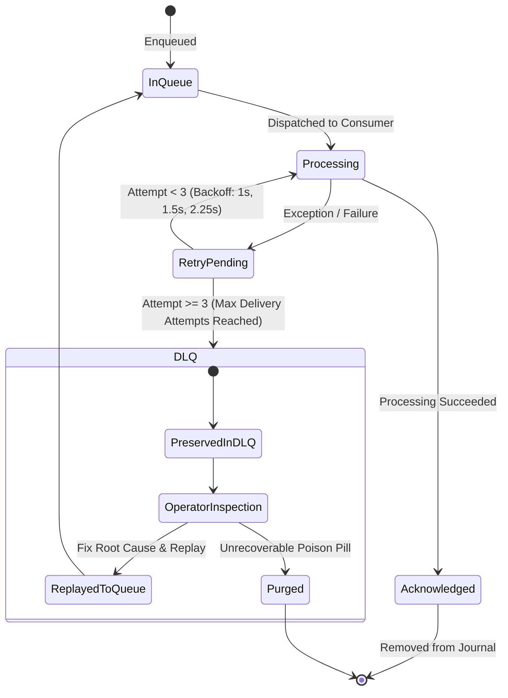
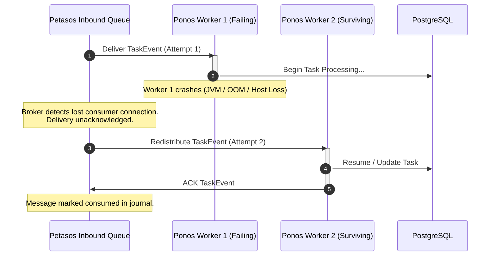
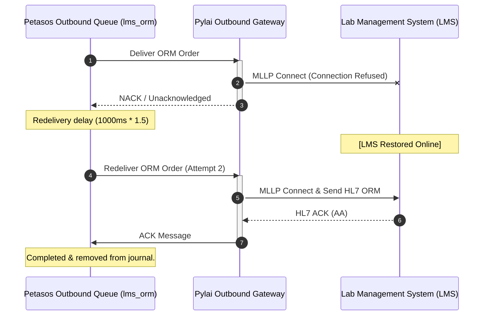

# Harmonia Failure-Recovery Architecture & Operational Runbook

## 1. Failure-Recovery Philosophy

Clinical integration platforms cannot afford data loss or silent operational failures. Harmonia achieves resilience through decoupled message persistence (Apache ActiveMQ Artemis NIO journal), distributed execution coordination (Infinispan data grid), and durable relational storage (PostgreSQL).

When failures occur, Harmonia recovers state deterministically based on:
1. **At-Least-Once Delivery**: Messages remain durable on Artemis until explicitly acknowledged by downstream consumers.
2. **Deterministic Idempotency**: Duplicate messages arising from network retries or redeliveries are identified and deduplicated across multiple tiers.
3. **Dead-Letter Isolation**: Poison-pill messages or exhausted retries are moved to the `DLQ` to prevent pipeline head-of-line blocking.

---

## 2. Comprehensive Failure Matrix

| Failure Scenario | Detection Mechanism | Persisted State at Failure | Automatic Recovery Action | Retry Source | Duplicate Risk | Terminal Failure Condition |
| :--- | :--- | :--- | :--- | :--- | :--- | :--- |
| **Ponos Worker Crash** | Unacknowledged JMS consumer session timeout / broker disconnect | Message in Artemis Journal; Task in `IN_PROGRESS` or `REQUESTED` in cache/DB | Artemis detects closed consumer socket and redistributes message to another Ponos worker node immediately (`redistribution-delay=0`). | Petasos / Artemis Queue | None: downstream operations check task status and deduplicate via `_AMQ_DUPL_ID` | Message exceeds `max-delivery-attempts` (3) -> moved to `DLQ` |
| **Artemis Primary Broker Restart** | JMS connection failure listener / `PetasosConnectionException` | Messages committed to disk journal (`./data/journal`) | Auto-reconnect with infinite retries (`reconnectAttempts=-1`). Broker reloads journal on startup and resumes queue delivery. In clustered HA, backup takes over within 2s. | Artemis Journal Replay | None: sliding window deduplication cache restored | Broker disk corruption or storage exhaustion |
| **Outbound Destination (LMS / RIS / EMR) Down** | MLLP TCP Connection Refused / Socket Timeout | Outbound message remains unacked on Petasos outbound queue; Task in `IN_PROGRESS` | Camel / Artemis redelivery with exponential backoff (`redelivery-delay=1000ms`, `multiplier=1.5`, `max-attempts=3`). | Outbound Petasos Queue | Minimal: destination must support MSH-10 idempotency upon reconnect | Retries exhausted -> message moved to `DLQ`; Task marked `FAILED` |
| **Database Unavailable (PostgreSQL)** | JPA `CannotCreateTransactionException` / SQL timeout | Inbound message unacknowledged on MLLP socket | Gateway catches exception and returns HL7 `AE` (Application Error) NACK to the client. Sender retains message and retries. | Upstream Sending System (PAS/EMR) | None: database constraint `uk_resource_type_fhir_id` rejects duplicate insert on recovery | Extended database outage |
| **Missing HL7 ACK / Socket Timeout** | MLLP read timeout (configurable, default 30s) | Inbound: no ACK returned to sender; Outbound: message unacknowledged in queue | Inbound: sender reconnects and resends; Outbound: Camel MLLP producer marks transmission failed and triggers retry. | Sender (Inbound) / Petasos Queue (Outbound) | Low: duplicate handled via MSH-10 check | Retries exhausted -> DLQ |
| **HL7 Application Error (AE)** | Remote system returns `MSA-1 = AE` | Outbound response captured as failure; Task updated with error note | Trigger configured error handler and retry policy. If non-transient, move to `DLQ`. | Petasos Outbound Queue | None | Retries exhausted -> DLQ |
| **HL7 Application Reject (AR)** | Remote system returns `MSA-1 = AR` | Message validation failure recorded in operational log | Message is rejected immediately; no automatic retry (payload schema/syntax is invalid). | None (Terminal) | None | Immediate routing to DLQ / Operator alert |
| **Partial ADT Fan-Out Failure** | RIS-PAC fails while EMR and LMS succeed | Outbound queues `emr_adt` and `lms_adt` ACKed; `ris_adt` unacked | Only `ris_adt` queue message retries delivery to RIS-PAC. EMR and LMS queues are already completed and will not receive duplicate messages. | `petasos.queue.mllp.outbound.ris_adt` | None: isolated queue per destination | `ris_adt` retries exhausted -> `DLQ` |
| **Complete Harmonia Restart** | System shutdown / cold restart | All queued messages in Artemis persistent journal; all FHIR resources in PostgreSQL | Upon restart, Artemis reloads journal, Ponos reconnects consumers, and pending queue messages resume processing automatically. | Artemis Journal | None: deduplication keys prevent reprocessing | Catastrophic multi-disk hardware loss |

---

## 3. Subsystem Restart Recovery

```
┌─────────────────────────────────────────────────────────────────────────────┐
│                       SUBSYSTEM RESTART LIFECYCLE                           │
│                                                                             │
│  1. Database (PostgreSQL)  ──► Replays WAL -> Restores ACID store           │
│  2. Cache Grid (Infinispan) ─► Re-establishes cluster -> Syncs HotRod state │
│  3. Petasos (Artemis)      ──► Replays NIO Journal -> Recovers Queues & DLQ │
│  4. Ponos Workflow Engine  ──► Attaches consumers -> Consumes pending tasks │
│  5. Pylai MLLP Gateways    ──► Opens TCP sockets -> Resumes ingest/dispatch │
└─────────────────────────────────────────────────────────────────────────────┘
```

1. **Pylai Inbound Gateways**:
   - *Lost State*: In-memory TCP socket connections and unparsed socket buffers.
   - *Surviving State*: All accepted messages were persisted to DB/cache and Artemis prior to returning `AA`.
   - *Recovery Action*: Re-binds MLLP server ports (e.g. 2101, 2102, 2103). External clients reconnect and resend any unacknowledged frames.
2. **Petasos (Artemis Broker)**:
   - *Lost State*: Volatile RAM buffers.
   - *Surviving State*: Entire message journal (`data/journal`), queue bindings, message ordering, delivery counters, and DLQ contents.
   - *Recovery Action*: Reads journal headers, validates transactional consistency, and makes queued messages available to connected consumers.
3. **Ponos (Workflow Engine)**:
   - *Lost State*: In-flight Camel exchange memory threads.
   - *Surviving State*: Unacknowledged messages on Petasos queues; persistent FHIR Task records in PostgreSQL.
   - *Recovery Action*: Connects JMS consumers to queues (`petasos.queue.task-sequence-processor`), receives redelivered `TaskEvent` messages, and re-executes Ergon activity pipelines.
4. **Mnemosyne (PostgreSQL Database)**:
   - *Lost State*: Uncommitted database transactions.
   - *Surviving State*: All committed rows in `hie_fhir_resources` and `hie_operations_resources`.
   - *Recovery Action*: PostgreSQL crash recovery replays WAL logs and re-establishes connection pooling.

---

## 4. Idempotency & Deduplication Architecture

Harmonia employs a 4-level layered idempotency model to prevent duplicate clinical side effects:

```
┌─────────────────────────────────────────────────────────────────────────┐
│                    4-LEVEL IDEMPOTENCY TAXONOMY                         │
│                                                                         │
│  Level 1: Transport Deduplication (Artemis Journal)                     │
│  • Key: _AMQ_DUPL_ID header                                             │
│  • Window: 20,000 messages (sliding cache)                              │
│  • Action: Duplicate messages dropped silently at broker ingress        │
│                                                                         │
│  Level 2: Protocol Correlation (HL7 v2.4 MSH-10)                        │
│  • Key: MSH-10 Message Control ID                                       │
│  • Action: Mapped to MSA-2 in ACK; checked during inbound ingestion     │
│                                                                         │
│  Level 3: Workflow Instance Correlation (Ponos Pragma)                  │
│  • Key: Pragma.pragmaId / correlationId / causationId                   │
│  • Action: Correlates parent/child task execution pipelines             │
│                                                                         │
│  Level 4: Entity Database Uniqueness (PostgreSQL)                       │
│  • Key: uk_resource_type_fhir_id (resource_type, fhir_id)               │
│  • Action: Rejects duplicate resource inserts at database level         │
└─────────────────────────────────────────────────────────────────────────┘
```

---

## 5. HL7 Acknowledgement (ACK) Semantics

Harmonia maps processing outcomes to standard HL7 v2 ACK codes:

| ACK Code | Meaning | Harmonia Trigger Condition | Persistence Action | Client Expectation |
| :--- | :--- | :--- | :--- | :--- |
| **`AA`** | Application Accept | Message successfully parsed, validated, persisted to database/cache, and enqueued on Artemis. | FHIR `Communication` & `Task` committed. | Client considers message delivered; no retry. |
| **`AE`** | Application Error | Transient system error: database unreachable, cache timeout, or broker connection failure during ingestion. | Transaction rolled back; no corrupt partial state. | Client MUST retry transmission after backoff. |
| **`AR`** | Application Reject | Non-transient data error: malformed HL7 syntax, unparseable MSH header, or unsupported message structure. | Rejected message logged to operational telemetry. | Client MUST NOT retry automatically; requires human correction. |

---

## 6. Retry & Dead-Letter Queue (DLQ) Policy

### 6.1 Configuration Parameters (ActiveMQ Artemis & Petasos)

```xml
<address-setting match="#">
    <dead-letter-address>DLQ</dead-letter-address>
    <expiry-address>ExpiryQueue</expiry-address>
    <redelivery-delay>1000</redelivery-delay>
    <redelivery-delay-multiplier>1.5</redelivery-delay-multiplier>
    <max-delivery-attempts>3</max-delivery-attempts>
    <redistribution-delay>0</redistribution-delay>
    <id-cache-size>20000</id-cache-size>
</address-setting>
```

### 6.2 Dead-Letter Lifecycle



---

## 7. Recovery Sequence Diagrams

### 7.1 Ponos Worker Failure & Queue Redistribution



### 7.2 Outbound Destination Recovery & Retry



---

## 8. Persistence & Recovery Traceability Matrix

| Flow Name | Persistent Entities | Active Queues | Primary Recovery Mechanism | Idempotency Key |
| :--- | :--- | :--- | :--- | :--- |
| **PAS ADT Inbound** | `FhirResourceEntity` (`Communication`, `Task`) | `petasos.queue.task-sequence-processor` | Client retry on AE; Artemis journal replay | `MSH-10`, `_AMQ_DUPL_ID` |
| **ADT -> EMR** | `FhirResourceEntity` (`Provenance`) | `petasos.queue.mllp.outbound.emr_adt` | Camel retry + Artemis redelivery | `_AMQ_DUPL_ID`, `Task.id` |
| **ADT -> LMS** | `FhirResourceEntity` (`Provenance`) | `petasos.queue.mllp.outbound.lms_adt` | Camel retry + Artemis redelivery | `_AMQ_DUPL_ID`, `Task.id` |
| **ADT -> RIS-PAC** | `FhirResourceEntity` (`Provenance`) | `petasos.queue.mllp.outbound.ris_adt` | Camel retry + Artemis redelivery | `_AMQ_DUPL_ID`, `Task.id` |
| **EMR ORM -> LMS** | `FhirResourceEntity` (`Communication`, `Task`, `Provenance`) | `petasos.queue.mllp.outbound.lms_orm` | OBR-4 routing retry + DLQ isolation | `MSH-10`, `ORC-2 Placer Order` |
| **EMR ORM -> RIS** | `FhirResourceEntity` (`Communication`, `Task`, `Provenance`) | `petasos.queue.mllp.outbound.ris_orm` | OBR-4 routing retry + DLQ isolation | `MSH-10`, `ORC-2 Placer Order` |
| **LMS ORU Inbound** | `FhirResourceEntity` (`Observation`, `DiagnosticReport`) | `petasos.queue.task-sequence-processor` | Client retry on AE; DB constraint uniqueness | `MSH-10`, `OBR-3 Filler Order` |
| **RIS ORU Inbound** | `FhirResourceEntity` (`Observation`, `DiagnosticReport`) | `petasos.queue.task-sequence-processor` | Client retry on AE; DB constraint uniqueness | `MSH-10`, `OBR-3 Filler Order` |
