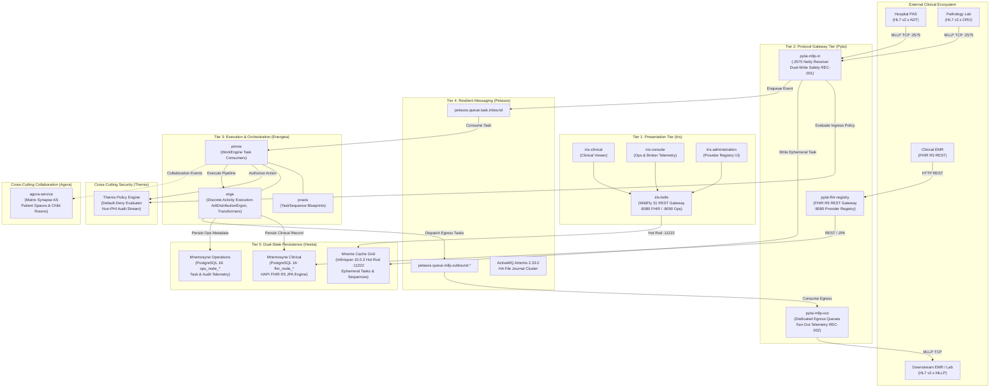

# Architecture at a Glance

Harmonia delivers an enterprise Health Integration Environment (HIE) structured across five operational tiers and four cross-cutting domain frameworks. This document provides an architectural overview of how clinical events move through the platform, how subsystems interact, and how data integrity is maintained at every step.

---

## 1. End-to-End System Architecture `[IMPLEMENTED]`

---

## 2. Walkthrough of the 5 Core Tiers `[IMPLEMENTED]`

### Tier 1: Presentation Tier (Iris) `[IMPLEMENTED]`
- **Role**: Provides decoupled browser-based management, clinical visualization, and platform monitoring.
- **Components**:
  - `iris-befe` `[IMPLEMENTED]`: WildFly 31.0.1 Jakarta EE Backend-For-Frontend gateway exposing split REST endpoints on port 8080 (`/api/fhir/*`) and port 8090 (`/api/operations/*`). Interacts directly with the Mneme cache grid via Hot Rod.
  - `iris-clinical` `[IMPLEMENTED]`: Vue 3 / Vite Single Page Application for clinical practitioners to inspect FHIR R5 resources and patient timelines.
  - `iris-console` `[IMPLEMENTED]`: Vue 3 / Vite Single Page Application for platform engineers to monitor Artemis message queues, consumer concurrency, and TaskSequence execution states.
  - `iris-administration` `[IMPLEMENTED]`: Vue 3 / Vite Single Page Application for operational administrators to view and query Provider Registry resources (`Practitioner`, `Organization`, `Location`).
- **Architectural Boundary**: Presentation modules never access relational databases or JPA entities directly.

### Tier 2: Protocol Gateway Tier (Pylai) `[IMPLEMENTED]`
- **Role**: Sits at the perimeter of the Harmonia cluster, terminating external protocols, verifying security assertions, and translating wire formats into canonical envelopes.
- **Components**:
  - `pylai-mllp-in` `[IMPLEMENTED]`: Netty-based MLLP listener on TCP port `2575`. Translates HL7 v2.x messages (ADT, ORU, ORM, MFN) into FHIR `Communication` and `Task`/`Pragma` models. Enforces **Ingress Dual-Write Safety (REC-001)**: guarantees Petasos enqueue before emitting an `AA` acknowledgment.
  - `pylai-mllp-out` `[IMPLEMENTED]`: Netty-based outbound MLLP dispatcher consuming from dedicated per-destination queues. Enforces **Destination Fan-Out State Tracking (REC-002)**.
  - `pylai-fhir-registry` `[IMPLEMENTED]`: High-performance RESTful FHIR gateway providing standard FHIR R5 search, create, update, and lifecycle operations for Provider Registry master data (ADR-020).

### Tier 3: Workflow & Task Execution Tier (Energeia) `[IMPLEMENTED]`
- **Role**: Executes asynchronous integration tasks, manages workflow pipelines, and coordinates activity sequences.
- **Components**:
  - `ponos` `[IMPLEMENTED]`: Distributed WorkEngine worker daemon consuming from `petasos.queue.task.inbound`. Manages worker thread pools and execution timeouts.
  - `erga` `[IMPLEMENTED]`: Library of discrete, single-responsibility activity units extending `ErgonBase` (e.g., `AdtDistributionErgon`, `Adt2FhirErgon`, transformers).
  - `praxis` `[IMPLEMENTED]`: Declarative workflow blueprints defining sequential and parallel execution stages for multi-step clinical tasks.

### Tier 4: Resilient Messaging Tier (Petasos) `[IMPLEMENTED]`
- **Role**: Provides guaranteed, high-availability, zero-loss message transport across all platform daemons.
- **Components**:
  - `petasos-api` `[IMPLEMENTED]`: Pure Java abstraction contracts (`PetasosProducer`, `PetasosConsumer`, `PetasosMessage`) with strictly zero JMS or broker dependencies.
  - `petasos-core` `[IMPLEMENTED]`: Message envelope serialization, correlation tracking, and sliding-window duplicate detection (`DuplicateDetector`).
  - `petasos-artemis` `[IMPLEMENTED]`: Production adapter integrating Apache ActiveMQ Artemis 2.33.0 in symmetric high-availability clustered configurations with durable file journals.

### Tier 5: Dual-State Persistence Tier (Hestia) `[IMPLEMENTED]`
- **Role**: Isolates fast, ephemeral workflow state from durable clinical records.
- **Sub-Architectures**:
  - **Mneme (Ephemeral Cache Grid)** `[IMPLEMENTED]`: Clustered Infinispan 15.0.3 data grid. Stores active `Task`, `TaskSequence`, and checkpoint state with sub-millisecond read/write latency.
  - **Mnemosyne (Durable Relational Persistence)** `[IMPLEMENTED]`:
    - `mnemosyne-clinical`: HAPI FHIR R5 JPA server backed by PostgreSQL 16 (`fhir_node_*`). Authoritative repository for clinical resources (`Patient`, `Encounter`, `Observation`, `Practitioner`).
    - `mnemosyne-operations`: Spring Data JPA repository backed by PostgreSQL 16 (`ops_node_*`). Records long-term operational telemetry, audit trails, and archival state.

---

## 3. Cross-Cutting Subsystems `[IMPLEMENTED]`

### Themis (Default-Deny Security) `[IMPLEMENTED]`
Themis enforces deterministic Attribute- and Role-Based Access Control (ABAC/RBAC) across four operational gates:
1. **Ingress Gate**: Evaluates perimeter requests entering through Pylai.
2. **Dispatch Gate**: Authorizes tasks published to Petasos queues.
3. **Execution Gate**: Verifies worker identity before executing an Ergon activity.
4. **Storage Gate**: Controls read/write access to Mnemosyne relational tables.

Unauthenticated or unauthorized actions default strictly to `DENY`. Security audit trails are emitted via `ThemisAuditService` with zero Protected Health Information.

### Calliope (Canonical Models & Conversions) `[IMPLEMENTED]`
Calliope is Harmonia's shared schema and translation foundation. It defines canonical data structures (`ErgonEvent`, `ErgonPayload`, `ErgonReasonEnum`), topic definitions (`HarmoniaTopics`), and bi-directional converters between HL7 v2.x and FHIR R5 structures. It has zero dependencies on higher layers.

### Agora (Collaboration Gateway & Matrix Synapse) `[IMPLEMENTED]`
Agora acts as a Matrix Application Service (AS), bridging Harmonia clinical triggers into Matrix Synapse collaboration rooms. It provisions hierarchical **Patient Spaces** with four standard child rooms (`Statistics`, `Tasks`, `Discussion`, `Diagnostics`), enforces Themis authorization on all room operations, and maintains zero PHI in room metadata.

### Paradeigma (Synthetic Simulation Framework) `[IMPLEMENTED]`
Paradeigma simulates complete external hospital ecosystems (EMR, LMS, PAS, RIS-PACS) to drive end-to-end integration scenarios and failure recovery tests. Under **Invariant 1**, production code must never depend on or import Paradeigma.

---

## 4. Key Architectural Guarantees `[IMPLEMENTED]`

1. **Ingress Dual-Write Guarantee (REC-001)**: No message is acknowledged with `AA` over MLLP until it is durably persisted and enqueued.
2. **Granular Fan-Out Tracking (REC-002)**: Sub-statuses for multi-destination dispatches are recorded individually per recipient.
3. **Zero-PHI Logging**: Operational logs contain only correlation identifiers (`TaskSequenceId`, `PragmaId`); clinical content is isolated from standard console outputs.
4. **Complete Decoupling**: Pure APIs isolate the presentation tier from database engines, and messaging contracts from concrete broker implementations.
