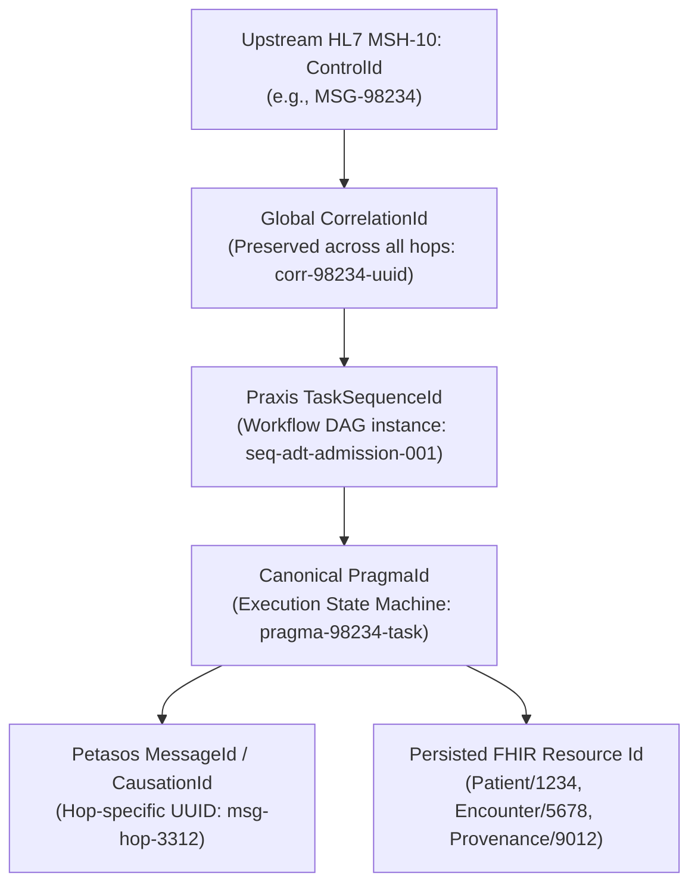

# Correlation, Causation & Lineage Architecture `[IMPLEMENTED]`

In healthcare integration, end-to-end traceability is a clinical safety requirement. A clinician investigating an updated laboratory result or medication allergy must be able to trace that data point back through every intermediate transformation, queue, gateway, and upstream HL7 trigger without ambiguity.

---

## 1. Multi-Tier Identifier Hierarchy `[IMPLEMENTED]`

Harmonia enforces a strict five-tier identifier hierarchy spanning every protocol hop:



### Identifier Roles & Definitions
| Identifier Dimension | Scope | Format | Lifecycle & Immutability |
| :--- | :--- | :--- | :--- |
| **`MessageControlId`** | External Protocol Wire | Alphanumeric (from MSH-10 or FHIR Bundle id) | Originates at external sending system; immutable. Echoed in MSA-2 ACK. |
| **`CorrelationId`** | Platform-Wide | UUIDv4 | Generated at ingress if absent; propagated across every queue, Camel exchange, and HTTP call. |
| **`CausationId`** | Direct Lineage Hop | UUIDv4 | Identifies the immediate parent event or message that triggered the current step. |
| **`TaskSequenceId`** | Workflow Orchestration | Alphanumeric string | Identifies the active Praxis workflow DAG definition governing execution. |
| **`PragmaId`** | Task State Machine | UUIDv4 | Primary key for the canonical task execution envelope cached in Mneme and saved as FHIR `Task`. |

---

## 2. Cross-Protocol Header Propagation Matrix `[IMPLEMENTED]`

Identifiers are systematically mapped across boundary protocols:

| Context / Hop | Correlation ID Key | Causation ID Key | Task / Pragma ID Key | Control ID Key |
| :--- | :--- | :--- | :--- | :--- |
| **HL7 v2 MLLP** | Generated UUID | N/A | Bound `Task/{id}` | `MSH-10` |
| **HTTP / REST** | `X-Correlation-Id` | `X-Causation-Id` | `X-Task-Id` | `X-Message-Control-Id` |
| **Petasos Message** | `message.getCorrelationId()`| `message.getCausationId()` | Header `HIE_TASK_ID` | Header `HIE_CONTROL_ID` |
| **JMS Message** | JMS Property `HIE_CORRELATION_ID` | JMS Property `HIE_CAUSATION_ID` | JMS Property `HIE_TASK_ID` | JMS Property `HIE_CONTROL_ID` |
| **Camel Exchange**| Header `HIE_CORRELATION_ID` | Header `HIE_CAUSATION_ID` | Header `HIE_PRAGMA_ID` | Header `HIE_CONTROL_ID` |
| **MDC Logging** | `MDC.put("correlationId", ...)` | `MDC.put("causationId", ...)` | `MDC.put("taskId", ...)` | `MDC.put("controlId", ...)` |

---

## 3. MDC Context Logging & Diagnostic Traceability `[IMPLEMENTED]`

Harmonia wires correlation identifiers directly into SLF4J Mapped Diagnostic Context (MDC) at every route and conduit ingress:

```java
// PetasosQueueToExchangeConduit.java
try {
    MDC.put("correlationId", message.getCorrelationId());
    MDC.put("causationId", message.getCausationId());
    MDC.put("messageId", message.getMessageId());
    MDC.put("taskId", pragma.getPragmaId());

    log.info("Dispatching task for execution"); // Automatically carries MDC keys in log aggregators
    workflowDispatcher.dispatchPragma(pragma);
} finally {
    MDC.clear();
}
```

This guarantees that centralized logging systems (e.g., Elasticsearch, Loki, CloudWatch) can aggregate all operational log lines belonging to a single clinical event using a simple query:
```logql
{app="harmonia"} |= "correlationId=corr-98234-uuid"
```

---

## 4. FHIR Provenance Lineage Linking `[IMPLEMENTED]`

Every mutation committed to Mnemosyne creates an associated FHIR R5 `Provenance` record linking the created/updated resource to its upstream origin:

```json
{
  "resourceType": "Provenance",
  "id": "prov-patient-90210-01",
  "target": [{ "reference": "Patient/pat-90210" }],
  "recorded": "2026-09-17T12:00:01Z",
  "activity": {
    "coding": [{
      "system": "http://terminology.hl7.org/CodeSystem/v3-DataOperation",
      "code": "CREATE"
    }]
  },
  "agent": [{
    "type": {
      "coding": [{
        "system": "http://terminology.hl7.org/CodeSystem/provenance-participant-type",
        "code": "author"
      }]
    },
    "who": {
      "identifier": {
        "system": "http://example.org/hie/principal",
        "value": "process:ponos-engine"
      }
    }
  }],
  "entity": [{
    "role": "source",
    "what": {
      "reference": "Communication/comm-98234-a01",
      "identifier": {
        "system": "urn:oid:1.2.3.4.5.6",
        "value": "MSG-98234"
      }
    }
  }]
}
```
This bidirectional link allows operators to jump directly from a clinical entity to its exact raw HL7 wire payload in the `Communication` resource.
