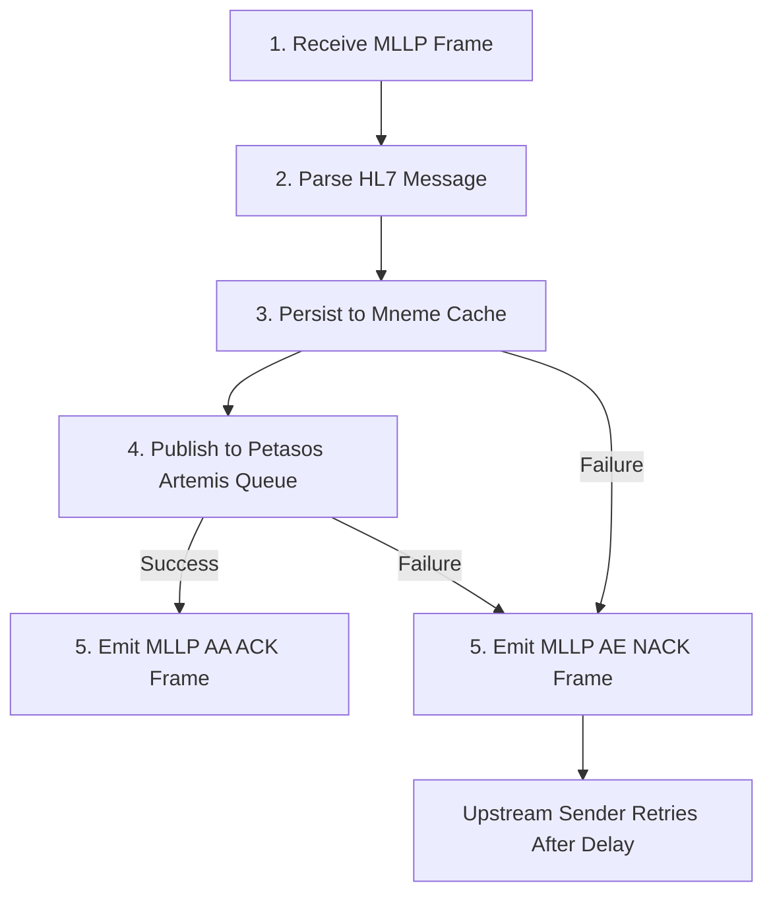

# Integration Error Handling, Retries & Dead-Letter Remediation `[IMPLEMENTED]`

Harmonia is designed to guarantee zero data loss across hostile healthcare network environments, where destination systems (e.g. legacy hospital EMR or PACS) may experience unannounced downtime, socket resets, or high latency.

---

## 1. Error Taxonomy & Strategy Matrix `[IMPLEMENTED]`

Failures in Harmonia are classified into four distinct operational categories:

| Error Category | Examples | System Reaction | Retry Strategy | Target Destination |
| :--- | :--- | :--- | :--- | :--- |
| **Transient Network** | TCP connection refused, read timeout, broker failover | Keep in queue / redeliver | Exponential backoff (1s, 2s, 4s, 8s, 16s) | Current Queue -> DLQ after 5 attempts |
| **Business / Validation** | Referential integrity violation, invalid HL7 field | Reject immediately | No retry | Emits `AE` NACK or HTTP 422 `OperationOutcome` |
| **Security / Auth** | Themis policy DENY, invalid credentials | Reject & audit | No retry | Logged to `themis-audit`, HTTP 403 Forbidden |
| **Poison Payload** | Unparseable garbage bytes causing JVM crash/OOM | Quarantine | Bounded retry (max 5) | Diverted to `petasos.queue.dlq` |

---

## 2. Ingress Resiliency: Dual-Write Safety (REC-001) `[IMPLEMENTED]`

The ingress gateway (`pylai-mllp-in`) guarantees that no message is acknowledged to an upstream sender until it is durably secured in Harmonia:



### Ingress Safety Rules
1. **Never Swallowing Exceptions**: If `taskEventProducerService.sendTaskEvent(...)` throws a JMS or connection exception, the catch block generates an `AE` (Application Error) NACK.
2. **Backpressure**: If Petasos or Mneme is unresponsive, the Netty event loop delays reading further TCP frames, pushing backpressure upstream to the hospital interface engine.

---

## 3. Egress Resiliency: Outbound MLLP Retry Mechanics `[IMPLEMENTED]`

Outbound dispatching via `pylai-mllp-out` integrates granular Camel retry policies:

```java
// OutboundMllpRouteBuilder.java
onException(Exception.class)
    .handled(true)
    .maximumRedeliveries(2)
    .redeliveryDelay(500)
    .backOffMultiplier(2.0)
    .retryAttemptedLogLevel(LoggingLevel.WARN)
    .log(LoggingLevel.ERROR, LOG.getName(), "Error during outbound MLLP transmission to ${header.HIE_DEST_HOST}:${header.HIE_DEST_PORT}: ${exception.message}")
    .process(exchange -> {
        // Formulate OutboundMllpResponse.failure(...)
        // Mark HIE_TRANSMISSION_SUCCESS = false
    });
```

### Destination Fan-Out Isolation (REC-002)
When an ingested ADT event is distributed to multiple downstream targets (EMR, LMS, RIS):
- Each destination has a dedicated queue (`petasos.queue.mllp.outbound.emr_adt`, `...lms_adt`, `...ris_adt`).
- If the RIS destination socket is offline, its queue will hold messages and retry independently.
- The EMR and LMS deliveries complete immediately with success checkpoints committed to the parent `Pragma`.
- **Zero Cross-Contamination**: A slow or crashed downstream system never stalls or blocks delivery to other systems.

---

## 4. ActiveMQ Artemis Broker Dead-Letter & Expiry Settings `[CONFIGURED]`

Artemis broker configuration (`broker.xml`) enforces automatic poison message quarantine:

```xml
<address-settings>
   <address-setting match="petasos.queue.#">
      <!-- Routing for exhausted messages -->
      <dead-letter-address>petasos.queue.dlq</dead-letter-address>
      <expiry-address>petasos.queue.expiry</expiry-address>

      <!-- Exponential Retry Backoff -->
      <redelivery-delay>1000</redelivery-delay>
      <redelivery-delay-multiplier>2.0</redelivery-delay-multiplier>
      <max-redelivery-delay>30000</max-redelivery-delay>
      <max-delivery-attempts>5</max-delivery-attempts>

      <!-- Paging and Memory Protection -->
      <max-size-bytes>104857600</max-size-bytes>
      <page-size-bytes>10485760</page-size-bytes>
      <address-full-policy>PAGE</address-full-policy>
      <redistribution-delay>0</redistribution-delay>
   </address-setting>
</address-settings>
```

---

## 5. Dead-Letter Queue (DLQ) Remediation Runbook `[IMPLEMENTED]`

When a message exceeds 5 delivery attempts, Artemis routes it to `petasos.queue.dlq`. Operators inspect and remediate using the following workflow:

### Step 1: Check DLQ Depth
```bash
# Query active messages in DLQ via Artemis CLI inside broker pod
kubectl exec -it artemis-primary-a-0 -n harmonia -- \
  /opt/activemq-artemis/bin/artemis queue stat --queue-name petasos.queue.dlq
```

### Step 2: Inspect Poison Message Content
```bash
# Peek at the head message payload and headers
kubectl exec -it artemis-primary-a-0 -n harmonia -- \
  /opt/activemq-artemis/bin/artemis queue browse --queue-name petasos.queue.dlq --max-messages 1
```

### Step 3: Root Cause Analysis
Inspect headers in the DLQ message:
- `_AMQ_ORIG_ADDRESS`: Original destination queue name.
- `_AMQ_ORIG_MESSAGE_ID`: Original message identifier.
- `HIE_TASK_ID`: Bound Harmonia Task identifier.
- Correlate with logs:
  ```bash
  kubectl logs -l app=ponos -n harmonia | grep "taskId=<HIE_TASK_ID>"
  ```

### Step 4: Replay or Purge
Once the underlying issue (e.g., database constraint, target network firewall) is resolved, replay the message:
```bash
# Move messages from DLQ back to their original queue
kubectl exec -it artemis-primary-a-0 -n harmonia -- \
  /opt/activemq-artemis/bin/artemis queue move \
  --source-queue petasos.queue.dlq \
  --target-queue petasos.queue.mllp.outbound.ris_adt
```
