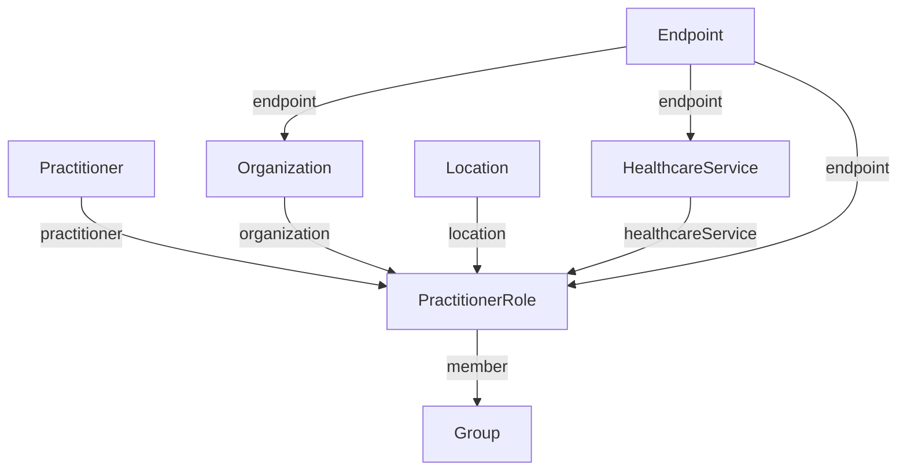

# HL7 FHIR R5 Specification & Provider Registry `[IMPLEMENTED]`

Harmonia adopts **HL7 FHIR Release 5 (R5)** as its authoritative clinical, master data, and orchestration information model. FHIR R5 is leveraged across three distinct domains: clinical domain entities, workflow task state management, and the enterprise Provider Registry.

---

## 1. FHIR R5 Resource Model Taxonomy `[IMPLEMENTED]`

Harmonia organizes FHIR R5 resources into three functional tiers:

| Tier | Resources | Purpose | Storage & Persistence |
| :--- | :--- | :--- | :--- |
| **Clinical Tier** | `Patient`, `Encounter`, `Person`, `RelatedPerson` | Patient demographics, admissions, encounters, and relationships mapped from ADT messages. | `mnemosyne-clinical` (`hie_fhir_resources` table) |
| **Orchestration Tier** | `Communication`, `Task`, `Provenance`, `AuditEvent`, `Bundle` | Encapsulation of wire messages, task state machines, audit trails, and transactional batches. | Mneme Cache + `mnemosyne-clinical` |
| **Provider Registry Tier** | `Practitioner`, `PractitionerRole`, `Organization`, `Location`, `HealthcareService`, `Endpoint`, `Group` | Master data governing healthcare providers, physical locations, organizational units, and communication endpoints. | `mnemosyne-clinical` (`hie_fhir_resources` table) |

---

## 2. Master Provider Registry Governance `[IMPLEMENTED]`

The Provider Registry maintains the single source of truth for all healthcare actors and services within the enterprise. It comprises seven interconnected resources governed by strict referential integrity rules:



### 2.1 Referential Integrity Validation (`ProviderRegistryReferenceValidator`)
Before any create or update operation is committed to the registry, `ProviderRegistryReferenceValidator` asserts:
- **`PractitionerRole.practitioner`**: Referenced `Practitioner/{id}` exists and is active/not retired.
- **`PractitionerRole.organization`**: Referenced `Organization/{id}` exists.
- **`PractitionerRole.location`**: Referenced `Location/{id}` exists and is active.
- **`PractitionerRole.endpoint`**: Referenced `Endpoint/{id}` exists with matching connection type.
- **Cascading Integrity**: Attempts to retire or deactivate an `Organization` or `Practitioner` referenced by active `PractitionerRole` entities trigger `UnprocessableEntityException (422)`.

---

## 3. Relational Persistence Schema (`hie_fhir_resources`) `[CONFIGURED]`

Clinical and Provider Registry resources are persisted in PostgreSQL 16 using an immutable, versioned relational schema:

```sql
CREATE TABLE hie_fhir_resources (
    res_type VARCHAR(64) NOT NULL,
    res_id VARCHAR(128) NOT NULL,
    res_version INT NOT NULL,
    res_status VARCHAR(32) NOT NULL,
    res_text TEXT NOT NULL,
    res_updated TIMESTAMP WITH TIME ZONE NOT NULL,
    is_deleted BOOLEAN NOT NULL DEFAULT FALSE,
    security_labels VARCHAR(256),
    PRIMARY KEY (res_type, res_id, res_version)
);

CREATE INDEX idx_fhir_res_lookup ON hie_fhir_resources (res_type, res_id);
CREATE INDEX idx_fhir_res_updated ON hie_fhir_resources (res_updated);
CREATE INDEX idx_fhir_res_status ON hie_fhir_resources (res_type, res_status);
```

### 3.1 Versioning & Immutability Rules
- Every resource modification (`PUT`, `PATCH`) generates a new row with incremented `res_version`.
- Updates never overwrite existing rows, providing complete temporal history.
- Domain lifecycle deactivations or retirements insert an authoritative version update (reflecting status changes or retirement), preserving complete historical references for Kleio audit and lineage (ADR-020).

---

## 4. HAPI FHIR JPA Resource Providers `[IMPLEMENTED]`

Resource interaction endpoints are implemented via HAPI FHIR `IResourceProvider` classes in `hestia/mnemosyne-clinical`:

```java
// Example: PractitionerResourceProvider.java
@Component
public class PractitionerResourceProvider implements IResourceProvider {

    @Autowired
    private FhirStorageService storageService;

    @Override
    public Class<Practitioner> getResourceType() {
        return Practitioner.class;
    }

    @Read
    public Practitioner read(@IdParam IdType id) {
        return storageService.readResource(Practitioner.class, id.getIdPart());
    }

    @Search
    public List<Practitioner> search(
            @OptionalParam(name = Practitioner.SP_NAME) StringParam name,
            @OptionalParam(name = Practitioner.SP_IDENTIFIER) TokenParam identifier) {
        return storageService.searchPractitioners(name, identifier);
    }
}
```

Standard supported HAPI provider annotations:
- `@Read`: Retrieve current version or specific historical version (`vread`).
- `@Search`: Parameterized lookup with pagination (`_count`, `_offset`).
- `@Create`: Synchronous storage write (evaluated by Themis security gates).
- `@Update`: Version-incremented update with referential validation.
- `@Delete`: REST deactivation / lifecycle transition to retired state (processed as an authoritative UPDATE; see ADR-020).
- `@History`: Full historical version trail for a resource instance.

---

## 5. Security Tagging & Context Propagation `[IMPLEMENTED]`

All FHIR resources processed by Harmonia carry structured security tags managed by `FhirSecurityTagManager`:

```json
{
  "resourceType": "Practitioner",
  "meta": {
    "versionId": "3",
    "lastUpdated": "2026-09-17T12:00:00Z",
    "security": [
      {
        "system": "http://example.org/hie/security-domain",
        "code": "PROVIDER_REGISTRY",
        "display": "Provider Registry Domain"
      },
      {
        "system": "http://example.org/hie/classification",
        "code": "INTERNAL",
        "display": "Internal Clinical Operations"
      }
    ]
  }
}
```
Security tags are inspected by `ThemisService` before permitting cross-domain data egress or export.
