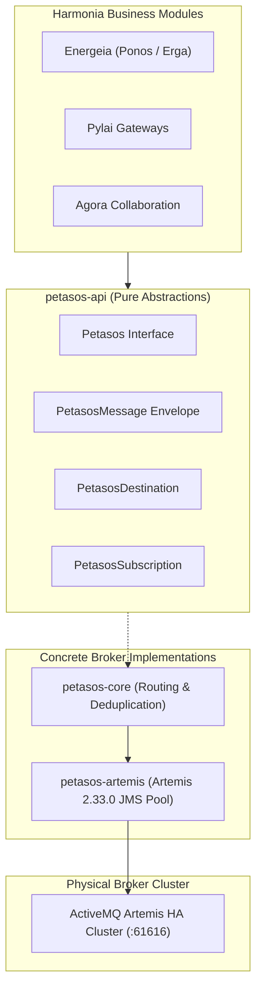

# Petasos Messaging Backbone & Queue Topology `[IMPLEMENTED]`

Petasos provides Harmonia's resilient, high-throughput messaging transport. It establishes a clean separation between pure abstract messaging contracts and concrete broker implementations, isolating ActiveMQ Artemis 2.33.0 dependencies while guaranteeing zero clinical data loss.

---

## 1. Architectural Invariant & Layering (Invariant 2) `[IMPLEMENTED]`

Petasos is strictly partitioned into decoupled layers:



### Invariant Enforcement Rules
1. **Zero JMS Exposure**: `petasos-api` contains zero imports of `jakarta.jms.*`, `javax.jms.*`, or `org.apache.activemq.*`.
2. **Payload Opacity**: Payloads are transported as opaque byte arrays (`byte[]`) or strings. Petasos never parses, validates, or inspects clinical HL7 or FHIR payloads.
3. **Pluggable Transports**: Underlying transport can be swapped (e.g. from Artemis to Kafka) without altering business modules.

---

## 2. PetasosMessage Canonical Envelope `[IMPLEMENTED]`

Every message in transit is wrapped in a standardized immutable envelope:

```java
public class PetasosMessage {
    private String messageId;            // Unique UUID for this message hop
    private String correlationId;        // Root workflow correlation identifier
    private String causationId;          // Immediate predecessor message ID
    private String messageType;          // Domain topic (e.g. "ADT_EVENT", "PR_CHANGE")
    private String contentType;          // MIME type (e.g. "application/json", "application/hl7-v2")
    private Instant timestamp;           // Emission timestamp (UTC)
    private String source;               // Originating service identifier
    private PetasosDestination target;   // Destination queue or topic
    private Map<String, String> headers; // Custom transport headers (e.g. HIE_*)
    private byte[] payload;              // Opaque payload bytes
}
```

### Standard Header Keys
- `HIE_GATEWAY_INSTANCE`: Identifier of ingress gateway pod.
- `HIE_TRIGGER_TYPE`: HL7 trigger code (`A01`, `O01`, `R01`).
- `HIE_MESSAGE_TYPE`: Message family (`ADT`, `ORM`, `ORU`, `MFN`).
- `HIE_TASK_ID`: Bound FHIR `Task` logical identifier.
- `HIE_CONTROL_ID`: Upstream MSH-10 control identifier.
- `HIE_ACTION`: Intended action (`PROCESS`, `ROUTE`, `DISPATCH`).
- `HIE_TOPIC`: Canonical Topic string (`Health.HL7v2.2_4.ADT.A01`).

---

## 3. Authoritative Queue Topology & Naming Register `[IMPLEMENTED]`

Harmonia organizes queues into functional categories with strict naming conventions:

| Queue Name | Purpose | Producers | Consumers | Retention / Policy |
| :--- | :--- | :--- | :--- | :--- |
| `task.processing.queue` | Primary task processing queue for complex workflow execution. | Gateways, CLI | `energeia-ponos` | Persistent, DLQ after max 3 delivery attempts |
| `task.event.queue` | Notification events for lightweight task triggering. | `pylai-mllp-in` | `TaskProcessorRouteBuilder` | Persistent, Fast drain |
| `task.event.queue.<gatewayId>` | Dedicated per-gateway instance notification queue. | `pylai-mllp-in` | `energeia-ponos` | Dedicated worker binding |
| `harmonia.provider.registry.change.request` | Master data mutation queue for Provider Registry governance. | `pylai-fhir-registry` | `energeia-ponos` | Persistent, Serialized FIFO |
| `petasos.queue.mllp.outbound.emr_adt` | Outbound queue for distributing ADT events to EMR. | `AdtDistributionErgon` | `pylai-mllp-out` (EMR sender) | Persistent, 2 redeliveries |
| `petasos.queue.mllp.outbound.lms_adt` | Outbound queue for distributing ADT events to Laboratory LIS. | `AdtDistributionErgon` | `pylai-mllp-out` (LMS sender) | Persistent, 2 redeliveries |
| `petasos.queue.mllp.outbound.ris_adt` | Outbound queue for distributing ADT events to Radiology RIS. | `AdtDistributionErgon` | `pylai-mllp-out` (RIS sender) | Persistent, 2 redeliveries |
| `petasos.queue.agora.collaboration` | Collaboration events for Matrix Synapse room orchestration. | `AdtDistributionErgon` | `agora-service` | Persistent |
| `DLQ` | Dead Letter Queue for poison messages exceeding retry limits (max 3 delivery attempts). | Artemis Broker Core | Operations / Operators | Manual remediation |
| `ExpiryQueue` | Expiry address for time-to-live expired messages. | Artemis Broker Core | Operations Auditing | Retention: 7 days |

---

## 4. Sliding-Window Duplicate Detection `[IMPLEMENTED]`

To prevent duplicate execution during network failovers or sender retries, `petasos-core` integrates a sliding-window duplicate detector:
- **Identifier**: Combination of `correlationId` + `messageId` + `destinationQueue`.
- **Implementation**: In-memory LRU cache (`DuplicateDetector` in `petasos-core/dedup/`) using a `LinkedHashMap` with access-order eviction.
- **Sliding Window**: Default 1-hour window (3,600 seconds) retaining up to 10,000 distinct message IDs.
- **Action**: Duplicate messages are safely acknowledged and discarded without re-triggering Erga activity pipelines.
- **Note**: This is a client-side deduplication mechanism supplementing Artemis broker-side duplicate ID caching; it is not backed by Infinispan.

---

## 5. Transport Configuration `[CONFIGURED]`

```properties
# ActiveMQ Artemis Connection Settings
petasos.artemis.broker-url=tcp://artemis-primary-a:61616?ha=true&retryInterval=1000&retryIntervalMultiplier=2.0&reconnectAttempts=-1
petasos.artemis.user=artemis_user
petasos.artemis.password=${ARTEMIS_PASSWORD}
petasos.artemis.pool.max-connections=50
petasos.artemis.pool.idle-timeout=30000
petasos.consumer.concurrency=5-20
petasos.consumer.acknowledge-mode=CLIENT_ACKNOWLEDGE
```
- `ha=true`: Enables automatic topology discovery and instant failover to backup broker.
- `reconnectAttempts=-1`: Indefinite reconnection retry to survive temporary broker restarts.
- `CLIENT_ACKNOWLEDGE`: Message ACK withheld until task checkpoint or outbound transmission succeeds.
