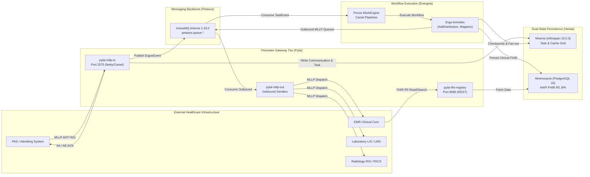

# Harmonia Integration Architecture Overview `[IMPLEMENTED]`

Harmonia provides a robust, healthcare-grade integration backbone designed to connect heterogeneous clinical and administrative systems—including Patient Administration Systems (PAS), Electronic Medical Record systems (EMR), Laboratory Information Management Systems (LMS), and Radiology Information Systems / Picture Archiving and Communication Systems (RIS/PACS).

---

## 1. Integration Topology & Core Boundaries `[IMPLEMENTED]`

Harmonia bridges classical healthcare protocols (HL7 v2.x over MLLP) and modern standards (HL7 FHIR R5 over HTTP/REST) through a decoupled, event-driven gateway architecture:

---

## 2. Ingress & Egress Invariants `[IMPLEMENTED]`

Harmonia integration pipelines strictly adhere to two core healthcare integration architectural invariants:

### 2.1 Ingress Dual-Write Safety (REC-001) `[IMPLEMENTED]`
- When an external system transmits a clinical message (e.g., HL7 ADT^A01) to `pylai-mllp-in`, Harmonia **never** emits an `AA` (Application Accept) acknowledgement prematurely.
- Inbound messages are parsed, transformed into FHIR `Communication` and synthetic `Task` resources, cached in Mneme, and dispatched to the Petasos messaging queue.
- Only after both the cache write and the Petasos queue publish succeed is the synchronous `AA` ACK returned over the TCP MLLP connection.
- If any persistence or queue dispatch error occurs, an `AE` (Application Error) NACK is returned, prompting the upstream sender to retry.

### 2.2 Destination Fan-Out State Tracking (REC-002) `[IMPLEMENTED]`
- When a single ingested event triggers downstream notifications to multiple target endpoints (e.g., distributing an ADT event to EMR, LMS, and RIS), the system does not lose visibility into individual delivery statuses.
- The workflow engine (`AdtDistributionErgon`) records discrete sub-checkpoints for each destination queue inside the canonical `Pragma` task envelope (`destinationQueue`, `status=QUEUED`).
- Each outbound delivery instance captures response acknowledgments (`AA`, `AE`, `AR`), network latency, and error codes in structured FHIR extensions (`http://example.org/hie/destination-delivery-status`).

---

## 3. Integration Suite Navigation `[IMPLEMENTED]`

The integration specification suite consists of the following detailed technical guides:

| Document | Focus Area | Key Technologies & Subsystems | Status |
| :--- | :--- | :--- | :--- |
| [**pylai.md**](pylai.md) | Perimeter Protocol Gateways | Netty, Apache Camel 4.4, MLLP TCP Server, JAX-RS | `[IMPLEMENTED]` |
| [**hl7-v2.md**](hl7-v2.md) | HL7 v2.x Processing & Parsing | HAPI HL7 v2, Terser, ADT/MFN/ORM/ORU | `[IMPLEMENTED]` |
| [**fhir.md**](fhir.md) | FHIR R5 Data Models & Registry | HAPI FHIR R5 JPA, Provider Registry, Task Resources | `[IMPLEMENTED]` |
| [**rest.md**](rest.md) | Synchronous & Asynchronous REST | FHIR REST API, HTTP 202 Accepted, Task Tracking | `[IMPLEMENTED]` |
| [**messaging.md**](messaging.md) | Petasos Message Transport | PetasosMessage envelopes, Queue naming, Artemis | `[IMPLEMENTED]` |
| [**correlation.md**](correlation.md) | Correlation & Causation Lineage | TaskSequenceId, PragmaId, MessageControlId | `[IMPLEMENTED]` |
| [**error-handling.md**](error-handling.md) | Resiliency, Retries & DLQ | ACK/NACK semantics, Exponential Backoff, Dead-Letter Queues | `[IMPLEMENTED]` |

---

## 4. Operational & Network Listener Register `[CONFIGURED]`

The integration tier binds the following production network listeners:

| Subsystem / Gateway | Port | Protocol | Interface | Direction | Encryption |
| :--- | :--- | :--- | :--- | :--- | :--- |
| `pylai-mllp-in` (ADT Ingress) | `2575` | MLLP / TCP | `0.0.0.0:2575` | Inbound | Clear / Optional TLS |
| `pylai-mllp-in` (Health / Admin) | `8080` | HTTP / REST | `0.0.0.0:8080` | Inbound | Clear (Internal Mesh) |
| `pylai-fhir-registry` (FHIR REST) | `8080` | HTTP / REST | `0.0.0.0:8080` | Inbound | TLS at Ingress |
| `pylai-mllp-out` (Health / Admin) | `8080` | HTTP / REST | `0.0.0.0:8080` | Inbound | Clear (Internal Mesh) |
| Outbound Destination Endpoints | `2576-2578` | MLLP / TCP | Configurable | Outbound | Target Defined |
