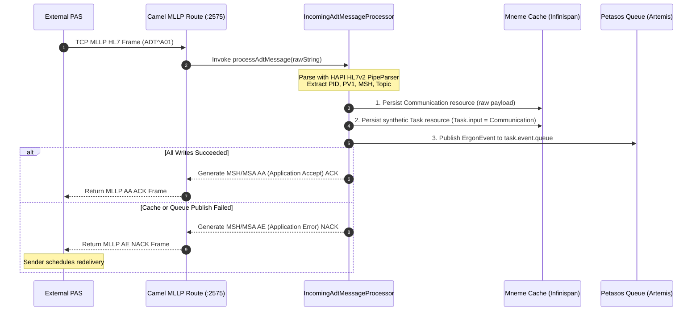

# Pylai Perimeter Protocol Gateway Integration `[IMPLEMENTED]`

Pylai constitutes Harmonia's perimeter gateway tier, terminating external protocols (HL7 v2.x MLLP and FHIR R5 REST) and isolating internal messaging, workflow, and persistence subsystems from raw network interactions.

---

## 1. Pylai Architectural Architecture `[IMPLEMENTED]`

Pylai is partitioned into five specialized leaf modules:

| Leaf Module | Artifact ID | Packaging | Primary Responsibilities |
| :--- | :--- | :--- | :--- |
| `pylai-mllp-base` | `pylai-mllp-base` | JAR | Shared MLLP configuration, models, builders, and `TaskEventProducerService`. |
| `pylai-mllp-in` | `pylai-mllp-in` | WAR | Inbound Netty/Camel MLLP server on port `2575`, parsing HL7 triggers, writing to Mneme, and emitting TaskEvents. |
| `pylai-mllp-out` | `pylai-mllp-out` | WAR | Outbound Camel MLLP sender consuming from Petasos queues and transmitting to external destination sockets. |
| `pylai-fhir-registry` | `pylai-fhir-registry` | JAR | FHIR R5 REST gateway exposing synchronous read/search and asynchronous change request pipelines. |
| `pylai-mllp-cli` | `pylai-mllp-cli` | JAR | Operational command-line utility for synthetic MLLP message generation and diagnostic pinging. |

---

## 2. Inbound MLLP Camel Pipeline (`pylai-mllp-in`) `[IMPLEMENTED]`

### 2.1 Route Architecture
Inbound HL7 v2 messages are ingested using Apache Camel's `camel-mllp` component powered by Netty:

```java
// IncomingAdtMessageMllpRouteBuilder.java
fromF("mllp://%s:%d?autoAck=%b", mllpConfig.getHost(), mllpConfig.getPort(), mllpConfig.isAutoAck())
    .routeId("hl7-mllp-adt-receiver")
    .log("Received HL7 message via MLLP interface")
    .process(incomingAdtMessageProcessorWrapper)
    .log("Completed processing HL7 message, ACK prepared");
```

Complementary routes exist for other message families:
- `IncomingMfnMessageMllpRouteBuilder` (`hl7-mllp-mfn-receiver`) for Master File Notifications.
- `IncomingOrmMessageMllpRouteBuilder` (`hl7-mllp-orm-receiver`) for Clinical Orders.
- `IncomingOruMessageMllpRouteBuilder` (`hl7-mllp-oru-receiver`) for Observational Results.

### 2.2 Ingestion & Dual-Write Safety Lifecycle (REC-001)
The core ingestion sequence in `IncomingAdtMessageProcessor` enforces atomic downstream acceptance before emitting an `AA` acknowledgment:



---

## 3. Outbound MLLP Camel Pipeline (`pylai-mllp-out`) `[IMPLEMENTED]`

### 3.1 Route Architecture
Outbound dispatches are handled by `OutboundMllpRouteBuilder`:

```java
// OutboundMllpRouteBuilder.java
from("direct:mllp-outbound-send")
    .routeId("mllp-outbound-send-route")
    .log(LoggingLevel.INFO, LOG.getName(), "Initiating outbound MLLP dispatch for request ${header.HIE_REQUEST_ID}")
    .process(outboundMllpProcessor)
    .toD("mllp://${header.HIE_DEST_HOST}:${header.HIE_DEST_PORT}?connectTimeout=${header.HIE_CONNECT_TIMEOUT}&readTimeout=${header.HIE_READ_TIMEOUT}&autoAck=${header.HIE_AUTO_ACK}&charsetName=${header.HIE_CHARSET}")
    .process(hl7AckProcessor)
    .log(LoggingLevel.INFO, LOG.getName(), "Processed MLLP acknowledgement: code=${header.HIE_ACK_CODE}, success=${header.HIE_TRANSMISSION_SUCCESS}");
```

### 3.2 Error Handling & ACK Validation
- **Exception Handling**: Catches `MllpException` and general network timeouts.
- **Redelivery**: Configured with a maximum of 2 redeliveries and an exponential backoff multiplier of 2.0 (500 ms initial delay).
- **Acknowledgment Extraction**: `Hl7AckProcessor` parses MSA-1 (`AA`, `AE`, `AR`) and validates MSA-2 against the outbound message control ID.
- **Delivery State Tracking (REC-002)**: Updates `Task.output` in Mnemosyne with structured delivery metadata (`http://example.org/hie/destination-delivery-status`).

---

## 4. FHIR REST Registry Gateway (`pylai-fhir-registry`) `[IMPLEMENTED]`

`FhirRestGatewayController` provides an HTTP/REST boundary compliant with FHIR R5:

### 4.1 Synchronous Read & Search Path
- **Endpoints**: `GET /fhir/r5/{resourceType}/{id}`, `GET /fhir/r5/{resourceType}?name=...`
- **Security**: Evaluates `FhirSecurityInterceptor` with Themis default-deny rules before invocation.
- **Execution**: Direct delegated read from `FhirStorageService` backed by PostgreSQL 16.

### 4.2 Asynchronous Governed Change Path
- **Endpoints**: `POST /fhir/r5/{resourceType}`, `PUT /fhir/r5/{resourceType}/{id}`
- **Response**: Synchronous `HTTP 202 Accepted` returning a `Task` status URL in the `Location` header.
- **Workflow Submission**: `ChangeRequestSubmissionService` packages the mutation into a canonical `ProviderRegistryChangePragma`, persists it to Mneme, and dispatches a message to `harmonia.provider.registry.change.request`.

---

## 5. Configuration Reference `[CONFIGURED]`

| Parameter Key | Environment Variable | Default Value | Description |
| :--- | :--- | :--- | :--- |
| `mllp.host` | `MLLP_HOST` | `0.0.0.0` | Bind IP address for MLLP TCP socket. |
| `mllp.port` | `MLLP_PORT` | `2575` | Inbound MLLP TCP listener port. |
| `mllp.autoAck` | `MLLP_AUTO_ACK` | `false` | Must be `false` to guarantee REC-001 dual-write safety. |
| `mllp.maxConcurrentConsumers` | `MLLP_MAX_CONCURRENT_CONSUMERS` | `10` | Worker thread limit for incoming connections. |
| `task.event.queue.name` | `TASK_EVENT_QUEUE_NAME` | `task.event.queue` | Primary Petasos queue for inbound event notifications. |
| `mllp.connectTimeout` | `MLLP_CONNECT_TIMEOUT` | `5000` | Outbound socket connection timeout (ms). |
| `mllp.readTimeout` | `MLLP_READ_TIMEOUT` | `10000` | Outbound ACK receive timeout (ms). |
