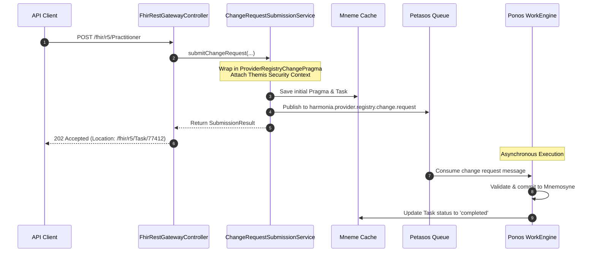

# REST API Specification & Asynchronous Workflows `[IMPLEMENTED]`

Harmonia provides a dual-surface RESTful API architecture:
1. **FHIR R5 Ingress & Registry API** (`pylai-fhir-registry`, port `8080`): Exposes standard FHIR endpoints for master data queries and asynchronous change requests.
2. **Operations & Telemetry API** (`iris-befe`, port `8090`): Exposes administrative, queue depth, cache status, and task lineage endpoints.

---

## 1. REST Endpoint Architecture `[IMPLEMENTED]`

```mermaid
graph TD
    subgraph Clients ["REST API Clients"]
        CLI[External Hospital EMR]
        SPA[Iris Vue 3 SPAs]
        MON[Prometheus / Ops Tools]
    end

    subgraph Gateways ["Gateway Boundaries"]
        FHIR_GW["pylai-fhir-registry<br/>Port 8080 (/fhir/r5/*)"]
        OPS_GW["iris-befe<br/>Port 8090 (/api/operations/*)"]
    end

    subgraph Internal ["Internal Execution & Storage"]
        THM[Themis Security Gates]
        MNM[Mnemosyne Relational DB]
        MNEM[Mneme Cache Grid]
        PTS[Petasos Artemis Queues]
    end

    CLI -->|Sync GET (Read/Search)| FHIR_GW
    CLI -->|Async POST/PUT (202 Accepted)| FHIR_GW
    SPA -->|Read/Write Registry| FHIR_GW
    SPA -->|Fetch Telemetry| OPS_GW
    MON -->|Probe Health| OPS_GW

    FHIR_GW -->|Authorize| THM
    FHIR_GW -->|Sync Read| MNM
    FHIR_GW -->|Async Enqueue| PTS
    FHIR_GW -->|Cache Task| MNEM

    OPS_GW -->|Query Grid| MNEM
    OPS_GW -->|Query Lineage| MNM
```

---

## 2. Synchronous Read & Search Endpoints `[IMPLEMENTED]`

All synchronous query operations return immediate HTTP 200 responses backed by Mnemosyne PostgreSQL storage:

### 2.1 Supported Query Endpoints
| HTTP Method | Route | Description | Response Codes |
| :--- | :--- | :--- | :--- |
| `GET` | `/metadata`, `/fhir/metadata` | Returns FHIR `CapabilityStatement` listing supported resources, operations, and search parameters. | `200 OK` |
| `GET` | `/fhir/r5/{resourceType}/{id}` | Reads specific resource by logical identifier. | `200 OK`, `404 Not Found` |
| `GET` | `/fhir/r5/{resourceType}/{id}/_history/{vid}` | Reads historical version of resource (`vread`). | `200 OK`, `404 Not Found` |
| `GET` | `/fhir/r5/{resourceType}?{searchParams}` | Searches resources matching query criteria (e.g. `name`, `identifier`, `active`). | `200 OK` (Bundle) |

---

## 3. Asynchronous Governed Change Workflow (HTTP 202) `[IMPLEMENTED]`

To ensure high-throughput ingestion and prevent blocking external clients during complex multi-stage validations, resource creations and updates are processed asynchronously:

### 3.1 Submission Request
```http
POST /fhir/r5/Practitioner HTTP/1.1
Host: harmonia.hospital.local:8080
Content-Type: application/fhir+json
Authorization: Bearer <themis_token>

{
  "resourceType": "Practitioner",
  "identifier": [{ "system": "http://ns.electronichealth.net.au/id/hpi-i", "value": "8003610000000000" }],
  "name": [{ "family": "Curie", "given": ["Marie"] }],
  "active": true
}
```

### 3.2 Asynchronous Acceptance Response (`HTTP 202 Accepted`)
```http
HTTP/1.1 202 Accepted
Location: http://harmonia.hospital.local:8080/fhir/r5/Task/task-pr-change-77412
Content-Type: application/fhir+json;charset=utf-8
X-Correlation-Id: corr-8891-aabb

{
  "resourceType": "Task",
  "id": "task-pr-change-77412",
  "status": "requested",
  "intent": "order",
  "authoredOn": "2026-09-17T12:00:00Z",
  "for": { "reference": "Practitioner/temp-77412" }
}
```

### 3.3 Asynchronous Execution Sequence


### 3.4 Task Status Polling Endpoint
Clients track asynchronous progress by querying the `Location` URI:
```http
GET /fhir/r5/Task/task-pr-change-77412 HTTP/1.1
Host: harmonia.hospital.local:8080
```
Status lifecycle transitions:
- `requested`: Queued in Petasos messaging buffer.
- `in-progress`: Picked up by Ponos worker; Themis policy checks and referential validation active.
- `completed`: Successfully written to Mnemosyne PostgreSQL storage; contains reference to created/updated entity.
- `failed`: Validation or authorization failure; includes detailed `OperationOutcome` in `Task.output`.

---

## 4. Error Responses & FHIR OperationOutcome `[IMPLEMENTED]`

Harmonia formats all HTTP error responses as FHIR R5 `OperationOutcome` resources:

```json
{
  "resourceType": "OperationOutcome",
  "issue": [{
    "severity": "error",
    "code": "conflict",
    "details": {
      "coding": [{
        "system": "http://hl7.org/fhir/issue-type",
        "code": "duplicate"
      }],
      "text": "Practitioner with identifier 8003610000000000 already exists"
    },
    "diagnostics": "Referential integrity constraint violation on Practitioner.identifier"
  }]
}
```

### Standard Status Codes
| HTTP Status Code | FHIR Issue Code | Trigger Condition |
| :--- | :--- | :--- |
| `400 Bad Request` | `structure` | Malformed JSON or unparseable payload. |
| `401 Unauthorized` | `login` | Missing or invalid authentication token. |
| `403 Forbidden` | `forbidden` | Themis default-deny policy rejection. |
| `404 Not Found` | `not-found` | Resource does not exist or has been soft-deleted. |
| `422 Unprocessable Entity` | `invariant` | Referential integrity failure (e.g. invalid Organization reference). |
| `500 Internal Error` | `exception` | Unexpected subsystem crash or database exception. |
| `503 Service Unavailable`| `transient` | Petasos queue or Infinispan cache offline. |
