# Harmonia Motivation Orientation View

## Executive Orientation & Architectural Map

The **Harmonia Motivation Orientation View** (working nickname: *"Where the bloody hell were we?" view*) provides a rapid mental reconstruction map for systems architects, integration engineers, and autonomous agents returning to the platform after an extended absence. 

Its primary purpose is to quickly answer:
```text
Why does Harmonia exist?
        │
        ▼
What pressures, risks, and conditions shape it?
        │
        ▼
What high-level states are we trying to achieve?
        │
        ▼
What enduring principles govern our response?
        │
        ▼
What foundational obligations follow?
```

The orientation view is intentionally **selective**: it is designed for cognitive orientation and pedagogical navigation, not as an exhaustive, fully-connected requirements traceability graph. It captures the seven canonical motivational threads that bind clinical and operational pressures to foundational architectural principles.

---

## Canonical Orientation Diagram

The following Mermaid diagram retains the seven-thread baseline of the Harmonia Motivation Orientation View. It models the seven approved threads, co-governing principle relationships, constraint entry points, and direct goal-to-outcome handovers. The [Independent Assurance reconciliation branch](#independent-assurance-reconciliation-branch), documented separately below, is **APPROVED / CLOSED**; Domain01 is again **CLOSED / FROZEN**.

```mermaid
flowchart LR
    %% Styling Classes for Architectural Visual Categories
    classDef clsStakeholder fill:#E1F5FE,stroke:#0288D1,stroke-width:2px,color:#01579B;
    classDef clsDriver fill:#FFF8E1,stroke:#FFA000,stroke-width:2px,color:#FF6F00;
    classDef clsAssessment fill:#FFEBEE,stroke:#E53935,stroke-width:2px,color:#B71C1C;
    classDef clsGoal fill:#E8F5E9,stroke:#43A047,stroke-width:2px,color:#1B5E20;
    classDef clsPrinciple fill:#EDE7F6,stroke:#5E35B1,stroke-width:2px,color:#311B92;
    classDef clsRequirement fill:#E0F2F1,stroke:#00897B,stroke-width:2px,color:#004D40;
    classDef clsConstraint fill:#FBE9E7,stroke:#D84315,stroke-width:2px,stroke-dasharray: 4 2,color:#BF360C;
    classDef clsOutcome fill:#F3E5F5,stroke:#8E24AA,stroke-width:2px,color:#4A148C;

    %% =========================================================================
    %% THREAD 1: Standards Interoperability & Boundary Sovereignty
    %% =========================================================================
    subgraph T1 ["Thread 1: Standards Interoperability & Boundary Sovereignty"]
        direction LR
        T1_S1["Regional Health<br/>Network Operator"]:::clsStakeholder
        T1_S2["Healthcare Delivery<br/>Organizations"]:::clsStakeholder
        T1_D1["Clinical Interoperability Across<br/>Heterogeneous Standards"]:::clsDriver
        T1_C1["Constraint: Mandated External<br/>Interoperability Contracts"]:::clsConstraint
        T1_G1["Vendor-Independent Longitudinal<br/>Clinical Information Coherence"]:::clsGoal
        T1_AX02["AX-02<br/>Standards at Boundary;<br/>Sovereignty Within"]:::clsPrinciple
        T1_AX03["AX-03<br/>Native Standards<br/>Representations"]:::clsPrinciple
        T1_R1["CORE-003<br/>Governed Canonical<br/>Semantics"]:::clsRequirement

        T1_S1 --> T1_D1
        T1_S2 --> T1_D1
        T1_C1 -. imposes .-> T1_D1
        T1_D1 --> T1_G1
        T1_G1 --> T1_AX02
        T1_G1 --> T1_AX03
        T1_AX02 --> T1_R1
        T1_AX03 --> T1_R1
    end

    %% =========================================================================
    %% THREAD 2: Clinical Information Independence & Longitudinal Coherence
    %% =========================================================================
    subgraph T2 ["Thread 2: Clinical Information Independence & Longitudinal Coherence"]
        direction LR
        T2_S1["Clinicians &<br/>Care Teams"]:::clsStakeholder
        T2_S2["Healthcare Delivery<br/>Organizations"]:::clsStakeholder
        T2_D1["Durable Clinical Information<br/>Independence"]:::clsDriver
        T2_G1["Vendor-Independent Longitudinal<br/>Clinical Information Coherence"]:::clsGoal
        T2_AX01["AX-01<br/>Health-Information<br/>Centricity"]:::clsPrinciple
        T2_AX06["AX-06<br/>Explicit Information<br/>Authority"]:::clsPrinciple
        T2_R1["CORE-001<br/>Authority<br/>Classification"]:::clsRequirement

        T2_S1 --> T2_D1
        T2_S2 --> T2_D1
        T2_D1 --> T2_G1
        T2_G1 --> T2_AX01
        T2_G1 --> T2_AX06
        T2_AX06 --> T2_R1
    end

    %% =========================================================================
    %% THREAD 3: Durable Ingress Acceptance & Failure Safety
    %% =========================================================================
    subgraph T3 ["Thread 3: Durable Ingress Acceptance & Failure Safety"]
        direction LR
        T3_S1["Healthcare Delivery<br/>Organizations"]:::clsStakeholder
        T3_S2["Platform Operations &<br/>Integration Engineers"]:::clsStakeholder
        T3_D1["Continuous Clinical<br/>Service Availability"]:::clsDriver
        T3_A1["Silent Data Loss via<br/>False Acceptance"]:::clsAssessment
        T3_G1["Durable Acceptance & Preservation<br/>of Clinical Events"]:::clsGoal
        T3_AX10["AX-10<br/>Distribution & Failure as<br/>Normal Operating Conditions"]:::clsPrinciple
        T3_AX05["AX-05<br/>Active Coordination ≠<br/>Authoritative State"]:::clsPrinciple
        T3_AX15["AX-15<br/>Explicit Representation<br/>of Uncertainty"]:::clsPrinciple
        T3_R1["REQ-INGRESS-001<br/>Durable Ingress<br/>Acceptance Boundary"]:::clsRequirement
        T3_R2["REQ-UNCERT-001<br/>Explicit Indeterminate<br/>Outcome"]:::clsRequirement

        T3_S1 --> T3_D1
        T3_S2 --> T3_D1
        T3_D1 --> T3_A1
        T3_A1 --> T3_G1
        T3_G1 --> T3_AX10
        T3_G1 --> T3_AX05
        T3_AX05 --> T3_R1
        T3_G1 --> T3_AX15
        T3_AX15 --> T3_R2
    end

    %% =========================================================================
    %% THREAD 4: Concurrent Availability & Responsive Information Access
    %% =========================================================================
    subgraph T4 ["Thread 4: Concurrent Availability & Responsive Information Access"]
        direction LR
        T4_S1["Clinicians &<br/>Care Teams"]:::clsStakeholder
        T4_S2["Platform Operations &<br/>Integration Engineers"]:::clsStakeholder
        T4_D1["Continuous Clinical<br/>Service Availability"]:::clsDriver
        T4_A1["Centralised Synchronous Persistence<br/>Can Constrain Concurrency"]:::clsAssessment
        T4_G1["Responsive Access to<br/>Managed Information"]:::clsGoal
        T4_AX11["AX-11<br/>Responsive & Resilient<br/>Information Access"]:::clsPrinciple
        T4_AX05["AX-05<br/>Active Coordination ≠<br/>Authoritative State"]:::clsPrinciple
        T4_AX09["AX-09<br/>Default Ephemerality of<br/>Operational State"]:::clsPrinciple

        T4_S1 --> T4_D1
        T4_S2 --> T4_D1
        T4_D1 --> T4_A1
        T4_A1 --> T4_G1
        T4_G1 --> T4_AX11
        T4_G1 --> T4_AX05
        T4_G1 --> T4_AX09
    end

    %% =========================================================================
    %% THREAD 5: Subject Identity & Referential Integrity
    %% =========================================================================
    subgraph T5 ["Thread 5: Subject Identity & Referential Integrity"]
        direction LR
        T5_S1["Patients &<br/>Care Recipients"]:::clsStakeholder
        T5_S2["Clinicians &<br/>Care Teams"]:::clsStakeholder
        T5_D1["Patient Safety &<br/>Identity Integrity"]:::clsDriver
        T5_C1["Constraint: National / Jurisdictional<br/>Healthcare Identifier Obligations"]:::clsConstraint
        T5_G1["Reliable Subject Identity &<br/>Referential Integrity"]:::clsGoal
        T5_AX06["AX-06<br/>Explicit Information<br/>Authority"]:::clsPrinciple
        T5_AX14["AX-14<br/>Preservation of<br/>Semantic Distinctions"]:::clsPrinciple
        T5_R1["REQ-IDENT-001<br/>Subject Referential<br/>Integrity"]:::clsRequirement

        T5_S1 --> T5_D1
        T5_S2 --> T5_D1
        T5_C1 -. bounds .-> T5_D1
        T5_D1 --> T5_G1
        T5_G1 --> T5_AX06
        T5_G1 --> T5_AX14
        T5_AX14 --> T5_R1
    end

    %% =========================================================================
    %% THREAD 6: Intrinsic Security, Privacy & Accountable Provenance
    %% =========================================================================
    subgraph T6 ["Thread 6: Intrinsic Security, Privacy & Accountable Provenance"]
        direction LR
        T6_S1["Patients &<br/>Care Recipients"]:::clsStakeholder
        T6_S2["Platform Operations &<br/>Integration Engineers"]:::clsStakeholder
        T6_D1["Statutory Health Information<br/>Privacy & Protection"]:::clsDriver
        T6_C1["Constraint: Applicable Privacy &<br/>Data-Protection Obligations"]:::clsConstraint
        T6_A1["Implicit Perimeter<br/>Trust"]:::clsAssessment
        T6_A2["PHI Leakage through<br/>Operational Logging"]:::clsAssessment
        T6_AX07["AX-07<br/>Security Is Intrinsic to<br/>Managed Operations"]:::clsPrinciple
        T6_AX08["AX-08<br/>Evidence Records Meaning,<br/>Not Machinery"]:::clsPrinciple
        T6_R1["SEC-001 / SEC-002<br/>Trusted Auth & Default-Deny"]:::clsRequirement
        T6_R2["SEC-010<br/>PHI-Safe Operational Logging"]:::clsRequirement
        T6_R3["PROV-001<br/>End-to-End Provenance"]:::clsRequirement

        T6_S1 --> T6_D1
        T6_S2 --> T6_D1
        T6_C1 -. bounds .-> T6_D1
        T6_D1 --> T6_A1
        T6_D1 --> T6_A2
        T6_A1 --> T6_AX07
        T6_A2 --> T6_AX07
        T6_AX07 --> T6_R1
        T6_AX07 --> T6_R2
        T6_AX07 --> T6_AX08
        T6_AX08 --> T6_R3
    end

    %% =========================================================================
    %% THREAD 7: Coordinated Operational Activity & Entity State
    %% =========================================================================
    subgraph T7 ["Thread 7: Coordinated Operational Activity & Entity State"]
        direction LR
        T7_S1["Healthcare Delivery<br/>Organizations"]:::clsStakeholder
        T7_S2["Platform Operations &<br/>Integration Engineers"]:::clsStakeholder
        T7_D1["Coordinated Operational Activity<br/>and Entity State"]:::clsDriver
        T7_A1["Unmonitored Destination Failure /<br/>Fan-Out Divergence"]:::clsAssessment
        T7_G1["Coordinated Progression of Operational<br/>Activities & Associated Entity State"]:::clsGoal
        T7_AX16["AX-16<br/>Operational Activity & Entity<br/>State Progress Together"]:::clsPrinciple
        T7_R1["REQ-COORD-001<br/>Operational Activity<br/>Progression State"]:::clsRequirement

        T7_S1 --> T7_D1
        T7_S2 --> T7_D1
        T7_D1 --> T7_A1
        T7_A1 --> T7_G1
        T7_G1 --> T7_AX16
        T7_AX16 --> T7_R1
    end

    %% =========================================================================
    %% COMMON BAND: DESIRED PLATFORM OUTCOMES
    %% =========================================================================
    subgraph OUTCOMES ["Common Band: Desired Platform Outcomes"]
        direction LR
        O1["Reduced Clinical Risk from Unavailable,<br/>Fragmented or Incorrectly Associated Information"]:::clsOutcome
        O2["Continuous and Resilient Regional<br/>Health Information Exchange"]:::clsOutcome
        O3["Demonstrable Protection and Accountable<br/>Handling of Health Information"]:::clsOutcome
    end

    %% Principal Handover to Outcomes (Direct Goals -> Outcomes only)
    T1_G1 -.-> O2
    T2_G1 -.-> O1
    T3_G1 -.-> O2
    T4_G1 -.-> O2
    T5_G1 -.-> O1
    T7_G1 -.-> O2

    %% =========================================================================
    %% ORIENTATION VIEW LEGEND
    %% =========================================================================
    subgraph LEGEND ["Orientation View Legend"]
        direction LR
        L_ST["Stakeholder"]:::clsStakeholder
        L_DR["Driver"]:::clsDriver
        L_AS["Assessment"]:::clsAssessment
        L_GO["Goal"]:::clsGoal
        L_PR["Principle / Axiom"]:::clsPrinciple
        L_RQ["Requirement"]:::clsRequirement
        L_CS["External Constraint"]:::clsConstraint
        L_OC["Desired Outcome"]:::clsOutcome
        L_ST ~~~ L_DR ~~~ L_AS ~~~ L_GO ~~~ L_PR ~~~ L_RQ ~~~ L_CS ~~~ L_OC
    end
```



---

## Detailed Thread Walkthrough

### Thread 1: Standards Interoperability & Boundary Sovereignty
- **Stakeholders**: [Regional Health Network Operator](stakeholders/enterprise-stakeholders.md) and [Healthcare Delivery Organizations](stakeholders/enterprise-stakeholders.md).
- **Driver**: [Clinical Interoperability Across Heterogeneous Standards](drivers-assessments/drivers.md). Regional health ecosystems rely on incompatible legacy standards (HL7 v2.x), modern RESTful APIs (FHIR R4/R5), and proprietary file formats.
- **External Constraint**: [Mandated External Interoperability Contracts](requirements-constraints/external-constraints.md). Point-to-point connections mandate strict adherence to external wire protocols at the integration boundary.
- **Goal**: [Vendor-Independent Longitudinal Clinical Information Coherence](goals-outcomes/strategic-goals.md). Clinical narratives must remain coherent across diverse systems without vendor lock-in.
- **Governing Principles**: 
  - [AX-02 Standards at Boundary; Sovereignty Within](../governance/architectural-axioms.md#ax-02): Harmonia respects external standards at ingress/egress membranes, but enforces its own canonical domain model internally.
  - [AX-03 Native Standards Representations](../governance/architectural-axioms.md#ax-03): Standards models are preserved in their native structure without lossy premature conversion.
- **Requirement**: `CORE-003` Governed Canonical Semantics.
- **Outcome Handover**: Handover to [Continuous and Resilient Regional Health Information Exchange (O2)](goals-outcomes/business-outcomes.md).

### Thread 2: Clinical Information Independence & Longitudinal Coherence
- **Stakeholders**: [Clinicians & Care Teams](stakeholders/enterprise-stakeholders.md) and [Healthcare Delivery Organizations](stakeholders/enterprise-stakeholders.md).
- **Driver**: [Durable Clinical Information Independence](drivers-assessments/drivers.md). Patient records must outlive the commercial lifecycles and proprietary schemas of underlying EMR software products.
- **Goal**: [Vendor-Independent Longitudinal Clinical Information Coherence](goals-outcomes/strategic-goals.md). Information must remain durable, interpretable, and queryable across decades.
- **Governing Principles**:
  - [AX-01 Health-Information Centricity](../governance/architectural-axioms.md#ax-01): Information is the primary asset; processing components and middleware exist only to serve information lifecycle needs.
  - [AX-06 Explicit Information Authority](../governance/architectural-axioms.md#ax-06): Every piece of clinical information is explicitly tagged as Authoritative, Informational, or Anecdotal.
- **Requirement**: `CORE-001` Authority Classification.
- **Outcome Handover**: Handover to [Reduced Clinical Risk from Unavailable, Fragmented or Incorrectly Associated Information (O1)](goals-outcomes/business-outcomes.md).

### Thread 3: Durable Ingress Acceptance & Failure Safety
- **Stakeholders**: [Healthcare Delivery Organizations](stakeholders/enterprise-stakeholders.md) and [Platform Operations & Integration Engineers](stakeholders/enterprise-stakeholders.md).
- **Driver**: [Continuous Clinical Service Availability](drivers-assessments/drivers.md). Ingress gateways must reliably receive clinical feeds without interruption.
- **Assessment**: [Silent Data Loss via False Acceptance](drivers-assessments/assessments.md). Positively acknowledging an incoming event before responsibility has crossed an authoritative durable boundary risks severe, unrecoverable data loss during gateway crashes.
- **Goal**: [Durable Acceptance & Preservation of Clinical Events](goals-outcomes/strategic-goals.md). Ensure that no accepted clinical event can be silently lost.
- **Governing Principles**:
  - [AX-10 Distribution & Failure as Normal Operating Conditions](../governance/architectural-axioms.md#ax-10): Hardware, networks, and downstream services will fail; architecture must be fail-safe.
  - [AX-05 Active Coordination ≠ Authoritative State](../governance/architectural-axioms.md#ax-05): In-memory active coordination is volatile; durable truth requires persistent boundary crossing.
  - [AX-15 Explicit Representation of Uncertainty](../governance/architectural-axioms.md#ax-15): Indeterminate states must never be assumed as success or failure.
- **Requirements**:
  - [`REQ-FND-001` Durable Ingress Acceptance Boundary](requirements-constraints/foundational-requirements.md) (`REQ-INGRESS-001`): Positive acceptance is forbidden until responsibility has crossed the durable acceptance boundary.
  - [`REQ-FND-004` Explicit Indeterminate Outcome](requirements-constraints/foundational-requirements.md) (`REQ-UNCERT-001`): Indeterminate states are explicitly surfaced for reconciliation.
- **Outcome Handover**: Handover to [Continuous and Resilient Regional Health Information Exchange (O2)](goals-outcomes/business-outcomes.md).

### Thread 4: Concurrent Availability & Responsive Information Access
- **Stakeholders**: [Clinicians & Care Teams](stakeholders/enterprise-stakeholders.md) and [Platform Operations & Integration Engineers](stakeholders/enterprise-stakeholders.md).
- **Driver**: [Continuous Clinical Service Availability](drivers-assessments/drivers.md). Urgent point-of-care clinical queries must not be blocked by background batch workloads.
- **Assessment**: [Centralised Synchronous Persistence Can Constrain Concurrent Processing](drivers-assessments/assessments.md). Requiring central synchronous persistence interaction for every unit of active processing can introduce contention, latency, unnecessary I/O and coordination bottlenecks that limit concurrent throughput and scalability.
- **Goal**: [Responsive Access to Managed Information](goals-outcomes/strategic-goals.md). Consumers must enjoy responsive access to managed information decoupled from central persistence bottlenecks.
- **Governing Principles**:
  - [AX-11 Responsive & Resilient Information Access](../governance/architectural-axioms.md#ax-11): Access to managed information is highly available and decoupled from transaction contention.
  - [AX-05 Active Coordination ≠ Authoritative State](../governance/architectural-axioms.md#ax-05): Active operational data is segregated from authoritative persistence.
  - [AX-09 Default Ephemerality of Operational State](../governance/architectural-axioms.md#ax-09): Operational coordination state is discarded once activity lifecycle completes.
- **Outcome Handover**: Handover to [Continuous and Resilient Regional Health Information Exchange (O2)](goals-outcomes/business-outcomes.md).

### Thread 5: Subject Identity & Referential Integrity
- **Stakeholders**: [Patients & Care Recipients](stakeholders/enterprise-stakeholders.md) and [Clinicians & Care Teams](stakeholders/enterprise-stakeholders.md).
- **Driver**: [Patient Safety & Identity Integrity](drivers-assessments/drivers.md). Correlating health data with the wrong individual leads to immediate, life-threatening clinical errors.
- **External Constraint**: [National / Jurisdictional Healthcare Identifier Obligations](requirements-constraints/external-constraints.md). Mandates strict compliance with national identifier schemes (e.g., IHI, Medicare) and privacy acts.
- **Goal**: [Reliable Subject Identity & Referential Integrity](goals-outcomes/strategic-goals.md). Clinical associations must be structurally and referentially verified without establishing Harmonia as an unauthorized golden-record engine.
- **Governing Principles**:
  - [AX-06 Explicit Information Authority](../governance/architectural-axioms.md#ax-06): Provenance and authority of subject identifiers are explicitly distinguished.
  - [AX-14 Preservation of Semantic Distinctions](../governance/architectural-axioms.md#ax-14): Distinct identifiers and demographic nuances are preserved rather than lossily unified.
- **Requirement**: [`REQ-FND-003` Subject Referential Integrity](requirements-constraints/foundational-requirements.md) (`REQ-IDENT-001`).
- **Outcome Handover**: Handover to [Reduced Clinical Risk from Unavailable, Fragmented or Incorrectly Associated Information (O1)](goals-outcomes/business-outcomes.md).

### Thread 6: Intrinsic Security, Privacy & Accountable Provenance
- **Stakeholders**: [Patients & Care Recipients](stakeholders/enterprise-stakeholders.md) and [Platform Operations & Integration Engineers](stakeholders/enterprise-stakeholders.md).
- **Driver**: [Statutory Health Information Privacy & Protection](drivers-assessments/drivers.md). Legal and ethical obligations to protect sensitive clinical information from unauthorized exposure.
- **External Constraint**: [Applicable Privacy & Data-Protection Obligations](requirements-constraints/external-constraints.md). Statutory privacy legislation strictly bounds health data processing.
- **Assessments**:
  - [Implicit Perimeter Trust](drivers-assessments/assessments.md): Treating internal networks as trusted zones allows lateral movement and unauthenticated data access.
  - [PHI Leakage through Operational Logging](drivers-assessments/assessments.md): Emitting identifiable patient data into diagnostic application logs violates privacy laws and creates data breach exposures.
- **Governing Principles & Downstream Requirements**:
  - *Deliberate Structure*: This thread has **no manufactured Goal**; assessments feed directly into intrinsic architectural axioms.
  - [AX-07 Security Is Intrinsic to Managed Operations](../governance/architectural-axioms.md#ax-07): Every operation executes within an established security context; security is platform-enforced.
    - Governs `SEC-001 / SEC-002`: Trusted Authentication & Default-Deny Authorization.
    - Governs `SEC-010`: PHI-Safe Operational Logging (prohibiting unmasked clinical data in logs).
  - [AX-08 Evidence Records Meaning, Not Machinery](../governance/architectural-axioms.md#ax-08): Audit records capture semantic clinical meaning, not transient middleware mechanics.
    - Governs `PROV-001`: End-to-End Accountable Provenance.
- **Outcome Handover**: Axioms AX-07 and AX-08 have **zero causal edges** to outcomes; outcomes (such as O3) act as common sinks realized across the platform.

### Thread 7: Coordinated Operational Activity & Entity State
- **Stakeholders**: [Healthcare Delivery Organizations](stakeholders/enterprise-stakeholders.md) and [Platform Operations & Integration Engineers](stakeholders/enterprise-stakeholders.md).
- **Driver**: [Coordinated Operational Activity and Entity State](drivers-assessments/drivers.md). Healthcare integration involves multi-stage workflows (e.g., ADT distribution, lab orders, result fan-out).
- **Assessment**: [Unmonitored Destination Failure / Fan-Out Divergence](drivers-assessments/assessments.md). Broadcasting clinical events to multiple downstream systems without tracking individual delivery status leads to silent divergence and broken care coordination.
- **Goal**: [Coordinated Progression of Operational Activities & Associated Entity State](goals-outcomes/strategic-goals.md). Workflows must progress through observable state transitions aligned with the real-world state of the clinical entity.
- **Governing Principle**: [AX-16 Operational Activity & Entity State Progress Together](../governance/architectural-axioms.md#ax-16). Operational activities are not treated merely as disconnected message transfers.
- **Requirement**: [`REQ-FND-002` Operational Activity Progression State](requirements-constraints/foundational-requirements.md) (`REQ-COORD-001`).
- **Outcome Handover**: Handover to [Continuous and Resilient Regional Health Information Exchange (O2)](goals-outcomes/business-outcomes.md).

---

## Independent Assurance Reconciliation Branch

[`REQ-FND-005 — Independent Assurance of Governed Activity`](requirements-constraints/foundational-requirements.md#req-fnd-005-independent-assurance-of-governed-activity) is the single new Motivation element in the authorised reconciliation. Its [motivation relationships](requirements-constraints/foundational-requirements.md#motivation-relationships) branch directly from the existing Operator's compliance/forensic-review concerns and engineers' incident-review/verification concerns, with supporting privacy motivation. AX-06, AX-07, AX-08 and AX-14 co-govern; CST-EXT-001 bounds the applicable privacy obligations. O3 remains an intrinsic accountability property related textually to the requirement, without a new causal handover or assurance-outcome equivalence.

The new obligation establishes assurance independence and its operational-management boundary explicitly; neither is inferred from the seven existing threads. Observable progression under REQ-FND-002 may supply evidence but is not assurance. REQ-FND-004 / AX-15 continue to govern operational uncertainty; insufficient evidence for an assurance conclusion is a separate condition, preserved by REQ-FND-005 even when assurance activity executes correctly. No new Goal, Outcome, Driver, Assessment or axiom is needed to complete a visual chain. The [reconciliation record](reviews/independent-assurance-reconciliation.md) records considered and rejected relationships and the completed human approval/refreeze decision; the approved wording and relationships are unchanged.

---

## Architectural Visual Semantics

The Harmonia Motivation Orientation View enforces several strict visual and conceptual conventions:

1. **Co-Governing Principles**: Where multiple axioms govern a goal or requirement (e.g., AX-02 and AX-03 in Thread 1; AX-05, AX-10, and AX-15 in Thread 3), they are presented as co-governing parallel nodes rather than false sequential chains.
2. **Proper Constraint Entry Points**: Constraints do not appear as intermediate stages between goals and principles. They enter the path where they exert their actual effect: imposing legal or technical boundaries directly onto Drivers (e.g., in Threads 1, 5, and 6).
3. **Direct Goal-to-Outcome Handovers**: Goals hand over directly to Desired Platform Outcomes ($G \dashrightarrow O$). Outcomes represent common consequence sinks; principles do not sit between goals and outcomes.
4. **No Manufactured Goal in Thread 6**: Intrinsic security and privacy flow directly from drivers, constraints, and assessments into fundamental architectural axioms (AX-07). No artificial goal is invented merely to force symmetry.
5. **No Causal Edges from Security Axioms to Outcomes**: AX-07 and AX-08 do not maintain causal arrows to outcomes. Security and provenance are intrinsic properties of all operations rather than transient steps leading to a single outcome.
6. **Intentional Selectivity**: Cross-thread relationships are omitted to preserve visual clarity and rapid human orientation.
