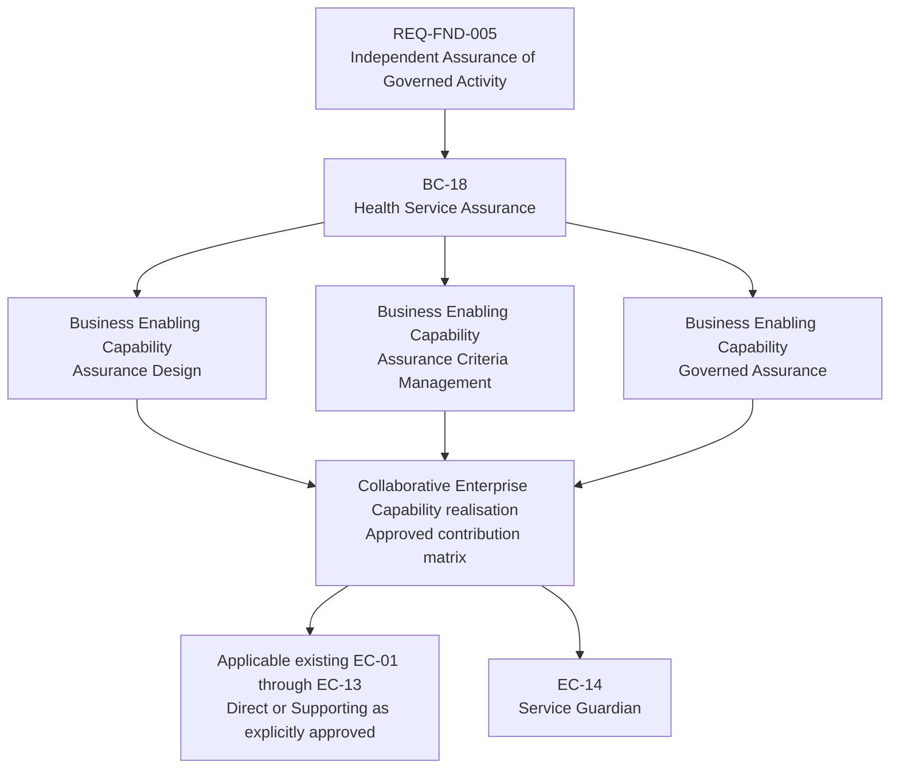

# Health Service Assurance — Approved Strategy Derivation

## Purpose and Architectural Authority

This view records the approved Health Service Assurance derivation in Domain02 Strategy. It connects the existing Motivation requirement and Business Capability to three approved Business Enabling Capabilities and their collaborative Enterprise Capability realisation. Canonical definitions remain in the linked capability catalogues.

[AX-17 — Architectural Authority and Explicit Uncertainty](../../governance/architectural-axioms.md#ax-17) governs truthful traceability: only the relationships explicitly approved here are established. Missing relationships remain unresolved. The requested Strategy reconciliation is approved architectural input; it does not complete later architecture domains.

The materially relevant axioms also include:

- [AX-14 — Semantic Distinctions Are Preserved](../../governance/architectural-axioms.md#ax-14): assurance is distinct from monitoring, evidence production, operational management, clinical adequacy, assessment and adjudication.
- [AX-06 — Information Authority Is Explicit](../../governance/architectural-axioms.md#ax-06), [AX-07 — Security Is Intrinsic to Managed Operations](../../governance/architectural-axioms.md#ax-07) and [AX-08 — Evidence Records Meaning, Not Machinery](../../governance/architectural-axioms.md#ax-08): trustworthy evidence and governed assurance preserve their existing authority, security and meaningful-evidence constraints without transferring source-information ownership.
- [AX-09 — Transient Operational State Is Ephemeral by Default](../../governance/architectural-axioms.md#ax-09): contextual evidence association does not automatically make all observations or operational diagnostics durable evidence.
- [AX-10 — Distribution, Load and Failure Are Normal Operating Conditions](../../governance/architectural-axioms.md#ax-10) and [AX-15 — Uncertainty Is Preserved Until Resolved](../../governance/architectural-axioms.md#ax-15): expected failure/recovery remains the subject activity's responsibility, and operational uncertainty remains distinct from insufficient assurance evidence.
- [AX-05 — Active State and Authoritative Durable State Are Distinct](../../governance/architectural-axioms.md#ax-05): temporal/version-specific evidence does not alter the approved state-responsibility separation or derive a persistence/active-state implementation.

## Motivation to Strategy Traceability

The final branches identify contributions to collaborative realisation, not ownership, execution order or component allocation. The matrix below distinguishes the contribution to each Business Enabling Capability; the aggregate diagram does not assert every existing EC contributes to each capability.

| Established relationship | Authoritative Strategy reference | Boundary |
| :--- | :--- | :--- |
| REQ-FND-005 → BC-18 | [Approved requirement](../../01-motivation/requirements-constraints/foundational-requirements.md#req-fnd-005-independent-assurance-of-governed-activity); [Health Service Assurance](../capabilities/business-capabilities.md#18-health-service-assurance) | Independent conclusion authority and explicit evidence insufficiency; no clinical-adequacy responsibility transfer. |
| BC-18 → Assurance Design | [Assurance Design](../capabilities/business-enabling-capabilities.md#assurance-design) | Defines how satisfaction is assured, not application design. |
| BC-18 → Assurance Criteria Management | [Assurance Criteria Management](../capabilities/business-enabling-capabilities.md#assurance-criteria-management) | Manages criteria without replacing governing requirements. |
| BC-18 → Governed Assurance | [Governed Assurance](../capabilities/business-enabling-capabilities.md#governed-assurance) | Independently evaluates and concludes without managing the subject. |
| Three Business Enabling Capabilities → collaborative EC realisation | [Contribution matrix](#collaborative-enterprise-capability-contribution-matrix); [Enterprise catalogue](../capabilities/enterprise-capabilities.md) | Direct does not mean sole realisation; no extra relationships implied. |
| EC-14 → assurance-specific contribution | [Service Guardian](../capabilities/enterprise-capabilities.md#ec-14-service-guardian) | Reusable assurance semantics, distinct from EC-12; component allocation remains unresolved. |

BC-18 refers to the existing Business Capability catalogue entry **18 Health Service Assurance**. This reference does not assign a new Capability Tier or structural Canonical ID. The three Business Enabling capability names identify the approved responsibilities without inventing CT1 / CT2 / CT3 ancestry or new Feature identifiers.

## Collaborative Enterprise Capability Contribution Matrix

This is the approved **first-pass contribution model**. Existing canonical EC names are preserved. **Direct** identifies a direct contribution, not sole realisation or ownership. **Supporting** identifies a supporting contribution. **No Material Role** records the approved absence of a material contribution in this model; it is not an invitation to invent a relationship.

| Enterprise Capability | Assurance Design | Assurance Criteria Management | Governed Assurance |
| :--- | :--- | :--- | :--- |
| [EC-01 Managed Entity & Relationship](../capabilities/enterprise-capabilities.md#ec-01-managed-entity--relationship) | Supporting | No Material Role | Supporting |
| [EC-02 Context Management](../capabilities/enterprise-capabilities.md#ec-02-context-management) | Supporting | Supporting | Direct |
| [EC-03 Managed State & Lifecycle](../capabilities/enterprise-capabilities.md#ec-03-managed-state--lifecycle) | Supporting | Direct | Direct |
| [EC-04 Information Management](../capabilities/enterprise-capabilities.md#ec-04-information-management) | Direct | Direct | Direct |
| [EC-05 Search & Discovery](../capabilities/enterprise-capabilities.md#ec-05-search--discovery) | Supporting | Supporting | Supporting |
| [EC-06 Policy & Control](../capabilities/enterprise-capabilities.md#ec-06-policy--control) | Direct | Direct | Supporting |
| [EC-07 Provenance & Traceability](../capabilities/enterprise-capabilities.md#ec-07-provenance--traceability) | Supporting | Supporting | Direct |
| [EC-08 Interoperability & Exchange](../capabilities/enterprise-capabilities.md#ec-08-interoperability--exchange) | No Material Role | Supporting | Supporting |
| [EC-09 Event & Subscription](../capabilities/enterprise-capabilities.md#ec-09-event--subscription) | Supporting | No Material Role | Direct |
| [EC-10 Activity & Execution](../capabilities/enterprise-capabilities.md#ec-10-activity--execution) | Supporting | No Material Role | Direct |
| [EC-11 Interaction & Experience](../capabilities/enterprise-capabilities.md#ec-11-interaction--experience) | Supporting | Supporting | Supporting |
| [EC-12 Operational Assurance](../capabilities/enterprise-capabilities.md#ec-12-operational-assurance) | Supporting | Supporting | Direct, limited to generic operational/processing assurance contribution |
| [EC-13 Semantic Governance & Conformance](../capabilities/enterprise-capabilities.md#ec-13-semantic-governance--conformance) | Supporting | Direct | Supporting |
| [EC-14 Service Guardian](../capabilities/enterprise-capabilities.md#ec-14-service-guardian) | Direct | Direct | Direct |

The three Business Enabling Capabilities are collaboratively realised. EC-14 contributes the assurance-specific semantics not truthfully represented by EC-01 through EC-13. Their contributions do not transfer source-information ownership, governing-requirement authority or subject-activity management to assurance. In particular, EC-10's direct contribution does not make Governed Assurance responsible for managing the subject activity, and it does not establish a relationship to an execution component.

This bounded, approved matrix is not an exhaustive Business Capability-to-Business Enabling or Feature-to-Enterprise mapping. It is consistent with the [existing representative-derivation convention](capability-tier-model.md#5-architectural-modelling-position-omission-of-exhaustive-n-times-m-matrices) and does not manufacture missing traceability.

## Preserved Semantic Boundaries

- **EC-12 / EC-14**: [EC-12's established operational responsibilities](../capabilities/enterprise-capabilities.md#ec-12-operational-assurance) remain intact. Its direct Governed Assurance contribution is limited to generic operational/processing assurance. [EC-14](../capabilities/enterprise-capabilities.md#ec-14-service-guardian) supplies assurance disposition, criteria applicability, evidentiary association, assessment, adjudication and independent findings/conclusions; EC-12 is not expanded to absorb them.
- **Clinical assurance**: [Health Service Assurance is distinct from Clinical Services Delivery Assurance](../capabilities/business-capabilities.md#clinical-services-delivery-assurance-boundary). Explicitly required assurance of facts or behaviour concerning clinical activity does not make Harmonia responsible for clinical judgement, professional practice or clinical adequacy of care. Capability 06 retains its established responsibility.
- **Evidence and time**: [Source-information ownership and contextual evidence association](../capabilities/business-enabling-capabilities.md#assurance-evidence-assembly-and-information-ownership) remain distinct. Evidence and criteria may each be temporal/version-specific without deriving storage, replication or persistence mechanisms.
- **Assurance and operations**: [Generic processing assurance](../capabilities/business-enabling-capabilities.md#generic-processing-assurance-and-system-operations) evaluates business behaviour, including expected failure/recovery; the subject activity manages its own behaviour. Operational Health ≠ Processing Assurance.
- **Assessment and conclusion**: [Assessment, adjudication and explicit insufficiency](../capabilities/business-enabling-capabilities.md#assessment-adjudication-and-explicit-insufficiency) preserve quantitative, qualitative, compound, temporal and confidence-bearing meaning. Insufficient evidence establishes neither satisfaction nor non-satisfaction.
- **Independence**: [Assurance independence](../capabilities/business-enabling-capabilities.md#assurance-independence) concerns control of progression and conclusion, not physical separation. Evidence dependency does not compromise assurance independence; control dependency does.

## Unresolved Relationships and Downstream Boundary

This approved derivation establishes only REQ-FND-005 → BC-18 → the three named Business Enabling Capabilities → the first-pass collaborative EC contribution model, including EC-14. The five-region/eighteen Business Capability model, BC-17 Health Service Governance, capabilities 06 and 14, the existing thirteen EC semantics and approved AX-05 reconciliation remain intact.

The following remain deliberately unresolved or unestablished:

- Relevance classification for BC-17/BC-18; BC-17 enabling derivation; relationships beyond the approved BC-18 derivation.
- Contextual-view placement, relevance classification, Capability Tier, complete ancestry, root status and structural Canonical IDs for the three assurance Business Enabling Capabilities; additional Feature decomposition.
- Courses of Action, Strategic Resources, Value Stream/stage relationships and additional capability contributions not explicitly approved here.
- Downstream Business Functions, Services, Processes, actors, roles, assurance Information Concepts, outcome taxonomies, criterion catalogues and applicability/confidence models beyond the approved Strategy semantics.
- Strategic logical component, application component, execution, persistence, protocol, deployment and implementation allocation for EC-14 and the three assurance Business Enabling Capabilities.

No relationship to Dokimasia, Ponos, Praxis, Pragma, Digital Twin, Mneme, Mnemosyne, Calliope, Iris, Pylai or another implementation construct is derived. Existing Dokimasia material is not reconciled or modified. Domain03 Business Architecture and Domain04 Information Architecture are unchanged. Existing or future suggestions cannot establish an allocation through lexical similarity, familiar implementation or the conceptual behavioural sequence of Service Guardian.

## Navigation

- [Domain02 Strategy](../README.md)
- [Capability Framework](../capabilities/index.md)
- [Business Capability Catalogue](../capabilities/business-capabilities.md)
- [Business Enabling Capability Catalogue and Assurance Principles](../capabilities/business-enabling-capabilities.md#health-service-assurance-approved-business-enabling-capabilities)
- [Enterprise Capability Catalogue](../capabilities/enterprise-capabilities.md)
- [Capability Derivation Progression](capability-tier-model.md)
- [Capability Maps Index](index.md)
