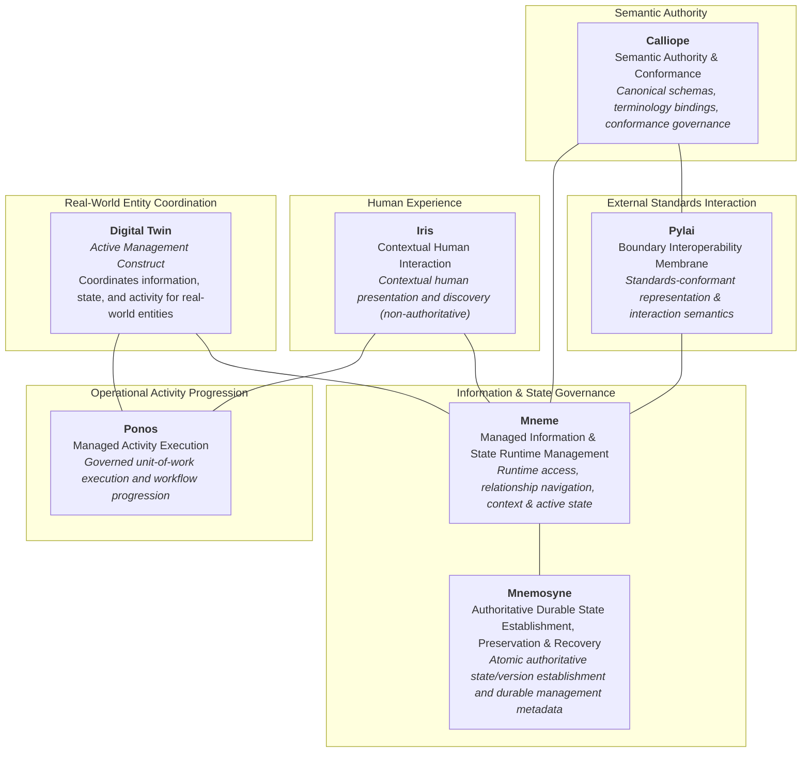

# Strategic Logical Component Responsibility Model

## Overview & Purpose

This document establishes Harmonia's **Strategic Logical Component Responsibility Model**. It defines the fundamental responsibility boundaries that emerge from the composition of Harmonia's Business Enabling Features and reusable Enterprise Capabilities (`EC-01` through `EC-13`).

The current catalogue also includes **EC-14 Service Guardian**. Its strategic logical and application component allocation remains unresolved under the [approved Health Service Assurance derivation](../capability-maps/health-service-assurance-derivation.md#unresolved-relationships-and-downstream-boundary). The existing EC-01 through EC-13 compositions are preserved; this model establishes six strategic logical components and the Digital Twin coordination construct.

The purpose of this model is strictly strategic:
- It explains **why** Harmonia's major logical responsibilities exist.
- It defines clear, enduring responsibility boundaries and anti-responsibilities.
- It prevents existing source code, framework selections, packaging choices, or deployment topologies from dictating architectural capability boundaries.
- It articulates the conceptual seams across which components collaborate.

---

## 1. The Four Strategic Boundary Guardrails

The logical component responsibility model is governed by four mandatory architectural guardrails:

### Guardrail G1: Reusable Capability $\neq$ Centralised Service
> **Reusable capability does not imply centralised service.**

Enterprise Capabilities represent bounded reusable responsibilities. Their realisation may require participation, consumption or enforcement across multiple architectural elements, but this does not imply shared semantic ownership or prohibit establishment of a responsibility centre.

**Distributed participation does not imply distributed responsibility. Cross-cutting concern does not imply cross-cutting responsibility.**

Context Management (`EC-02`), Policy & Control (`EC-06`), Provenance & Traceability (`EC-07`) and Operational Assurance (`EC-12`) illustrate distributed participation in bounded responsibilities without requiring monolithic runtime services.

Furthermore, affinity between an Enterprise Capability and a logical component does not imply exclusive ownership of all underlying machinery: for example, Pylai's affinity with the standards-facing aspects of `EC-08` does not imply that Pylai owns all routing, transport, or delivery mechanisms.

### Guardrail G2: Component Boundaries Follow Architectural Responsibility
> **Component boundaries follow architectural responsibility, not representation, technology, packaging, or storage products.**

Subsystems encapsulate distinct architectural purposes. The adoption of an external standard (such as FHIR), a software library (such as HAPI), a language (such as Java), or an infrastructure product (such as Infinispan, PostgreSQL, or Artemis) does not transfer architectural responsibility between components.

### Guardrail G3: Managed Information/State and Managed Activity Remain Distinct
> **Managed information/state and managed activity remain distinct architectural responsibilities.**

- **Mneme** manages active use of what is known and its current active representation.
- **Ponos** governs what is happening and how operational activity progresses.
- **Mnemosyne** establishes authoritative durable state and authoritative version progression.
- **Digital Twins** coordinate active information/state management and operational activity for real-world entities without collapsing those distinct responsibilities into each other.

Under [AX-05](../../../architectural-axioms.md#ax-05-----active-state-and-authoritative-durable-state-are-distinct), operational activity progression, active information/state management, and authoritative durable state establishment are distinct responsibilities. Digital Twins coordinate information/state and activity across the Mneme/Ponos seam; they do not assume Mnemosyne's durable-state authority.

### Guardrail G4: Execution, Standards Interaction and Transport Remain Distinct Responsibilities
> **Execution determines that an external interaction is required; standards-facing capability determines the required external representation and interaction semantics; transport and connectivity capabilities determine how that interaction is physically conveyed.**

These responsibilities must not be collapsed merely because a particular software library or packaging combines them together:
- **Ponos**: Determines *that* an external interaction is required to progress an activity.
- **Pylai**: Determines *what* the standards-conformant external interaction means and validates its conformance.
- **Downstream Transport / Connectivity**: Determines *how* the interaction is physically conveyed over network protocols.

Ponos must not acquire bespoke transport machinery or wire protocols merely to progress activity. Pylai must not become a generic transport layer merely because it governs the standards-facing contract.

---

## 2. The 6-Point Component Boundary Test

To validate each candidate logical component boundary against architectural requirements, Harmonia applies a formal 6-point evaluation:

1. **Responsibility**: Does the component have one coherent, well-defined architectural purpose?
2. **Cohesion**: Do the internal responsibilities naturally belong together and change for the same architectural reasons?
3. **Authority**: Is it unambiguous what information, state, or decisions the component is authoritative for?
4. **Dependency**: Can the component consume reusable Enterprise Capabilities without duplicating ownership?
5. **Exclusion**: Are its anti-responsibilities (what it explicitly does *not* own) clearly demarcated?
6. **Substitutability**: Would the responsibility boundary remain valid and intact if its underlying implementation technology were completely replaced?

---

## 3. Logical Component Profiles & Boundary Evaluations

### Component 1: Mneme (Managed Information & State Runtime Management)

#### Strategic Architectural Responsibility
> **Mneme governs and provides runtime management of Harmonia-managed information, relationships, context, and state.**

Mneme provides the application-facing access boundary for Harmonia-managed clinical, administrative, and operational entities. It provides distributed runtime access, active relationship navigation, entity context correlation, and active state governance.

#### Architectural Scope & Clarification
- Mneme governs what Harmonia currently knows about managed entities and their active relationships.
- **Architectural Clarification**: Mneme is **not** merely an "ephemeral cache" or a "transient state tier". Information and state managed through Mneme frequently represent enduring, durable business concepts. The distinction between Mneme and Mnemosyne is one of **architectural responsibility** (active runtime management vs. authoritative durable state establishment, preservation and recovery), not a crude division between "ephemeral versus durable data".

#### Anti-Responsibilities (What Mneme Does NOT Own)
- Does not establish authoritative durable state or authoritative version progression (owned by Mnemosyne).
- Does not own durable historical preservation or cold-start recovery mechanisms (owned by Mnemosyne).
- Does not own operational activity progression or task workflow execution (owned by Ponos).
- Does not govern external standards representation or external wire interaction semantics (owned by Pylai).
- Does not expose raw database tables or persistent storage structures to client applications.

#### 6-Point Boundary Test Evaluation
- **Responsibility**: PASS. Singular focus on runtime management and access of governed information and state.
- **Cohesion**: PASS. Information access, active relationships, context correlation, and active state naturally co-vary.
- **Authority**: PASS. Authoritative for runtime access contracts and active entity state presentation.
- **Dependency**: PASS. Consumes `EC-01`, `EC-02`, `EC-03`, `EC-04`, `EC-05`, `EC-06` without duplicating them.
- **Exclusion**: PASS. Clear anti-responsibilities regarding durable storage mechanics, workflow execution, and external protocols.
- **Substitutability**: PASS. Boundary survives replacing distributed cache fabrics or in-memory technologies.
- **Overall Result**: **PASS as a Strategic Logical Component.**

---

### Component 2: Mnemosyne (Durable Preservation & Recovery)

#### Strategic Architectural Responsibility
> **Mnemosyne establishes authoritative durable state and authoritative version progression and provides durable preservation and recovery of Harmonia-managed information and state.**

Mnemosyne atomically establishes authoritative state and authoritative version progression and persists the durable management metadata required to interpret that state. It is also responsible for the enduring retention, historical version preservation, immutability, and state recovery of Harmonia-managed information and lifecycle history.

#### Architectural Scope & Clarification
- Mnemosyne ensures that once information or state is committed, it is durably preserved against loss, system failure, or disaster, and can be reliably recovered.
- **Architectural Clarification**: Mnemosyne establishes durable truth; it does **not** own operational activity progression or workflow execution. Ponos progresses operational activity; Mneme manages active information/state use and may reject or coordinate a proposed state progression before persistence. Only Mnemosyne can establish a new authoritative durable state. Following authoritative commit, Mneme converges its active representation toward the authoritative state. Mneme active-state generation and Mnemosyne authoritative version remain distinct concurrency domains; neither substitutes for the other (`AX-05`).

#### Anti-Responsibilities (What Mnemosyne Does NOT Own)
- Does not govern application-facing runtime access or query presentation (owned by Mneme).
- Does not own workflow progression or operational task execution (owned by Ponos).
- Does not own active distributed state (owned by Mneme) or entity-centred Digital Twin coordination.
- Does not govern external standards interaction semantics (owned by Pylai).
- Does not expose its persistence implementation (e.g., JPA entities, SQL schemas) as an application-facing query path.

#### 6-Point Boundary Test Evaluation
- **Responsibility**: PASS. Singular focus on authoritative durable state establishment, preservation and recovery.
- **Cohesion**: PASS. Atomic authoritative persistence, authoritative version progression, version preservation, and recovery mechanics are tightly cohesive.
- **Authority**: PASS. Establishes authoritative durable state and authoritative versions, including the durable management metadata and recovery baseline.
- **Dependency**: PASS. Consumes `EC-03`, `EC-04`, and `EC-07` without duplicating them.
- **Exclusion**: PASS. Excludes application query APIs, workflow progression, and external protocols.
- **Substitutability**: PASS. Boundary survives replacing underlying relational, document, or object storage technologies.
- **Overall Result**: **PASS as a Strategic Logical Component.**

---

### Component 3: Ponos (Managed Activity Execution)

#### Strategic Architectural Responsibility
> **Ponos executes and progresses Harmonia-managed operational activity within governed context.**

Ponos is the execution engine responsible for progressing governed operational activities, units of work, and asynchronous clinical workflows through discrete, auditable lifecycle transitions.

#### Architectural Scope & Clarification
- Ponos coordinates discrete task units, evaluates workflow step progression, and ensures that operational activity advances in lockstep with governed entity state (`AX-16`).
- Ponos models and preserves explicit uncertainty (`AX-15`) during distributed execution.
- Ponos consumes **EC-12 Operational Assurance** to support dependable activity execution, progression, monitoring, failure handling and recovery. This does not confer responsibility or authority for independent Governed Assurance, assurance adjudication, or establishment of Assurance Findings or Conclusions. No EC-14 allocation to Ponos is thereby implied.
- Ponos may support the execution and activity-observation machinery used by management responsibilities; Business Architecture determines who performs Management Monitoring. This does not establish Ponos as its owner.

#### Anti-Responsibilities (What Ponos Does NOT Own)
- Does not establish authoritative durable information state or authoritative version progression (owned by Mnemosyne), including when activity execution causes information to change.
- Does not own transport adapters, network listeners, or wire protocol logic (governed by Guardrail G4).
- Does not govern durable preservation or storage management (owned by Mnemosyne).
- Does not own semantic definitions or canonical schemas (owned by Calliope).
- Does not govern external standards representation or interaction semantics (owned by Pylai).

#### 6-Point Boundary Test Evaluation
- **Responsibility**: PASS. Singular focus on operational activity execution and workflow progression.
- **Cohesion**: PASS. Unit-of-work tracking, state transitions, and asynchronous execution naturally belong together.
- **Authority**: PASS. Authoritative for operational task progression and execution lifecycle state.
- **Dependency**: PASS. Consumes `EC-02`, `EC-03`, `EC-09`, `EC-10`, `EC-12`.
- **Exclusion**: PASS. Explicitly excludes transport machinery, durable preservation, and external wire protocols.
- **Substitutability**: PASS. Boundary survives replacing task queuing fabrics, actor systems, or thread models.
- **Overall Result**: **PASS as a Strategic Logical Component.**

---

### Component 4: Pylai (Boundary Interoperability Membrane)

#### Strategic Architectural Responsibility
> **Pylai governs the standards-conformant representation and interaction semantics through which external participants access and exchange information with Harmonia.**

Pylai establishes Harmonia's sovereign boundary membrane (`AX-02`), governing the external-facing standards contracts through which external healthcare systems interact with the platform.

#### Architectural Scope & Clarification
- Pylai is responsible for the meaning and behaviour of the standards-facing contract (e.g., FHIR resource structures, profiles, search parameters, RESTful interactions, operations, Bundles, OperationOutcome, and conformance statements).
- It validates inbound payloads against external normative standards and constructs outbound standards-conformant representations in a fail-closed manner.
- **Architectural Clarification**: Pylai is **not**, at Strategy level, defined as owning transport machinery or network connectivity. It does not own TCP sockets, TLS handshakes, HTTP connection management, MLLP framing bytes, connection pools, network routing, or transport retries. While implementations may package standards-handling and transport listeners together, that packaging does not transfer architectural responsibility (Guardrails G2 and G4).

#### Anti-Responsibilities (What Pylai Does NOT Own)
- Does not progress internal business activities or workflows (owned by Ponos).
- Does not alter internal managed state destructively (owned by Mneme).
- Does not own internal canonical domain models (owned by Calliope).
- Does not own generic transport adapters, connection pooling, or physical message routing.

#### 6-Point Boundary Test Evaluation
- **Responsibility**: PASS. Singular focus on standards-conformant boundary representation and interaction semantics.
- **Cohesion**: PASS. Standards profiles, boundary validation, and interaction semantics change together with external standards.
- **Authority**: PASS. Authoritative for external standards conformance and boundary contract behaviour.
- **Dependency**: PASS. Consumes `EC-06`, `EC-07`, `EC-08` (standards-facing facets), and `EC-13`.
- **Exclusion**: PASS. Excludes internal workflow progression, internal state governance, and transport machinery.
- **Substitutability**: PASS. Boundary survives replacing web servers, serialization libraries, or API gateway software.
- **Overall Result**: **PASS as a Strategic Logical Component.**

---

### Component 5: Calliope (Semantic Authority & Conformance)

#### Strategic Architectural Responsibility
> **Calliope governs the semantic definitions, canonical data models, terminology bindings, and conformance rules by which Harmonia information has meaning.**

Calliope acts as the design-time and reference-time semantic authority for Harmonia. It establishes the canonical vocabulary, data structures, and transformation rules that ensure clinical meaning is preserved across the integration fabric (`AX-04`, `AX-08`).

#### Architectural Scope & Clarification
- Calliope defines canonical information models, manages terminology concept maps (e.g., SNOMED CT-AU and AMT bindings), and publishes conformance specifications.
- **Architectural Clarification**: Calliope does **not** need to synchronously mediate every runtime transaction. Canonical models and terminology rules may be compiled, distributed, and evaluated locally across participating components without creating runtime bottlenecks.

#### Anti-Responsibilities (What Calliope Does NOT Own)
- Does not synchronously mediate runtime transactions or integration message flows.
- Does not own durable clinical persistence (owned by Mnemosyne).
- Does not execute operational tasks or workflow logic (owned by Ponos).
- Does not manage external network endpoints or protocols (owned by Pylai / downstream transport).

#### 6-Point Boundary Test Evaluation
- **Responsibility**: PASS. Singular focus on semantic governance, canonical modeling, and terminology rules.
- **Cohesion**: PASS. Canonical schemas, terminology bindings, and semantic conformance rules naturally belong together.
- **Authority**: PASS. Authoritative for canonical information structures and semantic definitions.
- **Dependency**: PASS. Consumes `EC-01`, `EC-04`, `EC-13`.
- **Exclusion**: PASS. Excludes runtime transaction mediation, database storage, and workflow execution.
- **Substitutability**: PASS. Boundary survives replacing schema compilers, modeling tools, or terminology servers.
- **Overall Result**: **PASS as a Strategic Logical Component.**

---

### Component 6: Iris (Contextual Human Interaction)

#### Strategic Architectural Responsibility
> **Iris provides contextual human interaction with Harmonia-managed information and activity while remaining non-authoritative for both.**

Iris encapsulates presentation services, clinical discovery user interfaces, operational dashboards, and administrative workspaces.

#### Architectural Scope & Clarification
- Iris delivers role-tailored, context-sensitive human interaction with clinical records, provider directories, and integration workflows.
- It translates human intent into governed operational requests.
- **Architectural Clarification**: Iris provides contextual human interaction, including presentation, capture of user input, and initiation or continuation of governed activity. Iris does not acquire clinical, semantic, policy or durable-state authority merely by presenting information, capturing an assertion or initiating activity. Any authority associated with user input derives from the authorised actor, governed process, information source or other applicable architectural responsibility. Authoritative human assertions may enter Harmonia through Iris; their authority does not originate from Iris. Iris remains decoupled from backend databases and direct persistence layers (Invariant 3).

#### Anti-Responsibilities (What Iris Does NOT Own)
- Does not originate clinical, semantic, policy or durable-state authority through presentation or input capture. Governed validation and source/actor authority remain with their applicable architectural responsibilities.
- Does not access persistence stores or databases directly (violating Invariant 3).
- Does not execute autonomous backend workflows or task progression (owned by Ponos).
- Does not independently establish authoritative clinical or audit records; it may capture authorised assertions and submit them through governed activity and information-access interfaces.

#### 6-Point Boundary Test Evaluation
- **Responsibility**: PASS. Singular focus on human interaction, presentation, and user experience.
- **Cohesion**: PASS. User interface components, presentation models, and human navigation change together.
- **Authority**: PASS. Authoritative only for human presentation layout and client-side view state; strictly non-authoritative for business/clinical truth.
- **Dependency**: PASS. Consumes `EC-02` and `EC-11`.
- **Exclusion**: PASS. Excludes backend persistence, server-side workflow progression, and security enforcement.
- **Substitutability**: PASS. Boundary survives replacing UI frameworks (e.g., Vue, React) or presentation gateways.
- **Overall Result**: **PASS as a Strategic Logical Component.**

---

### Component 7: Digital Twin (Entity-Centred Operational Coordination Construct)

#### Strategic Definition
> **A Digital Twin is an active management construct associated with a real-world entity and responsible for coordinating the information and operational activity associated with that entity.**

#### Architectural Scope & Composite Context
- A Digital Twin is **not** a representation of an individual FHIR resource.
- A Twin is associated with a real-world healthcare entity whose governed context is established through a **composite of multiple related information resources**.
- The composite context may combine complementary dimensions such as:
  - Identity (e.g., National identifiers, MRNs, user credentials);
  - Role (e.g., practitioner roles, clinical specialties);
  - Organisation (e.g., employing health service organisation, department);
  - Healthcare Service (e.g., clinical service catalogue, clinics);
  - Location (e.g., physical ward, room, bed);
  - Endpoint (e.g., secure messaging endpoint, notification channel);
  - Relationships (e.g., care team memberships, assigned patients);
  - Relevant governed state (e.g., operational status, active availability).
- The composition is determined strictly by the **operational meaning** of the Twin archetype, not by a fixed FHIR resource cardinality. There is no rule requiring exactly three resources; context is composed according to genuine operational requirements.

#### Twin Type $\neq$ FHIR Resource Type
Twin type is determined by the operational identity of the real-world entity, not by the information representation used to describe it:
- **Ward Twin $\neq$ Location**: A Ward Twin coordinates clinical activity and beds across a care facility, drawing context from `Location`, `HealthcareService`, and `Organization`.
- **Practitioner Twin $\neq$ Practitioner**: A Practitioner Twin coordinates active clinical duties, combining `Practitioner`, `PractitionerRole`, and `Endpoint`.
- **Patient Twin $\neq$ Patient**: A Patient Twin coordinates active patient episodes and multi-destination notifications, drawing context from `Patient`, `Encounter`, and `Consent`.
- **Bed Twin $\neq$ Location / Bed Record**: A Bed Twin coordinates physical occupancy, availability, and admission state.
- **Service Provider Organisation Twin $\neq$ Organization**: Coordinates organizational routing and directory federation for nursing homes, clinics, or hospitals.
- **Care Team Twin $\neq$ CareTeam**: Coordinates multi-disciplinary operational tasks across participating clinicians.

#### The Candidate-Twin Test
To determine whether an entity warrants Digital Twin coordination, Harmonia applies a formal strategic test:
> **The Candidate-Twin Test:**  
> *"A Harmonia-managed entity is a candidate for Digital Twin coordination where the entity is operationally significant in its own right and Harmonia must coordinate evolving governed state and operational activity associated with that entity."*

**Complementary Rule: Representation alone does not justify a Digital Twin.**  
An entity may be represented and durably preserved by Harmonia without requiring active Twin coordination. A Twin becomes operationally active only when entity-centred coordination of evolving state and activity is genuinely required.

<a id="entity-specific-operational-coordination"></a>

#### Entity-Specific Operational Coordination

The 2026-10-09 human adjudication establishes the following rule within the existing Digital Twin construct: **where operational activity becomes associated with a specific managed real-world entity, execution SHOULD be coordinated through that entity's Digital Twin unless an explicit architectural reason requires non-Twin execution.** Any exception requires an explicit architectural reason; it is not inferred from implementation convenience. This applies the entity-centred meaning above and AX-16 without allocating a new Twin archetype, Business Actor or execution mechanism.

Population/cohort identification may occur before individual patient activity is created. Once operational activity concerns a specific managed patient, the Patient Twin is its natural coordination context, with the applicable configured workflow/Praxis. This does not require population activity or every search/query to execute through a Twin, transfer originating clinical-information authority to the Twin, or turn a Patient Twin into an EMR.

Clinical-activity/workflow wording in this view concerns coordination around work governed by accountable clinical actors and external/business clinical work-management mechanisms. Neither entity subject association nor Twin coordination confers clinical-work determination, clinical handover management, clinical allocation authority, clinical worklist ownership or clinical decision authority. The [Business clinical-work boundary](../../03-business-architecture/metamodel/business-architecture-metamodel.md#37-clinical-work-integration-boundary) remains controlling. The construct coordinates information and operational consequences; existing execution, active-state and durable-state responsibilities remain distinct.

#### Recognised Digital Twin Archetypes (Historical Reference)
Based on operational healthcare integration models, Harmonia recognises the following archetypes as illustrative examples:
1. **Service Provider Organisation Twin**: Healthcare provider organisations (e.g., nursing home, rehabilitation facility, primary care practice).
2. **Care Team Twin**: Multi-disciplinary team delivering coordinated care.
3. **Practitioner Twin**: Healthcare practitioners managing clinical workflows.
4. **Wardsperson Twin**: Specialisation of Practitioner Twin coordinating logistical and patient transport tasks.
5. **Patient Twin**: Individual receiving active care or undergoing clinical event distribution.
6. **Ward Twin**: Inpatient ward fulfilling ward- and facility-level operational roles.
7. **Bed Twin**: Specific physical or virtual care location tracking operational occupancy.

#### Boundary Test Evaluation: Construct vs. Component
- **Responsibility**: PASS. Singular focus on coordinating information, state, and activity for a specific real-world entity.
- **Cohesion**: PASS. The entity's state, context, and operational activity naturally belong together.
- **Authority**: PASS. Authoritative for coordinating that entity's operational lifecycle.
- **Dependency**: PASS. Bridges `EC-01`, `EC-02`, `EC-03`, and `EC-10`.
- **Exclusion**: PASS. Does not own generic execution engines or persistence mechanisms.
- **Substitutability**: PASS as a concept, but fails component independence: it relies entirely on Mneme for information/state and Ponos for execution.
- **Evaluation Finding**:  
  - **PASS as an Architectural Construct**  
  - **FAIL as an Independent Platform Component**

#### Negative Constraints (What a Digital Twin Must NEVER Be)
To prevent architectural drift, a Digital Twin must NEVER be modeled or implemented as:
- A FHIR resource;
- An unmanaged persistent actor or permanent background thread;
- An independent secondary workflow engine;
- A dedicated database record or table;
- A permanent in-memory resident object;
- A duplicate security or search service;
- A transport or connectivity adapter.

---

## 4. Summary of Component Boundary Adjudications

| Candidate Boundary | Primary Strategic Responsibility | Primary Anti-Responsibilities | Boundary Test Result |
| :--- | :--- | :--- | :---: |
| **Mneme** | Governs and provides runtime management of Harmonia-managed information, relationships, context, and state. | Does not establish authoritative durable state/versions or provide durable preservation/recovery; does not own operational activity progression; does not govern external standards representation. | **PASS** (Logical Component) |
| **Mnemosyne** | Establishes authoritative durable state/versions and provides durable preservation and recovery of Harmonia-managed information and state. | Does not govern application-facing runtime management; does not own operational activity progression; does not govern external standards representation. | **PASS** (Logical Component) |
| **Ponos** | Executes and progresses Harmonia-managed operational activity within governed context. | Does not own external transport/connectivity machinery; does not govern durable preservation; does not own semantic definitions. | **PASS** (Logical Component) |
| **Pylai** | Governs standards-conformant external representation and interaction semantics across the boundary. | Does not progress internal operational activities; does not alter internal managed state destructively; does not own transport/connectivity machinery. | **PASS** (Logical Component) |
| **Calliope** | Governs semantic definitions, canonical data models, terminology bindings, and conformance rules. | Does not synchronously mediate runtime transactions; does not own durable clinical persistence; does not execute operational tasks. | **PASS** (Logical Component) |
| **Iris** | Provides contextual human interaction with Harmonia-managed information and activity while remaining non-authoritative. | Does not own clinical identity or authority; does not access databases directly; does not execute autonomous workflows. | **PASS** (Logical Component) |
| **Digital Twin** | Active management construct coordinating information, state, and activity for a specific real-world entity. | Is NOT an independent deployable platform component; is not a persistent database record; is not a general workflow engine; is not a single FHIR resource. | **PASS as Construct**<br/>**FAIL as Component** |

---

## 5. Critical Responsibility Seams

Harmonia defines six critical cross-component seams where architectural responsibilities meet. Validating these seams ensures that components collaborate cleanly without blurred boundaries or circular dependencies.

```text
               ┌──────────┐
               │   Iris   │
               └────┬─────┘
                    │ Contextual Human Interaction (Non-authoritative)
         ┌──────────┴──────────┐
         │                     │
         ▼                     ▼
   ┌───────────┐         ┌───────────┐
   │   Mneme   │◄───────►│   Ponos   │
   └─────┬─────┘         └─────┬─────┘
         │ Active /            │ Execution /
         │ Authoritative State │ Standards Interaction
         ▼                     ▼
   ┌───────────┐         ┌───────────┐
   │ Mnemosyne │         │   Pylai   │
   └───────────┘         └─────┬─────┘
                               │ Standards Boundary / External World
                               ▼
```

### Seam 1: Mneme ↔ Mnemosyne
- **Architectural Boundary**: Separation of active runtime information/state management from authoritative durable state establishment, preservation and recovery.
- **Responsibility Split**:
  - **Mneme**: Governs and provides runtime management of Harmonia-managed information, active relationships, context, and state.
  - **Mnemosyne**: Atomically establishes authoritative durable state and authoritative version progression, persists the durable management metadata required to interpret that state, and provides durable preservation and recovery.
- **Seam Rule**: The distinction is one of **architectural responsibility**, not "ephemeral vs durable data". State managed through Mneme may represent durable business concepts. Ponos progresses operational activity; Mneme manages active use and may reject or coordinate a proposed state progression before persistence; Mnemosyne establishes durable truth. Following authoritative commit, Mneme converges its active representation toward authoritative state. Active-state generation and authoritative version remain distinct concurrency domains. Application tiers must never bypass Mneme to access Mnemosyne persistence stores directly.

### Seam 2: Mneme ↔ Ponos
- **Architectural Boundary**: Separation of managed information/state from operational activity execution (Guardrail G3).
- **Responsibility Split**:
  - **Mneme**: Manages active use of what is known and its current active representation.
  - **Ponos**: Governs what is happening and executes operational activity within governed context.
- **Seam Rule**: Ponos never updates clinical entity state arbitrarily; it requests state transitions through governed contracts. Conversely, Mneme never progresses workflow activities or manages task queues; it reflects state updates resulting from governed activity progression (`AX-16`).

### Seam 3: Ponos ↔ Digital Twin
- **Architectural Boundary**: Generic activity execution engine vs. entity-centred coordination semantics.
- **Responsibility Split**:
  - **Ponos**: Provides the generic execution engine, task scheduler, unit-of-work progression, and failure handling.
  - **Digital Twin**: Coordinates information, state, and activity for a *specific real-world entity* across the Mneme/Ponos seam.
- **Seam Rule**: **Ponos executes; the Digital Twin coordinates for an entity.** The Digital Twin is not a second workflow engine; it delegates execution mechanics to Ponos and retrieves/updates entity state via Mneme.

### Seam 4: Pylai ↔ Mneme
- **Architectural Boundary**: External standards-conformant exchange vs. internal managed meaning and state.
- **Responsibility Split**:
  - **Pylai**: Governs standards-conformant external representation and interaction semantics.
  - **Mneme**: Governs Harmonia-managed information, relationships, context, and state.
- **Seam Rule**: This seam represents the transition between **external standards meaning** and **Harmonia-governed meaning/state**. It is not a statement about network packets or wire bytes. Pylai validates inbound payloads against external profiles and translates them into internal requests; Mneme provides governed information for Pylai to project outward without destructive modification (`AX-02`, `AX-13`).

### Seam 5: Calliope ↔ Runtime Components
- **Architectural Boundary**: Semantic design authority vs. operational runtime execution.
- **Responsibility Split**:
  - **Calliope**: Governs canonical definitions, data models, terminology concept bindings, and conformance rules.
  - **Runtime Components (Pylai, Mneme, Ponos)**: Consume published semantic definitions and execute runtime validation.
- **Seam Rule**: Calliope is the design authority; it does not synchronously mediate runtime transactions. Schemas and terminology mappings are published and distributed for local evaluation across components.

### Seam 6: Iris ↔ Mneme / Ponos
- **Architectural Boundary**: Decoupled presentation vs. governed application-facing information access and operational execution.
- **Responsibility Split**:
  - **Iris**: Provides contextual human interaction, presentation, input capture and initiation or continuation of governed activity. An authorised actor may submit an authoritative assertion without Iris becoming the source of that authority.
  - **Mneme & Ponos**: Provide governed application-facing information/state access (Mneme) and operational activity execution (Ponos). Authoritative durable state and authoritative version establishment remain with Mnemosyne.
- **Seam Rule**: Iris never writes directly to databases or caches. It queries information through defined application-facing interfaces and initiates workflows via governed execution requests.

---

## 6. Enterprise Capability Composition

The logical component responsibilities emerge naturally from the composition of reusable Enterprise Capabilities (`EC-01` through `EC-13`). The following derivations illustrate how capability clusters form cohesive logical responsibilities:

```text
[EC-01 Managed Entity & Relationship]
+ [EC-02 Context Management]
+ [EC-03 Managed State & Lifecycle]
+ [EC-04 Information Management]
+ [EC-05 Search & Discovery]
+ [EC-06 Policy & Control]
    └──► MNEME (Managed Information & State Runtime Management)

[EC-03 Managed State & Lifecycle]
+ [EC-04 Information Management]
+ [EC-07 Provenance & Traceability]
    └──► MNEMOSYNE (Authoritative Durable State Establishment, Preservation & Recovery)

[EC-02 Context Management]
+ [EC-03 Managed State & Lifecycle]
+ [EC-09 Event & Subscription]
+ [EC-10 Activity & Execution]
+ [EC-12 Operational Assurance]
    └──► PONOS (Managed Activity Execution)

[EC-06 Policy & Control]
+ [EC-07 Provenance & Traceability]
+ [EC-08 Interoperability & Exchange (standards-facing facets)]
+ [EC-13 Semantic Governance & Conformance]
    └──► PYLAI (Boundary Interoperability Membrane)

[EC-01 Managed Entity & Relationship]
+ [EC-04 Information Management]
+ [EC-13 Semantic Governance & Conformance]
    └──► CALLIOPE (Semantic Authority & Conformance)

[EC-02 Context Management]
+ [EC-11 Interaction & Experience]
    └──► IRIS (Contextual Human Interaction)

[EC-01 Managed Entity & Relationship]
+ [EC-02 Context Management]
+ [EC-03 Managed State & Lifecycle]
+ [EC-10 Activity & Execution]
    └──► DIGITAL TWIN (Entity-Centred Coordination Construct across Mneme/Ponos Seam)
```

---

## 7. Canonical Strategic Responsibility View

The Strategic Responsibility View depicts Harmonia's architectural responsibilities and conceptual seams. 

**This is a Conceptual Responsibility View.**  
It is **not** a runtime call graph, sequence diagram, integration topology, transport route, or deployment layout. Lines represent architectural responsibility seams and governance relationships, not runtime invocation directions.

### ASCII Conceptual Responsibility Diagram

```text
===================================================================================
                                    HARMONIA
===================================================================================

       [ EXTERNAL STANDARDS INTERACTION ]            [ HUMAN EXPERIENCE ]
             ┌─────────────────────┐               ┌─────────────────────┐
             │        PYLAI        │               │        IRIS         │
             │ Standards-Conformant│               │  Contextual Human   │
             │Interaction Semantics│               │ Interaction (Non-   │
             └──────────┬──────────┘               │    Authoritative)   │
                        │                          └──────────┬──────────┘
                        │ External /                          │ Presentation /
                        │ Internal Boundary                   │ Interaction Seam
                        ▼                                     ▼
 ───────────────────────┼─────────────────────────────────────┼────────────────────
                        │                                     │
       [ SEMANTIC       │      [ INFORMATION & STATE ]        │     [ ACTIVITY
       AUTHORITY ]      │            ┌───────────┐            │    PROGRESSION ]
     ┌─────────────┐    │            │   MNEME   │◄───────────┘    ┌───────────┐
     │  CALLIOPE   │    │            │  Managed  │                 │   PONOS   │
     │  Canonical  │◄───┼───────────►│Information│◄───────────────►│  Managed  │
     │ Definitions │    │            │  & State  │                 │ Activity  │
     │& Terminology│    │            └─────┬─────┘                 │ Execution │
     └─────────────┘    │                  │                       └─────┬─────┘
                        │                  │ Active /                    │
                        │                  │ Authoritative State Seam    │
                        │                  ▼                             │
                        │            ┌────────────┐                      │
                        │            │ MNEMOSYNE  │                      │
                        │            │ Durable    │                      │
                        │            │ State &    │                      │
                        │            │ Versions   │                      │
                        │            │Preservation│                      │
                        │            │ & Recovery │                      │
                        │            └────────────┘                      │
                        │                                                │
                        │        [ ENTITY COORDINATION CONSTRUCT ]       │
                        │             ┌─────────────────────┐            │
                        │             │    DIGITAL TWIN     │            │
                        │             │Active Entity-Centred│            │
                        └────────────►│ Coordination Across ├────────────┘
                                      │  Mneme/Ponos Seam   │
                                      └─────────────────────┘

===================================================================================
```

### Mermaid Responsibility Diagram



---

## 8. Summary

The Strategic Logical Component Responsibility Model articulates a clean, robust architecture for Harmonia:
1. **Pylai** governs the external standards-facing boundary membrane.
2. **Calliope** establishes authoritative semantic definitions without runtime transaction bottlenecks.
3. **Mneme** governs runtime management of information, context, and state.
4. **Mnemosyne** establishes authoritative durable state and authoritative version progression and provides durable preservation and recovery without exposing direct persistence paths.
5. **Ponos** progresses operational units of work and workflows without acquiring transport machinery.
6. **Iris** delivers non-authoritative contextual presentation.
7. **The Digital Twin** acts as an active management construct coordinating entity-centred state and activity across the Mneme/Ponos seam.

This model provides unambiguous architectural boundaries that guide downstream Business (Domain 03), Information (Domain 04), Application (Domain 05), Integration (Domain 06), and Technology (Domain 07) architectures.
