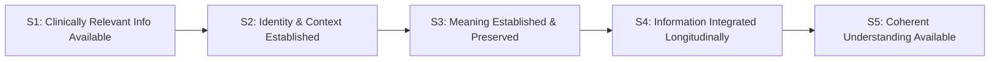
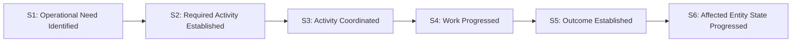
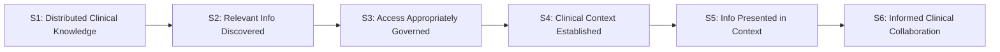
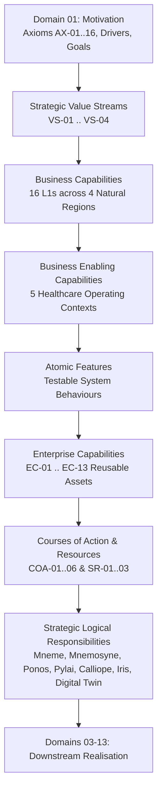

# Strategic Value Streams

## Overview & Purpose

This document establishes the **Strategic Value Stream Model** for Harmonia R1.x/R2.x. In accordance with ArchiMate 3.2 strategy modelling semantics, a **Value Stream** represents an end-to-end sequence of value-adding stages that achieve an overall result for healthcare stakeholders—including patients, clinicians, multidisciplinary care teams, health service executives, and partner organisations.

Strategic Value Streams define **what value Harmonia creates** across enterprise healthcare boundaries. They stand between foundational motivation (**Domain 01**) and the capabilities, courses of action, and logical components that realise that value (**Domain 02** through **Domains 03–13**).

---

## 1. Value Stream Principles & Modelling Semantics

### 1.1 Stakeholder Value Transformation vs. Software Runtime Mechanics

A strategic value stream is not a technical workflow, a message integration pipeline, or a sequence of software component interactions. Value streams model the progressive transformation of healthcare and information state from a stakeholder perspective.

Every stage in a Harmonia Strategic Value Stream must answer:
> *"What is more valuable to the healthcare stakeholder after this stage than before it?"*

If the answer to that question is merely an internal technical operation—such as:
- "the message was transported across a broker queue",
- "the cache was updated",
- "an Ergon executed",
- "a database record was inserted", or
- "a FHIR JSON resource was serialized",

then the stage is defined at the wrong abstraction level. Technical mechanics, component invocations, and database transactions belong to downstream Application, Integration, and Technology Architectures (Domains 04–07).

### 1.2 Boundary Invariant: Decoupling Value Streams from Component Allocations

In alignment with Strategic Guardrails **G1** (*Reusable Capability $\neq$ Centralised Service*) and **G2** (*Component Boundaries Follow Architectural Responsibility*), value stream stages are **never** mapped directly or exclusively to individual logical components (e.g., Stage 1 = Pylai, Stage 2 = Mneme, Stage 3 = Ponos). 

Such mappings confuse stakeholder value with system execution topologies. Value streams are enabled by Business Capabilities and Enterprise Capabilities; those capabilities are in turn collaboratively realised by logical components (Mneme, Mnemosyne, Ponos, Pylai, Calliope, Iris, and the Digital Twin construct) according to defined architectural seams.

---

## 2. The Four Normative R1.x/R2.x Strategic Value Streams

Harmonia R1.x/R2.x defines exactly four principal Strategic Value Streams:

| Value Stream ID | Strategic Value Stream Name | Primary Value Transformation |
| :--- | :--- | :--- |
| **VS-01** | Multi-Source Clinical Information $\to$ Coherent Clinical Picture | Transforms fragmented clinical data from heterogeneous origins into a coherent, longitudinal, patient-centred clinical picture. |
| **VS-02** | Unqualified Information $\to$ Governed, Consumable Information | Transforms information with incomplete or unverified structure, meaning, or authority into governed information that can be safely published and consumed. |
| **VS-03** | Operational Need $\to$ Coordinated Activity $\to$ Resolved Outcome | Transforms an operational healthcare need into governed, coordinated activity aligned with entity state. |
| **VS-04** | Distributed Clinical Knowledge $\to$ Informed Clinical Collaboration | Transforms distributed clinical knowledge into contextually useful information supporting informed multidisciplinary care collaboration. |

---

### VS-01: Multi-Source Clinical Information → Coherent Clinical Picture

#### Strategic Purpose & Value Focus

Modern healthcare delivery is chronically fragmented across acute facilities, primary care practices, diagnostic laboratories, imaging centres, and community services. Clinical information arrives across disjointed standards (HL7 v2, CDA, FHIR), disparate identifier namespaces, and isolated episodes of care.

The strategic value created by **VS-01** is **not** merely the technical transit of electronic messages between systems. The authentic clinical and enterprise value is that **clinically relevant information from heterogeneous sources is unified into a coherent, longitudinal, patient-centred clinical picture**, enabling clinicians to make timely, well-informed, and safer care decisions.

#### Value Transformation Stages

1. **S1 — Clinically Relevant Information Available**:
   - *Stakeholder State*: Clinical observations, pathology reports, diagnostic imaging results, medication orders, discharge summaries, or encounter notes occur across distributed care settings and become accessible for integration.
   - *Value Generated*: Clinical events are no longer trapped within isolated source silos; they enter the integration sphere where their clinical significance can be recognized.
2. **S2 — Identity & Clinical Context Established**:
   - *Stakeholder State*: Subject-of-care identity is established to the level required for safe association of the information, preserving source identifiers, provenance, confidence, and ambiguity where applicable; relevant encounter, episode, service, and care-delivery context is associated.
   - *Value Generated*: Clinical facts are safely bound to the correct individual and operational care context without masking identity ambiguity or making premature, unsafe identity conflations.
3. **S3 — Meaning Established & Preserved**:
   - *Stakeholder State*: Clinical concepts, classifications, and terminologies are mapped to canonical standards (e.g., SNOMED CT-AU, AMT) while strictly preserving original source clinical intent, qualifiers, and provenance.
   - *Value Generated*: Clinical data is semantically unambiguous across organisational boundaries while ensuring that the originating practitioner's original meaning and expression remain unaltered.
4. **S4 — Information Integrated Longitudinally**:
   - *Stakeholder State*: Disparate episodic facts, temporal observations, diagnostic series, and encounter histories are synthesized into a cumulative, longitudinal patient-centred record.
   - *Value Generated*: Clinical interactions are connected across time and specialty, moving beyond episodic snapshots to reveal patient trajectories, trends, and clinical history.
5. **S5 — Coherent Patient-Centred Understanding Available**:
   - *Stakeholder State*: The longitudinal clinical picture is made accessible in a contextual, consumable representation, structured for clinical review, clinical decision support, or standards-compliant query.
   - *Value Generated*: Treating clinicians and multidisciplinary care teams gain holistic, trusted situational awareness, reducing diagnostic errors, preventing duplicate testing, and improving patient outcomes.

#### Clinical Authority Boundary Guardrail

Harmonia provides **governed, vendor-neutral longitudinal clinical representation and preservation**. Harmonia does **not** claim originating clinical authority for source clinical facts. The originating EMR, laboratory information system, or practitioner retains source clinical authority; Harmonia is authoritative for its governed longitudinal aggregation, contextual relationships, and verifiable provenance trail.

#### Representative Strategic Traceability

- **Motivational Axioms**: `AX-01` (Patient-Centricity), `AX-02` (Open Standards), `AX-03` (Canonical Representation), `AX-04` (Semantic Preservation), `AX-06` (Provenance & Attribution), `AX-08` (Auditability), `AX-13` (Interoperability Membrane), `AX-14` (Jurisdictional Alignment).
- **Strategic Drivers & Goals**: `DRV-01` (Fragmented Care Delivery), `DRV-02` (Semantic Heterogeneity), `DRV-04` (Clinical Safety); `GOAL-01` (Unified Longitudinal View), `GOAL-02` (Semantic Interoperability), `GOAL-04` (Patient Safety).
- **Business Capabilities**: `BC-01` (Patient Identification & Demographics), `BC-02` (Clinical Document Ingress & Processing), `BC-03` (Longitudinal Record Management), `BC-04` (Terminology & Semantic Harmonisation), `BC-08` (Clinical Query & Retrieval), `BC-12` (Diagnostic & Pathology Integration).
- **Business Enabling Contexts**: View 1 (Ingress & Processing), View 2 (Information Store & Query), View 4 (Cross-Enterprise Interoperability).
- **Enterprise Capabilities**: `EC-01` (Identifier Resolution), `EC-02` (Context Management), `EC-03` (Semantic Normalisation), `EC-04` (Longitudinal Record Management), `EC-07` (Provenance & Traceability), `EC-08` (Standards-Based Interoperability), `EC-13` (Clinical Terminology Services).
- **Strategic Courses of Action**: `COA-01` (Boundary Membrane Sovereignty), `COA-02` (Distinct Management and Durable Preservation), `COA-03` (Meaning-Centric Provenance and Traceability).

---

### VS-02: Unqualified Information → Governed, Consumable Information

#### Strategic Purpose & Value Focus

Information arriving at the healthcare enterprise boundary is frequently incomplete, syntactically inconsistent, ambiguous in authority, or lacking explicit privacy controls. Consuming or publishing unverified information risks clinical misinterpretation, privacy violations, and regulatory breach.

The strategic value created by **VS-02** is the progressive **qualification, governance, policy attachment, and durable integrity assurance of information**, transforming raw external data into trusted, policy-governed assets that can be safely published across enterprise boundaries.

#### Value Transformation Stages

1. **S1 — Unqualified Information**:
   - *Stakeholder State*: Raw, unvalidated data streams, documents, or transactions arrive at the enterprise membrane with unverified structural conformance, incomplete provenance, and unverified authority.
   - *Value Generated*: Ingress boundaries accept external input safely without allowing malformed or unauthorized data to compromise internal environments.
2. **S2 — Qualified / Structured Information**:
   - *Stakeholder State*: Data structures are validated against canonical schemas, syntactically parsed, and reconciled into well-defined, verifiable information models.
   - *Value Generated*: Syntactic and structural ambiguity is eliminated; information adheres to predictable, conformant architectural structures.
3. **S3 — Governed / Controlled Information**:
   - *Stakeholder State*: Information is evaluated against security policies, organizational authority boundaries, consent directives, and confidentiality classifications under default-deny governance (`Themis`).
   - *Value Generated*: Information carries explicit, enforceable access policies and privacy guardrails, ensuring that sensitive healthcare data cannot be disclosed without legitimate authority.
4. **S4 — Durably Available Information**:
   - *Stakeholder State*: Information is preserved with verifiable integrity, non-destructive versioning, and comprehensive provenance, remaining resiliently queryable and recoverable.
   - *Value Generated*: Stakeholders are assured that information is protected against unauthorised alteration or loss, establishing an enduring, verifiable and auditable history of care information.
5. **S5 — Published / Consumable Information**:
   - *Stakeholder State*: Governed information is projected into standards-compliant external representations (such as FHIR R5 Core and Australian profiles) across explicit egress boundaries.
   - *Value Generated*: External consumers and presentation layers receive trusted, standards-conformant information tailored to their authorised scope without exposing internal platform mechanics.

#### Enabling Behavioural Pattern (Subordinate to Value Stream)

The progression through VS-02 is supported internally by an established architectural behavioural pattern:

$$\text{Aggregation} \longrightarrow \text{Processing} \longrightarrow \text{Persistence} \longrightarrow \text{Publishing}$$

**Crucial Distinction**: This behavioural pattern describes the internal activity contributing to the transformation. It must **not** be substituted for the value stream stage names. The value stream expresses the *evolving state and value of the information*; the behavioural pattern describes the underlying operational mechanics that support it.

#### Representative Strategic Traceability

- **Motivational Axioms**: `AX-02` (Open Standards), `AX-03` (Canonical Representation), `AX-05` (State Separation), `AX-07` (Default-Deny Security), `AX-09` (Non-Destructive Evolution), `AX-11` (Component Responsibility), `AX-13` (Interoperability Membrane), `AX-14` (Jurisdictional Alignment).
- **Strategic Drivers & Goals**: `DRV-02` (Semantic Heterogeneity), `DRV-03` (Regulatory Compliance); `GOAL-02` (Semantic Interoperability), `GOAL-03` (Security & Privacy Governance), `GOAL-05` (Information Longevity).
- **Business Capabilities**: `BC-02` (Clinical Document Ingress & Processing), `BC-03` (Longitudinal Record Management), `BC-06` (Security & Access Control), `BC-07` (Audit & Compliance), `BC-08` (Clinical Query & Retrieval), `BC-11` (Integration Membrane Governance), `BC-12` (Diagnostic & Pathology Integration).
- **Business Enabling Contexts**: View 1 (Ingress & Processing), View 2 (Information Store & Query), View 3 (Security & Audit), View 4 (Cross-Enterprise Interoperability).
- **Enterprise Capabilities**: `EC-01` (Identifier Resolution), `EC-02` (Context Management), `EC-03` (Semantic Normalisation), `EC-04` (Longitudinal Record Management), `EC-06` (Policy & Control), `EC-07` (Provenance & Traceability), `EC-08` (Standards-Based Interoperability), `EC-13` (Clinical Terminology Services).
- **Strategic Courses of Action**: `COA-01` (Boundary Membrane Sovereignty), `COA-02` (Distinct Management and Durable Preservation), `COA-03` (Meaning-Centric Provenance and Traceability), `COA-06` (Collaborative Cross-Cutting Capability Realisation).

---

### VS-03: Operational Need → Coordinated Activity → Resolved Outcome

#### Strategic Purpose & Value Focus

Healthcare delivery involves dynamic, distributed operational coordination—from processing an urgent laboratory order, to coordinating an inpatient bed transfer, managing clinical task escalation, or fulfilling an outpatient referral. When operational activity is disconnected from the current state of affected patients, beds, and practitioners, clinical delays and administrative failures occur.

The strategic value created by **VS-03** is the **governed, coordinated progression of operational activity together with the corresponding state of affected real-world healthcare entities** (`AX-16`). It bridges operational demand and clinical execution without premature coupling to software execution threads or queueing systems.

#### Value Transformation Stages

1. **S1 — Operational Need Identified**:
   - *Stakeholder State*: A healthcare operational trigger occurs (e.g., patient admission, clinical order placed, diagnostic test requested, bed turnover required, specialist referral initiated).
   - *Value Generated*: Healthcare demands are captured systematically rather than relying on informal or uncoordinated communication.
2. **S2 — Required Activity Established**:
   - *Stakeholder State*: The activity required to address the operational need is established together with its relevant context, expected outcome, and completion conditions.
   - *Value Generated*: Vague operational requirements are translated into clear, governed, and accountable objectives with explicit success criteria.
3. **S3 — Activity Coordinated**:
   - *Stakeholder State*: Required activity is coordinated with the appropriate people, services, resources, and affected real-world entities.
   - *Value Generated*: Work is matched to capable, authorized actors and resources in harmony with real-time operational availability and clinical priorities.
4. **S4 — Work Progressed**:
   - *Stakeholder State*: Execution of the activity advances through observable, auditable lifecycle states with active oversight, milestone tracking, and escalation management.
   - *Value Generated*: Healthcare operations gain end-to-end transparency; bottlenecks, delays, and stalled activities are immediately visible and actionable.
5. **S5 — Outcome Established**:
   - *Stakeholder State*: Clinical or operational results are achieved, verified, and recorded with full attribution and provenance.
   - *Value Generated*: Activity resolution is verified against the original intent, establishing reliable evidence of care delivery.
6. **S6 — Affected Entity State Progressed**:
   - *Stakeholder State*: The state of affected real-world entities (e.g., patient clinical journey, bed occupancy status, practitioner assignment, care team schedule) advances to its next governed operational state in alignment with the activity outcome (`AX-16`).
   - *Value Generated*: The physical and organizational reality of the healthcare facility stays synchronized with system records, eliminating state drift and coordination failures.

#### Decoupling Note: Execution Constructs Below the Value Stream

In accordance with architectural principles, execution constructs (such as Ponos execution engines, Digital Twin active threads, worker pools, messaging queues, Work Orders, To Dos, and FHIR Tasks) remain strictly **below** the Value Stream. They serve as enabling enterprise capabilities and downstream realisation mechanisms, not as stage names within the strategic value stream itself.

#### Representative Strategic Traceability

- **Motivational Axioms**: `AX-01` (Patient-Centricity), `AX-06` (Provenance & Attribution), `AX-10` (Asynchronous Operational Progression), `AX-11` (Component Responsibility), `AX-15` (Explicit Uncertainty), `AX-16` (Operational Activity and Entity State Progress Together).
- **Strategic Drivers & Goals**: `DRV-04` (Clinical Safety), `DRV-05` (Operational Inefficiency); `GOAL-04` (Patient Safety), `GOAL-06` (Operational Efficiency).
- **Business Capabilities**: `BC-05` (Healthcare Resource & Facility Management), `BC-09` (Care Coordination & Workflow), `BC-10` (Referral & Order Management), `BC-14` (Secure Clinical Communication & Collaboration), `BC-15` (Operational Activity Progression), `BC-16` (Real-World Entity State Progression).
- **Business Enabling Contexts**: View 1 (Ingress & Processing), View 5 (Operational Activity & Workflow).
- **Enterprise Capabilities**: `EC-01` (Identifier Resolution), `EC-02` (Context Management), `EC-05` (Entity State Coordination), `EC-09` (Activity Lifecycle Management), `EC-10` (Task Envelope Management), `EC-11` (Collaboration & Notification), `EC-12` (Operational Assurance).
- **Strategic Courses of Action**: `COA-04` (Governed Asynchronous Activity Progression), `COA-05` (Entity-Centred Operational Coordination), `COA-06` (Collaborative Cross-Cutting Capability Realisation).

---

### VS-04: Distributed Clinical Knowledge → Informed Clinical Collaboration

#### Strategic Purpose & Value Focus

Healthcare is inherently collaborative. Complex patient care requires continuous multidisciplinary interaction among medical specialists, nursing staff, allied health professionals, pharmacists, and community care providers. However, clinical communication is frequently disconnected from the longitudinal patient record, leading to ungrounded decisions, fragmented care plans, and clinical risk.

The strategic value created by **VS-04** is the **synthesis of distributed clinical knowledge into contextually relevant information supporting informed multidisciplinary collaboration**. It enables care teams to communicate, consult, and coordinate in the direct presence of verified longitudinal clinical facts without altering source clinical truth.

#### Value Transformation Stages

1. **S1 — Distributed Clinical Knowledge**:
   - *Stakeholder State*: Clinically relevant information, historical observations, diagnostic findings, care history, and other governed clinical knowledge exist across the healthcare ecosystem.
   - *Value Generated*: Ecosystem knowledge is recognized as an active collective resource rather than isolated data fragments.
2. **S2 — Relevant Information Discovered**:
   - *Stakeholder State*: Authorized queries, alerts, and subscriptions discover clinical facts pertinent to an active patient problem, clinical event, or multidisciplinary consultation.
   - *Value Generated*: Practitioners are spared manual cross-system searching; relevant clinical facts are brought forward based on active clinical need.
3. **S3 — Access Appropriately Governed**:
   - *Stakeholder State*: Participant identities, clinical roles, care team relationships, consent policies, and default-deny governance rules are evaluated prior to disclosing clinical information.
   - *Value Generated*: Patient privacy and sensitive clinical data are rigorously safeguarded; collaboration proceeds within legitimate clinical relationships.
4. **S4 — Clinical Context Established**:
   - *Stakeholder State*: Longitudinal patient timeline context, active problems, current medication regimens, allergies, and relevant diagnostic findings are bound to the collaborative space.
   - *Value Generated*: Clinical discussions are anchored directly in objective patient history rather than fragmented recollection or unverified hearsay.
5. **S5 — Information Presented in Context**:
   - *Stakeholder State*: Verified clinical summaries, trends, and diagnostic reports are rendered seamlessly alongside collaborative communication channels without exposing internal platform mechanics.
   - *Value Generated*: Care team members share an identical, high-fidelity clinical picture, eliminating misunderstandings and information asymmetry.
6. **S6 — Informed Clinical Collaboration**:
   - *Stakeholder State*: Treating clinicians and multidisciplinary care team members engage in timely, context-rich deliberation, arriving at informed, coordinated clinical care decisions.
   - *Value Generated*: Care plans are coordinated rapidly, multidisciplinary consultation is streamlined, and patient safety is significantly enhanced.

#### Boundary Guardrail: Clinical Authority & Expertise in Collaboration

Harmonia establishes the governed information context in which clinical collaboration occurs. Harmonia explicitly maintains the following boundaries:
1. **Harmonia is not an Electronic Medical Record (EMR)**: It does not replace source departmental or enterprise EMRs.
2. **Harmonia is not the clinical decision-maker**: Clinical responsibility and decision-making authority rest entirely with the attending clinicians and care teams.
3. **Harmonia does not originate clinical assertions during collaboration**: Collaborative dialogue (e.g., in Matrix/Agora channels) does not automatically become an authoritative clinical record. Clinical practitioners bring their expertise to the collaboration; Harmonia provides the governed clinical context in which that expertise is exercised.
4. **Clinical statements require source attribution**: Any clinical order or diagnostic finding resulting from collaboration must be explicitly committed through governed clinical workflows with source practitioner attribution.

#### Representative Strategic Traceability

- **Motivational Axioms**: `AX-01` (Patient-Centricity), `AX-04` (Semantic Preservation), `AX-06` (Provenance & Attribution), `AX-07` (Default-Deny Security), `AX-11` (Component Responsibility), `AX-13` (Interoperability Membrane), `AX-14` (Jurisdictional Alignment).
- **Strategic Drivers & Goals**: `DRV-01` (Fragmented Care Delivery), `DRV-04` (Clinical Safety); `GOAL-01` (Unified Longitudinal View), `GOAL-04` (Patient Safety).
- **Business Capabilities**: `BC-01` (Patient Identification & Demographics), `BC-03` (Longitudinal Record Management), `BC-04` (Terminology & Semantic Harmonisation), `BC-13` (Longitudinal Record Presentation & Exploration), `BC-14` (Secure Clinical Communication & Collaboration).
- **Business Enabling Contexts**: View 2 (Information Store & Query), View 3 (Security & Audit), View 4 (Cross-Enterprise Interoperability), View 5 (Operational Activity & Workflow).
- **Enterprise Capabilities**: `EC-01` (Identifier Resolution), `EC-02` (Context Management), `EC-04` (Longitudinal Record Management), `EC-06` (Policy & Control), `EC-08` (Standards-Based Interoperability), `EC-11` (Collaboration & Notification), `EC-13` (Clinical Terminology Services).
- **Strategic Courses of Action**: `COA-01` (Boundary Membrane Sovereignty), `COA-03` (Meaning-Centric Provenance and Traceability), `COA-06` (Collaborative Cross-Cutting Capability Realisation).

---

## 3. Value Stream Sufficiency Boundary & Runtime Pipeline Rejection

### 3.1 Normative Sufficiency Boundary

> **The Harmonia R1.x/R2.x Strategic Value Stream model is intentionally sufficient rather than exhaustive.** It identifies the principal transformations through which Harmonia creates value within the currently defined release scope. Additional Value Streams may be introduced where future Harmonia capabilities or release objectives create materially different forms of stakeholder value.

Harmonia R1.x/R2.x restricts its strategic value streams strictly to VS-01 through VS-04. The model does not attempt to map every granular workflow across the global healthcare industry. Future releases (e.g., R3.x population health analytics or automated clinical trial matching) may introduce additional value streams through deliberate architectural evolution.

### 3.2 Formal Rejection of Historical Runtime Pipelines as Value Streams

Historical documentation and legacy architectural sketches in some integration projects have described technical pipelines resembling:

$$\text{Ingest Trigger} \longrightarrow \text{Transport \& Deduplicate} \longrightarrow \text{Orchestrate Erga} \longrightarrow \text{Update Clinical State} \longrightarrow \text{Dispatch Egress / Serve FHIR APIs}$$

**Architectural Adjudication**:
1. This sequence is **rejected** as a Strategic Value Stream.
2. It represents internal runtime component sequencing, message mechanics, and database persistence operations.
3. Presenting software runtime mechanics as strategic value streams violates ArchiMate 3.2 principles, confuses technical execution with stakeholder utility, and artificially locks architecture to transient implementation choices.
4. To the extent that this sequence has continuing relevance, its proper home is within **Domain 05 Application Architecture** and **Domain 06 Integration Architecture** as an internal message processing pipeline.

---

## 4. End-to-End Strategic Traceability Model

Strategic Value Streams provide the critical bridge between Domain 01 Motivation and Domain 02 Strategy realization:

### Traceability Principles

1. **Lightweight & Representative**: Traceability is maintained through clear, representative relationships rather than brittle, exhaustive $N \times M$ matrices.
2. **Bi-Directional Justification**: Every capability in Harmonia exists to serve one or more Strategic Value Streams; every Value Stream is anchored in governing Motivation Axioms and Strategic Drivers.
3. **Decoupled Evolution**: Capabilities and Courses of Action may be enhanced, refactored, or substituted over time without destabilizing the overarching stakeholder value streams.
