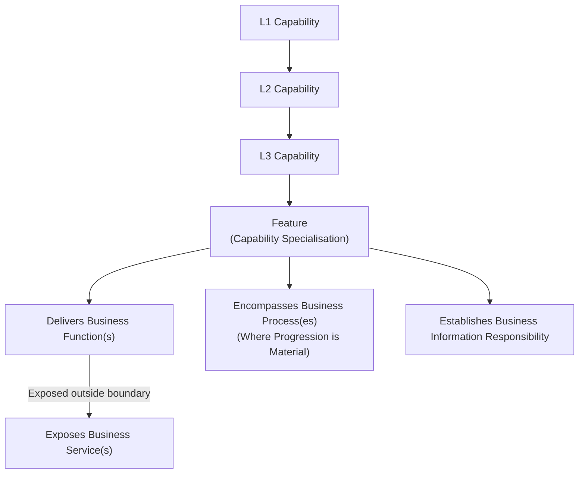

# Domain 03 — Business Architecture

## Overview & Pedagogical Guide

Domain 03 — Business Architecture defines the canonical business baseline for the Harmonia Health Integration Environment (HIE). It operationalises the strategic capability framework established in **[Domain 02 (Strategy)](../02-strategy/README.md)** without prematurely introducing software component designs, data schemas, or technology platforms.

Where Domain 02 answers **what capabilities are required to respond to healthcare needs**, Domain 03 defines **how business participants interact, how capability boundaries deliver and expose behaviour, how operational lifecycles progress, and how conceptual information responsibility is partitioned**.

```text
       WHY?
        │  [Domain 01: Motivation]
        ▼  Axioms, Strategic Drivers, Enduring Principles
WHAT CAPABILITIES ARE NEEDED?
        │  [Domain 02: Strategy]
        ▼  Value Streams, Capability Tiers (L1 → L2 → L3 → Feature)
HOW DOES THE BUSINESS OPERATE?
        │  [Domain 03: Business Architecture] (This Domain)
        ▼  Actors, Roles, Collaborations, Interactions, Functions, Services, Processes, Information Ownership
HOW IS INFORMATION STRUCTURED?
        │  [Domain 04: Information Architecture]
        ▼  Conceptual, Logical & Interoperability Information Models
HOW IS SOFTWARE BEHAVIOUR ALLOCATED?
        │  [Domain 05: Application Architecture]
        ▼  Subsystems, Components, Services, Application State Demarcations
```

---

## 1. Scope & Architectural Purpose

Domain 03 establishes the technology-neutral, vendor-independent R1 Business Architecture baseline. It serves as the primary contract for all subsequent technical architecture domains:
- **Information Architecture (Domain 04)**: Directly realises conceptual Information Responsibilities into governed domain models and interchange profiles.
- **Application Architecture (Domain 05)**: Maps capability-scoped Business Functions, Services, and Processes to software components while strictly honouring architectural ownership boundaries.
- **Integration Architecture (Domain 06)**: Implements Business Interactions across interoperability membranes and communication topologies.

### Core Architectural Axioms Governed in Domain 03
1. **Care Enablement vs. Clinical Practice**: Harmonia is a regional Health Integration Environment that enables, coordinates, and contextualises care; it does not practice medicine, prescribe medications, make autonomous diagnostic decisions, or displace clinical accountability.
2. **Authoritative Bounded Ownership**: Every Business Function, exposed Business Service, Business Process, and item of Business Information is anchored to an unambiguous owning Capability context. Transporting, caching, indexing, coordinating, presenting, or securing information does not transfer conceptual ownership.
3. **Purity of Abstraction**: Domain 03 contains zero application component names, zero runtime class/database names, zero transport protocol references, and zero premature FHIR resource bindings.

---

## 2. Business Architecture Metamodel Overview

Harmonia adopts an explicit Business Architecture metamodel bridging capabilities to functional behaviour and operational lifecycles:



### Key Metamodel Principles
- **Four-Tier Hierarchy**: `L1 Capability` $\to$ `L2 Capability` $\to$ `L3 Capability` $\to$ `Feature`. A **Feature** is a fine-grained capability specialisation that inherits full capability semantics.
- **Function vs. Service**:
  - A **Business Function** is behaviour delivered *within* its owning Capability or Feature boundary.
  - A **Business Service** is behaviour *exposed outside* the owning boundary for consumption by other Capabilities or external participants. Ownership of the behaviour remains with the exposing Capability.
- **Justified Business Processes**: Business Processes are modeled *only* where an activity instance materially progresses through state lifecycles and outcomes. Generic operational tasks (search, lookup, mapping, presentation) do not have processes.
- **Cross-Cutting Responsibility Rule**: *Cross-cutting concern does not imply cross-cutting responsibility*. Capabilities depend on Services delivered by other bounded Capabilities rather than co-owning those concerns.

---

## 3. Pedagogical Reading Path & Navigation

Domain 03 is organised into structured sections designed to guide enterprise architects, domain modelers, clinical informaticians, and system engineers:

```text
docs/markdown/03-business-architecture/
├── README.md                                    # This domain orientation & navigation guide
├── metamodel/
│   └── business-architecture-metamodel.md       # Metamodel rules, grammar, function/service semantics
├── actors-roles/
│   ├── actors.md                                # 7 Business Actor categories & definitions
│   └── roles.md                                 # 6 Business Role families & guardrails
├── collaborations-interactions/
│   ├── collaborations.md                        # 7 Business Collaborations & composition model
│   └── interactions.md                          # 10 interaction categories & R1 catalogue
├── behaviours/
│   ├── index.md                                 # Capability-scoped behaviour structuring principles
│   ├── 01-entity-management.md                  # Entity Management Functions & Services
│   ├── 02-service-administration.md             # Service Administration Functions & Services
│   ├── 03-service-delivery.md                   # Service Delivery Functions & Services (care enablement)
│   ├── 04-health-service-operations.md          # Health Service Operations Functions & Services (logistics)
│   └── 05-intrinsic-enablement.md               # Intrinsic / Shared Enablement Functions & Services
├── processes/
│   └── business-processes.md                    # 16 Principal Business Processes & state models
├── information-responsibility/
│   └── information-responsibility.md            # Conceptual Business Information Responsibility matrix
└── dependencies/
    └── cross-capability-dependencies.md         # Inter-capability dependencies & service exposure matrix
```

### Navigating the Documentation Suite

1. **[Metamodel & Modelling Rules](metamodel/business-architecture-metamodel.md)**: Establishes the formal architectural definitions, the Qualified Architectural Reference Grammar (`<EntityType>#<Entity>-as-<Role>[#<ContextQualifier>]`), and ownership preservation rules.
2. **[Business Actors](actors-roles/actors.md) & [Business Roles](actors-roles/roles.md)**: Defines the 7 participant categories (`Person`, `Group`, `Organisation`, `Organisational Unit`, `Government / Regulatory Body`, `System`, `Device`) and the 6 functional role families.
3. **[Business Collaborations](collaborations-interactions/collaborations.md) & [Business Interactions](collaborations-interactions/interactions.md)**: Details collective collaborative structures and the complete 10-category catalogue of business interactions with boundary guardrails.
4. **Capability-Scoped Behaviours across Five Contextual Views**:
   - **[Overview](behaviours/index.md)**: Principles of capability scoping without disconnected global catalogues.
   - **[01. Entity Management](behaviours/01-entity-management.md)**: Client identity, healthcare subjects, provider registries, organisations, locations, and clinical devices.
   - **[02. Service Administration](behaviours/02-service-administration.md)**: Referrals, scheduling notifications, encounters, closed-loop orders, diagnostics, medications, and clinical documents.
   - **[03. Service Delivery](behaviours/03-service-delivery.md)**: Clinical service enablement contexts across primary, acute, emergency, inpatient, and virtual care.
   - **[04. Health Service Operations](behaviours/04-health-service-operations.md)**: Operational logistics, ward/theatre operations, bed turnover, dispatch, transport, and discharge coordination.
   - **[05. Intrinsic / Shared Enablement](behaviours/05-intrinsic-enablement.md)**: Platform-wide longitudinal clinical record aggregation, information exchange, security control, collaboration, and workflow coordination.
5. **[Principal Business Processes](processes/business-processes.md)**: Specifies the 16 justified R1 operational state progression lifecycles.
6. **[Business Information Responsibility](information-responsibility/information-responsibility.md)**: Codifies conceptual data stewardship and ownership invariants.
7. **[Cross-Capability Dependencies](dependencies/cross-capability-dependencies.md)**: Maps inter-capability service consumption relationships and high-level architectural topologies.

---

## 4. Relationship to Strategy Domain 02

Domain 03 derives directly from the Business Enabling Capabilities articulated in:
- **`docs/markdown/02-strategy/capabilities/business-enabling-capabilities.md`**

All 110 atomic features across Harmonia-Core and Harmonia-Relevant capabilities retain their canonical naming and structural alignment. Domain 03 enriches these features with concrete Functions, exposed Services, stateful Processes, and Information Responsibilities while leaving the Strategy baseline intact.
