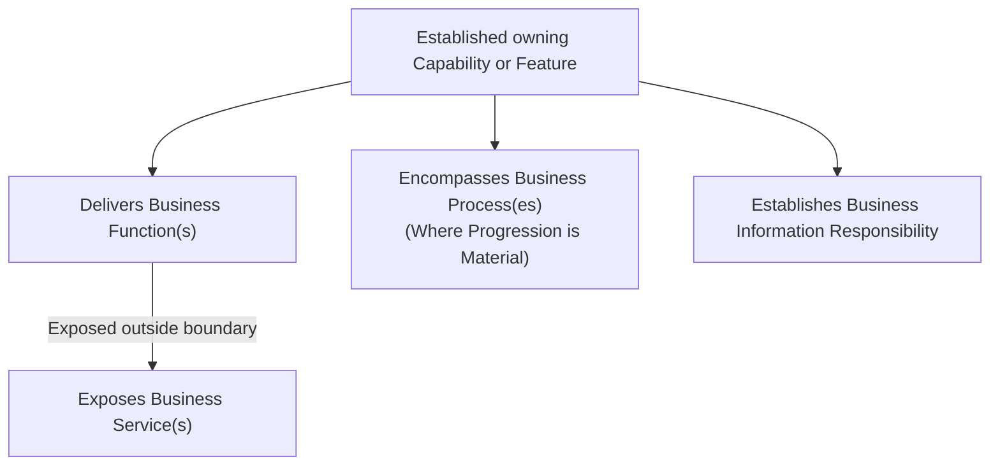

# Domain 03 — Business Architecture

## Overview & Pedagogical Guide

Domain 03 — Business Architecture defines the canonical business baseline for the Harmonia Health Integration Environment (HIE). It operationalises the strategic capability framework established in **[Domain 02 (Strategy)](../02-strategy/README.md)** without prematurely introducing software component designs, data schemas, or technology platforms.

Where Domain 02 answers **what capabilities are required to respond to healthcare needs**, Domain 03 defines **how business participants interact, how capability boundaries deliver and expose behaviour, how operational lifecycles progress, and how conceptual information responsibility is partitioned**.

```text
       WHY?
        │  [Domain 01: Motivation]
        ▼  Axioms, Strategic Drivers, Enduring Principles
WHAT CAPABILITIES ARE NEEDED?
        │  [Domain 02: Strategy]
        ▼  Value Streams, established Capabilities & Features (unresolved ancestry preserved)
HOW DOES THE BUSINESS OPERATE?
        │  [Domain 03: Business Architecture] (This Domain)
        ▼  Actors, Roles, Collaborations, Interactions, Functions, Services, Processes, Information Ownership
HOW IS INFORMATION STRUCTURED?
        │  [Domain 04: Information Architecture]
        ▼  Conceptual information meaning, relationships & responsibility traceability
HOW IS SOFTWARE BEHAVIOUR ALLOCATED?
        │  [Domain 05: Application Architecture]
        ▼  Subsystems, Components, Services, Application State Demarcations
```

---

## 1. Scope & Architectural Purpose

Domain 03 is the current technology-neutral, vendor-independent **semantically complete Business Architecture for the agreed R1.x/R2.x scope**, following the authorised 2026-10-09 Step 3 residual adjudication and capacity review. Completion is assessed against the [Domain Completion Gate](../architecture-completion-plan.md#domain-completion-gate) and the [metamodel's semantic sufficiency rules](metamodel/business-architecture-metamodel.md#9-r1xr2x-semantic-sufficiency-boundary); it is not an exhaustive traceability or identifier-allocation claim. Earlier CLOSED/FROZEN descriptions concern a previous baseline and do not prohibit separately authorised governed change. This orientation declares no new freeze/refreeze or programme-wide baseline completion.

It serves as the primary Business contract for subsequent architectural domains:
- **Information Architecture (Domain 04)**: Formalises conceptual Information Responsibilities into governed conceptual meaning, semantic relationships and traceability. Interoperability profiles are downstream in Domain 06.
- **Application Architecture (Domain 05)**: Maps capability-scoped Business Functions, Services, and Processes to software components while strictly honouring architectural ownership boundaries.
- **Integration Architecture (Domain 06)**: Implements Business Interactions across interoperability membranes and communication topologies.

### Core Architectural Axioms Governed in Domain 03
1. **Care Enablement vs. Clinical Practice**: Harmonia is a regional Health Integration Environment that enables, coordinates, and contextualises care; it does not practice medicine, prescribe medications, make autonomous diagnostic decisions, or displace clinical accountability.
2. **Authoritative Bounded Ownership**: Every Business Function, exposed Business Service, Business Process, and item of Business Information is anchored to an unambiguous owning Capability context. Transporting, caching, indexing, coordinating, presenting, or securing information does not transfer conceptual ownership.
3. **Purity of Abstraction**: Domain 03 defines Business meaning and responsibility independently of application components, implementation structures and premature FHIR bindings. Terms such as cache, index, routing, topic and session are interpreted by their established Business meaning; technological connotations alone do not prescribe implementation.

---

## 2. Business Architecture Metamodel Overview

Harmonia adopts an explicit Business Architecture metamodel bridging capabilities to functional behaviour and operational lifecycles:



### Key Metamodel Principles
- **Capability Decomposition**: CT1 / CT2 / CT3 / FT distinguish Capability Tiers and Feature type from derivation stages. A Feature inherits Capability semantics. Behaviour may anchor directly to its established owning Capability or Feature; affected tier, complete ancestry and structural Canonical IDs remain unresolved under approved K9.
- **Function vs. Service**:
  - A **Business Function** is behaviour delivered *within* its owning Capability or Feature boundary.
  - A **Business Service** is behaviour *exposed outside* the owning boundary for consumption by other Capabilities or external participants. Ownership of the behaviour remains with the exposing Capability.
- **Justified Business Processes**: Business Processes are modeled *only* where an activity instance materially progresses through state lifecycles and outcomes. Generic operational tasks (search, lookup, mapping, presentation) do not have processes.
- **Cross-Cutting Responsibility Rule**: *Cross-cutting concern does not imply cross-cutting responsibility*. Capabilities depend on Services delivered by other bounded Capabilities rather than co-owning those concerns.

---

## 3. Pedagogical Reading Path & Navigation

Domain 03 is organised into structured sections designed to guide enterprise architects, domain modelers, clinical informaticians, and system engineers:

```text
docs/markdown/03-business-architecture/
├── README.md                                    # This domain orientation & navigation guide
├── metamodel/
│   └── business-architecture-metamodel.md       # Metamodel rules, grammar, function/service semantics
├── actors-roles/
│   ├── actors.md                                # 7 Business Actor categories & definitions
│   └── roles.md                                 # 6 Role families; legal Guardian and two assurance Roles
├── collaborations-interactions/
│   ├── collaborations.md                        # 7 Business Collaborations & composition model
│   └── interactions.md                          # 10 categories; three approved assurance Interactions
├── behaviours/
│   ├── index.md                                 # Capability-scoped behaviour structuring principles
│   ├── 01-entity-management.md                  # Entity Management Functions & Services
│   ├── 02-service-administration.md             # Service Administration Functions & Services
│   ├── 03-service-delivery.md                   # Service Delivery Functions & Services (care enablement)
│   ├── 04-health-service-operations.md          # Health Service Operations Functions & Services (logistics)
│   ├── 05-intrinsic-enablement.md               # Intrinsic / Shared Enablement Functions & Services
│   └── health-service-assurance.md              # Two Roles, five Functions, three Services & assurance boundaries
├── processes/
│   └── business-processes.md                    # 19 Processes; assurance lifecycle detail unresolved
├── information-responsibility/
│   └── information-responsibility.md            # Conceptual Business Information Responsibility matrix
└── dependencies/
    └── cross-capability-dependencies.md         # Inter-capability dependencies & service exposure matrix
```

### Navigating the Documentation Suite

1. **[Metamodel & Modelling Rules](metamodel/business-architecture-metamodel.md)**: Establishes the formal architectural definitions, the Qualified Architectural Reference Grammar (`<EntityType>#<Entity>-as-<Role>[#<ContextQualifier>]`), and ownership preservation rules.
2. **[Business Actors](actors-roles/actors.md) & [Business Roles](actors-roles/roles.md)**: Defines the 7 participant categories (`Person`, `Group`, `Organisation`, `Organisational Unit`, `Government / Regulatory Body`, `System`, `Device`) and the 6 functional role families.
3. **[Business Collaborations](collaborations-interactions/collaborations.md) & [Business Interactions](collaborations-interactions/interactions.md)**: Details collective collaborative structures, ten established Interaction categories and the three approved assurance Interactions with boundary guardrails.
4. **Capability-Scoped Behaviours across Five Contextual Views**:
   - **[Overview](behaviours/index.md)**: Principles of capability scoping without disconnected global catalogues.
   - **[01. Entity Management](behaviours/01-entity-management.md)**: Client identity, healthcare subjects, provider registries, organisations, locations, and clinical devices.
   - **[02. Service Administration](behaviours/02-service-administration.md)**: Referrals, scheduling notifications, encounters, closed-loop orders, diagnostics, medications, and clinical documents.
   - **[03. Service Delivery](behaviours/03-service-delivery.md)**: Clinical service enablement contexts across primary, acute, emergency, inpatient, and virtual care.
   - **[04. Health Service Operations](behaviours/04-health-service-operations.md)**: Operational logistics, ward/theatre operations, bed turnover, dispatch, transport, discharge coordination and the distinct clinical qualification checkpoint.
   - **[05. Intrinsic / Shared Enablement](behaviours/05-intrinsic-enablement.md)**: Platform-wide longitudinal clinical record aggregation, information exchange, security control, collaboration, and workflow coordination.
5. **[Principal Business Processes](processes/business-processes.md)**: Retains sixteen pre-existing Processes with authorised reconciliation and adds three approved assurance Processes, bringing the R1.x/R2.x catalogue to nineteen. The approved assurance progression is sufficient for this baseline; further lifecycle detail remains unestablished.
6. **[Business Information Responsibility](information-responsibility/information-responsibility.md)**: Codifies conceptual data stewardship and ownership invariants.
7. **[Cross-Capability Dependencies](dependencies/cross-capability-dependencies.md)**: Maps inter-capability service consumption relationships and high-level architectural topologies.

**[Bounded Health Service Assurance Derivation](behaviours/health-service-assurance.md)** preserves **Service Assurance Modeller**, **Service Guardian** and the five approved [Functions](behaviours/health-service-assurance.md#3-direct-capability-scoped-responsibility-consequences), and establishes exactly three [Processes](processes/business-processes.md#6-health-service-assurance-processes), three [Services and their consumers](behaviours/health-service-assurance.md#5-approved-governed-assurance-business-services) and three [Interactions and participants](collaborations-interactions/interactions.md#5-approved-service-assurance-interactions). All five approved requesting/recipient Roles remain within their authority; only System Steward consumes assurance status. Status concerns activity progression, distinct from an adjudicated finding/conclusion. Outcome communication is not mandatory broadcast or responsibility for recipient action. [Financial Governance is deliberately excluded](behaviours/health-service-assurance.md#financial-governance-exclusion) and [assurance does not recurse over its own execution](behaviours/health-service-assurance.md#assurance-non-recursion-boundary).

The [Governance Authority / modelling / Guardianship responsibility model](behaviours/health-service-assurance.md#2-governance-management-guardianship-and-clinical-authority), [EC-02 / EC-14 context contribution](behaviours/health-service-assurance.md#41-context-management-contribution), conceptual Assurance Definition and legal Guardian distinction remain intact. Detailed Process states, further Services/Interactions/Functions, evidence exchange, Collaborations, approval allocation, formal information modelling and downstream allocation remain [unresolved](behaviours/health-service-assurance.md#6-additional-business-elements-not-yet-established). No freeze/refreeze is performed.

The current assurance authority and progression boundaries are adjudicated sufficient for R1.x/R2.x Business Architecture. Their unestablished details do not require additional catalogue elements. Relationships are significance-driven; absent exhaustive participation, exposure or Value Stream matrices do not establish missing Business architecture. Historical/deferred metamodel, publication and Twin/execution material remains reconciliation input rather than a competing baseline. Canonical axiom consolidation is a separate governance task.

---

## 4. Relationship to Strategy Domain 02

Domain 03 derives directly from the Business Enabling Capabilities articulated in:
- **`docs/markdown/02-strategy/capabilities/business-enabling-capabilities.md`**

The 137 established Strategy Features retain their canonical names and identifiers. Domain03 preserves established Capability-scoped Functions, Services, Processes and Information Responsibilities. Feature association requires semantic evidence: shared subject matter, Capability context or clinical purpose does not establish containment, equivalence, specialisation or realisation. Where not established, the association remains explicitly unestablished without a replacement Feature or invented ancestry.

Domain-specific Features may be sufficiently realised through reusable capability composition and configured workflow/Praxis. The [SD-03, SD-08 and SD-14 adjudications](behaviours/03-service-delivery.md#residual-feature-sufficiency) require no specialised clinical-capture, inpatient-tracking or screening-recall Function. The [HSO capacity review](behaviours/04-health-service-operations.md#capacity-management-responsibility-boundary) expresses the six service-delivery capacity contexts individually; outpatient arrival contributes to outpatient capacity, and mobile work-management integration confers no clinical-work management. The [entity-specific Digital Twin coordination rule](../02-strategy/strategic-views/logical-component-responsibilities.md#entity-specific-operational-coordination) remains with its existing Strategy construct, without Business Actor or execution allocation here.

The [approved Health Service Assurance Strategy](../02-strategy/capability-maps/health-service-assurance-derivation.md) establishes BC-18's Assurance Design, Assurance Criteria Management and Governed Assurance responsibilities and collaborative Enterprise Capability contributions including EC-02 Context Management and EC-14 Service Guardian. Approved human review supplies the bounded Domain03 Role/Function and Process/Service/Interaction decisions documented in the [Business Architecture derivation](behaviours/health-service-assurance.md); the Strategy contribution matrix alone does not name these behaviours or expose Services. Governance authority, assurance modelling, independent Guardianship, operational management and clinical authority remain separate. Contextual-view placement, Capability Tier, ancestry, Feature decomposition and structural IDs remain unresolved. This derivation stops before Information Architecture and introduces no application or implementation allocation.

## 5. Completion Boundary and Retained Uncertainty

The five residual semantic matters are resolved for the agreed Business scope by explicit human sufficiency/boundary decisions and the bounded HSO reconciliation. No remaining genuine unresolved Business requirement or blocking deterministic documentation defect was identified in that review. This is a positive semantic completion assessment, not a claim that every architectural relationship has been established.

Unestablished exact provider/exposure contracts, detailed execution/lifecycle applicability and formal information or application allocation remain downstream concerns. Capability tiers, ancestry, structural IDs, unsupported individual Feature associations, unnecessary exhaustive mappings and adjudicated assurance detail remain deliberately unestablished and nonblocking for this baseline. They SHALL NOT be filled through inference.

Later governance/consolidation includes the proposed `FEAT-HSO-16` name correction to `Mobile Work Task Management Integration`, review of the over-specialised SD-03 framing, historical publication/metamodel reconciliation and Canonical Architectural Axioms Migration. The clinical-work boundary is already established independently of that pending name decision. Required Business meanings and these dispositions are canonical; historical material supplies no alternative Business authority. The central axioms retain their current authority pending their separately authorised migration. Domain04 reconciliation and final programme corpus/baseline closure require subsequent bounded authorisation.
